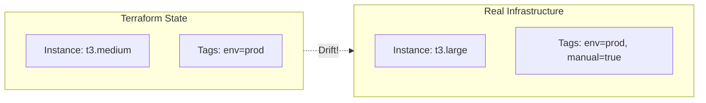

# How to Detect Drift in Terraform

Author: [nawazdhandala](https://www.github.com/nawazdhandala)

Tags: Terraform, Drift Detection, Infrastructure as Code, DevOps, Compliance

Description: Learn how to detect and handle configuration drift in Terraform-managed infrastructure. Covers manual detection, automated monitoring, remediation strategies, and prevention techniques.

---

Drift occurs when real infrastructure diverges from what Terraform expects. Someone modifies a resource through the console, an automated process makes changes, or external events alter configurations. Detecting and handling drift is essential for maintaining infrastructure as code integrity.

## What Is Drift?



Drift happens when:
- Manual changes via cloud console
- Scripts or automation outside Terraform
- Auto-scaling modifies resources
- Provider or API updates
- Another Terraform state manages the same resource

## Detecting Drift with terraform plan

The simplest drift detection is running `terraform plan`:

```bash
terraform plan

# Output shows drift:
# aws_instance.web has changed
#   ~ instance_type = "t3.medium" -> "t3.large"
#   ~ tags = {
#       + "manual" = "true"
#       # (1 unchanged element hidden)
#     }
#
# Note: Objects have changed outside of Terraform
```

### Refresh Before Plan

Terraform refreshes state automatically, but you can force it:

```bash
# Refresh state without planning
terraform refresh

# Or use plan with refresh
terraform plan -refresh=true  # Default behavior
```

### Detailed Exit Codes

Use exit codes for automation:

```bash
terraform plan -detailed-exitcode

# Exit codes:
# 0 = No changes (no drift)
# 1 = Error
# 2 = Changes detected (drift or pending changes)
```

## Automated Drift Detection

### Scheduled Drift Checks

```yaml
# .github/workflows/drift-detection.yml

name: Drift Detection

on:
  schedule:
    - cron: '0 8 * * *'  # Daily at 8 AM UTC
  workflow_dispatch:      # Allow manual triggers

jobs:
  detect-drift:
    runs-on: ubuntu-latest

    steps:
      - uses: actions/checkout@v4

      - name: Setup Terraform
        uses: hashicorp/setup-terraform@v3

      - name: Configure AWS credentials
        uses: aws-actions/configure-aws-credentials@v4
        with:
          role-to-assume: ${{ secrets.AWS_ROLE_ARN }}
          aws-region: us-east-1

      - name: Terraform Init
        run: terraform init

      - name: Check for Drift
        id: drift
        run: |
          terraform plan -detailed-exitcode -out=plan.out 2>&1 | tee plan.txt
          echo "exit_code=$?" >> $GITHUB_OUTPUT
        continue-on-error: true

      - name: Report Drift
        if: steps.drift.outputs.exit_code == '2'
        run: |
          echo "Drift detected! Creating issue..."
          gh issue create \
            --title "Infrastructure Drift Detected - $(date +%Y-%m-%d)" \
            --body "$(cat plan.txt)" \
            --label "drift,infrastructure"
        env:
          GH_TOKEN: ${{ secrets.GITHUB_TOKEN }}

      - name: Notify Slack
        if: steps.drift.outputs.exit_code == '2'
        uses: slackapi/slack-github-action@v1
        with:
          payload: |
            {
              "text": "Infrastructure drift detected!",
              "blocks": [
                {
                  "type": "section",
                  "text": {
                    "type": "mrkdwn",
                    "text": "*Infrastructure Drift Detected*\nRun `terraform plan` to see details."
                  }
                }
              ]
            }
        env:
          SLACK_WEBHOOK_URL: ${{ secrets.SLACK_WEBHOOK }}
```

### Multiple Environment Detection

```yaml
jobs:
  detect-drift:
    strategy:
      matrix:
        environment: [dev, staging, prod]

    runs-on: ubuntu-latest
    defaults:
      run:
        working-directory: environments/${{ matrix.environment }}

    steps:
      - uses: actions/checkout@v4
      # ... rest of steps
```

## Terraform Cloud Drift Detection

Terraform Cloud has built-in drift detection:

```hcl
# In Terraform Cloud workspace settings
# Enable "Automatic speculative plans"
# Set "Drift detection" to run on schedule

terraform {
  cloud {
    organization = "mycompany"

    workspaces {
      name = "production"
    }
  }
}
```

Terraform Cloud:
- Runs scheduled drift detection
- Sends notifications for detected drift
- Shows drift in the UI
- Can auto-queue remediation runs

## Analyzing Drift

### Export Plan for Analysis

```bash
# Generate plan in JSON format
terraform plan -out=plan.tfplan
terraform show -json plan.tfplan > plan.json

# Parse with jq
jq '.resource_changes[] | select(.change.actions | contains(["update"]))' plan.json
```

### Drift Report Script

```bash
#!/bin/bash
# drift-report.sh

set -e

echo "=== Terraform Drift Report ==="
echo "Generated: $(date)"
echo ""

terraform init -input=false > /dev/null

# Capture plan output
PLAN_OUTPUT=$(terraform plan -detailed-exitcode 2>&1) || EXIT_CODE=$?

if [ "${EXIT_CODE:-0}" -eq 0 ]; then
    echo "Status: No drift detected"
elif [ "${EXIT_CODE:-0}" -eq 2 ]; then
    echo "Status: DRIFT DETECTED"
    echo ""
    echo "Changes:"
    echo "$PLAN_OUTPUT" | grep -A 100 "Terraform will perform"
else
    echo "Status: Error during plan"
    echo "$PLAN_OUTPUT"
fi
```

## Handling Drift

### Option 1: Accept Terraform's Desired State

Apply Terraform to bring infrastructure back to desired state:

```bash
# Review the changes
terraform plan

# Apply to fix drift
terraform apply
```

### Option 2: Accept the Drifted State

Update Terraform configuration to match reality:

```hcl
# Update config to match what exists
resource "aws_instance" "web" {
  instance_type = "t3.large"  # Changed from t3.medium to match drift

  tags = {
    Name   = "web-server"
    env    = "prod"
    manual = "true"  # Added to match drift
  }
}
```

Then verify no changes:

```bash
terraform plan
# No changes. Your infrastructure matches the configuration.
```

### Option 3: Refresh State Only

Update state to match reality without changing config:

```bash
# Refresh state from real infrastructure
terraform apply -refresh-only

# This updates state but doesn't change infrastructure
```

### Option 4: Import Missing Resources

If a resource was created outside Terraform:

```bash
# Import the resource into state
terraform import aws_instance.new_server i-1234567890abcdef0

# Then create matching configuration
```

## Preventing Drift

### 1. Restrict Console Access

Use IAM policies to limit manual changes:

```json
{
  "Version": "2012-10-17",
  "Statement": [
    {
      "Effect": "Deny",
      "Action": [
        "ec2:ModifyInstanceAttribute",
        "ec2:TerminateInstances"
      ],
      "Resource": "*",
      "Condition": {
        "StringNotEquals": {
          "aws:PrincipalTag/terraform": "true"
        }
      }
    }
  ]
}
```

### 2. Use Lifecycle Rules

Ignore expected changes:

```hcl
resource "aws_instance" "web" {
  # ...

  lifecycle {
    ignore_changes = [
      # Ignore AMI changes from auto-updates
      ami,
      # Ignore user-managed tags
      tags["LastModified"],
    ]
  }
}
```

### 3. Tag Terraform-Managed Resources

```hcl
locals {
  terraform_tags = {
    ManagedBy   = "terraform"
    TFWorkspace = terraform.workspace
    TFModule    = path.module
  }
}

resource "aws_instance" "web" {
  # ...
  tags = merge(local.terraform_tags, var.additional_tags)
}
```

### 4. Documentation and Training

Document that resources are Terraform-managed:

```hcl
resource "aws_instance" "web" {
  # ...

  tags = {
    Name        = "web-server"
    Description = "MANAGED BY TERRAFORM - Do not modify manually"
  }
}
```

## Drift Detection Tools

### driftctl (Deprecated but Useful Pattern)

```bash
# Scan for unmanaged resources
driftctl scan

# Example output:
# Found 10 resources not managed by Terraform:
# - aws_s3_bucket: manual-bucket
# - aws_security_group: temp-sg
```

### AWS Config Rules

```hcl
# AWS Config rule to detect non-Terraform resources
resource "aws_config_config_rule" "require_terraform_tag" {
  name = "require-terraform-tag"

  source {
    owner             = "AWS"
    source_identifier = "REQUIRED_TAGS"
  }

  input_parameters = jsonencode({
    tag1Key   = "ManagedBy"
    tag1Value = "terraform"
  })
}
```

### Custom Drift Reporter

```python
# drift_reporter.py
import subprocess
import json
import boto3

def check_drift(directory):
    """Run terraform plan and parse results."""
    result = subprocess.run(
        ["terraform", "plan", "-json", "-out=plan.tfplan"],
        cwd=directory,
        capture_output=True,
        text=True
    )

    changes = []
    for line in result.stdout.split('\n'):
        if line:
            try:
                data = json.loads(line)
                if data.get('@level') == 'info' and 'planned_change' in data:
                    changes.append(data)
            except json.JSONDecodeError:
                pass

    return changes

def report_drift(changes):
    """Send drift report to SNS."""
    if not changes:
        return

    sns = boto3.client('sns')
    sns.publish(
        TopicArn='arn:aws:sns:us-east-1:123456789012:drift-alerts',
        Message=json.dumps(changes, indent=2),
        Subject='Terraform Drift Detected'
    )

if __name__ == '__main__':
    changes = check_drift('/path/to/terraform')
    report_drift(changes)
```

## Best Practices

1. **Run drift detection daily** in production
2. **Alert immediately** when drift is detected
3. **Document all drift** incidents and resolutions
4. **Restrict manual access** to Terraform-managed resources
5. **Use ignore_changes** for expected drift
6. **Tag all resources** as Terraform-managed
7. **Review drift sources** and address root causes

---

Drift detection is an ongoing process, not a one-time setup. Automate detection, respond quickly to alerts, and continuously improve your processes to minimize drift sources. The goal is infrastructure that matches your Terraform configuration at all times.
