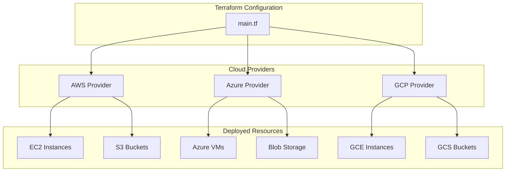
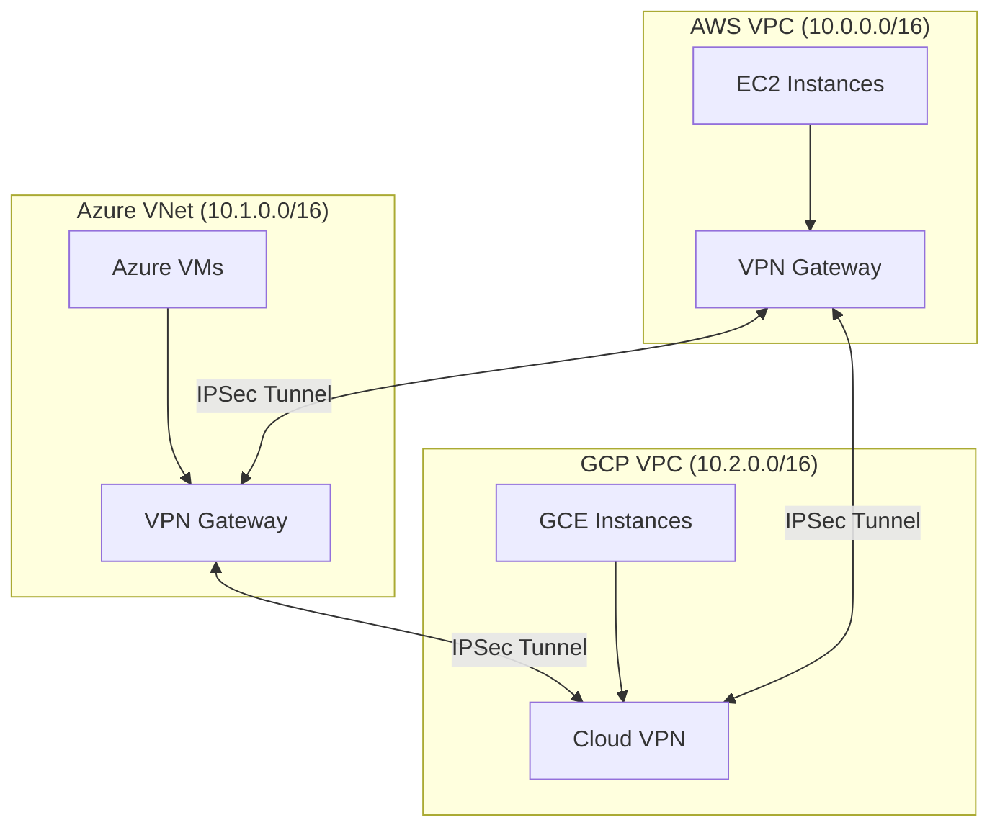
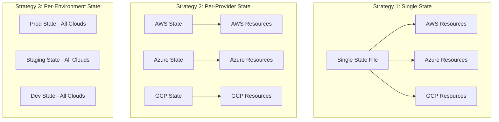

# How to Use Terraform with Multiple Cloud Providers

Author: [nawazdhandala](https://github.com/nawazdhandala)

Tags: Terraform, Multi-Cloud, AWS, Azure, GCP, Infrastructure as Code, DevOps, Cloud Architecture

Description: A comprehensive guide to managing infrastructure across AWS, Azure, and GCP using Terraform, covering provider configuration, resource abstraction, cross-cloud networking, version management, and state strategies.

---

> "Multi-cloud isn't about using every cloud for everything. It's about leveraging each provider's strengths while maintaining a unified infrastructure workflow. Terraform makes this possible by providing a single language to orchestrate resources across any cloud."

## Why Multi-Cloud with Terraform?

Organizations adopt multi-cloud strategies for several compelling reasons:

- **Avoid vendor lock-in** - Negotiate better pricing and maintain flexibility
- **Leverage best-of-breed services** - Use GCP for ML, AWS for compute, Azure for enterprise integration
- **Improve resilience** - Survive regional or provider-wide outages
- **Meet compliance requirements** - Data residency and sovereignty requirements
- **Acquire companies** - Inherited infrastructure from acquisitions

Terraform's provider model makes it the ideal tool for multi-cloud management. You write HCL once and deploy to any supported provider.



## Provider Configuration

The foundation of multi-cloud Terraform is proper provider configuration. Each cloud provider requires its own authentication and configuration block.

### Basic Multi-Provider Setup

```hcl
# versions.tf - Pin provider versions for reproducibility
terraform {
  required_version = ">= 1.5.0"

  required_providers {
    # AWS provider for EC2, S3, RDS, etc.
    aws = {
      source  = "hashicorp/aws"
      version = "~> 5.0"
    }

    # Azure provider for VMs, Blob Storage, etc.
    azurerm = {
      source  = "hashicorp/azurerm"
      version = "~> 3.0"
    }

    # GCP provider for GCE, GCS, etc.
    google = {
      source  = "hashicorp/google"
      version = "~> 5.0"
    }
  }
}

# providers.tf - Configure each provider with authentication
# AWS uses IAM credentials or instance profiles
provider "aws" {
  region = var.aws_region

  # Use named profile for local development
  # profile = "my-aws-profile"

  # Tags applied to all resources
  default_tags {
    tags = {
      Environment = var.environment
      ManagedBy   = "terraform"
      Project     = var.project_name
    }
  }
}

# Azure requires feature registration and subscription context
provider "azurerm" {
  features {
    # Soft delete protection for key vaults
    key_vault {
      purge_soft_delete_on_destroy = false
    }

    # Prevent accidental resource group deletion
    resource_group {
      prevent_deletion_if_contains_resources = true
    }
  }

  subscription_id = var.azure_subscription_id
  tenant_id       = var.azure_tenant_id
}

# GCP requires project context
provider "google" {
  project = var.gcp_project_id
  region  = var.gcp_region

  # Use application default credentials
  # or specify credentials file path
}
```

### Multiple Regions with Provider Aliases

Deploy to multiple regions within the same cloud using provider aliases.

```hcl
# providers.tf - Multi-region AWS setup
# Primary region for main workloads
provider "aws" {
  alias  = "us_east"
  region = "us-east-1"
}

# Secondary region for disaster recovery
provider "aws" {
  alias  = "us_west"
  region = "us-west-2"
}

# EU region for GDPR compliance
provider "aws" {
  alias  = "eu_west"
  region = "eu-west-1"
}

# main.tf - Use aliases to deploy to specific regions
# Primary application servers in US East
resource "aws_instance" "primary" {
  provider = aws.us_east

  ami           = data.aws_ami.ubuntu_us_east.id
  instance_type = "t3.medium"

  tags = {
    Name = "primary-app-server"
    Role = "primary"
  }
}

# DR replica in US West
resource "aws_instance" "dr_replica" {
  provider = aws.us_west

  ami           = data.aws_ami.ubuntu_us_west.id
  instance_type = "t3.medium"

  tags = {
    Name = "dr-app-server"
    Role = "disaster-recovery"
  }
}

# EU workloads for data residency
resource "aws_instance" "eu_worker" {
  provider = aws.eu_west

  ami           = data.aws_ami.ubuntu_eu_west.id
  instance_type = "t3.medium"

  tags = {
    Name = "eu-app-server"
    Role = "eu-processing"
  }
}
```

## Abstracting Cloud Resources

Create reusable modules that work across providers by abstracting cloud-specific details behind consistent interfaces.

### Compute Abstraction Module

```hcl
# modules/compute/variables.tf
variable "cloud_provider" {
  description = "Target cloud provider: aws, azure, or gcp"
  type        = string

  validation {
    condition     = contains(["aws", "azure", "gcp"], var.cloud_provider)
    error_message = "cloud_provider must be aws, azure, or gcp"
  }
}

variable "instance_name" {
  description = "Name for the compute instance"
  type        = string
}

variable "instance_size" {
  description = "Normalized size: small, medium, large, xlarge"
  type        = string
  default     = "medium"
}

variable "os_type" {
  description = "Operating system: ubuntu, rhel, windows"
  type        = string
  default     = "ubuntu"
}

# modules/compute/locals.tf
# Map normalized sizes to provider-specific instance types
locals {
  # AWS instance type mapping
  aws_instance_types = {
    small  = "t3.small"
    medium = "t3.medium"
    large  = "t3.large"
    xlarge = "t3.xlarge"
  }

  # Azure VM size mapping
  azure_vm_sizes = {
    small  = "Standard_B1ms"
    medium = "Standard_B2s"
    large  = "Standard_B4ms"
    xlarge = "Standard_B8ms"
  }

  # GCP machine type mapping
  gcp_machine_types = {
    small  = "e2-small"
    medium = "e2-medium"
    large  = "e2-standard-2"
    xlarge = "e2-standard-4"
  }
}

# modules/compute/main.tf
# AWS EC2 instance - only created when cloud_provider is "aws"
resource "aws_instance" "this" {
  count = var.cloud_provider == "aws" ? 1 : 0

  ami           = data.aws_ami.selected[0].id
  instance_type = local.aws_instance_types[var.instance_size]

  tags = {
    Name = var.instance_name
  }
}

# Azure VM - only created when cloud_provider is "azure"
resource "azurerm_linux_virtual_machine" "this" {
  count = var.cloud_provider == "azure" ? 1 : 0

  name                = var.instance_name
  resource_group_name = var.azure_resource_group
  location            = var.azure_location
  size                = local.azure_vm_sizes[var.instance_size]

  admin_username = "adminuser"

  admin_ssh_key {
    username   = "adminuser"
    public_key = var.ssh_public_key
  }

  os_disk {
    caching              = "ReadWrite"
    storage_account_type = "Standard_LRS"
  }

  source_image_reference {
    publisher = "Canonical"
    offer     = "0001-com-ubuntu-server-jammy"
    sku       = "22_04-lts"
    version   = "latest"
  }

  network_interface_ids = [
    azurerm_network_interface.this[0].id
  ]
}

# GCP Compute Engine instance - only created when cloud_provider is "gcp"
resource "google_compute_instance" "this" {
  count = var.cloud_provider == "gcp" ? 1 : 0

  name         = var.instance_name
  machine_type = local.gcp_machine_types[var.instance_size]
  zone         = var.gcp_zone

  boot_disk {
    initialize_params {
      image = "ubuntu-os-cloud/ubuntu-2204-lts"
    }
  }

  network_interface {
    network = "default"

    access_config {
      # Ephemeral public IP
    }
  }
}

# modules/compute/outputs.tf
# Unified outputs regardless of provider
output "instance_id" {
  description = "The ID of the compute instance"
  value = coalesce(
    try(aws_instance.this[0].id, null),
    try(azurerm_linux_virtual_machine.this[0].id, null),
    try(google_compute_instance.this[0].instance_id, null)
  )
}

output "public_ip" {
  description = "Public IP address of the instance"
  value = coalesce(
    try(aws_instance.this[0].public_ip, null),
    try(azurerm_linux_virtual_machine.this[0].public_ip_address, null),
    try(google_compute_instance.this[0].network_interface[0].access_config[0].nat_ip, null)
  )
}

output "private_ip" {
  description = "Private IP address of the instance"
  value = coalesce(
    try(aws_instance.this[0].private_ip, null),
    try(azurerm_linux_virtual_machine.this[0].private_ip_address, null),
    try(google_compute_instance.this[0].network_interface[0].network_ip, null)
  )
}
```

### Using the Abstraction

```hcl
# main.tf - Deploy the same logical resource to different clouds
# Web server on AWS
module "web_server_aws" {
  source = "./modules/compute"

  cloud_provider = "aws"
  instance_name  = "web-server-prod"
  instance_size  = "medium"
  os_type        = "ubuntu"
}

# API server on GCP (for ML workloads)
module "api_server_gcp" {
  source = "./modules/compute"

  cloud_provider = "gcp"
  instance_name  = "api-server-prod"
  instance_size  = "large"
  os_type        = "ubuntu"
  gcp_zone       = "us-central1-a"
}

# Backend processing on Azure (enterprise integration)
module "backend_azure" {
  source = "./modules/compute"

  cloud_provider       = "azure"
  instance_name        = "backend-server-prod"
  instance_size        = "large"
  os_type              = "ubuntu"
  azure_resource_group = azurerm_resource_group.main.name
  azure_location       = "eastus"
  ssh_public_key       = file("~/.ssh/id_rsa.pub")
}
```

## Cross-Cloud Networking

Connecting resources across clouds requires careful network design. Here are patterns for secure cross-cloud communication.



### AWS to GCP VPN Connection

```hcl
# aws-vpn.tf - AWS side of the VPN connection
# Create a VPN gateway in AWS
resource "aws_vpn_gateway" "to_gcp" {
  vpc_id = aws_vpc.main.id

  tags = {
    Name = "vpn-gateway-to-gcp"
  }
}

# Customer gateway represents the GCP VPN endpoint
resource "aws_customer_gateway" "gcp" {
  bgp_asn    = 65000  # GCP's ASN
  ip_address = google_compute_ha_vpn_gateway.aws.vpn_interfaces[0].ip_address
  type       = "ipsec.1"

  tags = {
    Name = "customer-gateway-gcp"
  }
}

# VPN connection with pre-shared key
resource "aws_vpn_connection" "to_gcp" {
  vpn_gateway_id      = aws_vpn_gateway.to_gcp.id
  customer_gateway_id = aws_customer_gateway.gcp.id
  type                = "ipsec.1"
  static_routes_only  = true

  # Use a secure, randomly generated pre-shared key
  tunnel1_preshared_key = var.vpn_preshared_key

  tags = {
    Name = "vpn-connection-to-gcp"
  }
}

# Route GCP traffic through the VPN
resource "aws_vpn_connection_route" "to_gcp" {
  vpn_connection_id      = aws_vpn_connection.to_gcp.id
  destination_cidr_block = var.gcp_vpc_cidr  # e.g., "10.2.0.0/16"
}

# gcp-vpn.tf - GCP side of the VPN connection
# HA VPN Gateway for high availability
resource "google_compute_ha_vpn_gateway" "aws" {
  name    = "ha-vpn-gateway-aws"
  network = google_compute_network.main.id
  region  = var.gcp_region
}

# External VPN gateway representing AWS
resource "google_compute_external_vpn_gateway" "aws" {
  name            = "external-vpn-gateway-aws"
  redundancy_type = "SINGLE_IP_INTERNALLY_REDUNDANT"

  interface {
    id         = 0
    ip_address = aws_vpn_connection.to_gcp.tunnel1_address
  }
}

# VPN tunnel from GCP to AWS
resource "google_compute_vpn_tunnel" "to_aws" {
  name                  = "vpn-tunnel-to-aws"
  region                = var.gcp_region
  vpn_gateway           = google_compute_ha_vpn_gateway.aws.id
  peer_external_gateway = google_compute_external_vpn_gateway.aws.id
  shared_secret         = var.vpn_preshared_key

  vpn_gateway_interface = 0
  peer_external_gateway_interface = 0
}

# Cloud Router for dynamic routing
resource "google_compute_router" "main" {
  name    = "cloud-router-main"
  network = google_compute_network.main.id
  region  = var.gcp_region

  bgp {
    asn = 65000
  }
}

# Route to AWS through VPN tunnel
resource "google_compute_route" "to_aws" {
  name                = "route-to-aws"
  network             = google_compute_network.main.id
  dest_range          = var.aws_vpc_cidr  # e.g., "10.0.0.0/16"
  next_hop_vpn_tunnel = google_compute_vpn_tunnel.to_aws.id
  priority            = 1000
}
```

### Service Mesh for Cross-Cloud Communication

For application-level connectivity, consider a service mesh approach.

```hcl
# Deploy Consul for service discovery across clouds
# consul-aws.tf
resource "aws_instance" "consul_server" {
  count = 3  # 3-node cluster for HA

  ami           = data.aws_ami.consul.id
  instance_type = "t3.medium"

  user_data = templatefile("${path.module}/templates/consul-server.sh", {
    datacenter     = "aws-us-east"
    bootstrap_expect = 3
    retry_join     = local.consul_retry_join_aws
    # Join tokens for cross-datacenter federation
    wan_join       = local.consul_wan_addresses
  })

  tags = {
    Name = "consul-server-${count.index}"
  }
}

# consul-gcp.tf
resource "google_compute_instance" "consul_server" {
  count = 3

  name         = "consul-server-${count.index}"
  machine_type = "e2-medium"
  zone         = var.gcp_zone

  metadata_startup_script = templatefile("${path.module}/templates/consul-server.sh", {
    datacenter     = "gcp-us-central"
    bootstrap_expect = 3
    retry_join     = local.consul_retry_join_gcp
    wan_join       = local.consul_wan_addresses
  })

  boot_disk {
    initialize_params {
      image = "consul-server-image"
    }
  }

  network_interface {
    network = google_compute_network.main.id
  }
}
```

## Managing Provider Versions

Version pinning is critical in multi-cloud environments to prevent unexpected breaking changes.

### Version Constraints Strategy

```hcl
# versions.tf - Comprehensive version management
terraform {
  # Pin Terraform version to avoid syntax/behavior changes
  required_version = ">= 1.5.0, < 2.0.0"

  required_providers {
    # AWS provider - use pessimistic constraint for stability
    # ~> 5.0 allows 5.0.x through 5.x.x but not 6.0.0
    aws = {
      source  = "hashicorp/aws"
      version = "~> 5.0"
    }

    # Azure - more specific constraint during rapid development
    azurerm = {
      source  = "hashicorp/azurerm"
      version = ">= 3.75.0, < 4.0.0"
    }

    # GCP - allow patch updates only for critical workloads
    google = {
      source  = "hashicorp/google"
      version = "~> 5.10.0"
    }

    # Lock beta provider separately
    google-beta = {
      source  = "hashicorp/google-beta"
      version = "~> 5.10.0"
    }

    # Utility providers
    random = {
      source  = "hashicorp/random"
      version = "~> 3.5"
    }

    tls = {
      source  = "hashicorp/tls"
      version = "~> 4.0"
    }
  }
}
```

### Automated Version Updates with Dependabot

```yaml
# .github/dependabot.yml
version: 2
updates:
  - package-ecosystem: "terraform"
    directory: "/"
    schedule:
      interval: "weekly"
    # Group provider updates for easier review
    groups:
      aws-providers:
        patterns:
          - "hashicorp/aws*"
      azure-providers:
        patterns:
          - "hashicorp/azurerm*"
      gcp-providers:
        patterns:
          - "hashicorp/google*"
    # Ignore major version bumps - review manually
    ignore:
      - dependency-name: "*"
        update-types: ["version-update:semver-major"]
```

### Lock File Management

```hcl
# Always commit .terraform.lock.hcl for reproducible builds
# This file records exact provider versions and checksums

# Regenerate lock file for all platforms
# terraform providers lock -platform=linux_amd64 -platform=darwin_amd64 -platform=darwin_arm64

# .terraform.lock.hcl example (auto-generated)
provider "registry.terraform.io/hashicorp/aws" {
  version     = "5.31.0"
  constraints = "~> 5.0"
  hashes = [
    "h1:XXXXX...",
    "zh:XXXXX...",
  ]
}
```

## State Management Strategies

Multi-cloud deployments require thoughtful state management to enable team collaboration and disaster recovery.



### Remote State Backend Configuration

```hcl
# backend.tf - Use S3 for state storage (works well even for multi-cloud)
terraform {
  backend "s3" {
    bucket         = "mycompany-terraform-state"
    key            = "multi-cloud/production/terraform.tfstate"
    region         = "us-east-1"

    # Enable encryption at rest
    encrypt        = true

    # DynamoDB table for state locking
    dynamodb_table = "terraform-state-locks"

    # Use assume role for cross-account access
    role_arn       = "arn:aws:iam::123456789:role/TerraformStateAccess"
  }
}

# Alternative: Azure Blob Storage backend
# terraform {
#   backend "azurerm" {
#     resource_group_name  = "terraform-state-rg"
#     storage_account_name = "tfstatemycompany"
#     container_name       = "tfstate"
#     key                  = "multi-cloud/production.tfstate"
#   }
# }

# Alternative: GCS backend
# terraform {
#   backend "gcs" {
#     bucket = "mycompany-terraform-state"
#     prefix = "multi-cloud/production"
#   }
# }
```

### Cross-State Data Sharing

Reference resources from other state files using `terraform_remote_state`.

```hcl
# data.tf - Read outputs from other state files
# Reference network infrastructure state
data "terraform_remote_state" "network" {
  backend = "s3"

  config = {
    bucket = "mycompany-terraform-state"
    key    = "network/production/terraform.tfstate"
    region = "us-east-1"
  }
}

# Reference AWS-specific state
data "terraform_remote_state" "aws_foundation" {
  backend = "s3"

  config = {
    bucket = "mycompany-terraform-state"
    key    = "aws/foundation/terraform.tfstate"
    region = "us-east-1"
  }
}

# Use outputs from remote state
resource "aws_instance" "app" {
  ami           = data.aws_ami.ubuntu.id
  instance_type = "t3.medium"

  # VPC from network state
  subnet_id = data.terraform_remote_state.network.outputs.aws_private_subnet_id

  # Security group from AWS foundation
  vpc_security_group_ids = [
    data.terraform_remote_state.aws_foundation.outputs.app_security_group_id
  ]
}
```

### Workspace-Based State Separation

```hcl
# Use workspaces for environment separation
# terraform workspace new production
# terraform workspace new staging
# terraform workspace select production

# backend.tf - Dynamic state key based on workspace
terraform {
  backend "s3" {
    bucket         = "mycompany-terraform-state"
    key            = "multi-cloud/terraform.tfstate"  # Workspace name injected
    region         = "us-east-1"
    encrypt        = true
    dynamodb_table = "terraform-state-locks"

    # State file path becomes: env:/production/multi-cloud/terraform.tfstate
    workspace_key_prefix = "env"
  }
}

# main.tf - Use workspace name for environment-specific config
locals {
  environment = terraform.workspace

  # Environment-specific sizing
  instance_sizes = {
    production = "large"
    staging    = "medium"
    dev        = "small"
  }

  # Environment-specific replica counts
  replica_counts = {
    production = 3
    staging    = 2
    dev        = 1
  }
}

module "app_servers" {
  source = "./modules/compute"

  count = local.replica_counts[local.environment]

  instance_name  = "app-${local.environment}-${count.index}"
  instance_size  = local.instance_sizes[local.environment]
  cloud_provider = var.primary_cloud
}
```

## Best Practices Summary

### Configuration Best Practices

| Practice | Description |
|----------|-------------|
| **Pin Provider Versions** | Use pessimistic constraints (`~>`) to allow patches but prevent breaking changes |
| **Commit Lock Files** | Always commit `.terraform.lock.hcl` for reproducible builds |
| **Use Provider Aliases** | Deploy to multiple regions without code duplication |
| **Centralize Variables** | Define cloud-agnostic variables that map to provider-specific values |

### Architecture Best Practices

| Practice | Description |
|----------|-------------|
| **Abstract Resources** | Create modules that hide provider-specific implementation details |
| **Minimize Cross-Cloud Traffic** | Network egress costs add up quickly; keep coupled services in the same cloud |
| **Plan for Failure** | Assume any cloud can have outages; design for graceful degradation |
| **Use Consistent Naming** | Adopt a naming convention that includes cloud provider, region, and environment |

### State Management Best Practices

| Practice | Description |
|----------|-------------|
| **Remote State Only** | Never use local state for shared infrastructure |
| **Enable State Locking** | Prevent concurrent modifications with DynamoDB or equivalent |
| **Encrypt State** | State files contain sensitive data; always encrypt at rest |
| **Separate State by Blast Radius** | Don't put all resources in one state file |

### Security Best Practices

| Practice | Description |
|----------|-------------|
| **Use IAM Roles** | Avoid long-lived credentials; use instance profiles and workload identity |
| **Rotate Credentials** | If using service accounts, rotate keys regularly |
| **Audit Access** | Enable cloud trail/audit logs for all Terraform operations |
| **Validate Plans** | Use policy-as-code tools like Sentinel, OPA, or Checkov |

## Monitoring Your Multi-Cloud Infrastructure

Once you've deployed resources across multiple clouds, you need unified observability. This is where tools like [OneUptime](https://oneuptime.com) shine - providing a single pane of glass for monitoring AWS, Azure, and GCP resources together.

Key benefits of unified multi-cloud monitoring:

- **Single dashboard** for all cloud resources
- **Cross-cloud alerting** with consistent incident management
- **Unified on-call rotations** regardless of which cloud has issues
- **Cost correlation** between cloud spend and uptime metrics

```hcl
# Example: Configure OneUptime monitors via Terraform
resource "oneuptime_monitor" "aws_api" {
  name         = "AWS API Health"
  monitor_type = "API"

  api_monitor_config {
    url    = module.web_server_aws.public_ip
    method = "GET"
  }
}

resource "oneuptime_monitor" "gcp_api" {
  name         = "GCP API Health"
  monitor_type = "API"

  api_monitor_config {
    url    = module.api_server_gcp.public_ip
    method = "GET"
  }
}

# Unified status page showing all clouds
resource "oneuptime_status_page" "multi_cloud" {
  name        = "Multi-Cloud Platform Status"
  description = "Real-time status across AWS, Azure, and GCP"
}
```

---

Multi-cloud infrastructure with Terraform requires careful planning but delivers powerful benefits: vendor flexibility, resilience, and the ability to use best-of-breed services. Start with clear abstractions, maintain strict version control, and invest in unified monitoring from day one.

*Need help monitoring your multi-cloud infrastructure? [OneUptime](https://oneuptime.com) provides unified observability across all major cloud providers with open-source flexibility.*
