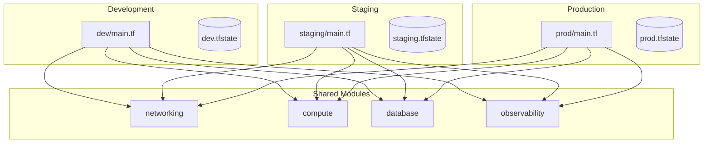
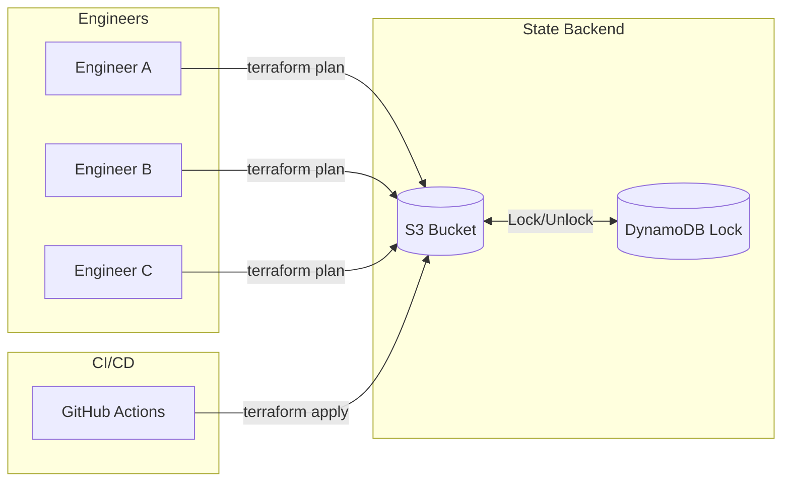
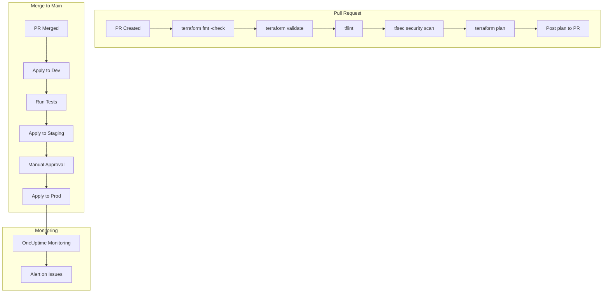
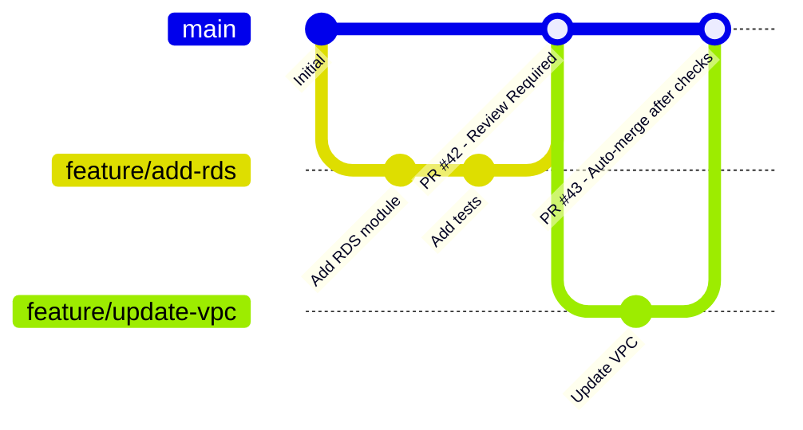

# How to Structure Terraform Projects for Large Teams

Author: [nawazdhandala](https://www.github.com/nawazdhandala)

Tags: Terraform, Infrastructure as Code, DevOps, Team Collaboration, CI/CD, Remote State

Description: A comprehensive guide to structuring Terraform projects for large teams, covering module organization, environment separation, remote state management, and code review workflows that scale.

---

> "The best architectures, requirements, and designs emerge from self-organizing teams." - Agile Manifesto

When your team grows from a handful of engineers to dozens, the Terraform setup that once worked perfectly starts showing cracks. Configuration drift, state file conflicts, and merge chaos become daily challenges. This guide presents battle-tested patterns for organizing Terraform projects that scale with your team.

## The Problem with Monolithic Terraform

Before diving into solutions, let's understand what happens when Terraform projects grow organically without structure:

```hcl
# The monolith anti-pattern: everything in one directory
# This becomes unmanageable quickly

# main.tf - 3000+ lines
resource "aws_vpc" "main" { ... }
resource "aws_subnet" "public" { ... }
resource "aws_instance" "web" { ... }
resource "aws_rds_instance" "db" { ... }
resource "aws_s3_bucket" "logs" { ... }
# ... hundreds more resources

# Problems:
# 1. terraform plan takes 10+ minutes
# 2. One typo can affect production
# 3. Multiple teams block each other
# 4. State file becomes a bottleneck
```

## Module Organization: The Building Blocks

Modules are the foundation of scalable Terraform. Think of them as reusable, testable units of infrastructure.

### Directory Structure for Modules

```
terraform/
├── modules/                    # Reusable infrastructure components
│   ├── networking/
│   │   ├── main.tf            # VPC, subnets, route tables
│   │   ├── variables.tf       # Input parameters
│   │   ├── outputs.tf         # Exported values
│   │   └── README.md          # Module documentation
│   ├── compute/
│   │   ├── ec2/
│   │   │   ├── main.tf
│   │   │   ├── variables.tf
│   │   │   └── outputs.tf
│   │   └── eks/
│   │       ├── main.tf
│   │       ├── variables.tf
│   │       └── outputs.tf
│   ├── database/
│   │   ├── rds/
│   │   └── dynamodb/
│   └── observability/         # Monitoring and alerting
│       ├── main.tf
│       ├── variables.tf
│       └── outputs.tf
├── environments/              # Environment-specific configurations
│   ├── dev/
│   ├── staging/
│   └── prod/
└── shared/                    # Shared configurations
    └── backend.tf
```

### Well-Designed Module Example

```hcl
# modules/networking/variables.tf
# Define clear interfaces with validation

variable "environment" {
  description = "Environment name (dev, staging, prod)"
  type        = string

  validation {
    condition     = contains(["dev", "staging", "prod"], var.environment)
    error_message = "Environment must be dev, staging, or prod."
  }
}

variable "vpc_cidr" {
  description = "CIDR block for the VPC"
  type        = string
  default     = "10.0.0.0/16"

  validation {
    condition     = can(cidrhost(var.vpc_cidr, 0))
    error_message = "VPC CIDR must be a valid IPv4 CIDR block."
  }
}

variable "availability_zones" {
  description = "List of availability zones to use"
  type        = list(string)

  validation {
    condition     = length(var.availability_zones) >= 2
    error_message = "At least 2 availability zones required for high availability."
  }
}

variable "enable_nat_gateway" {
  description = "Enable NAT Gateway for private subnet internet access"
  type        = bool
  default     = true
}

variable "tags" {
  description = "Common tags to apply to all resources"
  type        = map(string)
  default     = {}
}
```

```hcl
# modules/networking/main.tf
# Implementation with clear resource organization

locals {
  # Calculate subnet CIDRs automatically
  public_subnet_cidrs  = [for i, az in var.availability_zones : cidrsubnet(var.vpc_cidr, 8, i)]
  private_subnet_cidrs = [for i, az in var.availability_zones : cidrsubnet(var.vpc_cidr, 8, i + 100)]

  # Merge default tags with provided tags
  common_tags = merge(
    {
      Environment = var.environment
      ManagedBy   = "terraform"
      Module      = "networking"
    },
    var.tags
  )
}

resource "aws_vpc" "main" {
  cidr_block           = var.vpc_cidr
  enable_dns_hostnames = true
  enable_dns_support   = true

  tags = merge(local.common_tags, {
    Name = "${var.environment}-vpc"
  })
}

resource "aws_subnet" "public" {
  count                   = length(var.availability_zones)
  vpc_id                  = aws_vpc.main.id
  cidr_block              = local.public_subnet_cidrs[count.index]
  availability_zone       = var.availability_zones[count.index]
  map_public_ip_on_launch = true

  tags = merge(local.common_tags, {
    Name = "${var.environment}-public-${var.availability_zones[count.index]}"
    Type = "public"
  })
}

resource "aws_subnet" "private" {
  count             = length(var.availability_zones)
  vpc_id            = aws_vpc.main.id
  cidr_block        = local.private_subnet_cidrs[count.index]
  availability_zone = var.availability_zones[count.index]

  tags = merge(local.common_tags, {
    Name = "${var.environment}-private-${var.availability_zones[count.index]}"
    Type = "private"
  })
}

# Internet Gateway for public subnets
resource "aws_internet_gateway" "main" {
  vpc_id = aws_vpc.main.id

  tags = merge(local.common_tags, {
    Name = "${var.environment}-igw"
  })
}

# NAT Gateway for private subnets (conditional)
resource "aws_eip" "nat" {
  count  = var.enable_nat_gateway ? 1 : 0
  domain = "vpc"

  tags = merge(local.common_tags, {
    Name = "${var.environment}-nat-eip"
  })

  depends_on = [aws_internet_gateway.main]
}

resource "aws_nat_gateway" "main" {
  count         = var.enable_nat_gateway ? 1 : 0
  allocation_id = aws_eip.nat[0].id
  subnet_id     = aws_subnet.public[0].id

  tags = merge(local.common_tags, {
    Name = "${var.environment}-nat"
  })
}
```

```hcl
# modules/networking/outputs.tf
# Export values that other modules need

output "vpc_id" {
  description = "ID of the created VPC"
  value       = aws_vpc.main.id
}

output "vpc_cidr" {
  description = "CIDR block of the VPC"
  value       = aws_vpc.main.cidr_block
}

output "public_subnet_ids" {
  description = "List of public subnet IDs"
  value       = aws_subnet.public[*].id
}

output "private_subnet_ids" {
  description = "List of private subnet IDs"
  value       = aws_subnet.private[*].id
}

output "nat_gateway_ip" {
  description = "Public IP of the NAT Gateway"
  value       = var.enable_nat_gateway ? aws_eip.nat[0].public_ip : null
}
```

## Environment Separation: Isolation Without Duplication

Each environment should have its own state file while sharing module code. This prevents a staging change from accidentally affecting production.

### Environment Architecture



### Environment Configuration

```hcl
# environments/prod/main.tf
# Production environment configuration

terraform {
  required_version = ">= 1.5.0"

  required_providers {
    aws = {
      source  = "hashicorp/aws"
      version = "~> 5.0"
    }
  }

  # Each environment has its own state file
  backend "s3" {
    bucket         = "company-terraform-state"
    key            = "prod/infrastructure.tfstate"
    region         = "us-east-1"
    encrypt        = true
    dynamodb_table = "terraform-state-lock"
  }
}

provider "aws" {
  region = "us-east-1"

  # Assume role for production access
  assume_role {
    role_arn = "arn:aws:iam::PROD_ACCOUNT_ID:role/TerraformExecutionRole"
  }

  default_tags {
    tags = {
      Environment = "prod"
      ManagedBy   = "terraform"
      CostCenter  = "infrastructure"
    }
  }
}

# Local variables for environment-specific settings
locals {
  environment = "prod"

  # Production gets more resources and redundancy
  instance_type      = "m5.xlarge"
  min_instances      = 3
  max_instances      = 10
  multi_az           = true
  backup_retention   = 30
}

# Use shared modules with environment-specific configuration
module "networking" {
  source = "../../modules/networking"

  environment        = local.environment
  vpc_cidr           = "10.0.0.0/16"
  availability_zones = ["us-east-1a", "us-east-1b", "us-east-1c"]
  enable_nat_gateway = true

  tags = {
    Project = "main-platform"
  }
}

module "compute" {
  source = "../../modules/compute/eks"

  environment    = local.environment
  vpc_id         = module.networking.vpc_id
  subnet_ids     = module.networking.private_subnet_ids
  instance_types = ["m5.xlarge", "m5.2xlarge"]
  min_size       = local.min_instances
  max_size       = local.max_instances

  # Production-specific settings
  enable_cluster_autoscaler = true
  enable_metrics_server     = true
}

module "database" {
  source = "../../modules/database/rds"

  environment        = local.environment
  vpc_id             = module.networking.vpc_id
  subnet_ids         = module.networking.private_subnet_ids
  instance_class     = "db.r5.xlarge"
  multi_az           = local.multi_az
  backup_retention   = local.backup_retention

  # Production requires encryption
  storage_encrypted  = true
  deletion_protection = true
}

# Observability module for monitoring with OneUptime
module "observability" {
  source = "../../modules/observability"

  environment     = local.environment
  vpc_id          = module.networking.vpc_id
  eks_cluster_id  = module.compute.cluster_id

  # Enable comprehensive monitoring for production
  enable_detailed_monitoring = true
  log_retention_days         = 90

  alerting = {
    enabled     = true
    slack_webhook = var.slack_webhook_url
  }
}
```

```hcl
# environments/dev/main.tf
# Development environment - cost-optimized configuration

terraform {
  required_version = ">= 1.5.0"

  required_providers {
    aws = {
      source  = "hashicorp/aws"
      version = "~> 5.0"
    }
  }

  backend "s3" {
    bucket         = "company-terraform-state"
    key            = "dev/infrastructure.tfstate"
    region         = "us-east-1"
    encrypt        = true
    dynamodb_table = "terraform-state-lock"
  }
}

provider "aws" {
  region = "us-east-1"

  assume_role {
    role_arn = "arn:aws:iam::DEV_ACCOUNT_ID:role/TerraformExecutionRole"
  }

  default_tags {
    tags = {
      Environment = "dev"
      ManagedBy   = "terraform"
    }
  }
}

locals {
  environment = "dev"

  # Development uses smaller, cheaper resources
  instance_type    = "t3.medium"
  min_instances    = 1
  max_instances    = 3
  multi_az         = false  # Save costs in dev
  backup_retention = 7
}

# Same modules, different configuration
module "networking" {
  source = "../../modules/networking"

  environment        = local.environment
  vpc_cidr           = "10.1.0.0/16"  # Different CIDR for VPC peering
  availability_zones = ["us-east-1a", "us-east-1b"]
  enable_nat_gateway = false  # Use NAT instance to save costs
}

module "compute" {
  source = "../../modules/compute/eks"

  environment    = local.environment
  vpc_id         = module.networking.vpc_id
  subnet_ids     = module.networking.private_subnet_ids
  instance_types = ["t3.medium"]
  min_size       = local.min_instances
  max_size       = local.max_instances

  # Development can use spot instances
  capacity_type = "SPOT"
}

module "database" {
  source = "../../modules/database/rds"

  environment        = local.environment
  vpc_id             = module.networking.vpc_id
  subnet_ids         = module.networking.private_subnet_ids
  instance_class     = "db.t3.medium"
  multi_az           = local.multi_az
  backup_retention   = local.backup_retention

  # Development doesn't need deletion protection
  deletion_protection = false
}
```

## Remote State Management: The Foundation of Team Collaboration

Remote state is non-negotiable for teams. It provides locking, versioning, and a single source of truth.

### State Architecture



### Setting Up Remote State Backend

```hcl
# shared/state-backend/main.tf
# Bootstrap the state backend infrastructure
# Run this ONCE manually before other Terraform

terraform {
  required_version = ">= 1.5.0"

  required_providers {
    aws = {
      source  = "hashicorp/aws"
      version = "~> 5.0"
    }
  }
}

provider "aws" {
  region = "us-east-1"
}

# S3 bucket for state storage
resource "aws_s3_bucket" "terraform_state" {
  bucket = "company-terraform-state"

  # Prevent accidental deletion
  lifecycle {
    prevent_destroy = true
  }

  tags = {
    Name      = "Terraform State"
    ManagedBy = "terraform-bootstrap"
  }
}

# Enable versioning for state history
resource "aws_s3_bucket_versioning" "terraform_state" {
  bucket = aws_s3_bucket.terraform_state.id

  versioning_configuration {
    status = "Enabled"
  }
}

# Encrypt state at rest
resource "aws_s3_bucket_server_side_encryption_configuration" "terraform_state" {
  bucket = aws_s3_bucket.terraform_state.id

  rule {
    apply_server_side_encryption_by_default {
      sse_algorithm     = "aws:kms"
      kms_master_key_id = aws_kms_key.terraform_state.arn
    }
    bucket_key_enabled = true
  }
}

# Block public access
resource "aws_s3_bucket_public_access_block" "terraform_state" {
  bucket = aws_s3_bucket.terraform_state.id

  block_public_acls       = true
  block_public_policy     = true
  ignore_public_acls      = true
  restrict_public_buckets = true
}

# KMS key for encryption
resource "aws_kms_key" "terraform_state" {
  description             = "KMS key for Terraform state encryption"
  deletion_window_in_days = 30
  enable_key_rotation     = true

  tags = {
    Name = "terraform-state-key"
  }
}

# DynamoDB table for state locking
resource "aws_dynamodb_table" "terraform_lock" {
  name         = "terraform-state-lock"
  billing_mode = "PAY_PER_REQUEST"
  hash_key     = "LockID"

  attribute {
    name = "LockID"
    type = "S"
  }

  # Enable point-in-time recovery
  point_in_time_recovery {
    enabled = true
  }

  tags = {
    Name      = "Terraform State Lock"
    ManagedBy = "terraform-bootstrap"
  }
}

# Output the backend configuration
output "backend_config" {
  value = <<-EOT
    backend "s3" {
      bucket         = "${aws_s3_bucket.terraform_state.id}"
      region         = "us-east-1"
      encrypt        = true
      dynamodb_table = "${aws_dynamodb_table.terraform_lock.name}"
    }
  EOT
}
```

### Using Data Sources for Cross-State References

```hcl
# environments/prod/data.tf
# Reference outputs from other state files

# Get networking outputs from shared infrastructure
data "terraform_remote_state" "networking" {
  backend = "s3"

  config = {
    bucket = "company-terraform-state"
    key    = "prod/networking.tfstate"
    region = "us-east-1"
  }
}

# Get security outputs
data "terraform_remote_state" "security" {
  backend = "s3"

  config = {
    bucket = "company-terraform-state"
    key    = "prod/security.tfstate"
    region = "us-east-1"
  }
}

# Use the remote state data
resource "aws_instance" "app" {
  ami           = data.aws_ami.amazon_linux.id
  instance_type = "t3.medium"

  # Reference VPC from networking state
  subnet_id              = data.terraform_remote_state.networking.outputs.private_subnet_ids[0]
  vpc_security_group_ids = [data.terraform_remote_state.security.outputs.app_security_group_id]

  tags = {
    Name = "app-server"
  }
}
```

## Code Review Workflows: Ensuring Quality at Scale

A well-designed CI/CD pipeline catches issues before they reach production.

### CI/CD Pipeline Architecture



### GitHub Actions Workflow

```yaml
# .github/workflows/terraform.yml
name: Terraform CI/CD

on:
  pull_request:
    branches: [main]
    paths:
      - 'terraform/**'
  push:
    branches: [main]
    paths:
      - 'terraform/**'

env:
  TF_VERSION: '1.5.0'
  AWS_REGION: 'us-east-1'

jobs:
  # Run checks on all PRs
  validate:
    name: Validate Terraform
    runs-on: ubuntu-latest
    steps:
      - name: Checkout
        uses: actions/checkout@v4

      - name: Setup Terraform
        uses: hashicorp/setup-terraform@v3
        with:
          terraform_version: ${{ env.TF_VERSION }}

      - name: Terraform Format Check
        run: terraform fmt -check -recursive terraform/

      - name: Terraform Init
        run: |
          cd terraform/environments/dev
          terraform init -backend=false

      - name: Terraform Validate
        run: |
          cd terraform/environments/dev
          terraform validate

  # Security scanning
  security:
    name: Security Scan
    runs-on: ubuntu-latest
    steps:
      - name: Checkout
        uses: actions/checkout@v4

      - name: tfsec
        uses: aquasecurity/tfsec-action@v1.0.0
        with:
          working_directory: terraform/

      - name: Checkov
        uses: bridgecrewio/checkov-action@v12
        with:
          directory: terraform/
          framework: terraform

  # Plan for each environment
  plan:
    name: Plan - ${{ matrix.environment }}
    runs-on: ubuntu-latest
    needs: [validate, security]
    strategy:
      matrix:
        environment: [dev, staging, prod]
    permissions:
      contents: read
      pull-requests: write
      id-token: write
    steps:
      - name: Checkout
        uses: actions/checkout@v4

      - name: Configure AWS Credentials
        uses: aws-actions/configure-aws-credentials@v4
        with:
          role-to-assume: ${{ secrets[format('AWS_ROLE_{0}', matrix.environment)] }}
          aws-region: ${{ env.AWS_REGION }}

      - name: Setup Terraform
        uses: hashicorp/setup-terraform@v3
        with:
          terraform_version: ${{ env.TF_VERSION }}

      - name: Terraform Init
        working-directory: terraform/environments/${{ matrix.environment }}
        run: terraform init

      - name: Terraform Plan
        id: plan
        working-directory: terraform/environments/${{ matrix.environment }}
        run: |
          terraform plan -no-color -out=tfplan 2>&1 | tee plan.txt

      - name: Post Plan to PR
        if: github.event_name == 'pull_request'
        uses: actions/github-script@v7
        with:
          script: |
            const fs = require('fs');
            const plan = fs.readFileSync('terraform/environments/${{ matrix.environment }}/plan.txt', 'utf8');
            const maxLength = 65000;
            const truncatedPlan = plan.length > maxLength
              ? plan.substring(0, maxLength) + '\n... (truncated)'
              : plan;

            github.rest.issues.createComment({
              issue_number: context.issue.number,
              owner: context.repo.owner,
              repo: context.repo.repo,
              body: `### Terraform Plan - ${{ matrix.environment }}\n\n\`\`\`hcl\n${truncatedPlan}\n\`\`\``
            });

  # Apply to dev automatically on merge
  apply-dev:
    name: Apply - Dev
    runs-on: ubuntu-latest
    needs: [plan]
    if: github.ref == 'refs/heads/main' && github.event_name == 'push'
    environment: dev
    steps:
      - name: Checkout
        uses: actions/checkout@v4

      - name: Configure AWS Credentials
        uses: aws-actions/configure-aws-credentials@v4
        with:
          role-to-assume: ${{ secrets.AWS_ROLE_DEV }}
          aws-region: ${{ env.AWS_REGION }}

      - name: Setup Terraform
        uses: hashicorp/setup-terraform@v3
        with:
          terraform_version: ${{ env.TF_VERSION }}

      - name: Terraform Init
        working-directory: terraform/environments/dev
        run: terraform init

      - name: Terraform Apply
        working-directory: terraform/environments/dev
        run: terraform apply -auto-approve

  # Apply to staging after dev succeeds
  apply-staging:
    name: Apply - Staging
    runs-on: ubuntu-latest
    needs: [apply-dev]
    environment: staging
    steps:
      - name: Checkout
        uses: actions/checkout@v4

      - name: Configure AWS Credentials
        uses: aws-actions/configure-aws-credentials@v4
        with:
          role-to-assume: ${{ secrets.AWS_ROLE_STAGING }}
          aws-region: ${{ env.AWS_REGION }}

      - name: Setup Terraform
        uses: hashicorp/setup-terraform@v3
        with:
          terraform_version: ${{ env.TF_VERSION }}

      - name: Terraform Init
        working-directory: terraform/environments/staging
        run: terraform init

      - name: Terraform Apply
        working-directory: terraform/environments/staging
        run: terraform apply -auto-approve

  # Apply to prod requires manual approval
  apply-prod:
    name: Apply - Production
    runs-on: ubuntu-latest
    needs: [apply-staging]
    environment:
      name: production
      url: https://status.yourcompany.com
    steps:
      - name: Checkout
        uses: actions/checkout@v4

      - name: Configure AWS Credentials
        uses: aws-actions/configure-aws-credentials@v4
        with:
          role-to-assume: ${{ secrets.AWS_ROLE_PROD }}
          aws-region: ${{ env.AWS_REGION }}

      - name: Setup Terraform
        uses: hashicorp/setup-terraform@v3
        with:
          terraform_version: ${{ env.TF_VERSION }}

      - name: Terraform Init
        working-directory: terraform/environments/prod
        run: terraform init

      - name: Terraform Apply
        working-directory: terraform/environments/prod
        run: terraform apply -auto-approve

      - name: Notify OneUptime
        run: |
          curl -X POST "${{ secrets.ONEUPTIME_WEBHOOK_URL }}" \
            -H "Content-Type: application/json" \
            -d '{"event": "deployment", "environment": "production", "status": "success"}'
```

## Team Workflow Patterns

### CODEOWNERS for Review Requirements

```
# .github/CODEOWNERS
# Require platform team review for module changes
/terraform/modules/                    @company/platform-team

# Require security review for IAM and security changes
/terraform/modules/security/           @company/security-team
**/iam.tf                              @company/security-team

# Environment-specific owners
/terraform/environments/prod/          @company/sre-team
/terraform/environments/staging/       @company/platform-team
/terraform/environments/dev/           @company/engineering
```

### Branch Protection Strategy



## Workspaces vs Directories: Making the Right Choice

Both approaches have merits. Here's when to use each:

### Use Workspaces When:

```hcl
# Same infrastructure, different instances
# Good for: feature branches, ephemeral environments

# Create workspace for feature testing
# terraform workspace new feature-xyz

resource "aws_instance" "app" {
  ami           = data.aws_ami.amazon_linux.id
  instance_type = terraform.workspace == "prod" ? "m5.xlarge" : "t3.medium"

  tags = {
    Name        = "app-${terraform.workspace}"
    Environment = terraform.workspace
  }
}
```

### Use Directories When:

```hcl
# Different infrastructure configurations
# Good for: dev/staging/prod, different regions, different projects

# environments/prod/main.tf - Production specific
module "networking" {
  source = "../../modules/networking"

  vpc_cidr           = "10.0.0.0/16"
  enable_nat_gateway = true
  multi_az           = true
}

# environments/dev/main.tf - Development specific
module "networking" {
  source = "../../modules/networking"

  vpc_cidr           = "10.1.0.0/16"
  enable_nat_gateway = false  # Cost savings
  multi_az           = false
}
```

## Monitoring Your Infrastructure Changes

Terraform changes should be observable. Integrate with [OneUptime](https://oneuptime.com) to monitor infrastructure health after deployments.

```hcl
# modules/observability/oneuptime.tf
# Configure OneUptime monitoring for infrastructure

terraform {
  required_providers {
    oneuptime = {
      source  = "oneuptime/oneuptime"
      version = "~> 1.0"
    }
  }
}

variable "oneuptime_api_key" {
  description = "OneUptime API key for monitoring setup"
  type        = string
  sensitive   = true
}

variable "environment" {
  description = "Environment name"
  type        = string
}

variable "endpoints" {
  description = "List of endpoints to monitor"
  type = list(object({
    name = string
    url  = string
  }))
}

# Create monitors for critical endpoints
resource "oneuptime_monitor" "endpoints" {
  for_each = { for ep in var.endpoints : ep.name => ep }

  name         = "${var.environment}-${each.value.name}"
  description  = "Monitor for ${each.value.name} in ${var.environment}"
  monitor_type = "API"

  # Monitor configuration would go here
}

# Create a status page for the environment
resource "oneuptime_status_page" "main" {
  name        = "${var.environment} Infrastructure Status"
  description = "Real-time status of ${var.environment} infrastructure"
}
```

## Best Practices Summary

### Do:
- **Use modules** for reusable infrastructure components
- **Separate state files** per environment
- **Enable state locking** with DynamoDB
- **Automate formatting** and validation in CI
- **Require PR reviews** for infrastructure changes
- **Tag everything** for cost tracking and organization
- **Version pin** providers and modules
- **Monitor deployments** with tools like [OneUptime](https://oneuptime.com)

### Don't:
- **Don't store secrets** in Terraform files (use Vault, AWS Secrets Manager)
- **Don't skip validation** to save CI time
- **Don't apply without planning** in production
- **Don't share state files** between environments
- **Don't hardcode values** that vary by environment

## Conclusion

Structuring Terraform for large teams requires intentional design choices around module organization, environment separation, and review workflows. The patterns in this guide provide a foundation, but adapt them to your team's specific needs.

Start with clear module boundaries, enforce them with CI/CD, and iterate based on pain points. Your future self (and teammates) will thank you.

---

*Need to monitor your Terraform-managed infrastructure? [OneUptime](https://oneuptime.com) provides comprehensive observability for your entire stack, with native Terraform provider support for Infrastructure as Code workflows.*

**Related Reading:**

- [Introducing the OneUptime Terraform Provider](https://oneuptime.com/blog/post/2025-07-01-introducing-terraform-provider-for-oneuptime/view)
- [The Five Stages of SRE Maturity](https://oneuptime.com/blog/post/2025-09-01-the-five-stages-of-sre-maturity/view)
- [SRE Best Practices](https://oneuptime.com/blog/post/2025-11-28-sre-best-practices/view)
