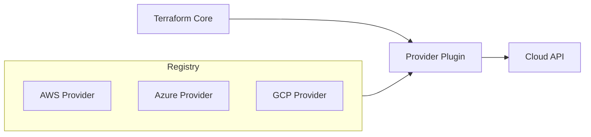

# How to Manage Provider Versions in Terraform

Author: [nawazdhandala](https://www.github.com/nawazdhandala)

Tags: Terraform, Providers, Version Management, Infrastructure as Code, DevOps

Description: Learn how to manage Terraform provider versions effectively, including version constraints, lock files, upgrades, and best practices for stable infrastructure deployments.

---

Terraform providers are plugins that interact with cloud APIs. Provider versions determine which features and bug fixes are available. Managing versions properly ensures reproducible deployments and prevents unexpected breaking changes.

## How Providers Work



Terraform downloads providers from the registry based on version constraints in your configuration.

## Declaring Provider Requirements

```hcl
# versions.tf

terraform {
  required_version = ">= 1.0.0"

  required_providers {
    aws = {
      source  = "hashicorp/aws"
      version = "~> 5.0"
    }
    azurerm = {
      source  = "hashicorp/azurerm"
      version = ">= 3.0.0, < 4.0.0"
    }
    google = {
      source  = "hashicorp/google"
      version = "5.10.0"  # Exact version
    }
    random = {
      source  = "hashicorp/random"
      version = "~> 3.5"
    }
  }
}
```

## Version Constraint Syntax

| Constraint | Meaning | Example |
|------------|---------|---------|
| `= 5.0.0` | Exact version | Only 5.0.0 |
| `!= 5.0.0` | Exclude version | Anything except 5.0.0 |
| `> 5.0.0` | Greater than | 5.0.1, 5.1.0, 6.0.0, etc. |
| `>= 5.0.0` | Greater than or equal | 5.0.0 and above |
| `< 5.0.0` | Less than | 4.x.x and below |
| `<= 5.0.0` | Less than or equal | 5.0.0 and below |
| `~> 5.0` | Pessimistic (minor) | >= 5.0.0, < 6.0.0 |
| `~> 5.0.0` | Pessimistic (patch) | >= 5.0.0, < 5.1.0 |

### Recommended Constraints

```hcl
required_providers {
  # For most providers: allow minor version updates
  aws = {
    source  = "hashicorp/aws"
    version = "~> 5.0"  # Allows 5.x.x updates
  }

  # For critical production: be more specific
  aws = {
    source  = "hashicorp/aws"
    version = "~> 5.30.0"  # Only patch updates
  }

  # For experimental features: allow major updates
  experimental = {
    source  = "example/experimental"
    version = ">= 1.0.0"  # Any version 1.0.0+
  }
}
```

## The Lock File

When you run `terraform init`, Terraform creates `.terraform.lock.hcl`:

```hcl
# .terraform.lock.hcl

provider "registry.terraform.io/hashicorp/aws" {
  version     = "5.31.0"
  constraints = "~> 5.0"
  hashes = [
    "h1:abc123...",
    "zh:def456...",
  ]
}

provider "registry.terraform.io/hashicorp/random" {
  version     = "3.5.1"
  constraints = "~> 3.5"
  hashes = [
    "h1:ghi789...",
  ]
}
```

The lock file:
- **Pins exact versions** that were resolved
- **Stores checksums** for integrity verification
- **Should be committed** to version control
- **Ensures consistency** across team members and CI/CD

## Managing the Lock File

### Commit the Lock File

```bash
# Add to version control
git add .terraform.lock.hcl
git commit -m "Add/update Terraform lock file"
```

### Update Platform Hashes

When running on multiple platforms (Linux, macOS, Windows):

```bash
# Update hashes for all platforms
terraform providers lock \
  -platform=linux_amd64 \
  -platform=darwin_amd64 \
  -platform=darwin_arm64 \
  -platform=windows_amd64
```

### Regenerate Lock File

```bash
# Remove and regenerate
rm .terraform.lock.hcl
terraform init
```

## Upgrading Providers

### Check Available Updates

```bash
# Show current versions and available updates
terraform version
terraform providers

# Check for outdated providers
terraform init -upgrade
```

### Upgrade Strategy

```bash
# Step 1: Update version constraint
# versions.tf: version = "~> 5.30" -> version = "~> 5.40"

# Step 2: Run init with upgrade flag
terraform init -upgrade

# Step 3: Review the plan
terraform plan

# Step 4: Test in non-production first

# Step 5: Apply changes
terraform apply

# Step 6: Commit updated lock file
git add .terraform.lock.hcl
git commit -m "Upgrade AWS provider to 5.40.x"
```

### Upgrade Single Provider

```bash
# Upgrade only the AWS provider
terraform init -upgrade=hashicorp/aws
```

## Provider Configuration

### Basic Configuration

```hcl
provider "aws" {
  region = "us-east-1"
}
```

### Multiple Provider Instances

```hcl
# Default provider
provider "aws" {
  region = "us-east-1"
}

# Aliased provider for different region
provider "aws" {
  alias  = "west"
  region = "us-west-2"
}

# Use aliased provider
resource "aws_instance" "west_instance" {
  provider = aws.west
  # ...
}
```

### Provider from Variables

```hcl
variable "aws_region" {
  default = "us-east-1"
}

provider "aws" {
  region = var.aws_region
}
```

## Custom Provider Sources

### Private Registry

```hcl
terraform {
  required_providers {
    internal = {
      source  = "registry.example.com/mycompany/internal"
      version = "~> 1.0"
    }
  }
}
```

### Local Provider

```hcl
terraform {
  required_providers {
    custom = {
      source = "example.com/mycompany/custom"
    }
  }
}

# Place provider binary in:
# ~/.terraform.d/plugins/example.com/mycompany/custom/1.0.0/darwin_amd64/
```

### GitHub Release

```hcl
terraform {
  required_providers {
    custom = {
      source  = "github.com/mycompany/terraform-provider-custom"
      version = "1.0.0"
    }
  }
}
```

## Module Provider Requirements

### In a Module

```hcl
# modules/vpc/versions.tf

terraform {
  required_providers {
    aws = {
      source  = "hashicorp/aws"
      version = ">= 4.0.0"  # Minimum version needed
    }
  }
}
```

### Passing Providers to Modules

```hcl
# Root module
provider "aws" {
  alias  = "us_east"
  region = "us-east-1"
}

provider "aws" {
  alias  = "us_west"
  region = "us-west-2"
}

module "vpc_east" {
  source = "./modules/vpc"

  providers = {
    aws = aws.us_east
  }
}

module "vpc_west" {
  source = "./modules/vpc"

  providers = {
    aws = aws.us_west
  }
}
```

## Handling Breaking Changes

When a provider introduces breaking changes:

### 1. Read the Changelog

Check the provider's GitHub releases for migration guides.

### 2. Test in Isolation

```bash
# Create a test branch
git checkout -b upgrade-aws-provider

# Upgrade provider
terraform init -upgrade

# Review changes
terraform plan
```

### 3. Address Deprecations

```hcl
# Before (deprecated)
resource "aws_s3_bucket" "example" {
  bucket = "my-bucket"
  acl    = "private"  # Deprecated in AWS provider 4.0+
}

# After (new approach)
resource "aws_s3_bucket" "example" {
  bucket = "my-bucket"
}

resource "aws_s3_bucket_acl" "example" {
  bucket = aws_s3_bucket.example.id
  acl    = "private"
}
```

### 4. Use Replace in State

```bash
# If resource type changed
terraform state mv aws_s3_bucket_object.old aws_s3_object.new
```

## CI/CD Considerations

### Cache Provider Downloads

```yaml
# GitHub Actions
- name: Cache Terraform providers
  uses: actions/cache@v3
  with:
    path: ~/.terraform.d/plugin-cache
    key: terraform-providers-${{ hashFiles('**/.terraform.lock.hcl') }}
```

### Enable Plugin Cache

```bash
# Set plugin cache directory
export TF_PLUGIN_CACHE_DIR="$HOME/.terraform.d/plugin-cache"
mkdir -p $TF_PLUGIN_CACHE_DIR
```

Or in configuration:

```hcl
# ~/.terraformrc
plugin_cache_dir = "$HOME/.terraform.d/plugin-cache"
```

## Best Practices

### 1. Always Commit Lock File

```bash
git add .terraform.lock.hcl
```

### 2. Use Pessimistic Constraints

```hcl
# Good: Allows patch updates only
version = "~> 5.30.0"

# Risky: Allows any 5.x version
version = "~> 5.0"
```

### 3. Pin in Production

```hcl
# Production: Very specific
version = "5.30.0"

# Development: More flexible
version = "~> 5.30"
```

### 4. Schedule Regular Updates

Create a process to review and update providers monthly.

### 5. Test Upgrades Thoroughly

Run plan and apply in non-production before upgrading production.

### 6. Document Provider Versions

```markdown
# Provider Versions

| Provider | Version | Last Updated |
|----------|---------|--------------|
| AWS      | 5.30.0  | 2024-01-15   |
| Random   | 3.5.1   | 2024-01-10   |
```

---

Provider version management is the foundation of stable Terraform deployments. Use the lock file for reproducibility, update providers regularly but carefully, and always test upgrades before applying to production.
