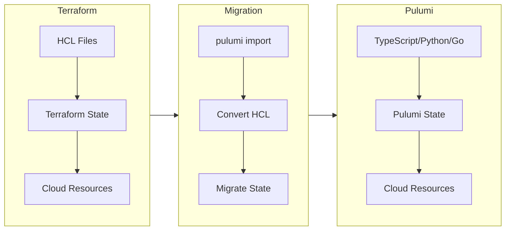
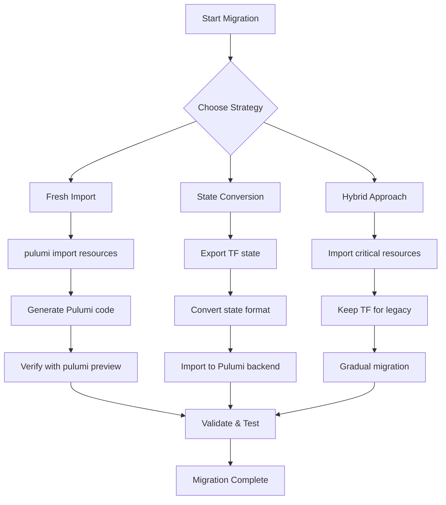
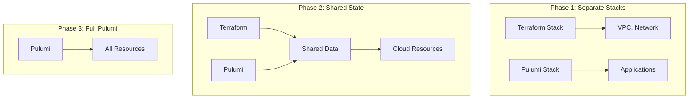

# How to Migrate from Terraform to Pulumi

By [nawazdhandala](https://github.com/nawazdhandala)

Tags: Infrastructure as Code, Terraform, Pulumi, DevOps, Migration, Cloud Infrastructure

Description: A comprehensive guide to migrating your infrastructure from Terraform to Pulumi, covering import strategies, HCL conversion, state migration, and coexistence patterns for a smooth transition.

---

> "The best migration is one where you never have to touch running infrastructure - import existing resources, convert your code, and let Pulumi take over state management seamlessly."

## Why Migrate from Terraform to Pulumi?

Before diving into the migration process, let's understand why teams choose to move from Terraform to Pulumi:

- **Real Programming Languages**: Write infrastructure code in TypeScript, Python, Go, C#, or Java instead of HCL
- **Better Abstractions**: Create reusable components with loops, conditionals, and functions
- **Type Safety**: Catch errors at compile time with IDE support and autocompletion
- **Testing**: Write unit tests for your infrastructure using familiar testing frameworks
- **Single Source of Truth**: Manage application code and infrastructure in the same codebase



## Using Pulumi Import

The `pulumi import` command allows you to bring existing cloud resources under Pulumi management without recreating them. This is the safest approach for migrating production infrastructure.

### Basic Import Workflow

```bash
# Initialize a new Pulumi project
# This creates the project structure and configuration files
pulumi new typescript

# Import a single AWS S3 bucket by its resource ID
# The format is: pulumi import <resource-type> <pulumi-name> <cloud-resource-id>
pulumi import aws:s3/bucket:Bucket my-bucket my-existing-bucket-name

# Import an AWS EC2 instance
# Use the instance ID from AWS console or CLI
pulumi import aws:ec2/instance:Instance web-server i-0abc123def456789

# Import an Azure Resource Group
# Format: pulumi import <provider:module/resource:Type> <name> <azure-resource-id>
pulumi import azure:core/resourceGroup:ResourceGroup main-rg /subscriptions/xxx/resourceGroups/my-rg

# Import a Google Cloud Storage bucket
pulumi import gcp:storage/bucket:Bucket data-bucket my-project-data-bucket
```

### Bulk Import with Import File

For large infrastructures, use an import file to batch import multiple resources:

```json
{
  "resources": [
    {
      "type": "aws:s3/bucket:Bucket",
      "name": "app-bucket",
      "id": "my-app-bucket-prod"
    },
    {
      "type": "aws:ec2/instance:Instance",
      "name": "api-server",
      "id": "i-0abc123def456789"
    },
    {
      "type": "aws:rds/instance:Instance",
      "name": "main-database",
      "id": "production-db"
    },
    {
      "type": "aws:ec2/securityGroup:SecurityGroup",
      "name": "api-sg",
      "id": "sg-0123456789abcdef0"
    }
  ]
}
```

```bash
# Run bulk import using the import file
# This imports all resources defined in the JSON file
pulumi import -f resources-to-import.json

# The command will generate code for each resource
# Review the generated code before committing
```

### Generated Code Example

After importing, Pulumi generates code matching your resource configuration:

```typescript
// This code was generated by pulumi import
// Review and customize as needed

import * as pulumi from "@pulumi/pulumi";
import * as aws from "@pulumi/aws";

// Imported S3 bucket - modify properties as needed
const appBucket = new aws.s3.Bucket("app-bucket", {
    bucket: "my-app-bucket-prod",
    acl: "private",
    // Versioning configuration imported from existing resource
    versioning: {
        enabled: true,
    },
    // Server-side encryption configuration
    serverSideEncryptionConfiguration: {
        rule: {
            applyServerSideEncryptionByDefault: {
                sseAlgorithm: "AES256",
            },
        },
    },
    // Tags imported from existing resource
    tags: {
        Environment: "production",
        Team: "platform",
    },
}, {
    // Protect prevents accidental deletion
    protect: true,
});

// Export the bucket name for use in other stacks
export const bucketName = appBucket.bucket;
```

## Converting Terraform HCL to Pulumi Code

Pulumi provides tools to convert existing Terraform configurations to Pulumi code automatically.

### Using tf2pulumi

```bash
# Install tf2pulumi globally
# This tool converts HCL to your preferred language
npm install -g @pulumi/tf2pulumi

# Convert Terraform HCL to TypeScript
# Run from your Terraform project directory
tf2pulumi --target-language typescript

# Convert to Python
tf2pulumi --target-language python

# Convert to Go
tf2pulumi --target-language go

# Convert to C#
tf2pulumi --target-language csharp
```

### Terraform HCL Example

```hcl
# Original Terraform configuration
# main.tf

# Configure the AWS Provider
provider "aws" {
  region = var.aws_region
}

# Variables
variable "aws_region" {
  default = "us-west-2"
}

variable "environment" {
  default = "production"
}

# VPC Resource
resource "aws_vpc" "main" {
  cidr_block           = "10.0.0.0/16"
  enable_dns_hostnames = true
  enable_dns_support   = true

  tags = {
    Name        = "main-vpc"
    Environment = var.environment
  }
}

# Subnet Resource
resource "aws_subnet" "public" {
  count                   = 2
  vpc_id                  = aws_vpc.main.id
  cidr_block              = cidrsubnet(aws_vpc.main.cidr_block, 8, count.index)
  availability_zone       = data.aws_availability_zones.available.names[count.index]
  map_public_ip_on_launch = true

  tags = {
    Name        = "public-subnet-${count.index + 1}"
    Environment = var.environment
  }
}

# Security Group
resource "aws_security_group" "web" {
  name        = "web-sg"
  description = "Security group for web servers"
  vpc_id      = aws_vpc.main.id

  ingress {
    from_port   = 443
    to_port     = 443
    protocol    = "tcp"
    cidr_blocks = ["0.0.0.0/0"]
  }

  egress {
    from_port   = 0
    to_port     = 0
    protocol    = "-1"
    cidr_blocks = ["0.0.0.0/0"]
  }
}
```

### Converted Pulumi TypeScript

```typescript
// Converted Pulumi configuration
// index.ts

import * as pulumi from "@pulumi/pulumi";
import * as aws from "@pulumi/aws";

// Configuration - equivalent to Terraform variables
// Access these via pulumi config set
const config = new pulumi.Config();
const awsRegion = config.get("awsRegion") || "us-west-2";
const environment = config.get("environment") || "production";

// Get available AZs - equivalent to data source
const availableAzs = aws.getAvailabilityZones({
    state: "available",
});

// VPC Resource - same properties, different syntax
const mainVpc = new aws.ec2.Vpc("main-vpc", {
    cidrBlock: "10.0.0.0/16",
    enableDnsHostnames: true,
    enableDnsSupport: true,
    tags: {
        Name: "main-vpc",
        Environment: environment,
    },
});

// Subnet Resources - using real loops instead of count
// This creates type-safe, predictable resources
const publicSubnets: aws.ec2.Subnet[] = [];
for (let i = 0; i < 2; i++) {
    const subnet = new aws.ec2.Subnet(`public-subnet-${i + 1}`, {
        vpcId: mainVpc.id,
        // Calculate CIDR block programmatically
        cidrBlock: `10.0.${i}.0/24`,
        availabilityZone: availableAzs.then(azs => azs.names[i]),
        mapPublicIpOnLaunch: true,
        tags: {
            Name: `public-subnet-${i + 1}`,
            Environment: environment,
        },
    });
    publicSubnets.push(subnet);
}

// Security Group - cleaner ingress/egress definition
const webSecurityGroup = new aws.ec2.SecurityGroup("web-sg", {
    name: "web-sg",
    description: "Security group for web servers",
    vpcId: mainVpc.id,
    // Inline rules for simple configurations
    ingress: [{
        fromPort: 443,
        toPort: 443,
        protocol: "tcp",
        cidrBlocks: ["0.0.0.0/0"],
        description: "Allow HTTPS traffic",
    }],
    egress: [{
        fromPort: 0,
        toPort: 0,
        protocol: "-1",
        cidrBlocks: ["0.0.0.0/0"],
        description: "Allow all outbound traffic",
    }],
    tags: {
        Name: "web-sg",
        Environment: environment,
    },
});

// Exports - equivalent to Terraform outputs
export const vpcId = mainVpc.id;
export const subnetIds = publicSubnets.map(s => s.id);
export const securityGroupId = webSecurityGroup.id;
```

### Converting Python Terraform Equivalent

```python
# Converted Pulumi configuration
# __main__.py

import pulumi
import pulumi_aws as aws

# Configuration - equivalent to Terraform variables
config = pulumi.Config()
aws_region = config.get("awsRegion") or "us-west-2"
environment = config.get("environment") or "production"

# Get available AZs
available_azs = aws.get_availability_zones(state="available")

# VPC Resource
main_vpc = aws.ec2.Vpc("main-vpc",
    cidr_block="10.0.0.0/16",
    enable_dns_hostnames=True,
    enable_dns_support=True,
    tags={
        "Name": "main-vpc",
        "Environment": environment,
    }
)

# Subnet Resources - using Python list comprehension
public_subnets = []
for i in range(2):
    subnet = aws.ec2.Subnet(f"public-subnet-{i + 1}",
        vpc_id=main_vpc.id,
        cidr_block=f"10.0.{i}.0/24",
        availability_zone=available_azs.names[i],
        map_public_ip_on_launch=True,
        tags={
            "Name": f"public-subnet-{i + 1}",
            "Environment": environment,
        }
    )
    public_subnets.append(subnet)

# Security Group
web_security_group = aws.ec2.SecurityGroup("web-sg",
    name="web-sg",
    description="Security group for web servers",
    vpc_id=main_vpc.id,
    ingress=[{
        "from_port": 443,
        "to_port": 443,
        "protocol": "tcp",
        "cidr_blocks": ["0.0.0.0/0"],
        "description": "Allow HTTPS traffic",
    }],
    egress=[{
        "from_port": 0,
        "to_port": 0,
        "protocol": "-1",
        "cidr_blocks": ["0.0.0.0/0"],
        "description": "Allow all outbound traffic",
    }],
    tags={
        "Name": "web-sg",
        "Environment": environment,
    }
)

# Exports
pulumi.export("vpc_id", main_vpc.id)
pulumi.export("subnet_ids", [s.id for s in public_subnets])
pulumi.export("security_group_id", web_security_group.id)
```

## State Migration Strategies

Migrating state is the most critical part of the Terraform to Pulumi transition. Here are the recommended approaches:



### Strategy 1: Fresh Import (Recommended)

The safest approach - import existing resources without touching Terraform state:

```bash
# Step 1: Initialize new Pulumi project
pulumi new typescript --name my-infrastructure --stack prod

# Step 2: List all resources from Terraform state
# This helps identify what needs to be imported
terraform state list

# Example output:
# aws_vpc.main
# aws_subnet.public[0]
# aws_subnet.public[1]
# aws_security_group.web
# aws_instance.api[0]
# aws_instance.api[1]

# Step 3: Get resource IDs from Terraform
terraform state show aws_vpc.main | grep "^id"
# Output: id = "vpc-0abc123def456789"

# Step 4: Import each resource into Pulumi
pulumi import aws:ec2/vpc:Vpc main-vpc vpc-0abc123def456789
pulumi import aws:ec2/subnet:Subnet public-subnet-1 subnet-0abc123def456789
pulumi import aws:ec2/securityGroup:SecurityGroup web-sg sg-0abc123def456789

# Step 5: Verify no changes will be made
pulumi preview
# Should show: 0 to create, 0 to update, 0 to delete
```

### Strategy 2: Automated State Migration Script

```typescript
// migrate-state.ts
// Script to automate resource discovery and import

import * as child_process from "child_process";
import * as fs from "fs";

interface TerraformResource {
    type: string;
    name: string;
    id: string;
}

// Map Terraform resource types to Pulumi types
const resourceTypeMap: Record<string, string> = {
    "aws_vpc": "aws:ec2/vpc:Vpc",
    "aws_subnet": "aws:ec2/subnet:Subnet",
    "aws_security_group": "aws:ec2/securityGroup:SecurityGroup",
    "aws_instance": "aws:ec2/instance:Instance",
    "aws_s3_bucket": "aws:s3/bucket:Bucket",
    "aws_rds_instance": "aws:rds/instance:Instance",
    "aws_lambda_function": "aws:lambda/function:Function",
    // Add more mappings as needed
};

// Get all resources from Terraform state
function getTerraformResources(): TerraformResource[] {
    const stateList = child_process
        .execSync("terraform state list")
        .toString()
        .trim()
        .split("\n");

    const resources: TerraformResource[] = [];

    for (const resourceAddress of stateList) {
        // Parse resource type and name from address
        // Format: type.name or type.name[index]
        const match = resourceAddress.match(/^([^.]+)\.([^[]+)(\[\d+\])?$/);
        if (!match) continue;

        const [, type, name, index] = match;

        // Get resource ID from state
        const stateShow = child_process
            .execSync(`terraform state show '${resourceAddress}'`)
            .toString();

        const idMatch = stateShow.match(/^\s*id\s*=\s*"([^"]+)"/m);
        if (!idMatch) continue;

        resources.push({
            type,
            name: index ? `${name}-${index.replace(/[\[\]]/g, "")}` : name,
            id: idMatch[1],
        });
    }

    return resources;
}

// Generate Pulumi import file
function generateImportFile(resources: TerraformResource[]): void {
    const importResources = resources
        .filter(r => resourceTypeMap[r.type])
        .map(r => ({
            type: resourceTypeMap[r.type],
            name: r.name.replace(/_/g, "-"),
            id: r.id,
        }));

    const importFile = { resources: importResources };

    fs.writeFileSync(
        "pulumi-import.json",
        JSON.stringify(importFile, null, 2)
    );

    console.log(`Generated import file with ${importResources.length} resources`);
}

// Main execution
const resources = getTerraformResources();
generateImportFile(resources);
console.log("Run: pulumi import -f pulumi-import.json");
```

### Strategy 3: Parallel State Management

During migration, you may need to manage both Terraform and Pulumi states:

```bash
# Create a migration tracking file
# track-migration.sh

#!/bin/bash

# Resources managed by Terraform (not yet migrated)
TERRAFORM_RESOURCES=(
    "aws_rds_instance.main"
    "aws_elasticache_cluster.redis"
)

# Resources managed by Pulumi (already migrated)
PULUMI_RESOURCES=(
    "aws:ec2/vpc:Vpc::main-vpc"
    "aws:ec2/subnet:Subnet::public-subnet-1"
    "aws:ec2/securityGroup:SecurityGroup::web-sg"
)

# Check Terraform state
echo "=== Terraform Managed Resources ==="
for resource in "${TERRAFORM_RESOURCES[@]}"; do
    terraform state show "$resource" > /dev/null 2>&1
    if [ $? -eq 0 ]; then
        echo "[OK] $resource"
    else
        echo "[MISSING] $resource"
    fi
done

# Check Pulumi state
echo -e "\n=== Pulumi Managed Resources ==="
pulumi stack export | jq -r '.deployment.resources[].urn' | while read urn; do
    echo "[OK] $urn"
done
```

## Handling Complex Resources

Some resources require special handling during migration. Here are patterns for common scenarios.

### Modules to Components

Convert Terraform modules to Pulumi Component Resources:

```typescript
// components/vpc.ts
// Pulumi ComponentResource equivalent to Terraform module

import * as pulumi from "@pulumi/pulumi";
import * as aws from "@pulumi/aws";

// Define the component's input properties
export interface VpcComponentArgs {
    cidrBlock: string;
    environment: string;
    publicSubnetCount: number;
    privateSubnetCount: number;
    enableNatGateway?: boolean;
}

// ComponentResource is similar to a Terraform module
// It groups related resources and can be reused
export class VpcComponent extends pulumi.ComponentResource {
    public readonly vpc: aws.ec2.Vpc;
    public readonly publicSubnets: aws.ec2.Subnet[];
    public readonly privateSubnets: aws.ec2.Subnet[];
    public readonly natGateway?: aws.ec2.NatGateway;

    constructor(
        name: string,
        args: VpcComponentArgs,
        opts?: pulumi.ComponentResourceOptions
    ) {
        // Register this component with Pulumi
        super("custom:network:VpcComponent", name, {}, opts);

        // Get available AZs
        const azs = aws.getAvailabilityZones({ state: "available" });

        // Create the VPC
        this.vpc = new aws.ec2.Vpc(`${name}-vpc`, {
            cidrBlock: args.cidrBlock,
            enableDnsHostnames: true,
            enableDnsSupport: true,
            tags: {
                Name: `${name}-vpc`,
                Environment: args.environment,
            },
        }, { parent: this });

        // Create public subnets
        this.publicSubnets = [];
        for (let i = 0; i < args.publicSubnetCount; i++) {
            const subnet = new aws.ec2.Subnet(`${name}-public-${i + 1}`, {
                vpcId: this.vpc.id,
                cidrBlock: `10.0.${i}.0/24`,
                availabilityZone: azs.then(az => az.names[i % az.names.length]),
                mapPublicIpOnLaunch: true,
                tags: {
                    Name: `${name}-public-${i + 1}`,
                    Environment: args.environment,
                    Type: "public",
                },
            }, { parent: this });
            this.publicSubnets.push(subnet);
        }

        // Create private subnets
        this.privateSubnets = [];
        for (let i = 0; i < args.privateSubnetCount; i++) {
            const subnet = new aws.ec2.Subnet(`${name}-private-${i + 1}`, {
                vpcId: this.vpc.id,
                cidrBlock: `10.0.${100 + i}.0/24`,
                availabilityZone: azs.then(az => az.names[i % az.names.length]),
                tags: {
                    Name: `${name}-private-${i + 1}`,
                    Environment: args.environment,
                    Type: "private",
                },
            }, { parent: this });
            this.privateSubnets.push(subnet);
        }

        // Optional NAT Gateway
        if (args.enableNatGateway && this.publicSubnets.length > 0) {
            const eip = new aws.ec2.Eip(`${name}-nat-eip`, {
                vpc: true,
                tags: {
                    Name: `${name}-nat-eip`,
                    Environment: args.environment,
                },
            }, { parent: this });

            this.natGateway = new aws.ec2.NatGateway(`${name}-nat`, {
                allocationId: eip.id,
                subnetId: this.publicSubnets[0].id,
                tags: {
                    Name: `${name}-nat`,
                    Environment: args.environment,
                },
            }, { parent: this });
        }

        // Register outputs
        this.registerOutputs({
            vpcId: this.vpc.id,
            publicSubnetIds: this.publicSubnets.map(s => s.id),
            privateSubnetIds: this.privateSubnets.map(s => s.id),
        });
    }
}
```

### Using the Component

```typescript
// index.ts
// Use the VPC component like a Terraform module

import * as pulumi from "@pulumi/pulumi";
import { VpcComponent } from "./components/vpc";

// Create production VPC
const prodVpc = new VpcComponent("prod", {
    cidrBlock: "10.0.0.0/16",
    environment: "production",
    publicSubnetCount: 3,
    privateSubnetCount: 3,
    enableNatGateway: true,
});

// Create staging VPC - reuse the same component
const stagingVpc = new VpcComponent("staging", {
    cidrBlock: "10.1.0.0/16",
    environment: "staging",
    publicSubnetCount: 2,
    privateSubnetCount: 2,
    enableNatGateway: false,
});

// Export VPC IDs
export const prodVpcId = prodVpc.vpc.id;
export const stagingVpcId = stagingVpc.vpc.id;
```

### Handling for_each and count

Terraform's `for_each` and `count` translate naturally to loops:

```typescript
// Converting Terraform for_each to TypeScript

// Terraform:
// resource "aws_iam_user" "users" {
//   for_each = toset(["alice", "bob", "charlie"])
//   name     = each.key
// }

// Pulumi TypeScript equivalent:
const userNames = ["alice", "bob", "charlie"];

// Use a Map to track resources by name (like for_each)
const users = new Map<string, aws.iam.User>();

for (const userName of userNames) {
    users.set(userName, new aws.iam.User(userName, {
        name: userName,
        tags: {
            ManagedBy: "pulumi",
        },
    }));
}

// Access specific user
const aliceArn = users.get("alice")?.arn;

// Or use Object.fromEntries for exports
export const userArns = Object.fromEntries(
    Array.from(users.entries()).map(([name, user]) => [name, user.arn])
);
```

### Dynamic Blocks to Programmatic Configuration

```typescript
// Converting Terraform dynamic blocks

// Terraform:
// resource "aws_security_group" "example" {
//   dynamic "ingress" {
//     for_each = var.ingress_rules
//     content {
//       from_port   = ingress.value.from_port
//       to_port     = ingress.value.to_port
//       protocol    = ingress.value.protocol
//       cidr_blocks = ingress.value.cidr_blocks
//     }
//   }
// }

// Pulumi TypeScript equivalent:
interface IngressRule {
    fromPort: number;
    toPort: number;
    protocol: string;
    cidrBlocks: string[];
    description: string;
}

const ingressRules: IngressRule[] = [
    { fromPort: 80, toPort: 80, protocol: "tcp", cidrBlocks: ["0.0.0.0/0"], description: "HTTP" },
    { fromPort: 443, toPort: 443, protocol: "tcp", cidrBlocks: ["0.0.0.0/0"], description: "HTTPS" },
    { fromPort: 22, toPort: 22, protocol: "tcp", cidrBlocks: ["10.0.0.0/8"], description: "SSH internal" },
];

const securityGroup = new aws.ec2.SecurityGroup("web-sg", {
    name: "web-sg",
    description: "Web server security group",
    vpcId: vpc.id,
    // Map rules directly - cleaner than dynamic blocks
    ingress: ingressRules.map(rule => ({
        fromPort: rule.fromPort,
        toPort: rule.toPort,
        protocol: rule.protocol,
        cidrBlocks: rule.cidrBlocks,
        description: rule.description,
    })),
    egress: [{
        fromPort: 0,
        toPort: 0,
        protocol: "-1",
        cidrBlocks: ["0.0.0.0/0"],
    }],
});
```

## Coexistence Patterns

During migration, you may need Terraform and Pulumi to coexist. Here are patterns for managing this hybrid state.



### Pattern 1: Stack References

Share outputs between Terraform and Pulumi:

```typescript
// Read Terraform outputs in Pulumi
// Use when Terraform manages some resources

import * as pulumi from "@pulumi/pulumi";
import * as aws from "@pulumi/aws";
import * as child_process from "child_process";

// Function to read Terraform output
function getTerraformOutput(outputName: string): string {
    const result = child_process.execSync(
        `terraform output -raw ${outputName}`,
        { cwd: "../terraform-project" }
    );
    return result.toString().trim();
}

// Read VPC ID from Terraform state
const vpcId = getTerraformOutput("vpc_id");
const privateSubnetIds = getTerraformOutput("private_subnet_ids")
    .split(",");

// Use Terraform-managed VPC in Pulumi resources
const eksCluster = new aws.eks.Cluster("app-cluster", {
    vpcConfig: {
        subnetIds: privateSubnetIds,
        // Reference VPC managed by Terraform
        vpcId: vpcId,
    },
});

// Alternative: Read from Terraform remote state
const tfState = new aws.s3.BucketObject("tf-state-reader", {
    bucket: "terraform-state-bucket",
    key: "prod/terraform.tfstate",
});
```

### Pattern 2: Data Sources for Cross-Tool References

```typescript
// Use data sources to reference existing resources
// Works regardless of which tool created them

import * as pulumi from "@pulumi/pulumi";
import * as aws from "@pulumi/aws";

// Look up VPC by tags (created by Terraform)
const existingVpc = aws.ec2.getVpc({
    tags: {
        Name: "main-vpc",
        Environment: "production",
    },
});

// Look up subnets by tags
const existingSubnets = aws.ec2.getSubnets({
    filters: [
        {
            name: "vpc-id",
            values: [existingVpc.then(v => v.id)],
        },
        {
            name: "tag:Type",
            values: ["private"],
        },
    ],
});

// Use discovered resources in new Pulumi resources
const loadBalancer = new aws.lb.LoadBalancer("app-lb", {
    internal: true,
    loadBalancerType: "application",
    subnets: existingSubnets.then(s => s.ids),
    securityGroups: [existingSecurityGroup.then(sg => sg.id)],
    tags: {
        ManagedBy: "pulumi",
    },
});
```

### Pattern 3: Gradual Migration Script

```bash
#!/bin/bash
# gradual-migration.sh
# Script to track and execute gradual migration

set -e

# Define migration phases
declare -A MIGRATION_PHASES=(
    ["phase1"]="aws_vpc aws_subnet aws_internet_gateway"
    ["phase2"]="aws_security_group aws_route_table"
    ["phase3"]="aws_instance aws_lb"
    ["phase4"]="aws_rds_instance aws_elasticache"
)

CURRENT_PHASE=${1:-"phase1"}

echo "Starting migration: $CURRENT_PHASE"

# Get resources for this phase
RESOURCES=(${MIGRATION_PHASES[$CURRENT_PHASE]})

for resource_type in "${RESOURCES[@]}"; do
    echo "Migrating resources of type: $resource_type"

    # Get all resources of this type from Terraform
    terraform state list | grep "^${resource_type}\." | while read tf_resource; do
        echo "  Processing: $tf_resource"

        # Get resource ID
        RESOURCE_ID=$(terraform state show "$tf_resource" | grep "^id" | awk -F'"' '{print $2}')

        # Convert resource name
        PULUMI_NAME=$(echo "$tf_resource" | sed 's/\./-/g' | sed 's/_/-/g')

        # Get Pulumi resource type
        PULUMI_TYPE=$(map_terraform_to_pulumi_type "$resource_type")

        # Import to Pulumi
        echo "  Importing: $PULUMI_TYPE $PULUMI_NAME $RESOURCE_ID"
        pulumi import "$PULUMI_TYPE" "$PULUMI_NAME" "$RESOURCE_ID" --yes

        # Remove from Terraform state (only after successful import)
        echo "  Removing from Terraform state: $tf_resource"
        terraform state rm "$tf_resource"
    done
done

echo "Phase $CURRENT_PHASE complete!"
echo "Run 'pulumi preview' to verify no changes"
```

## Best Practices Summary

When migrating from Terraform to Pulumi, follow these best practices for a smooth transition:

### Planning Phase

1. **Audit existing infrastructure** - Document all resources, dependencies, and state files
2. **Choose your target language** - Pick based on team expertise (TypeScript for full-stack, Python for data teams)
3. **Define migration phases** - Start with non-critical resources, move to production last
4. **Set up parallel backends** - Keep both Terraform and Pulumi state accessible during migration

### Execution Phase

1. **Use import, not recreate** - Never destroy and recreate production resources
2. **Verify with preview** - Always run `pulumi preview` before applying changes
3. **Migrate in small batches** - Move 5-10 resources at a time, verify after each batch
4. **Keep rollback capability** - Don't remove Terraform state until Pulumi is verified

### Code Quality

1. **Use ComponentResources** - Create reusable components for common patterns
2. **Type everything** - Leverage TypeScript's type system for safety
3. **Write tests** - Add unit tests for your infrastructure code
4. **Use stack references** - Share outputs between stacks properly

### Post-Migration

1. **Document the new setup** - Update runbooks and documentation
2. **Train the team** - Ensure everyone understands the new tooling
3. **Set up CI/CD** - Automate Pulumi deployments in your pipeline
4. **Monitor drift** - Use `pulumi refresh` to detect out-of-band changes

## Monitoring Your Migration with OneUptime

During and after migration, monitoring your infrastructure is crucial. [OneUptime](https://oneuptime.com) provides comprehensive observability for your cloud resources:

- **Uptime Monitoring** - Ensure services remain available during migration
- **Infrastructure Metrics** - Track resource utilization across both Terraform and Pulumi managed resources
- **Incident Management** - Quickly respond to any migration-related issues
- **Status Pages** - Keep stakeholders informed of migration progress

```typescript
// Example: Adding OneUptime monitoring after Pulumi deployment
import * as pulumi from "@pulumi/pulumi";
import * as oneuptime from "@pulumi/oneuptime";

// Monitor your newly migrated services
const apiMonitor = new oneuptime.Monitor("api-health", {
    name: "API Health Check",
    monitorType: "Website",
    url: pulumi.interpolate`https://${apiLoadBalancer.dnsName}/health`,
    monitorInterval: 60,
});
```

---

**Related Reading:**

- [Introducing the OneUptime Terraform Provider](https://oneuptime.com/blog/post/2025-07-01-introducing-terraform-provider-for-oneuptime/view)
- [How to Migrate Workloads Between Kubernetes Clusters with Zero Downtime](https://oneuptime.com/blog/post/2026-01-06-kubernetes-migrate-workloads-zero-downtime/view)
- [The Five Stages of SRE Maturity](https://oneuptime.com/blog/post/2025-09-01-the-five-stages-of-sre-maturity/view)
