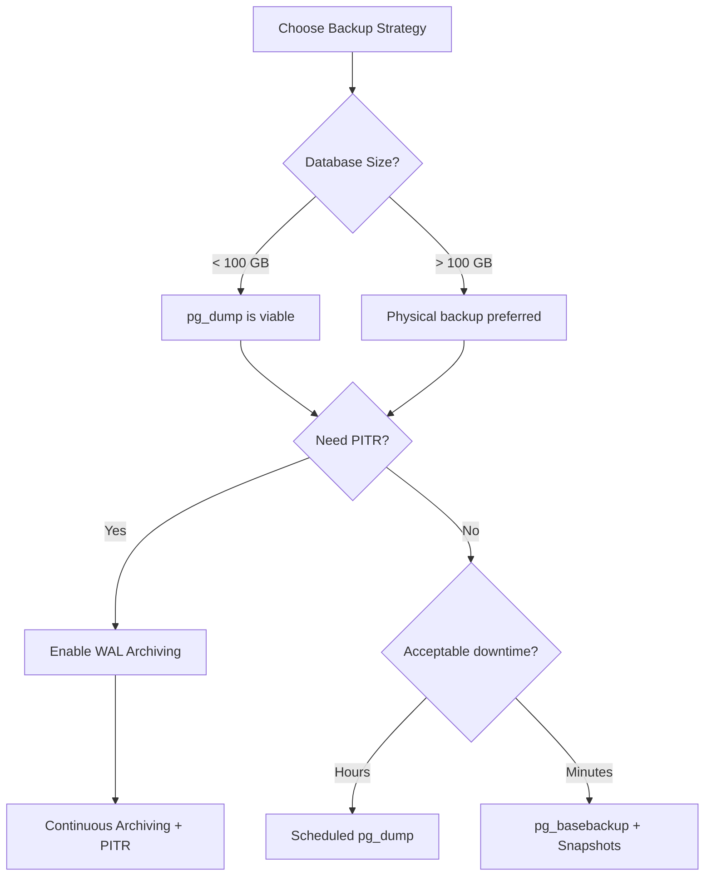
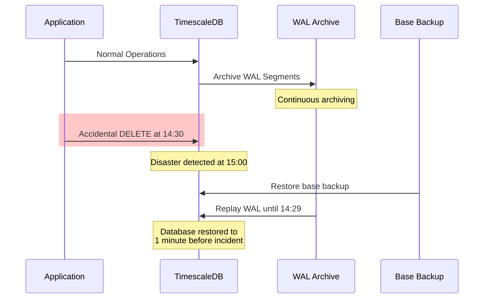
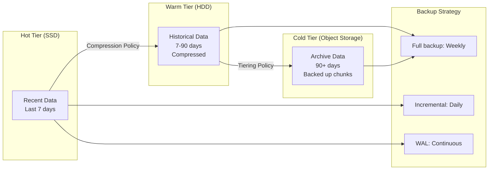

# How to Backup TimescaleDB Databases

Author: [nawazdhandala](https://www.github.com/nawazdhandala)

Tags: TimescaleDB, PostgreSQL, Backup, Disaster Recovery, WAL, Point-in-Time Recovery, Database, DevOps, SRE

Description: A comprehensive guide to backing up TimescaleDB databases covering pg_dump strategies, continuous archiving with WAL, point-in-time recovery, backup strategies for large hypertables, and restoration procedures.

---

> "A backup that has never been restored is not a backup-it is a hope. TimescaleDB's time-series workloads demand backup strategies that scale with terabytes of data and enable recovery to any point in time."

TimescaleDB extends PostgreSQL with hypertables optimized for time-series data. While it inherits PostgreSQL's proven backup mechanisms, the sheer volume of data in typical time-series workloads requires careful planning. This guide covers everything from simple logical backups to enterprise-grade continuous archiving with point-in-time recovery.

## Understanding TimescaleDB Backup Options

TimescaleDB supports three primary backup approaches, each with different trade-offs:

| Method | Best For | RPO | RTO | Complexity |
| --- | --- | --- | --- | --- |
| **pg_dump (Logical)** | Small databases, schema migrations, cross-version upgrades | Hours | Hours | Low |
| **pg_basebackup (Physical)** | Full cluster snapshots, replica seeding | Minutes | Minutes | Medium |
| **Continuous Archiving (WAL)** | Production systems needing point-in-time recovery | Seconds | Minutes | High |



## Logical Backups with pg_dump

For smaller TimescaleDB instances or when you need portable, human-readable backups, `pg_dump` remains the simplest option. TimescaleDB requires specific flags to preserve hypertable metadata correctly.

### Basic pg_dump for TimescaleDB

```bash
#!/bin/bash
# timescale_logical_backup.sh
# Creates a logical backup of a TimescaleDB database with proper hypertable handling

# Configuration
DB_NAME="your_timescale_db"
DB_HOST="localhost"
DB_PORT="5432"
DB_USER="postgres"
BACKUP_DIR="/var/backups/timescaledb"
DATE=$(date +%Y%m%d_%H%M%S)
BACKUP_FILE="${BACKUP_DIR}/${DB_NAME}_${DATE}.sql"

# Ensure backup directory exists
mkdir -p "${BACKUP_DIR}"

# pg_dump with TimescaleDB-specific options
# --no-tablespaces: Avoids tablespace-specific paths that may not exist on restore target
# --no-owner: Makes backup portable across different PostgreSQL users
# --no-privileges: Skips GRANT/REVOKE statements for portability
# --format=custom: Enables parallel restore and compression

pg_dump \
    --host="${DB_HOST}" \
    --port="${DB_PORT}" \
    --username="${DB_USER}" \
    --dbname="${DB_NAME}" \
    --format=custom \
    --compress=9 \
    --verbose \
    --file="${BACKUP_FILE}.dump" \
    2>&1 | tee "${BACKUP_FILE}.log"

# Verify backup integrity
if pg_restore --list "${BACKUP_FILE}.dump" > /dev/null 2>&1; then
    echo "Backup verified successfully: ${BACKUP_FILE}.dump"
    # Calculate and store checksum for integrity verification during restore
    sha256sum "${BACKUP_FILE}.dump" > "${BACKUP_FILE}.dump.sha256"
else
    echo "ERROR: Backup verification failed!"
    exit 1
fi

# Cleanup old backups (keep last 7 days)
find "${BACKUP_DIR}" -name "*.dump" -mtime +7 -delete
find "${BACKUP_DIR}" -name "*.log" -mtime +7 -delete
find "${BACKUP_DIR}" -name "*.sha256" -mtime +7 -delete
```

### Parallel Dump for Large Databases

When dealing with larger databases, parallel jobs significantly reduce backup time:

```bash
#!/bin/bash
# timescale_parallel_backup.sh
# Parallel logical backup for larger TimescaleDB databases

DB_NAME="your_timescale_db"
DB_HOST="localhost"
DB_USER="postgres"
BACKUP_DIR="/var/backups/timescaledb"
DATE=$(date +%Y%m%d_%H%M%S)
BACKUP_PATH="${BACKUP_DIR}/${DB_NAME}_${DATE}"

# Number of parallel jobs (typically match CPU cores, but consider I/O limits)
PARALLEL_JOBS=4

# Create directory-format backup for parallel processing
# Directory format is required for parallel dump/restore
pg_dump \
    --host="${DB_HOST}" \
    --username="${DB_USER}" \
    --dbname="${DB_NAME}" \
    --format=directory \
    --jobs="${PARALLEL_JOBS}" \
    --compress=9 \
    --verbose \
    --file="${BACKUP_PATH}" \
    2>&1 | tee "${BACKUP_PATH}.log"

# Compress the directory for storage/transfer
tar -czf "${BACKUP_PATH}.tar.gz" -C "${BACKUP_DIR}" "$(basename ${BACKUP_PATH})"

echo "Parallel backup complete: ${BACKUP_PATH}.tar.gz"
```

## Continuous Archiving with WAL

For production TimescaleDB deployments, continuous archiving provides near-zero data loss by streaming Write-Ahead Log (WAL) segments to a secure location. This enables point-in-time recovery to any moment within your retention window.

### Configuring WAL Archiving

```bash
# postgresql.conf settings for WAL archiving
# These settings enable continuous archiving for point-in-time recovery

# Enable WAL archiving
wal_level = replica                    # Required for archiving and replication
archive_mode = on                      # Enable WAL archiving
archive_command = '/usr/local/bin/archive_wal.sh %p %f'  # Script to archive WAL files

# WAL segment settings
max_wal_size = 4GB                     # Trigger checkpoint when WAL reaches this size
min_wal_size = 1GB                     # Keep at least this much WAL
wal_keep_size = 2GB                    # Minimum WAL to retain for standbys

# Checkpoint tuning for time-series workloads
checkpoint_timeout = 15min             # Maximum time between checkpoints
checkpoint_completion_target = 0.9     # Spread checkpoint I/O over 90% of interval

# WAL compression (PostgreSQL 15+)
wal_compression = zstd                 # Compress WAL segments (lz4, pglz, or zstd)
```

### WAL Archive Script

```bash
#!/bin/bash
# /usr/local/bin/archive_wal.sh
# Archives WAL segments to local storage and optionally to S3

set -e

WAL_PATH="$1"      # Full path to the WAL file (%p)
WAL_FILE="$2"      # WAL filename (%f)

# Local archive directory
LOCAL_ARCHIVE="/var/lib/postgresql/wal_archive"

# S3 bucket for offsite storage (optional)
S3_BUCKET="s3://your-bucket/timescaledb-wal"

# Ensure archive directory exists
mkdir -p "${LOCAL_ARCHIVE}"

# Copy WAL to local archive with compression
# Using gzip for compatibility; consider zstd for better compression/speed
gzip -c "${WAL_PATH}" > "${LOCAL_ARCHIVE}/${WAL_FILE}.gz"

# Verify the compressed file
if ! gzip -t "${LOCAL_ARCHIVE}/${WAL_FILE}.gz" 2>/dev/null; then
    echo "WAL compression verification failed: ${WAL_FILE}"
    rm -f "${LOCAL_ARCHIVE}/${WAL_FILE}.gz"
    exit 1
fi

# Optional: Upload to S3 for offsite backup
# Uncomment if using cloud storage
# aws s3 cp "${LOCAL_ARCHIVE}/${WAL_FILE}.gz" "${S3_BUCKET}/${WAL_FILE}.gz" \
#     --storage-class STANDARD_IA \
#     --only-show-errors

# Log successful archive
logger -t wal_archive "Archived WAL segment: ${WAL_FILE}"

exit 0
```

### Base Backup with pg_basebackup

WAL archiving alone is not enough-you need periodic base backups as restore starting points:

```bash
#!/bin/bash
# timescale_base_backup.sh
# Creates a physical base backup compatible with WAL archiving

DB_HOST="localhost"
DB_PORT="5432"
DB_USER="replication_user"  # User with REPLICATION privilege
BACKUP_DIR="/var/backups/timescaledb/base"
DATE=$(date +%Y%m%d_%H%M%S)
BACKUP_PATH="${BACKUP_DIR}/base_${DATE}"

mkdir -p "${BACKUP_PATH}"

# pg_basebackup options explained:
# -D: Target directory for the backup
# -Ft: Output format as tar files
# -z: Compress with gzip
# -Xs: Stream WAL during backup (ensures backup is self-contained)
# -P: Show progress
# -c fast: Request fast checkpoint to start backup quickly
# -l: Label for identifying the backup in pg_stat_replication

pg_basebackup \
    --host="${DB_HOST}" \
    --port="${DB_PORT}" \
    --username="${DB_USER}" \
    --pgdata="${BACKUP_PATH}" \
    --format=tar \
    --gzip \
    --wal-method=stream \
    --progress \
    --checkpoint=fast \
    --label="timescale_backup_${DATE}" \
    --verbose \
    2>&1 | tee "${BACKUP_PATH}.log"

# Record backup metadata for restore reference
cat > "${BACKUP_PATH}/backup_info.json" << EOF
{
    "backup_date": "${DATE}",
    "backup_type": "base_backup",
    "host": "${DB_HOST}",
    "method": "pg_basebackup",
    "wal_method": "stream",
    "compressed": true
}
EOF

echo "Base backup complete: ${BACKUP_PATH}"
```

## Point-in-Time Recovery (PITR)

PITR lets you restore your database to any moment within your WAL retention window. This is essential for recovering from accidental data deletion or corruption.



### PITR Restore Procedure

```bash
#!/bin/bash
# timescale_pitr_restore.sh
# Performs point-in-time recovery for TimescaleDB

set -e

# Configuration
BASE_BACKUP_PATH="/var/backups/timescaledb/base/base_20260127_000000"
WAL_ARCHIVE="/var/lib/postgresql/wal_archive"
PGDATA="/var/lib/postgresql/16/main"
RESTORE_TARGET="2026-01-27 14:29:00"  # Restore to just before the incident

# Stop PostgreSQL
echo "Stopping PostgreSQL..."
systemctl stop postgresql

# Backup current (corrupted) data directory just in case
echo "Backing up current data directory..."
mv "${PGDATA}" "${PGDATA}.corrupted.$(date +%Y%m%d_%H%M%S)"

# Create new data directory
mkdir -p "${PGDATA}"
chown postgres:postgres "${PGDATA}"
chmod 700 "${PGDATA}"

# Extract base backup
echo "Extracting base backup..."
cd "${PGDATA}"
tar -xzf "${BASE_BACKUP_PATH}/base.tar.gz"

# Extract tablespace backups if they exist
for tsbackup in "${BASE_BACKUP_PATH}"/*.tar.gz; do
    if [[ "$(basename ${tsbackup})" != "base.tar.gz" && "$(basename ${tsbackup})" != "pg_wal.tar.gz" ]]; then
        # Extract to appropriate tablespace location
        echo "Extracting tablespace: ${tsbackup}"
    fi
done

# Create recovery configuration
# PostgreSQL 12+ uses postgresql.auto.conf and recovery.signal
cat > "${PGDATA}/postgresql.auto.conf" << EOF
# Point-in-Time Recovery Configuration
restore_command = 'gunzip -c ${WAL_ARCHIVE}/%f.gz > %p'
recovery_target_time = '${RESTORE_TARGET}'
recovery_target_action = 'promote'
recovery_target_timeline = 'latest'
EOF

# Create recovery signal file
touch "${PGDATA}/recovery.signal"

# Set permissions
chown -R postgres:postgres "${PGDATA}"

# Start PostgreSQL in recovery mode
echo "Starting PostgreSQL for recovery..."
systemctl start postgresql

# Monitor recovery progress
echo "Monitoring recovery progress..."
while [ -f "${PGDATA}/recovery.signal" ]; do
    sleep 5
    echo "Recovery in progress... $(date)"
done

echo "Recovery complete! Database restored to: ${RESTORE_TARGET}"
```

## Backup Strategies for Large Hypertables

TimescaleDB hypertables can grow to terabytes with billions of rows. Standard backup approaches may not scale. Here are strategies for large datasets.

### Chunk-Based Incremental Backups

TimescaleDB organizes hypertable data into chunks (typically by time). You can backup only new or modified chunks:

```bash
#!/bin/bash
# timescale_incremental_chunk_backup.sh
# Backs up only chunks created since the last backup

DB_NAME="your_timescale_db"
DB_HOST="localhost"
DB_USER="postgres"
BACKUP_DIR="/var/backups/timescaledb/incremental"
LAST_BACKUP_FILE="${BACKUP_DIR}/.last_backup_time"
CURRENT_TIME=$(date -u +"%Y-%m-%d %H:%M:%S")

mkdir -p "${BACKUP_DIR}"

# Get last backup timestamp or default to 7 days ago
if [ -f "${LAST_BACKUP_FILE}" ]; then
    LAST_BACKUP=$(cat "${LAST_BACKUP_FILE}")
else
    LAST_BACKUP=$(date -u -d "7 days ago" +"%Y-%m-%d %H:%M:%S")
fi

echo "Backing up chunks created after: ${LAST_BACKUP}"

# Query TimescaleDB for chunks created since last backup
# This uses the timescaledb_information.chunks view
CHUNKS=$(psql -h "${DB_HOST}" -U "${DB_USER}" -d "${DB_NAME}" -t -A -F',' << EOF
SELECT
    format('%I.%I', chunk_schema, chunk_name) as chunk_table
FROM timescaledb_information.chunks
WHERE created > '${LAST_BACKUP}'::timestamptz
ORDER BY created;
EOF
)

if [ -z "${CHUNKS}" ]; then
    echo "No new chunks since last backup"
    exit 0
fi

# Backup each new chunk individually
BACKUP_SUBDIR="${BACKUP_DIR}/$(date +%Y%m%d_%H%M%S)"
mkdir -p "${BACKUP_SUBDIR}"

echo "${CHUNKS}" | while IFS=',' read -r chunk_table; do
    if [ -n "${chunk_table}" ]; then
        CHUNK_FILE="${BACKUP_SUBDIR}/$(echo ${chunk_table} | tr '.' '_').dump"
        echo "Backing up chunk: ${chunk_table}"

        pg_dump \
            --host="${DB_HOST}" \
            --username="${DB_USER}" \
            --dbname="${DB_NAME}" \
            --format=custom \
            --compress=9 \
            --table="${chunk_table}" \
            --file="${CHUNK_FILE}"
    fi
done

# Update last backup timestamp
echo "${CURRENT_TIME}" > "${LAST_BACKUP_FILE}"

echo "Incremental backup complete: ${BACKUP_SUBDIR}"
```

### Using TimescaleDB Native Compression Before Backup

Compress hypertable data before backing up to reduce backup size and time:

```sql
-- Enable compression on a hypertable
-- This should be done during table design, not just before backup

-- First, add a compression policy
ALTER TABLE metrics SET (
    timescaledb.compress,
    timescaledb.compress_segmentby = 'device_id',
    timescaledb.compress_orderby = 'time DESC'
);

-- Create a compression policy to automatically compress old chunks
-- Chunks older than 7 days will be compressed
SELECT add_compression_policy('metrics', INTERVAL '7 days');

-- Manually compress all eligible chunks before a backup
-- This query compresses all uncompressed chunks older than the policy interval
SELECT compress_chunk(chunk)
FROM show_chunks('metrics', older_than => INTERVAL '7 days') AS chunk
WHERE NOT EXISTS (
    SELECT 1 FROM timescaledb_information.compressed_chunk_stats
    WHERE hypertable_name = 'metrics'
    AND chunk_name = split_part(chunk::text, '.', 2)
);

-- Verify compression status before backup
SELECT
    hypertable_name,
    total_chunks,
    compressed_chunks,
    pg_size_pretty(before_compression_bytes) as before_size,
    pg_size_pretty(after_compression_bytes) as after_size,
    round((1 - after_compression_bytes::numeric /
           NULLIF(before_compression_bytes, 0)) * 100, 2) as compression_ratio
FROM timescaledb_information.compression_stats;
```

### Tiered Storage with Backup Considerations



## Restoration Procedures

### Full Logical Restore

```bash
#!/bin/bash
# timescale_full_restore.sh
# Restores a TimescaleDB database from a pg_dump backup

set -e

BACKUP_FILE="/var/backups/timescaledb/your_db_20260127.dump"
DB_NAME="restored_timescale_db"
DB_HOST="localhost"
DB_USER="postgres"

# Verify backup file exists and checksum matches
if [ ! -f "${BACKUP_FILE}" ]; then
    echo "ERROR: Backup file not found: ${BACKUP_FILE}"
    exit 1
fi

if [ -f "${BACKUP_FILE}.sha256" ]; then
    echo "Verifying backup checksum..."
    sha256sum -c "${BACKUP_FILE}.sha256" || {
        echo "ERROR: Checksum verification failed!"
        exit 1
    }
fi

# Create the target database with TimescaleDB extension
echo "Creating target database..."
psql -h "${DB_HOST}" -U "${DB_USER}" -d postgres << EOF
-- Drop existing database if it exists (careful in production!)
DROP DATABASE IF EXISTS ${DB_NAME};

-- Create fresh database
CREATE DATABASE ${DB_NAME};
EOF

# Connect to new database and enable TimescaleDB extension
psql -h "${DB_HOST}" -U "${DB_USER}" -d "${DB_NAME}" << EOF
-- Enable TimescaleDB extension BEFORE restore
CREATE EXTENSION IF NOT EXISTS timescaledb;

-- Set session parameters for faster restore
SET timescaledb.restoring = 'on';
EOF

# Restore the backup
# --jobs: Parallel restore (match to CPU cores)
# --no-owner: Don't try to set original ownership
# --no-privileges: Skip GRANT/REVOKE statements
# --disable-triggers: Prevent trigger execution during restore

echo "Starting restore..."
pg_restore \
    --host="${DB_HOST}" \
    --username="${DB_USER}" \
    --dbname="${DB_NAME}" \
    --jobs=4 \
    --no-owner \
    --no-privileges \
    --verbose \
    "${BACKUP_FILE}" \
    2>&1 | tee "restore_$(date +%Y%m%d_%H%M%S).log"

# Re-enable TimescaleDB features after restore
psql -h "${DB_HOST}" -U "${DB_USER}" -d "${DB_NAME}" << EOF
-- Turn off restore mode
SET timescaledb.restoring = 'off';

-- Analyze tables to update statistics
ANALYZE;

-- Verify hypertables were restored correctly
SELECT hypertable_name,
       num_dimensions,
       num_chunks
FROM timescaledb_information.hypertables;
EOF

echo "Restore complete: ${DB_NAME}"
```

### Selective Chunk Restore

When you only need to restore specific time ranges:

```bash
#!/bin/bash
# timescale_selective_restore.sh
# Restores specific chunks or time ranges from backup

DB_NAME="your_timescale_db"
DB_HOST="localhost"
DB_USER="postgres"
BACKUP_FILE="/var/backups/timescaledb/your_db.dump"
HYPERTABLE="metrics"
START_DATE="2026-01-01"
END_DATE="2026-01-15"

# List chunks in the backup that match our criteria
echo "Identifying chunks to restore..."
CHUNK_LIST=$(pg_restore --list "${BACKUP_FILE}" | grep "_hyper_" | grep "${HYPERTABLE}")

# Create a restore list file with only the chunks we need
RESTORE_LIST="/tmp/restore_list.txt"
pg_restore --list "${BACKUP_FILE}" > "${RESTORE_LIST}"

# First restore the schema and hypertable definitions
echo "Restoring schema..."
pg_restore \
    --host="${DB_HOST}" \
    --username="${DB_USER}" \
    --dbname="${DB_NAME}" \
    --schema-only \
    "${BACKUP_FILE}"

# Then restore specific data using COPY commands
# This approach lets you filter by examining chunk boundaries
psql -h "${DB_HOST}" -U "${DB_USER}" -d "${DB_NAME}" << EOF
-- Identify which chunks overlap with our date range
SELECT chunk_schema, chunk_name, range_start, range_end
FROM timescaledb_information.chunks
WHERE hypertable_name = '${HYPERTABLE}'
  AND range_start >= '${START_DATE}'::timestamptz
  AND range_end <= '${END_DATE}'::timestamptz;
EOF

echo "Selective restore complete for ${HYPERTABLE} from ${START_DATE} to ${END_DATE}"
```

## Backup Monitoring and Alerting

Integrate backup monitoring with your observability stack:

```bash
#!/bin/bash
# timescale_backup_monitor.sh
# Monitors backup jobs and sends metrics to OneUptime or Prometheus

BACKUP_DIR="/var/backups/timescaledb"
METRICS_FILE="/var/lib/node_exporter/textfile_collector/timescale_backup.prom"

# Find the most recent backup
LATEST_BACKUP=$(ls -t "${BACKUP_DIR}"/*.dump 2>/dev/null | head -1)

if [ -z "${LATEST_BACKUP}" ]; then
    # No backup found - critical alert
    BACKUP_AGE_HOURS=999
    BACKUP_SIZE_BYTES=0
    BACKUP_STATUS=0
else
    # Calculate backup age in hours
    BACKUP_TIMESTAMP=$(stat -c %Y "${LATEST_BACKUP}")
    CURRENT_TIMESTAMP=$(date +%s)
    BACKUP_AGE_HOURS=$(( (CURRENT_TIMESTAMP - BACKUP_TIMESTAMP) / 3600 ))
    BACKUP_SIZE_BYTES=$(stat -c %s "${LATEST_BACKUP}")
    BACKUP_STATUS=1
fi

# Write Prometheus metrics
cat > "${METRICS_FILE}" << EOF
# HELP timescaledb_backup_age_hours Hours since last successful backup
# TYPE timescaledb_backup_age_hours gauge
timescaledb_backup_age_hours ${BACKUP_AGE_HOURS}

# HELP timescaledb_backup_size_bytes Size of the latest backup in bytes
# TYPE timescaledb_backup_size_bytes gauge
timescaledb_backup_size_bytes ${BACKUP_SIZE_BYTES}

# HELP timescaledb_backup_success Whether the last backup was successful
# TYPE timescaledb_backup_success gauge
timescaledb_backup_success ${BACKUP_STATUS}
EOF

# Alert if backup is too old (> 25 hours for daily backups)
if [ ${BACKUP_AGE_HOURS} -gt 25 ]; then
    echo "CRITICAL: TimescaleDB backup is ${BACKUP_AGE_HOURS} hours old!"
    # Send alert to OneUptime or your alerting system
    # curl -X POST "https://oneuptime.com/api/alert" -d "..."
fi
```

## Best Practices Summary

1. **Layer your backup strategy**: Combine continuous WAL archiving for point-in-time recovery with periodic base backups and logical dumps for portability.

2. **Compress before backing up**: Use TimescaleDB native compression on older chunks to reduce backup size by 90% or more.

3. **Test restores regularly**: Schedule monthly restore drills to a staging environment. A backup that cannot be restored is worthless.

4. **Monitor backup freshness**: Alert if backups are older than expected. Integrate with [OneUptime](https://oneuptime.com) to track backup job success and receive immediate notifications of failures.

5. **Use appropriate retention**: Hot backups for 7-14 days, warm storage for 90 days, cold archive for compliance requirements. Delete what you do not need.

6. **Secure your backups**: Encrypt backups at rest, restrict access with IAM policies, and store copies in multiple geographic regions.

7. **Document recovery procedures**: Write runbooks for each recovery scenario (full restore, PITR, selective chunk restore) and keep them updated.

8. **Size your backup infrastructure**: Backup I/O should not compete with production workloads. Use dedicated backup replicas for large databases.

9. **Consider TimescaleDB Cloud**: For managed backups with automatic PITR, retention management, and one-click restores, [TimescaleDB Cloud](https://www.timescale.com/cloud) eliminates operational overhead.

10. **Track backup metrics**: Monitor backup duration, size trends, and success rates. Growing backup times often indicate data growth that needs attention.

---

**Monitor your backup infrastructure with OneUptime.** Set up alerts for failed backup jobs, track backup freshness, and ensure your disaster recovery procedures work when you need them. [Get started with OneUptime](https://oneuptime.com) for comprehensive infrastructure monitoring.
