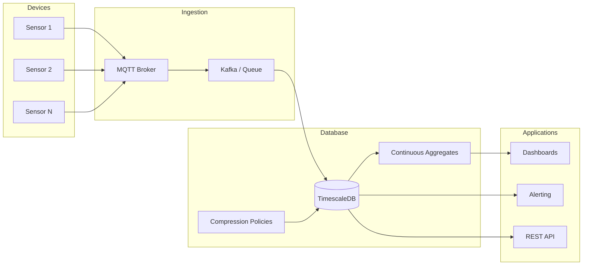
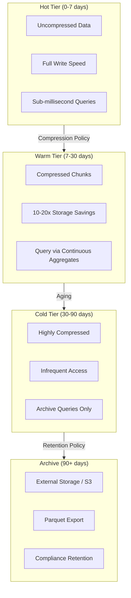

# How to Use TimescaleDB for IoT Data

By [Nawaz Dhandala](https://github.com/nawazdhandala)

Tags: TimescaleDB, IoT, Time-Series, PostgreSQL, Monitoring, Data Engineering, DevOps

Description: A comprehensive guide to using TimescaleDB for IoT data management, covering schema design, high-throughput ingestion, device aggregation, real-time monitoring queries, and data retention strategies.

---

> "The Internet of Things is not about things. It is about data. And TimescaleDB is how you tame that data at scale." - Ajay Kulkarni, Co-founder of Timescale

IoT deployments generate relentless streams of sensor readings, device telemetry, and machine metrics. Traditional relational databases buckle under this write pressure; pure key-value stores sacrifice query flexibility. TimescaleDB bridges the gap: it extends PostgreSQL with automatic partitioning (hypertables), columnar compression, and continuous aggregates that make time-series workloads efficient without abandoning SQL.

## Architecture Overview

Before diving into code, understand how TimescaleDB fits into a typical IoT pipeline.



Devices publish telemetry through MQTT or similar protocols. A message broker buffers bursts and decouples producers from the database. TimescaleDB ingests the data into hypertables, applies compression policies for older data, and maintains continuous aggregates for fast dashboard queries.

## Schema Design for IoT Data

The foundation of any IoT system is a well-designed schema. TimescaleDB's hypertables automatically partition data by time, but you need to design the underlying table structure thoughtfully.

```sql
-- Enable TimescaleDB extension
-- This transforms PostgreSQL into a time-series powerhouse
CREATE EXTENSION IF NOT EXISTS timescaledb;

-- Create the base table for device readings
-- Use a narrow schema: one row per measurement, not wide tables
CREATE TABLE device_readings (
    -- Timestamp is the primary partitioning key
    time        TIMESTAMPTZ       NOT NULL,

    -- Device identification
    device_id   TEXT              NOT NULL,
    location_id TEXT              NOT NULL,

    -- Measurement data
    metric_name TEXT              NOT NULL,
    value       DOUBLE PRECISION  NOT NULL,

    -- Optional metadata (keep sparse to reduce storage)
    unit        TEXT,
    quality     SMALLINT          DEFAULT 100
);

-- Convert to a hypertable partitioned by time
-- chunk_time_interval determines partition size (1 day is common for IoT)
SELECT create_hypertable(
    'device_readings',
    'time',
    chunk_time_interval => INTERVAL '1 day'
);

-- Add a composite index for common query patterns
-- Most IoT queries filter by device + time range
CREATE INDEX idx_device_time
    ON device_readings (device_id, time DESC);

-- Index for location-based queries (fleet dashboards)
CREATE INDEX idx_location_time
    ON device_readings (location_id, time DESC);

-- Partial index for quality issues (alerting queries)
CREATE INDEX idx_quality_issues
    ON device_readings (time DESC, device_id)
    WHERE quality < 80;
```

### Why This Schema Works

1. **Narrow tables over wide tables:** One row per metric allows flexible device types without schema changes.
2. **Chunk interval matches retention:** Daily chunks align with common retention policies (keep 30 days hot, compress older).
3. **Composite indexes:** Time alone is insufficient; most queries filter by device or location first.

## High-Throughput Ingestion

IoT systems often need to ingest thousands or millions of data points per second. TimescaleDB provides several strategies for maximizing write throughput.

```sql
-- COPY is the fastest way to bulk load data
-- Use this for batch imports from files or ETL pipelines
COPY device_readings (time, device_id, location_id, metric_name, value, unit)
FROM '/data/sensor_batch_2026_01_27.csv'
WITH (FORMAT csv, HEADER true);

-- For streaming inserts, use multi-row INSERT statements
-- Batching 1000+ rows per INSERT dramatically improves throughput
INSERT INTO device_readings (time, device_id, location_id, metric_name, value, unit)
VALUES
    ('2026-01-27 10:00:00+00', 'sensor-001', 'factory-a', 'temperature', 23.5, 'celsius'),
    ('2026-01-27 10:00:00+00', 'sensor-001', 'factory-a', 'humidity', 45.2, 'percent'),
    ('2026-01-27 10:00:00+00', 'sensor-002', 'factory-a', 'temperature', 24.1, 'celsius'),
    ('2026-01-27 10:00:00+00', 'sensor-002', 'factory-a', 'pressure', 1013.25, 'hPa'),
    -- ... batch hundreds more rows per INSERT
    ('2026-01-27 10:00:01+00', 'sensor-003', 'factory-b', 'vibration', 0.05, 'g');
```

### Application-Level Batching (Node.js Example)

```javascript
// High-throughput ingestion using connection pooling and batching
// This pattern handles 50,000+ inserts/second on modest hardware

const { Pool } = require('pg');

// Connection pool configuration optimized for write-heavy workloads
const pool = new Pool({
    host: process.env.TIMESCALE_HOST,
    port: 5432,
    database: 'iot_platform',
    user: process.env.TIMESCALE_USER,
    password: process.env.TIMESCALE_PASSWORD,
    // More connections = more parallel writes (tune based on CPU cores)
    max: 20,
    // Keep connections alive to avoid reconnection overhead
    idleTimeoutMillis: 30000,
});

// Buffer for batching incoming readings
let readingBuffer = [];
const BATCH_SIZE = 1000;       // Rows per INSERT
const FLUSH_INTERVAL_MS = 100; // Max latency before flush

// Flush buffer to database using parameterized multi-row INSERT
async function flushReadings() {
    if (readingBuffer.length === 0) return;

    const batch = readingBuffer.splice(0, BATCH_SIZE);

    // Build parameterized query to prevent SQL injection
    // Each row needs 6 parameters: time, device_id, location_id, metric_name, value, unit
    const values = [];
    const placeholders = batch.map((reading, i) => {
        const offset = i * 6;
        values.push(
            reading.time,
            reading.deviceId,
            reading.locationId,
            reading.metricName,
            reading.value,
            reading.unit
        );
        return `($${offset + 1}, $${offset + 2}, $${offset + 3}, $${offset + 4}, $${offset + 5}, $${offset + 6})`;
    });

    const query = `
        INSERT INTO device_readings (time, device_id, location_id, metric_name, value, unit)
        VALUES ${placeholders.join(', ')}
    `;

    try {
        await pool.query(query, values);
        console.log(`Flushed ${batch.length} readings`);
    } catch (error) {
        console.error('Batch insert failed:', error.message);
        // Implement retry logic or dead-letter queue here
    }
}

// Add reading to buffer, flush when full
function addReading(reading) {
    readingBuffer.push({
        time: reading.timestamp || new Date(),
        deviceId: reading.device_id,
        locationId: reading.location_id,
        metricName: reading.metric,
        value: reading.value,
        unit: reading.unit || null,
    });

    if (readingBuffer.length >= BATCH_SIZE) {
        flushReadings();
    }
}

// Periodic flush to bound latency
setInterval(flushReadings, FLUSH_INTERVAL_MS);

// Example: ingesting from MQTT
const mqtt = require('mqtt');
const client = mqtt.connect(process.env.MQTT_BROKER_URL);

client.on('connect', () => {
    client.subscribe('sensors/+/telemetry');
});

client.on('message', (topic, message) => {
    const reading = JSON.parse(message.toString());
    addReading(reading);
});
```

## Device Data Aggregation

Raw sensor data is useful for debugging but expensive for dashboards. TimescaleDB's continuous aggregates automatically materialize rollups that refresh incrementally.

```sql
-- Create a continuous aggregate for hourly device statistics
-- This pre-computes aggregations and refreshes automatically
CREATE MATERIALIZED VIEW device_hourly_stats
WITH (timescaledb.continuous) AS
SELECT
    -- time_bucket groups timestamps into fixed intervals
    time_bucket('1 hour', time) AS bucket,
    device_id,
    location_id,
    metric_name,

    -- Statistical aggregates for each metric
    AVG(value)                    AS avg_value,
    MIN(value)                    AS min_value,
    MAX(value)                    AS max_value,
    STDDEV(value)                 AS stddev_value,
    COUNT(*)                      AS sample_count,

    -- Percentiles require ordered-set aggregate
    PERCENTILE_CONT(0.5) WITHIN GROUP (ORDER BY value) AS median_value,
    PERCENTILE_CONT(0.95) WITHIN GROUP (ORDER BY value) AS p95_value,
    PERCENTILE_CONT(0.99) WITHIN GROUP (ORDER BY value) AS p99_value

FROM device_readings
GROUP BY bucket, device_id, location_id, metric_name
WITH NO DATA;  -- Don't backfill initially; do it in a maintenance window

-- Configure automatic refresh policy
-- Refresh the last 3 hours every 30 minutes to catch late-arriving data
SELECT add_continuous_aggregate_policy(
    'device_hourly_stats',
    start_offset    => INTERVAL '3 hours',
    end_offset      => INTERVAL '1 hour',
    schedule_interval => INTERVAL '30 minutes'
);

-- Create a daily rollup for long-term trend analysis
CREATE MATERIALIZED VIEW device_daily_stats
WITH (timescaledb.continuous) AS
SELECT
    time_bucket('1 day', time) AS bucket,
    device_id,
    location_id,
    metric_name,
    AVG(value)   AS avg_value,
    MIN(value)   AS min_value,
    MAX(value)   AS max_value,
    COUNT(*)     AS sample_count
FROM device_readings
GROUP BY bucket, device_id, location_id, metric_name
WITH NO DATA;

SELECT add_continuous_aggregate_policy(
    'device_daily_stats',
    start_offset    => INTERVAL '3 days',
    end_offset      => INTERVAL '1 day',
    schedule_interval => INTERVAL '1 day'
);

-- Backfill historical data (run during low-traffic periods)
CALL refresh_continuous_aggregate('device_hourly_stats', '2025-01-01', '2026-01-27');
CALL refresh_continuous_aggregate('device_daily_stats', '2025-01-01', '2026-01-27');
```

### Fleet-Level Aggregation

```sql
-- Location-level aggregates for fleet dashboards
-- Aggregates across all devices in a location
CREATE MATERIALIZED VIEW location_hourly_summary
WITH (timescaledb.continuous) AS
SELECT
    time_bucket('1 hour', time) AS bucket,
    location_id,
    metric_name,

    -- Fleet-level statistics
    AVG(value)        AS fleet_avg,
    MIN(value)        AS fleet_min,
    MAX(value)        AS fleet_max,
    COUNT(DISTINCT device_id) AS active_devices,
    COUNT(*)          AS total_readings

FROM device_readings
GROUP BY bucket, location_id, metric_name
WITH NO DATA;

SELECT add_continuous_aggregate_policy(
    'location_hourly_summary',
    start_offset    => INTERVAL '2 hours',
    end_offset      => INTERVAL '1 hour',
    schedule_interval => INTERVAL '15 minutes'
);
```

## Real-Time Monitoring Queries

IoT monitoring requires both real-time queries and historical analysis. Here are optimized query patterns for common use cases.

```sql
-- Query 1: Latest reading from each device (real-time dashboard)
-- Uses DISTINCT ON which is optimized with the composite index
SELECT DISTINCT ON (device_id, metric_name)
    device_id,
    metric_name,
    time,
    value,
    unit
FROM device_readings
WHERE
    location_id = 'factory-a'
    AND time > NOW() - INTERVAL '5 minutes'
ORDER BY device_id, metric_name, time DESC;

-- Query 2: Devices that haven't reported recently (stale device detection)
-- Critical for IoT health monitoring
WITH latest_readings AS (
    SELECT
        device_id,
        MAX(time) AS last_seen
    FROM device_readings
    WHERE time > NOW() - INTERVAL '1 hour'
    GROUP BY device_id
)
SELECT
    d.device_id,
    d.last_seen,
    EXTRACT(EPOCH FROM (NOW() - d.last_seen)) AS seconds_since_last
FROM latest_readings d
WHERE d.last_seen < NOW() - INTERVAL '5 minutes'
ORDER BY d.last_seen ASC;

-- Query 3: Anomaly detection using statistical thresholds
-- Find readings that deviate significantly from recent averages
WITH recent_stats AS (
    SELECT
        device_id,
        metric_name,
        AVG(value) AS avg_value,
        STDDEV(value) AS stddev_value
    FROM device_readings
    WHERE time > NOW() - INTERVAL '1 hour'
    GROUP BY device_id, metric_name
)
SELECT
    r.time,
    r.device_id,
    r.metric_name,
    r.value,
    s.avg_value,
    s.stddev_value,
    ABS(r.value - s.avg_value) / NULLIF(s.stddev_value, 0) AS z_score
FROM device_readings r
JOIN recent_stats s
    ON r.device_id = s.device_id
    AND r.metric_name = s.metric_name
WHERE
    r.time > NOW() - INTERVAL '5 minutes'
    AND ABS(r.value - s.avg_value) > 3 * s.stddev_value  -- 3-sigma outliers
ORDER BY r.time DESC;

-- Query 4: Time-weighted averages for irregular sampling
-- Handles devices that report at varying intervals
SELECT
    device_id,
    metric_name,
    time_bucket('1 hour', time) AS hour,
    -- TimescaleDB's time_weight functions handle irregular intervals
    average(time_weight('Linear', time, value)) AS time_weighted_avg
FROM device_readings
WHERE
    device_id = 'sensor-001'
    AND metric_name = 'temperature'
    AND time > NOW() - INTERVAL '24 hours'
GROUP BY device_id, metric_name, hour
ORDER BY hour;

-- Query 5: Rate of change detection (trend monitoring)
-- Identify rapidly changing metrics
SELECT
    time_bucket('5 minutes', time) AS bucket,
    device_id,
    metric_name,
    FIRST(value, time) AS start_value,
    LAST(value, time) AS end_value,
    LAST(value, time) - FIRST(value, time) AS delta,
    (LAST(value, time) - FIRST(value, time)) /
        EXTRACT(EPOCH FROM (MAX(time) - MIN(time))) AS rate_per_second
FROM device_readings
WHERE
    location_id = 'factory-a'
    AND time > NOW() - INTERVAL '1 hour'
GROUP BY bucket, device_id, metric_name
HAVING COUNT(*) > 1
ORDER BY ABS(LAST(value, time) - FIRST(value, time)) DESC
LIMIT 20;
```

### Alerting Query Pattern

```sql
-- Create a view for alerting systems to poll
-- This powers threshold-based alerts in monitoring tools
CREATE VIEW active_alerts AS
SELECT
    time,
    device_id,
    location_id,
    metric_name,
    value,
    CASE
        WHEN metric_name = 'temperature' AND value > 80 THEN 'CRITICAL'
        WHEN metric_name = 'temperature' AND value > 70 THEN 'WARNING'
        WHEN metric_name = 'humidity' AND value > 90 THEN 'CRITICAL'
        WHEN metric_name = 'humidity' AND value < 20 THEN 'WARNING'
        WHEN metric_name = 'pressure' AND value < 950 THEN 'WARNING'
        ELSE 'OK'
    END AS severity
FROM device_readings
WHERE
    time > NOW() - INTERVAL '5 minutes'
    AND (
        (metric_name = 'temperature' AND (value > 70 OR value < 0))
        OR (metric_name = 'humidity' AND (value > 90 OR value < 20))
        OR (metric_name = 'pressure' AND value < 950)
    );
```

## Data Retention and Compression

IoT data grows fast. TimescaleDB provides automated retention policies and columnar compression to manage storage costs.

```sql
-- Enable compression on the hypertable
-- Compress by device_id to group related readings together
ALTER TABLE device_readings SET (
    timescaledb.compress,
    -- Segment by device for efficient device-specific queries on compressed data
    timescaledb.compress_segmentby = 'device_id, location_id',
    -- Order by time within segments for range queries
    timescaledb.compress_orderby = 'time DESC'
);

-- Add compression policy: compress chunks older than 7 days
-- Recent data stays uncompressed for fast writes/updates
SELECT add_compression_policy(
    'device_readings',
    compress_after => INTERVAL '7 days'
);

-- Add retention policy: drop chunks older than 90 days
-- Adjust based on compliance requirements and storage budget
SELECT add_retention_policy(
    'device_readings',
    drop_after => INTERVAL '90 days'
);

-- View compression statistics
SELECT
    chunk_name,
    before_compression_total_bytes,
    after_compression_total_bytes,
    ROUND(
        (1 - after_compression_total_bytes::numeric /
         before_compression_total_bytes::numeric) * 100,
        2
    ) AS compression_ratio_percent
FROM chunk_compression_stats('device_readings')
ORDER BY chunk_name DESC
LIMIT 10;

-- Manual compression for immediate effect (useful during migration)
SELECT compress_chunk(chunk)
FROM show_chunks('device_readings', older_than => INTERVAL '7 days') AS chunk;
```

### Tiered Storage Strategy



### Export to Cold Storage

```sql
-- Export old data to CSV before retention policy drops it
-- Run this as a scheduled job for compliance archives
COPY (
    SELECT *
    FROM device_readings
    WHERE time >= '2025-10-01' AND time < '2025-11-01'
    ORDER BY time
)
TO '/archive/device_readings_2025_10.csv'
WITH (FORMAT csv, HEADER true);

-- Or use pg_dump for chunk-level backups
-- Useful for disaster recovery of specific time ranges
```

## Monitoring TimescaleDB Health

Monitor the database itself to ensure your IoT platform stays healthy.

```sql
-- Check hypertable size and chunk count
SELECT
    hypertable_name,
    table_size,
    index_size,
    toast_size,
    total_size,
    compression_ratio
FROM timescaledb_information.hypertable
WHERE hypertable_name = 'device_readings';

-- Monitor chunk distribution (ensure even partitioning)
SELECT
    chunk_name,
    range_start,
    range_end,
    is_compressed,
    pg_size_pretty(total_bytes) AS chunk_size
FROM timescaledb_information.chunks
WHERE hypertable_name = 'device_readings'
ORDER BY range_start DESC
LIMIT 20;

-- Check continuous aggregate refresh status
SELECT
    view_name,
    materialization_hypertable_name,
    refresh_lag,
    max_interval_per_refresh
FROM timescaledb_information.continuous_aggregates;

-- Identify slow queries (requires pg_stat_statements)
SELECT
    query,
    calls,
    total_exec_time / calls AS avg_time_ms,
    rows / calls AS avg_rows
FROM pg_stat_statements
WHERE query LIKE '%device_readings%'
ORDER BY total_exec_time DESC
LIMIT 10;
```

## Best Practices Summary

| Area | Recommendation |
|------|----------------|
| **Schema Design** | Use narrow tables (one row per metric). Include device_id and time in primary index. |
| **Chunk Interval** | Match chunk size to retention granularity (1 day for 30-day retention). |
| **Ingestion** | Batch inserts (1000+ rows). Use COPY for bulk loads. Pool connections. |
| **Indexing** | Composite index on (device_id, time DESC). Add partial indexes for alerting queries. |
| **Aggregation** | Use continuous aggregates for dashboards. Refresh hourly aggregates every 15-30 minutes. |
| **Compression** | Compress after 7 days. Segment by device_id for query efficiency. Expect 10-20x savings. |
| **Retention** | Automate with retention policies. Export to cold storage before deletion for compliance. |
| **Monitoring** | Track chunk sizes, compression ratios, and query performance. Alert on refresh lag. |

## Integration with Observability

TimescaleDB metrics should flow into your observability platform. Use [OneUptime](https://oneuptime.com) to monitor both your IoT application and the TimescaleDB instance itself:

- **Database metrics:** Connection pool usage, query latency, replication lag
- **Application metrics:** Ingestion rate, buffer sizes, error rates
- **Alerting:** Stale device detection, compression job failures, storage thresholds
- **Dashboards:** Real-time device telemetry alongside infrastructure health

By combining TimescaleDB's time-series capabilities with comprehensive observability, you build IoT platforms that scale reliably and fail gracefully.
