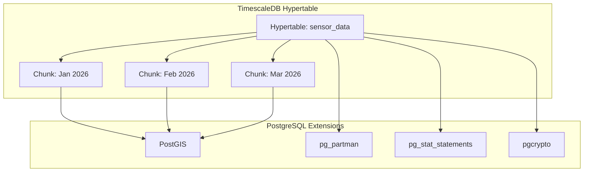
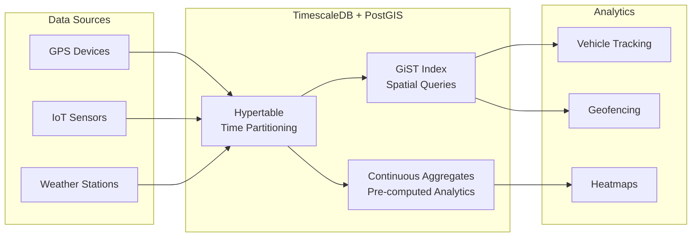
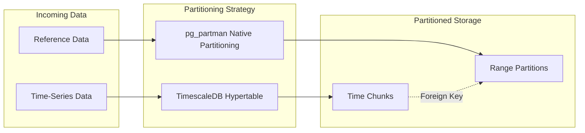
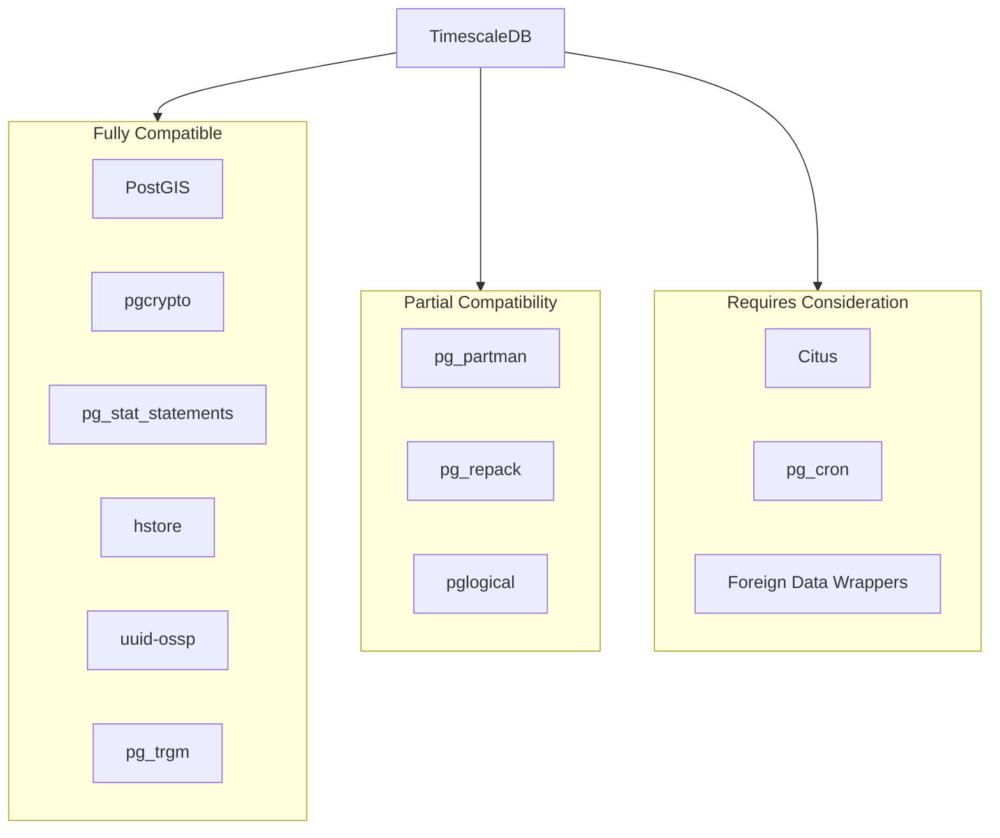
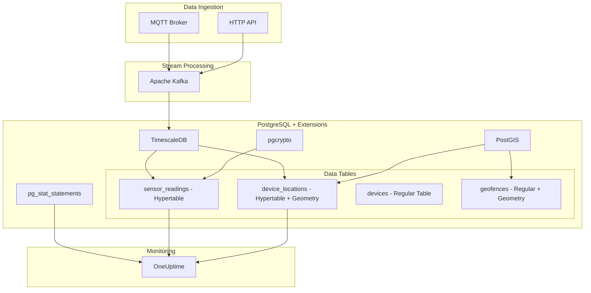

# How to Use TimescaleDB with PostgreSQL Extensions

Author: [nawazdhandala](https://www.github.com/nawazdhandala)

Tags: TimescaleDB, PostgreSQL, Extensions, PostGIS, pg_partman, Time-Series, Database, Performance, DevOps

Description: A comprehensive guide to combining TimescaleDB with other PostgreSQL extensions like PostGIS and pg_partman, covering extension compatibility, installation patterns, performance optimization, and real-world use cases for time-series data.

---

> "The best database is the one that lets you compose the right tools for the job. TimescaleDB turns PostgreSQL into a time-series powerhouse without forcing you to abandon the extension ecosystem you already depend on."

TimescaleDB transforms PostgreSQL into a high-performance time-series database while preserving full SQL compatibility. But the real power comes from combining it with other PostgreSQL extensions. This guide walks through practical patterns for integrating TimescaleDB with PostGIS, pg_partman, and other extensions to build sophisticated data pipelines.

## Understanding TimescaleDB Architecture

TimescaleDB works by automatically partitioning your data into chunks based on time intervals. Each chunk is a standard PostgreSQL table, which means other extensions can interact with the data normally.



## Installing TimescaleDB with Extensions

Before combining extensions, ensure TimescaleDB is properly installed alongside your target extensions.

```sql
-- Enable TimescaleDB extension
-- This must be done by a superuser or user with CREATE privilege
CREATE EXTENSION IF NOT EXISTS timescaledb;

-- Enable PostGIS for geospatial data
-- PostGIS provides geometry and geography types plus spatial functions
CREATE EXTENSION IF NOT EXISTS postgis;

-- Enable pg_stat_statements for query performance monitoring
-- Tracks execution statistics for all SQL statements
CREATE EXTENSION IF NOT EXISTS pg_stat_statements;

-- Enable pgcrypto for encryption functions
-- Useful for encrypting sensitive time-series data at rest
CREATE EXTENSION IF NOT EXISTS pgcrypto;

-- Verify all extensions are loaded
SELECT extname, extversion
FROM pg_extension
WHERE extname IN ('timescaledb', 'postgis', 'pg_stat_statements', 'pgcrypto');
```

## Combining TimescaleDB with PostGIS

One of the most powerful combinations is TimescaleDB with PostGIS for geospatial time-series data. This enables tracking vehicle fleets, IoT sensors with locations, weather stations, and more.



### Creating a Geospatial Hypertable

```sql
-- Create a table for vehicle tracking with location data
-- Combines TimescaleDB time-series with PostGIS geometry
CREATE TABLE vehicle_positions (
    -- Timestamp column required for hypertable partitioning
    time        TIMESTAMPTZ NOT NULL,

    -- Vehicle identifier for multi-tenant queries
    vehicle_id  TEXT NOT NULL,

    -- PostGIS geometry column for storing GPS coordinates
    -- SRID 4326 is WGS84, the standard GPS coordinate system
    location    GEOMETRY(Point, 4326) NOT NULL,

    -- Additional telemetry data
    speed_kmh   DOUBLE PRECISION,
    heading     DOUBLE PRECISION,

    -- Metadata stored as JSONB for flexibility
    metadata    JSONB DEFAULT '{}'
);

-- Convert to hypertable with 1-day chunks
-- Chunk interval should match your typical query patterns
SELECT create_hypertable(
    'vehicle_positions',
    'time',
    chunk_time_interval => INTERVAL '1 day'
);

-- Create a spatial index on the location column
-- GIST index enables fast spatial queries (within, intersects, etc.)
CREATE INDEX idx_vehicle_positions_location
    ON vehicle_positions USING GIST (location);

-- Create a compound index for time + vehicle queries
-- BRIN is efficient for time-ordered data with high correlation
CREATE INDEX idx_vehicle_positions_time_vehicle
    ON vehicle_positions (vehicle_id, time DESC);
```

### Querying Geospatial Time-Series Data

```sql
-- Find all vehicles within 5km of a point in the last hour
-- ST_DWithin uses the spatial index for fast filtering
SELECT
    vehicle_id,
    time,
    speed_kmh,
    -- Calculate exact distance in meters
    ST_Distance(
        location::geography,
        ST_SetSRID(ST_MakePoint(-122.4194, 37.7749), 4326)::geography
    ) AS distance_meters
FROM vehicle_positions
WHERE
    -- Time filter leverages TimescaleDB chunk exclusion
    time > NOW() - INTERVAL '1 hour'
    -- Spatial filter uses PostGIS GIST index
    AND ST_DWithin(
        location::geography,
        ST_SetSRID(ST_MakePoint(-122.4194, 37.7749), 4326)::geography,
        5000  -- 5km radius in meters
    )
ORDER BY time DESC;

-- Aggregate vehicle positions into hourly summaries with paths
-- time_bucket is TimescaleDB's time-series aggregation function
SELECT
    time_bucket('1 hour', time) AS hour,
    vehicle_id,
    -- Create a LineString from all points in the bucket
    ST_MakeLine(location ORDER BY time) AS path,
    -- Calculate total distance traveled
    ST_Length(
        ST_MakeLine(location ORDER BY time)::geography
    ) AS distance_meters,
    AVG(speed_kmh) AS avg_speed
FROM vehicle_positions
WHERE time > NOW() - INTERVAL '24 hours'
GROUP BY hour, vehicle_id
ORDER BY hour DESC, vehicle_id;
```

### Geofencing with TimescaleDB and PostGIS

```sql
-- Create geofence zones table
CREATE TABLE geofences (
    id          SERIAL PRIMARY KEY,
    name        TEXT NOT NULL,
    -- Polygon geometry for the fence boundary
    boundary    GEOMETRY(Polygon, 4326) NOT NULL,
    -- Alert configuration
    alert_on    TEXT CHECK (alert_on IN ('enter', 'exit', 'both')) DEFAULT 'both'
);

-- Spatial index for fast geofence lookups
CREATE INDEX idx_geofences_boundary ON geofences USING GIST (boundary);

-- Create a continuous aggregate for geofence events
-- This materializes entry/exit events for fast querying
CREATE MATERIALIZED VIEW geofence_events
WITH (timescaledb.continuous) AS
SELECT
    time_bucket('5 minutes', vp.time) AS bucket,
    vp.vehicle_id,
    g.id AS geofence_id,
    g.name AS geofence_name,
    -- Track if vehicle was inside during this bucket
    bool_or(ST_Contains(g.boundary, vp.location)) AS was_inside,
    COUNT(*) AS position_count
FROM vehicle_positions vp
CROSS JOIN geofences g
WHERE ST_DWithin(vp.location, g.boundary, 0.01)  -- Only check nearby geofences
GROUP BY bucket, vp.vehicle_id, g.id, g.name
WITH NO DATA;

-- Add refresh policy to keep the aggregate updated
SELECT add_continuous_aggregate_policy('geofence_events',
    start_offset => INTERVAL '1 hour',
    end_offset => INTERVAL '5 minutes',
    schedule_interval => INTERVAL '5 minutes'
);
```

## Using pg_partman with TimescaleDB

While TimescaleDB handles time-based partitioning automatically, pg_partman can complement it for additional partitioning strategies or for managing related non-hypertable tables.



### Combining Partitioning Strategies

```sql
-- Create a pg_partman managed table for reference data
-- This table stores device metadata partitioned by registration date
CREATE TABLE devices (
    device_id       TEXT NOT NULL,
    registered_at   DATE NOT NULL,
    device_type     TEXT,
    firmware_version TEXT,
    metadata        JSONB,
    PRIMARY KEY (device_id, registered_at)
) PARTITION BY RANGE (registered_at);

-- Let pg_partman manage the partitions
-- Creates monthly partitions automatically
SELECT partman.create_parent(
    p_parent_table => 'public.devices',
    p_control => 'registered_at',
    p_type => 'native',
    p_interval => 'monthly',
    p_premake => 3  -- Create 3 future partitions
);

-- Create the TimescaleDB hypertable for device metrics
CREATE TABLE device_metrics (
    time            TIMESTAMPTZ NOT NULL,
    device_id       TEXT NOT NULL,
    metric_name     TEXT NOT NULL,
    metric_value    DOUBLE PRECISION,
    tags            JSONB DEFAULT '{}'
);

SELECT create_hypertable('device_metrics', 'time');

-- Query joining TimescaleDB data with pg_partman partitioned data
-- Both tables benefit from partition pruning
SELECT
    time_bucket('1 hour', dm.time) AS hour,
    d.device_type,
    dm.metric_name,
    AVG(dm.metric_value) AS avg_value,
    COUNT(*) AS sample_count
FROM device_metrics dm
JOIN devices d ON dm.device_id = d.device_id
WHERE
    dm.time > NOW() - INTERVAL '7 days'
    AND d.registered_at > '2025-01-01'
GROUP BY hour, d.device_type, dm.metric_name
ORDER BY hour DESC;
```

### When to Use Each Approach

```sql
-- TimescaleDB hypertables are ideal for:
-- 1. Time-series data with automatic chunk management
-- 2. Continuous aggregates and compression
-- 3. Data that benefits from time-based queries

-- pg_partman is useful for:
-- 1. Non-time-series tables that need partitioning
-- 2. Custom partition schemes (list, range on non-time columns)
-- 3. Reference tables that grow large over time

-- Install pg_partman for auxiliary partitioning needs
CREATE EXTENSION IF NOT EXISTS pg_partman;

-- Example: Partition a configuration lookup table by region
-- This complements hypertables for dimension/reference tables
CREATE TABLE regional_config (
    region_id    INTEGER NOT NULL,
    config_key   TEXT NOT NULL,
    config_value JSONB,
    updated_at   TIMESTAMPTZ DEFAULT NOW(),
    -- Composite primary key ensures uniqueness per region
    PRIMARY KEY (region_id, config_key)
) PARTITION BY LIST (region_id);

-- Create partitions for each geographic region
-- List partitioning groups related values together
CREATE TABLE regional_config_us PARTITION OF regional_config
    FOR VALUES IN (1, 2, 3);  -- US regions (West, Central, East)

CREATE TABLE regional_config_eu PARTITION OF regional_config
    FOR VALUES IN (4, 5, 6);  -- EU regions (West, Central, East)

CREATE TABLE regional_config_apac PARTITION OF regional_config
    FOR VALUES IN (7, 8, 9);  -- APAC regions

-- Queries automatically route to the correct partition
-- PostgreSQL's partition pruning optimizes query execution
SELECT * FROM regional_config WHERE region_id = 1;
```

## Extension Compatibility Matrix

Not all PostgreSQL extensions work seamlessly with TimescaleDB. Here is a compatibility guide based on real-world usage.



### Compatibility Details

```sql
-- pg_stat_statements: Fully compatible
-- Track slow queries on hypertables just like regular tables
SELECT
    substring(query, 1, 100) AS short_query,
    calls,
    total_exec_time / calls AS avg_time_ms,
    rows / calls AS avg_rows
FROM pg_stat_statements
WHERE query LIKE '%vehicle_positions%'
ORDER BY total_exec_time DESC
LIMIT 10;

-- pgcrypto: Fully compatible
-- Encrypt sensitive data before inserting into hypertables
INSERT INTO device_metrics (time, device_id, metric_name, metric_value, tags)
VALUES (
    NOW(),
    'device-001',
    'temperature',
    23.5,
    -- Encrypt sensitive tag data
    jsonb_build_object(
        'location', encode(
            pgp_sym_encrypt('Building A, Floor 3', 'encryption_key'),
            'base64'
        )
    )
);

-- pg_trgm: Fully compatible for text search
-- Create trigram index for fuzzy searching on metadata
CREATE INDEX idx_device_metrics_tags_trgm
    ON device_metrics USING GIN (tags jsonb_path_ops);

-- uuid-ossp: Fully compatible
-- Generate UUIDs for correlation IDs
ALTER TABLE device_metrics ADD COLUMN correlation_id UUID DEFAULT uuid_generate_v4();
```

### Testing Extension Compatibility

```sql
-- Create a test schema to validate extension interactions
-- Always test in a non-production environment first
CREATE SCHEMA IF NOT EXISTS extension_test;

-- Test 1: TimescaleDB + PostGIS interaction
-- Verify geospatial hypertables work correctly
CREATE TABLE extension_test.geo_timeseries (
    time TIMESTAMPTZ NOT NULL,
    location GEOMETRY(POINT, 4326),
    value DOUBLE PRECISION
);

SELECT create_hypertable(
    'extension_test.geo_timeseries',
    'time',
    if_not_exists => TRUE
);

-- Insert test data to verify the combination works
INSERT INTO extension_test.geo_timeseries
SELECT
    generate_series(
        NOW() - INTERVAL '1 day',
        NOW(),
        INTERVAL '1 minute'
    ) AS time,
    -- Generate random points around San Francisco
    ST_SetSRID(ST_MakePoint(
        -122.4 + random() * 0.1,
        37.7 + random() * 0.1
    ), 4326) AS location,
    random() * 100 AS value;

-- Verify the combination works with a complex query
-- This tests TimescaleDB time_bucket with PostGIS spatial functions
SELECT
    time_bucket('1 hour', time) AS hour,
    ST_Centroid(ST_Collect(location)) AS centroid,
    AVG(value) AS avg_value,
    COUNT(*) AS points
FROM extension_test.geo_timeseries
GROUP BY hour
ORDER BY hour DESC
LIMIT 5;

-- Clean up test schema when done
DROP SCHEMA extension_test CASCADE;
```

## Performance Considerations

When combining extensions, monitor these key metrics to ensure optimal performance.

### Index Strategy for Combined Extensions

```sql
-- Analyze index usage across hypertable chunks
-- Each chunk has its own indexes, so check them all
SELECT
    schemaname,
    tablename,
    indexname,
    idx_scan,
    idx_tup_read,
    idx_tup_fetch
FROM pg_stat_user_indexes
WHERE tablename LIKE '_hyper_%'  -- TimescaleDB chunk tables
ORDER BY idx_scan DESC;

-- Check for unused indexes that waste space
-- Important when combining multiple extensions that create indexes
SELECT
    schemaname || '.' || tablename AS table,
    indexrelname AS index,
    pg_size_pretty(pg_relation_size(indexrelid)) AS index_size,
    idx_scan AS times_used
FROM pg_stat_user_indexes
WHERE idx_scan = 0
    AND indexrelname NOT LIKE '%pkey%'
ORDER BY pg_relation_size(indexrelid) DESC;
```

### Memory Configuration for Multiple Extensions

```sql
-- Check current memory settings
-- Adjust these based on extension requirements
SHOW shared_buffers;        -- Base PostgreSQL memory
SHOW work_mem;              -- Per-operation memory
SHOW maintenance_work_mem;  -- For index creation, VACUUM

-- TimescaleDB-specific settings
SHOW timescaledb.max_background_workers;

-- PostGIS memory settings (if using PostGIS)
-- Larger values help with complex spatial operations
SET postgis.gdal_enabled_drivers = 'ENABLE_ALL';

-- Recommended configuration for combined usage
-- Add to postgresql.conf:
--
-- # Base PostgreSQL
-- shared_buffers = '4GB'           # 25% of RAM for dedicated DB server
-- work_mem = '256MB'               # Higher for complex spatial queries
-- maintenance_work_mem = '1GB'     # For large index builds
--
-- # TimescaleDB
-- timescaledb.max_background_workers = 8
-- max_worker_processes = 16        # TimescaleDB workers + PostGIS parallel
--
-- # Parallel query (benefits both TimescaleDB and PostGIS)
-- max_parallel_workers_per_gather = 4
-- max_parallel_workers = 8
```

### Compression with Extensions

TimescaleDB compression works with most extension data types, but requires proper configuration.

```sql
-- Enable compression on a hypertable with PostGIS data
ALTER TABLE vehicle_positions SET (
    timescaledb.compress,
    -- Segment by columns that are commonly filtered together
    timescaledb.compress_segmentby = 'vehicle_id',
    -- Order within segments for better compression ratios
    timescaledb.compress_orderby = 'time DESC'
);

-- Note: GEOMETRY columns compress well but may need decompression
-- for spatial operations. Consider this in query patterns.

-- Add compression policy to automatically compress old chunks
SELECT add_compression_policy('vehicle_positions', INTERVAL '7 days');

-- Monitor compression ratios
SELECT
    chunk_schema || '.' || chunk_name AS chunk,
    pg_size_pretty(before_compression_total_bytes) AS before,
    pg_size_pretty(after_compression_total_bytes) AS after,
    round(
        (1 - after_compression_total_bytes::numeric /
         before_compression_total_bytes) * 100, 2
    ) AS compression_ratio_pct
FROM timescaledb_information.compressed_chunk_stats
WHERE hypertable_name = 'vehicle_positions'
ORDER BY chunk_name DESC
LIMIT 10;
```

### Parallel Query Optimization

```sql
-- Configure parallel query settings for analytical workloads
-- These settings help when scanning large time ranges across many chunks

-- Maximum workers per query (adjust based on CPU cores)
ALTER SYSTEM SET max_parallel_workers_per_gather = 4;

-- Total parallel workers available system-wide
ALTER SYSTEM SET max_parallel_workers = 8;

-- Lower costs encourage parallel plans
ALTER SYSTEM SET parallel_tuple_cost = 0.01;
ALTER SYSTEM SET parallel_setup_cost = 100;

-- Apply changes
SELECT pg_reload_conf();

-- Verify parallel execution with EXPLAIN
EXPLAIN (ANALYZE, BUFFERS)
SELECT
    time_bucket('1 hour', time) AS hour,
    vehicle_id,
    AVG(speed_kmh) AS avg_speed,
    ST_Centroid(ST_Collect(location)) AS centroid
FROM vehicle_positions
WHERE time > NOW() - INTERVAL '30 days'
GROUP BY hour, vehicle_id;

-- Look for "Workers Planned" and "Workers Launched" in output
```

## Real-World Architecture Example

Here is a complete architecture combining TimescaleDB with multiple extensions for an IoT platform.



### Complete Schema Example

```sql
-- Create all extensions
CREATE EXTENSION IF NOT EXISTS timescaledb;
CREATE EXTENSION IF NOT EXISTS postgis;
CREATE EXTENSION IF NOT EXISTS pgcrypto;
CREATE EXTENSION IF NOT EXISTS pg_stat_statements;

-- Devices reference table
CREATE TABLE devices (
    device_id       TEXT PRIMARY KEY,
    device_type     TEXT NOT NULL,
    -- Encrypt sensitive device information
    api_key         TEXT NOT NULL,  -- Encrypted with pgcrypto
    registered_at   TIMESTAMPTZ DEFAULT NOW(),
    metadata        JSONB DEFAULT '{}'
);

-- Sensor readings hypertable
CREATE TABLE sensor_readings (
    time            TIMESTAMPTZ NOT NULL,
    device_id       TEXT NOT NULL REFERENCES devices(device_id),
    metric_type     TEXT NOT NULL,
    value           DOUBLE PRECISION NOT NULL,
    quality         SMALLINT DEFAULT 100,  -- Data quality score 0-100
    tags            JSONB DEFAULT '{}'
);

SELECT create_hypertable('sensor_readings', 'time',
    chunk_time_interval => INTERVAL '1 day'
);

-- Device locations hypertable with PostGIS
CREATE TABLE device_locations (
    time            TIMESTAMPTZ NOT NULL,
    device_id       TEXT NOT NULL REFERENCES devices(device_id),
    location        GEOMETRY(Point, 4326) NOT NULL,
    accuracy_m      DOUBLE PRECISION,
    source          TEXT DEFAULT 'gps'  -- gps, wifi, cell
);

SELECT create_hypertable('device_locations', 'time',
    chunk_time_interval => INTERVAL '1 day'
);

-- Spatial index for location queries
CREATE INDEX idx_device_locations_geom
    ON device_locations USING GIST (location);

-- Geofences with PostGIS
CREATE TABLE geofences (
    id              SERIAL PRIMARY KEY,
    name            TEXT NOT NULL,
    boundary        GEOMETRY(Polygon, 4326) NOT NULL,
    alert_config    JSONB DEFAULT '{"on_enter": true, "on_exit": true}'
);

CREATE INDEX idx_geofences_boundary ON geofences USING GIST (boundary);

-- Continuous aggregate for hourly device summaries
CREATE MATERIALIZED VIEW device_hourly_stats
WITH (timescaledb.continuous) AS
SELECT
    time_bucket('1 hour', sr.time) AS hour,
    sr.device_id,
    d.device_type,
    sr.metric_type,
    AVG(sr.value) AS avg_value,
    MIN(sr.value) AS min_value,
    MAX(sr.value) AS max_value,
    COUNT(*) AS reading_count,
    AVG(sr.quality) AS avg_quality
FROM sensor_readings sr
JOIN devices d ON sr.device_id = d.device_id
GROUP BY hour, sr.device_id, d.device_type, sr.metric_type
WITH NO DATA;

-- Refresh policy for continuous aggregate
SELECT add_continuous_aggregate_policy('device_hourly_stats',
    start_offset => INTERVAL '3 hours',
    end_offset => INTERVAL '1 hour',
    schedule_interval => INTERVAL '1 hour'
);

-- Compression policies
ALTER TABLE sensor_readings SET (
    timescaledb.compress,
    timescaledb.compress_segmentby = 'device_id, metric_type',
    timescaledb.compress_orderby = 'time DESC'
);

SELECT add_compression_policy('sensor_readings', INTERVAL '7 days');

ALTER TABLE device_locations SET (
    timescaledb.compress,
    timescaledb.compress_segmentby = 'device_id',
    timescaledb.compress_orderby = 'time DESC'
);

SELECT add_compression_policy('device_locations', INTERVAL '7 days');

-- Retention policy to drop old data
SELECT add_retention_policy('sensor_readings', INTERVAL '90 days');
SELECT add_retention_policy('device_locations', INTERVAL '90 days');
```

## Monitoring Your TimescaleDB Setup

Effective monitoring is essential when running TimescaleDB with multiple extensions. Use [OneUptime](https://oneuptime.com) to track database performance and set up alerts for anomalies.

### Key Metrics to Monitor

```sql
-- Query to export to your monitoring system
-- Hypertable size and chunk information
SELECT
    hypertable_name,
    pg_size_pretty(hypertable_size(format('%I.%I', hypertable_schema, hypertable_name))) AS total_size,
    num_chunks,
    compression_enabled
FROM timescaledb_information.hypertables;

-- Chunk statistics for capacity planning
SELECT
    hypertable_name,
    chunk_name,
    range_start,
    range_end,
    is_compressed,
    pg_size_pretty(
        pg_total_relation_size(format('%I.%I', chunk_schema, chunk_name))
    ) AS chunk_size
FROM timescaledb_information.chunks
WHERE hypertable_name IN ('sensor_readings', 'device_locations')
ORDER BY range_end DESC
LIMIT 20;

-- Background job status
SELECT
    job_id,
    application_name,
    schedule_interval,
    last_run_status,
    last_run_started_at,
    next_start
FROM timescaledb_information.jobs
WHERE application_name LIKE '%compress%'
   OR application_name LIKE '%retention%'
   OR application_name LIKE '%refresh%';

-- Extension-specific metrics
SELECT
    extname,
    extversion,
    pg_size_pretty(
        pg_total_relation_size(
            (SELECT oid FROM pg_class WHERE relname = extname || '_config' LIMIT 1)
        )
    ) AS config_size
FROM pg_extension
WHERE extname IN ('timescaledb', 'postgis', 'pg_stat_statements');
```

### Health Check Query

```sql
-- Comprehensive health check for TimescaleDB + extensions
WITH chunk_health AS (
    SELECT
        COUNT(*) AS total_chunks,
        COUNT(*) FILTER (WHERE is_compressed) AS compressed_chunks,
        MIN(range_end) AS oldest_data,
        MAX(range_end) AS newest_data
    FROM timescaledb_information.chunks
),
job_health AS (
    SELECT
        COUNT(*) AS total_jobs,
        COUNT(*) FILTER (WHERE last_run_status = 'Success') AS successful_jobs
    FROM timescaledb_information.jobs
    WHERE last_run_started_at > NOW() - INTERVAL '24 hours'
),
extension_health AS (
    SELECT
        jsonb_object_agg(extname, extversion) AS extensions
    FROM pg_extension
    WHERE extname IN ('timescaledb', 'postgis', 'pgcrypto', 'pg_stat_statements')
)
SELECT
    ch.total_chunks,
    ch.compressed_chunks,
    ch.oldest_data,
    ch.newest_data,
    jh.total_jobs,
    jh.successful_jobs,
    eh.extensions,
    CASE
        WHEN jh.successful_jobs = jh.total_jobs THEN 'healthy'
        WHEN jh.successful_jobs > jh.total_jobs * 0.8 THEN 'degraded'
        ELSE 'unhealthy'
    END AS overall_status
FROM chunk_health ch, job_health jh, extension_health eh;
```

## Best Practices Summary

When working with TimescaleDB and PostgreSQL extensions, follow these guidelines:

1. **Install extensions in the correct order**: TimescaleDB first, then other extensions
2. **Test compatibility** in a staging environment before production deployment
3. **Use hypertables for time-series data** and regular tables with pg_partman for reference data
4. **Create appropriate indexes** for your query patterns (GiST for geospatial, B-tree for time)
5. **Enable compression** on older chunks to reduce storage costs
6. **Monitor query performance** using pg_stat_statements
7. **Set up retention policies** to automatically drop old data

## Conclusion

TimescaleDB's seamless integration with PostgreSQL's extension ecosystem opens up powerful possibilities for building sophisticated data platforms. By combining TimescaleDB with PostGIS, pg_partman, and other extensions, you can create unified solutions for geospatial time-series analytics, performance monitoring, and more - all within a single database system.

The key is understanding how each extension complements TimescaleDB's capabilities and following best practices for installation, configuration, and monitoring. With the right setup, you can build scalable, high-performance applications that leverage the best of PostgreSQL's rich ecosystem.

---

**Monitor Your TimescaleDB Infrastructure with OneUptime**

[OneUptime](https://oneuptime.com) provides comprehensive monitoring for your PostgreSQL and TimescaleDB deployments. Track query performance, monitor replication lag, set up alerts for slow queries, and get insights into your database health - all from a single platform.

- **Database Monitoring**: Track connections, query latency, and resource usage
- **Custom Metrics**: Ingest TimescaleDB-specific metrics via OpenTelemetry
- **Alerting**: Get notified when query performance degrades
- **Status Pages**: Keep stakeholders informed about database health

Start monitoring your TimescaleDB infrastructure today at [oneuptime.com](https://oneuptime.com).
