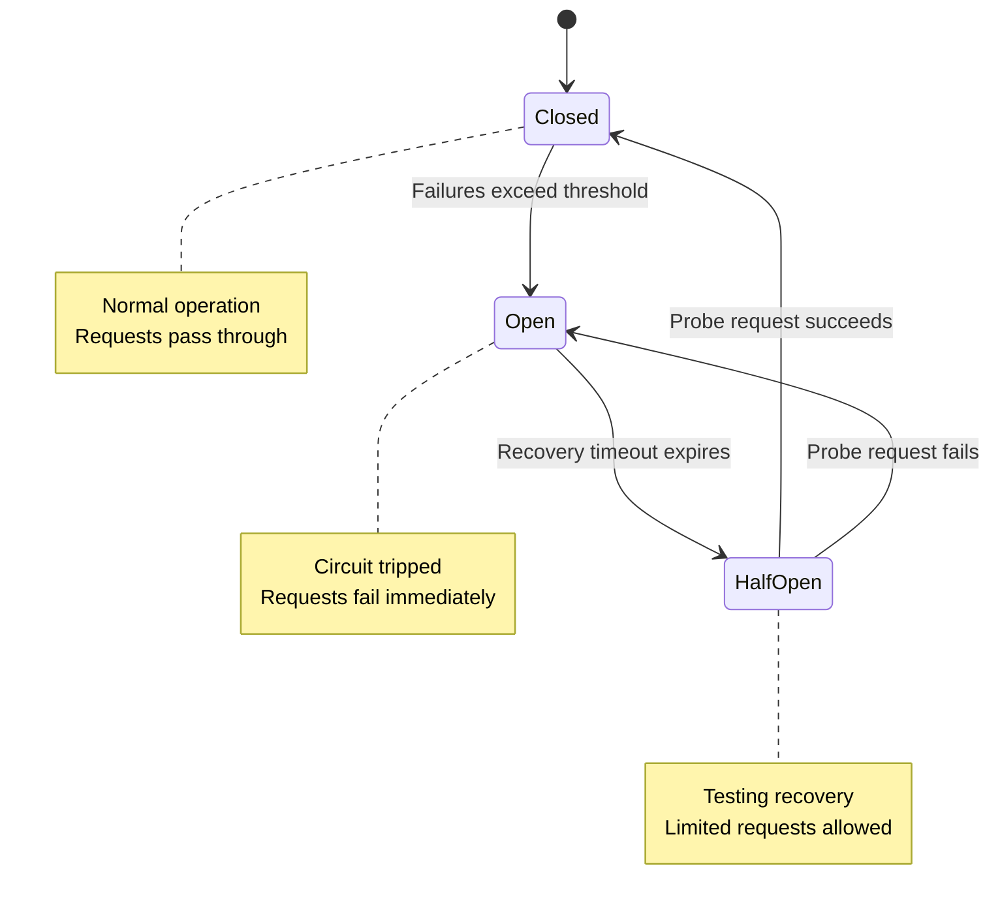
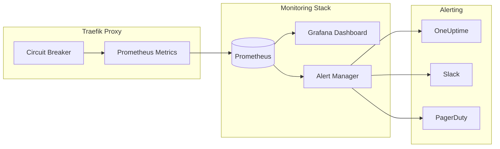

# How to Implement Traefik Circuit Breaker

By [Nawaz Dhandala](https://github.com/nawazdhandala)

Tags: Traefik, Circuit Breaker, Microservices, Resilience, Kubernetes, DevOps, Load Balancing, Middleware

Description: A comprehensive guide to implementing circuit breaker patterns in Traefik, including middleware configuration, fallback strategies, and monitoring circuit state for building resilient microservices.

---

> "The circuit breaker pattern prevents cascading failures by failing fast and giving downstream services time to recover. It's not about avoiding failure; it's about failing gracefully."

## Understanding Circuit Breakers

A circuit breaker monitors the health of downstream services and "trips" when failures exceed a threshold. Once tripped, requests fail immediately without attempting to reach the unhealthy service, preventing cascading failures and allowing the system to recover.



### Why Use Circuit Breakers in Traefik?

Traefik is a modern reverse proxy and load balancer that integrates seamlessly with container orchestrators. Its circuit breaker middleware provides:

- **Automatic failure detection** - Monitors error rates and response times
- **Fast failure** - Returns errors immediately when circuit is open
- **Automatic recovery** - Periodically tests if the service has recovered
- **Configurable thresholds** - Tune sensitivity for your use case

## Circuit Breaker Middleware Configuration

Traefik's circuit breaker middleware uses an expression-based configuration. Let's explore the options.

### Basic Configuration

The simplest circuit breaker monitors the ratio of network errors:

```yaml
# traefik-circuit-breaker.yaml
# Basic circuit breaker that trips when network error ratio exceeds 50%

apiVersion: traefik.io/v1alpha1
kind: Middleware
metadata:
  name: circuit-breaker-basic
  namespace: production
spec:
  circuitBreaker:
    # Expression that determines when the circuit trips
    # NetworkErrorRatio returns the ratio of network errors (0.0 to 1.0)
    expression: "NetworkErrorRatio() > 0.50"
```

### Advanced Expression-Based Configuration

Traefik supports complex expressions for fine-grained control:

```yaml
# traefik-circuit-breaker-advanced.yaml
# Advanced circuit breaker with multiple conditions

apiVersion: traefik.io/v1alpha1
kind: Middleware
metadata:
  name: circuit-breaker-advanced
  namespace: production
spec:
  circuitBreaker:
    # Trip circuit if ANY of these conditions are met:
    # - Network error ratio exceeds 30%
    # - Response latency at p50 exceeds 100ms
    # - Response latency at p75 exceeds 200ms
    expression: >-
      NetworkErrorRatio() > 0.30 ||
      LatencyAtQuantileMS(50.0) > 100 ||
      LatencyAtQuantileMS(75.0) > 200

    # Time to wait before attempting recovery (default: 10s)
    checkPeriod: 15s

    # Time to wait in half-open state for probe results (default: 10s)
    fallbackDuration: 30s

    # Time window for calculating metrics (default: 10s)
    recoveryDuration: 60s
```

### Available Expression Functions

Traefik provides several functions for circuit breaker expressions:

```yaml
# traefik-circuit-breaker-expressions.yaml
# Examples of different expression functions

apiVersion: traefik.io/v1alpha1
kind: Middleware
metadata:
  name: circuit-breaker-latency
  namespace: production
spec:
  circuitBreaker:
    # LatencyAtQuantileMS(percentile) - Returns latency in milliseconds
    # Percentile range: 0.0 to 100.0
    expression: "LatencyAtQuantileMS(99.0) > 500"

---
apiVersion: traefik.io/v1alpha1
kind: Middleware
metadata:
  name: circuit-breaker-errors
  namespace: production
spec:
  circuitBreaker:
    # NetworkErrorRatio() - Returns ratio of network errors (0.0 to 1.0)
    # Includes connection failures, timeouts, and network-level errors
    expression: "NetworkErrorRatio() > 0.25"

---
apiVersion: traefik.io/v1alpha1
kind: Middleware
metadata:
  name: circuit-breaker-response
  namespace: production
spec:
  circuitBreaker:
    # ResponseCodeRatio(from, to, totalFrom, totalTo)
    # Returns ratio of responses with codes in [from, to)
    # compared to responses with codes in [totalFrom, totalTo)
    # Example: 5xx errors compared to all responses
    expression: "ResponseCodeRatio(500, 600, 0, 600) > 0.25"
```

## Complete Traefik Deployment with Circuit Breaker

Here's a complete example showing how to deploy Traefik with circuit breaker protection:

```yaml
# traefik-deployment.yaml
# Complete Traefik setup with circuit breaker middleware

apiVersion: v1
kind: ConfigMap
metadata:
  name: traefik-config
  namespace: traefik
data:
  traefik.yaml: |
    # Traefik static configuration
    api:
      dashboard: true
      insecure: false

    entryPoints:
      web:
        address: ":80"
      websecure:
        address: ":443"

    providers:
      kubernetesIngress: {}
      kubernetesCRD: {}

    # Enable metrics for monitoring circuit breaker state
    metrics:
      prometheus:
        entryPoint: metrics
        addEntryPointsLabels: true
        addServicesLabels: true

    entryPoints:
      metrics:
        address: ":8082"

---
apiVersion: apps/v1
kind: Deployment
metadata:
  name: traefik
  namespace: traefik
spec:
  replicas: 2
  selector:
    matchLabels:
      app: traefik
  template:
    metadata:
      labels:
        app: traefik
    spec:
      serviceAccountName: traefik
      containers:
        - name: traefik
          image: traefik:v3.0
          ports:
            - containerPort: 80
              name: web
            - containerPort: 443
              name: websecure
            - containerPort: 8082
              name: metrics
          volumeMounts:
            - name: config
              mountPath: /etc/traefik
          resources:
            requests:
              cpu: 100m
              memory: 128Mi
            limits:
              cpu: 500m
              memory: 256Mi
      volumes:
        - name: config
          configMap:
            name: traefik-config
```

### Applying Circuit Breaker to Services

```yaml
# api-service-with-circuit-breaker.yaml
# Apply circuit breaker middleware to a backend service

apiVersion: traefik.io/v1alpha1
kind: Middleware
metadata:
  name: api-circuit-breaker
  namespace: production
spec:
  circuitBreaker:
    # Trip if error rate exceeds 25% OR p95 latency exceeds 1 second
    expression: >-
      NetworkErrorRatio() > 0.25 ||
      LatencyAtQuantileMS(95.0) > 1000
    checkPeriod: 10s
    fallbackDuration: 30s
    recoveryDuration: 60s

---
apiVersion: traefik.io/v1alpha1
kind: IngressRoute
metadata:
  name: api-ingress
  namespace: production
spec:
  entryPoints:
    - websecure
  routes:
    - match: Host(`api.example.com`) && PathPrefix(`/v1`)
      kind: Rule
      # Apply the circuit breaker middleware
      middlewares:
        - name: api-circuit-breaker
      services:
        - name: api-service
          port: 8080
          # Health check for service-level resilience
          healthCheck:
            path: /health
            interval: 10s
            timeout: 3s
  tls:
    certResolver: letsencrypt
```

## Fallback Strategies

When a circuit breaker trips, you need a strategy for handling requests. Here are several approaches:

### Strategy 1: Static Fallback Response

Return a cached or static response when the circuit is open:

```yaml
# fallback-static-response.yaml
# Return a static error response when circuit trips

apiVersion: traefik.io/v1alpha1
kind: Middleware
metadata:
  name: fallback-error-page
  namespace: production
spec:
  errors:
    status:
      - "503"
    query: "/{status}.html"
    service:
      name: error-pages
      port: 80

---
# Chain circuit breaker with fallback
apiVersion: traefik.io/v1alpha1
kind: Middleware
metadata:
  name: resilient-chain
  namespace: production
spec:
  chain:
    middlewares:
      - name: api-circuit-breaker
      - name: fallback-error-page
```

### Strategy 2: Fallback Service

Route to a fallback service when the primary is unavailable:

```yaml
# fallback-service.yaml
# Route to fallback service using weighted load balancing

apiVersion: traefik.io/v1alpha1
kind: TraefikService
metadata:
  name: api-with-fallback
  namespace: production
spec:
  weighted:
    services:
      # Primary service - normal traffic
      - name: api-service
        port: 8080
        weight: 100
        healthCheck:
          path: /health
          interval: 5s
          timeout: 2s
      # Fallback service - receives traffic when primary fails health checks
      - name: api-fallback
        port: 8080
        weight: 0  # Only receives traffic during failover

---
# Fallback service deployment - serves cached/degraded responses
apiVersion: apps/v1
kind: Deployment
metadata:
  name: api-fallback
  namespace: production
spec:
  replicas: 2
  selector:
    matchLabels:
      app: api-fallback
  template:
    metadata:
      labels:
        app: api-fallback
    spec:
      containers:
        - name: fallback
          image: nginx:alpine
          ports:
            - containerPort: 8080
          volumeMounts:
            - name: fallback-responses
              mountPath: /usr/share/nginx/html
      volumes:
        - name: fallback-responses
          configMap:
            name: api-fallback-responses

---
# Pre-configured fallback responses
apiVersion: v1
kind: ConfigMap
metadata:
  name: api-fallback-responses
  namespace: production
data:
  # Return cached product list when API is down
  products.json: |
    {
      "products": [],
      "cached": true,
      "message": "Service temporarily unavailable. Showing cached data."
    }
```

### Strategy 3: Retry with Circuit Breaker

Combine retries with circuit breaker for transient failures:

```yaml
# retry-with-circuit-breaker.yaml
# Retry transient failures before circuit breaker trips

apiVersion: traefik.io/v1alpha1
kind: Middleware
metadata:
  name: retry-middleware
  namespace: production
spec:
  retry:
    # Retry up to 3 times
    attempts: 3
    # Initial wait between retries
    initialInterval: 100ms

---
apiVersion: traefik.io/v1alpha1
kind: Middleware
metadata:
  name: resilient-middleware-chain
  namespace: production
spec:
  chain:
    middlewares:
      # First: Apply circuit breaker (fail fast if circuit is open)
      - name: api-circuit-breaker
      # Then: Retry transient failures
      - name: retry-middleware
      # Finally: Rate limiting to prevent overload during recovery
      - name: rate-limit
```

## Monitoring Circuit State

Monitoring circuit breaker state is essential for understanding system health. Here's how to set up comprehensive monitoring:



### Prometheus Metrics Configuration

```yaml
# prometheus-scrape-config.yaml
# Configure Prometheus to scrape Traefik circuit breaker metrics

apiVersion: v1
kind: ConfigMap
metadata:
  name: prometheus-config
  namespace: monitoring
data:
  prometheus.yml: |
    global:
      scrape_interval: 15s
      evaluation_interval: 15s

    scrape_configs:
      - job_name: 'traefik'
        static_configs:
          - targets: ['traefik.traefik.svc.cluster.local:8082']

        # Relabel to add service labels
        relabel_configs:
          - source_labels: [__address__]
            target_label: instance
            regex: '([^:]+):\d+'
            replacement: '${1}'
```

### Key Metrics to Monitor

Traefik exposes several metrics for circuit breaker monitoring:

```yaml
# alerting-rules.yaml
# Prometheus alerting rules for circuit breaker events

apiVersion: monitoring.coreos.com/v1
kind: PrometheusRule
metadata:
  name: traefik-circuit-breaker-alerts
  namespace: monitoring
spec:
  groups:
    - name: circuit-breaker
      rules:
        # Alert when circuit breaker opens
        - alert: CircuitBreakerOpen
          # traefik_service_open_connections helps track connection state
          # High error rate indicates circuit may have tripped
          expr: |
            sum(rate(traefik_service_requests_total{code=~"5.."}[5m])) by (service)
            /
            sum(rate(traefik_service_requests_total[5m])) by (service)
            > 0.25
          for: 1m
          labels:
            severity: warning
          annotations:
            summary: "Circuit breaker may have tripped for {{ $labels.service }}"
            description: "Error rate is {{ $value | humanizePercentage }} for service {{ $labels.service }}"

        # Alert on sustained high latency
        - alert: HighLatencyTriggeringCircuitBreaker
          expr: |
            histogram_quantile(0.95,
              sum(rate(traefik_service_request_duration_seconds_bucket[5m])) by (service, le)
            ) > 1
          for: 2m
          labels:
            severity: warning
          annotations:
            summary: "High latency may trigger circuit breaker for {{ $labels.service }}"
            description: "P95 latency is {{ $value | humanizeDuration }} for service {{ $labels.service }}"

        # Alert when service is recovering
        - alert: CircuitBreakerRecovering
          expr: |
            sum(rate(traefik_service_requests_total{code=~"5.."}[1m])) by (service)
            /
            sum(rate(traefik_service_requests_total[1m])) by (service)
            < 0.10
            and
            sum(rate(traefik_service_requests_total{code=~"5.."}[10m])) by (service)
            /
            sum(rate(traefik_service_requests_total[10m])) by (service)
            > 0.20
          for: 1m
          labels:
            severity: info
          annotations:
            summary: "Circuit breaker recovering for {{ $labels.service }}"
            description: "Error rate dropping, service {{ $labels.service }} may be recovering"
```

### Grafana Dashboard

```json
{
  "dashboard": {
    "title": "Traefik Circuit Breaker Dashboard",
    "panels": [
      {
        "title": "Service Error Rate",
        "type": "timeseries",
        "targets": [
          {
            "expr": "sum(rate(traefik_service_requests_total{code=~\"5..\"}[5m])) by (service) / sum(rate(traefik_service_requests_total[5m])) by (service)",
            "legendFormat": "{{ service }}"
          }
        ],
        "fieldConfig": {
          "defaults": {
            "unit": "percentunit",
            "thresholds": {
              "steps": [
                { "value": 0, "color": "green" },
                { "value": 0.25, "color": "yellow" },
                { "value": 0.50, "color": "red" }
              ]
            }
          }
        }
      },
      {
        "title": "P95 Latency by Service",
        "type": "timeseries",
        "targets": [
          {
            "expr": "histogram_quantile(0.95, sum(rate(traefik_service_request_duration_seconds_bucket[5m])) by (service, le))",
            "legendFormat": "{{ service }}"
          }
        ],
        "fieldConfig": {
          "defaults": {
            "unit": "s"
          }
        }
      },
      {
        "title": "Request Volume",
        "type": "stat",
        "targets": [
          {
            "expr": "sum(rate(traefik_service_requests_total[5m])) by (service)",
            "legendFormat": "{{ service }}"
          }
        ],
        "fieldConfig": {
          "defaults": {
            "unit": "reqps"
          }
        }
      }
    ]
  }
}
```

## Testing Circuit Breakers

Validate your circuit breaker configuration before production:

```bash
#!/bin/bash
# test-circuit-breaker.sh
# Script to test circuit breaker behavior

SERVICE_URL="https://api.example.com/v1/health"
CIRCUIT_BREAKER_THRESHOLD=0.25

echo "=== Testing Circuit Breaker Configuration ==="

# Test 1: Verify normal operation
echo -e "\n[Test 1] Normal operation - requests should succeed"
for i in {1..10}; do
    status=$(curl -s -o /dev/null -w "%{http_code}" $SERVICE_URL)
    echo "Request $i: HTTP $status"
done

# Test 2: Simulate failures to trip circuit
echo -e "\n[Test 2] Simulating failures..."
# Use a chaos engineering tool or test endpoint that returns errors
FAILURE_URL="https://api.example.com/v1/chaos/fail"

for i in {1..20}; do
    curl -s -o /dev/null $FAILURE_URL &
done
wait

# Test 3: Verify circuit is open
echo -e "\n[Test 3] Verifying circuit breaker tripped"
for i in {1..5}; do
    start=$(date +%s%N)
    status=$(curl -s -o /dev/null -w "%{http_code}" $SERVICE_URL)
    end=$(date +%s%N)
    latency=$(( ($end - $start) / 1000000 ))
    echo "Request $i: HTTP $status (${latency}ms)"
    # Circuit breaker should fail fast (< 50ms)
    if [ $latency -lt 50 ] && [ $status -eq 503 ]; then
        echo "  -> Circuit appears to be OPEN (fast failure)"
    fi
done

# Test 4: Wait for recovery
echo -e "\n[Test 4] Waiting for circuit recovery (30s)..."
sleep 30

# Test 5: Verify recovery
echo -e "\n[Test 5] Verifying circuit recovery"
for i in {1..5}; do
    status=$(curl -s -o /dev/null -w "%{http_code}" $SERVICE_URL)
    echo "Request $i: HTTP $status"
done
```

### Load Testing with k6

```javascript
// circuit-breaker-load-test.js
// k6 load test to validate circuit breaker behavior

import http from 'k6/http';
import { check, sleep } from 'k6';
import { Rate, Trend } from 'k6/metrics';

// Custom metrics for circuit breaker monitoring
const circuitBreakerTrips = new Rate('circuit_breaker_trips');
const responseTime = new Trend('response_time');

export const options = {
    stages: [
        // Ramp up to normal load
        { duration: '1m', target: 50 },
        // Sustained load - should not trip circuit
        { duration: '2m', target: 50 },
        // Spike load - may trip circuit
        { duration: '30s', target: 200 },
        // Recovery period
        { duration: '2m', target: 50 },
        // Ramp down
        { duration: '30s', target: 0 },
    ],
    thresholds: {
        // Circuit should not trip more than 5% of the time during normal load
        'circuit_breaker_trips': ['rate<0.05'],
        // P95 response time should stay under 500ms
        'response_time': ['p(95)<500'],
    },
};

export default function () {
    const startTime = Date.now();
    const response = http.get('https://api.example.com/v1/products');
    const duration = Date.now() - startTime;

    responseTime.add(duration);

    // Check if circuit breaker tripped (fast 503 response)
    const circuitTripped = response.status === 503 && duration < 100;
    circuitBreakerTrips.add(circuitTripped);

    check(response, {
        'status is 200 or circuit breaker active': (r) =>
            r.status === 200 || (r.status === 503 && duration < 100),
        'response time OK': (r) => duration < 1000,
    });

    sleep(0.1);
}
```

## Production Best Practices

### 1. Tune Thresholds for Your SLOs

```yaml
# production-circuit-breaker.yaml
# Circuit breaker tuned for a service with 99.9% availability SLO

apiVersion: traefik.io/v1alpha1
kind: Middleware
metadata:
  name: production-circuit-breaker
  namespace: production
  annotations:
    # Document the reasoning behind threshold choices
    description: |
      Tuned for services with 99.9% SLO.
      - Error threshold: 10% (aggressive, matches SLO)
      - Latency threshold: P99 < 500ms
      - Recovery time: 60s (allows time for pods to scale)
spec:
  circuitBreaker:
    expression: >-
      NetworkErrorRatio() > 0.10 ||
      ResponseCodeRatio(500, 600, 0, 600) > 0.10 ||
      LatencyAtQuantileMS(99.0) > 500
    checkPeriod: 10s
    fallbackDuration: 30s
    recoveryDuration: 60s
```

### 2. Per-Service Configuration

```yaml
# per-service-circuit-breakers.yaml
# Different thresholds for different service criticality

# Critical path - payment service (very sensitive)
apiVersion: traefik.io/v1alpha1
kind: Middleware
metadata:
  name: payment-circuit-breaker
  namespace: production
spec:
  circuitBreaker:
    expression: >-
      NetworkErrorRatio() > 0.05 ||
      LatencyAtQuantileMS(95.0) > 200
    checkPeriod: 5s
    recoveryDuration: 30s

---
# Non-critical - recommendations service (more tolerant)
apiVersion: traefik.io/v1alpha1
kind: Middleware
metadata:
  name: recommendations-circuit-breaker
  namespace: production
spec:
  circuitBreaker:
    expression: >-
      NetworkErrorRatio() > 0.30 ||
      LatencyAtQuantileMS(95.0) > 2000
    checkPeriod: 15s
    recoveryDuration: 120s
```

### 3. Combine with Other Resilience Patterns

```yaml
# full-resilience-stack.yaml
# Complete resilience configuration with multiple patterns

apiVersion: traefik.io/v1alpha1
kind: Middleware
metadata:
  name: full-resilience-stack
  namespace: production
spec:
  chain:
    middlewares:
      # 1. Rate limiting - prevent overload
      - name: rate-limiter
      # 2. Circuit breaker - fail fast when downstream is unhealthy
      - name: circuit-breaker
      # 3. Retry - handle transient failures
      - name: retry
      # 4. Timeout - bound response time
      - name: timeout

---
apiVersion: traefik.io/v1alpha1
kind: Middleware
metadata:
  name: rate-limiter
  namespace: production
spec:
  rateLimit:
    average: 100
    burst: 200
    period: 1s

---
apiVersion: traefik.io/v1alpha1
kind: Middleware
metadata:
  name: timeout
  namespace: production
spec:
  # Requests timeout after 30 seconds
  forwardAuth:
    responseHeadersTimeout: 30s
```

## Integration with OneUptime

For comprehensive monitoring of your circuit breaker state and overall system health, integrate with [OneUptime](https://oneuptime.com). OneUptime provides:

- **Real-time alerting** when circuit breakers trip
- **Historical analysis** of circuit breaker events
- **Incident management** for coordinating response to outages
- **Status pages** to communicate service health to users
- **Distributed tracing** to understand failure propagation

Configure OneUptime to receive alerts from your Prometheus AlertManager or integrate directly with Traefik metrics for end-to-end observability of your circuit breaker protected services.

---

Circuit breakers are a fundamental pattern for building resilient microservices. Traefik's built-in middleware makes implementation straightforward, but success requires careful tuning, comprehensive monitoring, and well-designed fallback strategies. Start with conservative thresholds, monitor closely, and adjust based on real-world behavior.
