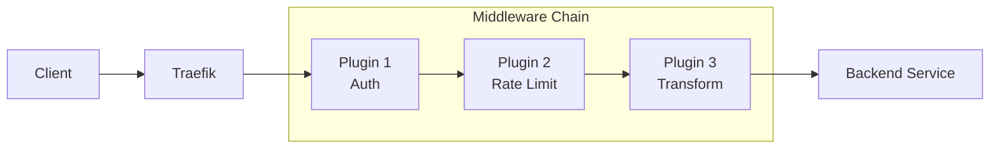
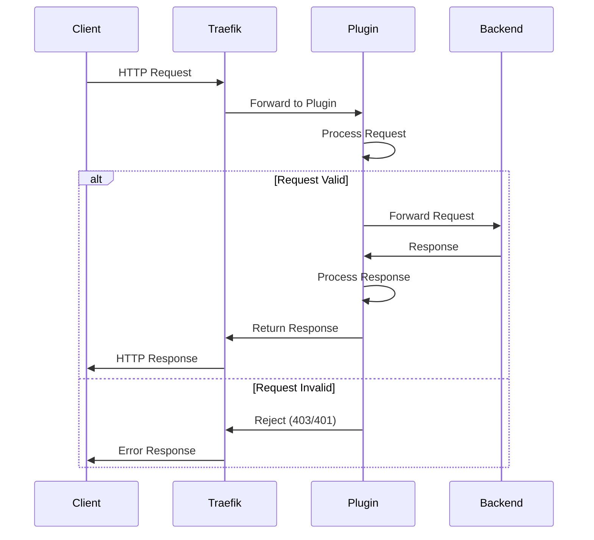
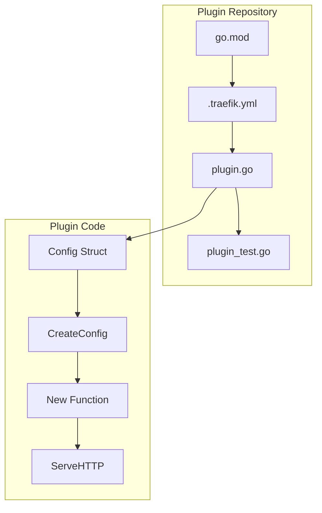
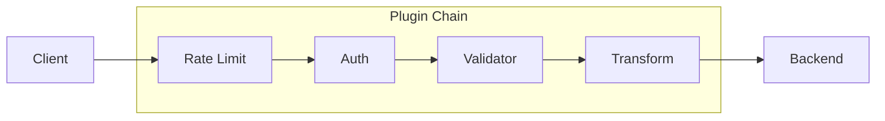

# How to Use Traefik Plugins

Author: [nawazdhandala](https://www.github.com/nawazdhandala)

Tags: Traefik, Plugins, Reverse Proxy, Middleware, Go, Kubernetes, Docker, DevOps

Description: A comprehensive guide to using Traefik plugins for extending your reverse proxy with custom middleware, authentication, rate limiting, and more.

---

> "The best tools are the ones you can extend to fit your needs."

Traefik is a powerful cloud-native reverse proxy and load balancer. While it comes with many built-in features, plugins let you extend its functionality without modifying the core codebase. Whether you need custom authentication, request transformation, or specialized logging, Traefik plugins have you covered.

## Understanding Traefik Plugins

Traefik plugins are middleware components written in Go that run as WebAssembly (Wasm) modules. They intercept HTTP requests and responses, allowing you to modify, validate, or transform traffic.



### How Plugins Work

Plugins operate as middleware in the request pipeline:

1. Request arrives at Traefik
2. Traefik routes request through configured plugins
3. Each plugin can inspect, modify, or reject the request
4. Request reaches the backend service
5. Response flows back through the plugin chain



## The Traefik Plugin Catalog

The official Traefik Plugin Catalog at [plugins.traefik.io](https://plugins.traefik.io) hosts community-contributed plugins. Here are some popular categories:

### Authentication Plugins
- **traefik-plugin-oidc** - OpenID Connect authentication
- **htpasswd** - Basic authentication with htpasswd files
- **jwt** - JWT token validation

### Security Plugins
- **fail2ban** - Ban IPs after failed requests
- **geoblock** - Block requests by geographic location
- **crowdsec-bouncer** - CrowdSec integration for threat detection

### Request Modification Plugins
- **rewrite-body** - Modify response body content
- **plugin-rewriteheaders** - Rewrite request/response headers
- **traefik-plugin-query-modification** - Modify query parameters

### Observability Plugins
- **traefik-plugin-log-request** - Enhanced request logging
- **tracing-headers** - Add tracing headers to requests

## Installing Plugins from the Catalog

### Static Configuration

Enable the plugin in your Traefik static configuration:

```yaml
# traefik.yml - Static configuration file
# Defines which plugins Traefik should load at startup

experimental:
  plugins:
    # Plugin name (used to reference in dynamic config)
    demo:
      # Module path from the plugin catalog
      moduleName: "github.com/traefik/plugindemo"
      # Specific version to use
      version: "v0.2.1"

    # Add multiple plugins as needed
    blockpath:
      moduleName: "github.com/traefik/plugin-blockpath"
      version: "v0.2.1"
```

### Docker Compose Example

```yaml
# docker-compose.yml
# Complete Traefik setup with plugin enabled

version: "3.8"

services:
  traefik:
    image: traefik:v3.0
    command:
      # Enable API dashboard for debugging
      - "--api.insecure=true"
      # Configure Docker provider
      - "--providers.docker=true"
      - "--providers.docker.exposedbydefault=false"
      # Define entrypoints
      - "--entrypoints.web.address=:80"
      # Load the demo plugin from catalog
      - "--experimental.plugins.demo.modulename=github.com/traefik/plugindemo"
      - "--experimental.plugins.demo.version=v0.2.1"
    ports:
      - "80:80"
      - "8080:8080"  # Dashboard
    volumes:
      # Docker socket for service discovery
      - "/var/run/docker.sock:/var/run/docker.sock:ro"
    networks:
      - traefik

  # Example backend service using the plugin
  whoami:
    image: traefik/whoami
    labels:
      - "traefik.enable=true"
      # Define the router
      - "traefik.http.routers.whoami.rule=Host(`whoami.localhost`)"
      - "traefik.http.routers.whoami.entrypoints=web"
      # Apply the plugin middleware
      - "traefik.http.routers.whoami.middlewares=my-demo@docker"
      # Configure the plugin middleware
      - "traefik.http.middlewares.my-demo.plugin.demo.headers.X-Demo=true"
    networks:
      - traefik

networks:
  traefik:
    driver: bridge
```

### Kubernetes Installation

```yaml
# traefik-helm-values.yaml
# Helm values for Traefik with plugins enabled

# Enable experimental features for plugins
experimental:
  plugins:
    enabled: true

# Define plugins to load
additionalArguments:
  # Load the JWT plugin
  - "--experimental.plugins.jwt.modulename=github.com/traefik/plugin-jwt"
  - "--experimental.plugins.jwt.version=v0.7.1"
  # Load the geoblock plugin
  - "--experimental.plugins.geoblock.modulename=github.com/PascalMinder/geoblock"
  - "--experimental.plugins.geoblock.version=v0.2.5"
```

Apply the middleware using Kubernetes CRDs:

```yaml
# middleware.yaml
# Kubernetes Middleware resource using the JWT plugin

apiVersion: traefik.io/v1alpha1
kind: Middleware
metadata:
  name: jwt-auth
  namespace: default
spec:
  plugin:
    # Reference the plugin name from static config
    jwt:
      # Plugin-specific configuration
      secret: "your-jwt-secret-key"
      # Which header contains the token
      authHeader: "Authorization"
      # Header prefix to strip
      headerPrefix: "Bearer"
      # Claims to forward as headers
      forwardHeaders:
        X-User-ID: "sub"
        X-User-Email: "email"
---
# Apply middleware to an IngressRoute
apiVersion: traefik.io/v1alpha1
kind: IngressRoute
metadata:
  name: secure-api
  namespace: default
spec:
  entryPoints:
    - websecure
  routes:
    - match: Host(`api.example.com`)
      kind: Rule
      middlewares:
        - name: jwt-auth
      services:
        - name: api-service
          port: 80
```

## Plugin Configuration Deep Dive

### Rate Limiting Plugin

```yaml
# Dynamic configuration for rate limiting
# File: dynamic/rate-limit.yml

http:
  middlewares:
    # Rate limiter middleware configuration
    rate-limit:
      plugin:
        # Using the ratelimit plugin
        ratelimit:
          # Average requests per second allowed
          average: 100
          # Maximum burst size
          burst: 50
          # Time period for rate calculation
          period: "1s"
          # Source of client identifier
          sourceCriterion:
            # Use client IP as identifier
            ipStrategy:
              depth: 0
              excludedIPs: []
          # Custom response when rate limited
          rateLimitedResponse:
            statusCode: 429
            body: '{"error": "Too many requests"}'
            headers:
              Content-Type: application/json
              Retry-After: "60"
```

### GeoBlocking Plugin

```yaml
# Geographic blocking configuration
# Block or allow requests based on country

http:
  middlewares:
    geoblock:
      plugin:
        geoblock:
          # Allow only these countries
          allowedCountries:
            - US
            - CA
            - GB
            - DE
          # OR block specific countries (use one or the other)
          # blockedCountries:
          #   - CN
          #   - RU

          # GeoIP database path
          databasePath: "/etc/traefik/GeoLite2-Country.mmdb"

          # Allow private/internal IPs
          allowPrivate: true

          # Log blocked requests
          logBlocked: true

          # Custom blocked message
          blockedMessage: "Access denied from your location"
```

### Header Transformation Plugin

```yaml
# Header manipulation configuration
# Add, remove, or modify headers

http:
  middlewares:
    headers-transform:
      plugin:
        rewriteHeaders:
          # Add new headers to requests
          requestHeaders:
            add:
              X-Request-ID: "{{uuid}}"
              X-Forwarded-Service: "my-service"
            # Remove sensitive headers
            remove:
              - X-Powered-By
              - Server
            # Rename headers
            rename:
              X-Old-Header: X-New-Header

          # Modify response headers
          responseHeaders:
            add:
              X-Frame-Options: "DENY"
              X-Content-Type-Options: "nosniff"
              Strict-Transport-Security: "max-age=31536000; includeSubDomains"
            remove:
              - X-Powered-By
```

## Custom Plugin Development

When existing plugins do not meet your needs, you can create your own.

### Plugin Structure



### Basic Plugin Template

Create the following files in a new GitHub repository:

```go
// plugin.go
// Main plugin implementation

package traefik_custom_plugin

import (
	"context"
	"fmt"
	"net/http"
)

// Config holds the plugin configuration
// These fields are populated from Traefik's dynamic configuration
type Config struct {
	// Headers to add to each request
	Headers map[string]string `json:"headers,omitempty"`
	// Enable debug logging
	Debug bool `json:"debug,omitempty"`
	// Custom prefix for added headers
	Prefix string `json:"prefix,omitempty"`
}

// CreateConfig creates the default plugin configuration
// Called by Traefik during plugin initialization
func CreateConfig() *Config {
	return &Config{
		Headers: make(map[string]string),
		Debug:   false,
		Prefix:  "X-Custom-",
	}
}

// CustomPlugin is the main plugin struct
type CustomPlugin struct {
	// Reference to the next handler in the chain
	next    http.Handler
	// Plugin configuration
	config  *Config
	// Plugin name for logging
	name    string
}

// New creates a new plugin instance
// Called by Traefik when the middleware is instantiated
func New(ctx context.Context, next http.Handler, config *Config, name string) (http.Handler, error) {
	// Validate configuration
	if len(config.Headers) == 0 && !config.Debug {
		return nil, fmt.Errorf("no headers configured and debug is disabled")
	}

	return &CustomPlugin{
		next:   next,
		config: config,
		name:   name,
	}, nil
}

// ServeHTTP implements the http.Handler interface
// This is where the plugin logic lives
func (p *CustomPlugin) ServeHTTP(rw http.ResponseWriter, req *http.Request) {
	// Log request if debug is enabled
	if p.config.Debug {
		fmt.Printf("[%s] Processing request: %s %s\n", p.name, req.Method, req.URL.Path)
	}

	// Add configured headers to the request
	for key, value := range p.config.Headers {
		headerName := p.config.Prefix + key
		req.Header.Set(headerName, value)

		if p.config.Debug {
			fmt.Printf("[%s] Added header: %s=%s\n", p.name, headerName, value)
		}
	}

	// Call the next handler in the chain
	p.next.ServeHTTP(rw, req)
}
```

### Plugin Manifest

```yaml
# .traefik.yml
# Plugin manifest - required for Traefik plugin catalog

# Human-readable display name
displayName: Custom Header Plugin

# Plugin type (always middleware for HTTP plugins)
type: middleware

# Import path (must match your repository)
import: github.com/yourusername/traefik-custom-plugin

# Brief description
summary: Adds custom headers to incoming requests

# Path to documentation
testData:
  headers:
    X-Test: "value"
  debug: true
  prefix: "X-Custom-"
```

### Go Module File

```go
// go.mod
// Module definition for the plugin

module github.com/yourusername/traefik-custom-plugin

go 1.21
```

### Writing Tests

```go
// plugin_test.go
// Unit tests for the plugin

package traefik_custom_plugin

import (
	"context"
	"net/http"
	"net/http/httptest"
	"testing"
)

// TestCustomPlugin verifies header injection
func TestCustomPlugin(t *testing.T) {
	// Create plugin configuration
	cfg := CreateConfig()
	cfg.Headers = map[string]string{
		"Service": "test-service",
		"Version": "1.0.0",
	}
	cfg.Prefix = "X-Custom-"

	// Create a mock next handler
	nextHandler := http.HandlerFunc(func(rw http.ResponseWriter, req *http.Request) {
		// Verify headers were added
		if req.Header.Get("X-Custom-Service") != "test-service" {
			t.Error("X-Custom-Service header not set correctly")
		}
		if req.Header.Get("X-Custom-Version") != "1.0.0" {
			t.Error("X-Custom-Version header not set correctly")
		}
		rw.WriteHeader(http.StatusOK)
	})

	// Create the plugin instance
	handler, err := New(context.Background(), nextHandler, cfg, "test-plugin")
	if err != nil {
		t.Fatalf("Failed to create plugin: %v", err)
	}

	// Create test request
	req := httptest.NewRequest(http.MethodGet, "http://localhost/test", nil)
	rw := httptest.NewRecorder()

	// Execute the handler
	handler.ServeHTTP(rw, req)

	// Verify response
	if rw.Code != http.StatusOK {
		t.Errorf("Expected status 200, got %d", rw.Code)
	}
}

// TestCreateConfig verifies default configuration
func TestCreateConfig(t *testing.T) {
	cfg := CreateConfig()

	if cfg.Headers == nil {
		t.Error("Headers map should be initialized")
	}
	if cfg.Debug != false {
		t.Error("Debug should default to false")
	}
	if cfg.Prefix != "X-Custom-" {
		t.Errorf("Expected prefix 'X-Custom-', got '%s'", cfg.Prefix)
	}
}
```

### Advanced Plugin: Request Validator

```go
// validator_plugin.go
// A more advanced plugin that validates incoming requests

package traefik_request_validator

import (
	"context"
	"encoding/json"
	"fmt"
	"net/http"
	"regexp"
	"strings"
)

// ValidationRule defines a single validation rule
type ValidationRule struct {
	// Field to validate (header, query, path)
	Field string `json:"field"`
	// Type of field (header, query, path)
	Type string `json:"type"`
	// Regex pattern to match
	Pattern string `json:"pattern"`
	// Whether the field is required
	Required bool `json:"required"`
	// Custom error message
	ErrorMessage string `json:"errorMessage"`
}

// Config holds the validator configuration
type Config struct {
	// List of validation rules to apply
	Rules []ValidationRule `json:"rules"`
	// Return detailed errors (disable in production)
	DetailedErrors bool `json:"detailedErrors"`
	// Custom error response format
	ErrorFormat string `json:"errorFormat"` // json or text
}

// CreateConfig creates default configuration
func CreateConfig() *Config {
	return &Config{
		Rules:          []ValidationRule{},
		DetailedErrors: false,
		ErrorFormat:    "json",
	}
}

// RequestValidator is the plugin struct
type RequestValidator struct {
	next     http.Handler
	config   *Config
	name     string
	patterns map[string]*regexp.Regexp
}

// New creates a new validator instance
func New(ctx context.Context, next http.Handler, config *Config, name string) (http.Handler, error) {
	// Pre-compile regex patterns for performance
	patterns := make(map[string]*regexp.Regexp)

	for i, rule := range config.Rules {
		if rule.Pattern != "" {
			compiled, err := regexp.Compile(rule.Pattern)
			if err != nil {
				return nil, fmt.Errorf("invalid pattern in rule %d: %v", i, err)
			}
			patterns[rule.Field] = compiled
		}
	}

	return &RequestValidator{
		next:     next,
		config:   config,
		name:     name,
		patterns: patterns,
	}, nil
}

// ServeHTTP validates the request before forwarding
func (v *RequestValidator) ServeHTTP(rw http.ResponseWriter, req *http.Request) {
	// Validate each rule
	var errors []string

	for _, rule := range v.config.Rules {
		value := v.extractValue(req, rule)

		// Check required fields
		if rule.Required && value == "" {
			msg := rule.ErrorMessage
			if msg == "" {
				msg = fmt.Sprintf("Missing required %s: %s", rule.Type, rule.Field)
			}
			errors = append(errors, msg)
			continue
		}

		// Validate pattern if value exists
		if value != "" && rule.Pattern != "" {
			pattern := v.patterns[rule.Field]
			if pattern != nil && !pattern.MatchString(value) {
				msg := rule.ErrorMessage
				if msg == "" {
					msg = fmt.Sprintf("Invalid %s: %s", rule.Type, rule.Field)
				}
				errors = append(errors, msg)
			}
		}
	}

	// Return errors if validation failed
	if len(errors) > 0 {
		v.writeError(rw, errors)
		return
	}

	// Forward valid request
	v.next.ServeHTTP(rw, req)
}

// extractValue gets the value to validate from the request
func (v *RequestValidator) extractValue(req *http.Request, rule ValidationRule) string {
	switch rule.Type {
	case "header":
		return req.Header.Get(rule.Field)
	case "query":
		return req.URL.Query().Get(rule.Field)
	case "path":
		// For path validation, return the full path
		return req.URL.Path
	default:
		return ""
	}
}

// writeError sends the error response
func (v *RequestValidator) writeError(rw http.ResponseWriter, errors []string) {
	rw.Header().Set("Content-Type", "application/json")
	rw.WriteHeader(http.StatusBadRequest)

	response := map[string]interface{}{
		"error": "Validation failed",
	}

	if v.config.DetailedErrors {
		response["details"] = errors
	}

	json.NewEncoder(rw).Encode(response)
}
```

### Using Your Custom Plugin

```yaml
# traefik.yml
# Load your custom plugin from GitHub

experimental:
  plugins:
    validator:
      moduleName: "github.com/yourusername/traefik-request-validator"
      version: "v1.0.0"
```

```yaml
# dynamic/validator.yml
# Configure the validator middleware

http:
  middlewares:
    api-validator:
      plugin:
        validator:
          detailedErrors: false
          errorFormat: json
          rules:
            # Require API key header
            - field: "X-API-Key"
              type: header
              required: true
              pattern: "^[a-zA-Z0-9]{32}$"
              errorMessage: "Valid API key required"

            # Validate Content-Type for POST requests
            - field: "Content-Type"
              type: header
              pattern: "^application/json"
              errorMessage: "Content-Type must be application/json"

            # Validate query parameter format
            - field: "page"
              type: query
              pattern: "^[0-9]+$"
              errorMessage: "Page must be a number"

  routers:
    api:
      rule: "Host(`api.example.com`)"
      middlewares:
        - api-validator
      service: api-service
```

## Plugin Development Best Practices

### Performance Considerations

```go
// Good: Pre-compile patterns in New()
func New(ctx context.Context, next http.Handler, config *Config, name string) (http.Handler, error) {
	// Compile once, use many times
	pattern, err := regexp.Compile(config.Pattern)
	if err != nil {
		return nil, err
	}
	return &Plugin{pattern: pattern, ...}, nil
}

// Bad: Compile pattern on every request
func (p *Plugin) ServeHTTP(rw http.ResponseWriter, req *http.Request) {
	// This is inefficient - compiles on every request!
	pattern := regexp.MustCompile(p.config.Pattern)
	pattern.MatchString(req.URL.Path)
}
```

### Error Handling

```go
// Always validate configuration in New()
func New(ctx context.Context, next http.Handler, config *Config, name string) (http.Handler, error) {
	// Validate required fields
	if config.APIEndpoint == "" {
		return nil, fmt.Errorf("apiEndpoint is required")
	}

	// Validate URLs
	if _, err := url.Parse(config.APIEndpoint); err != nil {
		return nil, fmt.Errorf("invalid apiEndpoint URL: %v", err)
	}

	// Validate numeric ranges
	if config.Timeout < 0 || config.Timeout > 300 {
		return nil, fmt.Errorf("timeout must be between 0 and 300 seconds")
	}

	return &Plugin{...}, nil
}
```

### Logging Best Practices

```go
// Use structured logging with context
func (p *Plugin) ServeHTTP(rw http.ResponseWriter, req *http.Request) {
	// Include request context in logs
	if p.config.Debug {
		fmt.Printf(
			"[%s] method=%s path=%s remote=%s\n",
			p.name,
			req.Method,
			req.URL.Path,
			req.RemoteAddr,
		)
	}

	// Time the request for performance monitoring
	start := time.Now()
	p.next.ServeHTTP(rw, req)
	duration := time.Since(start)

	if p.config.Debug {
		fmt.Printf("[%s] duration=%v\n", p.name, duration)
	}
}
```

## Chaining Multiple Plugins



```yaml
# docker-compose.yml with multiple plugins
version: "3.8"

services:
  traefik:
    image: traefik:v3.0
    command:
      - "--providers.docker=true"
      - "--providers.file.directory=/etc/traefik/dynamic"
      # Load multiple plugins
      - "--experimental.plugins.ratelimit.modulename=github.com/traefik/plugin-ratelimit"
      - "--experimental.plugins.ratelimit.version=v0.1.0"
      - "--experimental.plugins.jwt.modulename=github.com/traefik/plugin-jwt"
      - "--experimental.plugins.jwt.version=v0.7.1"
      - "--experimental.plugins.transform.modulename=github.com/traefik/plugin-rewriteheaders"
      - "--experimental.plugins.transform.version=v0.1.0"
    volumes:
      - "./dynamic:/etc/traefik/dynamic"
      - "/var/run/docker.sock:/var/run/docker.sock:ro"

  api:
    image: your-api:latest
    labels:
      - "traefik.enable=true"
      - "traefik.http.routers.api.rule=Host(`api.example.com`)"
      # Chain middlewares in order
      - "traefik.http.routers.api.middlewares=rate-limit@file,jwt-auth@file,headers@file"
```

```yaml
# dynamic/middlewares.yml
# Define all middlewares in one file

http:
  middlewares:
    # First: Rate limiting
    rate-limit:
      plugin:
        ratelimit:
          average: 100
          burst: 50

    # Second: JWT Authentication
    jwt-auth:
      plugin:
        jwt:
          secret: "${JWT_SECRET}"
          authHeader: "Authorization"

    # Third: Header transformation
    headers:
      plugin:
        transform:
          requestHeaders:
            add:
              X-Request-Time: "{{now}}"
```

## Monitoring Plugins with OneUptime

To ensure your Traefik plugins are performing correctly, integrate with [OneUptime](https://oneuptime.com) for comprehensive monitoring:

### Monitor Plugin Health

Set up HTTP monitors to verify your plugin-protected endpoints are responding correctly:

1. Create monitors for endpoints behind each plugin
2. Include required headers (API keys, tokens) in monitor configuration
3. Set appropriate timeout thresholds based on plugin processing time
4. Configure alerts for unexpected status codes (403, 429, 500)

### Track Plugin Performance

Monitor latency to identify slow plugins:

1. Compare response times with and without plugins
2. Set up latency alerts when plugins add excessive overhead
3. Use OneUptime's metrics to track response time distributions

### Monitor Rate Limit Status

Track rate limiting effectiveness:

1. Monitor 429 response rates
2. Alert on unusual spikes in rate-limited requests (potential attacks)
3. Track legitimate users hitting rate limits (may need adjustment)

```yaml
# Example: Expose plugin metrics endpoint
http:
  middlewares:
    metrics:
      plugin:
        metrics-plugin:
          path: "/metrics"
          enableLatency: true
          enableErrors: true

  routers:
    metrics:
      rule: "Host(`traefik.example.com`) && Path(`/metrics`)"
      middlewares:
        - internal-only
      service: prometheus@internal
```

## Troubleshooting Common Issues

### Plugin Not Loading

```bash
# Check Traefik logs for plugin errors
docker logs traefik 2>&1 | grep -i plugin

# Verify plugin version exists
curl -s https://plugins.traefik.io/plugins/PLUGIN_NAME | jq '.versions'
```

### Configuration Errors

```yaml
# Enable debug logging
log:
  level: DEBUG

# Check API for middleware status
api:
  dashboard: true
  insecure: true  # Only for debugging!
```

### Plugin Timeout

```yaml
# Increase plugin timeout for slow operations
experimental:
  plugins:
    slow-plugin:
      moduleName: "github.com/example/slow-plugin"
      version: "v1.0.0"
      # Note: Plugin timeouts are handled within the plugin itself
```

---

Traefik plugins provide a powerful way to extend your reverse proxy without modifying core code. Whether you are using plugins from the catalog or building custom middleware, the plugin system offers flexibility while maintaining performance. Start with simple plugins, test thoroughly, and monitor your plugin chain with [OneUptime](https://oneuptime.com) to ensure reliable operation in production.
