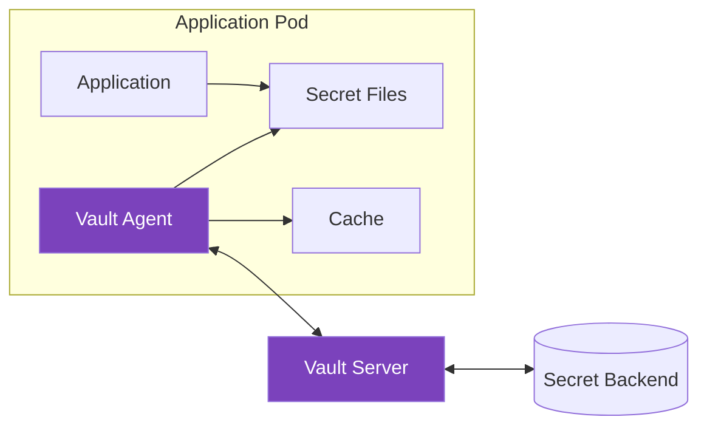
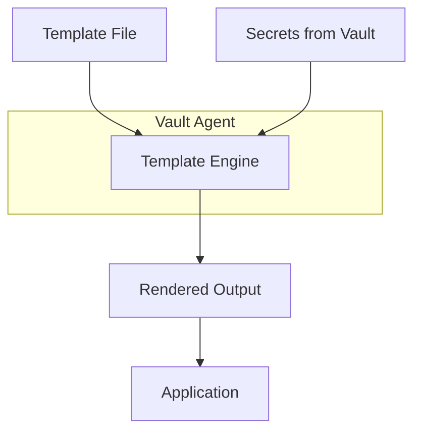
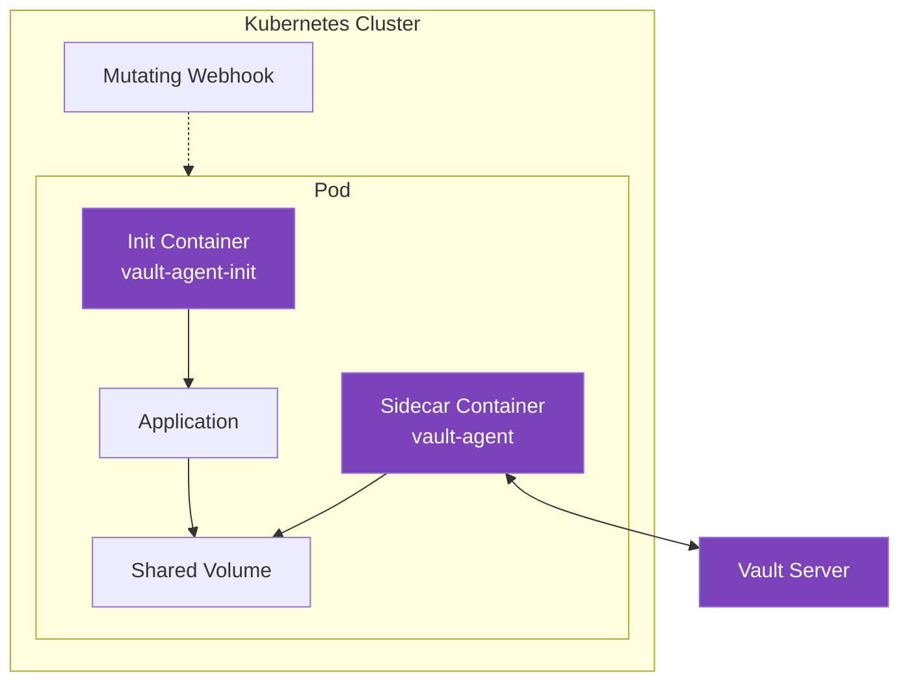
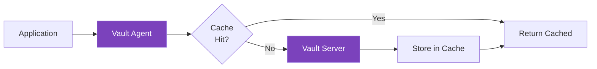

# How to Use Vault Agent for Secret Injection

Author: [nawazdhandala](https://www.github.com/nawazdhandala)

Tags: HashiCorp Vault, Secrets Management, Kubernetes, Security, DevOps, Secret Injection, Sidecar, Auto-Auth

Description: A comprehensive guide to using HashiCorp Vault Agent for automatic secret injection, covering auto-auth methods, template rendering, Kubernetes sidecar injection, secret caching, and production best practices.

---

> "The best secret is the one your application never has to fetch itself. Vault Agent handles the complexity of authentication, token renewal, and secret delivery so your application can focus on what it does best."

Managing secrets in distributed systems is hard. Applications need credentials, API keys, and certificates, but embedding them in config files or environment variables creates security risks. Vault Agent solves this by acting as a client-side daemon that authenticates with Vault, fetches secrets, and renders them into files your application can consume.

## Understanding Vault Agent Architecture

Vault Agent runs as a sidecar or daemon alongside your application. It handles all Vault interactions, eliminating the need for applications to implement Vault client logic.



### Key Components

Vault Agent consists of several cooperating subsystems:

- **Auto-Auth**: Automatically authenticates to Vault using configured methods
- **Template Engine**: Renders secrets into files using Go templates
- **Cache**: Caches tokens and secrets to reduce Vault load
- **Sink**: Writes authentication tokens to files for application use

## Basic Vault Agent Configuration

Here is a minimal Vault Agent configuration file that demonstrates the core concepts.

```hcl
# vault-agent-config.hcl
# This configuration sets up Vault Agent with Kubernetes auto-auth
# and renders database credentials to a file

# Specify the Vault server address
vault {
  address = "https://vault.example.com:8200"

  # Optional: Skip TLS verification (never do this in production!)
  # tls_skip_verify = true
}

# Auto-auth configuration for Kubernetes
auto_auth {
  method "kubernetes" {
    mount_path = "auth/kubernetes"
    config = {
      role = "myapp-role"
    }
  }

  # Write the Vault token to a file for applications that need it
  sink "file" {
    config = {
      path = "/vault/token"
      mode = 0644
    }
  }
}

# Template for rendering secrets
template {
  # Source template file
  source      = "/vault/templates/db-creds.tpl"
  # Destination for rendered output
  destination = "/vault/secrets/db-creds.json"
  # File permissions
  perms       = 0644

  # Command to run after rendering (e.g., signal app to reload)
  command     = "pkill -HUP myapp"
}
```

## Auto-Auth Methods

Vault Agent supports multiple authentication methods. Choose the one that fits your deployment environment.

### Kubernetes Authentication

The most common method for containerized workloads. It uses the pod's service account token to authenticate.

```hcl
# kubernetes-auth.hcl
# Vault Agent auto-auth using Kubernetes service account

auto_auth {
  method "kubernetes" {
    mount_path = "auth/kubernetes"
    config = {
      # Role must be pre-configured in Vault
      role = "webapp-role"

      # Path to service account token (default location in pods)
      token_path = "/var/run/secrets/kubernetes.io/serviceaccount/token"
    }
  }

  sink "file" {
    config = {
      path = "/home/vault/.vault-token"
    }
  }
}
```

First, configure the Kubernetes auth method in Vault:

```bash
# Enable Kubernetes auth method
vault auth enable kubernetes

# Configure Kubernetes auth with cluster details
vault write auth/kubernetes/config \
    kubernetes_host="https://$KUBERNETES_SERVICE_HOST:$KUBERNETES_SERVICE_PORT" \
    kubernetes_ca_cert=@/var/run/secrets/kubernetes.io/serviceaccount/ca.crt

# Create a role that maps Kubernetes service accounts to Vault policies
vault write auth/kubernetes/role/webapp-role \
    bound_service_account_names=webapp-sa \
    bound_service_account_namespaces=production \
    policies=webapp-policy \
    ttl=1h
```

### AppRole Authentication

Ideal for CI/CD pipelines and automated systems where you can securely deliver role credentials.

```hcl
# approle-auth.hcl
# Vault Agent auto-auth using AppRole

auto_auth {
  method "approle" {
    mount_path = "auth/approle"
    config = {
      # Role ID can be baked into the config
      role_id_file_path = "/vault/role-id"

      # Secret ID should be delivered securely at runtime
      secret_id_file_path = "/vault/secret-id"

      # Remove secret ID file after reading for security
      remove_secret_id_file_after_reading = true
    }
  }

  sink "file" {
    config = {
      path = "/vault/token"
    }
  }
}
```

### AWS IAM Authentication

Perfect for EC2 instances and Lambda functions running in AWS.

```hcl
# aws-iam-auth.hcl
# Vault Agent auto-auth using AWS IAM

auto_auth {
  method "aws" {
    mount_path = "auth/aws"
    config = {
      type = "iam"
      role = "ec2-webapp-role"

      # Optional: Specify region
      region = "us-east-1"
    }
  }

  sink "file" {
    config = {
      path = "/vault/token"
    }
  }
}
```

## Template Rendering

Vault Agent's templating engine uses Consul Template syntax to render secrets into files.



### Basic Secret Template

```hcl
# database-template.tpl
# Renders database credentials as JSON

{{- with secret "database/creds/readonly" -}}
{
  "username": "{{ .Data.username }}",
  "password": "{{ .Data.password }}",
  "host": "db.example.com",
  "port": 5432
}
{{- end -}}
```

### Environment File Template

```hcl
# env-template.tpl
# Renders multiple secrets as environment variables

{{- with secret "secret/data/myapp/config" -}}
# Application configuration
export DATABASE_URL="{{ .Data.data.database_url }}"
export API_KEY="{{ .Data.data.api_key }}"
export REDIS_PASSWORD="{{ .Data.data.redis_password }}"
{{- end -}}

{{- with secret "secret/data/myapp/aws" -}}
# AWS credentials
export AWS_ACCESS_KEY_ID="{{ .Data.data.access_key }}"
export AWS_SECRET_ACCESS_KEY="{{ .Data.data.secret_key }}"
{{- end -}}
```

### Dynamic Database Credentials

```hcl
# dynamic-db-creds.tpl
# Fetches dynamic PostgreSQL credentials that auto-rotate

{{- with secret "database/creds/myapp-db" -}}
# These credentials will be rotated by Vault
# TTL: {{ .LeaseDuration }} seconds
# Lease ID: {{ .LeaseID }}

[database]
host = "postgres.example.com"
port = 5432
name = "myapp"
user = "{{ .Data.username }}"
pass = "{{ .Data.password }}"
{{- end -}}
```

### Multiple Template Configuration

```hcl
# multi-template-config.hcl
# Render multiple secrets to different files

vault {
  address = "https://vault.example.com:8200"
}

auto_auth {
  method "kubernetes" {
    mount_path = "auth/kubernetes"
    config = {
      role = "myapp-role"
    }
  }
}

# Database credentials
template {
  source      = "/vault/templates/db.tpl"
  destination = "/vault/secrets/database.conf"
  perms       = 0600
}

# TLS certificates
template {
  source      = "/vault/templates/cert.tpl"
  destination = "/vault/secrets/tls.crt"
  perms       = 0644
}

template {
  source      = "/vault/templates/key.tpl"
  destination = "/vault/secrets/tls.key"
  perms       = 0600
  # Run command after key is written
  command     = "nginx -s reload"
}

# API keys
template {
  source      = "/vault/templates/api-keys.tpl"
  destination = "/vault/secrets/api-keys.json"
  perms       = 0644
}
```

## Kubernetes Sidecar Injection

The Vault Agent Injector automatically adds Vault Agent containers to pods. This is the preferred method for Kubernetes deployments.



### Install Vault Agent Injector

```bash
# Add HashiCorp Helm repo
helm repo add hashicorp https://helm.releases.hashicorp.com
helm repo update

# Install Vault with injector enabled
helm install vault hashicorp/vault \
    --namespace vault \
    --create-namespace \
    --set "injector.enabled=true" \
    --set "server.dev.enabled=false" \
    --set "server.ha.enabled=true"
```

### Pod Annotations for Injection

```yaml
# webapp-deployment.yaml
# Kubernetes deployment with Vault Agent sidecar injection

apiVersion: apps/v1
kind: Deployment
metadata:
  name: webapp
  namespace: production
spec:
  replicas: 3
  selector:
    matchLabels:
      app: webapp
  template:
    metadata:
      labels:
        app: webapp
      annotations:
        # Enable Vault Agent injection
        vault.hashicorp.com/agent-inject: "true"

        # Specify the Vault role
        vault.hashicorp.com/role: "webapp-role"

        # Inject database credentials
        vault.hashicorp.com/agent-inject-secret-db-creds: "database/creds/webapp"

        # Custom template for database credentials
        vault.hashicorp.com/agent-inject-template-db-creds: |
          {{- with secret "database/creds/webapp" -}}
          export DB_USER="{{ .Data.username }}"
          export DB_PASS="{{ .Data.password }}"
          {{- end -}}

        # Inject API keys from KV store
        vault.hashicorp.com/agent-inject-secret-api-keys: "secret/data/webapp/api-keys"

        # Set file permissions
        vault.hashicorp.com/agent-inject-perms-db-creds: "0400"

        # Keep the agent running as sidecar (for secret rotation)
        vault.hashicorp.com/agent-pre-populate-only: "false"

        # Configure resource limits for the agent
        vault.hashicorp.com/agent-limits-cpu: "250m"
        vault.hashicorp.com/agent-limits-mem: "128Mi"
        vault.hashicorp.com/agent-requests-cpu: "50m"
        vault.hashicorp.com/agent-requests-mem: "64Mi"
    spec:
      serviceAccountName: webapp-sa
      containers:
        - name: webapp
          image: myapp:latest
          # Source the secrets file before starting
          command: ["/bin/sh", "-c"]
          args:
            - source /vault/secrets/db-creds && exec ./myapp
          volumeMounts:
            - name: vault-secrets
              mountPath: /vault/secrets
              readOnly: true
      volumes:
        - name: vault-secrets
          emptyDir:
            medium: Memory
```

### Service Account Configuration

```yaml
# service-account.yaml
# Service account for Vault authentication

apiVersion: v1
kind: ServiceAccount
metadata:
  name: webapp-sa
  namespace: production
---
# If using Kubernetes 1.24+, create a long-lived token
apiVersion: v1
kind: Secret
metadata:
  name: webapp-sa-token
  namespace: production
  annotations:
    kubernetes.io/service-account.name: webapp-sa
type: kubernetes.io/service-account-token
```

### Init Container Only Mode

For applications that only need secrets at startup, use init container mode:

```yaml
# init-only-deployment.yaml
apiVersion: apps/v1
kind: Deployment
metadata:
  name: batch-job
spec:
  template:
    metadata:
      annotations:
        vault.hashicorp.com/agent-inject: "true"
        vault.hashicorp.com/role: "batch-role"
        vault.hashicorp.com/agent-inject-secret-config: "secret/data/batch/config"

        # Only run as init container, don't keep sidecar running
        vault.hashicorp.com/agent-pre-populate-only: "true"
    spec:
      serviceAccountName: batch-sa
      containers:
        - name: batch
          image: batch-job:latest
```

## Secret Caching

Vault Agent can cache tokens and secrets to reduce load on Vault and improve performance.



### Persistent Cache Configuration

```hcl
# cache-config.hcl
# Vault Agent with persistent caching enabled

vault {
  address = "https://vault.example.com:8200"
}

# Enable caching
cache {
  # Use persistent storage for cache
  persist "kubernetes" {
    path = "/vault/cache"
    keep_after_import = true
    exit_on_err = true
  }

  # Cache all cacheable responses
  use_auto_auth_token = true
}

# API listener for cache proxy
listener "tcp" {
  address = "127.0.0.1:8200"
  tls_disable = true
}

auto_auth {
  method "kubernetes" {
    mount_path = "auth/kubernetes"
    config = {
      role = "myapp-role"
    }
  }

  sink "file" {
    config = {
      path = "/vault/token"
    }
  }
}

template {
  source      = "/vault/templates/secrets.tpl"
  destination = "/vault/secrets/config.json"
}
```

### In-Memory Cache for High Performance

```hcl
# memory-cache-config.hcl
# Fast in-memory caching for high-throughput applications

vault {
  address = "https://vault.example.com:8200"
}

cache {
  # In-memory cache (no persist block)
  use_auto_auth_token = true
}

# Multiple listeners for different use cases
listener "tcp" {
  address = "127.0.0.1:8200"
  tls_disable = true
}

listener "unix" {
  address = "/vault/agent.sock"
  tls_disable = true
}

auto_auth {
  method "kubernetes" {
    mount_path = "auth/kubernetes"
    config = {
      role = "cache-role"
    }
  }
}
```

### Application Using Cache Proxy

```python
# app.py
# Python application using Vault Agent cache proxy

import hvac
import os

# Connect to Vault Agent's local cache proxy instead of Vault directly
# This provides automatic caching and token management
client = hvac.Client(
    url='http://127.0.0.1:8200',  # Vault Agent cache proxy
    # No token needed - Agent handles authentication
)

def get_database_credentials():
    """Fetch database credentials through the Agent cache."""
    # This request goes through Vault Agent, which:
    # 1. Checks its cache first
    # 2. If not cached, fetches from Vault
    # 3. Caches the response for future requests
    response = client.secrets.database.generate_credentials(
        name='myapp-db',
        mount_point='database'
    )
    return {
        'username': response['data']['username'],
        'password': response['data']['password']
    }

def get_static_secret():
    """Fetch static secrets through the Agent cache."""
    response = client.secrets.kv.v2.read_secret_version(
        path='myapp/config',
        mount_point='secret'
    )
    return response['data']['data']
```

## Advanced Template Patterns

### PKI Certificate Template

```hcl
# pki-template.tpl
# Generate and render PKI certificates

{{- with pkiCert "pki/issue/webapp" "common_name=webapp.example.com" "ttl=24h" -}}
# Certificate (valid until {{ .Cert.NotAfter }})
{{ .Cert }}
# Private Key
{{ .Key }}
# CA Chain
{{ .CA }}
{{- end -}}
```

Split into separate files:

```hcl
# vault-agent-pki.hcl
# PKI certificate management with separate files

template {
  contents = <<EOF
{{- with pkiCert "pki/issue/webapp" "common_name=webapp.example.com" "ttl=24h" -}}
{{ .Cert }}
{{- end -}}
EOF
  destination = "/vault/secrets/tls.crt"
  perms = 0644
}

template {
  contents = <<EOF
{{- with pkiCert "pki/issue/webapp" "common_name=webapp.example.com" "ttl=24h" -}}
{{ .Key }}
{{- end -}}
EOF
  destination = "/vault/secrets/tls.key"
  perms = 0600
}

template {
  contents = <<EOF
{{- with pkiCert "pki/issue/webapp" "common_name=webapp.example.com" "ttl=24h" -}}
{{ .CA }}
{{- end -}}
EOF
  destination = "/vault/secrets/ca.crt"
  perms = 0644
  command = "nginx -s reload"
}
```

### Conditional Secret Rendering

```hcl
# conditional-template.tpl
# Render different secrets based on environment

{{- $env := env "ENVIRONMENT" -}}
{{- if eq $env "production" -}}
{{- with secret "secret/data/production/database" -}}
DATABASE_URL=postgresql://{{ .Data.data.username }}:{{ .Data.data.password }}@prod-db.example.com:5432/app
{{- end -}}
{{- else -}}
{{- with secret "secret/data/staging/database" -}}
DATABASE_URL=postgresql://{{ .Data.data.username }}:{{ .Data.data.password }}@staging-db.example.com:5432/app
{{- end -}}
{{- end -}}
```

### Loop Through Multiple Secrets

```hcl
# multi-secret-template.tpl
# Iterate over multiple API keys

{
  "api_keys": {
{{- range $i, $service := slice "stripe" "twilio" "sendgrid" }}
{{- with secret (printf "secret/data/api-keys/%s" $service) }}
    "{{ $service }}": "{{ .Data.data.api_key }}"{{ if lt $i 2 }},{{ end }}
{{- end }}
{{- end }}
  }
}
```

## Running Vault Agent

### As a Systemd Service

```ini
# /etc/systemd/system/vault-agent.service
[Unit]
Description=Vault Agent
Documentation=https://www.vaultproject.io/docs/agent
Requires=network-online.target
After=network-online.target

[Service]
User=vault
Group=vault
ExecStart=/usr/bin/vault agent -config=/etc/vault-agent/config.hcl
ExecReload=/bin/kill -HUP $MAINPID
KillMode=process
KillSignal=SIGINT
Restart=on-failure
RestartSec=5
LimitNOFILE=65536

[Install]
WantedBy=multi-user.target
```

### As a Docker Container

```dockerfile
# Dockerfile.vault-agent
FROM hashicorp/vault:latest

# Copy configuration
COPY config.hcl /vault/config/agent.hcl
COPY templates/ /vault/templates/

# Create secrets directory
RUN mkdir -p /vault/secrets

# Run Vault Agent
ENTRYPOINT ["vault", "agent", "-config=/vault/config/agent.hcl"]
```

```yaml
# docker-compose.yaml
version: "3.8"
services:
  vault-agent:
    build:
      context: .
      dockerfile: Dockerfile.vault-agent
    volumes:
      - vault-secrets:/vault/secrets
    environment:
      - VAULT_ADDR=https://vault.example.com:8200
    restart: unless-stopped

  app:
    image: myapp:latest
    volumes:
      - vault-secrets:/vault/secrets:ro
    depends_on:
      - vault-agent

volumes:
  vault-secrets:
```

## Best Practices Summary

Following these best practices will help you deploy Vault Agent securely and efficiently:

| Practice | Description |
|----------|-------------|
| Use Kubernetes Auth | Leverage service account tokens for seamless pod authentication |
| Minimize Token TTL | Use short-lived tokens (1h or less) to limit exposure |
| Enable Caching | Reduce Vault load and improve performance with local caching |
| Separate Secrets by Concern | Use different templates for different secret types |
| Set Restrictive Permissions | Use 0600 for sensitive files, 0644 for certificates |
| Use Init + Sidecar Pattern | Init for immediate availability, sidecar for rotation |
| Monitor Agent Health | Export metrics and set up alerting for agent failures |
| Template Error Handling | Use `error_on_missing_key` to catch misconfigurations |
| Resource Limits | Set CPU/memory limits on sidecar containers |
| Audit Logging | Enable Vault audit logs to track secret access |

### Security Checklist

- [ ] Use TLS for all Vault Agent to Vault Server communication
- [ ] Store Agent configuration files with restricted permissions (0600)
- [ ] Use memory-backed volumes for secret files in Kubernetes
- [ ] Implement network policies to restrict Agent egress to Vault only
- [ ] Rotate AppRole Secret IDs regularly
- [ ] Use bound claims (namespace, service account) for Kubernetes auth
- [ ] Enable Vault audit logging
- [ ] Monitor for authentication failures
- [ ] Set up alerts for certificate expiration
- [ ] Review and rotate static secrets periodically

---

Vault Agent transforms secret management from a development burden into an infrastructure concern. By handling authentication, caching, and rendering, it lets your applications consume secrets as simple files while maintaining security best practices. Start with Kubernetes sidecar injection for the easiest path to production, then optimize with caching and custom templates as your needs evolve.

For monitoring your Vault Agent deployments and tracking secret injection health, check out [OneUptime](https://oneuptime.com) - a comprehensive observability platform that can alert you to authentication failures, cache misses, and secret rotation issues before they impact your applications.
