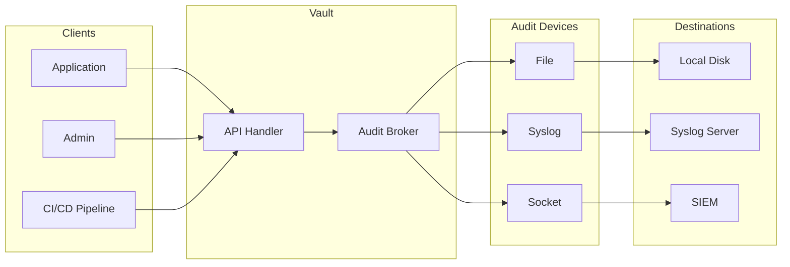
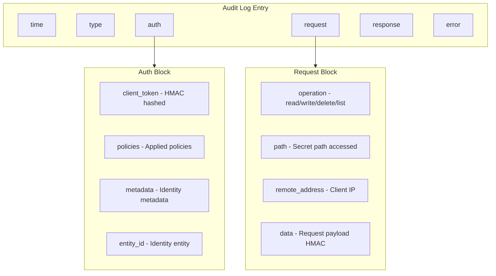
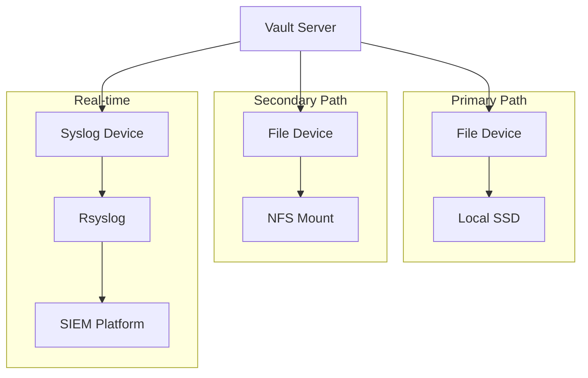
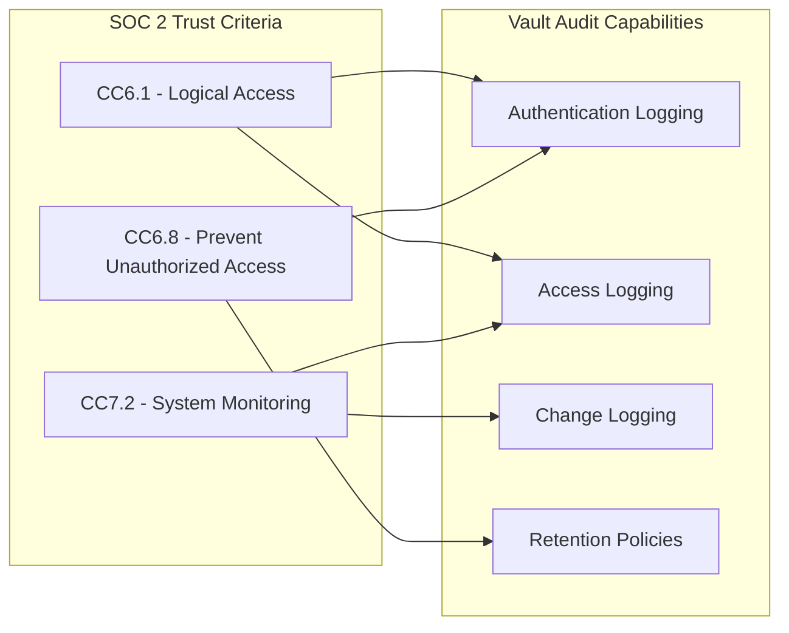

# How to Configure Vault Audit Logging

Author: [nawazdhandala](https://www.github.com/nawazdhandala)

Tags: HashiCorp Vault, Security, Audit Logging, Compliance, SIEM, DevOps, Secrets Management

Description: A comprehensive guide to configuring HashiCorp Vault audit logging for security monitoring, compliance requirements, and SIEM integration. Learn about audit device types, log formats, and best practices.

---

> "The question is not whether you will be audited, but whether you will be prepared when you are." - Security Proverb

Vault stores your most sensitive secrets - API keys, database credentials, certificates, and encryption keys. Every access to these secrets should be logged, analyzed, and retained. Vault's audit logging captures every authenticated request and response, providing the forensic trail you need for security investigations and compliance audits.

## Understanding Vault Audit Logging

Vault audit devices record all requests and responses to Vault. This includes authentication attempts, secret reads, policy changes, and administrative operations. Every operation is logged with detailed metadata.



### Key Principles

1. **Request Blocking**: If all audit devices fail to log, Vault blocks the request. Security over availability.
2. **HMAC Hashing**: Sensitive data is hashed by default, not logged in plaintext.
3. **Complete Coverage**: Every authenticated API request generates an audit log.

## Audit Device Types

Vault supports three audit device types, each suited for different deployment scenarios.

### File Audit Device

The most common choice. Writes JSON logs to a file on the Vault server.

```bash
# Enable file audit device
# The path is where logs will be written on the Vault server filesystem
vault audit enable file file_path=/var/log/vault/audit.log

# Verify the audit device is enabled
vault audit list
```

Configuration options for the file device:

```bash
# Enable with additional options
vault audit enable file \
    file_path=/var/log/vault/audit.log \
    log_raw=false \           # Set true to log sensitive data in plaintext (NOT recommended)
    hmac_accessor=true \      # HMAC the accessor in each request
    mode=0600 \               # File permissions
    format=json               # Output format: json or jsonx
```

### Syslog Audit Device

Sends audit logs to a local or remote syslog daemon. Ideal for centralized logging infrastructure.

```bash
# Enable syslog audit device
# Sends logs to the local syslog daemon
vault audit enable syslog

# Enable with custom configuration
vault audit enable syslog \
    tag=vault \              # Syslog tag for filtering
    facility=AUTH \          # Syslog facility (AUTH, LOCAL0-LOCAL7, etc.)
    format=json
```

For remote syslog, configure your local syslog daemon (rsyslog, syslog-ng) to forward Vault logs.

### Socket Audit Device

Streams audit logs over TCP or UDP to a remote endpoint. Perfect for direct SIEM integration.

```bash
# Enable socket audit device
# Streams logs directly to a TCP endpoint
vault audit enable socket \
    address=10.0.1.50:9000 \
    socket_type=tcp \
    format=json

# For UDP (less reliable but lower latency)
vault audit enable socket \
    address=10.0.1.50:514 \
    socket_type=udp \
    format=json
```

## Log Format and Structure

Understanding the log format is essential for parsing and analysis. Here's a sample audit log entry:

```json
{
  "time": "2026-01-27T10:15:30.123456Z",
  "type": "request",
  "auth": {
    "client_token": "hmac-sha256:abc123...",
    "accessor": "hmac-sha256:def456...",
    "display_name": "approle-web-app",
    "policies": ["default", "web-app-policy"],
    "token_policies": ["default", "web-app-policy"],
    "metadata": {
      "role_name": "web-app"
    },
    "entity_id": "12345-67890-abcdef",
    "token_type": "service",
    "token_ttl": 3600,
    "token_issue_time": "2026-01-27T09:15:30Z"
  },
  "request": {
    "id": "a1b2c3d4-e5f6-7890-abcd-ef1234567890",
    "operation": "read",
    "client_token": "hmac-sha256:abc123...",
    "client_token_accessor": "hmac-sha256:def456...",
    "namespace": {
      "id": "root"
    },
    "path": "secret/data/production/database",
    "data": null,
    "remote_address": "10.0.2.15",
    "wrap_ttl": 0,
    "headers": {}
  },
  "response": {
    "mount_type": "kv",
    "mount_accessor": "kv_12345",
    "data": {
      "data": "hmac-sha256:xyz789...",
      "metadata": "hmac-sha256:uvw012..."
    }
  },
  "error": ""
}
```

### Key Fields Explained



### Decoding HMAC Values

For forensic investigations, you can decode HMAC values if you have the audit HMAC key:

```bash
# Calculate HMAC for a known value to match against logs
# This helps identify which token or secret was accessed
vault write sys/audit-hash/file input="s.actualTokenValue"
```

## Enabling Multiple Audit Devices

For high availability and redundancy, enable multiple audit devices. Vault only requires ONE device to successfully log before proceeding.

```bash
# Enable primary file audit
vault audit enable -path=file-primary file \
    file_path=/var/log/vault/audit-primary.log

# Enable secondary file audit on different storage
vault audit enable -path=file-secondary file \
    file_path=/mnt/nfs/vault/audit-secondary.log

# Enable syslog for real-time streaming
vault audit enable -path=syslog-main syslog \
    tag=vault-prod \
    facility=LOCAL0

# List all enabled audit devices
vault audit list -detailed
```



## SIEM Integration

Integrating Vault audit logs with your SIEM enables real-time alerting, correlation with other security events, and long-term retention.

### Splunk Integration

Configure Vault to send logs to Splunk via HTTP Event Collector (HEC):

```bash
# Using Fluentd as a log shipper
# /etc/fluent/fluent.conf

<source>
  @type tail
  # Path to Vault audit log file
  path /var/log/vault/audit.log
  # Position file tracks read position
  pos_file /var/log/fluent/vault-audit.pos
  tag vault.audit
  <parse>
    @type json
    time_key time
    time_format %Y-%m-%dT%H:%M:%S.%N%z
  </parse>
</source>

<match vault.audit>
  @type splunk_hec
  # Splunk HEC endpoint
  hec_host splunk.example.com
  hec_port 8088
  hec_token YOUR-HEC-TOKEN-HERE
  # Index for Vault logs
  index vault_audit
  sourcetype vault:audit
  <buffer>
    @type file
    path /var/log/fluent/buffer/splunk
    flush_interval 5s
  </buffer>
</match>
```

### Elastic Stack Integration

Send Vault audit logs to Elasticsearch using Filebeat:

```yaml
# /etc/filebeat/filebeat.yml

filebeat.inputs:
  # Input configuration for Vault audit logs
  - type: log
    enabled: true
    paths:
      - /var/log/vault/audit.log
    # Parse as JSON
    json.keys_under_root: true
    json.add_error_key: true
    # Add metadata fields
    fields:
      log_type: vault_audit
      environment: production
    fields_under_root: true

# Elasticsearch output configuration
output.elasticsearch:
  hosts: ["https://elasticsearch.example.com:9200"]
  # Index pattern for Vault logs
  index: "vault-audit-%{+yyyy.MM.dd}"
  username: "elastic"
  password: "${ES_PASSWORD}"
  ssl.certificate_authorities: ["/etc/filebeat/ca.crt"]

# Index lifecycle management
setup.ilm.enabled: true
setup.ilm.rollover_alias: "vault-audit"
setup.ilm.pattern: "{now/d}-000001"
```

### Direct Socket to SIEM

For lowest latency, stream directly to your SIEM:

```bash
# Enable socket device pointing to SIEM ingestion endpoint
vault audit enable socket \
    address=siem.example.com:5514 \
    socket_type=tcp \
    format=json

# For Cribl Stream
vault audit enable socket \
    address=cribl.example.com:9514 \
    socket_type=tcp
```

## Compliance Requirements

Audit logging is mandatory for most compliance frameworks. Here's how Vault audit logging maps to common requirements.

### SOC 2 Requirements



### PCI-DSS Requirements

| PCI-DSS Requirement | Vault Audit Feature |
|---------------------|---------------------|
| 10.1 - Audit trails | All API requests logged |
| 10.2.1 - User access | Auth block with identity |
| 10.2.2 - Root actions | Privileged operation logging |
| 10.2.4 - Invalid access | Failed authentication logged |
| 10.2.5 - Privilege changes | Policy modification logged |
| 10.5 - Secure logs | HMAC hashing, file permissions |
| 10.7 - Retention | Configurable log retention |

### HIPAA Audit Controls

```bash
# HIPAA-compliant audit configuration
# Enable multiple audit devices for redundancy
vault audit enable -path=hipaa-file file \
    file_path=/secure/vault/audit.log \
    mode=0600

# Enable syslog for real-time monitoring
vault audit enable -path=hipaa-syslog syslog \
    facility=AUTH \
    tag=vault-hipaa

# Ensure logs are retained for 6 years (configure at storage level)
# Configure log rotation with compression
# /etc/logrotate.d/vault-audit

/secure/vault/audit.log {
    daily
    rotate 2190        # 6 years of daily logs
    compress
    delaycompress
    missingok
    notifempty
    create 0600 vault vault
    postrotate
        # Signal Vault to reopen log file
        pkill -HUP vault
    endscript
}
```

## Log Rotation and Retention

Vault audit logs can grow rapidly. Configure proper rotation to manage disk space while meeting retention requirements.

```bash
# Logrotate configuration for Vault audit logs
# /etc/logrotate.d/vault

/var/log/vault/audit.log {
    # Rotate daily
    daily
    # Keep 90 days of logs
    rotate 90
    # Compress old logs
    compress
    # Don't compress the most recent rotated log
    delaycompress
    # Don't error if log is missing
    missingok
    # Don't rotate empty logs
    notifempty
    # Create new log with proper permissions
    create 0600 vault vault
    # Commands to run after rotation
    postrotate
        # Send SIGHUP to Vault to reopen the log file
        /usr/bin/pkill -HUP vault 2>/dev/null || true
    endscript
}
```

### Automated Log Shipping

```bash
#!/bin/bash
# /usr/local/bin/ship-vault-logs.sh
# Ship rotated logs to long-term storage

# Configuration
LOG_DIR="/var/log/vault"
S3_BUCKET="s3://company-audit-logs/vault"
RETENTION_DAYS=2555  # 7 years for compliance

# Find and ship compressed logs
find ${LOG_DIR} -name "audit.log-*.gz" -mtime +1 | while read logfile; do
    # Generate S3 path with date structure
    log_date=$(basename ${logfile} | grep -oP '\d{8}')
    year=${log_date:0:4}
    month=${log_date:4:2}

    # Upload to S3 with server-side encryption
    aws s3 cp ${logfile} \
        ${S3_BUCKET}/${year}/${month}/$(basename ${logfile}) \
        --sse AES256 \
        --storage-class STANDARD_IA

    # Remove local copy after successful upload
    if [ $? -eq 0 ]; then
        rm ${logfile}
        echo "Shipped and removed: ${logfile}"
    fi
done

# Clean up logs older than retention period from S3
aws s3 ls ${S3_BUCKET} --recursive | while read -r line; do
    log_date=$(echo ${line} | awk '{print $1}')
    log_age=$(( ($(date +%s) - $(date -d "${log_date}" +%s)) / 86400 ))

    if [ ${log_age} -gt ${RETENTION_DAYS} ]; then
        file_path=$(echo ${line} | awk '{print $4}')
        aws s3 rm ${S3_BUCKET}/${file_path}
    fi
done
```

## Monitoring Audit Log Health

It's critical to monitor that audit logging is functioning correctly. A failed audit device could mean lost security visibility.

### Health Check Script

```bash
#!/bin/bash
# /usr/local/bin/check-vault-audit.sh
# Monitor Vault audit device health

VAULT_ADDR="https://vault.example.com:8200"
ALERT_ENDPOINT="https://oneuptime.example.com/api/probe"

# Check audit device status
audit_status=$(vault audit list -format=json 2>/dev/null)

if [ $? -ne 0 ]; then
    # Vault API unreachable
    curl -X POST ${ALERT_ENDPOINT} \
        -H "Content-Type: application/json" \
        -d '{"status": "error", "message": "Vault API unreachable for audit check"}'
    exit 1
fi

# Count enabled audit devices
device_count=$(echo ${audit_status} | jq 'length')

if [ "${device_count}" -eq 0 ]; then
    # No audit devices enabled - critical security issue
    curl -X POST ${ALERT_ENDPOINT} \
        -H "Content-Type: application/json" \
        -d '{"status": "critical", "message": "No Vault audit devices enabled"}'
    exit 1
fi

# Check if audit log file is being written to
last_modified=$(stat -c %Y /var/log/vault/audit.log 2>/dev/null)
current_time=$(date +%s)
age=$((current_time - last_modified))

if [ ${age} -gt 300 ]; then
    # No audit log activity in 5 minutes - may indicate issue
    curl -X POST ${ALERT_ENDPOINT} \
        -H "Content-Type: application/json" \
        -d '{"status": "warning", "message": "Vault audit log stale for 5+ minutes"}'
fi

echo "Vault audit health check passed: ${device_count} devices enabled"
```

### Prometheus Metrics

Vault exposes metrics about audit logging that you can scrape with Prometheus:

```yaml
# Prometheus alerting rules for Vault audit
# /etc/prometheus/rules/vault-audit.yml

groups:
  - name: vault-audit
    rules:
      # Alert if audit log operations are failing
      - alert: VaultAuditLogFailures
        expr: increase(vault_audit_log_request_failure[5m]) > 0
        for: 1m
        labels:
          severity: critical
        annotations:
          summary: "Vault audit logging failures detected"
          description: "Vault audit log has {{ $value }} failures in the last 5 minutes"

      # Alert if no audit requests are being logged
      - alert: VaultAuditLogInactive
        expr: increase(vault_audit_log_request[5m]) == 0
        for: 10m
        labels:
          severity: warning
        annotations:
          summary: "Vault audit log appears inactive"
          description: "No audit log entries in the last 10 minutes"

      # Alert on high audit log latency
      - alert: VaultAuditLogLatency
        expr: vault_audit_log_request_duration_seconds{quantile="0.99"} > 0.5
        for: 5m
        labels:
          severity: warning
        annotations:
          summary: "Vault audit log latency is high"
          description: "99th percentile audit log latency is {{ $value }}s"
```

## Security Best Practices

### 1. Enable Multiple Audit Devices

Never rely on a single audit device. If it fails, you lose visibility.

```bash
# Minimum recommended configuration
vault audit enable -path=file-local file \
    file_path=/var/log/vault/audit.log

vault audit enable -path=syslog-remote syslog \
    facility=LOCAL0 \
    tag=vault
```

### 2. Protect Audit Log Files

```bash
# Set restrictive permissions
chmod 0600 /var/log/vault/audit.log
chown vault:vault /var/log/vault/audit.log

# Use SELinux context (if applicable)
semanage fcontext -a -t var_log_t "/var/log/vault(/.*)?"
restorecon -Rv /var/log/vault
```

### 3. Monitor Log Integrity

```bash
# Generate daily checksums of rotated logs
#!/bin/bash
for logfile in /var/log/vault/audit.log-*.gz; do
    sha256sum ${logfile} >> /var/log/vault/checksums.txt
done
```

### 4. Never Log Raw Secrets

Keep `log_raw=false` (the default). Only enable for troubleshooting in development environments.

```bash
# Correct - secrets are HMAC hashed
vault audit enable file file_path=/var/log/vault/audit.log log_raw=false

# DANGEROUS - never use in production
# vault audit enable file file_path=/var/log/vault/audit.log log_raw=true
```

## Troubleshooting

### Audit Device Won't Enable

```bash
# Check if the path exists and is writable
ls -la /var/log/vault/

# Create directory with proper permissions
mkdir -p /var/log/vault
chown vault:vault /var/log/vault
chmod 0750 /var/log/vault

# Retry enabling
vault audit enable file file_path=/var/log/vault/audit.log
```

### Requests Being Blocked

If all audit devices fail, Vault blocks requests. Check device status:

```bash
# List audit devices and their status
vault audit list -detailed

# Check Vault server logs for audit errors
journalctl -u vault -f | grep -i audit
```

### High Disk Usage

```bash
# Check audit log size
du -sh /var/log/vault/audit.log

# Force log rotation
logrotate -f /etc/logrotate.d/vault

# Consider enabling compression in flight
vault audit enable file \
    file_path=/var/log/vault/audit.log \
    mode=0600
```

---

Audit logging is non-negotiable for production Vault deployments. Enable multiple devices, ship logs to your SIEM, and monitor the health of your audit pipeline. When the security incident happens or the auditor comes knocking, you'll have the complete forensic trail.

For comprehensive monitoring of your Vault infrastructure, including audit log health, secret access patterns, and authentication failures, check out [OneUptime](https://oneuptime.com). OneUptime provides real-time alerting, log aggregation, and compliance dashboards that integrate seamlessly with your Vault audit logs.
