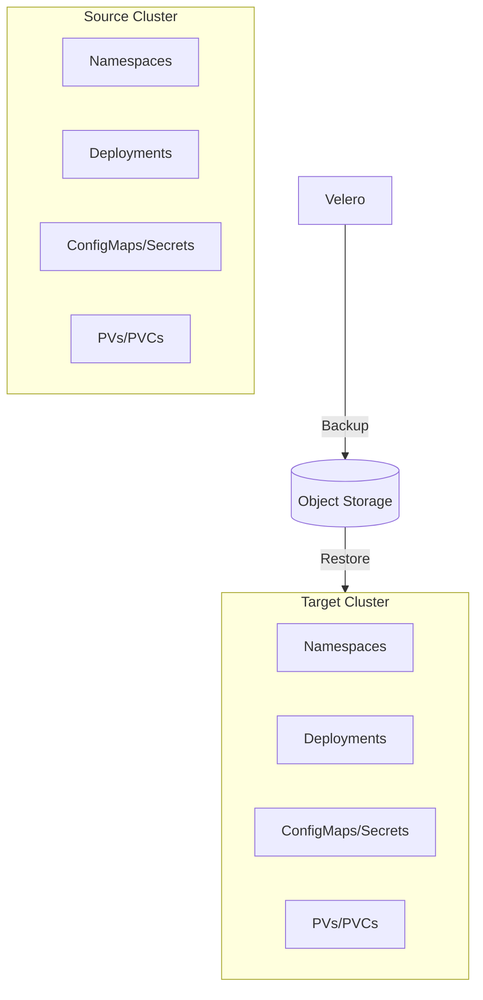
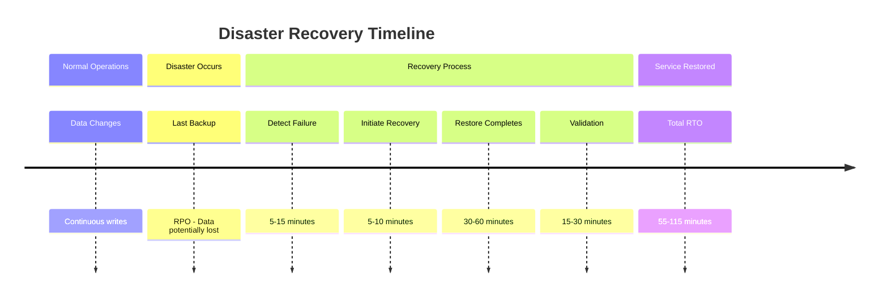

# How to Implement Velero for Disaster Recovery

Author: [nawazdhandala](https://www.github.com/nawazdhandala)

Tags: Kubernetes, Velero, Disaster Recovery, Backup, Cross-Cluster, Cross-Region, RTO, RPO, DevOps

Description: A comprehensive guide to implementing Velero for Kubernetes disaster recovery, including cross-cluster restores, cross-region backups, restore ordering, and RTO/RPO strategies.

---

> Backups are worthless if you have never tested a restore. Velero makes Kubernetes disaster recovery achievable, but only if you plan, automate, and regularly validate your recovery procedures.

## Building a Disaster Recovery Strategy with Velero

Velero is an open-source tool that provides backup and restore capabilities for Kubernetes clusters. Unlike etcd snapshots that only capture cluster state, Velero backs up both Kubernetes resources and persistent volume data, making it essential for complete disaster recovery.

### Why Velero for DR?



### Installing Velero

```bash
# Download the Velero CLI
# Replace with the latest version
wget https://github.com/vmware-tanzu/velero/releases/download/v1.13.0/velero-v1.13.0-linux-amd64.tar.gz
tar -xvf velero-v1.13.0-linux-amd64.tar.gz
sudo mv velero-v1.13.0-linux-amd64/velero /usr/local/bin/

# Verify installation
velero version
```

### Basic Velero Installation with AWS

```bash
# Create credentials file for AWS
cat > credentials-velero <<EOF
[default]
aws_access_key_id=YOUR_ACCESS_KEY
aws_secret_access_key=YOUR_SECRET_KEY
EOF

# Install Velero with AWS plugin
velero install \
    --provider aws \
    --plugins velero/velero-plugin-for-aws:v1.9.0 \
    --bucket velero-backups \
    --backup-location-config region=us-east-1 \
    --snapshot-location-config region=us-east-1 \
    --secret-file ./credentials-velero

# Verify the installation
kubectl get pods -n velero
```

## Cross-Cluster Restore

Cross-cluster restore is the cornerstone of disaster recovery. It allows you to recover your workloads on a completely different Kubernetes cluster when the primary cluster is unavailable.

### Setting Up the DR Cluster

```yaml
# velero-backup-location.yaml
# Configure backup storage location on DR cluster
apiVersion: velero.io/v1
kind: BackupStorageLocation
metadata:
  name: primary-cluster-backups
  namespace: velero
spec:
  provider: aws
  objectStorage:
    bucket: velero-backups
    # Prefix to organize backups by cluster
    prefix: primary-cluster
  config:
    region: us-east-1
    # Use path-style URLs for MinIO or other S3-compatible storage
    s3ForcePathStyle: "false"
  # Mark as read-only on DR cluster to prevent accidental deletions
  accessMode: ReadOnly
```

### Performing Cross-Cluster Restore

```bash
# On the DR cluster, list available backups from primary
velero backup get --all-namespaces

# Restore specific namespaces from primary cluster backup
velero restore create dr-restore-production \
    --from-backup production-daily-20260127 \
    --include-namespaces production,monitoring \
    --restore-pvs=true

# Monitor the restore progress
velero restore describe dr-restore-production --details

# Check for any warnings or errors
velero restore logs dr-restore-production
```

### Namespace Mapping for Cross-Cluster Restores

```bash
# Restore to a different namespace (useful for testing)
velero restore create test-restore \
    --from-backup production-daily-20260127 \
    --namespace-mappings production:production-dr-test \
    --restore-pvs=true

# Restore with label selector to restore specific resources only
velero restore create selective-restore \
    --from-backup production-daily-20260127 \
    --selector app=critical-service \
    --restore-pvs=true
```

## Cross-Region Backups

Cross-region backups protect against regional outages. Velero supports replicating backups to multiple geographic locations.

### Configuring Multi-Region Backup Storage

```yaml
# primary-backup-location.yaml
# Primary backup storage in us-east-1
apiVersion: velero.io/v1
kind: BackupStorageLocation
metadata:
  name: primary
  namespace: velero
spec:
  provider: aws
  objectStorage:
    bucket: velero-backups-us-east-1
    prefix: cluster-prod
  config:
    region: us-east-1
  default: true
---
# secondary-backup-location.yaml
# Secondary backup storage in eu-west-1 for geo-redundancy
apiVersion: velero.io/v1
kind: BackupStorageLocation
metadata:
  name: secondary-eu
  namespace: velero
spec:
  provider: aws
  objectStorage:
    bucket: velero-backups-eu-west-1
    prefix: cluster-prod
  config:
    region: eu-west-1
```

### Creating Backups to Multiple Regions

```bash
# Create a backup to the primary location
velero backup create daily-backup-$(date +%Y%m%d) \
    --storage-location primary \
    --include-namespaces production,staging

# Copy backup to secondary region using S3 replication
# Or create explicit backup to secondary location
velero backup create daily-backup-$(date +%Y%m%d)-eu \
    --storage-location secondary-eu \
    --include-namespaces production,staging
```

### Automated Cross-Region Backup Schedule

```yaml
# cross-region-backup-schedule.yaml
# Schedule that creates backups to both regions
apiVersion: velero.io/v1
kind: Schedule
metadata:
  name: production-backup-primary
  namespace: velero
spec:
  # Run daily at 2 AM UTC
  schedule: "0 2 * * *"
  template:
    # Include all production namespaces
    includedNamespaces:
      - production
      - monitoring
      - logging
    # Include persistent volumes
    snapshotVolumes: true
    # Storage location for this schedule
    storageLocation: primary
    # Time to live for backups (30 days)
    ttl: 720h
    # Include cluster-scoped resources
    includeClusterResources: true
---
apiVersion: velero.io/v1
kind: Schedule
metadata:
  name: production-backup-secondary
  namespace: velero
spec:
  # Offset by 1 hour to avoid resource contention
  schedule: "0 3 * * *"
  template:
    includedNamespaces:
      - production
      - monitoring
      - logging
    snapshotVolumes: true
    storageLocation: secondary-eu
    ttl: 720h
    includeClusterResources: true
```

## Restore Ordering and Dependencies

Kubernetes resources have dependencies. Restoring them in the wrong order causes failures. Velero provides mechanisms to control restore order.

### Understanding Default Restore Order

Velero restores resources in a specific order:

1. Custom Resource Definitions (CRDs)
2. Namespaces
3. Storage Classes
4. Persistent Volumes
5. Persistent Volume Claims
6. Secrets and ConfigMaps
7. Service Accounts
8. Services
9. Deployments, StatefulSets, DaemonSets
10. Pods

### Using Restore Hooks for Ordering

```yaml
# deployment-with-restore-hooks.yaml
apiVersion: apps/v1
kind: Deployment
metadata:
  name: application
  namespace: production
  annotations:
    # Pre-restore hook - runs before the resource is restored
    pre.hook.restore.velero.io/container: init-db
    pre.hook.restore.velero.io/command: '["/bin/sh", "-c", "until pg_isready -h postgres; do sleep 2; done"]'
    # Post-restore hook - runs after the resource is restored
    post.hook.restore.velero.io/container: app
    post.hook.restore.velero.io/command: '["/bin/sh", "-c", "/app/post-restore-setup.sh"]'
    post.hook.restore.velero.io/wait-timeout: 5m
spec:
  replicas: 3
  selector:
    matchLabels:
      app: application
  template:
    spec:
      containers:
        - name: app
          image: myapp:latest
```

### Resource Restore Priority

```yaml
# configmap-restore-priority.yaml
# Velero ConfigMap to customize restore priority
apiVersion: v1
kind: ConfigMap
metadata:
  name: velero-restore-resource-priorities
  namespace: velero
data:
  # Define custom resource restore priorities
  # Higher priority resources restore first
  restoreResourcePriorities: |
    - customresourcedefinitions
    - namespaces
    - storageclasses
    - persistentvolumes
    - persistentvolumeclaims
    - secrets
    - configmaps
    - serviceaccounts
    - roles
    - rolebindings
    - clusterroles
    - clusterrolebindings
    - services
    - statefulsets
    - deployments
    - daemonsets
    - replicasets
    - pods
    - jobs
    - cronjobs
```

### Handling Database Dependencies

```bash
# Create a backup with specific resource ordering
# First, backup infrastructure components
velero backup create infra-backup-$(date +%Y%m%d) \
    --include-namespaces infrastructure \
    --include-resources persistentvolumes,persistentvolumeclaims,secrets,configmaps,services,statefulsets

# Then backup application workloads
velero backup create apps-backup-$(date +%Y%m%d) \
    --include-namespaces production \
    --exclude-resources persistentvolumes,persistentvolumeclaims

# Restore in order
# 1. Restore infrastructure first
velero restore create infra-restore \
    --from-backup infra-backup-20260127

# 2. Wait for databases to be ready
kubectl wait --for=condition=ready pod -l app=postgres -n infrastructure --timeout=300s

# 3. Restore applications
velero restore create apps-restore \
    --from-backup apps-backup-20260127
```

## Testing DR Procedures

Regular DR testing is critical. An untested backup is not a backup.

### Automated DR Testing Framework

```yaml
# dr-test-cronjob.yaml
# Automated monthly DR test
apiVersion: batch/v1
kind: CronJob
metadata:
  name: dr-test-automation
  namespace: velero
spec:
  # Run on the first Sunday of each month at 3 AM
  schedule: "0 3 1-7 * 0"
  jobTemplate:
    spec:
      template:
        spec:
          serviceAccountName: velero
          containers:
            - name: dr-test
              image: velero/velero:v1.13.0
              command:
                - /bin/sh
                - -c
                - |
                  # Get the latest backup
                  LATEST_BACKUP=$(velero backup get -o json | jq -r '.items | sort_by(.metadata.creationTimestamp) | last | .metadata.name')

                  echo "Testing restore from backup: $LATEST_BACKUP"

                  # Create test restore to isolated namespace
                  velero restore create dr-test-$(date +%Y%m%d) \
                    --from-backup $LATEST_BACKUP \
                    --namespace-mappings production:dr-test-production \
                    --restore-pvs=false

                  # Wait for restore to complete
                  sleep 300

                  # Check restore status
                  RESTORE_STATUS=$(velero restore get dr-test-$(date +%Y%m%d) -o json | jq -r '.status.phase')

                  if [ "$RESTORE_STATUS" = "Completed" ]; then
                    echo "DR test successful"
                    # Run validation tests
                    kubectl get pods -n dr-test-production
                    # Cleanup test namespace
                    kubectl delete namespace dr-test-production
                    exit 0
                  else
                    echo "DR test failed with status: $RESTORE_STATUS"
                    exit 1
                  fi
          restartPolicy: OnFailure
```

### DR Test Validation Script

```bash
#!/bin/bash
# dr-validation.sh
# Comprehensive DR validation script

set -e

BACKUP_NAME=$1
TEST_NAMESPACE="dr-test-$(date +%Y%m%d-%H%M%S)"

echo "=== Starting DR Validation Test ==="
echo "Backup: $BACKUP_NAME"
echo "Test Namespace: $TEST_NAMESPACE"

# Step 1: Restore to test namespace
echo "=== Step 1: Restoring backup ==="
velero restore create $TEST_NAMESPACE \
    --from-backup $BACKUP_NAME \
    --namespace-mappings production:$TEST_NAMESPACE \
    --restore-pvs=false \
    --wait

# Step 2: Validate restore status
echo "=== Step 2: Validating restore status ==="
RESTORE_PHASE=$(velero restore get $TEST_NAMESPACE -o jsonpath='{.status.phase}')
if [ "$RESTORE_PHASE" != "Completed" ]; then
    echo "ERROR: Restore failed with phase: $RESTORE_PHASE"
    velero restore logs $TEST_NAMESPACE
    exit 1
fi

# Step 3: Check pod health
echo "=== Step 3: Checking pod health ==="
kubectl wait --for=condition=ready pod --all -n $TEST_NAMESPACE --timeout=300s

# Step 4: Run application health checks
echo "=== Step 4: Running application health checks ==="
PODS=$(kubectl get pods -n $TEST_NAMESPACE -o jsonpath='{.items[*].metadata.name}')
for POD in $PODS; do
    echo "Checking pod: $POD"
    # Check if pod is running
    STATUS=$(kubectl get pod $POD -n $TEST_NAMESPACE -o jsonpath='{.status.phase}')
    if [ "$STATUS" != "Running" ]; then
        echo "WARNING: Pod $POD is in $STATUS state"
    fi
done

# Step 5: Test service connectivity
echo "=== Step 5: Testing service connectivity ==="
SERVICES=$(kubectl get svc -n $TEST_NAMESPACE -o jsonpath='{.items[*].metadata.name}')
for SVC in $SERVICES; do
    echo "Testing service: $SVC"
    kubectl run test-curl --image=curlimages/curl --rm -it --restart=Never -n $TEST_NAMESPACE -- \
        curl -s -o /dev/null -w "%{http_code}" http://$SVC:80 || true
done

# Step 6: Cleanup
echo "=== Step 6: Cleaning up test namespace ==="
kubectl delete namespace $TEST_NAMESPACE --wait=false
velero restore delete $TEST_NAMESPACE --confirm

echo "=== DR Validation Test Complete ==="
echo "Result: SUCCESS"
```

### Documenting DR Runbooks

```yaml
# dr-runbook-configmap.yaml
# Store DR procedures as ConfigMap for easy access during incidents
apiVersion: v1
kind: ConfigMap
metadata:
  name: dr-runbook
  namespace: velero
data:
  runbook.md: |
    # Disaster Recovery Runbook

    ## Prerequisites
    - Access to DR cluster
    - Velero CLI installed
    - kubectl configured for DR cluster

    ## Step 1: Assess the Situation
    - Identify scope of disaster
    - Determine which namespaces need recovery
    - Find the most recent valid backup

    ## Step 2: Identify Latest Backup
    ```bash
    velero backup get --all-namespaces
    velero backup describe <backup-name> --details
    ```

    ## Step 3: Initiate Restore
    ```bash
    velero restore create emergency-restore-$(date +%Y%m%d-%H%M%S) \
        --from-backup <backup-name> \
        --include-namespaces production,monitoring \
        --restore-pvs=true
    ```

    ## Step 4: Monitor Progress
    ```bash
    velero restore describe <restore-name> --details
    watch kubectl get pods -n production
    ```

    ## Step 5: Validate Services
    - Check all deployments are running
    - Verify database connectivity
    - Test external access
    - Validate data integrity

    ## Step 6: Update DNS/Traffic
    - Point DNS to DR cluster
    - Update load balancer targets
    - Verify traffic routing
```

## RTO/RPO Considerations

Recovery Time Objective (RTO) and Recovery Point Objective (RPO) are critical metrics that drive your backup strategy.

### Understanding RTO and RPO



### Configuring Backups for Different RPO Targets

```yaml
# rpo-based-schedules.yaml
# Critical workloads - 1 hour RPO
apiVersion: velero.io/v1
kind: Schedule
metadata:
  name: critical-workloads-hourly
  namespace: velero
spec:
  # Every hour on the hour
  schedule: "0 * * * *"
  template:
    includedNamespaces:
      - production
    # Only include critical workloads
    labelSelector:
      matchLabels:
        criticality: high
    snapshotVolumes: true
    storageLocation: primary
    # Keep hourly backups for 7 days
    ttl: 168h
---
# Standard workloads - 4 hour RPO
apiVersion: velero.io/v1
kind: Schedule
metadata:
  name: standard-workloads-4hourly
  namespace: velero
spec:
  # Every 4 hours
  schedule: "0 */4 * * *"
  template:
    includedNamespaces:
      - staging
      - development
    snapshotVolumes: true
    storageLocation: primary
    # Keep 4-hourly backups for 3 days
    ttl: 72h
---
# Non-critical workloads - 24 hour RPO
apiVersion: velero.io/v1
kind: Schedule
metadata:
  name: non-critical-daily
  namespace: velero
spec:
  # Once daily at 2 AM
  schedule: "0 2 * * *"
  template:
    includedNamespaces:
      - tools
      - sandbox
    snapshotVolumes: false
    storageLocation: primary
    # Keep daily backups for 14 days
    ttl: 336h
```

### Optimizing RTO with Parallel Restores

```bash
# Parallel restore strategy for faster RTO
# Split workloads by dependency tier

# Tier 1: Infrastructure (databases, message queues)
velero restore create tier1-restore \
    --from-backup production-backup-20260127 \
    --include-resources persistentvolumes,persistentvolumeclaims,statefulsets \
    --include-namespaces production &

# Tier 2: Core services (after Tier 1 completes)
# Wait for infrastructure
sleep 120
velero restore create tier2-restore \
    --from-backup production-backup-20260127 \
    --include-resources deployments,services,configmaps,secrets \
    --selector tier=core \
    --include-namespaces production &

# Tier 3: Supporting services
sleep 60
velero restore create tier3-restore \
    --from-backup production-backup-20260127 \
    --include-resources deployments,services \
    --selector tier=supporting \
    --include-namespaces production &

# Wait for all restores
wait
```

### Monitoring RTO/RPO Metrics

```yaml
# prometheus-rules.yaml
# Alerting rules for backup SLOs
apiVersion: monitoring.coreos.com/v1
kind: PrometheusRule
metadata:
  name: velero-backup-slo
  namespace: monitoring
spec:
  groups:
    - name: velero-rpo-alerts
      rules:
        # Alert if no successful backup in RPO window
        - alert: VeleroRPOBreached
          expr: |
            time() - velero_backup_last_successful_timestamp{schedule=~"critical.*"} > 3600
          for: 5m
          labels:
            severity: critical
          annotations:
            summary: "RPO breached for critical workloads"
            description: "No successful backup in the last hour for schedule {{ $labels.schedule }}"

        - alert: VeleroBackupFailed
          expr: |
            increase(velero_backup_failure_total[1h]) > 0
          for: 5m
          labels:
            severity: warning
          annotations:
            summary: "Velero backup failed"
            description: "Backup failure detected, investigate immediately"

        - alert: VeleroRestoreDurationHigh
          expr: |
            velero_restore_duration_seconds > 1800
          for: 5m
          labels:
            severity: warning
          annotations:
            summary: "Restore taking longer than expected"
            description: "Restore {{ $labels.restore }} is taking more than 30 minutes"
```

### RTO/RPO Planning Worksheet

| Workload | RPO Target | RTO Target | Backup Frequency | Restore Strategy |
|----------|------------|------------|------------------|------------------|
| Production DB | 1 hour | 30 min | Hourly | Priority restore with pre-provisioned PVs |
| Core Services | 4 hours | 1 hour | 4-hourly | Parallel deployment restore |
| Monitoring | 24 hours | 2 hours | Daily | Post-app restore |
| Development | 48 hours | 4 hours | Daily | Low priority |

## Best Practices Summary

1. **Backup Strategy**
   - Define RPO/RTO for each workload tier
   - Use multiple storage locations for geo-redundancy
   - Encrypt backups at rest and in transit
   - Implement backup retention policies

2. **Cross-Cluster Readiness**
   - Keep DR cluster infrastructure provisioned
   - Regularly sync Velero configurations
   - Pre-provision storage classes on DR cluster
   - Document namespace and resource mappings

3. **Testing and Validation**
   - Test restores monthly at minimum
   - Automate DR validation tests
   - Document restore procedures in runbooks
   - Track restore duration metrics

4. **Operational Excellence**
   - Monitor backup job success/failure
   - Alert on RPO breaches immediately
   - Review and update DR plans quarterly
   - Train team on DR procedures

5. **Performance Optimization**
   - Use volume snapshots for large PVs
   - Implement parallel restore strategies
   - Pre-stage container images on DR cluster
   - Use resource filters to reduce backup size

6. **Security Considerations**
   - Secure backup storage access credentials
   - Use separate IAM roles for backup and restore
   - Audit backup access logs
   - Encrypt sensitive data before backup

---

Disaster recovery is not a one-time setup but an ongoing practice. Velero provides the tools, but success depends on planning, testing, and continuous improvement. Start with your most critical workloads, establish baselines for RTO/RPO, and gradually expand coverage. Most importantly, test your restores regularly because a backup you have never restored is just a hope, not a plan.

For comprehensive monitoring of your Kubernetes clusters and Velero backup jobs, check out [OneUptime](https://oneuptime.com) for unified observability across your infrastructure.
