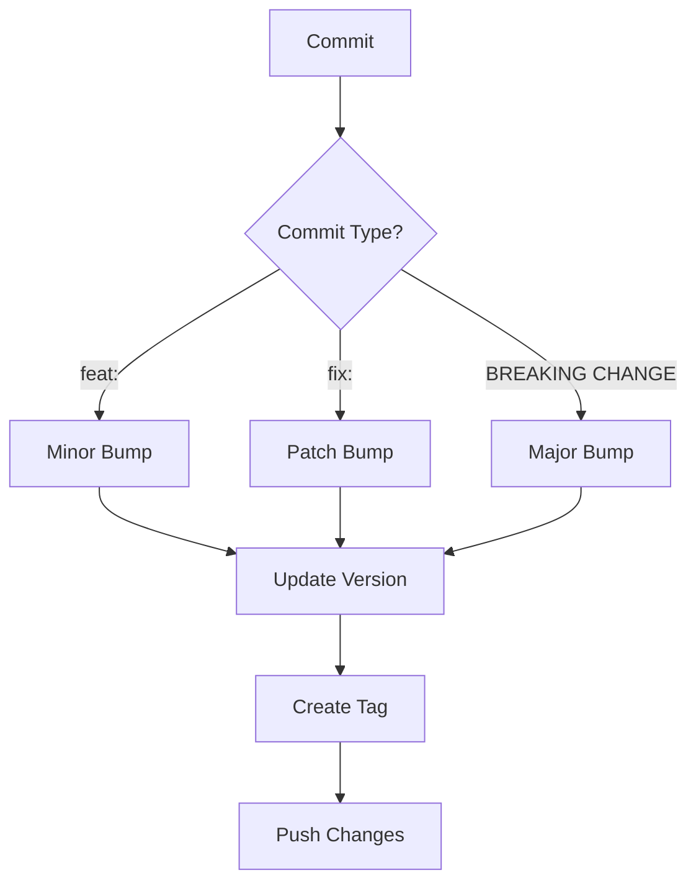

# How to Automate Version Bumping with GitHub Actions

Author: [nawazdhandala](https://www.github.com/nawazdhandala)

Tags: GitHub Actions, Versioning, Semantic Versioning, Release Automation, CI/CD, npm

Description: Automate version bumping in GitHub Actions using conventional commits, semantic-release, and custom scripts to maintain consistent versioning across your projects.

---

Manual version bumping is tedious and error-prone. Someone forgets to update the version, or bumps it incorrectly. Automating version management based on your commit history removes human error and makes releases predictable.

## Version Bumping Strategies

Choose a strategy that fits your workflow:



## Semantic Release

semantic-release is the gold standard for automated versioning. It analyzes commits and handles the entire release process:

```yaml
# .github/workflows/release.yml
name: Release

on:
  push:
    branches: [main]

permissions:
  contents: write
  issues: write
  pull-requests: write

jobs:
  release:
    runs-on: ubuntu-latest
    steps:
      - uses: actions/checkout@v4
        with:
          fetch-depth: 0
          persist-credentials: false

      - name: Set up Node.js
        uses: actions/setup-node@v4
        with:
          node-version: '20'
          cache: 'npm'

      - name: Install dependencies
        run: npm ci

      - name: Run semantic-release
        env:
          GITHUB_TOKEN: ${{ secrets.GITHUB_TOKEN }}
          NPM_TOKEN: ${{ secrets.NPM_TOKEN }}
        run: npx semantic-release
```

Configure semantic-release:

```javascript
// release.config.js
module.exports = {
  branches: ['main'],
  plugins: [
    '@semantic-release/commit-analyzer',
    '@semantic-release/release-notes-generator',
    '@semantic-release/changelog',
    '@semantic-release/npm',
    '@semantic-release/github',
    [
      '@semantic-release/git',
      {
        assets: ['package.json', 'CHANGELOG.md'],
        message: 'chore(release): ${nextRelease.version} [skip ci]\n\n${nextRelease.notes}'
      }
    ]
  ]
};
```

## Conventional Commits

semantic-release uses conventional commits to determine version bumps:

```
feat: add new payment method        -> Minor bump (1.0.0 -> 1.1.0)
fix: correct tax calculation        -> Patch bump (1.0.0 -> 1.0.1)
feat!: redesign checkout flow       -> Major bump (1.0.0 -> 2.0.0)
BREAKING CHANGE: remove legacy API  -> Major bump
```

Enforce conventional commits with commitlint:

```yaml
# .github/workflows/commitlint.yml
name: Lint Commits

on:
  pull_request:
    branches: [main]

jobs:
  commitlint:
    runs-on: ubuntu-latest
    steps:
      - uses: actions/checkout@v4
        with:
          fetch-depth: 0

      - name: Lint commits
        uses: wagoid/commitlint-github-action@v5
        with:
          configFile: commitlint.config.js
```

Commitlint configuration:

```javascript
// commitlint.config.js
module.exports = {
  extends: ['@commitlint/config-conventional'],
  rules: {
    'type-enum': [
      2,
      'always',
      ['feat', 'fix', 'docs', 'style', 'refactor', 'perf', 'test', 'chore', 'ci']
    ],
    'subject-case': [2, 'always', 'lower-case'],
    'body-max-line-length': [2, 'always', 100]
  }
};
```

## Manual Version Bumping Workflow

For projects that prefer explicit version control:

```yaml
name: Version Bump

on:
  workflow_dispatch:
    inputs:
      bump-type:
        description: 'Version bump type'
        required: true
        type: choice
        options:
          - patch
          - minor
          - major
      prerelease:
        description: 'Pre-release identifier (e.g., beta, rc)'
        required: false
        type: string

jobs:
  bump:
    runs-on: ubuntu-latest
    steps:
      - uses: actions/checkout@v4
        with:
          token: ${{ secrets.PAT_TOKEN }}  # Need PAT to trigger other workflows

      - name: Set up Node.js
        uses: actions/setup-node@v4
        with:
          node-version: '20'

      - name: Configure git
        run: |
          git config user.name "github-actions[bot]"
          git config user.email "github-actions[bot]@users.noreply.github.com"

      - name: Bump version
        id: bump
        run: |
          if [ -n "${{ inputs.prerelease }}" ]; then
            NEW_VERSION=$(npm version pre${{ inputs.bump-type }} --preid=${{ inputs.prerelease }} --no-git-tag-version)
          else
            NEW_VERSION=$(npm version ${{ inputs.bump-type }} --no-git-tag-version)
          fi
          echo "version=$NEW_VERSION" >> $GITHUB_OUTPUT

      - name: Commit and tag
        run: |
          git add package.json package-lock.json
          git commit -m "chore: bump version to ${{ steps.bump.outputs.version }}"
          git tag ${{ steps.bump.outputs.version }}
          git push origin main --tags
```

## PR-Based Version Bumping

Bump version based on PR labels:

```yaml
name: Version Bump on Merge

on:
  pull_request:
    types: [closed]
    branches: [main]

jobs:
  bump:
    if: github.event.pull_request.merged == true
    runs-on: ubuntu-latest
    steps:
      - uses: actions/checkout@v4
        with:
          fetch-depth: 0
          token: ${{ secrets.PAT_TOKEN }}

      - name: Determine bump type
        id: bump-type
        run: |
          LABELS="${{ join(github.event.pull_request.labels.*.name, ',') }}"
          if [[ "$LABELS" == *"major"* ]]; then
            echo "type=major" >> $GITHUB_OUTPUT
          elif [[ "$LABELS" == *"minor"* ]] || [[ "$LABELS" == *"feature"* ]]; then
            echo "type=minor" >> $GITHUB_OUTPUT
          else
            echo "type=patch" >> $GITHUB_OUTPUT
          fi

      - name: Set up Node.js
        uses: actions/setup-node@v4
        with:
          node-version: '20'

      - name: Configure git
        run: |
          git config user.name "github-actions[bot]"
          git config user.email "github-actions[bot]@users.noreply.github.com"

      - name: Bump version
        run: |
          npm version ${{ steps.bump-type.outputs.type }} -m "chore: release %s"
          git push origin main --follow-tags
```

## Multi-Package Version Sync

Keep versions synchronized across a monorepo:

```yaml
name: Sync Versions

on:
  push:
    branches: [main]
    paths:
      - 'package.json'

jobs:
  sync:
    runs-on: ubuntu-latest
    steps:
      - uses: actions/checkout@v4
        with:
          token: ${{ secrets.PAT_TOKEN }}

      - name: Get root version
        id: version
        run: |
          VERSION=$(node -p "require('./package.json').version")
          echo "version=$VERSION" >> $GITHUB_OUTPUT

      - name: Update package versions
        run: |
          VERSION="${{ steps.version.outputs.version }}"

          # Update all workspace packages
          for pkg in packages/*/package.json; do
            jq --arg v "$VERSION" '.version = $v' "$pkg" > tmp.json && mv tmp.json "$pkg"
          done

      - name: Commit changes
        run: |
          git config user.name "github-actions[bot]"
          git config user.email "github-actions[bot]@users.noreply.github.com"
          git add packages/*/package.json
          git diff --staged --quiet || git commit -m "chore: sync package versions to ${{ steps.version.outputs.version }}"
          git push
```

## Python Version Bumping

Automate versioning for Python packages:

```yaml
name: Python Version Bump

on:
  push:
    branches: [main]

jobs:
  bump:
    runs-on: ubuntu-latest
    steps:
      - uses: actions/checkout@v4
        with:
          fetch-depth: 0
          token: ${{ secrets.PAT_TOKEN }}

      - name: Set up Python
        uses: actions/setup-python@v5
        with:
          python-version: '3.11'

      - name: Install bump2version
        run: pip install bump2version

      - name: Determine bump type
        id: bump-type
        run: |
          # Analyze recent commits
          COMMITS=$(git log --oneline HEAD~5..HEAD)
          if echo "$COMMITS" | grep -q "BREAKING CHANGE\|feat!:"; then
            echo "type=major" >> $GITHUB_OUTPUT
          elif echo "$COMMITS" | grep -q "^feat:"; then
            echo "type=minor" >> $GITHUB_OUTPUT
          else
            echo "type=patch" >> $GITHUB_OUTPUT
          fi

      - name: Bump version
        run: |
          git config user.name "github-actions[bot]"
          git config user.email "github-actions[bot]@users.noreply.github.com"
          bump2version ${{ steps.bump-type.outputs.type }} --commit --tag
          git push origin main --follow-tags
```

Configure bump2version:

```ini
# .bumpversion.cfg
[bumpversion]
current_version = 1.0.0
commit = True
tag = True

[bumpversion:file:setup.py]
search = version="{current_version}"
replace = version="{new_version}"

[bumpversion:file:src/__init__.py]
search = __version__ = "{current_version}"
replace = __version__ = "{new_version}"
```

## Changelog Generation

Generate changelogs alongside version bumps:

```yaml
jobs:
  release:
    runs-on: ubuntu-latest
    steps:
      - uses: actions/checkout@v4
        with:
          fetch-depth: 0

      - name: Generate changelog
        id: changelog
        uses: conventional-changelog/standard-version@v9
        with:
          release-as: ${{ inputs.version }}

      - name: Update CHANGELOG.md
        run: |
          npx conventional-changelog-cli -p angular -i CHANGELOG.md -s

      - name: Commit changelog
        run: |
          git add CHANGELOG.md
          git commit --amend --no-edit
          git push --force-with-lease
```

## Pre-release Versions

Handle pre-release versions for testing:

```yaml
name: Pre-release

on:
  push:
    branches: [develop]

jobs:
  prerelease:
    runs-on: ubuntu-latest
    steps:
      - uses: actions/checkout@v4
        with:
          fetch-depth: 0
          token: ${{ secrets.PAT_TOKEN }}

      - name: Set up Node.js
        uses: actions/setup-node@v4
        with:
          node-version: '20'

      - name: Configure git
        run: |
          git config user.name "github-actions[bot]"
          git config user.email "github-actions[bot]@users.noreply.github.com"

      - name: Create pre-release version
        run: |
          # Get current version and create beta
          CURRENT=$(node -p "require('./package.json').version")
          BETA_VERSION="${CURRENT}-beta.$(date +%Y%m%d%H%M%S)"
          npm version $BETA_VERSION --no-git-tag-version
          git add package.json
          git commit -m "chore: pre-release $BETA_VERSION"
          git tag "v$BETA_VERSION"
          git push origin develop --tags
```

## Best Practices

1. **Use conventional commits** - They provide a clear contract for version bumps.

2. **Automate completely** - Remove human judgment from version decisions when possible.

3. **Protect main branch** - Require PRs so version bumps happen in a controlled manner.

4. **Generate changelogs** - Users should know what changed in each version.

5. **Test before releasing** - Run your full test suite before bumping versions.

6. **Use pre-releases wisely** - Beta and RC versions let you test releases before going stable.

Automated versioning removes friction from your release process and ensures every release is properly versioned.
