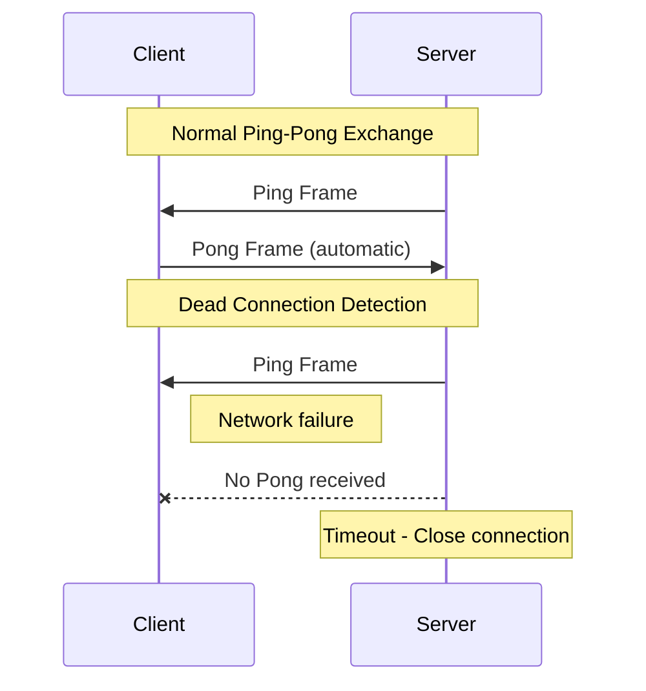
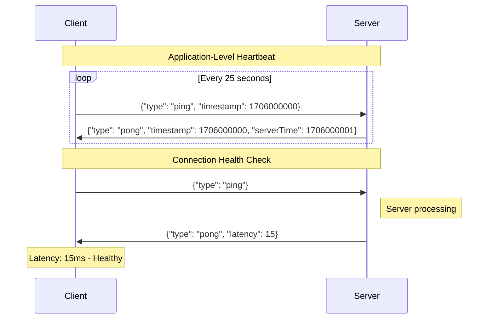
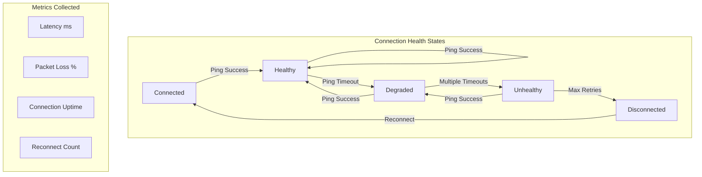
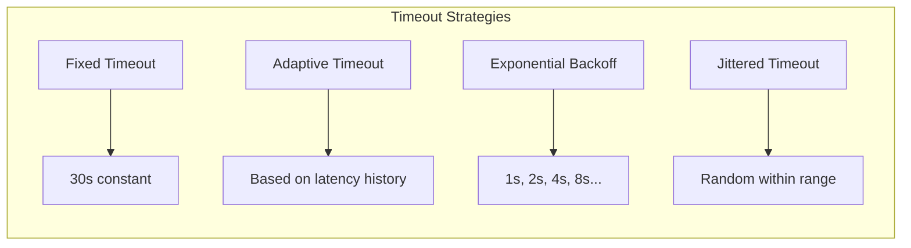

# How to Implement Heartbeat/Ping-Pong in WebSockets

By [Nawaz Dhandala](https://github.com/nawazdhandala)

Tags: WebSocket, Heartbeat, Ping-Pong, Connection Health, Real-Time, JavaScript, NodeJS

Description: Learn how to implement heartbeat and ping-pong mechanisms in WebSockets to detect connection failures, maintain connection health, and build resilient real-time applications.

---

> "The best time to detect a dead connection is before your users do." - Unknown

WebSocket connections can silently fail due to network issues, firewalls, or server problems. Without a heartbeat mechanism, your application might continue operating on a dead connection, leading to lost messages and poor user experience. This guide covers both protocol-level and application-level heartbeat implementations.

## Understanding WebSocket Ping-Pong Frames

The WebSocket protocol (RFC 6455) defines two control frame types for connection health: Ping (opcode 0x9) and Pong (opcode 0xA). These frames are handled at the protocol level and provide a standardized way to verify connection liveness.



### Server-Side Ping with Node.js ws Library

The `ws` library provides direct access to WebSocket control frames. The server sends pings and tracks responses to detect dead connections.

```javascript
const WebSocket = require('ws');
const http = require('http');

// Create HTTP server for WebSocket upgrade
const server = http.createServer();
const wss = new WebSocket.Server({ server });

// Configuration for heartbeat
const HEARTBEAT_INTERVAL = 30000;  // Send ping every 30 seconds
const CLIENT_TIMEOUT = 35000;       // Consider dead if no pong within 35 seconds

wss.on('connection', (ws, req) => {
  // Mark connection as alive when established
  ws.isAlive = true;
  ws.clientId = req.headers['x-client-id'] || generateClientId();

  console.log(`Client ${ws.clientId} connected`);

  // Handle pong responses from client
  // The 'pong' event fires when client responds to our ping
  ws.on('pong', () => {
    ws.isAlive = true;  // Mark as alive when pong received
    ws.lastPongTime = Date.now();
    console.log(`Pong received from ${ws.clientId}`);
  });

  // Handle incoming messages
  ws.on('message', (data) => {
    // Any message from client also proves connection is alive
    ws.isAlive = true;
    console.log(`Message from ${ws.clientId}: ${data}`);
  });

  ws.on('close', (code, reason) => {
    console.log(`Client ${ws.clientId} disconnected: ${code} - ${reason}`);
  });

  ws.on('error', (error) => {
    console.error(`WebSocket error for ${ws.clientId}:`, error.message);
  });
});

// Heartbeat interval - runs for all connected clients
const heartbeatInterval = setInterval(() => {
  wss.clients.forEach((ws) => {
    // Check if client responded to previous ping
    if (ws.isAlive === false) {
      console.log(`Client ${ws.clientId} failed heartbeat, terminating`);
      return ws.terminate();  // Force close - no close handshake
    }

    // Mark as not alive, will be set true when pong received
    ws.isAlive = false;

    // Send ping frame - client will automatically respond with pong
    ws.ping();
    console.log(`Ping sent to ${ws.clientId}`);
  });
}, HEARTBEAT_INTERVAL);

// Clean up interval when server closes
wss.on('close', () => {
  clearInterval(heartbeatInterval);
});

function generateClientId() {
  return `client_${Date.now()}_${Math.random().toString(36).substr(2, 9)}`;
}

server.listen(8080, () => {
  console.log('WebSocket server running on port 8080');
});
```

### Client-Side Pong Handling

Browsers handle WebSocket ping-pong at the protocol level automatically. The browser responds to pings without JavaScript involvement. However, you can implement application-level heartbeats for additional control.

```javascript
class WebSocketClient {
  constructor(url, options = {}) {
    this.url = url;
    this.options = {
      reconnectInterval: 5000,      // Time between reconnection attempts
      maxReconnectAttempts: 10,     // Maximum reconnection attempts
      heartbeatInterval: 25000,     // How often to send heartbeat
      heartbeatTimeout: 10000,      // How long to wait for response
      ...options
    };

    this.ws = null;
    this.reconnectAttempts = 0;
    this.heartbeatTimer = null;
    this.heartbeatTimeoutTimer = null;
    this.isIntentionallyClosed = false;
  }

  connect() {
    // Reset intentional close flag
    this.isIntentionallyClosed = false;

    console.log(`Connecting to ${this.url}...`);
    this.ws = new WebSocket(this.url);

    this.ws.onopen = () => {
      console.log('WebSocket connected');
      this.reconnectAttempts = 0;  // Reset reconnect counter on success
      this.startHeartbeat();        // Begin heartbeat cycle
      this.onConnected();           // User callback
    };

    this.ws.onclose = (event) => {
      console.log(`WebSocket closed: ${event.code} - ${event.reason}`);
      this.stopHeartbeat();

      // Only reconnect if not intentionally closed
      if (!this.isIntentionallyClosed) {
        this.scheduleReconnect();
      }

      this.onDisconnected(event);
    };

    this.ws.onerror = (error) => {
      console.error('WebSocket error:', error);
      this.onError(error);
    };

    this.ws.onmessage = (event) => {
      const data = JSON.parse(event.data);

      // Handle heartbeat response
      if (data.type === 'pong') {
        this.handlePong();
        return;
      }

      this.onMessage(data);
    };
  }

  // Start heartbeat cycle
  startHeartbeat() {
    this.stopHeartbeat();  // Clear any existing timers

    this.heartbeatTimer = setInterval(() => {
      if (this.ws.readyState === WebSocket.OPEN) {
        // Send heartbeat ping
        this.ws.send(JSON.stringify({ type: 'ping', timestamp: Date.now() }));
        console.log('Heartbeat ping sent');

        // Set timeout for pong response
        this.heartbeatTimeoutTimer = setTimeout(() => {
          console.warn('Heartbeat timeout - connection may be dead');
          // Force reconnect by closing the connection
          this.ws.close(4000, 'Heartbeat timeout');
        }, this.options.heartbeatTimeout);
      }
    }, this.options.heartbeatInterval);
  }

  // Handle pong response
  handlePong() {
    console.log('Heartbeat pong received');
    // Clear timeout since we got a response
    if (this.heartbeatTimeoutTimer) {
      clearTimeout(this.heartbeatTimeoutTimer);
      this.heartbeatTimeoutTimer = null;
    }
  }

  stopHeartbeat() {
    if (this.heartbeatTimer) {
      clearInterval(this.heartbeatTimer);
      this.heartbeatTimer = null;
    }
    if (this.heartbeatTimeoutTimer) {
      clearTimeout(this.heartbeatTimeoutTimer);
      this.heartbeatTimeoutTimer = null;
    }
  }

  scheduleReconnect() {
    if (this.reconnectAttempts >= this.options.maxReconnectAttempts) {
      console.error('Max reconnection attempts reached');
      this.onMaxReconnectAttemptsReached();
      return;
    }

    this.reconnectAttempts++;
    const delay = this.options.reconnectInterval * Math.pow(1.5, this.reconnectAttempts - 1);

    console.log(`Reconnecting in ${delay}ms (attempt ${this.reconnectAttempts})`);

    setTimeout(() => {
      this.connect();
    }, Math.min(delay, 30000));  // Cap at 30 seconds
  }

  send(data) {
    if (this.ws && this.ws.readyState === WebSocket.OPEN) {
      this.ws.send(JSON.stringify(data));
    } else {
      console.warn('Cannot send - WebSocket not connected');
    }
  }

  close() {
    this.isIntentionallyClosed = true;
    this.stopHeartbeat();
    if (this.ws) {
      this.ws.close(1000, 'Client closed');
    }
  }

  // Override these methods for custom behavior
  onConnected() {}
  onDisconnected(event) {}
  onMessage(data) {}
  onError(error) {}
  onMaxReconnectAttemptsReached() {}
}

// Usage
const client = new WebSocketClient('wss://api.example.com/ws', {
  heartbeatInterval: 20000,
  heartbeatTimeout: 5000
});

client.onConnected = () => {
  console.log('Ready to send messages');
  client.send({ type: 'subscribe', channel: 'updates' });
};

client.onMessage = (data) => {
  console.log('Received:', data);
};

client.connect();
```

## Application-Level Heartbeats

While protocol-level ping-pong works well, application-level heartbeats give you more control and work consistently across all environments, including browsers that do not expose the ping-pong API.



### Server-Side Application Heartbeat Handler

This implementation handles application-level ping messages and provides latency information back to the client.

```javascript
const WebSocket = require('ws');

const wss = new WebSocket.Server({ port: 8080 });

// Track connection health metrics
const connectionMetrics = new Map();

wss.on('connection', (ws) => {
  const connectionId = generateConnectionId();

  // Initialize metrics for this connection
  connectionMetrics.set(connectionId, {
    connectedAt: Date.now(),
    lastPingTime: null,
    lastPongTime: null,
    latencyHistory: [],      // Keep last 10 latency measurements
    missedHeartbeats: 0
  });

  ws.connectionId = connectionId;
  console.log(`Connection ${connectionId} established`);

  ws.on('message', (data) => {
    let message;
    try {
      message = JSON.parse(data);
    } catch (e) {
      console.error('Invalid JSON received');
      return;
    }

    // Handle application-level ping
    if (message.type === 'ping') {
      handlePing(ws, message);
      return;
    }

    // Handle other message types
    handleMessage(ws, message);
  });

  ws.on('close', () => {
    connectionMetrics.delete(connectionId);
    console.log(`Connection ${connectionId} closed`);
  });
});

function handlePing(ws, message) {
  const metrics = connectionMetrics.get(ws.connectionId);
  const now = Date.now();

  // Calculate round-trip latency if client sent timestamp
  let latency = null;
  if (message.timestamp) {
    latency = now - message.timestamp;

    // Store latency history (keep last 10)
    metrics.latencyHistory.push(latency);
    if (metrics.latencyHistory.length > 10) {
      metrics.latencyHistory.shift();
    }
  }

  metrics.lastPingTime = now;
  metrics.missedHeartbeats = 0;  // Reset missed count

  // Send pong response with server timestamp and latency info
  const pongMessage = {
    type: 'pong',
    timestamp: message.timestamp,    // Echo client timestamp for RTT calculation
    serverTime: now,                 // Server's current time
    latency: latency,                // Calculated latency
    avgLatency: calculateAverage(metrics.latencyHistory)
  };

  ws.send(JSON.stringify(pongMessage));
  console.log(`Pong sent to ${ws.connectionId}, latency: ${latency}ms`);
}

function handleMessage(ws, message) {
  // Process other message types
  console.log(`Message from ${ws.connectionId}:`, message);
}

function calculateAverage(arr) {
  if (arr.length === 0) return null;
  return Math.round(arr.reduce((a, b) => a + b, 0) / arr.length);
}

function generateConnectionId() {
  return `conn_${Date.now()}_${Math.random().toString(36).substr(2, 9)}`;
}

// Server-initiated heartbeat check
// Terminate connections that haven't sent pings recently
const HEARTBEAT_CHECK_INTERVAL = 60000;  // Check every 60 seconds
const MAX_MISSED_HEARTBEATS = 3;

setInterval(() => {
  const now = Date.now();

  wss.clients.forEach((ws) => {
    const metrics = connectionMetrics.get(ws.connectionId);
    if (!metrics) return;

    // Check if client has been silent too long
    const timeSinceLastPing = now - (metrics.lastPingTime || metrics.connectedAt);

    if (timeSinceLastPing > HEARTBEAT_CHECK_INTERVAL) {
      metrics.missedHeartbeats++;
      console.warn(`Connection ${ws.connectionId} missed heartbeat (${metrics.missedHeartbeats})`);

      if (metrics.missedHeartbeats >= MAX_MISSED_HEARTBEATS) {
        console.log(`Terminating ${ws.connectionId} - too many missed heartbeats`);
        ws.terminate();
      }
    }
  });
}, HEARTBEAT_CHECK_INTERVAL);
```

## Connection Health Monitoring Dashboard

Track and expose connection health metrics for monitoring and alerting.



### Health Monitor Implementation

This module tracks connection health and exposes metrics for monitoring systems like Prometheus or OneUptime.

```javascript
class ConnectionHealthMonitor {
  constructor(options = {}) {
    this.options = {
      healthyLatencyThreshold: 100,     // ms - latency below this is healthy
      degradedLatencyThreshold: 500,    // ms - latency above this is degraded
      unhealthyMissedPings: 3,          // Missed pings before unhealthy
      ...options
    };

    this.connections = new Map();
  }

  // Register a new connection
  registerConnection(connectionId, metadata = {}) {
    this.connections.set(connectionId, {
      id: connectionId,
      status: 'connected',
      connectedAt: Date.now(),
      metadata,
      latency: {
        current: null,
        average: null,
        min: null,
        max: null,
        history: []
      },
      heartbeat: {
        lastPingTime: null,
        lastPongTime: null,
        missedPings: 0,
        totalPings: 0,
        totalPongs: 0
      },
      reconnects: 0
    });

    console.log(`Registered connection: ${connectionId}`);
    return this.connections.get(connectionId);
  }

  // Record a ping sent
  recordPingSent(connectionId) {
    const conn = this.connections.get(connectionId);
    if (!conn) return;

    conn.heartbeat.lastPingTime = Date.now();
    conn.heartbeat.totalPings++;
  }

  // Record a pong received
  recordPongReceived(connectionId, latency) {
    const conn = this.connections.get(connectionId);
    if (!conn) return;

    const now = Date.now();
    conn.heartbeat.lastPongTime = now;
    conn.heartbeat.totalPongs++;
    conn.heartbeat.missedPings = 0;  // Reset missed counter

    // Update latency stats
    conn.latency.current = latency;
    conn.latency.history.push(latency);

    // Keep only last 100 measurements
    if (conn.latency.history.length > 100) {
      conn.latency.history.shift();
    }

    // Recalculate stats
    const history = conn.latency.history;
    conn.latency.average = Math.round(
      history.reduce((a, b) => a + b, 0) / history.length
    );
    conn.latency.min = Math.min(...history);
    conn.latency.max = Math.max(...history);

    // Update health status
    this.updateHealthStatus(connectionId);
  }

  // Record a missed ping (no pong received in time)
  recordMissedPing(connectionId) {
    const conn = this.connections.get(connectionId);
    if (!conn) return;

    conn.heartbeat.missedPings++;
    this.updateHealthStatus(connectionId);

    console.warn(`Connection ${connectionId} missed ping (${conn.heartbeat.missedPings})`);
  }

  // Update health status based on metrics
  updateHealthStatus(connectionId) {
    const conn = this.connections.get(connectionId);
    if (!conn) return;

    const { latency, heartbeat } = conn;

    // Determine status based on missed pings and latency
    if (heartbeat.missedPings >= this.options.unhealthyMissedPings) {
      conn.status = 'unhealthy';
    } else if (heartbeat.missedPings > 0) {
      conn.status = 'degraded';
    } else if (latency.current && latency.current > this.options.degradedLatencyThreshold) {
      conn.status = 'degraded';
    } else if (latency.current && latency.current > this.options.healthyLatencyThreshold) {
      conn.status = 'fair';
    } else {
      conn.status = 'healthy';
    }

    return conn.status;
  }

  // Record a reconnection
  recordReconnect(connectionId) {
    const conn = this.connections.get(connectionId);
    if (!conn) return;

    conn.reconnects++;
    conn.heartbeat.missedPings = 0;
    conn.status = 'connected';
  }

  // Remove a connection
  removeConnection(connectionId) {
    this.connections.delete(connectionId);
  }

  // Get health summary for a connection
  getConnectionHealth(connectionId) {
    const conn = this.connections.get(connectionId);
    if (!conn) return null;

    return {
      id: conn.id,
      status: conn.status,
      uptime: Date.now() - conn.connectedAt,
      latency: conn.latency,
      heartbeat: {
        missedPings: conn.heartbeat.missedPings,
        packetLoss: conn.heartbeat.totalPings > 0
          ? ((conn.heartbeat.totalPings - conn.heartbeat.totalPongs) / conn.heartbeat.totalPings * 100).toFixed(2)
          : 0
      },
      reconnects: conn.reconnects
    };
  }

  // Get aggregated metrics for all connections (for Prometheus/monitoring)
  getAggregatedMetrics() {
    const connections = Array.from(this.connections.values());

    if (connections.length === 0) {
      return {
        totalConnections: 0,
        healthyConnections: 0,
        degradedConnections: 0,
        unhealthyConnections: 0,
        averageLatency: null,
        totalReconnects: 0
      };
    }

    const statusCounts = connections.reduce((acc, conn) => {
      acc[conn.status] = (acc[conn.status] || 0) + 1;
      return acc;
    }, {});

    const latencies = connections
      .filter(c => c.latency.current !== null)
      .map(c => c.latency.current);

    return {
      totalConnections: connections.length,
      healthyConnections: statusCounts.healthy || 0,
      degradedConnections: (statusCounts.degraded || 0) + (statusCounts.fair || 0),
      unhealthyConnections: statusCounts.unhealthy || 0,
      averageLatency: latencies.length > 0
        ? Math.round(latencies.reduce((a, b) => a + b, 0) / latencies.length)
        : null,
      totalReconnects: connections.reduce((sum, c) => sum + c.reconnects, 0)
    };
  }

  // Export metrics in Prometheus format
  getPrometheusMetrics() {
    const metrics = this.getAggregatedMetrics();

    return `
# HELP websocket_connections_total Total number of WebSocket connections
# TYPE websocket_connections_total gauge
websocket_connections_total ${metrics.totalConnections}

# HELP websocket_connections_healthy Number of healthy connections
# TYPE websocket_connections_healthy gauge
websocket_connections_healthy ${metrics.healthyConnections}

# HELP websocket_connections_degraded Number of degraded connections
# TYPE websocket_connections_degraded gauge
websocket_connections_degraded ${metrics.degradedConnections}

# HELP websocket_connections_unhealthy Number of unhealthy connections
# TYPE websocket_connections_unhealthy gauge
websocket_connections_unhealthy ${metrics.unhealthyConnections}

# HELP websocket_latency_average_ms Average latency in milliseconds
# TYPE websocket_latency_average_ms gauge
websocket_latency_average_ms ${metrics.averageLatency || 0}

# HELP websocket_reconnects_total Total number of reconnections
# TYPE websocket_reconnects_total counter
websocket_reconnects_total ${metrics.totalReconnects}
`.trim();
  }
}

// Usage example
const healthMonitor = new ConnectionHealthMonitor({
  healthyLatencyThreshold: 50,
  degradedLatencyThreshold: 200
});

// Expose metrics endpoint
const express = require('express');
const app = express();

app.get('/metrics', (req, res) => {
  res.set('Content-Type', 'text/plain');
  res.send(healthMonitor.getPrometheusMetrics());
});

app.get('/health', (req, res) => {
  const metrics = healthMonitor.getAggregatedMetrics();
  const isHealthy = metrics.unhealthyConnections === 0;

  res.status(isHealthy ? 200 : 503).json({
    status: isHealthy ? 'healthy' : 'degraded',
    ...metrics
  });
});
```

## Timeout Detection Strategies

Different scenarios require different timeout strategies. Here are patterns for various use cases.



### Adaptive Timeout Based on Network Conditions

This implementation adjusts timeout values based on observed network performance.

```javascript
class AdaptiveTimeoutManager {
  constructor(options = {}) {
    this.options = {
      baseTimeout: 5000,           // Base timeout in ms
      minTimeout: 2000,            // Minimum timeout
      maxTimeout: 30000,           // Maximum timeout
      latencyMultiplier: 3,        // Timeout = latency * multiplier
      jitterPercent: 0.2,          // Add 20% random jitter
      ...options
    };

    this.latencyHistory = [];
    this.currentTimeout = this.options.baseTimeout;
  }

  // Record observed latency
  recordLatency(latency) {
    this.latencyHistory.push(latency);

    // Keep last 20 measurements
    if (this.latencyHistory.length > 20) {
      this.latencyHistory.shift();
    }

    this.recalculateTimeout();
  }

  // Calculate optimal timeout based on latency patterns
  recalculateTimeout() {
    if (this.latencyHistory.length < 3) {
      return;  // Need more data
    }

    // Calculate 95th percentile latency
    const sorted = [...this.latencyHistory].sort((a, b) => a - b);
    const p95Index = Math.floor(sorted.length * 0.95);
    const p95Latency = sorted[p95Index];

    // Set timeout to multiplier of 95th percentile
    let newTimeout = p95Latency * this.options.latencyMultiplier;

    // Clamp to min/max
    newTimeout = Math.max(this.options.minTimeout, newTimeout);
    newTimeout = Math.min(this.options.maxTimeout, newTimeout);

    this.currentTimeout = newTimeout;

    console.log(`Adaptive timeout updated: ${this.currentTimeout}ms (p95: ${p95Latency}ms)`);
  }

  // Get current timeout with optional jitter
  getTimeout(withJitter = true) {
    if (!withJitter) {
      return this.currentTimeout;
    }

    // Add random jitter to prevent thundering herd
    const jitter = this.currentTimeout * this.options.jitterPercent;
    const randomJitter = (Math.random() - 0.5) * 2 * jitter;

    return Math.round(this.currentTimeout + randomJitter);
  }

  // Get timeout for reconnection attempts (exponential backoff)
  getReconnectTimeout(attemptNumber) {
    // Exponential backoff: 1s, 2s, 4s, 8s, 16s... capped at maxTimeout
    const exponentialDelay = Math.pow(2, attemptNumber) * 1000;

    // Add jitter to prevent all clients reconnecting simultaneously
    const jitter = exponentialDelay * 0.3 * Math.random();

    return Math.min(exponentialDelay + jitter, this.options.maxTimeout);
  }
}

// Integration with WebSocket client
class ResilientWebSocket {
  constructor(url) {
    this.url = url;
    this.ws = null;
    this.timeoutManager = new AdaptiveTimeoutManager();
    this.reconnectAttempts = 0;
    this.pingTimer = null;
    this.pongTimeoutTimer = null;
  }

  connect() {
    this.ws = new WebSocket(this.url);

    this.ws.onopen = () => {
      console.log('Connected');
      this.reconnectAttempts = 0;
      this.startPing();
    };

    this.ws.onclose = () => {
      this.stopPing();
      this.scheduleReconnect();
    };

    this.ws.onmessage = (event) => {
      const data = JSON.parse(event.data);

      if (data.type === 'pong') {
        this.handlePong(data);
      }
    };
  }

  startPing() {
    // Send ping every 25 seconds
    this.pingTimer = setInterval(() => {
      this.sendPing();
    }, 25000);
  }

  stopPing() {
    if (this.pingTimer) {
      clearInterval(this.pingTimer);
      this.pingTimer = null;
    }
    if (this.pongTimeoutTimer) {
      clearTimeout(this.pongTimeoutTimer);
      this.pongTimeoutTimer = null;
    }
  }

  sendPing() {
    const pingTime = Date.now();

    this.ws.send(JSON.stringify({
      type: 'ping',
      timestamp: pingTime
    }));

    // Set adaptive timeout for pong response
    const timeout = this.timeoutManager.getTimeout();
    console.log(`Ping sent, expecting pong within ${timeout}ms`);

    this.pongTimeoutTimer = setTimeout(() => {
      console.warn('Pong timeout - closing connection');
      this.ws.close(4001, 'Pong timeout');
    }, timeout);
  }

  handlePong(data) {
    // Clear timeout
    if (this.pongTimeoutTimer) {
      clearTimeout(this.pongTimeoutTimer);
      this.pongTimeoutTimer = null;
    }

    // Calculate and record latency
    const latency = Date.now() - data.timestamp;
    this.timeoutManager.recordLatency(latency);

    console.log(`Pong received, latency: ${latency}ms`);
  }

  scheduleReconnect() {
    const delay = this.timeoutManager.getReconnectTimeout(this.reconnectAttempts);
    this.reconnectAttempts++;

    console.log(`Reconnecting in ${delay}ms (attempt ${this.reconnectAttempts})`);

    setTimeout(() => {
      this.connect();
    }, delay);
  }
}
```

## Best Practices Summary

| Aspect | Recommendation |
|--------|---------------|
| **Ping Interval** | 25-30 seconds (below typical NAT/firewall timeout of 60s) |
| **Pong Timeout** | 2-3x average latency, minimum 5 seconds |
| **Missed Pings** | Terminate after 2-3 missed pongs |
| **Reconnection** | Use exponential backoff with jitter |
| **Monitoring** | Track latency, packet loss, and connection status |
| **Protocol vs App Level** | Use both for maximum reliability |

## Monitor Your WebSocket Connections with OneUptime

Implementing heartbeats is only half the battle. You need visibility into your WebSocket connection health across all your services.

[OneUptime](https://oneuptime.com) provides comprehensive monitoring for WebSocket-based applications:

- **Real-time connection monitoring** - Track connection counts, health status, and latency
- **Alerting on degradation** - Get notified when connections become unhealthy
- **Custom metrics integration** - Send your Prometheus-format metrics directly to OneUptime
- **Incident management** - Automatically create incidents when WebSocket services fail
- **Status pages** - Keep users informed about real-time service status

Start monitoring your WebSocket infrastructure today with OneUptime's open-source observability platform.
