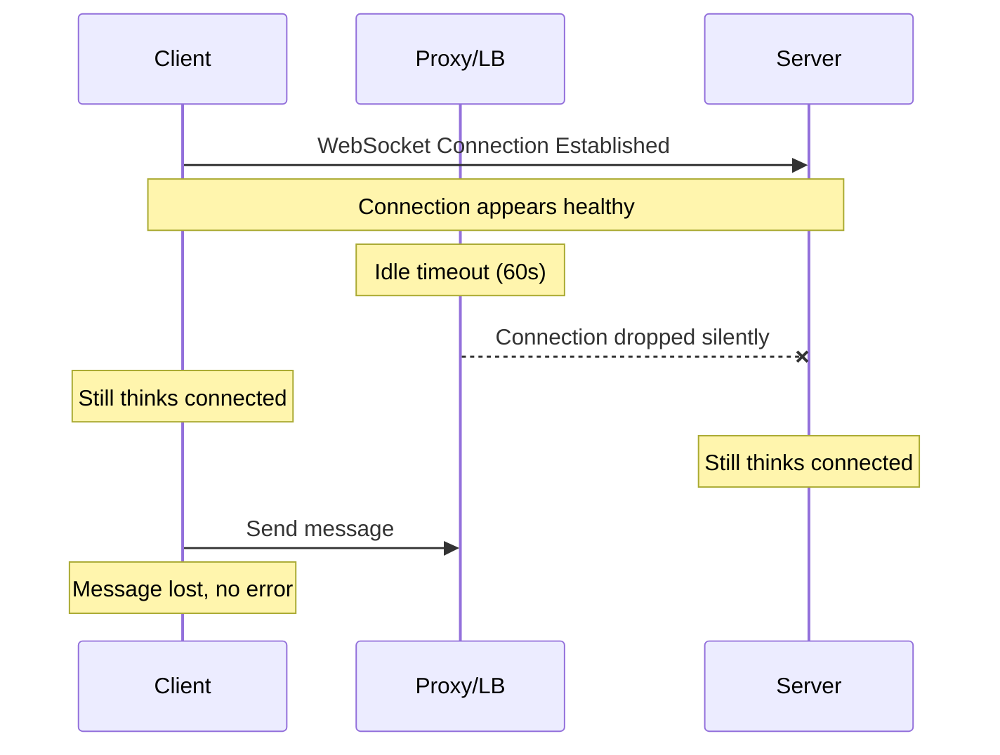
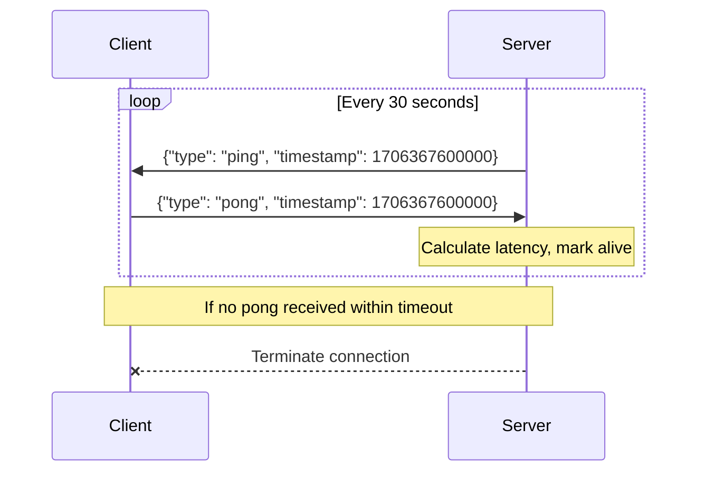
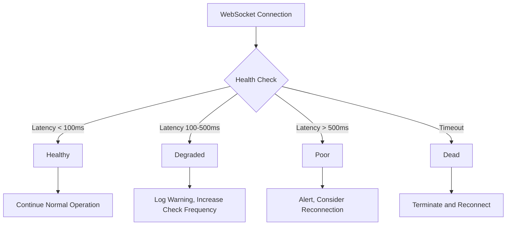

# How to Implement Heartbeat/Ping-Pong in WebSockets

Author: [nawazdhandala](https://github.com/nawazdhandala)

Tags: WebSocket, Heartbeat, Ping-Pong, Connection Health, Real-time, Node.js, DevOps

Description: Learn how to implement WebSocket heartbeat mechanisms using protocol-level ping/pong frames and application-level heartbeats to detect stale connections and maintain reliable real-time communication.

---

> The difference between a robust real-time system and a fragile one often comes down to how well you detect and handle dead connections. Heartbeats are your early warning system.

WebSocket connections are persistent, but they can silently die. Network switches, firewalls, NAT timeouts, and mobile network transitions can all sever a connection without either endpoint knowing. Heartbeat mechanisms solve this by regularly probing the connection health, enabling both server and client to detect dead connections and take corrective action.

## Understanding the Problem

WebSocket connections operate over TCP, which has its own keep-alive mechanism. However, TCP keep-alives are typically configured at the OS level with long intervals (often 2 hours), making them unsuitable for application-level connection health monitoring. Additionally, intermediary proxies and load balancers may timeout idle connections.



Without heartbeats, both the client and server may believe they are connected when the connection has actually been terminated by an intermediary.

## WebSocket Protocol Ping/Pong Frames

The WebSocket protocol (RFC 6455) defines control frames specifically for connection health monitoring. Ping frames (opcode 0x9) and Pong frames (opcode 0xA) are built into the protocol and handled at a lower level than application messages.

### Server-Side Implementation (Node.js with ws)

The `ws` library provides direct access to protocol-level ping/pong frames. The server sends periodic ping frames and expects pong responses within a timeout window.

```javascript
const WebSocket = require('ws');
const http = require('http');

// Create HTTP server for WebSocket upgrade
const server = http.createServer();
const wss = new WebSocket.Server({ server });

// Configuration for heartbeat
const HEARTBEAT_INTERVAL = 30000; // Send ping every 30 seconds
const HEARTBEAT_TIMEOUT = 10000;  // Wait 10 seconds for pong response

// Track connection state on each socket
wss.on('connection', (ws, request) => {
  // Mark connection as alive initially
  ws.isAlive = true;

  // Client IP for logging (handle proxy headers)
  const clientIP = request.headers['x-forwarded-for'] ||
                   request.socket.remoteAddress;
  console.log(`Client connected: ${clientIP}`);

  // Handle pong frames - client responded to our ping
  // This is called automatically when the client's WebSocket
  // implementation responds to our protocol-level ping
  ws.on('pong', () => {
    ws.isAlive = true; // Reset the alive flag
    ws.lastPong = Date.now();
    console.log(`Pong received from ${clientIP}`);
  });

  // Handle incoming messages
  ws.on('message', (message) => {
    // Any received data also proves the connection is alive
    ws.isAlive = true;
    console.log(`Message from ${clientIP}: ${message}`);
  });

  // Handle connection close
  ws.on('close', (code, reason) => {
    console.log(`Client ${clientIP} disconnected: ${code} - ${reason}`);
  });

  // Handle errors
  ws.on('error', (error) => {
    console.error(`WebSocket error for ${clientIP}:`, error.message);
  });
});

// Heartbeat interval - runs for all connected clients
const heartbeatInterval = setInterval(() => {
  wss.clients.forEach((ws) => {
    // Check if client responded to last ping
    if (ws.isAlive === false) {
      // Client did not respond to ping - terminate connection
      console.log('Terminating unresponsive connection');
      return ws.terminate(); // Forcefully close, no close handshake
    }

    // Mark as not alive until we receive pong
    ws.isAlive = false;

    // Send protocol-level ping frame
    // The ws library handles this at the protocol level
    ws.ping((err) => {
      if (err) {
        console.error('Error sending ping:', err.message);
      }
    });
  });
}, HEARTBEAT_INTERVAL);

// Clean up interval when server closes
wss.on('close', () => {
  clearInterval(heartbeatInterval);
});

server.listen(8080, () => {
  console.log('WebSocket server running on port 8080');
});
```

### Client-Side Handling of Protocol Pings

Browser WebSocket APIs automatically respond to protocol-level ping frames with pong frames. You do not need to write any code for this on the client side. However, Node.js clients using the `ws` library also handle this automatically.

```javascript
// Node.js client - pong is sent automatically
const WebSocket = require('ws');

const ws = new WebSocket('ws://localhost:8080');

ws.on('open', () => {
  console.log('Connected to server');
});

// The ws library automatically responds to ping frames with pong frames
// This callback is for informational purposes only
ws.on('ping', (data) => {
  console.log('Received ping from server');
  // Pong is sent automatically - no need to call ws.pong()
});

ws.on('close', (code, reason) => {
  console.log(`Disconnected: ${code} - ${reason}`);
});
```

## Application-Level Heartbeats

Protocol-level ping/pong frames have limitations. Browser JavaScript cannot send ping frames (only the browser's WebSocket implementation can respond to them). Some proxies strip or do not forward ping/pong frames. For full control, implement application-level heartbeats using regular WebSocket messages.



### Server Implementation with Application Heartbeats

This implementation sends JSON heartbeat messages and tracks round-trip latency.

```javascript
const WebSocket = require('ws');
const http = require('http');

const server = http.createServer();
const wss = new WebSocket.Server({ server });

// Heartbeat configuration
const HEARTBEAT_INTERVAL = 30000;
const HEARTBEAT_TIMEOUT = 10000;

// Store for pending heartbeats awaiting response
const pendingHeartbeats = new Map();

wss.on('connection', (ws, request) => {
  const clientId = generateClientId();
  ws.clientId = clientId;
  ws.isAlive = true;
  ws.latency = 0;

  console.log(`Client ${clientId} connected`);

  // Start heartbeat timer for this client
  ws.heartbeatTimer = setInterval(() => {
    sendHeartbeat(ws);
  }, HEARTBEAT_INTERVAL);

  ws.on('message', (data) => {
    try {
      const message = JSON.parse(data);

      // Handle heartbeat response
      if (message.type === 'pong') {
        handlePong(ws, message);
        return;
      }

      // Handle client-initiated ping (bidirectional heartbeat)
      if (message.type === 'ping') {
        ws.send(JSON.stringify({
          type: 'pong',
          timestamp: message.timestamp,
          serverTime: Date.now()
        }));
        return;
      }

      // Handle other application messages
      handleApplicationMessage(ws, message);
    } catch (error) {
      console.error('Error parsing message:', error.message);
    }
  });

  ws.on('close', () => {
    cleanup(ws);
  });

  ws.on('error', (error) => {
    console.error(`Error for client ${clientId}:`, error.message);
    cleanup(ws);
  });
});

// Send application-level heartbeat
function sendHeartbeat(ws) {
  if (ws.readyState !== WebSocket.OPEN) {
    return;
  }

  const heartbeatId = Date.now().toString();
  const heartbeat = {
    type: 'ping',
    id: heartbeatId,
    timestamp: Date.now()
  };

  // Store pending heartbeat with timeout
  const timeoutId = setTimeout(() => {
    // No response received within timeout
    if (pendingHeartbeats.has(heartbeatId)) {
      pendingHeartbeats.delete(heartbeatId);
      console.log(`Heartbeat timeout for client ${ws.clientId}`);
      ws.isAlive = false;
      ws.terminate();
    }
  }, HEARTBEAT_TIMEOUT);

  pendingHeartbeats.set(heartbeatId, {
    ws,
    timestamp: Date.now(),
    timeoutId
  });

  ws.send(JSON.stringify(heartbeat));
}

// Handle pong response from client
function handlePong(ws, message) {
  const pending = pendingHeartbeats.get(message.id);

  if (pending) {
    // Clear timeout
    clearTimeout(pending.timeoutId);
    pendingHeartbeats.delete(message.id);

    // Calculate round-trip latency
    ws.latency = Date.now() - pending.timestamp;
    ws.isAlive = true;

    console.log(`Client ${ws.clientId} latency: ${ws.latency}ms`);
  }
}

// Handle application messages
function handleApplicationMessage(ws, message) {
  // Any message from client also proves liveness
  ws.isAlive = true;
  console.log(`Message from ${ws.clientId}:`, message);
}

// Cleanup on disconnect
function cleanup(ws) {
  if (ws.heartbeatTimer) {
    clearInterval(ws.heartbeatTimer);
  }

  // Clear any pending heartbeats for this client
  for (const [id, pending] of pendingHeartbeats) {
    if (pending.ws === ws) {
      clearTimeout(pending.timeoutId);
      pendingHeartbeats.delete(id);
    }
  }

  console.log(`Client ${ws.clientId} cleaned up`);
}

// Generate unique client identifier
function generateClientId() {
  return Math.random().toString(36).substring(2, 15);
}

server.listen(8080);
```

### Browser Client with Bidirectional Heartbeats

This client implementation handles server heartbeats and can optionally send its own heartbeats to detect server-side failures.

```javascript
class WebSocketClient {
  constructor(url, options = {}) {
    this.url = url;
    this.options = {
      heartbeatInterval: options.heartbeatInterval || 30000,
      heartbeatTimeout: options.heartbeatTimeout || 10000,
      reconnectInterval: options.reconnectInterval || 5000,
      maxReconnectAttempts: options.maxReconnectAttempts || 10,
      ...options
    };

    this.ws = null;
    this.heartbeatTimer = null;
    this.heartbeatTimeoutTimer = null;
    this.reconnectAttempts = 0;
    this.isIntentionallyClosed = false;
    this.pendingPings = new Map();

    this.connect();
  }

  connect() {
    // Reset intentional close flag
    this.isIntentionallyClosed = false;

    console.log(`Connecting to ${this.url}...`);
    this.ws = new WebSocket(this.url);

    this.ws.onopen = () => {
      console.log('WebSocket connected');
      this.reconnectAttempts = 0;
      this.startHeartbeat();
      this.onConnect();
    };

    this.ws.onmessage = (event) => {
      try {
        const message = JSON.parse(event.data);
        this.handleMessage(message);
      } catch (error) {
        console.error('Error parsing message:', error);
      }
    };

    this.ws.onclose = (event) => {
      console.log(`WebSocket closed: ${event.code} - ${event.reason}`);
      this.stopHeartbeat();
      this.onDisconnect(event);

      // Attempt reconnection if not intentionally closed
      if (!this.isIntentionallyClosed) {
        this.attemptReconnect();
      }
    };

    this.ws.onerror = (error) => {
      console.error('WebSocket error:', error);
      this.onError(error);
    };
  }

  handleMessage(message) {
    // Handle server heartbeat ping
    if (message.type === 'ping') {
      // Respond immediately with pong
      this.send({
        type: 'pong',
        id: message.id,
        timestamp: message.timestamp,
        clientTime: Date.now()
      });
      // Reset heartbeat timeout since we received data
      this.resetHeartbeatTimeout();
      return;
    }

    // Handle server response to our ping
    if (message.type === 'pong') {
      const pending = this.pendingPings.get(message.timestamp);
      if (pending) {
        clearTimeout(pending.timeoutId);
        this.pendingPings.delete(message.timestamp);
        const latency = Date.now() - message.timestamp;
        console.log(`Round-trip latency: ${latency}ms`);
      }
      this.resetHeartbeatTimeout();
      return;
    }

    // Reset timeout on any received message
    this.resetHeartbeatTimeout();

    // Forward to application handler
    this.onMessage(message);
  }

  startHeartbeat() {
    // Clear any existing timers
    this.stopHeartbeat();

    // Send periodic client heartbeats
    this.heartbeatTimer = setInterval(() => {
      this.sendPing();
    }, this.options.heartbeatInterval);

    // Set initial timeout
    this.resetHeartbeatTimeout();
  }

  stopHeartbeat() {
    if (this.heartbeatTimer) {
      clearInterval(this.heartbeatTimer);
      this.heartbeatTimer = null;
    }
    if (this.heartbeatTimeoutTimer) {
      clearTimeout(this.heartbeatTimeoutTimer);
      this.heartbeatTimeoutTimer = null;
    }
    // Clear pending pings
    for (const pending of this.pendingPings.values()) {
      clearTimeout(pending.timeoutId);
    }
    this.pendingPings.clear();
  }

  resetHeartbeatTimeout() {
    // Clear existing timeout
    if (this.heartbeatTimeoutTimer) {
      clearTimeout(this.heartbeatTimeoutTimer);
    }

    // Set new timeout - if no data received, assume connection is dead
    this.heartbeatTimeoutTimer = setTimeout(() => {
      console.log('Heartbeat timeout - connection appears dead');
      this.ws.close(4000, 'Heartbeat timeout');
    }, this.options.heartbeatInterval + this.options.heartbeatTimeout);
  }

  sendPing() {
    if (this.ws.readyState !== WebSocket.OPEN) {
      return;
    }

    const timestamp = Date.now();
    const ping = {
      type: 'ping',
      timestamp
    };

    // Track pending ping with timeout
    const timeoutId = setTimeout(() => {
      if (this.pendingPings.has(timestamp)) {
        this.pendingPings.delete(timestamp);
        console.log('Ping timeout - no pong received');
      }
    }, this.options.heartbeatTimeout);

    this.pendingPings.set(timestamp, { timeoutId });
    this.send(ping);
  }

  send(data) {
    if (this.ws && this.ws.readyState === WebSocket.OPEN) {
      this.ws.send(JSON.stringify(data));
    } else {
      console.warn('Cannot send - WebSocket not open');
    }
  }

  attemptReconnect() {
    if (this.reconnectAttempts >= this.options.maxReconnectAttempts) {
      console.log('Max reconnection attempts reached');
      this.onMaxReconnectAttempts();
      return;
    }

    this.reconnectAttempts++;
    const delay = this.options.reconnectInterval * Math.min(this.reconnectAttempts, 5);

    console.log(`Reconnecting in ${delay}ms (attempt ${this.reconnectAttempts})`);

    setTimeout(() => {
      this.connect();
    }, delay);
  }

  close() {
    this.isIntentionallyClosed = true;
    this.stopHeartbeat();
    if (this.ws) {
      this.ws.close(1000, 'Client closed');
    }
  }

  // Override these methods in your application
  onConnect() {}
  onDisconnect(event) {}
  onMessage(message) {}
  onError(error) {}
  onMaxReconnectAttempts() {}
}

// Usage example
const client = new WebSocketClient('ws://localhost:8080', {
  heartbeatInterval: 30000,
  heartbeatTimeout: 10000
});

client.onConnect = () => {
  console.log('Connected! Ready to send messages.');
  client.send({ type: 'subscribe', channel: 'updates' });
};

client.onMessage = (message) => {
  console.log('Received:', message);
};

client.onDisconnect = (event) => {
  console.log('Disconnected - will attempt to reconnect');
};
```

## Connection Health Monitoring

Beyond simple alive/dead detection, you can track connection quality metrics to identify degraded connections before they fail.



### Connection Health Monitor Implementation

```javascript
class ConnectionHealthMonitor {
  constructor(options = {}) {
    // Latency thresholds in milliseconds
    this.thresholds = {
      healthy: options.healthyLatency || 100,
      degraded: options.degradedLatency || 500,
      poor: options.poorLatency || 1000
    };

    // Sample configuration
    this.maxSamples = options.maxSamples || 10;
    this.latencySamples = [];

    // Health state
    this.currentStatus = 'unknown';
    this.consecutiveTimeouts = 0;
    this.lastResponseTime = null;

    // Callbacks
    this.onStatusChange = options.onStatusChange || (() => {});
    this.onDead = options.onDead || (() => {});
  }

  // Record a successful ping/pong round-trip
  recordLatency(latencyMs) {
    this.latencySamples.push(latencyMs);

    // Keep only recent samples
    if (this.latencySamples.length > this.maxSamples) {
      this.latencySamples.shift();
    }

    this.lastResponseTime = Date.now();
    this.consecutiveTimeouts = 0;

    this.updateStatus();
  }

  // Record a timeout (no response received)
  recordTimeout() {
    this.consecutiveTimeouts++;

    // Three consecutive timeouts = dead connection
    if (this.consecutiveTimeouts >= 3) {
      this.setStatus('dead');
      this.onDead();
    } else {
      this.setStatus('timeout');
    }
  }

  // Calculate average latency from samples
  getAverageLatency() {
    if (this.latencySamples.length === 0) {
      return null;
    }
    const sum = this.latencySamples.reduce((a, b) => a + b, 0);
    return Math.round(sum / this.latencySamples.length);
  }

  // Calculate jitter (latency variance)
  getJitter() {
    if (this.latencySamples.length < 2) {
      return 0;
    }

    const avg = this.getAverageLatency();
    const squaredDiffs = this.latencySamples.map(l => Math.pow(l - avg, 2));
    const avgSquaredDiff = squaredDiffs.reduce((a, b) => a + b, 0) / squaredDiffs.length;
    return Math.round(Math.sqrt(avgSquaredDiff));
  }

  // Update connection status based on metrics
  updateStatus() {
    const avgLatency = this.getAverageLatency();

    if (avgLatency === null) {
      return;
    }

    let newStatus;
    if (avgLatency <= this.thresholds.healthy) {
      newStatus = 'healthy';
    } else if (avgLatency <= this.thresholds.degraded) {
      newStatus = 'degraded';
    } else if (avgLatency <= this.thresholds.poor) {
      newStatus = 'poor';
    } else {
      newStatus = 'critical';
    }

    this.setStatus(newStatus);
  }

  // Set status and trigger callback if changed
  setStatus(status) {
    if (status !== this.currentStatus) {
      const previousStatus = this.currentStatus;
      this.currentStatus = status;
      this.onStatusChange(status, previousStatus, this.getMetrics());
    }
  }

  // Get all health metrics
  getMetrics() {
    return {
      status: this.currentStatus,
      averageLatency: this.getAverageLatency(),
      jitter: this.getJitter(),
      samples: this.latencySamples.length,
      consecutiveTimeouts: this.consecutiveTimeouts,
      lastResponseTime: this.lastResponseTime
    };
  }

  // Reset all metrics
  reset() {
    this.latencySamples = [];
    this.currentStatus = 'unknown';
    this.consecutiveTimeouts = 0;
    this.lastResponseTime = null;
  }
}

// Integration with WebSocket server
const healthMonitors = new Map();

wss.on('connection', (ws) => {
  const monitor = new ConnectionHealthMonitor({
    onStatusChange: (status, previous, metrics) => {
      console.log(`Client ${ws.clientId} health: ${previous} -> ${status}`, metrics);

      // Notify client of their connection quality
      if (ws.readyState === WebSocket.OPEN) {
        ws.send(JSON.stringify({
          type: 'health_status',
          status,
          latency: metrics.averageLatency,
          jitter: metrics.jitter
        }));
      }
    },
    onDead: () => {
      console.log(`Client ${ws.clientId} connection is dead`);
      ws.terminate();
    }
  });

  healthMonitors.set(ws, monitor);

  ws.on('close', () => {
    healthMonitors.delete(ws);
  });
});

// Update monitor when pong received
function handlePong(ws, message) {
  const latency = Date.now() - message.timestamp;
  const monitor = healthMonitors.get(ws);
  if (monitor) {
    monitor.recordLatency(latency);
  }
}
```

## Python Server Implementation

For Python applications using the `websockets` library.

```python
import asyncio
import json
import logging
from datetime import datetime
from typing import Dict, Set
import websockets
from websockets import WebSocketServerProtocol

logging.basicConfig(level=logging.INFO)
logger = logging.getLogger(__name__)

# Configuration
HEARTBEAT_INTERVAL = 30  # seconds
HEARTBEAT_TIMEOUT = 10   # seconds

# Track connected clients
clients: Set[WebSocketServerProtocol] = set()
client_metadata: Dict[WebSocketServerProtocol, dict] = {}


async def send_heartbeat(websocket: WebSocketServerProtocol):
    """Send application-level heartbeat to a client."""
    try:
        ping_message = {
            "type": "ping",
            "timestamp": int(datetime.now().timestamp() * 1000),
            "server_time": datetime.now().isoformat()
        }
        await websocket.send(json.dumps(ping_message))
        logger.debug(f"Sent ping to {websocket.remote_address}")
    except websockets.exceptions.ConnectionClosed:
        logger.info(f"Connection closed while sending ping")


async def heartbeat_loop(websocket: WebSocketServerProtocol):
    """
    Continuously send heartbeats to a client.
    Uses protocol-level ping as primary mechanism,
    with application-level ping as backup.
    """
    while True:
        try:
            await asyncio.sleep(HEARTBEAT_INTERVAL)

            # Use protocol-level ping (preferred)
            # websockets library handles this automatically with ping_interval
            # but we can also send application-level heartbeat
            await send_heartbeat(websocket)

        except asyncio.CancelledError:
            break
        except Exception as e:
            logger.error(f"Heartbeat error: {e}")
            break


async def handle_message(websocket: WebSocketServerProtocol, message: str):
    """Process incoming messages."""
    try:
        data = json.loads(message)
        msg_type = data.get("type")

        # Handle pong response
        if msg_type == "pong":
            timestamp = data.get("timestamp", 0)
            latency = int(datetime.now().timestamp() * 1000) - timestamp
            metadata = client_metadata.get(websocket, {})
            metadata["latency"] = latency
            metadata["last_pong"] = datetime.now()
            client_metadata[websocket] = metadata
            logger.info(f"Pong from {websocket.remote_address}, latency: {latency}ms")
            return

        # Handle client-initiated ping
        if msg_type == "ping":
            pong_response = {
                "type": "pong",
                "timestamp": data.get("timestamp"),
                "server_time": int(datetime.now().timestamp() * 1000)
            }
            await websocket.send(json.dumps(pong_response))
            return

        # Handle other application messages
        logger.info(f"Received message: {data}")

        # Echo back for demonstration
        await websocket.send(json.dumps({
            "type": "echo",
            "data": data,
            "timestamp": int(datetime.now().timestamp() * 1000)
        }))

    except json.JSONDecodeError:
        logger.error(f"Invalid JSON received: {message}")


async def client_handler(websocket: WebSocketServerProtocol):
    """Handle a WebSocket client connection."""
    # Register client
    clients.add(websocket)
    client_metadata[websocket] = {
        "connected_at": datetime.now(),
        "latency": None,
        "last_pong": None
    }

    logger.info(f"Client connected: {websocket.remote_address}")
    logger.info(f"Total clients: {len(clients)}")

    # Start heartbeat task
    heartbeat_task = asyncio.create_task(heartbeat_loop(websocket))

    try:
        async for message in websocket:
            await handle_message(websocket, message)
    except websockets.exceptions.ConnectionClosed as e:
        logger.info(f"Connection closed: {e.code} - {e.reason}")
    finally:
        # Cleanup
        heartbeat_task.cancel()
        clients.discard(websocket)
        client_metadata.pop(websocket, None)
        logger.info(f"Client disconnected: {websocket.remote_address}")
        logger.info(f"Total clients: {len(clients)}")


async def main():
    """Start the WebSocket server."""
    # Configure server with protocol-level ping
    async with websockets.serve(
        client_handler,
        "0.0.0.0",
        8080,
        ping_interval=HEARTBEAT_INTERVAL,  # Protocol-level ping interval
        ping_timeout=HEARTBEAT_TIMEOUT,    # Time to wait for pong
    ):
        logger.info("WebSocket server started on ws://0.0.0.0:8080")
        await asyncio.Future()  # Run forever


if __name__ == "__main__":
    asyncio.run(main())
```

## Go Server Implementation

For Go applications using the `gorilla/websocket` package.

```go
package main

import (
    "encoding/json"
    "log"
    "net/http"
    "sync"
    "time"

    "github.com/gorilla/websocket"
)

const (
    // Time allowed to write a message to the peer
    writeWait = 10 * time.Second

    // Time allowed to read the next pong message from the peer
    pongWait = 60 * time.Second

    // Send pings to peer with this period (must be less than pongWait)
    pingPeriod = (pongWait * 9) / 10

    // Maximum message size allowed from peer
    maxMessageSize = 512
)

// Message represents a WebSocket message
type Message struct {
    Type      string `json:"type"`
    Timestamp int64  `json:"timestamp,omitempty"`
    Data      any    `json:"data,omitempty"`
}

// Client represents a WebSocket client connection
type Client struct {
    conn     *websocket.Conn
    send     chan []byte
    hub      *Hub
    latency  int64
    mu       sync.Mutex
}

// Hub maintains the set of active clients
type Hub struct {
    clients    map[*Client]bool
    register   chan *Client
    unregister chan *Client
    mu         sync.RWMutex
}

func newHub() *Hub {
    return &Hub{
        clients:    make(map[*Client]bool),
        register:   make(chan *Client),
        unregister: make(chan *Client),
    }
}

func (h *Hub) run() {
    for {
        select {
        case client := <-h.register:
            h.mu.Lock()
            h.clients[client] = true
            h.mu.Unlock()
            log.Printf("Client connected. Total: %d", len(h.clients))

        case client := <-h.unregister:
            h.mu.Lock()
            if _, ok := h.clients[client]; ok {
                delete(h.clients, client)
                close(client.send)
            }
            h.mu.Unlock()
            log.Printf("Client disconnected. Total: %d", len(h.clients))
        }
    }
}

// readPump pumps messages from the WebSocket connection to the hub
func (c *Client) readPump() {
    defer func() {
        c.hub.unregister <- c
        c.conn.Close()
    }()

    c.conn.SetReadLimit(maxMessageSize)
    c.conn.SetReadDeadline(time.Now().Add(pongWait))

    // Handle protocol-level pong frames
    c.conn.SetPongHandler(func(appData string) error {
        // Reset read deadline on pong received
        c.conn.SetReadDeadline(time.Now().Add(pongWait))
        log.Printf("Pong received from client")
        return nil
    })

    for {
        _, message, err := c.conn.ReadMessage()
        if err != nil {
            if websocket.IsUnexpectedCloseError(err,
                websocket.CloseGoingAway,
                websocket.CloseAbnormalClosure) {
                log.Printf("Unexpected close error: %v", err)
            }
            break
        }

        // Parse and handle message
        var msg Message
        if err := json.Unmarshal(message, &msg); err != nil {
            log.Printf("Error parsing message: %v", err)
            continue
        }

        // Handle application-level pong
        if msg.Type == "pong" {
            c.mu.Lock()
            c.latency = time.Now().UnixMilli() - msg.Timestamp
            c.mu.Unlock()
            log.Printf("Application pong received, latency: %dms", c.latency)
            continue
        }

        // Handle application-level ping
        if msg.Type == "ping" {
            response := Message{
                Type:      "pong",
                Timestamp: msg.Timestamp,
            }
            responseJSON, _ := json.Marshal(response)
            c.send <- responseJSON
            continue
        }

        // Handle other messages
        log.Printf("Received message: %+v", msg)
    }
}

// writePump pumps messages from the hub to the WebSocket connection
func (c *Client) writePump() {
    // Ticker for sending protocol-level pings
    ticker := time.NewTicker(pingPeriod)
    defer func() {
        ticker.Stop()
        c.conn.Close()
    }()

    for {
        select {
        case message, ok := <-c.send:
            c.conn.SetWriteDeadline(time.Now().Add(writeWait))
            if !ok {
                // Hub closed the channel
                c.conn.WriteMessage(websocket.CloseMessage, []byte{})
                return
            }

            // Write message to WebSocket
            if err := c.conn.WriteMessage(websocket.TextMessage, message); err != nil {
                return
            }

        case <-ticker.C:
            // Send protocol-level ping
            c.conn.SetWriteDeadline(time.Now().Add(writeWait))
            if err := c.conn.WriteMessage(websocket.PingMessage, nil); err != nil {
                return
            }
            log.Printf("Protocol ping sent")

            // Also send application-level ping
            appPing := Message{
                Type:      "ping",
                Timestamp: time.Now().UnixMilli(),
            }
            pingJSON, _ := json.Marshal(appPing)
            if err := c.conn.WriteMessage(websocket.TextMessage, pingJSON); err != nil {
                return
            }
        }
    }
}

var upgrader = websocket.Upgrader{
    ReadBufferSize:  1024,
    WriteBufferSize: 1024,
    CheckOrigin: func(r *http.Request) bool {
        return true // Allow all origins for demo
    },
}

func serveWs(hub *Hub, w http.ResponseWriter, r *http.Request) {
    conn, err := upgrader.Upgrade(w, r, nil)
    if err != nil {
        log.Printf("Upgrade error: %v", err)
        return
    }

    client := &Client{
        hub:  hub,
        conn: conn,
        send: make(chan []byte, 256),
    }
    client.hub.register <- client

    // Start read and write pumps in separate goroutines
    go client.writePump()
    go client.readPump()
}

func main() {
    hub := newHub()
    go hub.run()

    http.HandleFunc("/ws", func(w http.ResponseWriter, r *http.Request) {
        serveWs(hub, w, r)
    })

    log.Println("WebSocket server starting on :8080")
    if err := http.ListenAndServe(":8080", nil); err != nil {
        log.Fatal("ListenAndServe: ", err)
    }
}
```

## Handling Edge Cases

### Mobile Network Transitions

Mobile devices frequently switch between WiFi and cellular networks. These transitions often break WebSocket connections silently.

```javascript
// Client-side: Detect network changes
class NetworkAwareWebSocket extends WebSocketClient {
  constructor(url, options) {
    super(url, options);
    this.setupNetworkListeners();
  }

  setupNetworkListeners() {
    // Listen for online/offline events
    window.addEventListener('online', () => {
      console.log('Network came online');
      // Proactively check connection health
      this.sendPing();
    });

    window.addEventListener('offline', () => {
      console.log('Network went offline');
      // Mark connection as potentially dead
      // Will reconnect when online event fires
    });

    // Listen for network type changes (mobile only)
    if ('connection' in navigator) {
      navigator.connection.addEventListener('change', () => {
        console.log('Network type changed:', navigator.connection.effectiveType);
        // Network switch may have broken connection
        this.sendPing();
      });
    }

    // Page visibility changes
    document.addEventListener('visibilitychange', () => {
      if (document.visibilityState === 'visible') {
        console.log('Page became visible, checking connection');
        this.sendPing();
      }
    });
  }
}
```

### Proxy and Load Balancer Timeouts

Configure heartbeat intervals shorter than your infrastructure's idle timeouts.

```javascript
// Server configuration for common timeout scenarios
const COMMON_TIMEOUTS = {
  // AWS ALB default: 60 seconds
  awsAlb: 55000,
  // NGINX default: 60 seconds
  nginx: 55000,
  // Cloudflare: 100 seconds
  cloudflare: 90000,
  // Azure Application Gateway: 60 seconds
  azureAppGateway: 55000,
  // Conservative default
  default: 30000
};

// Choose interval based on your infrastructure
const HEARTBEAT_INTERVAL = COMMON_TIMEOUTS.default;
```

## Best Practices Summary

| Practice | Recommendation |
|----------|----------------|
| **Heartbeat Interval** | 25-55 seconds, shorter than proxy timeouts |
| **Timeout Detection** | 2-3 missed heartbeats before declaring dead |
| **Protocol vs Application** | Use both for maximum compatibility |
| **Latency Tracking** | Track rolling average, not just last sample |
| **Jitter Monitoring** | High jitter indicates network instability |
| **Reconnection** | Exponential backoff with max delay cap |
| **Mobile Networks** | Proactively check on network change events |
| **Page Visibility** | Check connection when page becomes visible |
| **Graceful Degradation** | Warn users of poor connections before failure |
| **Logging** | Log connection state changes for debugging |

## Summary

WebSocket heartbeats are essential for maintaining reliable real-time connections. Protocol-level ping/pong frames provide basic keep-alive functionality, while application-level heartbeats offer more control and visibility into connection health. By implementing proper heartbeat mechanisms with timeout detection, latency monitoring, and intelligent reconnection logic, you can build resilient real-time applications that gracefully handle network instability.

For production WebSocket applications, consider using [OneUptime](https://oneuptime.com) to monitor your WebSocket server health, track connection metrics, and receive alerts when connection quality degrades.
