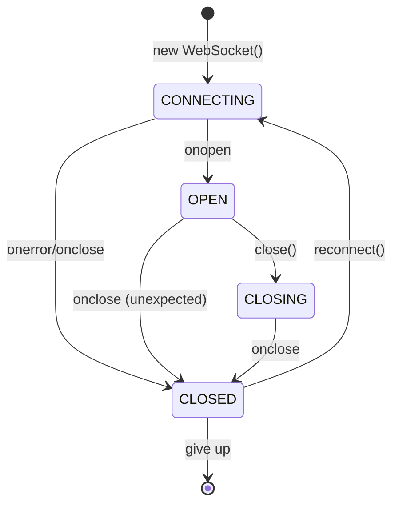
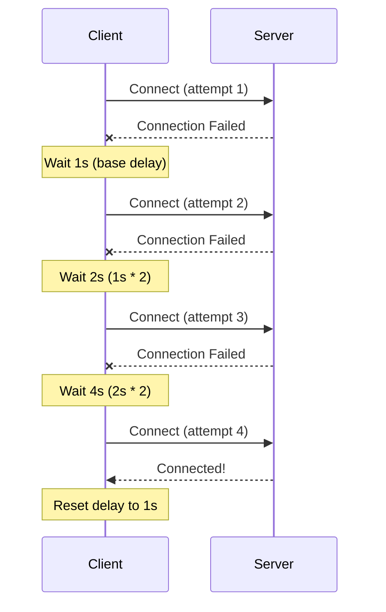
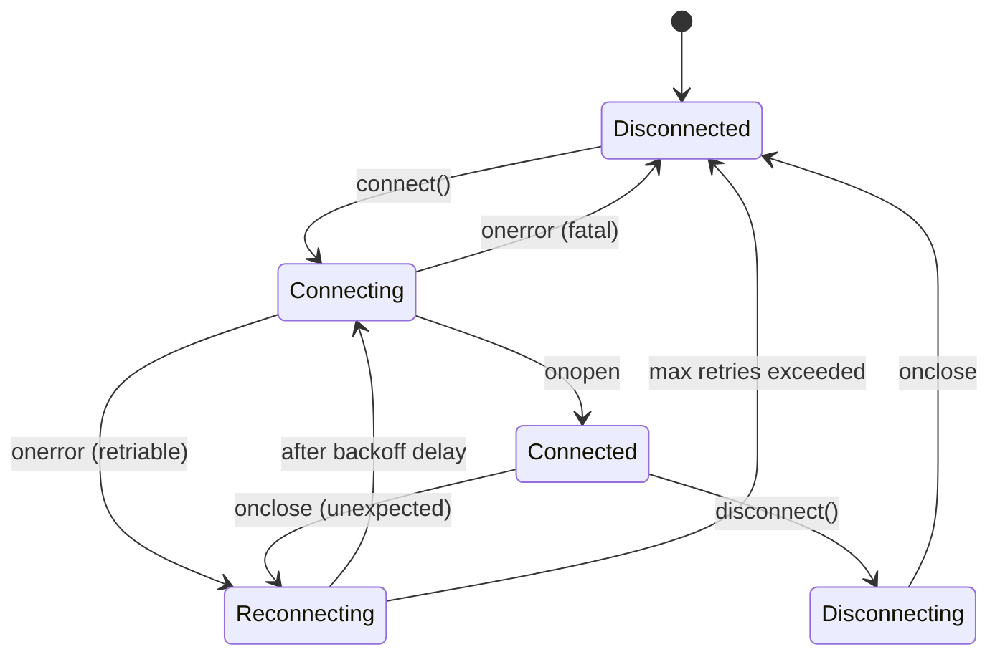
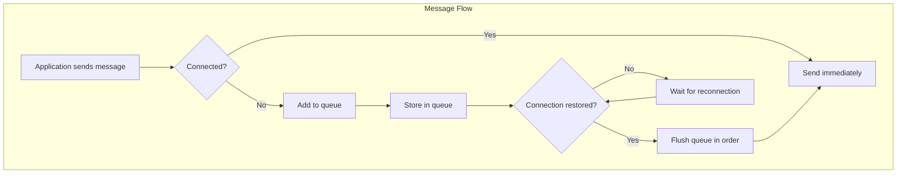
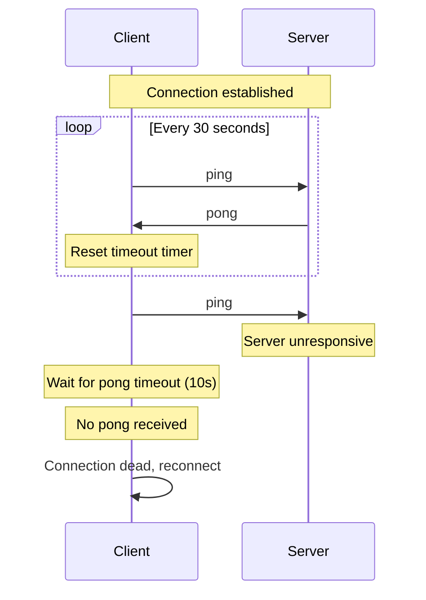

# How to Implement Reconnection Logic for WebSockets

Author: [nawazdhandala](https://www.github.com/nawazdhandala)

Tags: WebSocket, JavaScript, TypeScript, Real-Time, Networking, Reliability, DevOps

Description: Learn how to implement robust WebSocket reconnection logic with exponential backoff, connection state management, message queuing, and heartbeat mechanisms for reliable real-time applications.

---

> "The measure of a robust system is not whether it fails, but how gracefully it recovers." - Werner Vogels

WebSocket connections are inherently fragile. Network interruptions, server restarts, load balancer timeouts, and mobile network switches can all terminate your connection without warning. A production-grade WebSocket implementation must handle these failures gracefully, maintaining data integrity and providing a seamless user experience. This guide covers battle-tested patterns for building resilient WebSocket clients.

## Understanding WebSocket Connection Lifecycle

Before implementing reconnection logic, it is essential to understand the WebSocket connection states and events.



The WebSocket API provides four key events:

```javascript
// WebSocket readyState values:
// 0 = CONNECTING - Connection is being established
// 1 = OPEN       - Connection is established and communication is possible
// 2 = CLOSING    - Connection is going through closing handshake
// 3 = CLOSED     - Connection is closed or could not be opened

const ws = new WebSocket('wss://api.example.com/ws');

// Fired when connection is successfully established
ws.onopen = (event) => {
  console.log('Connected to server');
};

// Fired when a message is received from the server
ws.onmessage = (event) => {
  const data = JSON.parse(event.data);
  console.log('Received:', data);
};

// Fired when an error occurs - always followed by onclose
ws.onerror = (event) => {
  console.error('WebSocket error occurred');
};

// Fired when connection is closed (cleanly or due to error)
ws.onclose = (event) => {
  // event.code: numeric close code (1000 = normal, 1006 = abnormal)
  // event.reason: string explaining why connection was closed
  // event.wasClean: boolean indicating if close was clean
  console.log(`Connection closed: ${event.code} - ${event.reason}`);
};
```

## Exponential Backoff Strategy

When a connection fails, immediately retrying can overwhelm the server and waste resources. Exponential backoff increases the delay between retry attempts, giving the server time to recover while being kind to network resources.



Here is a robust implementation with jitter to prevent thundering herd:

```typescript
// Configuration for exponential backoff
interface BackoffConfig {
  baseDelay: number;      // Initial delay in milliseconds (e.g., 1000ms)
  maxDelay: number;       // Maximum delay cap (e.g., 30000ms)
  multiplier: number;     // Factor to multiply delay by (e.g., 2)
  jitterFactor: number;   // Random jitter to add (0-1, e.g., 0.1 for 10%)
}

class ExponentialBackoff {
  private attempt: number = 0;
  private readonly config: BackoffConfig;

  constructor(config: Partial<BackoffConfig> = {}) {
    // Set sensible defaults for reconnection scenarios
    this.config = {
      baseDelay: config.baseDelay ?? 1000,      // Start with 1 second
      maxDelay: config.maxDelay ?? 30000,       // Cap at 30 seconds
      multiplier: config.multiplier ?? 2,        // Double each time
      jitterFactor: config.jitterFactor ?? 0.1,  // Add up to 10% random jitter
    };
  }

  // Calculate the next delay with exponential growth and jitter
  getNextDelay(): number {
    // Calculate base exponential delay: baseDelay * multiplier^attempt
    const exponentialDelay = this.config.baseDelay *
      Math.pow(this.config.multiplier, this.attempt);

    // Cap at maximum delay to prevent excessively long waits
    const cappedDelay = Math.min(exponentialDelay, this.config.maxDelay);

    // Add random jitter to prevent thundering herd problem
    // When many clients reconnect simultaneously after an outage,
    // jitter spreads them out to avoid overwhelming the server
    const jitter = cappedDelay * this.config.jitterFactor * Math.random();

    // Increment attempt counter for next calculation
    this.attempt++;

    return Math.floor(cappedDelay + jitter);
  }

  // Reset after successful connection
  reset(): void {
    this.attempt = 0;
  }

  // Get current attempt number (useful for logging/metrics)
  getAttemptCount(): number {
    return this.attempt;
  }
}

// Example usage showing delay progression:
// Attempt 0: ~1000ms  (1s)
// Attempt 1: ~2000ms  (2s)
// Attempt 2: ~4000ms  (4s)
// Attempt 3: ~8000ms  (8s)
// Attempt 4: ~16000ms (16s)
// Attempt 5: ~30000ms (30s, capped)
// Attempt 6+: ~30000ms (stays at cap)
```

## Connection State Management

A well-designed state machine prevents race conditions and provides clear visibility into connection status. This is crucial for UI updates and debugging.



```typescript
// Define all possible connection states
enum ConnectionState {
  DISCONNECTED = 'disconnected',   // Not connected, not trying to connect
  CONNECTING = 'connecting',       // Actively attempting to connect
  CONNECTED = 'connected',         // Connection established and healthy
  RECONNECTING = 'reconnecting',   // Connection lost, waiting to retry
  DISCONNECTING = 'disconnecting', // Gracefully closing connection
}

// Events emitted by the connection manager
type ConnectionEvent =
  | 'stateChange'      // Connection state changed
  | 'message'          // Message received from server
  | 'error'            // Error occurred
  | 'reconnectAttempt' // About to attempt reconnection
  | 'reconnectFailed'; // All reconnection attempts exhausted

// Type-safe event listener signatures
interface ConnectionEventMap {
  stateChange: (state: ConnectionState, previousState: ConnectionState) => void;
  message: (data: unknown) => void;
  error: (error: Error) => void;
  reconnectAttempt: (attempt: number, delay: number) => void;
  reconnectFailed: () => void;
}

class ConnectionStateManager {
  private state: ConnectionState = ConnectionState.DISCONNECTED;
  private listeners: Map<string, Set<Function>> = new Map();

  // Get current state (readonly to prevent external modification)
  getState(): ConnectionState {
    return this.state;
  }

  // Check if currently connected or in a connecting state
  isConnectedOrConnecting(): boolean {
    return this.state === ConnectionState.CONNECTED ||
           this.state === ConnectionState.CONNECTING;
  }

  // Transition to a new state with validation
  setState(newState: ConnectionState): void {
    // Prevent redundant state changes
    if (this.state === newState) return;

    // Validate state transition is allowed
    if (!this.isValidTransition(this.state, newState)) {
      console.warn(`Invalid state transition: ${this.state} -> ${newState}`);
      return;
    }

    const previousState = this.state;
    this.state = newState;

    // Notify listeners of state change
    this.emit('stateChange', newState, previousState);
  }

  // Define valid state transitions to prevent illegal states
  private isValidTransition(from: ConnectionState, to: ConnectionState): boolean {
    const validTransitions: Record<ConnectionState, ConnectionState[]> = {
      [ConnectionState.DISCONNECTED]: [
        ConnectionState.CONNECTING,
      ],
      [ConnectionState.CONNECTING]: [
        ConnectionState.CONNECTED,
        ConnectionState.RECONNECTING,
        ConnectionState.DISCONNECTED,
      ],
      [ConnectionState.CONNECTED]: [
        ConnectionState.RECONNECTING,
        ConnectionState.DISCONNECTING,
      ],
      [ConnectionState.RECONNECTING]: [
        ConnectionState.CONNECTING,
        ConnectionState.DISCONNECTED,
      ],
      [ConnectionState.DISCONNECTING]: [
        ConnectionState.DISCONNECTED,
      ],
    };

    return validTransitions[from]?.includes(to) ?? false;
  }

  // Type-safe event subscription
  on<K extends keyof ConnectionEventMap>(
    event: K,
    listener: ConnectionEventMap[K]
  ): () => void {
    if (!this.listeners.has(event)) {
      this.listeners.set(event, new Set());
    }
    this.listeners.get(event)!.add(listener);

    // Return unsubscribe function for cleanup
    return () => this.listeners.get(event)?.delete(listener);
  }

  // Emit events to all registered listeners
  emit<K extends keyof ConnectionEventMap>(
    event: K,
    ...args: Parameters<ConnectionEventMap[K]>
  ): void {
    this.listeners.get(event)?.forEach(listener => {
      try {
        (listener as Function)(...args);
      } catch (error) {
        console.error(`Error in ${event} listener:`, error);
      }
    });
  }
}
```

## Message Queue During Reconnection

When the connection drops, you do not want to lose messages. A message queue buffers outgoing messages during disconnection and automatically sends them when the connection is restored.



```typescript
// Represents a message waiting to be sent
interface QueuedMessage {
  id: string;              // Unique ID for deduplication and tracking
  data: unknown;           // The actual message payload
  timestamp: number;       // When the message was queued
  attempts: number;        // How many times we've tried to send it
  maxAttempts: number;     // Maximum send attempts before discarding
  onSuccess?: () => void;  // Callback when message is sent
  onFailure?: (error: Error) => void; // Callback if message fails
}

interface MessageQueueConfig {
  maxQueueSize: number;    // Maximum messages to buffer (prevent memory issues)
  maxMessageAge: number;   // Discard messages older than this (milliseconds)
  maxAttempts: number;     // Max send attempts per message
}

class MessageQueue {
  private queue: QueuedMessage[] = [];
  private readonly config: MessageQueueConfig;

  constructor(config: Partial<MessageQueueConfig> = {}) {
    this.config = {
      maxQueueSize: config.maxQueueSize ?? 1000,
      maxMessageAge: config.maxMessageAge ?? 5 * 60 * 1000, // 5 minutes
      maxAttempts: config.maxAttempts ?? 3,
    };
  }

  // Add a message to the queue
  enqueue(
    data: unknown,
    callbacks?: { onSuccess?: () => void; onFailure?: (error: Error) => void }
  ): string {
    // Generate unique ID for tracking
    const id = `msg_${Date.now()}_${Math.random().toString(36).substr(2, 9)}`;

    // Check queue capacity - remove oldest messages if full
    if (this.queue.length >= this.config.maxQueueSize) {
      const removed = this.queue.shift();
      console.warn(`Queue full, dropped oldest message: ${removed?.id}`);
      removed?.onFailure?.(new Error('Queue overflow'));
    }

    // Add message to queue
    this.queue.push({
      id,
      data,
      timestamp: Date.now(),
      attempts: 0,
      maxAttempts: this.config.maxAttempts,
      onSuccess: callbacks?.onSuccess,
      onFailure: callbacks?.onFailure,
    });

    return id;
  }

  // Process all queued messages with a send function
  async flush(sendFn: (data: unknown) => Promise<void>): Promise<void> {
    // Remove expired messages before processing
    this.pruneExpired();

    // Process messages in order (FIFO)
    while (this.queue.length > 0) {
      const message = this.queue[0];

      try {
        message.attempts++;
        await sendFn(message.data);

        // Success - remove from queue and notify
        this.queue.shift();
        message.onSuccess?.();

      } catch (error) {
        // Check if we should retry or give up
        if (message.attempts >= message.maxAttempts) {
          this.queue.shift();
          message.onFailure?.(error as Error);
          console.error(`Message ${message.id} failed after ${message.attempts} attempts`);
        } else {
          // Stop flushing on error - will retry on next flush
          console.warn(`Message ${message.id} failed, will retry (attempt ${message.attempts})`);
          break;
        }
      }
    }
  }

  // Remove messages that have exceeded their maximum age
  private pruneExpired(): void {
    const now = Date.now();
    const expiredMessages = this.queue.filter(
      msg => now - msg.timestamp > this.config.maxMessageAge
    );

    // Notify about expired messages
    expiredMessages.forEach(msg => {
      msg.onFailure?.(new Error('Message expired'));
    });

    // Keep only non-expired messages
    this.queue = this.queue.filter(
      msg => now - msg.timestamp <= this.config.maxMessageAge
    );

    if (expiredMessages.length > 0) {
      console.warn(`Pruned ${expiredMessages.length} expired messages`);
    }
  }

  // Get current queue size (useful for monitoring)
  size(): number {
    return this.queue.length;
  }

  // Clear all queued messages (e.g., on logout)
  clear(): void {
    this.queue.forEach(msg => {
      msg.onFailure?.(new Error('Queue cleared'));
    });
    this.queue = [];
  }
}
```

## Heartbeat Implementation

Network equipment (firewalls, NAT devices, load balancers) often close idle connections. A heartbeat mechanism keeps the connection alive and detects dead connections faster than TCP timeouts.



```typescript
interface HeartbeatConfig {
  pingInterval: number;   // How often to send ping (milliseconds)
  pongTimeout: number;    // How long to wait for pong response
  pingMessage: string;    // The ping message to send
  pongMessage: string;    // The expected pong response
}

class HeartbeatManager {
  private pingTimer: ReturnType<typeof setInterval> | null = null;
  private pongTimer: ReturnType<typeof setTimeout> | null = null;
  private lastPongTime: number = 0;
  private readonly config: HeartbeatConfig;
  private onTimeout: () => void;
  private sendPing: () => void;

  constructor(
    config: Partial<HeartbeatConfig> = {},
    sendPing: () => void,
    onTimeout: () => void
  ) {
    this.config = {
      pingInterval: config.pingInterval ?? 30000,  // 30 seconds
      pongTimeout: config.pongTimeout ?? 10000,    // 10 seconds
      pingMessage: config.pingMessage ?? 'ping',
      pongMessage: config.pongMessage ?? 'pong',
    };
    this.sendPing = sendPing;
    this.onTimeout = onTimeout;
  }

  // Start the heartbeat mechanism
  start(): void {
    // Don't start if already running
    if (this.pingTimer) return;

    this.lastPongTime = Date.now();

    // Schedule periodic pings
    this.pingTimer = setInterval(() => {
      this.ping();
    }, this.config.pingInterval);

    // Send first ping immediately
    this.ping();
  }

  // Stop the heartbeat (on disconnect or reconnection)
  stop(): void {
    if (this.pingTimer) {
      clearInterval(this.pingTimer);
      this.pingTimer = null;
    }
    if (this.pongTimer) {
      clearTimeout(this.pongTimer);
      this.pongTimer = null;
    }
  }

  // Send a ping and start waiting for pong
  private ping(): void {
    // Clear any existing pong timeout
    if (this.pongTimer) {
      clearTimeout(this.pongTimer);
    }

    // Send ping message to server
    this.sendPing();

    // Start timeout for pong response
    this.pongTimer = setTimeout(() => {
      console.error('Heartbeat timeout - no pong received');
      this.onTimeout();
    }, this.config.pongTimeout);
  }

  // Call this when pong is received
  receivedPong(): void {
    // Clear the pong timeout since we got a response
    if (this.pongTimer) {
      clearTimeout(this.pongTimer);
      this.pongTimer = null;
    }

    this.lastPongTime = Date.now();
  }

  // Check if a message is a ping (server-initiated)
  isPing(message: string): boolean {
    return message === this.config.pingMessage;
  }

  // Check if a message is a pong (response to our ping)
  isPong(message: string): boolean {
    return message === this.config.pongMessage;
  }

  // Get latency since last pong (useful for metrics)
  getLatency(): number {
    return Date.now() - this.lastPongTime;
  }
}
```

## Complete Reconnecting WebSocket Client

Now let us combine all the pieces into a production-ready WebSocket client:

```typescript
interface ReconnectingWebSocketConfig {
  url: string;
  protocols?: string | string[];

  // Reconnection settings
  maxReconnectAttempts: number;
  backoff: Partial<BackoffConfig>;

  // Heartbeat settings
  heartbeat: Partial<HeartbeatConfig> & { enabled: boolean };

  // Message queue settings
  messageQueue: Partial<MessageQueueConfig> & { enabled: boolean };
}

class ReconnectingWebSocket {
  private ws: WebSocket | null = null;
  private readonly config: ReconnectingWebSocketConfig;
  private readonly stateManager: ConnectionStateManager;
  private readonly backoff: ExponentialBackoff;
  private readonly messageQueue: MessageQueue;
  private heartbeat: HeartbeatManager | null = null;
  private reconnectTimer: ReturnType<typeof setTimeout> | null = null;
  private reconnectAttempts: number = 0;
  private intentionalClose: boolean = false;

  constructor(config: ReconnectingWebSocketConfig) {
    this.config = {
      maxReconnectAttempts: config.maxReconnectAttempts ?? 10,
      heartbeat: { enabled: true, ...config.heartbeat },
      messageQueue: { enabled: true, ...config.messageQueue },
      ...config,
    };

    this.stateManager = new ConnectionStateManager();
    this.backoff = new ExponentialBackoff(config.backoff);
    this.messageQueue = new MessageQueue(config.messageQueue);
  }

  // Connect to the WebSocket server
  connect(): void {
    // Prevent connecting if already connected or connecting
    if (this.stateManager.isConnectedOrConnecting()) {
      console.warn('Already connected or connecting');
      return;
    }

    this.intentionalClose = false;
    this.stateManager.setState(ConnectionState.CONNECTING);

    try {
      // Create new WebSocket connection
      this.ws = new WebSocket(this.config.url, this.config.protocols);
      this.setupEventHandlers();
    } catch (error) {
      console.error('Failed to create WebSocket:', error);
      this.handleConnectionFailure();
    }
  }

  // Gracefully disconnect from the server
  disconnect(code: number = 1000, reason: string = 'Client disconnect'): void {
    this.intentionalClose = true;
    this.stateManager.setState(ConnectionState.DISCONNECTING);

    // Stop heartbeat
    this.heartbeat?.stop();

    // Cancel any pending reconnection
    if (this.reconnectTimer) {
      clearTimeout(this.reconnectTimer);
      this.reconnectTimer = null;
    }

    // Close the WebSocket if it exists
    if (this.ws) {
      this.ws.close(code, reason);
    }
  }

  // Send a message, queueing if disconnected
  send(data: unknown): Promise<void> {
    return new Promise((resolve, reject) => {
      const message = typeof data === 'string' ? data : JSON.stringify(data);

      // If connected, send immediately
      if (this.ws?.readyState === WebSocket.OPEN) {
        try {
          this.ws.send(message);
          resolve();
        } catch (error) {
          reject(error);
        }
        return;
      }

      // If queue is enabled, add to queue
      if (this.config.messageQueue.enabled) {
        this.messageQueue.enqueue(data, {
          onSuccess: resolve,
          onFailure: reject,
        });
      } else {
        reject(new Error('WebSocket not connected and queuing disabled'));
      }
    });
  }

  // Subscribe to events (delegated to state manager)
  on<K extends keyof ConnectionEventMap>(
    event: K,
    listener: ConnectionEventMap[K]
  ): () => void {
    return this.stateManager.on(event, listener);
  }

  // Get current connection state
  getState(): ConnectionState {
    return this.stateManager.getState();
  }

  // Get number of queued messages
  getQueueSize(): number {
    return this.messageQueue.size();
  }

  // Set up WebSocket event handlers
  private setupEventHandlers(): void {
    if (!this.ws) return;

    // Connection successfully established
    this.ws.onopen = () => {
      console.log('WebSocket connected');

      // Reset reconnection state
      this.reconnectAttempts = 0;
      this.backoff.reset();

      // Update state
      this.stateManager.setState(ConnectionState.CONNECTED);

      // Start heartbeat if enabled
      if (this.config.heartbeat.enabled) {
        this.heartbeat = new HeartbeatManager(
          this.config.heartbeat,
          () => this.ws?.send(this.config.heartbeat.pingMessage ?? 'ping'),
          () => this.handleConnectionFailure()
        );
        this.heartbeat.start();
      }

      // Flush any queued messages
      if (this.config.messageQueue.enabled && this.messageQueue.size() > 0) {
        console.log(`Flushing ${this.messageQueue.size()} queued messages`);
        this.messageQueue.flush(async (data) => {
          const message = typeof data === 'string' ? data : JSON.stringify(data);
          this.ws?.send(message);
        });
      }
    };

    // Message received from server
    this.ws.onmessage = (event) => {
      const message = event.data;

      // Handle heartbeat messages
      if (this.heartbeat) {
        if (this.heartbeat.isPong(message)) {
          this.heartbeat.receivedPong();
          return; // Don't emit pong as regular message
        }
        if (this.heartbeat.isPing(message)) {
          // Respond to server ping with pong
          this.ws?.send(this.config.heartbeat.pongMessage ?? 'pong');
          return;
        }
      }

      // Emit message to listeners
      try {
        const data = JSON.parse(message);
        this.stateManager.emit('message', data);
      } catch {
        // If not JSON, emit as string
        this.stateManager.emit('message', message);
      }
    };

    // Error occurred
    this.ws.onerror = (event) => {
      console.error('WebSocket error:', event);
      this.stateManager.emit('error', new Error('WebSocket error'));
    };

    // Connection closed
    this.ws.onclose = (event) => {
      console.log(`WebSocket closed: ${event.code} - ${event.reason}`);

      // Stop heartbeat
      this.heartbeat?.stop();

      // If intentional close, just update state
      if (this.intentionalClose) {
        this.stateManager.setState(ConnectionState.DISCONNECTED);
        return;
      }

      // Unexpected close - attempt reconnection
      this.handleConnectionFailure();
    };
  }

  // Handle connection failure and schedule reconnection
  private handleConnectionFailure(): void {
    // Stop heartbeat
    this.heartbeat?.stop();

    // Check if we should retry
    if (this.reconnectAttempts >= this.config.maxReconnectAttempts) {
      console.error('Max reconnection attempts reached');
      this.stateManager.setState(ConnectionState.DISCONNECTED);
      this.stateManager.emit('reconnectFailed');
      return;
    }

    // Update state to reconnecting
    this.stateManager.setState(ConnectionState.RECONNECTING);

    // Calculate delay with exponential backoff
    const delay = this.backoff.getNextDelay();
    this.reconnectAttempts++;

    // Emit reconnect attempt event
    this.stateManager.emit('reconnectAttempt', this.reconnectAttempts, delay);
    console.log(
      `Reconnecting in ${delay}ms (attempt ${this.reconnectAttempts}/${this.config.maxReconnectAttempts})`
    );

    // Schedule reconnection
    this.reconnectTimer = setTimeout(() => {
      this.reconnectTimer = null;
      this.connect();
    }, delay);
  }
}
```

## Usage Example

Here is how to use the complete reconnecting WebSocket client:

```typescript
// Create a reconnecting WebSocket client with custom configuration
const ws = new ReconnectingWebSocket({
  url: 'wss://api.example.com/ws',

  // Reconnection configuration
  maxReconnectAttempts: 15,
  backoff: {
    baseDelay: 1000,    // Start with 1 second
    maxDelay: 60000,    // Cap at 1 minute
    multiplier: 2,      // Double each time
    jitterFactor: 0.2,  // Add up to 20% jitter
  },

  // Heartbeat to detect dead connections
  heartbeat: {
    enabled: true,
    pingInterval: 30000,  // Ping every 30 seconds
    pongTimeout: 10000,   // Wait 10 seconds for pong
  },

  // Queue messages when disconnected
  messageQueue: {
    enabled: true,
    maxQueueSize: 500,           // Buffer up to 500 messages
    maxMessageAge: 5 * 60 * 1000, // Discard after 5 minutes
  },
});

// Listen for connection state changes
ws.on('stateChange', (state, previousState) => {
  console.log(`Connection: ${previousState} -> ${state}`);

  // Update UI based on connection state
  updateConnectionIndicator(state);
});

// Listen for messages
ws.on('message', (data) => {
  console.log('Received:', data);
  handleServerMessage(data);
});

// Listen for errors
ws.on('error', (error) => {
  console.error('WebSocket error:', error);
});

// Listen for reconnection attempts
ws.on('reconnectAttempt', (attempt, delay) => {
  showNotification(`Reconnecting... (attempt ${attempt})`);
});

// Listen for reconnection failure
ws.on('reconnectFailed', () => {
  showNotification('Connection lost. Please refresh the page.');
});

// Connect to the server
ws.connect();

// Send messages - they will be queued if disconnected
async function sendMessage(message: object) {
  try {
    await ws.send(message);
    console.log('Message sent');
  } catch (error) {
    console.error('Failed to send message:', error);
  }
}

// Example: Send a chat message
sendMessage({
  type: 'chat',
  channel: 'general',
  content: 'Hello, world!',
});

// Gracefully disconnect when done
window.addEventListener('beforeunload', () => {
  ws.disconnect(1000, 'Page unloading');
});
```

## Testing Reconnection Logic

Testing reconnection logic requires simulating network failures. Here is a test helper:

```typescript
// Mock WebSocket for testing
class MockWebSocket {
  static instances: MockWebSocket[] = [];

  readyState: number = WebSocket.CONNECTING;
  onopen: ((event: Event) => void) | null = null;
  onclose: ((event: CloseEvent) => void) | null = null;
  onmessage: ((event: MessageEvent) => void) | null = null;
  onerror: ((event: Event) => void) | null = null;

  constructor(public url: string) {
    MockWebSocket.instances.push(this);
    // Simulate async connection
    setTimeout(() => this.simulateOpen(), 50);
  }

  send(data: string): void {
    if (this.readyState !== WebSocket.OPEN) {
      throw new Error('WebSocket not open');
    }
  }

  close(code?: number, reason?: string): void {
    this.readyState = WebSocket.CLOSING;
    setTimeout(() => {
      this.readyState = WebSocket.CLOSED;
      this.onclose?.({ code: code ?? 1000, reason: reason ?? '', wasClean: true } as CloseEvent);
    }, 10);
  }

  // Test helpers
  simulateOpen(): void {
    this.readyState = WebSocket.OPEN;
    this.onopen?.({} as Event);
  }

  simulateClose(code: number = 1006, reason: string = 'Connection lost'): void {
    this.readyState = WebSocket.CLOSED;
    this.onclose?.({ code, reason, wasClean: false } as CloseEvent);
  }

  simulateMessage(data: unknown): void {
    this.onmessage?.({ data: JSON.stringify(data) } as MessageEvent);
  }

  simulateError(): void {
    this.onerror?.({} as Event);
  }
}

// Test: Verify reconnection after disconnect
describe('ReconnectingWebSocket', () => {
  beforeEach(() => {
    // Replace global WebSocket with mock
    (global as any).WebSocket = MockWebSocket;
    MockWebSocket.instances = [];
  });

  it('should reconnect after unexpected disconnect', async () => {
    const ws = new ReconnectingWebSocket({
      url: 'wss://test.example.com/ws',
      maxReconnectAttempts: 3,
      backoff: { baseDelay: 100, maxDelay: 500 },
      heartbeat: { enabled: false },
      messageQueue: { enabled: true },
    });

    const stateChanges: ConnectionState[] = [];
    ws.on('stateChange', (state) => stateChanges.push(state));

    // Connect
    ws.connect();
    await sleep(100);
    expect(ws.getState()).toBe(ConnectionState.CONNECTED);

    // Simulate disconnect
    MockWebSocket.instances[0].simulateClose();
    await sleep(50);
    expect(ws.getState()).toBe(ConnectionState.RECONNECTING);

    // Wait for reconnection
    await sleep(200);
    expect(ws.getState()).toBe(ConnectionState.CONNECTED);
    expect(MockWebSocket.instances.length).toBe(2);
  });

  it('should queue messages during disconnect', async () => {
    const ws = new ReconnectingWebSocket({
      url: 'wss://test.example.com/ws',
      maxReconnectAttempts: 3,
      backoff: { baseDelay: 100 },
      heartbeat: { enabled: false },
      messageQueue: { enabled: true },
    });

    ws.connect();
    await sleep(100);

    // Simulate disconnect
    MockWebSocket.instances[0].simulateClose();
    await sleep(50);

    // Queue messages while disconnected
    ws.send({ type: 'test', id: 1 });
    ws.send({ type: 'test', id: 2 });
    expect(ws.getQueueSize()).toBe(2);

    // Wait for reconnection
    await sleep(200);
    expect(ws.getState()).toBe(ConnectionState.CONNECTED);
    expect(ws.getQueueSize()).toBe(0); // Queue flushed
  });
});

function sleep(ms: number): Promise<void> {
  return new Promise(resolve => setTimeout(resolve, ms));
}
```

## Best Practices Summary

| Practice | Recommendation |
|----------|----------------|
| **Backoff strategy** | Start at 1s, double each retry, cap at 30-60s |
| **Jitter** | Add 10-20% random jitter to prevent thundering herd |
| **Max retries** | 10-15 attempts before giving up |
| **Heartbeat interval** | 30 seconds for most applications |
| **Pong timeout** | 10 seconds to detect dead connections |
| **Queue size** | 500-1000 messages to prevent memory issues |
| **Message TTL** | 5-10 minutes for most use cases |
| **State management** | Use a state machine to prevent race conditions |

## Monitoring WebSocket Connections

For production applications, monitoring WebSocket connection health is crucial. [OneUptime](https://oneuptime.com) provides comprehensive monitoring for real-time applications, including:

- **Connection uptime tracking**: Monitor WebSocket endpoint availability
- **Latency monitoring**: Track round-trip times and detect degradation
- **Error rate alerting**: Get notified when connection failures spike
- **Custom metrics**: Track reconnection attempts, queue sizes, and message throughput

With proper reconnection logic and monitoring in place, your WebSocket-based applications will provide a reliable real-time experience even in challenging network conditions.

## Summary

Building robust WebSocket reconnection logic involves several key components:

1. **Exponential backoff** prevents overwhelming servers and conserves resources
2. **Connection state management** provides clear visibility and prevents race conditions
3. **Message queuing** ensures no data is lost during brief disconnections
4. **Heartbeat mechanisms** detect dead connections faster than TCP timeouts

By combining these patterns, you can build real-time applications that gracefully handle network failures and provide a seamless user experience.
