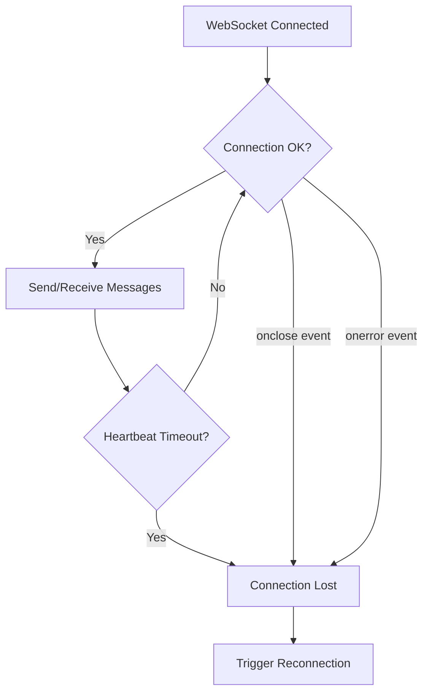
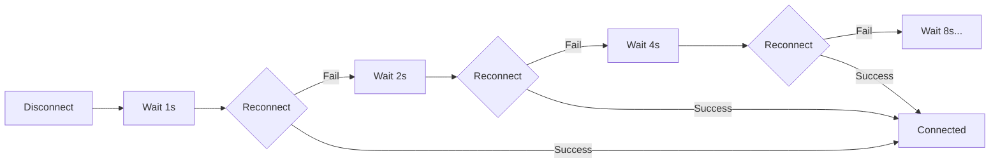
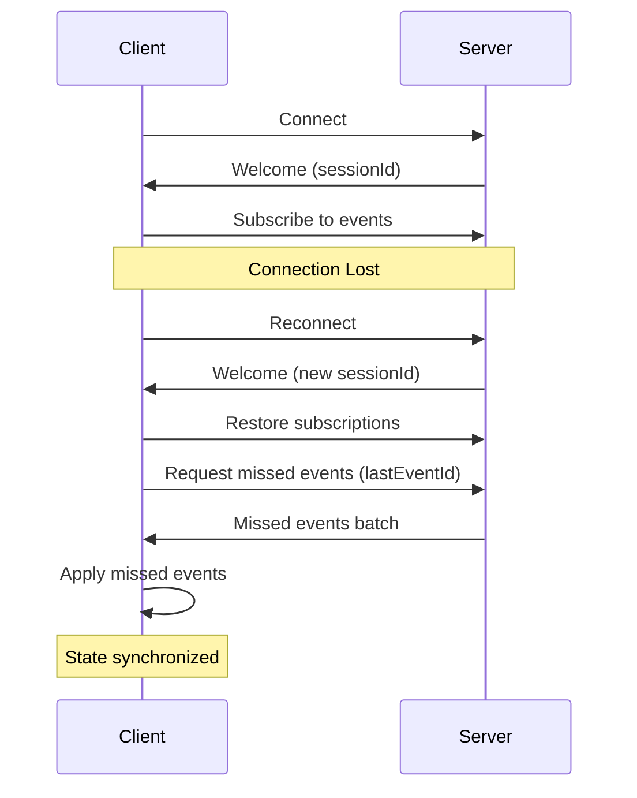
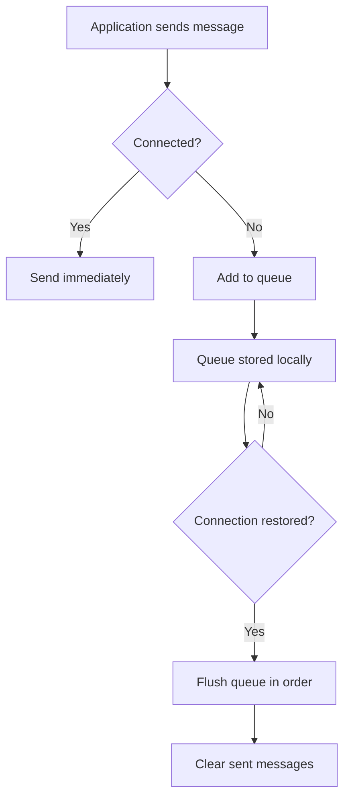
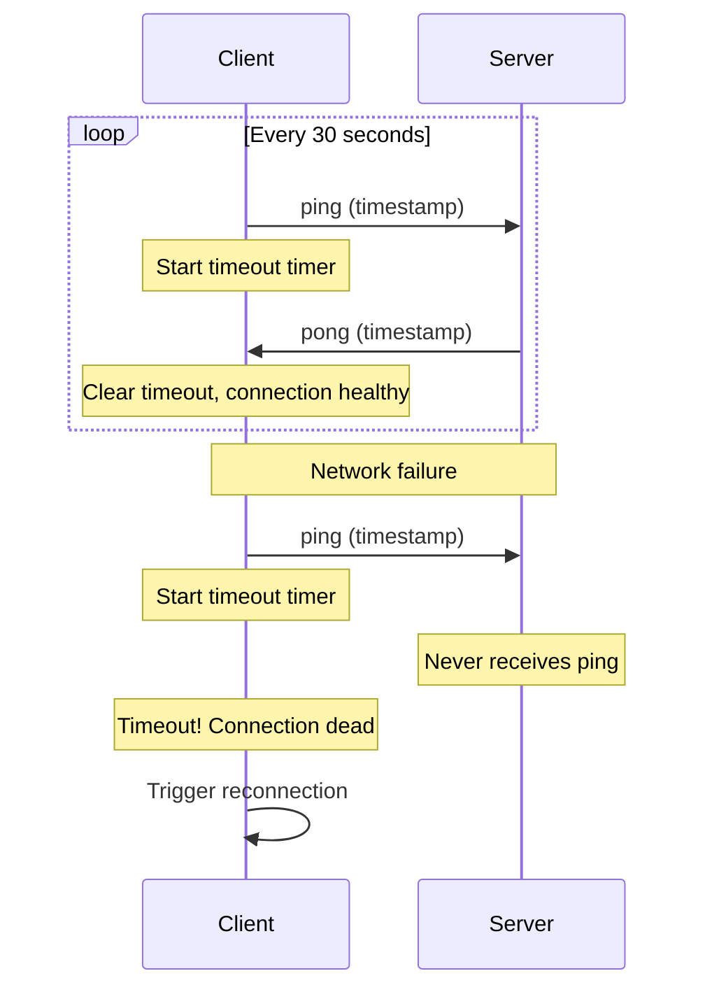

# How to Implement Reconnection Logic for WebSockets

By [nawazdhandala](https://github.com/nawazdhandala)

Tags: WebSockets, JavaScript, Real-time, Networking, Reliability, DevOps

Description: A comprehensive guide to implementing robust WebSocket reconnection logic including exponential backoff, state recovery, message queuing, and heartbeat mechanisms for production-grade real-time applications.

---

> The difference between a demo and production-ready WebSocket implementation is how gracefully it handles disconnections. Network failures are not exceptional - they are expected.

WebSocket connections are inherently fragile. Networks drop, servers restart, load balancers timeout, and mobile devices switch between WiFi and cellular. A robust reconnection strategy transforms a brittle real-time feature into a reliable one. This guide covers everything you need to implement production-grade WebSocket reconnection logic.

## Understanding WebSocket Connection Lifecycle

Before implementing reconnection, understand the events that signal connection state changes. The WebSocket API provides four key events that form the foundation of connection management.

```javascript
// Create a WebSocket connection to the server
const ws = new WebSocket('wss://api.example.com/ws');

// Connection successfully established
// This fires when the handshake completes and the connection is ready
ws.onopen = (event) => {
  console.log('Connected to server');
  // Safe to send messages now
};

// Message received from server
// The data property contains the message payload
ws.onmessage = (event) => {
  const data = JSON.parse(event.data);
  console.log('Received:', data);
};

// Connection closed (intentionally or due to error)
// The code and reason provide details about why it closed
ws.onclose = (event) => {
  console.log(`Connection closed: code=${event.code}, reason=${event.reason}`);
  // Common codes:
  // 1000 - Normal closure
  // 1001 - Going away (page navigation, server shutdown)
  // 1006 - Abnormal closure (no close frame received)
  // 1011 - Server error
};

// Error occurred (network failure, invalid data, etc.)
// Note: onerror is always followed by onclose
ws.onerror = (error) => {
  console.error('WebSocket error:', error);
};
```

## Detecting Connection Loss

Connection loss detection is the foundation of reconnection logic. Relying solely on the `onclose` event is insufficient because some failures (like network disconnection) may not trigger it immediately.



### Comprehensive Connection Monitor

This class wraps a WebSocket and provides reliable connection state detection by combining native events with heartbeat monitoring.

```javascript
class WebSocketConnectionMonitor {
  constructor(url, options = {}) {
    this.url = url;
    this.ws = null;

    // Connection state tracking
    this.isConnected = false;
    this.isConnecting = false;

    // Heartbeat configuration
    // Server must respond to pings within this timeout
    this.heartbeatInterval = options.heartbeatInterval || 30000; // 30 seconds
    this.heartbeatTimeout = options.heartbeatTimeout || 10000;   // 10 seconds
    this.heartbeatTimer = null;
    this.heartbeatTimeoutTimer = null;

    // Callbacks for connection state changes
    this.onConnectionLost = options.onConnectionLost || (() => {});
    this.onConnectionRestored = options.onConnectionRestored || (() => {});
  }

  connect() {
    // Prevent multiple simultaneous connection attempts
    if (this.isConnecting || this.isConnected) {
      return;
    }

    this.isConnecting = true;
    this.ws = new WebSocket(this.url);

    this.ws.onopen = () => {
      this.isConnecting = false;
      this.isConnected = true;
      console.log('WebSocket connected');

      // Start heartbeat monitoring after successful connection
      this.startHeartbeat();
      this.onConnectionRestored();
    };

    this.ws.onclose = (event) => {
      // Stop heartbeat when connection closes
      this.stopHeartbeat();

      // Only trigger connection lost if we were previously connected
      // This prevents double-triggering during initial connection failures
      if (this.isConnected) {
        this.isConnected = false;
        console.log(`Connection lost: ${event.code} - ${event.reason}`);
        this.onConnectionLost(event);
      }

      this.isConnecting = false;
    };

    this.ws.onerror = (error) => {
      // onerror is always followed by onclose, so we handle cleanup there
      console.error('WebSocket error:', error);
    };

    this.ws.onmessage = (event) => {
      // Any message from server resets the heartbeat timeout
      // This includes pong responses and regular messages
      this.resetHeartbeatTimeout();

      // Handle pong responses separately from application messages
      const data = JSON.parse(event.data);
      if (data.type === 'pong') {
        // Heartbeat response received - connection is healthy
        return;
      }

      // Forward application messages to handler
      if (this.onMessage) {
        this.onMessage(data);
      }
    };
  }

  startHeartbeat() {
    // Send periodic ping messages to verify connection is alive
    this.heartbeatTimer = setInterval(() => {
      if (this.isConnected && this.ws.readyState === WebSocket.OPEN) {
        // Send ping and start timeout timer
        this.ws.send(JSON.stringify({ type: 'ping', timestamp: Date.now() }));

        // If no response within timeout, consider connection dead
        this.heartbeatTimeoutTimer = setTimeout(() => {
          console.warn('Heartbeat timeout - connection presumed dead');
          // Force close to trigger reconnection
          this.ws.close(4000, 'Heartbeat timeout');
        }, this.heartbeatTimeout);
      }
    }, this.heartbeatInterval);
  }

  resetHeartbeatTimeout() {
    // Clear timeout timer when we receive any message from server
    if (this.heartbeatTimeoutTimer) {
      clearTimeout(this.heartbeatTimeoutTimer);
      this.heartbeatTimeoutTimer = null;
    }
  }

  stopHeartbeat() {
    if (this.heartbeatTimer) {
      clearInterval(this.heartbeatTimer);
      this.heartbeatTimer = null;
    }
    this.resetHeartbeatTimeout();
  }

  send(data) {
    if (this.isConnected && this.ws.readyState === WebSocket.OPEN) {
      this.ws.send(JSON.stringify(data));
      return true;
    }
    return false;
  }

  close() {
    this.stopHeartbeat();
    if (this.ws) {
      this.ws.close(1000, 'Client closing connection');
    }
  }
}
```

## Exponential Backoff Strategies

When reconnection fails, retrying immediately creates a thundering herd problem and wastes resources. Exponential backoff increases delay between attempts, giving the server time to recover while reducing load.



### Exponential Backoff with Jitter

Adding jitter (randomness) prevents synchronized reconnection storms when many clients disconnect simultaneously.

```javascript
class ExponentialBackoff {
  constructor(options = {}) {
    // Base delay for first retry attempt
    this.baseDelay = options.baseDelay || 1000;       // 1 second

    // Maximum delay cap to prevent excessive waits
    this.maxDelay = options.maxDelay || 30000;        // 30 seconds

    // Multiplier for each subsequent attempt (2 = double each time)
    this.multiplier = options.multiplier || 2;

    // Jitter factor (0.5 = +/- 50% randomization)
    this.jitter = options.jitter || 0.5;

    // Current attempt number (0-indexed)
    this.attempt = 0;

    // Maximum number of attempts before giving up (0 = unlimited)
    this.maxAttempts = options.maxAttempts || 0;
  }

  // Calculate delay for current attempt
  getNextDelay() {
    // Calculate base exponential delay: baseDelay * multiplier^attempt
    // Example with baseDelay=1000, multiplier=2:
    // Attempt 0: 1000ms, Attempt 1: 2000ms, Attempt 2: 4000ms, etc.
    const exponentialDelay = this.baseDelay * Math.pow(this.multiplier, this.attempt);

    // Cap at maximum delay
    const cappedDelay = Math.min(exponentialDelay, this.maxDelay);

    // Add jitter to prevent thundering herd
    // jitter=0.5 means the delay will be between 50% and 150% of cappedDelay
    const jitterRange = cappedDelay * this.jitter;
    const jitteredDelay = cappedDelay + (Math.random() * 2 - 1) * jitterRange;

    // Ensure delay is never negative
    return Math.max(0, Math.floor(jitteredDelay));
  }

  // Record a failed attempt and return next delay
  recordFailure() {
    const delay = this.getNextDelay();
    this.attempt++;
    return delay;
  }

  // Reset on successful connection
  reset() {
    this.attempt = 0;
  }

  // Check if we should give up
  shouldGiveUp() {
    return this.maxAttempts > 0 && this.attempt >= this.maxAttempts;
  }

  // Get current attempt number (for logging/display)
  getAttemptNumber() {
    return this.attempt + 1;
  }
}
```

### Reconnecting WebSocket Client

This class combines connection monitoring with exponential backoff for automatic reconnection.

```javascript
class ReconnectingWebSocket {
  constructor(url, options = {}) {
    this.url = url;
    this.ws = null;

    // Connection state
    this.isConnected = false;
    this.isReconnecting = false;
    this.isManuallyClosed = false;

    // Reconnection timer
    this.reconnectTimer = null;

    // Initialize backoff strategy
    this.backoff = new ExponentialBackoff({
      baseDelay: options.baseDelay || 1000,
      maxDelay: options.maxDelay || 30000,
      maxAttempts: options.maxAttempts || 10,
    });

    // Event callbacks
    this.onOpen = options.onOpen || (() => {});
    this.onClose = options.onClose || (() => {});
    this.onMessage = options.onMessage || (() => {});
    this.onError = options.onError || (() => {});
    this.onReconnecting = options.onReconnecting || (() => {});
    this.onReconnectFailed = options.onReconnectFailed || (() => {});
  }

  connect() {
    // Don't reconnect if manually closed
    if (this.isManuallyClosed) {
      return;
    }

    this.ws = new WebSocket(this.url);

    this.ws.onopen = () => {
      this.isConnected = true;
      this.isReconnecting = false;

      // Reset backoff on successful connection
      this.backoff.reset();

      console.log('WebSocket connected');
      this.onOpen();
    };

    this.ws.onclose = (event) => {
      this.isConnected = false;
      this.onClose(event);

      // Don't reconnect if this was an intentional close
      if (this.isManuallyClosed) {
        console.log('Connection closed intentionally');
        return;
      }

      // Attempt reconnection
      this.scheduleReconnect();
    };

    this.ws.onerror = (error) => {
      this.onError(error);
    };

    this.ws.onmessage = (event) => {
      this.onMessage(event);
    };
  }

  scheduleReconnect() {
    // Check if we've exceeded max attempts
    if (this.backoff.shouldGiveUp()) {
      console.error('Max reconnection attempts reached');
      this.onReconnectFailed();
      return;
    }

    // Get delay for next attempt
    const delay = this.backoff.recordFailure();
    const attemptNumber = this.backoff.getAttemptNumber();

    console.log(`Reconnecting in ${delay}ms (attempt ${attemptNumber})`);
    this.isReconnecting = true;
    this.onReconnecting({ attempt: attemptNumber, delay });

    // Schedule reconnection attempt
    this.reconnectTimer = setTimeout(() => {
      console.log(`Attempting reconnection (attempt ${attemptNumber})`);
      this.connect();
    }, delay);
  }

  send(data) {
    if (this.isConnected && this.ws.readyState === WebSocket.OPEN) {
      this.ws.send(typeof data === 'string' ? data : JSON.stringify(data));
      return true;
    }
    console.warn('Cannot send: WebSocket not connected');
    return false;
  }

  close() {
    // Mark as manually closed to prevent reconnection
    this.isManuallyClosed = true;

    // Cancel any pending reconnection
    if (this.reconnectTimer) {
      clearTimeout(this.reconnectTimer);
      this.reconnectTimer = null;
    }

    // Close the WebSocket
    if (this.ws) {
      this.ws.close(1000, 'Client initiated close');
    }
  }

  // Allow reopening after manual close
  reopen() {
    this.isManuallyClosed = false;
    this.backoff.reset();
    this.connect();
  }
}
```

## State Recovery After Reconnection

After reconnecting, the application state may be stale. The server might have processed events while the client was disconnected. Implementing state recovery ensures data consistency.



### State Recovery Manager

This class tracks subscriptions and message sequence numbers, enabling full state recovery after reconnection.

```javascript
class StateRecoveryManager {
  constructor() {
    // Track active subscriptions (channels, rooms, topics)
    // Map of subscriptionId -> subscription details
    this.subscriptions = new Map();

    // Track the last received event ID for each subscription
    // Used to request missed events after reconnection
    this.lastEventIds = new Map();

    // Callbacks for state changes
    this.onStateRestored = () => {};
    this.onMissedEvents = () => {};
  }

  // Record a subscription to restore after reconnection
  addSubscription(subscriptionId, details) {
    this.subscriptions.set(subscriptionId, {
      ...details,
      subscribedAt: Date.now(),
    });
  }

  // Remove a subscription (unsubscribe)
  removeSubscription(subscriptionId) {
    this.subscriptions.delete(subscriptionId);
    this.lastEventIds.delete(subscriptionId);
  }

  // Update last received event ID for a subscription
  // Call this when processing each event to enable replay from this point
  recordEventId(subscriptionId, eventId) {
    this.lastEventIds.set(subscriptionId, eventId);
  }

  // Get all subscriptions that need to be restored
  getSubscriptionsToRestore() {
    return Array.from(this.subscriptions.entries()).map(([id, details]) => ({
      subscriptionId: id,
      ...details,
      lastEventId: this.lastEventIds.get(id),
    }));
  }

  // Clear all state (for full reset)
  clear() {
    this.subscriptions.clear();
    this.lastEventIds.clear();
  }
}

class StatefulWebSocketClient {
  constructor(url, options = {}) {
    this.url = url;
    this.stateManager = new StateRecoveryManager();

    // Create reconnecting WebSocket
    this.ws = new ReconnectingWebSocket(url, {
      ...options,
      onOpen: () => this.handleOpen(),
      onClose: (event) => this.handleClose(event),
      onMessage: (event) => this.handleMessage(event),
    });

    // Flag to track if this is a reconnection vs initial connection
    this.hasConnectedBefore = false;

    // Session ID from server (changes on reconnect)
    this.sessionId = null;

    // Pending state recovery
    this.isRecovering = false;
  }

  connect() {
    this.ws.connect();
  }

  handleOpen() {
    if (this.hasConnectedBefore) {
      // This is a reconnection - need to restore state
      console.log('Reconnected - initiating state recovery');
      this.isRecovering = true;
      this.restoreState();
    } else {
      // First connection - no state to restore
      this.hasConnectedBefore = true;
    }
  }

  async restoreState() {
    const subscriptions = this.stateManager.getSubscriptionsToRestore();

    console.log(`Restoring ${subscriptions.length} subscriptions`);

    for (const sub of subscriptions) {
      // Re-subscribe to each channel/topic
      this.ws.send({
        type: 'subscribe',
        subscriptionId: sub.subscriptionId,
        channel: sub.channel,
        // Include last event ID to get missed events
        lastEventId: sub.lastEventId,
      });
    }

    this.isRecovering = false;
    this.stateManager.onStateRestored();
  }

  handleMessage(event) {
    const data = JSON.parse(event.data);

    switch (data.type) {
      case 'welcome':
        // Server sends session info on connection
        this.sessionId = data.sessionId;
        break;

      case 'subscribed':
        // Subscription confirmed
        console.log(`Subscribed to ${data.channel}`);
        break;

      case 'missed-events':
        // Server sends batch of events we missed during disconnection
        console.log(`Received ${data.events.length} missed events`);
        for (const event of data.events) {
          this.processEvent(event);
        }
        this.stateManager.onMissedEvents(data.events);
        break;

      case 'event':
        // Normal event
        this.processEvent(data);
        break;
    }
  }

  processEvent(event) {
    // Update last event ID for this subscription
    if (event.subscriptionId && event.eventId) {
      this.stateManager.recordEventId(event.subscriptionId, event.eventId);
    }

    // Forward to application handler
    if (this.onEvent) {
      this.onEvent(event);
    }
  }

  subscribe(channel, options = {}) {
    const subscriptionId = options.subscriptionId || `sub_${Date.now()}`;

    // Record subscription for recovery
    this.stateManager.addSubscription(subscriptionId, {
      channel,
      options,
    });

    // Send subscription request
    this.ws.send({
      type: 'subscribe',
      subscriptionId,
      channel,
      ...options,
    });

    return subscriptionId;
  }

  unsubscribe(subscriptionId) {
    this.stateManager.removeSubscription(subscriptionId);
    this.ws.send({
      type: 'unsubscribe',
      subscriptionId,
    });
  }

  handleClose(event) {
    // State is preserved in stateManager for recovery
    console.log('Connection closed, state preserved for recovery');
  }

  close() {
    this.ws.close();
    this.stateManager.clear();
  }
}
```

## Message Queuing During Disconnection

When the connection is lost, messages sent by the application would normally be dropped. A message queue buffers outgoing messages and delivers them when the connection is restored.



### Robust Message Queue

This implementation handles message persistence, ordering, expiration, and retry limits.

```javascript
class MessageQueue {
  constructor(options = {}) {
    // Queue storage - maintains insertion order
    this.queue = [];

    // Maximum queue size to prevent memory issues
    this.maxSize = options.maxSize || 1000;

    // Message time-to-live in milliseconds (0 = no expiration)
    this.messageTTL = options.messageTTL || 5 * 60 * 1000; // 5 minutes

    // Storage key for persistence (optional)
    this.storageKey = options.storageKey || null;

    // Load persisted queue on initialization
    if (this.storageKey) {
      this.loadFromStorage();
    }
  }

  // Add message to queue
  enqueue(message, options = {}) {
    // Check queue size limit
    if (this.queue.length >= this.maxSize) {
      console.warn('Message queue full, dropping oldest message');
      this.queue.shift(); // Remove oldest
    }

    const queuedMessage = {
      id: options.id || `msg_${Date.now()}_${Math.random().toString(36).substr(2, 9)}`,
      message,
      timestamp: Date.now(),
      priority: options.priority || 0,      // Higher = more important
      retryCount: 0,
      maxRetries: options.maxRetries || 3,  // Max send attempts
    };

    this.queue.push(queuedMessage);

    // Sort by priority (higher priority first)
    this.queue.sort((a, b) => b.priority - a.priority);

    // Persist to storage
    this.saveToStorage();

    return queuedMessage.id;
  }

  // Get all messages ready to send (not expired)
  getMessagesToSend() {
    const now = Date.now();

    // Filter out expired messages
    this.queue = this.queue.filter(item => {
      if (this.messageTTL > 0 && now - item.timestamp > this.messageTTL) {
        console.log(`Message ${item.id} expired, removing from queue`);
        return false;
      }
      return true;
    });

    this.saveToStorage();
    return [...this.queue];
  }

  // Mark message as successfully sent
  markSent(messageId) {
    const index = this.queue.findIndex(item => item.id === messageId);
    if (index !== -1) {
      this.queue.splice(index, 1);
      this.saveToStorage();
    }
  }

  // Mark message send as failed
  markFailed(messageId) {
    const message = this.queue.find(item => item.id === messageId);
    if (message) {
      message.retryCount++;

      // Remove if exceeded max retries
      if (message.retryCount >= message.maxRetries) {
        console.error(`Message ${messageId} exceeded max retries, removing`);
        this.markSent(messageId); // Remove from queue
        return false; // Indicates permanent failure
      }
    }
    return true; // Will retry
  }

  // Get queue size
  size() {
    return this.queue.length;
  }

  // Clear all messages
  clear() {
    this.queue = [];
    this.saveToStorage();
  }

  // Persist queue to localStorage (browser) or file (Node.js)
  saveToStorage() {
    if (this.storageKey && typeof localStorage !== 'undefined') {
      try {
        localStorage.setItem(this.storageKey, JSON.stringify(this.queue));
      } catch (e) {
        console.warn('Failed to persist message queue:', e);
      }
    }
  }

  // Load queue from storage
  loadFromStorage() {
    if (this.storageKey && typeof localStorage !== 'undefined') {
      try {
        const stored = localStorage.getItem(this.storageKey);
        if (stored) {
          this.queue = JSON.parse(stored);
          console.log(`Loaded ${this.queue.length} messages from storage`);
        }
      } catch (e) {
        console.warn('Failed to load message queue:', e);
        this.queue = [];
      }
    }
  }
}

class QueuedWebSocketClient {
  constructor(url, options = {}) {
    this.url = url;

    // Initialize message queue
    this.messageQueue = new MessageQueue({
      maxSize: options.maxQueueSize || 1000,
      messageTTL: options.messageTTL || 5 * 60 * 1000,
      storageKey: options.persistQueue ? 'ws_message_queue' : null,
    });

    // Create reconnecting WebSocket
    this.ws = new ReconnectingWebSocket(url, {
      ...options,
      onOpen: () => this.handleOpen(),
      onClose: (event) => this.handleClose(event),
      onMessage: (event) => this.handleMessage(event),
    });

    // Track connection state
    this.isConnected = false;

    // Flag to prevent concurrent flush operations
    this.isFlushing = false;
  }

  connect() {
    this.ws.connect();
  }

  handleOpen() {
    this.isConnected = true;
    console.log('Connected, flushing message queue');
    this.flushQueue();
  }

  handleClose(event) {
    this.isConnected = false;
    console.log('Disconnected, messages will be queued');
  }

  handleMessage(event) {
    const data = JSON.parse(event.data);

    // Handle acknowledgments for queued messages
    if (data.type === 'ack' && data.messageId) {
      this.messageQueue.markSent(data.messageId);
      return;
    }

    // Forward to application
    if (this.onMessage) {
      this.onMessage(data);
    }
  }

  // Send message - queues if disconnected
  send(message, options = {}) {
    if (this.isConnected && this.ws.ws.readyState === WebSocket.OPEN) {
      // Send immediately if connected
      const messageId = options.id || `msg_${Date.now()}`;
      const payload = {
        ...message,
        messageId, // Include ID for acknowledgment
      };

      const sent = this.ws.send(payload);
      if (!sent) {
        // Failed to send, queue it
        return this.queueMessage(message, options);
      }
      return messageId;
    } else {
      // Queue for later delivery
      return this.queueMessage(message, options);
    }
  }

  queueMessage(message, options) {
    const messageId = this.messageQueue.enqueue(message, options);
    console.log(`Message queued: ${messageId} (queue size: ${this.messageQueue.size()})`);
    return messageId;
  }

  async flushQueue() {
    // Prevent concurrent flushes
    if (this.isFlushing) {
      return;
    }

    this.isFlushing = true;
    const messages = this.messageQueue.getMessagesToSend();

    console.log(`Flushing ${messages.length} queued messages`);

    for (const item of messages) {
      if (!this.isConnected) {
        // Connection lost during flush, stop
        console.log('Connection lost during flush, stopping');
        break;
      }

      const payload = {
        ...item.message,
        messageId: item.id,
      };

      const sent = this.ws.send(payload);
      if (sent) {
        // For fire-and-forget messages, mark as sent immediately
        // For messages requiring ack, wait for server response
        if (!item.message.requiresAck) {
          this.messageQueue.markSent(item.id);
        }
      } else {
        // Failed to send
        this.messageQueue.markFailed(item.id);
      }

      // Small delay between messages to avoid overwhelming server
      await new Promise(resolve => setTimeout(resolve, 50));
    }

    this.isFlushing = false;
  }

  // Get current queue size
  getQueueSize() {
    return this.messageQueue.size();
  }

  close() {
    this.ws.close();
  }
}
```

## Heartbeat Implementation

Heartbeats detect dead connections that the OS has not yet recognized. They are essential for detecting "half-open" connections where one side thinks the connection is alive but the other has died.



### Complete Heartbeat System

This implementation includes both client-side and server-side heartbeat handling.

```javascript
// Client-side heartbeat manager
class HeartbeatManager {
  constructor(options = {}) {
    // How often to send heartbeats
    this.interval = options.interval || 30000; // 30 seconds

    // How long to wait for pong response
    this.timeout = options.timeout || 10000;   // 10 seconds

    // Callback when heartbeat fails
    this.onTimeout = options.onTimeout || (() => {});

    // Callback when heartbeat succeeds
    this.onPong = options.onPong || (() => {});

    // Timer references
    this.intervalTimer = null;
    this.timeoutTimer = null;

    // WebSocket reference
    this.ws = null;

    // Track consecutive failures
    this.consecutiveFailures = 0;
    this.maxConsecutiveFailures = options.maxConsecutiveFailures || 2;

    // Latency tracking for diagnostics
    this.latencyHistory = [];
    this.maxLatencyHistory = 10;
  }

  // Start heartbeat monitoring
  start(ws) {
    this.ws = ws;
    this.consecutiveFailures = 0;

    // Clear any existing timers
    this.stop();

    // Start sending heartbeats
    this.intervalTimer = setInterval(() => {
      this.sendHeartbeat();
    }, this.interval);

    // Send first heartbeat immediately
    this.sendHeartbeat();
  }

  sendHeartbeat() {
    if (!this.ws || this.ws.readyState !== WebSocket.OPEN) {
      return;
    }

    const pingTime = Date.now();

    // Send ping with timestamp
    this.ws.send(JSON.stringify({
      type: 'ping',
      timestamp: pingTime,
    }));

    // Start timeout timer
    this.timeoutTimer = setTimeout(() => {
      this.handleTimeout();
    }, this.timeout);

    // Store ping time for latency calculation
    this.lastPingTime = pingTime;
  }

  // Called when pong received
  receivePong(pongData) {
    // Clear timeout
    if (this.timeoutTimer) {
      clearTimeout(this.timeoutTimer);
      this.timeoutTimer = null;
    }

    // Reset failure counter
    this.consecutiveFailures = 0;

    // Calculate round-trip latency
    if (this.lastPingTime) {
      const latency = Date.now() - this.lastPingTime;
      this.recordLatency(latency);
      this.onPong({ latency, serverTime: pongData.serverTime });
    }
  }

  handleTimeout() {
    this.consecutiveFailures++;
    console.warn(`Heartbeat timeout (${this.consecutiveFailures}/${this.maxConsecutiveFailures})`);

    if (this.consecutiveFailures >= this.maxConsecutiveFailures) {
      console.error('Max heartbeat failures reached, connection presumed dead');
      this.onTimeout();
    } else {
      // Try another heartbeat immediately
      this.sendHeartbeat();
    }
  }

  recordLatency(latency) {
    this.latencyHistory.push(latency);
    if (this.latencyHistory.length > this.maxLatencyHistory) {
      this.latencyHistory.shift();
    }
  }

  // Get average latency over recent heartbeats
  getAverageLatency() {
    if (this.latencyHistory.length === 0) return 0;
    const sum = this.latencyHistory.reduce((a, b) => a + b, 0);
    return Math.round(sum / this.latencyHistory.length);
  }

  // Stop heartbeat monitoring
  stop() {
    if (this.intervalTimer) {
      clearInterval(this.intervalTimer);
      this.intervalTimer = null;
    }
    if (this.timeoutTimer) {
      clearTimeout(this.timeoutTimer);
      this.timeoutTimer = null;
    }
  }
}

// Server-side heartbeat handler (Node.js)
class ServerHeartbeatHandler {
  constructor(wss, options = {}) {
    // WebSocket server instance
    this.wss = wss;

    // How often to check for dead connections
    this.checkInterval = options.checkInterval || 30000;

    // How long since last activity before considered dead
    this.connectionTimeout = options.connectionTimeout || 60000;

    // Track last activity for each connection
    this.lastActivity = new Map();

    // Start periodic cleanup
    this.startCleanup();
  }

  // Register a new connection
  register(ws, clientId) {
    // Record activity timestamp
    this.lastActivity.set(clientId, Date.now());

    // Handle ping messages
    ws.on('message', (data) => {
      try {
        const message = JSON.parse(data);

        if (message.type === 'ping') {
          // Update last activity
          this.lastActivity.set(clientId, Date.now());

          // Send pong response
          ws.send(JSON.stringify({
            type: 'pong',
            timestamp: message.timestamp, // Echo client's timestamp for latency calc
            serverTime: Date.now(),       // Include server time
          }));
        }
      } catch (e) {
        // Not JSON or not a ping, ignore
      }
    });

    // Clean up on close
    ws.on('close', () => {
      this.lastActivity.delete(clientId);
    });
  }

  // Update activity timestamp (call on any client activity)
  recordActivity(clientId) {
    this.lastActivity.set(clientId, Date.now());
  }

  startCleanup() {
    setInterval(() => {
      const now = Date.now();

      this.wss.clients.forEach((ws) => {
        const clientId = ws.clientId; // Assuming clientId is stored on ws object
        const lastActive = this.lastActivity.get(clientId);

        if (lastActive && now - lastActive > this.connectionTimeout) {
          console.log(`Terminating inactive connection: ${clientId}`);
          ws.terminate(); // Force close without close frame
        }
      });
    }, this.checkInterval);
  }
}
```

## Complete Production-Ready Implementation

Here is a complete implementation combining all the concepts for a production-ready WebSocket client.

```javascript
class ProductionWebSocketClient {
  constructor(url, options = {}) {
    this.url = url;
    this.options = options;

    // Core WebSocket
    this.ws = null;

    // Connection state
    this.isConnected = false;
    this.isReconnecting = false;
    this.isManuallyClosed = false;
    this.hasConnectedBefore = false;

    // Managers
    this.backoff = new ExponentialBackoff({
      baseDelay: options.baseDelay || 1000,
      maxDelay: options.maxDelay || 30000,
      maxAttempts: options.maxAttempts || 0, // Unlimited by default
    });

    this.messageQueue = new MessageQueue({
      maxSize: options.maxQueueSize || 1000,
      messageTTL: options.messageTTL || 5 * 60 * 1000,
      storageKey: options.persistQueue ? 'ws_queue' : null,
    });

    this.stateManager = new StateRecoveryManager();

    this.heartbeat = new HeartbeatManager({
      interval: options.heartbeatInterval || 30000,
      timeout: options.heartbeatTimeout || 10000,
      onTimeout: () => this.handleHeartbeatTimeout(),
    });

    // Timers
    this.reconnectTimer = null;

    // Callbacks
    this.onConnect = options.onConnect || (() => {});
    this.onDisconnect = options.onDisconnect || (() => {});
    this.onMessage = options.onMessage || (() => {});
    this.onError = options.onError || (() => {});
    this.onReconnecting = options.onReconnecting || (() => {});
    this.onStateRestored = options.onStateRestored || (() => {});
  }

  connect() {
    if (this.isManuallyClosed) {
      console.warn('Cannot connect: client was manually closed. Call reopen() first.');
      return;
    }

    if (this.isConnected || this.ws?.readyState === WebSocket.CONNECTING) {
      return;
    }

    console.log(`Connecting to ${this.url}`);
    this.ws = new WebSocket(this.url);

    this.ws.onopen = () => this.handleOpen();
    this.ws.onclose = (event) => this.handleClose(event);
    this.ws.onerror = (error) => this.handleError(error);
    this.ws.onmessage = (event) => this.handleMessage(event);
  }

  handleOpen() {
    console.log('WebSocket connected');
    this.isConnected = true;
    this.isReconnecting = false;
    this.backoff.reset();

    // Start heartbeat
    this.heartbeat.start(this.ws);

    if (this.hasConnectedBefore) {
      // Reconnection - restore state
      this.restoreState();
    } else {
      this.hasConnectedBefore = true;
    }

    // Flush queued messages
    this.flushQueue();

    this.onConnect();
  }

  handleClose(event) {
    console.log(`WebSocket closed: code=${event.code}, reason=${event.reason}`);
    this.isConnected = false;
    this.heartbeat.stop();

    this.onDisconnect(event);

    if (!this.isManuallyClosed) {
      this.scheduleReconnect();
    }
  }

  handleError(error) {
    console.error('WebSocket error:', error);
    this.onError(error);
  }

  handleMessage(event) {
    let data;
    try {
      data = JSON.parse(event.data);
    } catch (e) {
      data = event.data;
    }

    // Handle system messages
    if (data.type === 'pong') {
      this.heartbeat.receivePong(data);
      return;
    }

    if (data.type === 'ack' && data.messageId) {
      this.messageQueue.markSent(data.messageId);
      return;
    }

    // Track event IDs for state recovery
    if (data.subscriptionId && data.eventId) {
      this.stateManager.recordEventId(data.subscriptionId, data.eventId);
    }

    this.onMessage(data);
  }

  handleHeartbeatTimeout() {
    console.warn('Heartbeat timeout, forcing reconnection');
    if (this.ws) {
      this.ws.close(4000, 'Heartbeat timeout');
    }
  }

  scheduleReconnect() {
    if (this.backoff.shouldGiveUp()) {
      console.error('Reconnection attempts exhausted');
      return;
    }

    const delay = this.backoff.recordFailure();
    const attempt = this.backoff.getAttemptNumber();

    console.log(`Scheduling reconnection in ${delay}ms (attempt ${attempt})`);
    this.isReconnecting = true;
    this.onReconnecting({ attempt, delay });

    this.reconnectTimer = setTimeout(() => {
      this.connect();
    }, delay);
  }

  async restoreState() {
    const subscriptions = this.stateManager.getSubscriptionsToRestore();
    console.log(`Restoring ${subscriptions.length} subscriptions`);

    for (const sub of subscriptions) {
      this.sendDirect({
        type: 'subscribe',
        subscriptionId: sub.subscriptionId,
        channel: sub.channel,
        lastEventId: sub.lastEventId,
      });
    }

    this.onStateRestored(subscriptions);
  }

  async flushQueue() {
    const messages = this.messageQueue.getMessagesToSend();
    console.log(`Flushing ${messages.length} queued messages`);

    for (const item of messages) {
      if (!this.isConnected) break;

      this.sendDirect({
        ...item.message,
        messageId: item.id,
      });

      if (!item.message.requiresAck) {
        this.messageQueue.markSent(item.id);
      }

      await new Promise(r => setTimeout(r, 10));
    }
  }

  // Send without queueing
  sendDirect(data) {
    if (this.isConnected && this.ws?.readyState === WebSocket.OPEN) {
      this.ws.send(JSON.stringify(data));
      return true;
    }
    return false;
  }

  // Send with automatic queueing if disconnected
  send(data, options = {}) {
    if (this.isConnected && this.ws?.readyState === WebSocket.OPEN) {
      return this.sendDirect(data);
    } else {
      return this.messageQueue.enqueue(data, options);
    }
  }

  subscribe(channel, options = {}) {
    const subscriptionId = options.subscriptionId || `sub_${Date.now()}`;
    this.stateManager.addSubscription(subscriptionId, { channel, options });

    this.send({
      type: 'subscribe',
      subscriptionId,
      channel,
      ...options,
    });

    return subscriptionId;
  }

  unsubscribe(subscriptionId) {
    this.stateManager.removeSubscription(subscriptionId);
    this.send({ type: 'unsubscribe', subscriptionId });
  }

  close() {
    this.isManuallyClosed = true;

    if (this.reconnectTimer) {
      clearTimeout(this.reconnectTimer);
    }

    this.heartbeat.stop();

    if (this.ws) {
      this.ws.close(1000, 'Client closing');
    }
  }

  reopen() {
    this.isManuallyClosed = false;
    this.backoff.reset();
    this.connect();
  }

  // Diagnostics
  getStatus() {
    return {
      isConnected: this.isConnected,
      isReconnecting: this.isReconnecting,
      queueSize: this.messageQueue.size(),
      subscriptionCount: this.stateManager.subscriptions.size,
      averageLatency: this.heartbeat.getAverageLatency(),
      reconnectAttempt: this.backoff.getAttemptNumber(),
    };
  }
}

// Usage example
const client = new ProductionWebSocketClient('wss://api.example.com/ws', {
  heartbeatInterval: 30000,
  heartbeatTimeout: 10000,
  baseDelay: 1000,
  maxDelay: 30000,
  persistQueue: true,

  onConnect: () => {
    console.log('Connected to server');
  },

  onDisconnect: (event) => {
    console.log('Disconnected from server');
  },

  onMessage: (data) => {
    console.log('Received:', data);
  },

  onReconnecting: ({ attempt, delay }) => {
    console.log(`Reconnecting (attempt ${attempt}) in ${delay}ms`);
  },

  onStateRestored: (subscriptions) => {
    console.log(`Restored ${subscriptions.length} subscriptions`);
  },
});

client.connect();

// Subscribe to channels (automatically restored on reconnection)
client.subscribe('notifications');
client.subscribe('chat/room-123');

// Send messages (automatically queued if disconnected)
client.send({ type: 'message', text: 'Hello!' });
```

## Best Practices Summary

| Practice | Recommendation |
|----------|----------------|
| **Exponential Backoff** | Always use with jitter to prevent thundering herd |
| **Max Attempts** | Set a reasonable limit (10-20) or implement circuit breaker |
| **Heartbeat Interval** | 30 seconds is a good default; adjust based on infrastructure |
| **Heartbeat Timeout** | 10 seconds allows for network jitter without false positives |
| **Message Queue Size** | Cap at 1000 messages to prevent memory issues |
| **Message TTL** | Expire old messages (5 minutes) to avoid stale data |
| **State Recovery** | Always track subscriptions and last event IDs |
| **Connection Events** | Expose status to UI so users know connection state |
| **Graceful Degradation** | Application should work (limited) when disconnected |
| **Logging** | Log connection events and metrics for debugging |

## Key Takeaways

1. **Network failures are normal** - Design for disconnection from the start, not as an afterthought.

2. **Exponential backoff with jitter** - Prevents server overload when many clients reconnect simultaneously.

3. **Heartbeats detect silent failures** - TCP keepalive is insufficient; application-level heartbeats catch dead connections faster.

4. **Queue messages during disconnection** - Users should not lose work because of temporary network issues.

5. **Restore state on reconnection** - Re-subscribe to channels and request missed events to maintain consistency.

6. **Expose connection status** - Let users know when they are offline so they understand delayed updates.

For monitoring your WebSocket connections and real-time applications in production, check out [OneUptime](https://oneuptime.com) for comprehensive observability and incident management.
