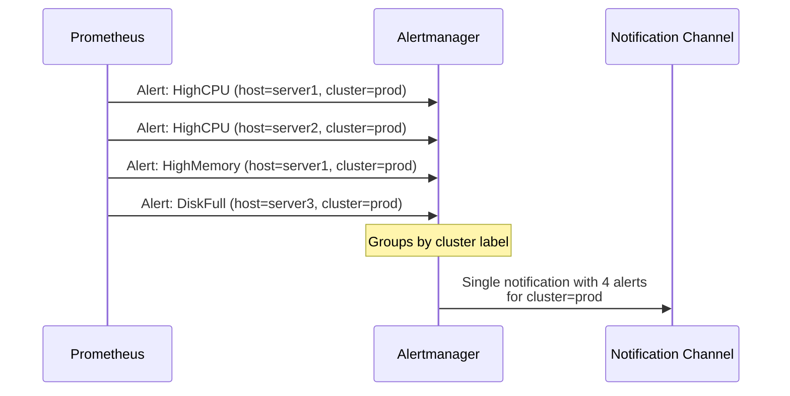
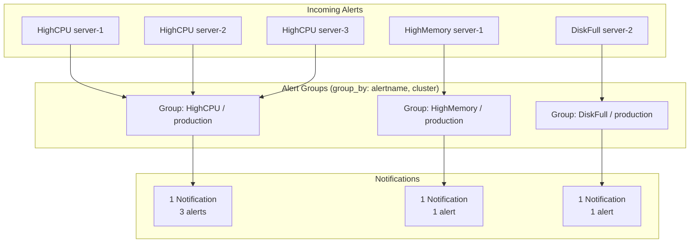

# How to Implement Alertmanager Alert Groups

Author: [nawazdhandala](https://www.github.com/nawazdhandala)

Tags: Alertmanager, Prometheus, Alerting, DevOps, Monitoring

Description: Learn how to configure alert grouping in Alertmanager to reduce notification noise and deliver actionable, consolidated alerts to your team.

---

Without proper grouping, a single infrastructure issue can trigger hundreds of individual alerts, flooding your notification channels and causing alert fatigue. Alertmanager's grouping feature consolidates related alerts into single notifications, making it easier for on-call engineers to understand the scope of an issue and respond effectively.

## How Alert Grouping Works

Alertmanager groups alerts based on labels you specify. All alerts with matching values for those labels are batched together into a single notification. The grouping happens at the route level, giving you fine-grained control over how different types of alerts are consolidated.



## 1. Basic Grouping Configuration

Start with a simple configuration that groups alerts by alertname and severity:

`alertmanager.yml`

```yaml
global:
  resolve_timeout: 5m

route:
  # Default receiver for all alerts
  receiver: 'team-notifications'

  # Labels to group alerts by
  # Alerts with the same values for these labels go into one group
  group_by: ['alertname', 'severity']

  # Wait this long to buffer alerts before sending the first notification
  # Allows time to collect multiple related alerts
  group_wait: 30s

  # After the first notification, wait this long before sending updates
  # about new alerts added to the same group
  group_interval: 5m

  # Wait this long before re-notifying about an unchanged alert group
  repeat_interval: 4h

receivers:
  - name: 'team-notifications'
    slack_configs:
      - api_url: '${SLACK_WEBHOOK_URL}'
        channel: '#alerts'
        title: '[{{ .Status | toUpper }}] {{ .CommonLabels.alertname }}'
        text: '{{ range .Alerts }}{{ .Annotations.description }}{{ end }}'
        send_resolved: true
```

With this configuration, all `HighCPU` alerts with `severity=critical` are grouped together, while `HighCPU` alerts with `severity=warning` form a separate group.

## 2. Group by Service and Cluster

For microservice environments, grouping by service and cluster often makes more sense:

```yaml
route:
  receiver: 'default'
  # Group alerts by the service they relate to and which cluster they come from
  group_by: ['cluster', 'service', 'alertname']
  group_wait: 45s
  group_interval: 5m
  repeat_interval: 4h
```

This means if your `payment-service` in the `production` cluster has multiple issues (high latency, errors, CPU), they get consolidated into one notification.

## 3. Configure Route-Specific Grouping

Different teams may want different grouping strategies. Use child routes to customize:

```yaml
route:
  receiver: 'default'
  group_by: ['alertname']
  group_wait: 30s
  group_interval: 5m
  repeat_interval: 4h

  routes:
    # Database alerts grouped by cluster and instance
    - match:
        team: database
      receiver: 'database-team'
      group_by: ['alertname', 'cluster', 'instance']
      group_wait: 1m
      group_interval: 10m

    # Security alerts should never be grouped - each one matters
    - match:
        category: security
      receiver: 'security-team'
      group_by: ['...']  # Special value: don't aggregate at all
      group_wait: 0s     # Send immediately

    # Network alerts grouped by datacenter
    - match_re:
        alertname: Network.*
      receiver: 'network-team'
      group_by: ['datacenter', 'alertname']
      group_wait: 2m  # Network issues often cascade, wait longer

    # Critical alerts for any service go to on-call
    - match:
        severity: critical
      receiver: 'pagerduty-oncall'
      group_by: ['cluster', 'service']
      group_wait: 15s  # Shorter wait for critical issues
```

## 4. Use Aggregation Labels in Prometheus

Effective grouping starts with having the right labels on your alerts. Design your Prometheus alerting rules with grouping in mind:

`alerting-rules.yml`

```yaml
groups:
  - name: service-alerts
    rules:
      # Include labels that will help with grouping and routing
      - alert: HighErrorRate
        expr: |
          sum by (service, cluster, environment) (
            rate(http_requests_total{status=~"5.."}[5m])
          ) / sum by (service, cluster, environment) (
            rate(http_requests_total[5m])
          ) > 0.05
        for: 5m
        labels:
          severity: critical
          team: backend  # Used for routing
          category: availability  # Used for grouping
        annotations:
          summary: "High error rate for {{ $labels.service }}"
          description: "{{ $labels.service }} in {{ $labels.cluster }} has {{ $value | humanizePercentage }} error rate."

      - alert: HighLatency
        expr: |
          histogram_quantile(0.99,
            sum by (service, cluster, environment, le) (
              rate(http_request_duration_seconds_bucket[5m])
            )
          ) > 2
        for: 5m
        labels:
          severity: warning
          team: backend
          category: performance
        annotations:
          summary: "High latency for {{ $labels.service }}"
          description: "P99 latency for {{ $labels.service }} is {{ $value | humanizeDuration }}."
```

## 5. Handle Inhibition with Groups

Inhibition prevents certain alerts from firing when others are already active. This works alongside grouping to reduce noise:

```yaml
# Inhibit less severe alerts when critical ones are firing
inhibit_rules:
  # If a critical alert is firing, suppress warnings for the same service
  - source_match:
      severity: 'critical'
    target_match:
      severity: 'warning'
    # Only inhibit if these labels match between source and target
    equal: ['alertname', 'cluster', 'service']

  # If a cluster is down, suppress individual node alerts
  - source_match:
      alertname: 'ClusterDown'
    target_match_re:
      alertname: 'Node.*'
    equal: ['cluster']

  # If entire region is down, suppress datacenter alerts
  - source_match:
      alertname: 'RegionDown'
    target_match:
      alertname: 'DatacenterDown'
    equal: ['region']
```

## 6. Format Grouped Notifications

Customize your notification templates to display grouped alerts clearly:

```yaml
receivers:
  - name: 'slack-grouped'
    slack_configs:
      - api_url: '${SLACK_WEBHOOK_URL}'
        channel: '#alerts'
        # Title shows common information
        title: '{{ .Status | toUpper }}: {{ .CommonLabels.alertname }} ({{ .Alerts | len }} alerts)'
        # Color based on severity
        color: '{{ if eq .Status "firing" }}{{ if eq .CommonLabels.severity "critical" }}danger{{ else }}warning{{ end }}{{ else }}good{{ end }}'
        # Body lists all alerts in the group
        text: |
          *Cluster:* {{ .CommonLabels.cluster }}
          *Service:* {{ .CommonLabels.service }}

          *Alerts:*
          {{ range .Alerts }}
          - {{ .Labels.instance }}: {{ .Annotations.summary }}
          {{ end }}

          {{ if gt (len .Alerts.Firing) 0 }}
          *Firing:* {{ .Alerts.Firing | len }}
          {{ end }}
          {{ if gt (len .Alerts.Resolved) 0 }}
          *Resolved:* {{ .Alerts.Resolved | len }}
          {{ end }}
        send_resolved: true
```

## 7. Test Your Grouping Configuration

Verify grouping works as expected by sending test alerts:

```bash
# Send multiple test alerts that should be grouped together
# These share the same alertname and cluster label

# First alert
curl -X POST http://alertmanager:9093/api/v2/alerts \
  -H "Content-Type: application/json" \
  -d '[{
    "labels": {
      "alertname": "HighCPU",
      "cluster": "production",
      "instance": "server-1",
      "severity": "warning"
    },
    "annotations": {
      "summary": "High CPU on server-1"
    }
  }]'

# Second alert - same alertname and cluster, different instance
curl -X POST http://alertmanager:9093/api/v2/alerts \
  -H "Content-Type: application/json" \
  -d '[{
    "labels": {
      "alertname": "HighCPU",
      "cluster": "production",
      "instance": "server-2",
      "severity": "warning"
    },
    "annotations": {
      "summary": "High CPU on server-2"
    }
  }]'

# Third alert - different alertname, should be in separate group
curl -X POST http://alertmanager:9093/api/v2/alerts \
  -H "Content-Type: application/json" \
  -d '[{
    "labels": {
      "alertname": "HighMemory",
      "cluster": "production",
      "instance": "server-1",
      "severity": "warning"
    },
    "annotations": {
      "summary": "High memory on server-1"
    }
  }]'
```

Check the API to see how alerts are grouped:

```bash
# View all alert groups
curl -s http://alertmanager:9093/api/v2/alerts/groups | jq '.[].labels'
```

## 8. Visualize Alert Groups



## 9. Common Grouping Patterns

Here are proven grouping strategies for different scenarios:

```yaml
# Pattern 1: Group by impact scope
# Good for infrastructure teams
group_by: ['datacenter', 'rack', 'alertname']

# Pattern 2: Group by ownership
# Good for platform teams managing multiple services
group_by: ['team', 'service', 'alertname']

# Pattern 3: Group by symptom
# Good for SRE teams focused on user impact
group_by: ['environment', 'alertname', 'severity']

# Pattern 4: No grouping for security
# Each security event should be investigated individually
group_by: ['...']  # Disable grouping entirely

# Pattern 5: Time-based grouping for batch jobs
# Group all issues from the same job run together
group_by: ['job_name', 'job_run_id']
```

---

Effective alert grouping is the difference between actionable notifications and alert spam. Start by identifying what labels represent a single incident in your environment - usually a combination of service, cluster, and alert type. Configure group_wait long enough to capture related alerts but short enough to avoid delays. Use inhibition rules to suppress redundant alerts, and customize your notification templates to clearly display all alerts in a group. Your on-call engineers will thank you when they receive one consolidated alert instead of fifty individual messages about the same outage.
