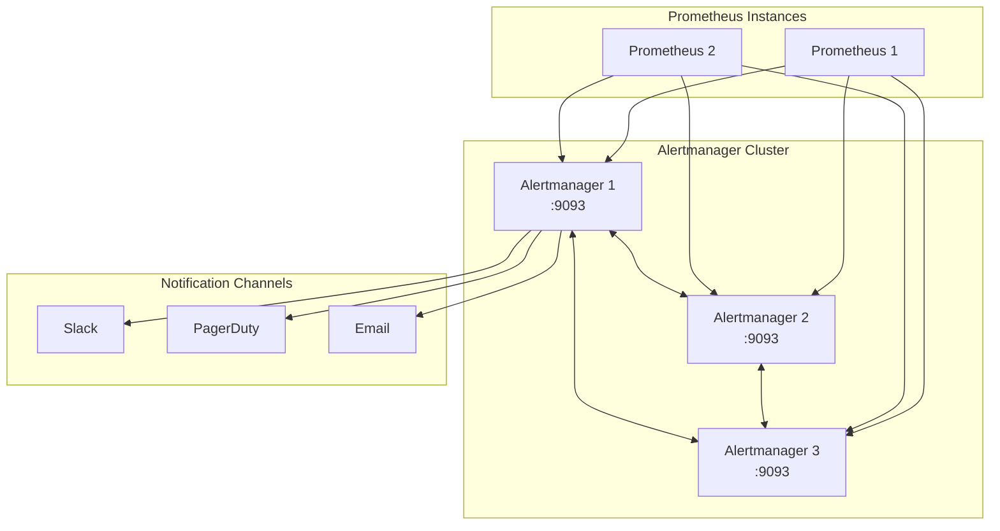

# How to Implement Alertmanager Clustering

Author: [nawazdhandala](https://www.github.com/nawazdhandala)

Tags: Alertmanager, Prometheus, High Availability, Monitoring, DevOps

Description: Learn how to set up a highly available Alertmanager cluster with peer communication, gossip protocol, and proper deduplication.

---

Running a single Alertmanager instance creates a single point of failure in your alerting pipeline. When that instance goes down, alerts stop flowing and your team loses visibility into production issues. Clustering solves this by running multiple Alertmanager instances that coordinate with each other to ensure alerts are never duplicated or lost.

## How Alertmanager Clustering Works

Alertmanager uses a gossip protocol to synchronize state between cluster members. Each instance maintains its own copy of silences, notification history, and inhibition rules. When one instance receives an alert, it propagates the information to peers so they can coordinate who sends the actual notification.



The cluster elects a leader for each alert group, and only that leader sends notifications. If the leader fails, another instance takes over automatically.

## 1. Configure the First Alertmanager Instance

Start by setting up your primary Alertmanager with cluster settings enabled. The key flags are `--cluster.listen-address` for peer communication and `--cluster.advertise-address` to tell other nodes how to reach this instance.

Create the configuration file first:

`/etc/alertmanager/alertmanager.yml`

```yaml
# Global settings apply to all notification integrations
global:
  # How long to wait before sending a notification about new alerts
  resolve_timeout: 5m

  # SMTP settings for email notifications
  smtp_smarthost: 'smtp.example.com:587'
  smtp_from: 'alertmanager@example.com'
  smtp_auth_username: 'alertmanager@example.com'
  smtp_auth_password: '${SMTP_PASSWORD}'

# Route tree for alert routing
route:
  # Default receiver for alerts that don't match any route
  receiver: 'default-receiver'

  # How long to wait to buffer alerts of the same group
  group_wait: 30s

  # How long to wait before sending notification about new alerts
  # added to a group of alerts that have already been notified
  group_interval: 5m

  # How long to wait before re-sending a notification
  repeat_interval: 4h

  # Labels to group alerts by
  group_by: ['alertname', 'cluster', 'service']

receivers:
  - name: 'default-receiver'
    slack_configs:
      - api_url: '${SLACK_WEBHOOK_URL}'
        channel: '#alerts'
        send_resolved: true
```

Now start the first instance with cluster flags:

```bash
# Start the first Alertmanager instance with clustering enabled
# --cluster.listen-address: Port for peer-to-peer communication (gossip)
# --cluster.advertise-address: Address other peers will use to connect
alertmanager \
  --config.file=/etc/alertmanager/alertmanager.yml \
  --storage.path=/var/lib/alertmanager \
  --web.listen-address=":9093" \
  --cluster.listen-address="0.0.0.0:9094" \
  --cluster.advertise-address="alertmanager-1.example.com:9094"
```

## 2. Add Additional Cluster Members

For the second and third instances, you need to specify at least one existing peer using `--cluster.peer`. The gossip protocol will discover all other members automatically.

```bash
# Start the second Alertmanager instance
# --cluster.peer: Connect to an existing cluster member
alertmanager \
  --config.file=/etc/alertmanager/alertmanager.yml \
  --storage.path=/var/lib/alertmanager \
  --web.listen-address=":9093" \
  --cluster.listen-address="0.0.0.0:9094" \
  --cluster.advertise-address="alertmanager-2.example.com:9094" \
  --cluster.peer="alertmanager-1.example.com:9094"
```

```bash
# Start the third Alertmanager instance
# Multiple --cluster.peer flags provide redundancy during startup
alertmanager \
  --config.file=/etc/alertmanager/alertmanager.yml \
  --storage.path=/var/lib/alertmanager \
  --web.listen-address=":9093" \
  --cluster.listen-address="0.0.0.0:9094" \
  --cluster.advertise-address="alertmanager-3.example.com:9094" \
  --cluster.peer="alertmanager-1.example.com:9094" \
  --cluster.peer="alertmanager-2.example.com:9094"
```

## 3. Deploy on Kubernetes with StatefulSet

For Kubernetes deployments, use a StatefulSet to give each pod a stable network identity. This makes peer discovery straightforward using headless services.

`alertmanager-statefulset.yaml`

```yaml
apiVersion: v1
kind: Service
metadata:
  name: alertmanager-cluster
  namespace: monitoring
  labels:
    app: alertmanager
spec:
  # Headless service for peer discovery
  clusterIP: None
  selector:
    app: alertmanager
  ports:
    - name: web
      port: 9093
      targetPort: 9093
    - name: cluster
      port: 9094
      targetPort: 9094
---
apiVersion: v1
kind: Service
metadata:
  name: alertmanager
  namespace: monitoring
spec:
  # Regular service for external access
  selector:
    app: alertmanager
  ports:
    - name: web
      port: 9093
      targetPort: 9093
---
apiVersion: apps/v1
kind: StatefulSet
metadata:
  name: alertmanager
  namespace: monitoring
spec:
  serviceName: alertmanager-cluster
  replicas: 3
  selector:
    matchLabels:
      app: alertmanager
  template:
    metadata:
      labels:
        app: alertmanager
    spec:
      containers:
        - name: alertmanager
          image: prom/alertmanager:v0.27.0
          args:
            - '--config.file=/etc/alertmanager/alertmanager.yml'
            - '--storage.path=/alertmanager'
            - '--web.listen-address=:9093'
            - '--cluster.listen-address=0.0.0.0:9094'
            # Use pod name for advertise address via downward API
            - '--cluster.advertise-address=$(POD_NAME).alertmanager-cluster.monitoring.svc.cluster.local:9094'
            # Peer with the first pod - gossip handles the rest
            - '--cluster.peer=alertmanager-0.alertmanager-cluster.monitoring.svc.cluster.local:9094'
          env:
            - name: POD_NAME
              valueFrom:
                fieldRef:
                  fieldPath: metadata.name
          ports:
            - containerPort: 9093
              name: web
            - containerPort: 9094
              name: cluster
          volumeMounts:
            - name: config
              mountPath: /etc/alertmanager
            - name: storage
              mountPath: /alertmanager
          livenessProbe:
            httpGet:
              path: /-/healthy
              port: 9093
            initialDelaySeconds: 30
            periodSeconds: 10
          readinessProbe:
            httpGet:
              path: /-/ready
              port: 9093
            initialDelaySeconds: 5
            periodSeconds: 5
      volumes:
        - name: config
          configMap:
            name: alertmanager-config
  volumeClaimTemplates:
    - metadata:
        name: storage
      spec:
        accessModes: ["ReadWriteOnce"]
        resources:
          requests:
            storage: 10Gi
```

Apply the StatefulSet:

```bash
# Create the namespace if it doesn't exist
kubectl create namespace monitoring --dry-run=client -o yaml | kubectl apply -f -

# Apply the StatefulSet configuration
kubectl apply -f alertmanager-statefulset.yaml

# Wait for all pods to be ready
kubectl rollout status statefulset/alertmanager -n monitoring
```

## 4. Configure Prometheus to Send Alerts

Update your Prometheus configuration to send alerts to all Alertmanager instances. This provides redundancy - if one Alertmanager is unreachable, others will still receive the alert.

`prometheus.yml`

```yaml
# Alertmanager configuration in Prometheus
alerting:
  alertmanagers:
    - static_configs:
        - targets:
            - 'alertmanager-1.example.com:9093'
            - 'alertmanager-2.example.com:9093'
            - 'alertmanager-3.example.com:9093'
      # Timeout for requests to Alertmanager
      timeout: 10s
      # API version (v2 is current)
      api_version: v2
```

For Kubernetes with service discovery:

```yaml
alerting:
  alertmanagers:
    - kubernetes_sd_configs:
        - role: endpoints
          namespaces:
            names:
              - monitoring
      relabel_configs:
        # Keep only alertmanager endpoints
        - source_labels: [__meta_kubernetes_service_name]
          regex: alertmanager
          action: keep
        - source_labels: [__meta_kubernetes_endpoint_port_name]
          regex: web
          action: keep
```

## 5. Verify Cluster Status

Check that all instances have joined the cluster and can communicate:

```bash
# Query cluster status via the API
curl -s http://alertmanager-1.example.com:9093/api/v2/status | jq '.cluster'
```

Expected output shows all peers:

```json
{
  "name": "alertmanager-1.example.com:9094",
  "status": "ready",
  "peers": [
    {
      "name": "alertmanager-1.example.com:9094",
      "address": "10.0.0.1:9094"
    },
    {
      "name": "alertmanager-2.example.com:9094",
      "address": "10.0.0.2:9094"
    },
    {
      "name": "alertmanager-3.example.com:9094",
      "address": "10.0.0.3:9094"
    }
  ]
}
```

You can also check the web UI at `http://alertmanager:9093/#/status` to see cluster members.

## 6. Test Failover Behavior

Simulate a failure to verify the cluster handles it correctly:

```bash
# On Kubernetes, delete one pod
kubectl delete pod alertmanager-1 -n monitoring

# Watch the cluster recover
kubectl get pods -n monitoring -l app=alertmanager -w

# Verify alerts still flow by checking another instance
curl -s http://alertmanager-2.example.com:9093/api/v2/alerts | jq length
```

During the test, fire a test alert and verify notifications arrive exactly once:

```bash
# Send a test alert to any cluster member
curl -X POST http://alertmanager-2.example.com:9093/api/v2/alerts \
  -H "Content-Type: application/json" \
  -d '[{
    "labels": {
      "alertname": "ClusterFailoverTest",
      "severity": "warning",
      "cluster": "production"
    },
    "annotations": {
      "summary": "Testing cluster failover"
    }
  }]'
```

## 7. Tune Cluster Settings

For geographically distributed clusters or high-latency networks, adjust these settings:

```bash
alertmanager \
  --config.file=/etc/alertmanager/alertmanager.yml \
  # Increase gossip interval for high-latency networks
  --cluster.gossip-interval=500ms \
  # Increase pushpull interval for WAN clusters
  --cluster.pushpull-interval=2m \
  # Increase probe timeout for slower networks
  --cluster.probe-timeout=1s \
  # Increase probe interval
  --cluster.probe-interval=2s \
  # Set TCP timeout for peer connections
  --cluster.tcp-timeout=15s \
  # Other standard flags...
  --cluster.listen-address="0.0.0.0:9094" \
  --cluster.peer="alertmanager-1.example.com:9094"
```

---

A properly configured Alertmanager cluster ensures your alerting pipeline remains operational even when individual instances fail. Start with three instances for production workloads, configure all Prometheus instances to send alerts to every Alertmanager, and monitor the cluster health metrics to catch issues before they impact alert delivery.
