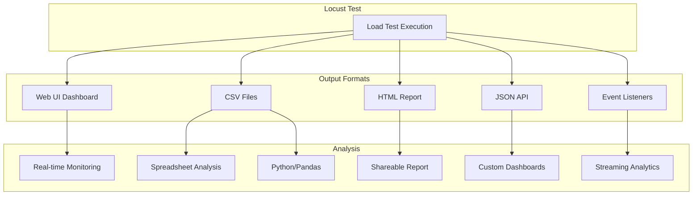
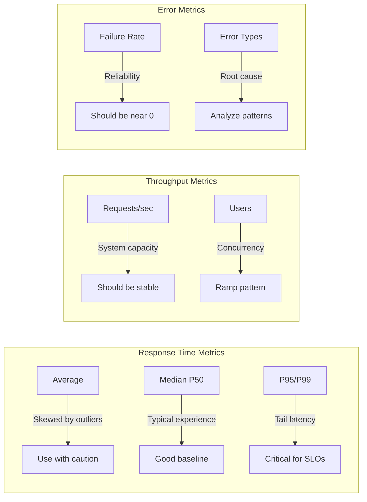

# How to Analyze Locust Test Results

Author: [nawazdhandala](https://www.github.com/nawazdhandala)

Tags: Locust, Performance Analysis, Load Testing, Metrics, Reporting, Data Visualization

Description: Learn how to effectively analyze Locust test results using built-in reports, CSV exports, and custom analysis techniques.

---

Running a load test is only half the battle. The real value comes from analyzing results to understand system behavior, identify bottlenecks, and make data-driven decisions about performance. Locust provides multiple output formats, and knowing how to interpret each one is essential for effective performance testing.

This guide covers Locust's built-in reporting, CSV analysis, statistical interpretation, and techniques for identifying performance issues from test data.

---

## Understanding Locust Output Formats

Locust provides several ways to access test results:



---

## Web UI Metrics Explained

The Locust web UI displays real-time metrics. Understanding each metric is crucial:

**Statistics Tab:**
- **Requests**: Total number of requests made
- **Fails**: Number of failed requests
- **Median**: 50th percentile response time
- **90%ile**: 90th percentile response time
- **Average**: Mean response time (skewed by outliers)
- **Min/Max**: Fastest and slowest responses
- **Avg Size**: Average response body size in bytes
- **Current RPS**: Requests per second right now
- **Current Failures/s**: Failure rate per second

**Charts Tab:**
- **Total Requests per Second**: Overall throughput
- **Response Times**: Percentile trends over time
- **Number of Users**: User count over time

```python
# locustfile.py - Access stats programmatically
from locust import HttpUser, task, between, events

@events.test_stop.add_listener
def analyze_results(environment, **kwargs):
    """Analyze results when test completes."""

    # Access overall statistics
    total_stats = environment.stats.total

    print("\n=== Overall Statistics ===")
    print(f"Total Requests: {total_stats.num_requests}")
    print(f"Total Failures: {total_stats.num_failures}")
    print(f"Average Response Time: {total_stats.avg_response_time:.2f}ms")
    print(f"Min Response Time: {total_stats.min_response_time}ms")
    print(f"Max Response Time: {total_stats.max_response_time}ms")
    print(f"Requests/sec: {total_stats.total_rps:.2f}")

    # Percentiles
    print("\n=== Response Time Percentiles ===")
    for percentile in [0.50, 0.75, 0.90, 0.95, 0.99]:
        value = total_stats.get_response_time_percentile(percentile)
        print(f"P{int(percentile*100)}: {value:.0f}ms")

    # Per-endpoint statistics
    print("\n=== Per-Endpoint Statistics ===")
    for name, stats in environment.stats.entries.items():
        method = stats.method
        print(f"\n{method} {name}:")
        print(f"  Requests: {stats.num_requests}")
        print(f"  Failures: {stats.num_failures}")
        print(f"  Avg: {stats.avg_response_time:.0f}ms")
        print(f"  P95: {stats.get_response_time_percentile(0.95):.0f}ms")

class ApiUser(HttpUser):
    wait_time = between(1, 2)

    @task(3)
    def get_data(self):
        self.client.get("/api/data")

    @task(1)
    def post_data(self):
        self.client.post("/api/data", json={"key": "value"})
```

---

## CSV File Analysis

Locust exports three CSV files when using `--csv=prefix`:

```bash
locust --headless --csv=results --run-time=5m
# Creates:
#   results_stats.csv        - Final aggregated statistics
#   results_stats_history.csv - Time-series data (every second)
#   results_failures.csv     - Failure details
```

**Analyzing with Python/Pandas:**

```python
# analyze_results.py - Comprehensive CSV analysis
import pandas as pd
import matplotlib.pyplot as plt
from datetime import datetime

def analyze_locust_results(csv_prefix):
    """Analyze Locust CSV output files."""

    # Load statistics
    stats = pd.read_csv(f"{csv_prefix}_stats.csv")
    history = pd.read_csv(f"{csv_prefix}_stats_history.csv")

    try:
        failures = pd.read_csv(f"{csv_prefix}_failures.csv")
    except FileNotFoundError:
        failures = pd.DataFrame()

    print("=" * 60)
    print("LOCUST TEST ANALYSIS REPORT")
    print("=" * 60)

    # Overall summary (Aggregated row)
    total = stats[stats['Name'] == 'Aggregated'].iloc[0]

    print("\n### Overall Summary ###")
    print(f"Total Requests: {total['Request Count']:,.0f}")
    print(f"Failed Requests: {total['Failure Count']:,.0f}")
    print(f"Failure Rate: {total['Failure Count']/total['Request Count']*100:.2f}%")
    print(f"Average Response Time: {total['Average Response Time']:.0f}ms")
    print(f"Median Response Time: {total['Median Response Time']:.0f}ms")
    print(f"P90 Response Time: {total['90%']:.0f}ms")
    print(f"P95 Response Time: {total['95%']:.0f}ms")
    print(f"P99 Response Time: {total['99%']:.0f}ms")
    print(f"Requests/sec: {total['Requests/s']:.2f}")

    # Per-endpoint analysis
    print("\n### Endpoint Performance ###")
    endpoints = stats[stats['Name'] != 'Aggregated'].sort_values('Average Response Time', ascending=False)

    for _, row in endpoints.iterrows():
        print(f"\n{row['Type']} {row['Name']}:")
        print(f"  Requests: {row['Request Count']:,.0f}")
        print(f"  Failure Rate: {row['Failure Count']/row['Request Count']*100:.2f}%")
        print(f"  Avg: {row['Average Response Time']:.0f}ms | P95: {row['95%']:.0f}ms | P99: {row['99%']:.0f}ms")

    # Identify slowest endpoints
    print("\n### Slowest Endpoints (by P95) ###")
    slowest = endpoints.nlargest(5, '95%')[['Type', 'Name', 'Average Response Time', '95%', '99%']]
    print(slowest.to_string(index=False))

    # Identify highest failure endpoints
    if endpoints['Failure Count'].sum() > 0:
        print("\n### Endpoints with Failures ###")
        failed = endpoints[endpoints['Failure Count'] > 0][['Type', 'Name', 'Request Count', 'Failure Count']]
        failed['Failure %'] = failed['Failure Count'] / failed['Request Count'] * 100
        print(failed.to_string(index=False))

    # Time-series analysis
    print("\n### Performance Over Time ###")
    history['Timestamp'] = pd.to_datetime(history['Timestamp'], unit='s')

    # Calculate trends
    first_half = history.iloc[:len(history)//2]
    second_half = history.iloc[len(history)//2:]

    print(f"First Half Avg Response: {first_half['Total Average Response Time'].mean():.0f}ms")
    print(f"Second Half Avg Response: {second_half['Total Average Response Time'].mean():.0f}ms")

    trend = second_half['Total Average Response Time'].mean() - first_half['Total Average Response Time'].mean()
    if trend > 10:
        print(f"WARNING: Response times degraded by {trend:.0f}ms over test duration")

    # Failure analysis
    if not failures.empty:
        print("\n### Failure Analysis ###")
        print(failures.groupby('Error').size().sort_values(ascending=False).head(10))

    return stats, history, failures

def plot_results(csv_prefix, output_file="analysis.png"):
    """Generate visualization of test results."""

    history = pd.read_csv(f"{csv_prefix}_stats_history.csv")
    history['Timestamp'] = pd.to_datetime(history['Timestamp'], unit='s')

    fig, axes = plt.subplots(3, 1, figsize=(12, 10))

    # Plot 1: Response Times
    ax1 = axes[0]
    ax1.plot(history['Timestamp'], history['Total Average Response Time'], label='Average', alpha=0.7)
    ax1.plot(history['Timestamp'], history['Total Median Response Time'], label='Median', alpha=0.7)
    if '95%' in history.columns:
        ax1.plot(history['Timestamp'], history['Total 95%'], label='P95', alpha=0.7)
    ax1.set_ylabel('Response Time (ms)')
    ax1.set_title('Response Times Over Time')
    ax1.legend()
    ax1.grid(True, alpha=0.3)

    # Plot 2: Throughput
    ax2 = axes[1]
    ax2.plot(history['Timestamp'], history['Requests/s'], label='Requests/s', color='green')
    ax2.set_ylabel('Requests per Second')
    ax2.set_title('Throughput Over Time')
    ax2.legend()
    ax2.grid(True, alpha=0.3)

    # Plot 3: User Count and Failures
    ax3 = axes[2]
    ax3.plot(history['Timestamp'], history['User Count'], label='Users', color='blue')
    ax3_twin = ax3.twinx()
    ax3_twin.plot(history['Timestamp'], history['Failures/s'], label='Failures/s', color='red', alpha=0.7)
    ax3.set_ylabel('User Count')
    ax3_twin.set_ylabel('Failures/s')
    ax3.set_title('Users and Failures Over Time')
    ax3.legend(loc='upper left')
    ax3_twin.legend(loc='upper right')
    ax3.grid(True, alpha=0.3)

    plt.tight_layout()
    plt.savefig(output_file, dpi=150)
    print(f"\nVisualization saved to {output_file}")

if __name__ == "__main__":
    import sys
    prefix = sys.argv[1] if len(sys.argv) > 1 else "results"
    analyze_locust_results(prefix)
    plot_results(prefix)
```

---

## Key Metrics to Watch



**What good results look like:**
- Response times stable or slowly increasing with load
- Throughput scales linearly with users until saturation
- Failure rate below 1% (ideally 0%)
- P95/P99 within acceptable SLO bounds

**Warning signs:**
- Response times spike suddenly
- Throughput plateaus while users increase
- Failure rate increases with load
- High variance between average and P99

---

## Identifying Performance Patterns

### Pattern 1: Linear Scaling
```
Users:      10    20    30    40    50
RPS:       100   200   300   400   500
Avg RT:     50    52    55    58    60
```
Good: System scales linearly with load.

### Pattern 2: Saturation Point
```
Users:      10    20    30    40    50
RPS:       100   200   280   290   295
Avg RT:     50    55   100   500  2000
```
Problem: System saturates around 30 users. Database, CPU, or connection pool exhausted.

### Pattern 3: Memory Leak
```
Time:      1m    2m    3m    4m    5m
Avg RT:    50    60    80   120   250
Failures:   0     0     1     5    50
```
Problem: Performance degrades over time. Likely memory leak or resource exhaustion.

### Pattern 4: Intermittent Failures
```
Time:      1m    2m    3m    4m    5m
Avg RT:    50    50   500    50    50
Failures:   0     0    100    0     0
```
Problem: Periodic spikes. Could be garbage collection, cache invalidation, or external dependency.

---

## Comparative Analysis

Compare results across test runs:

```python
# compare_results.py - Compare multiple test runs
import pandas as pd
import sys

def compare_runs(baseline_csv, current_csv):
    """Compare two Locust test runs."""

    baseline = pd.read_csv(baseline_csv)
    current = pd.read_csv(current_csv)

    # Get aggregated rows
    base_total = baseline[baseline['Name'] == 'Aggregated'].iloc[0]
    curr_total = current[current['Name'] == 'Aggregated'].iloc[0]

    print("=" * 60)
    print("PERFORMANCE COMPARISON REPORT")
    print("=" * 60)

    metrics = [
        ('Average Response Time', 'Average Response Time', 'ms', 'lower'),
        ('P95 Response Time', '95%', 'ms', 'lower'),
        ('P99 Response Time', '99%', 'ms', 'lower'),
        ('Requests/sec', 'Requests/s', 'rps', 'higher'),
        ('Failure Rate', None, '%', 'lower')  # Calculated
    ]

    results = []

    for name, col, unit, better in metrics:
        if col:
            base_val = base_total[col]
            curr_val = curr_total[col]
        else:
            # Calculate failure rate
            base_val = base_total['Failure Count'] / base_total['Request Count'] * 100
            curr_val = curr_total['Failure Count'] / curr_total['Request Count'] * 100

        change = ((curr_val - base_val) / base_val) * 100 if base_val > 0 else 0

        if better == 'lower':
            status = 'BETTER' if change < -5 else ('WORSE' if change > 5 else 'SAME')
        else:
            status = 'BETTER' if change > 5 else ('WORSE' if change < -5 else 'SAME')

        print(f"\n{name}:")
        print(f"  Baseline: {base_val:.2f} {unit}")
        print(f"  Current:  {curr_val:.2f} {unit}")
        print(f"  Change:   {change:+.1f}% [{status}]")

        results.append({
            'metric': name,
            'baseline': base_val,
            'current': curr_val,
            'change_pct': change,
            'status': status
        })

    # Summary
    worse_count = sum(1 for r in results if r['status'] == 'WORSE')
    better_count = sum(1 for r in results if r['status'] == 'BETTER')

    print("\n" + "=" * 60)
    if worse_count > 0:
        print(f"REGRESSION DETECTED: {worse_count} metrics degraded")
    elif better_count > 0:
        print(f"IMPROVEMENT: {better_count} metrics improved")
    else:
        print("NO SIGNIFICANT CHANGE")

    return results

if __name__ == "__main__":
    baseline = sys.argv[1]
    current = sys.argv[2]
    compare_runs(baseline, current)
```

---

## HTML Report Analysis

Generate comprehensive HTML reports:

```bash
locust --headless --html=report.html --run-time=5m
```

The HTML report includes:
- Summary statistics table
- Response time distribution chart
- Requests per second chart
- Number of users chart
- Failure information

For custom HTML reports:

```python
# custom_report.py - Generate custom HTML report
from locust import HttpUser, task, events
import json
from datetime import datetime

class ReportGenerator:
    def __init__(self):
        self.history = []
        self.start_time = None

    def record(self, stats, user_count):
        self.history.append({
            'timestamp': datetime.utcnow().isoformat(),
            'user_count': user_count,
            'total_requests': stats.num_requests,
            'total_failures': stats.num_failures,
            'avg_response_time': stats.avg_response_time,
            'p95': stats.get_response_time_percentile(0.95),
            'rps': stats.total_rps
        })

    def generate_html(self, environment, filename='custom_report.html'):
        stats = environment.stats.total

        html = f"""
<!DOCTYPE html>
<html>
<head>
    <title>Load Test Report</title>
    <script src="https://cdn.jsdelivr.net/npm/chart.js"></script>
    <style>
        body {{ font-family: Arial, sans-serif; margin: 20px; }}
        .metric {{ display: inline-block; margin: 10px; padding: 20px; background: #f5f5f5; border-radius: 8px; }}
        .metric-value {{ font-size: 24px; font-weight: bold; }}
        .metric-label {{ color: #666; }}
        .chart-container {{ width: 800px; height: 400px; margin: 20px 0; }}
    </style>
</head>
<body>
    <h1>Load Test Report</h1>
    <p>Generated: {datetime.utcnow().strftime('%Y-%m-%d %H:%M:%S')} UTC</p>
    <p>Target: {environment.host}</p>

    <h2>Summary</h2>
    <div class="metric">
        <div class="metric-value">{stats.num_requests:,}</div>
        <div class="metric-label">Total Requests</div>
    </div>
    <div class="metric">
        <div class="metric-value">{stats.num_failures:,}</div>
        <div class="metric-label">Failures</div>
    </div>
    <div class="metric">
        <div class="metric-value">{stats.avg_response_time:.0f}ms</div>
        <div class="metric-label">Avg Response</div>
    </div>
    <div class="metric">
        <div class="metric-value">{stats.get_response_time_percentile(0.95):.0f}ms</div>
        <div class="metric-label">P95 Response</div>
    </div>
    <div class="metric">
        <div class="metric-value">{stats.total_rps:.1f}</div>
        <div class="metric-label">Requests/sec</div>
    </div>

    <h2>Response Time Over Time</h2>
    <div class="chart-container">
        <canvas id="responseChart"></canvas>
    </div>

    <script>
        const data = {json.dumps(self.history)};

        new Chart(document.getElementById('responseChart'), {{
            type: 'line',
            data: {{
                labels: data.map(d => new Date(d.timestamp).toLocaleTimeString()),
                datasets: [{{
                    label: 'Avg Response Time (ms)',
                    data: data.map(d => d.avg_response_time),
                    borderColor: 'blue',
                    fill: false
                }}, {{
                    label: 'P95 Response Time (ms)',
                    data: data.map(d => d.p95),
                    borderColor: 'orange',
                    fill: false
                }}]
            }},
            options: {{
                responsive: true,
                maintainAspectRatio: false
            }}
        }});
    </script>
</body>
</html>
"""
        with open(filename, 'w') as f:
            f.write(html)
        print(f"Report saved to {filename}")

report = ReportGenerator()

@events.test_start.add_listener
def on_start(environment, **kwargs):
    report.start_time = datetime.utcnow()

# Record stats periodically (simplified - in practice use a timer)
@events.request.add_listener
def on_request(request_type, name, response_time, **kwargs):
    # Record every 100 requests
    pass

@events.test_stop.add_listener
def on_stop(environment, **kwargs):
    report.generate_html(environment)

class ApiUser(HttpUser):
    wait_time = between(1, 2)

    @task
    def api_request(self):
        self.client.get("/api/data")
```

---

## Automated Analysis Checks

Build automated checks for CI/CD:

```python
# check_results.py - Automated result validation
import pandas as pd
import sys
import json

def check_results(csv_prefix, thresholds_file=None):
    """Check results against thresholds."""

    # Default thresholds
    thresholds = {
        'max_failure_rate': 1.0,
        'max_avg_response': 500,
        'max_p95_response': 1000,
        'max_p99_response': 2000,
        'min_rps': 50
    }

    # Load custom thresholds if provided
    if thresholds_file:
        with open(thresholds_file) as f:
            thresholds.update(json.load(f))

    stats = pd.read_csv(f"{csv_prefix}_stats.csv")
    total = stats[stats['Name'] == 'Aggregated'].iloc[0]

    failure_rate = total['Failure Count'] / total['Request Count'] * 100

    checks = [
        ('Failure Rate', failure_rate, thresholds['max_failure_rate'], 'below'),
        ('Average Response Time', total['Average Response Time'], thresholds['max_avg_response'], 'below'),
        ('P95 Response Time', total['95%'], thresholds['max_p95_response'], 'below'),
        ('P99 Response Time', total['99%'], thresholds['max_p99_response'], 'below'),
        ('Requests/sec', total['Requests/s'], thresholds['min_rps'], 'above')
    ]

    passed = True
    results = []

    print("=" * 60)
    print("THRESHOLD CHECK RESULTS")
    print("=" * 60)

    for name, value, threshold, direction in checks:
        if direction == 'below':
            check_passed = value <= threshold
            symbol = '<='
        else:
            check_passed = value >= threshold
            symbol = '>='

        status = 'PASS' if check_passed else 'FAIL'
        if not check_passed:
            passed = False

        print(f"{status}: {name} = {value:.2f} (threshold: {symbol} {threshold})")
        results.append({'check': name, 'value': value, 'threshold': threshold, 'passed': check_passed})

    print("=" * 60)
    print(f"OVERALL: {'PASSED' if passed else 'FAILED'}")

    # Return exit code for CI/CD
    return 0 if passed else 1

if __name__ == "__main__":
    prefix = sys.argv[1] if len(sys.argv) > 1 else "results"
    thresholds = sys.argv[2] if len(sys.argv) > 2 else None
    exit_code = check_results(prefix, thresholds)
    sys.exit(exit_code)
```

---

Effective analysis turns raw numbers into actionable insights. Focus on percentiles over averages, watch for degradation patterns over time, and always compare against baselines. Automate threshold checks for CI/CD integration, but invest time in manual analysis for complex performance issues. The goal is not just to know if the test passed, but to understand system behavior under load and identify optimization opportunities before they become production problems.

---

OneUptime complements Locust analysis by providing continuous production monitoring. Compare your load test baselines against real-world performance data to validate that synthetic tests accurately reflect production behavior.
