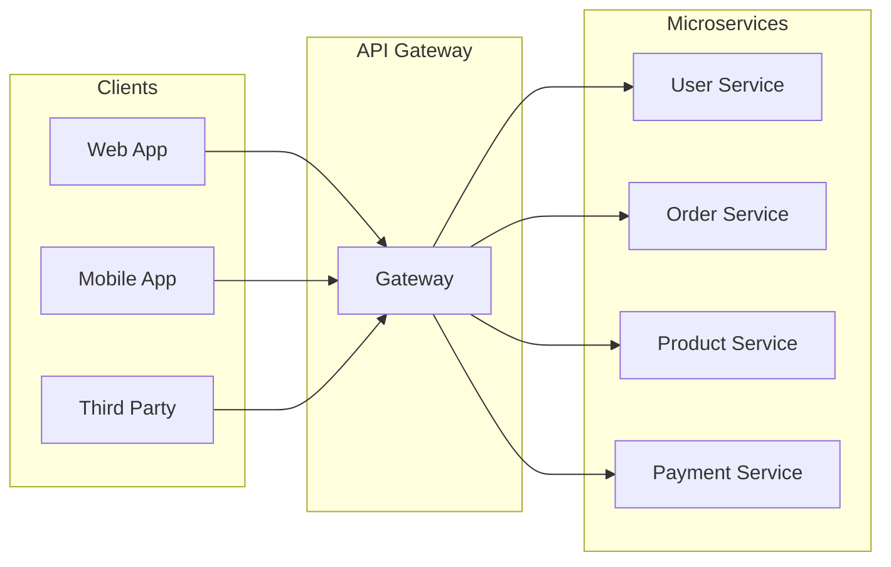
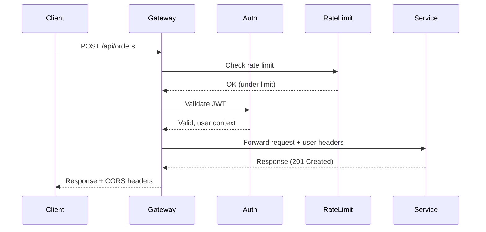
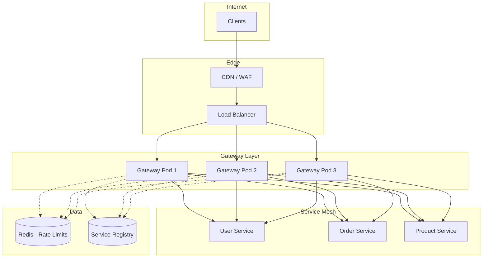

# How to Use API Gateway for Microservices

Author: [nawazdhandala](https://www.github.com/nawazdhandala)

Tags: API Gateway, Microservices, API Management, Architecture, DevOps, Node.js, Kong

Description: A practical guide to implementing API gateways in microservices architectures, covering routing, authentication, rate limiting, and observability patterns.

---

An API gateway sits between your clients and your microservices, acting as the single entry point for all requests. Without one, clients must know about every service endpoint, handle authentication differently for each service, and manage retries and timeouts on their own. The gateway centralizes these concerns, giving you one place to enforce security policies, transform requests, and collect telemetry.

This guide walks through building and configuring an API gateway for microservices. We will cover both custom implementations and production-ready solutions like Kong, with practical code examples you can adapt to your stack.

## Why Your Microservices Need an API Gateway

When you break a monolith into microservices, you create new problems:

- **Service discovery:** Clients must know where each service lives
- **Cross-cutting concerns:** Authentication, logging, and rate limiting get duplicated
- **Protocol translation:** Internal services might use gRPC while clients expect REST
- **Response aggregation:** Mobile clients often need data from multiple services in one call

The API gateway solves these by providing a unified interface. Clients talk to one endpoint; the gateway routes requests to the right services.



## Building a Basic API Gateway with Node.js

Before reaching for a full solution like Kong or AWS API Gateway, understanding the core patterns helps you make better architectural decisions. Here is a minimal gateway in Node.js:

```javascript
// gateway.js - A minimal API gateway
const express = require('express');
const { createProxyMiddleware } = require('http-proxy-middleware');
const rateLimit = require('express-rate-limit');

const app = express();

// Service registry - in production, use Consul or etcd
const services = {
  users: 'http://user-service:3001',
  orders: 'http://order-service:3002',
  products: 'http://product-service:3003'
};

// Rate limiting - 100 requests per minute per IP
const limiter = rateLimit({
  windowMs: 60 * 1000,
  max: 100,
  message: { error: 'Too many requests, please try again later' }
});

app.use(limiter);

// Request logging middleware
app.use((req, res, next) => {
  const start = Date.now();
  res.on('finish', () => {
    const duration = Date.now() - start;
    console.log(`${req.method} ${req.path} ${res.statusCode} ${duration}ms`);
  });
  next();
});

// Route to appropriate microservice
Object.entries(services).forEach(([name, target]) => {
  app.use(`/api/${name}`, createProxyMiddleware({
    target,
    changeOrigin: true,
    pathRewrite: { [`^/api/${name}`]: '' },
    onError: (err, req, res) => {
      res.status(503).json({ error: `Service ${name} unavailable` });
    }
  }));
});

// Health check endpoint
app.get('/health', (req, res) => {
  res.json({ status: 'healthy', timestamp: new Date().toISOString() });
});

app.listen(3000, () => {
  console.log('API Gateway running on port 3000');
});
```

This basic gateway handles routing and rate limiting. For production, you need authentication, circuit breaking, and proper observability.

## Authentication at the Gateway

Validating tokens at the gateway means your microservices can trust incoming requests without re-implementing auth logic. Here is JWT validation middleware:

```javascript
// auth-middleware.js
const jwt = require('jsonwebtoken');

const PUBLIC_PATHS = ['/api/auth/login', '/api/auth/register', '/health'];

function authMiddleware(req, res, next) {
  // Skip auth for public endpoints
  if (PUBLIC_PATHS.some(path => req.path.startsWith(path))) {
    return next();
  }

  const authHeader = req.headers.authorization;
  if (!authHeader || !authHeader.startsWith('Bearer ')) {
    return res.status(401).json({ error: 'Missing or invalid authorization header' });
  }

  const token = authHeader.substring(7);

  try {
    const decoded = jwt.verify(token, process.env.JWT_SECRET);

    // Forward user context to downstream services
    req.headers['x-user-id'] = decoded.userId;
    req.headers['x-user-roles'] = decoded.roles.join(',');

    next();
  } catch (err) {
    if (err.name === 'TokenExpiredError') {
      return res.status(401).json({ error: 'Token expired' });
    }
    return res.status(401).json({ error: 'Invalid token' });
  }
}

module.exports = authMiddleware;
```

The gateway strips the JWT and forwards user context via headers. Downstream services trust these headers because they only accept traffic from the gateway.

## Request Flow Through the Gateway

Understanding the request lifecycle helps you debug issues and optimize performance:



## Circuit Breaking for Resilience

When a downstream service fails, you do not want to keep hammering it with requests. Circuit breakers prevent cascade failures:

```javascript
// circuit-breaker.js
class CircuitBreaker {
  constructor(options = {}) {
    this.failureThreshold = options.failureThreshold || 5;
    this.resetTimeout = options.resetTimeout || 30000;
    this.state = 'CLOSED';
    this.failures = 0;
    this.lastFailureTime = null;
  }

  async execute(fn) {
    if (this.state === 'OPEN') {
      // Check if we should try again
      if (Date.now() - this.lastFailureTime > this.resetTimeout) {
        this.state = 'HALF_OPEN';
      } else {
        throw new Error('Circuit breaker is OPEN');
      }
    }

    try {
      const result = await fn();
      this.onSuccess();
      return result;
    } catch (err) {
      this.onFailure();
      throw err;
    }
  }

  onSuccess() {
    this.failures = 0;
    this.state = 'CLOSED';
  }

  onFailure() {
    this.failures++;
    this.lastFailureTime = Date.now();

    if (this.failures >= this.failureThreshold) {
      this.state = 'OPEN';
      console.log(`Circuit breaker opened after ${this.failures} failures`);
    }
  }
}

// Usage with the proxy
const breakers = {};

function getBreaker(serviceName) {
  if (!breakers[serviceName]) {
    breakers[serviceName] = new CircuitBreaker({
      failureThreshold: 5,
      resetTimeout: 30000
    });
  }
  return breakers[serviceName];
}

module.exports = { CircuitBreaker, getBreaker };
```

## Using Kong as Your API Gateway

For production deployments, Kong provides enterprise-grade features out of the box. Here is a declarative configuration:

```yaml
# kong.yml - Declarative configuration
_format_version: "3.0"

services:
  - name: user-service
    url: http://user-service:3001
    routes:
      - name: user-routes
        paths:
          - /api/users
        strip_path: true
    plugins:
      - name: rate-limiting
        config:
          minute: 100
          policy: local

      - name: jwt
        config:
          secret_is_base64: false

      - name: cors
        config:
          origins:
            - https://app.example.com
          methods:
            - GET
            - POST
            - PUT
            - DELETE
          headers:
            - Authorization
            - Content-Type

  - name: order-service
    url: http://order-service:3002
    routes:
      - name: order-routes
        paths:
          - /api/orders
        strip_path: true
    plugins:
      - name: rate-limiting
        config:
          minute: 50
          policy: local

      - name: request-transformer
        config:
          add:
            headers:
              - "X-Request-ID:$(uuid)"

  - name: product-service
    url: http://product-service:3003
    routes:
      - name: product-routes
        paths:
          - /api/products
        strip_path: true
    plugins:
      - name: proxy-cache
        config:
          response_code:
            - 200
          request_method:
            - GET
          content_type:
            - application/json
          cache_ttl: 300

consumers:
  - username: mobile-app
    keyauth_credentials:
      - key: mobile-api-key-here

  - username: web-app
    keyauth_credentials:
      - key: web-api-key-here
```

Deploy Kong with Docker Compose:

```yaml
# docker-compose.yml
version: '3.8'

services:
  kong:
    image: kong:3.4
    environment:
      KONG_DATABASE: "off"
      KONG_DECLARATIVE_CONFIG: /etc/kong/kong.yml
      KONG_PROXY_ACCESS_LOG: /dev/stdout
      KONG_ADMIN_ACCESS_LOG: /dev/stdout
      KONG_PROXY_ERROR_LOG: /dev/stderr
      KONG_ADMIN_ERROR_LOG: /dev/stderr
      KONG_ADMIN_LISTEN: "0.0.0.0:8001"
    ports:
      - "8000:8000"  # Proxy
      - "8001:8001"  # Admin API
    volumes:
      - ./kong.yml:/etc/kong/kong.yml:ro
    healthcheck:
      test: ["CMD", "kong", "health"]
      interval: 10s
      timeout: 5s
      retries: 3
```

## Response Aggregation Pattern

Mobile clients often need data from multiple services. Instead of making clients call each service, the gateway can aggregate responses:

```javascript
// aggregation.js - Combine responses from multiple services
const axios = require('axios');

async function getUserDashboard(userId) {
  const services = {
    user: `http://user-service:3001/users/${userId}`,
    orders: `http://order-service:3002/users/${userId}/orders?limit=5`,
    recommendations: `http://product-service:3003/users/${userId}/recommendations`
  };

  // Fetch all data in parallel
  const results = await Promise.allSettled(
    Object.entries(services).map(async ([name, url]) => {
      const response = await axios.get(url, { timeout: 2000 });
      return { name, data: response.data };
    })
  );

  // Build aggregated response
  const dashboard = {};

  results.forEach((result, index) => {
    const name = Object.keys(services)[index];
    if (result.status === 'fulfilled') {
      dashboard[name] = result.value.data;
    } else {
      // Graceful degradation - return empty data instead of failing
      dashboard[name] = null;
      console.error(`Failed to fetch ${name}: ${result.reason.message}`);
    }
  });

  return dashboard;
}

// Route handler
app.get('/api/dashboard/:userId', async (req, res) => {
  try {
    const dashboard = await getUserDashboard(req.params.userId);
    res.json(dashboard);
  } catch (err) {
    res.status(500).json({ error: 'Failed to load dashboard' });
  }
});
```

## Adding OpenTelemetry for Observability

Distributed tracing is essential for debugging microservices. Here is how to instrument your gateway:

```javascript
// tracing.js - OpenTelemetry setup
const { NodeSDK } = require('@opentelemetry/sdk-node');
const { getNodeAutoInstrumentations } = require('@opentelemetry/auto-instrumentations-node');
const { OTLPTraceExporter } = require('@opentelemetry/exporter-trace-otlp-http');
const { Resource } = require('@opentelemetry/resources');
const { SemanticResourceAttributes } = require('@opentelemetry/semantic-conventions');

const sdk = new NodeSDK({
  resource: new Resource({
    [SemanticResourceAttributes.SERVICE_NAME]: 'api-gateway',
    [SemanticResourceAttributes.SERVICE_VERSION]: '1.0.0',
  }),
  traceExporter: new OTLPTraceExporter({
    url: process.env.OTEL_EXPORTER_OTLP_ENDPOINT || 'http://localhost:4318/v1/traces',
  }),
  instrumentations: [getNodeAutoInstrumentations()],
});

sdk.start();

// Graceful shutdown
process.on('SIGTERM', () => {
  sdk.shutdown()
    .then(() => console.log('Tracing terminated'))
    .catch((error) => console.log('Error terminating tracing', error))
    .finally(() => process.exit(0));
});

module.exports = sdk;
```

Add custom spans for gateway-specific operations:

```javascript
// Custom span for authentication
const { trace } = require('@opentelemetry/api');

const tracer = trace.getTracer('api-gateway');

function authMiddlewareWithTracing(req, res, next) {
  const span = tracer.startSpan('gateway.authenticate');

  try {
    // Your auth logic here
    const token = req.headers.authorization?.substring(7);
    const decoded = jwt.verify(token, process.env.JWT_SECRET);

    span.setAttribute('user.id', decoded.userId);
    span.setAttribute('auth.method', 'jwt');
    span.setStatus({ code: SpanStatusCode.OK });

    next();
  } catch (err) {
    span.recordException(err);
    span.setStatus({ code: SpanStatusCode.ERROR, message: err.message });
    res.status(401).json({ error: 'Unauthorized' });
  } finally {
    span.end();
  }
}
```

## Gateway Deployment Architecture

Here is how a production gateway deployment typically looks:



Key points for production:

- Run multiple gateway instances behind a load balancer
- Use Redis for distributed rate limiting across instances
- Deploy gateways in multiple availability zones
- Keep gateway pods stateless for easy scaling

## Common Pitfalls to Avoid

**1. Gateway becoming a monolith**

Do not add business logic to your gateway. Keep it focused on cross-cutting concerns. If you find yourself writing service-specific code in the gateway, that logic belongs in the service itself.

**2. Single point of failure**

Always run multiple gateway instances. Use health checks and automatic failover. Your gateway should be at least as reliable as your most critical service.

**3. Ignoring latency**

Every millisecond the gateway adds is felt by every request. Profile your middleware, cache authentication decisions when safe, and keep the gateway lightweight.

**4. Over-engineering early**

Start simple. A basic reverse proxy with authentication might be all you need. Add circuit breakers, caching, and aggregation as specific problems arise.

## Monitoring Your Gateway

Track these key metrics:

```javascript
// metrics.js - Prometheus metrics for the gateway
const client = require('prom-client');

// Request duration histogram
const httpRequestDuration = new client.Histogram({
  name: 'gateway_http_request_duration_seconds',
  help: 'Duration of HTTP requests through the gateway',
  labelNames: ['method', 'route', 'status_code', 'service'],
  buckets: [0.01, 0.05, 0.1, 0.5, 1, 2, 5]
});

// Active connections gauge
const activeConnections = new client.Gauge({
  name: 'gateway_active_connections',
  help: 'Number of active connections'
});

// Circuit breaker state
const circuitBreakerState = new client.Gauge({
  name: 'gateway_circuit_breaker_state',
  help: 'Circuit breaker state (0=closed, 1=half-open, 2=open)',
  labelNames: ['service']
});

// Rate limit hits counter
const rateLimitHits = new client.Counter({
  name: 'gateway_rate_limit_hits_total',
  help: 'Total number of rate limited requests',
  labelNames: ['client_id']
});

// Middleware to record metrics
function metricsMiddleware(req, res, next) {
  const start = Date.now();
  activeConnections.inc();

  res.on('finish', () => {
    const duration = (Date.now() - start) / 1000;
    const service = req.path.split('/')[2] || 'unknown';

    httpRequestDuration.observe(
      { method: req.method, route: req.route?.path || req.path, status_code: res.statusCode, service },
      duration
    );
    activeConnections.dec();
  });

  next();
}

module.exports = { metricsMiddleware, rateLimitHits, circuitBreakerState };
```

---

An API gateway simplifies your microservices architecture by centralizing routing, authentication, and observability. Start with the basics - routing and auth - and add complexity as your system grows. Whether you build your own or use Kong, Traefik, or a cloud provider's solution, the patterns remain the same: one entry point, consistent security, and visibility into every request flowing through your system.
