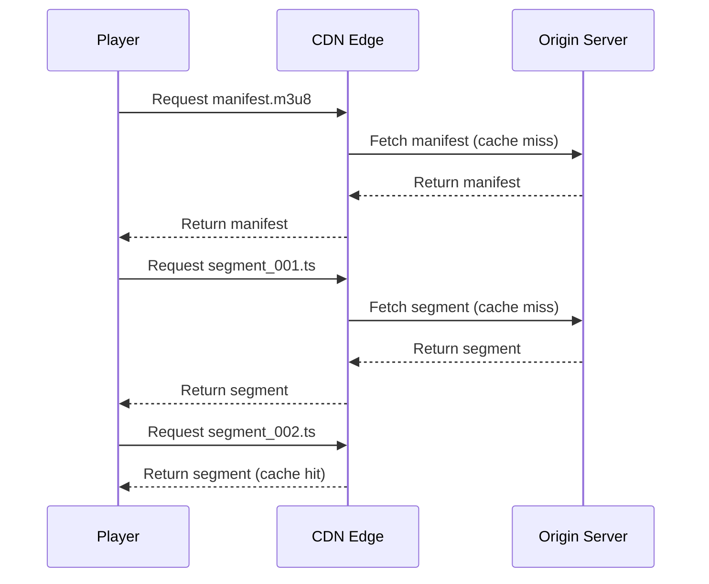
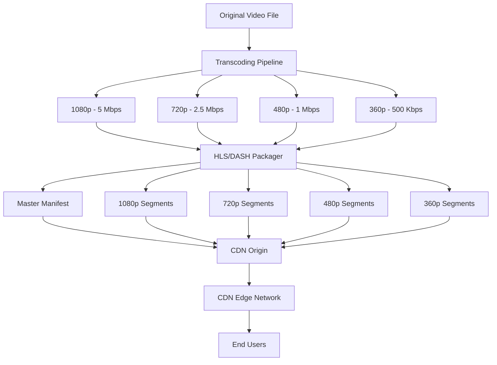
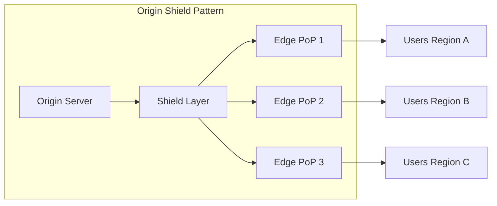

# How to Use CDN for Video Streaming

Author: [nawazdhandala](https://www.github.com/nawazdhandala)

Tags: CDN, Video Streaming, Performance, Networking, HLS, DASH

Description: Learn how to configure and optimize CDN infrastructure for video streaming to deliver smooth playback experiences worldwide.

---

Video streaming has become the dominant form of internet traffic, and delivering smooth playback to users across different regions requires careful infrastructure planning. A Content Delivery Network (CDN) is essential for distributing video content efficiently. This guide covers the practical aspects of setting up CDN for video streaming, from basic configuration to advanced optimization techniques.

## Understanding Video Streaming Protocols

Before diving into CDN configuration, you need to understand how modern video streaming works. The two most common protocols are HLS (HTTP Live Streaming) and DASH (Dynamic Adaptive Streaming over HTTP).

Both protocols work by breaking video into small segments (typically 2-10 seconds) and creating a manifest file that tells the player which segments to fetch. This segmented approach is what makes CDN caching so effective for video.



## Basic CDN Configuration for Video

Here is a basic nginx configuration for an origin server that works well with CDN caching:

```nginx
# Origin server configuration for video streaming
# This configuration sets up proper caching headers for CDN integration

server {
    listen 80;
    server_name origin.example.com;

    # Video segment files - these are immutable once created
    location ~* \.(ts|m4s|mp4|fmp4)$ {
        root /var/www/video;

        # Cache segments for 1 year since they never change
        add_header Cache-Control "public, max-age=31536000, immutable";

        # Enable CORS for cross-origin playback
        add_header Access-Control-Allow-Origin "*";

        # Disable buffering for better streaming performance
        proxy_buffering off;
    }

    # HLS manifest files - these update frequently during live streams
    location ~* \.m3u8$ {
        root /var/www/video;

        # Short cache time for manifests - they update during live streams
        # For VOD content, you can increase this significantly
        add_header Cache-Control "public, max-age=2";

        add_header Access-Control-Allow-Origin "*";
    }

    # DASH manifest files
    location ~* \.mpd$ {
        root /var/www/video;

        # Similar caching strategy as HLS manifests
        add_header Cache-Control "public, max-age=2";

        add_header Access-Control-Allow-Origin "*";
    }
}
```

## CDN Cache Key Configuration

The cache key determines how your CDN identifies unique content. For video streaming, you want to strip unnecessary query parameters while preserving essential ones like authentication tokens.

```python
# Example CDN configuration using Python with a hypothetical CDN API
# This demonstrates the cache key configuration concept

from cdn_provider import CDNConfiguration

def configure_video_cdn():
    config = CDNConfiguration(domain="video.example.com")

    # Define cache key behavior for video content
    config.set_cache_key_rules([
        {
            "path_pattern": "*.ts",
            "include_query_params": [],  # Ignore all query params for segments
            "cache_ttl": 86400 * 365,    # Cache for 1 year
        },
        {
            "path_pattern": "*.m3u8",
            "include_query_params": ["token"],  # Keep auth token in cache key
            "cache_ttl": 5,  # Short TTL for manifests
        },
        {
            "path_pattern": "*.m4s",
            "include_query_params": [],
            "cache_ttl": 86400 * 365,
        }
    ])

    # Enable stale-while-revalidate for better performance
    config.set_stale_behavior(
        stale_while_revalidate=30,  # Serve stale content while fetching fresh
        stale_if_error=3600         # Serve stale content if origin fails
    )

    return config.apply()
```

## Adaptive Bitrate Streaming Setup

A proper video streaming setup requires multiple quality levels. Here is how to structure your content and configure the CDN to handle adaptive bitrate streaming:



Here is an example master HLS manifest that references multiple quality levels:

```
#EXTM3U
#EXT-X-VERSION:3

#EXT-X-STREAM-INF:BANDWIDTH=5000000,RESOLUTION=1920x1080,CODECS="avc1.640028,mp4a.40.2"
1080p/playlist.m3u8

#EXT-X-STREAM-INF:BANDWIDTH=2500000,RESOLUTION=1280x720,CODECS="avc1.64001f,mp4a.40.2"
720p/playlist.m3u8

#EXT-X-STREAM-INF:BANDWIDTH=1000000,RESOLUTION=854x480,CODECS="avc1.4d401e,mp4a.40.2"
480p/playlist.m3u8

#EXT-X-STREAM-INF:BANDWIDTH=500000,RESOLUTION=640x360,CODECS="avc1.42c01e,mp4a.40.2"
360p/playlist.m3u8
```

## Handling Live Streams vs VOD

Live streaming requires different caching strategies than video on demand (VOD). The key difference is that live stream manifests update constantly as new segments are created.

```javascript
// Server-side manifest generation for live streaming
// This example shows how to set proper cache headers dynamically

const express = require('express');
const app = express();

// Middleware to set caching headers based on content type
app.use('/video/:streamType/*', (req, res, next) => {
    const isLive = req.params.streamType === 'live';
    const filePath = req.path;

    if (filePath.endsWith('.m3u8') || filePath.endsWith('.mpd')) {
        // Manifest files
        if (isLive) {
            // Live manifests change every segment duration
            res.set('Cache-Control', 'public, max-age=1');
        } else {
            // VOD manifests are static
            res.set('Cache-Control', 'public, max-age=3600');
        }
    } else if (filePath.match(/\.(ts|m4s|fmp4)$/)) {
        // Segment files are immutable regardless of live/VOD
        res.set('Cache-Control', 'public, max-age=31536000, immutable');
    }

    // Add CDN-specific headers
    res.set('CDN-Cache-Control', res.get('Cache-Control'));

    next();
});

// Serve the actual video files
app.use('/video', express.static('/var/www/video'));
```

## Implementing Range Requests

Video players often use range requests to seek within a video or to start playback from a specific point. Your CDN must properly handle these requests.

```nginx
# Configure nginx to handle range requests properly
# This is critical for video seeking functionality

server {
    listen 80;
    server_name origin.example.com;

    location /video/ {
        root /var/www;

        # Enable range request support
        add_header Accept-Ranges bytes;

        # Ensure the CDN respects range requests
        proxy_force_ranges on;

        # Set proper content type for video segments
        types {
            video/mp2t ts;
            video/mp4 mp4 m4s fmp4;
            application/vnd.apple.mpegurl m3u8;
            application/dash+xml mpd;
        }

        # Large buffer for video content
        output_buffers 1 512k;
    }
}
```

## CDN Edge Configuration for Video

Most CDN providers allow you to configure edge behavior through rules or configuration files. Here is an example of edge rules for video optimization:

```yaml
# Example CDN edge configuration (YAML format used by many CDN providers)
# This configuration optimizes video delivery at the edge

edge_rules:
  - name: "Video Segments Caching"
    match:
      path: "*.ts"
    actions:
      cache:
        ttl: 31536000  # 1 year
        serve_stale: true
        bypass_on_cookie: false
      headers:
        add:
          - name: "X-Content-Type-Options"
            value: "nosniff"
        remove:
          - "Set-Cookie"  # Never cache with cookies

  - name: "HLS Manifest Handling"
    match:
      path: "*.m3u8"
    actions:
      cache:
        ttl: 5
        serve_stale: true
        stale_ttl: 30
      headers:
        add:
          - name: "Content-Type"
            value: "application/vnd.apple.mpegurl"

  - name: "DASH Manifest Handling"
    match:
      path: "*.mpd"
    actions:
      cache:
        ttl: 5
        serve_stale: true
        stale_ttl: 30
      headers:
        add:
          - name: "Content-Type"
            value: "application/dash+xml"

  - name: "Prefetch Next Segments"
    match:
      path: "*/segment_*.ts"
    actions:
      prefetch:
        enabled: true
        depth: 3  # Prefetch next 3 segments
```

## Monitoring Video CDN Performance

Effective monitoring is crucial for video streaming. Track these key metrics to ensure quality delivery:

```python
# Video streaming metrics collection example
# This script collects and reports CDN performance metrics

import time
from dataclasses import dataclass
from typing import List
import requests

@dataclass
class VideoMetrics:
    timestamp: float
    edge_location: str
    cache_hit_ratio: float
    origin_response_time_ms: float
    edge_response_time_ms: float
    bandwidth_mbps: float
    error_rate: float

def collect_cdn_metrics(cdn_api_endpoint: str, api_key: str) -> List[VideoMetrics]:
    """
    Collect video delivery metrics from CDN API.

    Key metrics for video streaming:
    - Cache hit ratio should be > 95% for segments
    - Edge response time should be < 50ms
    - Error rate should be < 0.1%
    """
    headers = {"Authorization": f"Bearer {api_key}"}

    # Fetch metrics for the last hour
    response = requests.get(
        f"{cdn_api_endpoint}/metrics",
        headers=headers,
        params={
            "timeframe": "1h",
            "metrics": "cache_hit_ratio,response_time,bandwidth,errors"
        }
    )

    data = response.json()
    metrics = []

    for edge in data["edges"]:
        metrics.append(VideoMetrics(
            timestamp=time.time(),
            edge_location=edge["location"],
            cache_hit_ratio=edge["cache_hit_ratio"],
            origin_response_time_ms=edge["origin_response_time"],
            edge_response_time_ms=edge["edge_response_time"],
            bandwidth_mbps=edge["bandwidth_mbps"],
            error_rate=edge["error_rate"]
        ))

    return metrics

def check_video_health(metrics: List[VideoMetrics]) -> dict:
    """
    Analyze metrics and return health status.
    """
    avg_cache_hit = sum(m.cache_hit_ratio for m in metrics) / len(metrics)
    avg_edge_response = sum(m.edge_response_time_ms for m in metrics) / len(metrics)
    max_error_rate = max(m.error_rate for m in metrics)

    return {
        "healthy": avg_cache_hit > 0.95 and avg_edge_response < 50 and max_error_rate < 0.001,
        "cache_hit_ratio": avg_cache_hit,
        "avg_response_time_ms": avg_edge_response,
        "max_error_rate": max_error_rate,
        "recommendations": generate_recommendations(avg_cache_hit, avg_edge_response)
    }

def generate_recommendations(cache_hit: float, response_time: float) -> List[str]:
    """
    Generate actionable recommendations based on metrics.
    """
    recommendations = []

    if cache_hit < 0.95:
        recommendations.append("Increase segment cache TTL or check cache key configuration")

    if response_time > 50:
        recommendations.append("Consider adding more edge locations or enabling prefetching")

    return recommendations
```

## Common Video CDN Patterns



The origin shield pattern is particularly important for video. Without it, each edge location would fetch segments directly from your origin, potentially overwhelming it during popular live events.

## Best Practices Summary

When setting up CDN for video streaming, keep these principles in mind:

1. **Segment caching** - Video segments are immutable, so cache them aggressively with long TTLs
2. **Manifest handling** - Keep manifest TTLs short for live streams, longer for VOD
3. **Origin shield** - Use a shield layer to protect your origin from thundering herd problems
4. **Range requests** - Ensure your entire stack supports range requests for seeking
5. **Cache keys** - Strip unnecessary query parameters but preserve authentication tokens
6. **Monitoring** - Track cache hit ratios, response times, and rebuffering rates

---

Setting up CDN for video streaming requires understanding both the streaming protocols and CDN caching mechanics. By properly configuring cache TTLs for different content types, implementing origin shielding, and monitoring the right metrics, you can deliver smooth video playback to users worldwide while keeping infrastructure costs manageable. Start with the basics outlined here and iterate based on your specific traffic patterns and quality requirements.
