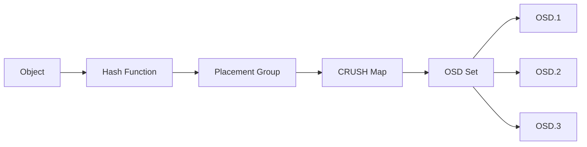
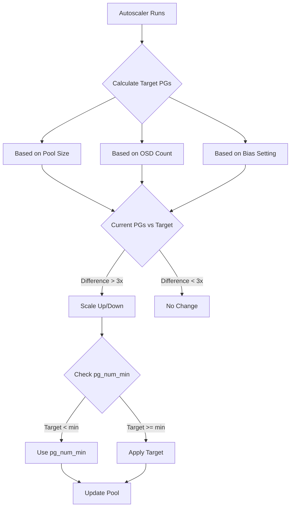
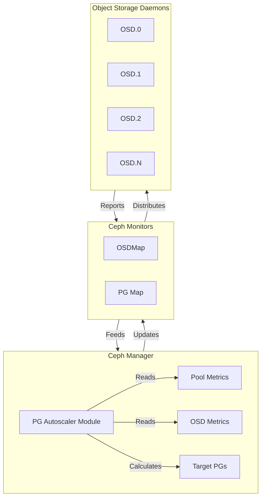

# How to Build Ceph PG Autoscaling

Author: [nawazdhandala](https://www.github.com/nawazdhandala)

Tags: Ceph, Storage, Kubernetes, Infrastructure, DevOps

Description: A practical guide to configuring and optimizing Ceph Placement Group autoscaling for efficient distributed storage management.

---

Placement Groups (PGs) are one of the most critical concepts in Ceph storage. They act as an abstraction layer between objects and OSDs (Object Storage Daemons), determining how data is distributed across your cluster. Getting PG counts right has historically been a challenge - too few PGs lead to uneven data distribution, while too many waste resources and slow down recovery operations.

Ceph PG Autoscaler solves this problem by dynamically adjusting PG counts based on pool usage. This post walks through how to configure, tune, and monitor PG autoscaling in production environments.

## Understanding Placement Groups

Before diving into autoscaling, let's understand what PGs actually do. When you write an object to Ceph, it gets mapped to a specific PG using CRUSH (Controlled Replication Under Scalable Hashing). That PG is then mapped to a set of OSDs.



The number of PGs affects:
- Data distribution uniformity
- Recovery and backfill speed
- Memory consumption on OSDs
- Peering time during cluster changes

## Enabling PG Autoscaling

PG Autoscaler is a manager module that ships with Ceph. Starting with Ceph Nautilus (14.x), it's available but disabled by default. In Ceph Pacific (16.x) and later, it's enabled by default.

Check if the autoscaler is enabled:

```bash
# Check module status
ceph mgr module ls | grep pg_autoscaler

# Enable the module if needed
ceph mgr module enable pg_autoscaler
```

Verify the autoscaler is running:

```bash
ceph osd pool autoscale-status
```

You should see output listing all pools with their current and target PG counts.

## Autoscaler Modes

Each pool can operate in one of three modes:

```bash
# Set pool to 'on' mode - automatically adjust PGs
ceph osd pool set <pool-name> pg_autoscale_mode on

# Set pool to 'warn' mode - only generate health warnings
ceph osd pool set <pool-name> pg_autoscale_mode warn

# Set pool to 'off' mode - disable autoscaling entirely
ceph osd pool set <pool-name> pg_autoscale_mode off
```

For new deployments, I recommend starting with `warn` mode to observe what changes the autoscaler would make, then switching to `on` once you're comfortable with its behavior.

## Configuring the Autoscaler

The autoscaler makes decisions based on the target ratio of PGs per OSD. The default target is 100 PGs per OSD, which works well for most clusters.

```bash
# View current target ratio
ceph config get mon osd_pool_default_pg_autoscale_mode

# Set global target PGs per OSD (default is 100)
ceph config set global osd_target_pg_per_osd 100

# Set the bias for a specific pool (higher = more PGs)
ceph osd pool set <pool-name> pg_autoscale_bias 1.0
```

The `pg_autoscale_bias` setting is useful when certain pools need proportionally more PGs. For example, a pool expected to store significantly more data might benefit from a higher bias:

```bash
# Give the production-data pool 2x the normal PG allocation
ceph osd pool set production-data pg_autoscale_bias 2.0
```

## Autoscaler Decision Flow

Here's how the autoscaler decides when to adjust PG counts:



## Setting Minimum PG Counts

For pools that might be temporarily empty but will grow, set a minimum PG count:

```bash
# Ensure pool always has at least 32 PGs
ceph osd pool set <pool-name> pg_num_min 32
```

This prevents the autoscaler from shrinking the pool too aggressively during low-usage periods.

## Monitoring Autoscaler Status

The autoscale-status command provides a comprehensive view:

```bash
ceph osd pool autoscale-status
```

Example output:

```
POOL                     SIZE  TARGET SIZE  RATE  RAW CAPACITY   RATIO  TARGET RATIO  PG_NUM  NEW PG_NUM  AUTOSCALE
device_health_metrics      0                 3.0        19.5T  0.0000                     1              on
.rgw.root               1245                 3.0        19.5T  0.0000                     1              on
default.rgw.log         3827                 3.0        19.5T  0.0000                     1              on
cephfs_data            2.41T                 3.0        19.5T  0.3707                   256         512  on
rbd-pool               1.12T                 3.0        19.5T  0.1723                   128              on
```

Key columns to watch:
- **SIZE**: Current pool data size
- **RATIO**: Fraction of total cluster capacity
- **PG_NUM**: Current PG count
- **NEW PG_NUM**: Target PG count (if scaling is needed)

## Practical Example: Setting Up Autoscaling for RBD Pools

Here's a complete example for configuring autoscaling on an RBD pool used for Kubernetes persistent volumes:

```bash
#!/bin/bash
# configure-rbd-autoscale.sh

POOL_NAME="kubernetes-rbd"

# Create the pool with initial PG count
ceph osd pool create $POOL_NAME 64

# Initialize as an RBD pool
rbd pool init $POOL_NAME

# Enable autoscaling
ceph osd pool set $POOL_NAME pg_autoscale_mode on

# Set minimum PGs to prevent over-shrinking
ceph osd pool set $POOL_NAME pg_num_min 32

# Set a target ratio if you know expected usage
# This tells autoscaler this pool should use ~30% of cluster
ceph osd pool set $POOL_NAME target_size_ratio 0.3

# Verify configuration
echo "Pool configuration:"
ceph osd pool get $POOL_NAME all

echo "Autoscale status:"
ceph osd pool autoscale-status | grep $POOL_NAME
```

## Handling Autoscaler Health Warnings

When autoscaler is in `warn` mode, you'll see health warnings like:

```
HEALTH_WARN 1 pool(s) have pg_num > pgp_num
            1 pools have too few placement groups
```

To see details:

```bash
ceph health detail
```

If you want to manually trigger the suggested changes:

```bash
# See what changes are pending
ceph osd pool autoscale-status

# Manually set PG count to match recommendation
ceph osd pool set <pool-name> pg_num <new-pg-num>
```

## Tuning for Large Clusters

For clusters with many OSDs (100+), consider these adjustments:

```bash
# Increase the maximum PGs per OSD for better distribution
ceph config set global mon_max_pg_per_osd 300

# Allow more aggressive scaling
ceph config set global osd_pg_autoscale_bias_factor 2.0

# Set a longer evaluation interval to reduce overhead (default: 30s)
ceph config set mgr mgr/pg_autoscaler/sleep_interval 60
```

## Autoscaling Architecture in a Ceph Cluster



## Common Issues and Solutions

**PGs stuck in "creating" state:**
```bash
# Check PG status
ceph pg stat

# If PGs are stuck, check OSD status
ceph osd tree

# Force PG creation completion
ceph osd force-create-pg <pg-id>
```

**Autoscaler not making changes:**
```bash
# Check if autoscaler is actually running
ceph mgr services

# Verify pool mode is 'on'
ceph osd pool get <pool-name> pg_autoscale_mode

# Check for any blockers
ceph health detail
```

**Too frequent scaling causing performance issues:**
```bash
# Increase the sleep interval
ceph config set mgr mgr/pg_autoscaler/sleep_interval 300

# Set a larger threshold before scaling
ceph config set global mon_pg_autoscale_bias_factor 1.5
```

## Best Practices

1. **Start with warn mode** on existing clusters before enabling automatic scaling
2. **Set pg_num_min** for pools that might be temporarily empty
3. **Use target_size_ratio** when you know the expected data distribution
4. **Monitor PG states** during scaling operations
5. **Avoid manual PG changes** when autoscaler is enabled - they'll be overwritten
6. **Test in staging** before applying autoscaler changes to production

---

PG Autoscaling removes one of the most challenging aspects of Ceph administration. By understanding how the autoscaler makes decisions and configuring it appropriately for your workload, you can maintain optimal data distribution without constant manual intervention. Start with conservative settings, monitor the behavior, and adjust as you learn how your cluster's usage patterns evolve.
