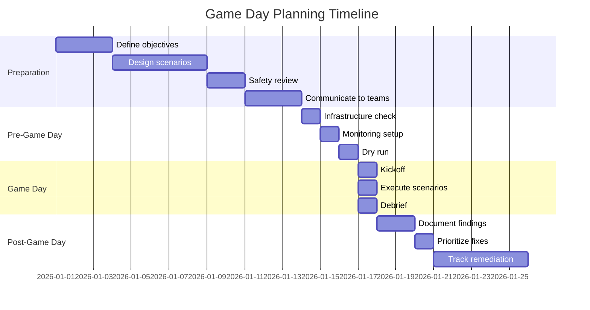
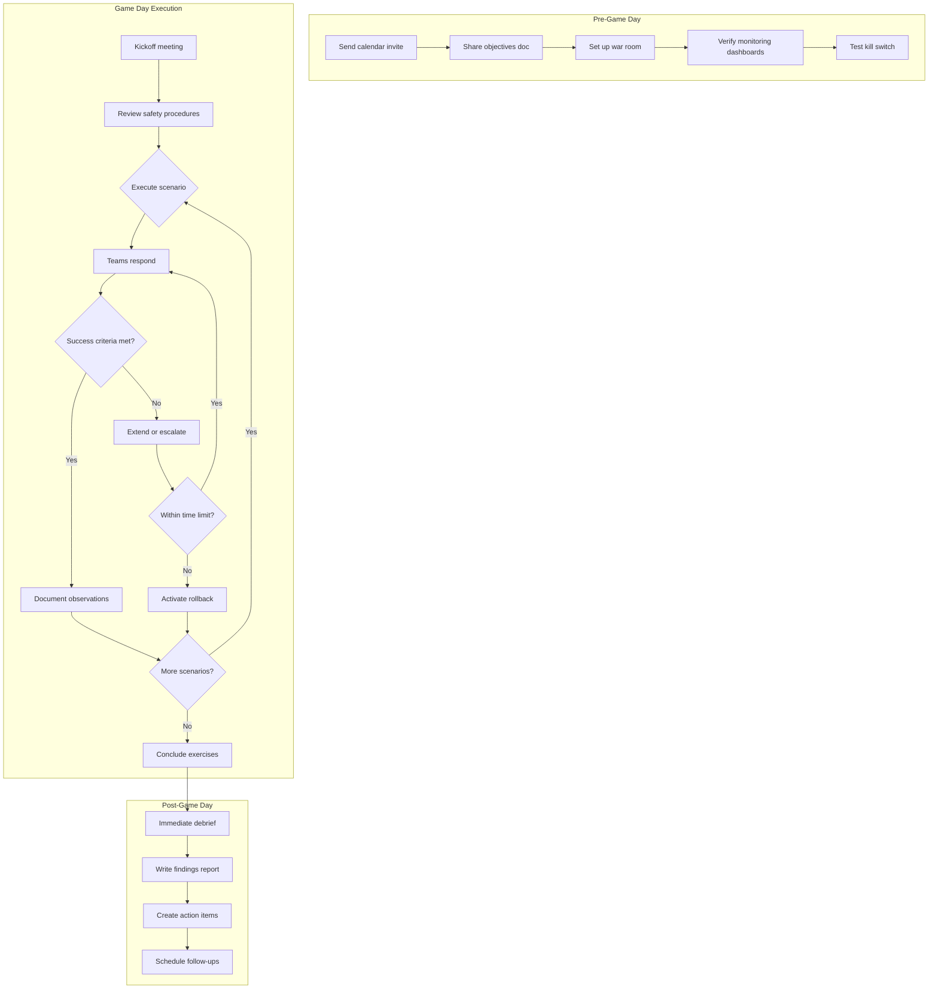

# How to Implement Chaos Engineering Game Days

Author: [nawazdhandala](https://www.github.com/nawazdhandala)

Tags: Chaos Engineering, Game Days, SRE, Incident Response, Resilience Testing, Team Training

Description: A complete playbook for planning and executing chaos engineering game days that strengthen your team's incident response capabilities and system resilience.

---

## What is a Chaos Engineering Game Day?

A game day is a planned event where teams intentionally inject failures into their systems while the engineering organization actively participates. Unlike automated chaos experiments that run continuously in the background, game days are collaborative exercises that test both technical systems and human response processes.

Think of it as a fire drill for your infrastructure. Everyone knows the drill is happening, but the specific scenarios remain unknown to most participants. This creates realistic conditions for practicing incident response while maintaining safety controls.

## Why Run Game Days?

Game days provide benefits that automated chaos cannot:

- **Cross-team coordination**: Multiple teams practice working together during incidents
- **Runbook validation**: Discover gaps in documentation before real emergencies
- **Tool verification**: Confirm that monitoring, alerting, and communication tools work correctly
- **Psychological safety**: Teams build confidence in handling failures
- **Knowledge transfer**: Experienced engineers demonstrate debugging techniques to newer team members

## Game Day Planning Timeline



## Defining Game Day Objectives

Every game day needs clear objectives. Without them, you risk wasting time on experiments that do not provide actionable insights.

```yaml
# game_day_objectives.yaml
# Example objectives document for a game day

game_day:
  name: "Q1 2026 Infrastructure Resilience Game Day"
  date: "2026-01-28"
  duration_hours: 4

objectives:
  primary:
    - description: "Validate database failover completes within 30 seconds"
      success_criteria: "Failover time < 30s, error rate < 1%"

    - description: "Verify circuit breakers prevent cascade failures"
      success_criteria: "Downstream services remain healthy when upstream fails"

    - description: "Test on-call escalation reaches correct personnel"
      success_criteria: "Primary on-call acknowledged within 5 minutes"

  secondary:
    - description: "Measure time to identify root cause"
      success_criteria: "Root cause identified within 15 minutes"

    - description: "Validate runbook accuracy for top 3 failure scenarios"
      success_criteria: "Runbooks followed without deviation"

scope:
  in_scope:
    - "API gateway tier"
    - "Database cluster"
    - "Cache layer"
    - "Background job workers"

  out_of_scope:
    - "Third-party payment processor"
    - "CDN configuration"
    - "DNS infrastructure"

safety:
  kill_switch: "Slack command: /gameday-stop"
  max_customer_impact: "< 0.1% of requests"
  rollback_time_limit: "5 minutes"
```

## Designing Scenarios

Create scenarios that test realistic failure modes your systems might encounter:

```python
# game_day_scenarios.py
# Scenario definitions for game day execution

from dataclasses import dataclass
from enum import Enum
from typing import List, Optional

class Severity(Enum):
    LOW = "low"          # Minor degradation
    MEDIUM = "medium"    # Noticeable impact
    HIGH = "high"        # Service disruption

class AttackType(Enum):
    RESOURCE = "resource"
    NETWORK = "network"
    STATE = "state"
    DEPENDENCY = "dependency"

@dataclass
class Scenario:
    name: str
    description: str
    attack_type: AttackType
    severity: Severity
    expected_behavior: str
    validation_steps: List[str]
    rollback_procedure: str
    max_duration_minutes: int
    affected_services: List[str]

# Define game day scenarios
scenarios = [
    Scenario(
        name="Database Primary Failure",
        description="Terminate the primary database instance to trigger automatic failover",
        attack_type=AttackType.STATE,
        severity=Severity.HIGH,
        expected_behavior=(
            "Read replica promotes to primary within 30 seconds. "
            "Application reconnects automatically. "
            "Brief increase in latency but no errors."
        ),
        validation_steps=[
            "Monitor database connection pool metrics",
            "Check application error rates",
            "Verify write operations resume",
            "Confirm replication catches up"
        ],
        rollback_procedure="Restore original primary from snapshot if automatic failover fails",
        max_duration_minutes=10,
        affected_services=["api", "background-workers", "admin-portal"]
    ),

    Scenario(
        name="Cache Cluster Degradation",
        description="Add 500ms latency to all Redis connections",
        attack_type=AttackType.NETWORK,
        severity=Severity.MEDIUM,
        expected_behavior=(
            "Application falls back to database for reads. "
            "Latency increases but requests succeed. "
            "Cache miss metrics spike."
        ),
        validation_steps=[
            "Check cache hit ratio drops",
            "Verify database query rate increases",
            "Monitor response times",
            "Confirm no 5xx errors returned"
        ],
        rollback_procedure="Remove latency injection from Gremlin console",
        max_duration_minutes=5,
        affected_services=["api", "web-frontend"]
    ),

    Scenario(
        name="Noisy Neighbor CPU Contention",
        description="Consume 80% CPU on 25% of API pods",
        attack_type=AttackType.RESOURCE,
        severity=Severity.MEDIUM,
        expected_behavior=(
            "Load balancer routes traffic away from affected pods. "
            "HPA scales up additional replicas. "
            "Overall latency increases slightly."
        ),
        validation_steps=[
            "Check pod CPU metrics",
            "Verify HPA triggers scaling",
            "Monitor load balancer health checks",
            "Track request distribution across pods"
        ],
        rollback_procedure="Halt CPU attack via Gremlin",
        max_duration_minutes=8,
        affected_services=["api"]
    )
]
```

## Game Day Execution Workflow



## Running the Game Day

### Pre-Game Day Checklist

```bash
#!/bin/bash
# pre_game_day_check.sh
# Run this script the day before the game day

echo "=== Game Day Readiness Check ==="

# Verify monitoring is operational
echo "Checking monitoring systems..."
curl -s https://oneuptime.com/api/health | jq -e '.status == "healthy"' || {
    echo "ERROR: Monitoring system not healthy"
    exit 1
}

# Verify communication channels
echo "Checking Slack integration..."
curl -s -X POST "$SLACK_WEBHOOK" \
    -H 'Content-Type: application/json' \
    -d '{"text":"Game day communication test"}' || {
    echo "ERROR: Slack webhook not working"
    exit 1
}

# Verify kill switch
echo "Testing kill switch..."
./test_kill_switch.sh --dry-run || {
    echo "ERROR: Kill switch not operational"
    exit 1
}

# Check that scenarios are loaded
echo "Verifying scenarios..."
python3 -c "from game_day_scenarios import scenarios; print(f'{len(scenarios)} scenarios loaded')"

# Verify rollback procedures
echo "Testing rollback procedures..."
for scenario in database cache cpu; do
    ./rollback_${scenario}.sh --dry-run || {
        echo "ERROR: Rollback procedure for $scenario failed"
        exit 1
    }
done

echo "=== All checks passed ==="
```

### Game Day Controller Script

```python
# game_day_controller.py
# Orchestrate game day scenario execution

import asyncio
import logging
from datetime import datetime, timedelta
from typing import Optional

logging.basicConfig(level=logging.INFO)
logger = logging.getLogger("game_day")

class GameDayController:
    def __init__(self, scenarios, slack_client, monitoring_client, chaos_client):
        self.scenarios = scenarios
        self.slack = slack_client
        self.monitoring = monitoring_client
        self.chaos = chaos_client
        self.current_scenario: Optional[str] = None
        self.game_day_active = False
        self.kill_switch_activated = False

    async def start_game_day(self):
        """Initialize game day and notify participants."""
        self.game_day_active = True

        await self.slack.post_message(
            channel="#game-day-war-room",
            text=(
                ":rotating_light: *Game Day Starting* :rotating_light:\n"
                f"Duration: 4 hours\n"
                f"Scenarios: {len(self.scenarios)}\n"
                f"Kill switch: `/gameday-stop`\n\n"
                "Observers: monitor dashboards and document observations.\n"
                "On-call: respond as if this were a real incident."
            )
        )

        # Create snapshot for baseline comparison
        self.baseline_metrics = await self.monitoring.capture_baseline()

    async def execute_scenario(self, scenario):
        """Run a single scenario with safety controls."""
        if self.kill_switch_activated:
            logger.warning("Kill switch active, skipping scenario")
            return

        self.current_scenario = scenario.name
        start_time = datetime.utcnow()
        max_end_time = start_time + timedelta(minutes=scenario.max_duration_minutes)

        # Announce scenario start (without revealing details to responders)
        await self.slack.post_message(
            channel="#game-day-war-room",
            text=f":test_tube: *Scenario Starting*\nSeverity: {scenario.severity.value}"
        )

        # Execute the chaos attack
        attack_id = await self.chaos.execute_attack(scenario)

        try:
            # Monitor for success criteria or timeout
            while datetime.utcnow() < max_end_time:
                if self.kill_switch_activated:
                    await self.chaos.halt_attack(attack_id)
                    break

                metrics = await self.monitoring.get_current_metrics()

                # Check if safety thresholds exceeded
                if metrics.error_rate > 0.01:  # 1% error rate
                    logger.warning("Error rate threshold exceeded, halting")
                    await self.chaos.halt_attack(attack_id)
                    break

                await asyncio.sleep(5)

        finally:
            # Ensure attack is stopped
            await self.chaos.ensure_attack_stopped(attack_id)

            # Allow recovery time
            await asyncio.sleep(60)

            # Capture post-scenario metrics
            post_metrics = await self.monitoring.capture_metrics()

            # Document results
            await self.document_scenario_results(scenario, start_time, post_metrics)

    async def document_scenario_results(self, scenario, start_time, metrics):
        """Record scenario outcomes for post-game analysis."""
        duration = (datetime.utcnow() - start_time).total_seconds()

        result = {
            "scenario": scenario.name,
            "start_time": start_time.isoformat(),
            "duration_seconds": duration,
            "metrics": {
                "max_error_rate": metrics.max_error_rate,
                "max_latency_p99": metrics.max_latency_p99,
                "recovery_time_seconds": metrics.recovery_time
            },
            "success": metrics.max_error_rate < 0.01
        }

        await self.slack.post_message(
            channel="#game-day-results",
            text=(
                f"*Scenario Complete: {scenario.name}*\n"
                f"Duration: {duration:.0f}s\n"
                f"Max Error Rate: {metrics.max_error_rate:.2%}\n"
                f"Recovery Time: {metrics.recovery_time:.0f}s\n"
                f"Result: {'PASS' if result['success'] else 'FAIL'}"
            )
        )

        return result

    async def activate_kill_switch(self, reason: str):
        """Immediately halt all chaos activities."""
        self.kill_switch_activated = True

        # Stop all active attacks
        await self.chaos.halt_all_attacks()

        await self.slack.post_message(
            channel="#game-day-war-room",
            text=(
                f":octagonal_sign: *KILL SWITCH ACTIVATED*\n"
                f"Reason: {reason}\n"
                f"All chaos activities halted.\n"
                f"Current scenario: {self.current_scenario}"
            )
        )
```

## Participant Roles

Define clear roles for game day participants:

```yaml
# game_day_roles.yaml
# Role assignments for game day

roles:
  game_master:
    responsibilities:
      - "Control scenario execution"
      - "Monitor safety thresholds"
      - "Activate kill switch if needed"
      - "Keep game day on schedule"
    count: 1
    required_experience: "Senior SRE or Staff Engineer"

  scenario_observer:
    responsibilities:
      - "Document exactly what happens during scenarios"
      - "Note timing of events"
      - "Record unexpected behaviors"
      - "Do not interfere with responders"
    count: 2
    required_experience: "Any engineering level"

  incident_responder:
    responsibilities:
      - "Respond to alerts as in real incidents"
      - "Follow runbooks"
      - "Escalate when needed"
      - "Communicate in incident channel"
    count: 3-5
    required_experience: "On-call experience preferred"

  safety_officer:
    responsibilities:
      - "Monitor customer impact metrics"
      - "Watch for scope creep"
      - "Authorize kill switch if needed"
      - "Ensure rollback readiness"
    count: 1
    required_experience: "Senior SRE or Engineering Manager"
```

## Post-Game Day Analysis

Create a structured report of findings:

```markdown
# Game Day Report Template

## Executive Summary
- Date: 2026-01-28
- Duration: 4 hours
- Scenarios Executed: 5
- Overall Result: 4 passed, 1 failed

## Scenario Results

### Scenario 1: Database Primary Failure
- **Result**: PASS
- **Failover Time**: 23 seconds (target: 30 seconds)
- **Max Error Rate**: 0.3%
- **Observations**:
  - Connection pool took 8 seconds to detect failure
  - Application logs showed clear failover messages
  - No manual intervention required

### Scenario 2: Cache Cluster Degradation
- **Result**: FAIL
- **Reason**: Circuit breaker did not trip
- **Observations**:
  - Application continued hitting degraded cache
  - Database experienced 10x normal load
  - P99 latency reached 4.2 seconds
- **Action Required**: Review circuit breaker configuration

## Action Items
| Priority | Item | Owner | Due Date |
|----------|------|-------|----------|
| P0 | Fix cache circuit breaker threshold | @jane | 2026-02-04 |
| P1 | Add connection pool failure alerting | @bob | 2026-02-11 |
| P2 | Update database failover runbook | @alice | 2026-02-18 |

## Metrics Summary
- Mean Time to Detect: 2.3 minutes
- Mean Time to Resolve: 8.7 minutes
- Customer Impact: 0.02% of requests affected
```

## Best Practices

**Start with tabletop exercises**: Before injecting real failures, walk through scenarios verbally to identify gaps in understanding.

**Always have a kill switch**: Technical failures during game days can compound. Have a reliable way to stop everything immediately.

**Rotate participants**: Different people notice different things. Vary who plays each role across game days.

**Schedule recovery time**: Leave buffer between scenarios for systems and humans to stabilize.

**Celebrate findings**: Game days exist to find problems. Treat discovered issues as wins, not failures.

---

Game days transform chaos engineering from a technical practice into an organizational capability. By bringing teams together to practice incident response, you build both system resilience and team confidence. Start with quarterly game days focusing on your highest-risk failure modes, document everything, and use the findings to drive continuous improvement. The goal is not to prove your systems never fail but to prove your teams can handle it when they do.
