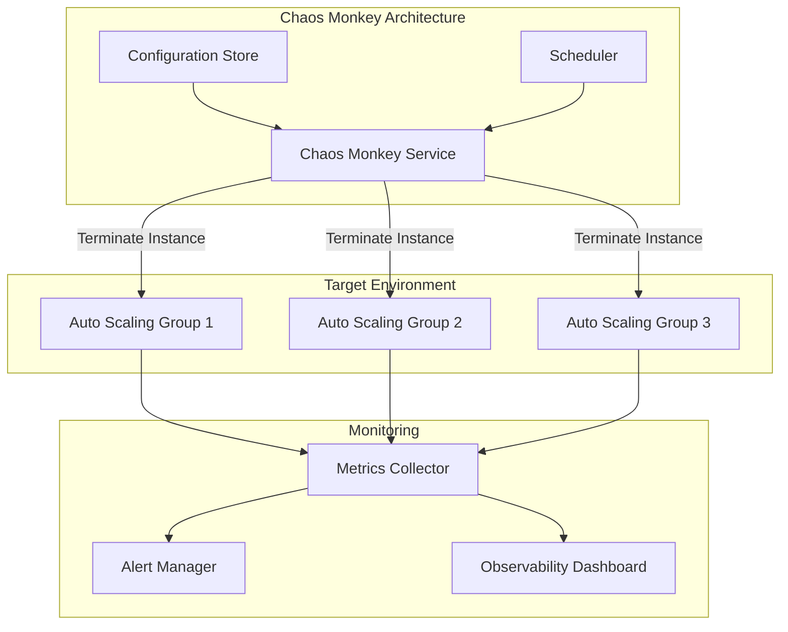
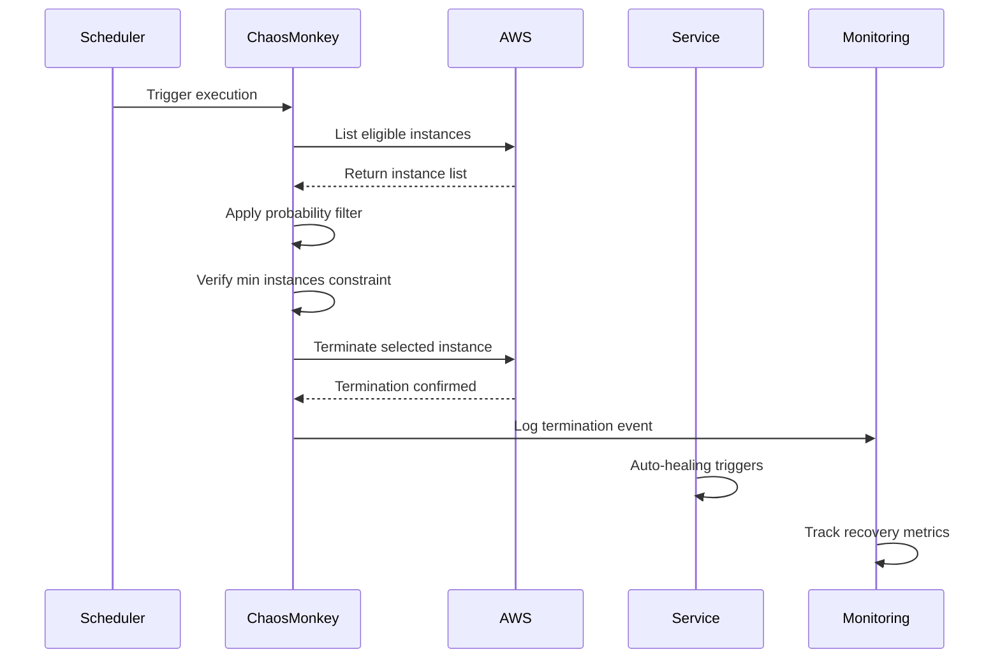

# How to Use Chaos Monkey for Resilience Testing

Author: [nawazdhandala](https://www.github.com/nawazdhandala)

Tags: Chaos Engineering, Chaos Monkey, Resilience Testing, Netflix, SRE, Reliability

Description: A practical guide to setting up and using Chaos Monkey to test system resilience by randomly terminating instances in your production environment.

---

## What is Chaos Monkey?

Chaos Monkey is Netflix's pioneering tool for chaos engineering. It randomly terminates virtual machine instances and containers in your production environment to verify that your services can tolerate these failures without impacting customers. The core principle is simple: if you want to find weaknesses in your system, break things on purpose.

Netflix built Chaos Monkey after migrating to AWS in 2010. They realized that cloud infrastructure fails regularly, and the only way to build truly resilient systems is to embrace failure as a constant rather than an exception.

## Why Use Chaos Monkey?

Traditional testing approaches miss many failure scenarios that occur in production. Load tests verify performance under stress, but they do not simulate the sudden loss of a server. Integration tests check component interactions, but they assume all components are available.

Chaos Monkey fills this gap by injecting real failures:

- Validates auto-scaling configurations actually work
- Tests failover mechanisms under realistic conditions
- Exposes single points of failure before they cause outages
- Builds confidence in disaster recovery procedures

## Architecture Overview



## Setting Up Chaos Monkey

Chaos Monkey is part of Netflix's Simian Army, now available through the Spinnaker ecosystem. Here is how to deploy it.

### Prerequisites

You need a running Spinnaker installation or you can run Chaos Monkey standalone. The following example uses the standalone approach with a Go-based implementation.

### Installation

Clone the repository and build the binary:

```bash
# Clone the Chaos Monkey repository
git clone https://github.com/Netflix/chaosmonkey.git
cd chaosmonkey

# Build the binary
go build -o chaosmonkey ./cmd/chaosmonkey

# Verify the installation
./chaosmonkey --version
```

### Configuration File

Create a configuration file that defines your chaos parameters:

```yaml
# chaosmonkey.yaml
# Defines the chaos behavior and targeting rules

enabled: true

# Schedule chaos during business hours for visibility
schedule:
  start_hour: 9
  end_hour: 17
  timezone: "America/Los_Angeles"
  # Only run on weekdays
  excluded_days:
    - Saturday
    - Sunday

# Target specific applications
accounts:
  - name: production
    cloud_provider: aws
    region: us-west-2
    # Applications to target
    apps:
      - api-service
      - payment-service
      - notification-service

# Safety settings
safety:
  # Minimum instances that must remain running
  min_instances: 2
  # Maximum terminations per day per group
  max_terminations_per_day: 1
  # Probability of termination (0-100)
  probability: 50

# Notification settings
notifications:
  slack_webhook: "https://hooks.slack.com/services/xxx/yyy/zzz"
  email: "oncall@yourcompany.com"
```

### AWS IAM Policy

Chaos Monkey needs permissions to describe and terminate instances:

```json
{
  "Version": "2012-10-17",
  "Statement": [
    {
      "Effect": "Allow",
      "Action": [
        "ec2:DescribeInstances",
        "ec2:TerminateInstances",
        "autoscaling:DescribeAutoScalingGroups",
        "autoscaling:DescribeAutoScalingInstances"
      ],
      "Resource": "*",
      "Condition": {
        "StringEquals": {
          "ec2:ResourceTag/ChaosMonkeyEnabled": "true"
        }
      }
    }
  ]
}
```

## Running Your First Chaos Experiment

Start with a controlled experiment in a non-production environment:

```bash
# Dry run to see what would be terminated
./chaosmonkey --config chaosmonkey.yaml --dry-run

# Output shows targeted instances without terminating
# Instance i-0abc123def456 in api-service would be terminated
# Instance i-0def789ghi012 in payment-service would be terminated

# Run actual chaos (start in staging first!)
./chaosmonkey --config chaosmonkey.yaml --run-once
```

### Validating Results

After termination, verify your system behaves correctly:

```bash
#!/bin/bash
# validate_resilience.sh
# Run after chaos monkey terminates an instance

SERVICE_NAME=$1
EXPECTED_RESPONSE_CODE=200
MAX_WAIT_SECONDS=60

echo "Validating $SERVICE_NAME resilience..."

# Wait for service to recover
for i in $(seq 1 $MAX_WAIT_SECONDS); do
    response=$(curl -s -o /dev/null -w "%{http_code}" "https://$SERVICE_NAME.example.com/health")

    if [ "$response" -eq "$EXPECTED_RESPONSE_CODE" ]; then
        echo "Service recovered in $i seconds"
        exit 0
    fi

    sleep 1
done

echo "Service failed to recover within $MAX_WAIT_SECONDS seconds"
exit 1
```

## Chaos Monkey Execution Flow



## Best Practices

### Start Small

Begin with your most resilient services and lowest-risk environments:

```yaml
# Progressive chaos rollout
stages:
  week_1:
    environments: [development]
    probability: 25

  week_2:
    environments: [staging]
    probability: 50

  month_2:
    environments: [production]
    probability: 25
    services: [stateless_only]
```

### Tag Your Resources

Use consistent tagging to control which resources Chaos Monkey can target:

```bash
# Enable chaos for a specific auto scaling group
aws autoscaling create-or-update-tags \
  --tags "ResourceId=my-asg,ResourceType=auto-scaling-group,Key=ChaosMonkeyEnabled,Value=true,PropagateAtLaunch=true"

# Disable chaos for sensitive resources
aws autoscaling create-or-update-tags \
  --tags "ResourceId=database-asg,ResourceType=auto-scaling-group,Key=ChaosMonkeyEnabled,Value=false,PropagateAtLaunch=true"
```

### Monitor Everything

Integrate with your observability platform to track chaos events:

```python
# chaos_metrics.py
# Send chaos events to your monitoring system

from opentelemetry import metrics
from opentelemetry.sdk.metrics import MeterProvider

meter = metrics.get_meter("chaos_monkey")

# Track terminations
termination_counter = meter.create_counter(
    name="chaos_monkey_terminations_total",
    description="Total instances terminated by Chaos Monkey",
    unit="1"
)

# Track recovery time
recovery_histogram = meter.create_histogram(
    name="chaos_monkey_recovery_seconds",
    description="Time for service to recover after termination",
    unit="s"
)

def record_termination(service_name, instance_id, region):
    """Record a chaos termination event."""
    termination_counter.add(
        1,
        attributes={
            "service": service_name,
            "instance_id": instance_id,
            "region": region
        }
    )

def record_recovery(service_name, recovery_seconds):
    """Record service recovery time."""
    recovery_histogram.record(
        recovery_seconds,
        attributes={"service": service_name}
    )
```

## Common Pitfalls to Avoid

**Running chaos without monitoring**: Always have dashboards and alerts active during experiments. You need visibility into what breaks.

**Terminating stateful services without preparation**: Databases and message queues require special handling. Ensure proper failover configurations before targeting them.

**No opt-out mechanism**: Always provide a way to disable chaos immediately during incidents or critical periods.

**Ignoring the findings**: Chaos experiments are pointless if you do not fix the weaknesses they expose. Track findings and prioritize remediation.

## Integration with OneUptime

Send Chaos Monkey events to OneUptime for centralized observability:

```bash
# Send chaos event to OneUptime
curl -X POST "https://oneuptime.com/api/telemetry/events" \
  -H "Content-Type: application/json" \
  -H "X-OneUptime-Token: $ONEUPTIME_TOKEN" \
  -d '{
    "eventType": "chaos_monkey_termination",
    "service": "api-service",
    "instanceId": "i-0abc123def456",
    "timestamp": "2026-01-28T10:30:00Z",
    "metadata": {
      "region": "us-west-2",
      "auto_scaling_group": "api-service-asg"
    }
  }'
```

---

Chaos Monkey remains one of the most effective tools for building resilient systems. By deliberately injecting failures, you discover weaknesses before your customers do. Start with non-production environments, monitor everything, and progressively increase the chaos scope as your confidence grows. The goal is not to break things for fun but to build systems that handle failure gracefully.
