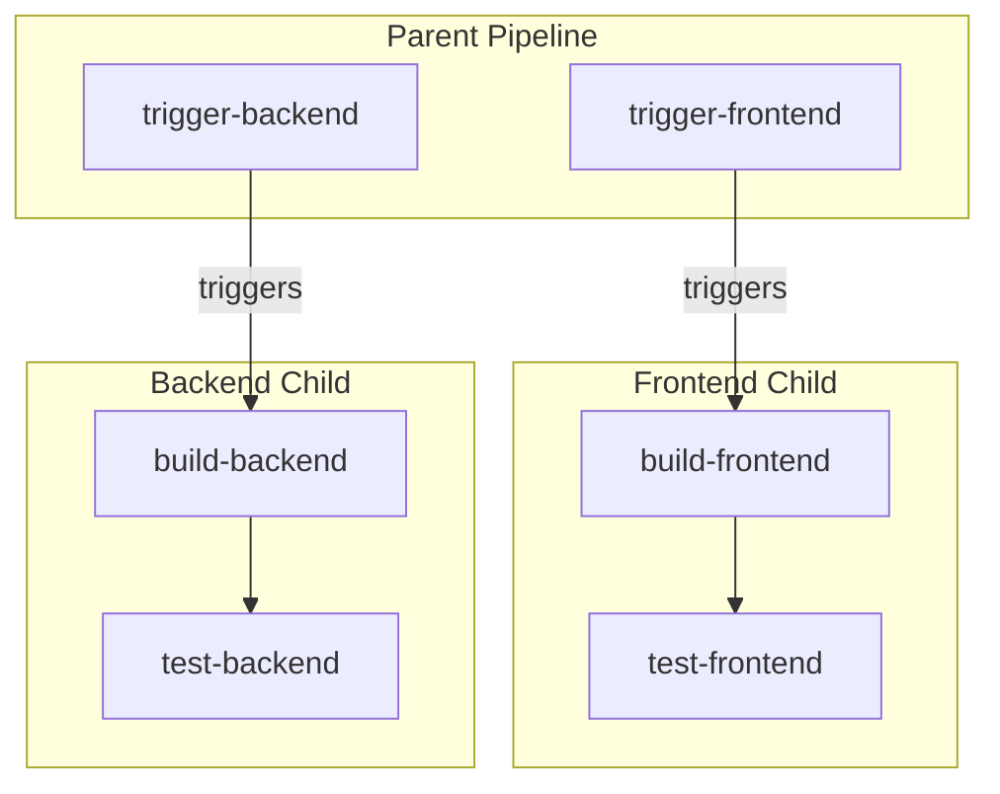

# How to Build Child Pipelines in GitLab CI

Author: [nawazdhandala](https://www.github.com/nawazdhandala)

Tags: GitLab CI, Child Pipelines, Parent Pipelines, CI/CD, Pipeline Organization

Description: Learn how to use child pipelines in GitLab CI to organize complex workflows, dynamically generate pipelines, and manage large-scale CI/CD configurations.

---

As pipelines grow, a single `.gitlab-ci.yml` file becomes unwieldy. Child pipelines let you split configurations into smaller, focused files. A parent pipeline triggers child pipelines, each handling a specific part of your build process. This guide shows you how to structure, trigger, and manage child pipelines effectively.

## Understanding Child Pipelines

Child pipelines are separate pipeline instances triggered by a parent pipeline within the same project. Unlike multi-project pipelines that span repositories, child pipelines run in the same project but with their own configuration file.

Use cases include:
- Organizing large configurations into logical units
- Generating pipeline configurations dynamically
- Running different pipelines for different parts of a monorepo
- Isolating complex build logic

## Basic Child Pipeline

Create a parent pipeline that triggers child pipelines.

```yaml
# .gitlab-ci.yml (parent)
stages:
  - trigger

trigger-frontend:
  stage: trigger
  trigger:
    include: .gitlab/ci/frontend.yml
    strategy: depend

trigger-backend:
  stage: trigger
  trigger:
    include: .gitlab/ci/backend.yml
    strategy: depend
```

```yaml
# .gitlab/ci/frontend.yml
stages:
  - build
  - test

build-frontend:
  stage: build
  script:
    - npm ci
    - npm run build
  artifacts:
    paths:
      - dist/

test-frontend:
  stage: test
  script:
    - npm test
```

```yaml
# .gitlab/ci/backend.yml
stages:
  - build
  - test

build-backend:
  stage: build
  script:
    - go build ./...

test-backend:
  stage: test
  script:
    - go test ./...
```

## Child Pipeline Flow

Here's how parent and child pipelines interact:



## Passing Variables to Child Pipelines

Share context from parent to child pipelines.

```yaml
# Parent pipeline
trigger-deploy:
  stage: trigger
  variables:
    ENVIRONMENT: production
    VERSION: ${CI_COMMIT_SHA}
  trigger:
    include: .gitlab/ci/deploy.yml
```

```yaml
# Child pipeline (.gitlab/ci/deploy.yml)
deploy:
  stage: deploy
  script:
    # Variables from parent are available
    - echo "Deploying version ${VERSION} to ${ENVIRONMENT}"
    - ./deploy.sh ${ENVIRONMENT}
```

## Dynamic Child Pipelines

Generate pipeline configuration at runtime.

```yaml
# Parent pipeline
stages:
  - generate
  - trigger

generate-pipeline:
  stage: generate
  script:
    # Dynamically create pipeline based on changed files
    - |
      cat > generated-pipeline.yml << 'EOF'
      stages:
        - build
        - test
      EOF

      # Add jobs based on changed directories
      if git diff --name-only HEAD~1 | grep -q "^frontend/"; then
        cat >> generated-pipeline.yml << 'EOF'
      build-frontend:
        stage: build
        script:
          - cd frontend && npm ci && npm run build
      test-frontend:
        stage: test
        script:
          - cd frontend && npm test
      EOF
      fi

      if git diff --name-only HEAD~1 | grep -q "^backend/"; then
        cat >> generated-pipeline.yml << 'EOF'
      build-backend:
        stage: build
        script:
          - cd backend && go build ./...
      test-backend:
        stage: test
        script:
          - cd backend && go test ./...
      EOF
      fi
  artifacts:
    paths:
      - generated-pipeline.yml

trigger-generated:
  stage: trigger
  trigger:
    include:
      - artifact: generated-pipeline.yml
        job: generate-pipeline
    strategy: depend
```

## Multiple Include Sources

Combine different configuration sources in child pipelines.

```yaml
trigger-full-build:
  stage: trigger
  trigger:
    include:
      # Local file
      - local: .gitlab/ci/build.yml
      # Remote template
      - remote: 'https://gitlab.com/templates/ci/security.yml'
      # Project template
      - project: 'devops/ci-templates'
        file: '/templates/deploy.yml'
        ref: main
```

## Conditional Child Pipelines

Trigger child pipelines based on conditions.

```yaml
stages:
  - detect
  - trigger

detect-changes:
  stage: detect
  script:
    - |
      if git diff --name-only HEAD~1 | grep -q "^frontend/"; then
        echo "FRONTEND_CHANGED=true" >> changes.env
      fi
      if git diff --name-only HEAD~1 | grep -q "^backend/"; then
        echo "BACKEND_CHANGED=true" >> changes.env
      fi
  artifacts:
    reports:
      dotenv: changes.env

trigger-frontend:
  stage: trigger
  trigger:
    include: .gitlab/ci/frontend.yml
  needs:
    - detect-changes
  rules:
    - if: $FRONTEND_CHANGED == "true"

trigger-backend:
  stage: trigger
  trigger:
    include: .gitlab/ci/backend.yml
  needs:
    - detect-changes
  rules:
    - if: $BACKEND_CHANGED == "true"
```

## Child Pipeline with Artifacts

Pass artifacts between parent and child pipelines.

```yaml
# Parent pipeline
stages:
  - prepare
  - trigger
  - finalize

prepare-config:
  stage: prepare
  script:
    - ./generate-config.sh > config.json
  artifacts:
    paths:
      - config.json

trigger-child:
  stage: trigger
  trigger:
    include: .gitlab/ci/child.yml
    strategy: depend
  needs:
    - prepare-config

finalize:
  stage: finalize
  script:
    # Access artifacts from child pipeline via API
    - echo "Child pipeline completed"
  needs:
    - trigger-child
```

## Child Pipelines for Monorepos

Handle multiple services in a monorepo.

```yaml
# Parent pipeline
stages:
  - trigger

services:
  stage: trigger
  parallel:
    matrix:
      - SERVICE: [api, web, worker, admin]
  trigger:
    include: services/${SERVICE}/.gitlab-ci.yml
  rules:
    - changes:
        - services/${SERVICE}/**/*
```

Each service has its own pipeline configuration:

```yaml
# services/api/.gitlab-ci.yml
stages:
  - build
  - test
  - deploy

variables:
  SERVICE_PATH: services/api

build:
  stage: build
  script:
    - cd ${SERVICE_PATH}
    - docker build -t ${CI_REGISTRY_IMAGE}/api:${CI_COMMIT_SHA} .

test:
  stage: test
  script:
    - cd ${SERVICE_PATH}
    - npm test

deploy:
  stage: deploy
  script:
    - cd ${SERVICE_PATH}
    - ./deploy.sh
```

## Strategy Options

Control how parent jobs interact with child pipelines.

```yaml
# Default: parent job succeeds immediately
trigger-async:
  trigger:
    include: child.yml
  # Parent continues while child runs

# Depend: parent waits for child to complete
trigger-sync:
  trigger:
    include: child.yml
    strategy: depend
  # Parent reflects child's success/failure
```

## Complex Child Pipeline Structure

Organize a large project with multiple child pipelines.

```
.gitlab/
  ci/
    build/
      frontend.yml
      backend.yml
      mobile.yml
    test/
      unit.yml
      integration.yml
      e2e.yml
    deploy/
      staging.yml
      production.yml
.gitlab-ci.yml
```

```yaml
# .gitlab-ci.yml
stages:
  - build
  - test
  - deploy

# Build stage child pipelines
build-frontend:
  stage: build
  trigger:
    include: .gitlab/ci/build/frontend.yml
    strategy: depend

build-backend:
  stage: build
  trigger:
    include: .gitlab/ci/build/backend.yml
    strategy: depend

# Test stage child pipelines
test-unit:
  stage: test
  trigger:
    include: .gitlab/ci/test/unit.yml
    strategy: depend
  needs:
    - build-frontend
    - build-backend

test-integration:
  stage: test
  trigger:
    include: .gitlab/ci/test/integration.yml
    strategy: depend
  needs:
    - build-frontend
    - build-backend

# Deploy stage
deploy-staging:
  stage: deploy
  trigger:
    include: .gitlab/ci/deploy/staging.yml
    strategy: depend
  needs:
    - test-unit
    - test-integration
  rules:
    - if: $CI_COMMIT_BRANCH == "develop"
```

## Debugging Child Pipelines

When child pipelines fail or behave unexpectedly:

```yaml
# Add debug output to parent
trigger-debug:
  stage: trigger
  before_script:
    - echo "Triggering child with variables:"
    - env | grep CI_ | sort
    - cat .gitlab/ci/child.yml
  trigger:
    include: .gitlab/ci/child.yml
    strategy: depend
```

Check the pipeline graph in GitLab UI. Child pipelines appear as expandable nodes in the parent pipeline visualization.

Common issues:
- **Child pipeline not found**: Verify the include path is correct
- **Variables not available**: Ensure variables are explicitly passed
- **Artifacts not accessible**: Child pipelines can't directly access parent artifacts

## Resource Management

Control pipeline resources with child pipelines.

```yaml
# Limit parallel child pipelines
trigger-limited:
  stage: trigger
  trigger:
    include: child.yml
  resource_group: limited-builds
```

Each child pipeline runs independently, so be mindful of runner capacity when triggering many children.

## Child vs Multi-Project Pipelines

Choose the right approach for your use case:

**Child Pipelines:**
- Same repository
- Configuration split for organization
- Shared project context
- Easier artifact sharing

**Multi-Project Pipelines:**
- Different repositories
- Independent project lifecycles
- Separate access control
- Cross-repository coordination

---

Child pipelines bring order to complex CI/CD configurations. Start by splitting your pipeline into logical units based on services or functions. Use dynamic generation for monorepos where pipeline structure depends on what changed. The key is keeping each child pipeline focused on a single responsibility while letting the parent orchestrate the overall flow.
