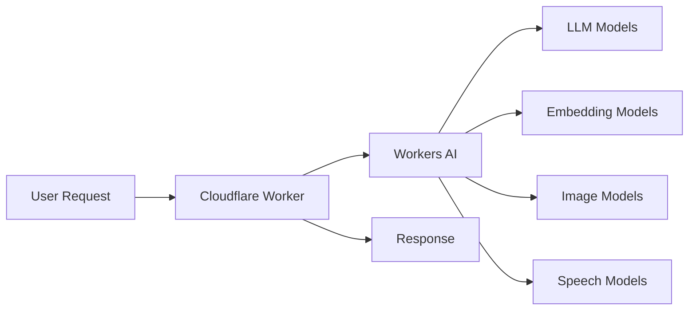

# How to Use Cloudflare Workers AI

Author: [nawazdhandala](https://www.github.com/nawazdhandala)

Tags: Cloudflare, Cloudflare Workers, Workers AI, Machine Learning, LLM, Serverless, AI

Description: Learn how to integrate Cloudflare Workers AI for text generation, embeddings, image classification, and more in your serverless applications.

---

> Running AI models at the edge eliminates round trips to centralized servers, reducing latency for AI-powered features. Workers AI provides access to popular models directly from your Cloudflare Workers with zero infrastructure management.

AI at the edge means faster responses for your users. Here is how to get started with Workers AI.

---

## Overview



---

## Getting Started

### Configure Workers AI Binding

Add the AI binding to your wrangler.toml:

```toml
# wrangler.toml
name = "ai-worker"
main = "src/worker.ts"
compatibility_date = "2024-01-01"

# Workers AI binding
[ai]
binding = "AI"
```

### Basic Text Generation

Generate text with an LLM:

```typescript
// src/worker.ts
export interface Env {
  AI: Ai;
}

export default {
  async fetch(request: Request, env: Env): Promise<Response> {
    const url = new URL(request.url);

    if (url.pathname === "/generate" && request.method === "POST") {
      const body = await request.json() as { prompt: string };

      // Run inference with Llama model
      const response = await env.AI.run("@cf/meta/llama-3.1-8b-instruct", {
        prompt: body.prompt,
        max_tokens: 500
      });

      return Response.json({
        generated: response.response
      });
    }

    return new Response("Not found", { status: 404 });
  }
};
```

---

## Text Generation with Chat Models

### Implement Chat Completions

Use chat-style interactions with message history:

```typescript
// src/chat.ts
export interface Env {
  AI: Ai;
}

interface ChatMessage {
  role: "system" | "user" | "assistant";
  content: string;
}

interface ChatRequest {
  messages: ChatMessage[];
  temperature?: number;
  max_tokens?: number;
}

export default {
  async fetch(request: Request, env: Env): Promise<Response> {
    if (request.method !== "POST") {
      return new Response("Method not allowed", { status: 405 });
    }

    const chatRequest = await request.json() as ChatRequest;

    // Validate messages
    if (!chatRequest.messages || chatRequest.messages.length === 0) {
      return Response.json(
        { error: "Messages array is required" },
        { status: 400 }
      );
    }

    // Run chat completion
    const response = await env.AI.run("@cf/meta/llama-3.1-8b-instruct", {
      messages: chatRequest.messages,
      temperature: chatRequest.temperature || 0.7,
      max_tokens: chatRequest.max_tokens || 1000
    });

    return Response.json({
      message: {
        role: "assistant",
        content: response.response
      }
    });
  }
};
```

### Build a Conversational Assistant

```typescript
// src/assistant.ts
export interface Env {
  AI: Ai;
  CONVERSATIONS: KVNamespace;
}

interface ConversationState {
  messages: Array<{ role: string; content: string }>;
  createdAt: number;
  lastUpdated: number;
}

export default {
  async fetch(request: Request, env: Env): Promise<Response> {
    const url = new URL(request.url);

    if (url.pathname === "/chat" && request.method === "POST") {
      const body = await request.json() as {
        conversationId?: string;
        message: string;
      };

      // Get or create conversation
      const conversationId = body.conversationId || crypto.randomUUID();
      let conversation = await getConversation(env, conversationId);

      // Add system prompt for new conversations
      if (conversation.messages.length === 0) {
        conversation.messages.push({
          role: "system",
          content: "You are a helpful assistant. Be concise and accurate."
        });
      }

      // Add user message
      conversation.messages.push({
        role: "user",
        content: body.message
      });

      // Generate response
      const response = await env.AI.run("@cf/meta/llama-3.1-8b-instruct", {
        messages: conversation.messages,
        temperature: 0.7,
        max_tokens: 1000
      });

      // Add assistant response to conversation
      const assistantMessage = {
        role: "assistant",
        content: response.response
      };
      conversation.messages.push(assistantMessage);
      conversation.lastUpdated = Date.now();

      // Save conversation
      await saveConversation(env, conversationId, conversation);

      return Response.json({
        conversationId,
        message: assistantMessage
      });
    }

    return new Response("Not found", { status: 404 });
  }
};

async function getConversation(
  env: Env,
  conversationId: string
): Promise<ConversationState> {
  const data = await env.CONVERSATIONS.get(conversationId);

  if (data) {
    return JSON.parse(data);
  }

  return {
    messages: [],
    createdAt: Date.now(),
    lastUpdated: Date.now()
  };
}

async function saveConversation(
  env: Env,
  conversationId: string,
  conversation: ConversationState
): Promise<void> {
  await env.CONVERSATIONS.put(
    conversationId,
    JSON.stringify(conversation),
    { expirationTtl: 86400 } // 24 hours
  );
}
```

---

## Text Embeddings

### Generate Embeddings for Search

Create vector embeddings for semantic search:

```typescript
// src/embeddings.ts
export interface Env {
  AI: Ai;
  VECTORIZE: Vectorize;
}

interface Document {
  id: string;
  content: string;
  metadata: Record<string, string>;
}

export default {
  async fetch(request: Request, env: Env): Promise<Response> {
    const url = new URL(request.url);

    // Index documents
    if (url.pathname === "/index" && request.method === "POST") {
      const documents = await request.json() as Document[];

      // Generate embeddings for all documents
      const embeddings = await Promise.all(
        documents.map(async (doc) => {
          const result = await env.AI.run("@cf/baai/bge-base-en-v1.5", {
            text: doc.content
          });

          return {
            id: doc.id,
            values: result.data[0],
            metadata: doc.metadata
          };
        })
      );

      // Store in Vectorize
      await env.VECTORIZE.upsert(embeddings);

      return Response.json({
        indexed: documents.length
      });
    }

    // Search documents
    if (url.pathname === "/search" && request.method === "POST") {
      const body = await request.json() as { query: string; limit?: number };

      // Generate embedding for search query
      const queryEmbedding = await env.AI.run("@cf/baai/bge-base-en-v1.5", {
        text: body.query
      });

      // Search Vectorize
      const results = await env.VECTORIZE.query(queryEmbedding.data[0], {
        topK: body.limit || 10,
        returnMetadata: true
      });

      return Response.json({
        results: results.matches.map(match => ({
          id: match.id,
          score: match.score,
          metadata: match.metadata
        }))
      });
    }

    return new Response("Not found", { status: 404 });
  }
};
```

### RAG (Retrieval Augmented Generation)

Combine embeddings with text generation:

```typescript
// src/rag.ts
export interface Env {
  AI: Ai;
  VECTORIZE: Vectorize;
}

interface RAGRequest {
  question: string;
  topK?: number;
}

export default {
  async fetch(request: Request, env: Env): Promise<Response> {
    if (request.method !== "POST") {
      return new Response("Method not allowed", { status: 405 });
    }

    const body = await request.json() as RAGRequest;

    // Step 1: Generate embedding for the question
    const questionEmbedding = await env.AI.run("@cf/baai/bge-base-en-v1.5", {
      text: body.question
    });

    // Step 2: Find relevant documents
    const searchResults = await env.VECTORIZE.query(
      questionEmbedding.data[0],
      {
        topK: body.topK || 3,
        returnMetadata: true
      }
    );

    // Step 3: Build context from retrieved documents
    const context = searchResults.matches
      .map(match => match.metadata?.content || "")
      .join("\n\n");

    // Step 4: Generate answer using context
    const response = await env.AI.run("@cf/meta/llama-3.1-8b-instruct", {
      messages: [
        {
          role: "system",
          content: `You are a helpful assistant. Answer questions based only on the provided context. If the context does not contain enough information, say so.

Context:
${context}`
        },
        {
          role: "user",
          content: body.question
        }
      ],
      temperature: 0.3,
      max_tokens: 500
    });

    return Response.json({
      answer: response.response,
      sources: searchResults.matches.map(m => m.id)
    });
  }
};
```

---

## Image Processing

### Image Classification

Classify images using AI models:

```typescript
// src/image-classification.ts
export interface Env {
  AI: Ai;
}

export default {
  async fetch(request: Request, env: Env): Promise<Response> {
    if (request.method !== "POST") {
      return new Response("Method not allowed", { status: 405 });
    }

    // Get image from request body
    const imageData = await request.arrayBuffer();

    // Classify the image
    const result = await env.AI.run("@cf/microsoft/resnet-50", {
      image: [...new Uint8Array(imageData)]
    });

    return Response.json({
      classifications: result.map((item: { label: string; score: number }) => ({
        label: item.label,
        confidence: item.score
      }))
    });
  }
};
```

### Image to Text

Generate descriptions for images:

```typescript
// src/image-to-text.ts
export interface Env {
  AI: Ai;
}

export default {
  async fetch(request: Request, env: Env): Promise<Response> {
    if (request.method !== "POST") {
      return new Response("Method not allowed", { status: 405 });
    }

    const imageData = await request.arrayBuffer();

    // Generate image caption
    const result = await env.AI.run("@cf/unum/uform-gen2-qwen-500m", {
      image: [...new Uint8Array(imageData)],
      prompt: "Describe this image in detail.",
      max_tokens: 256
    });

    return Response.json({
      description: result.description
    });
  }
};
```

---

## Text-to-Image Generation

### Generate Images from Text

Create images using Stable Diffusion:

```typescript
// src/text-to-image.ts
export interface Env {
  AI: Ai;
}

interface ImageGenerationRequest {
  prompt: string;
  negativePrompt?: string;
  steps?: number;
}

export default {
  async fetch(request: Request, env: Env): Promise<Response> {
    if (request.method !== "POST") {
      return new Response("Method not allowed", { status: 405 });
    }

    const body = await request.json() as ImageGenerationRequest;

    // Generate image
    const result = await env.AI.run("@cf/stabilityai/stable-diffusion-xl-base-1.0", {
      prompt: body.prompt,
      negative_prompt: body.negativePrompt,
      num_steps: body.steps || 20
    });

    // Return image as PNG
    return new Response(result, {
      headers: {
        "Content-Type": "image/png"
      }
    });
  }
};
```

---

## Speech Processing

### Speech to Text

Transcribe audio using Whisper:

```typescript
// src/speech-to-text.ts
export interface Env {
  AI: Ai;
}

export default {
  async fetch(request: Request, env: Env): Promise<Response> {
    if (request.method !== "POST") {
      return new Response("Method not allowed", { status: 405 });
    }

    // Get audio data from request
    const audioData = await request.arrayBuffer();

    // Transcribe audio
    const result = await env.AI.run("@cf/openai/whisper", {
      audio: [...new Uint8Array(audioData)]
    });

    return Response.json({
      text: result.text,
      vtt: result.vtt, // WebVTT format with timestamps
      words: result.words // Word-level timestamps
    });
  }
};
```

### Text to Speech

Generate speech from text:

```typescript
// src/text-to-speech.ts
export interface Env {
  AI: Ai;
}

interface TTSRequest {
  text: string;
  lang?: string;
}

export default {
  async fetch(request: Request, env: Env): Promise<Response> {
    if (request.method !== "POST") {
      return new Response("Method not allowed", { status: 405 });
    }

    const body = await request.json() as TTSRequest;

    // Generate speech
    const result = await env.AI.run("@cf/myshell-ai/melotts", {
      text: body.text,
      lang: body.lang || "en"
    });

    // Return audio as WAV
    return new Response(result, {
      headers: {
        "Content-Type": "audio/wav"
      }
    });
  }
};
```

---

## Translation

### Translate Text

Translate between languages:

```typescript
// src/translation.ts
export interface Env {
  AI: Ai;
}

interface TranslationRequest {
  text: string;
  sourceLang: string;
  targetLang: string;
}

export default {
  async fetch(request: Request, env: Env): Promise<Response> {
    if (request.method !== "POST") {
      return new Response("Method not allowed", { status: 405 });
    }

    const body = await request.json() as TranslationRequest;

    // Translate text
    const result = await env.AI.run("@cf/meta/m2m100-1.2b", {
      text: body.text,
      source_lang: body.sourceLang,
      target_lang: body.targetLang
    });

    return Response.json({
      original: body.text,
      translated: result.translated_text,
      sourceLang: body.sourceLang,
      targetLang: body.targetLang
    });
  }
};
```

---

## Streaming Responses

### Stream LLM Output

Stream text generation for real-time display:

```typescript
// src/streaming.ts
export interface Env {
  AI: Ai;
}

export default {
  async fetch(request: Request, env: Env): Promise<Response> {
    if (request.method !== "POST") {
      return new Response("Method not allowed", { status: 405 });
    }

    const body = await request.json() as { prompt: string };

    // Run inference with streaming enabled
    const stream = await env.AI.run("@cf/meta/llama-3.1-8b-instruct", {
      prompt: body.prompt,
      stream: true,
      max_tokens: 1000
    });

    // Return streaming response
    return new Response(stream, {
      headers: {
        "Content-Type": "text/event-stream",
        "Cache-Control": "no-cache",
        "Connection": "keep-alive"
      }
    });
  }
};
```

### Handle Streaming on Client

```typescript
// Example client-side code
async function streamChat(prompt: string): Promise<void> {
  const response = await fetch("/api/stream", {
    method: "POST",
    headers: { "Content-Type": "application/json" },
    body: JSON.stringify({ prompt })
  });

  const reader = response.body?.getReader();
  const decoder = new TextDecoder();

  if (!reader) return;

  while (true) {
    const { done, value } = await reader.read();
    if (done) break;

    const text = decoder.decode(value);
    // Parse SSE format
    const lines = text.split("\n");

    for (const line of lines) {
      if (line.startsWith("data: ")) {
        const data = line.slice(6);
        if (data === "[DONE]") continue;

        try {
          const parsed = JSON.parse(data);
          // Append to UI
          console.log(parsed.response);
        } catch {
          // Skip invalid JSON
        }
      }
    }
  }
}
```

---

## Error Handling and Rate Limiting

### Robust AI Calls

Handle errors and implement rate limiting:

```typescript
// src/robust-ai.ts
export interface Env {
  AI: Ai;
  RATE_LIMIT: KVNamespace;
}

interface RateLimitConfig {
  requestsPerMinute: number;
  tokensPerMinute: number;
}

const RATE_LIMITS: RateLimitConfig = {
  requestsPerMinute: 60,
  tokensPerMinute: 10000
};

export default {
  async fetch(request: Request, env: Env): Promise<Response> {
    // Get client identifier
    const clientId = request.headers.get("cf-connecting-ip") || "unknown";

    // Check rate limit
    const rateLimitResult = await checkRateLimit(env, clientId);
    if (!rateLimitResult.allowed) {
      return Response.json(
        {
          error: "Rate limit exceeded",
          retryAfter: rateLimitResult.retryAfter
        },
        {
          status: 429,
          headers: {
            "Retry-After": rateLimitResult.retryAfter.toString()
          }
        }
      );
    }

    const body = await request.json() as { prompt: string };

    try {
      const result = await env.AI.run("@cf/meta/llama-3.1-8b-instruct", {
        prompt: body.prompt,
        max_tokens: 500
      });

      // Update rate limit counters
      await updateRateLimit(env, clientId, 1, 500);

      return Response.json({ response: result.response });

    } catch (error) {
      // Handle specific AI errors
      if (error instanceof Error) {
        if (error.message.includes("model not found")) {
          return Response.json(
            { error: "Model not available" },
            { status: 503 }
          );
        }

        if (error.message.includes("input too long")) {
          return Response.json(
            { error: "Input exceeds maximum length" },
            { status: 400 }
          );
        }
      }

      // Generic error
      console.error("AI error:", error);
      return Response.json(
        { error: "AI processing failed" },
        { status: 500 }
      );
    }
  }
};

async function checkRateLimit(
  env: Env,
  clientId: string
): Promise<{ allowed: boolean; retryAfter: number }> {
  const key = `ratelimit:${clientId}`;
  const data = await env.RATE_LIMIT.get(key);

  if (!data) {
    return { allowed: true, retryAfter: 0 };
  }

  const { requests, resetAt } = JSON.parse(data);

  if (Date.now() > resetAt) {
    return { allowed: true, retryAfter: 0 };
  }

  if (requests >= RATE_LIMITS.requestsPerMinute) {
    return {
      allowed: false,
      retryAfter: Math.ceil((resetAt - Date.now()) / 1000)
    };
  }

  return { allowed: true, retryAfter: 0 };
}

async function updateRateLimit(
  env: Env,
  clientId: string,
  requestCount: number,
  tokenCount: number
): Promise<void> {
  const key = `ratelimit:${clientId}`;
  const data = await env.RATE_LIMIT.get(key);

  let state = {
    requests: 0,
    tokens: 0,
    resetAt: Date.now() + 60000
  };

  if (data) {
    const parsed = JSON.parse(data);
    if (Date.now() < parsed.resetAt) {
      state = parsed;
    }
  }

  state.requests += requestCount;
  state.tokens += tokenCount;

  await env.RATE_LIMIT.put(key, JSON.stringify(state), {
    expirationTtl: 60
  });
}
```

---

## Best Practices

1. **Choose the right model** - Smaller models are faster and cheaper for simple tasks
2. **Implement streaming** - Improves perceived latency for long generations
3. **Cache common queries** - Reduce costs for repeated requests
4. **Set token limits** - Prevent runaway costs
5. **Handle errors gracefully** - AI calls can fail for various reasons
6. **Monitor usage** - Track costs and latency per model

---

## Conclusion

Cloudflare Workers AI brings AI capabilities to the edge with minimal latency. Key takeaways:

- **Text generation** with Llama and other LLMs is straightforward
- **Embeddings** enable semantic search and RAG patterns
- **Multimodal** capabilities include image and speech processing
- **Streaming** improves UX for long-running generations

---

*Building AI-powered applications? [OneUptime](https://oneuptime.com) helps you monitor AI workloads, track model latency, and ensure reliability for your inference endpoints.*
