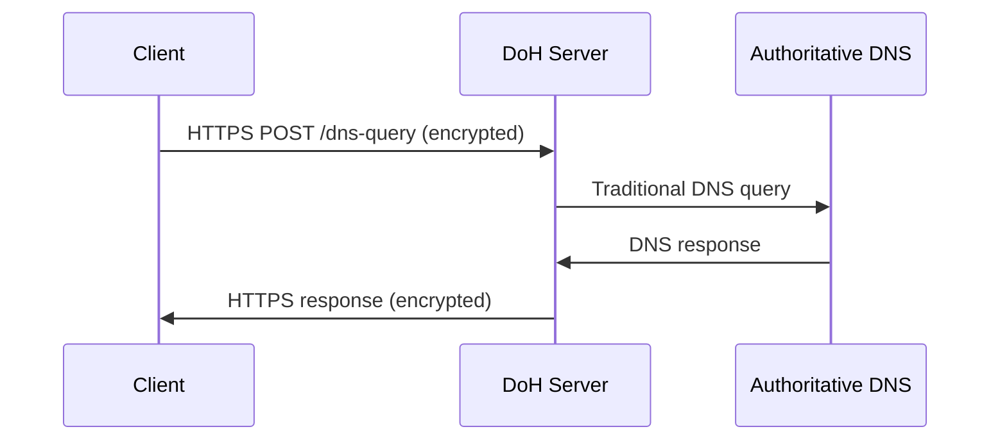
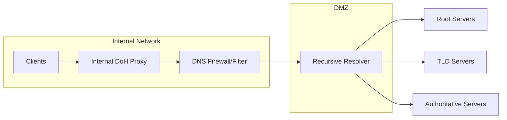

# How to Configure DNS over HTTPS (DoH)

Author: [nawazdhandala](https://www.github.com/nawazdhandala)

Tags: DNS, Networking, Security, Privacy, DoH, HTTPS, Infrastructure

Description: A practical guide to configuring DNS over HTTPS (DoH) for improved privacy and security in your applications and infrastructure.

---

Traditional DNS queries travel over the network in plain text. Anyone with access to your network traffic - ISPs, governments, attackers on public WiFi - can see exactly which domains you're resolving. DNS over HTTPS (DoH) solves this by wrapping DNS queries inside encrypted HTTPS connections.

This guide covers what DoH is, why it matters, and how to implement it across different scenarios.

---

## How DoH Works

In traditional DNS, your computer sends a UDP packet to a DNS resolver (usually on port 53) asking "What's the IP for example.com?" The response comes back in plain text. DoH changes this by:

1. Establishing an HTTPS connection to a DoH server
2. Sending DNS queries as HTTP requests
3. Receiving DNS responses as HTTP responses
4. All encrypted with TLS



The key difference: the connection between your client and the DoH server is encrypted. An observer sees HTTPS traffic to a DoH provider, but cannot see which domains you're querying.

---

## Configuring DoH on Linux with systemd-resolved

Modern Linux distributions using systemd can enable DoH through systemd-resolved.

Edit the resolved configuration:

```bash
# /etc/systemd/resolved.conf
[Resolve]
DNS=1.1.1.1#cloudflare-dns.com
DNSOverTLS=yes
DNSSEC=yes
FallbackDNS=8.8.8.8#dns.google
```

Then restart the service:

```bash
# Restart systemd-resolved to apply changes
sudo systemctl restart systemd-resolved

# Verify the configuration
resolvectl status
```

Note: systemd-resolved actually uses DNS over TLS (DoT) rather than DoH, but provides similar privacy benefits with encrypted DNS transport.

---

## Setting Up a DoH Proxy with cloudflared

For environments that need DoH specifically, Cloudflare's cloudflared daemon acts as a local DoH proxy.

```bash
# Install cloudflared on Debian/Ubuntu
curl -L https://github.com/cloudflare/cloudflared/releases/latest/download/cloudflared-linux-amd64.deb -o cloudflared.deb
sudo dpkg -i cloudflared.deb

# Create a configuration file
sudo mkdir -p /etc/cloudflared
```

Create the configuration:

```yaml
# /etc/cloudflared/config.yml
proxy-dns: true
proxy-dns-port: 53
proxy-dns-upstream:
  - https://1.1.1.1/dns-query
  - https://1.0.0.1/dns-query
```

Set up as a systemd service:

```bash
# Install the service
sudo cloudflared service install

# Start and enable
sudo systemctl start cloudflared
sudo systemctl enable cloudflared

# Verify it's running
dig @127.0.0.1 example.com
```

Now point your system's DNS resolver to 127.0.0.1, and all DNS queries will be proxied over HTTPS.

---

## Implementing DoH in Applications

### Node.js Example

```javascript
// doh-resolver.js
const https = require('https');
const dns = require('dns');

class DoHResolver {
  constructor(serverUrl = 'https://cloudflare-dns.com/dns-query') {
    this.serverUrl = new URL(serverUrl);
  }

  // Resolve a domain using DoH with JSON API
  async resolve(domain, type = 'A') {
    return new Promise((resolve, reject) => {
      const url = new URL(this.serverUrl);
      url.searchParams.set('name', domain);
      url.searchParams.set('type', type);

      const options = {
        hostname: url.hostname,
        path: url.pathname + url.search,
        method: 'GET',
        headers: {
          'Accept': 'application/dns-json'
        }
      };

      const req = https.request(options, (res) => {
        let data = '';
        res.on('data', chunk => data += chunk);
        res.on('end', () => {
          try {
            const response = JSON.parse(data);
            // Extract answer records
            const answers = response.Answer || [];
            resolve(answers.map(a => ({
              name: a.name,
              type: a.type,
              ttl: a.TTL,
              data: a.data
            })));
          } catch (err) {
            reject(err);
          }
        });
      });

      req.on('error', reject);
      req.end();
    });
  }
}

// Usage example
async function main() {
  const resolver = new DoHResolver();

  try {
    const records = await resolver.resolve('example.com', 'A');
    console.log('A records:', records);

    const mxRecords = await resolver.resolve('example.com', 'MX');
    console.log('MX records:', mxRecords);
  } catch (err) {
    console.error('DoH resolution failed:', err);
  }
}

main();
```

### Python Example

```python
# doh_resolver.py
import requests
import json

class DoHResolver:
    def __init__(self, server_url='https://cloudflare-dns.com/dns-query'):
        self.server_url = server_url

    def resolve(self, domain, record_type='A'):
        """
        Resolve a domain using DNS over HTTPS.

        Args:
            domain: The domain name to resolve
            record_type: DNS record type (A, AAAA, MX, TXT, etc.)

        Returns:
            List of DNS answer records
        """
        headers = {
            'Accept': 'application/dns-json'
        }

        params = {
            'name': domain,
            'type': record_type
        }

        response = requests.get(
            self.server_url,
            headers=headers,
            params=params,
            timeout=5
        )
        response.raise_for_status()

        data = response.json()
        answers = data.get('Answer', [])

        return [
            {
                'name': record['name'],
                'type': record['type'],
                'ttl': record['TTL'],
                'data': record['data']
            }
            for record in answers
        ]


# Usage example
if __name__ == '__main__':
    resolver = DoHResolver()

    # Resolve A records
    a_records = resolver.resolve('example.com', 'A')
    print(f"A records: {json.dumps(a_records, indent=2)}")

    # Resolve TXT records
    txt_records = resolver.resolve('example.com', 'TXT')
    print(f"TXT records: {json.dumps(txt_records, indent=2)}")
```

---

## DoH Architecture for Enterprise

For organizations, running your own DoH resolver provides control over DNS while maintaining encryption.



### Running CoreDNS with DoH

CoreDNS can be configured to accept DoH queries:

```
# Corefile
. {
    # Enable DoH on port 443
    https://.:443 {
        tls /etc/coredns/cert.pem /etc/coredns/key.pem
    }

    # Forward to upstream resolvers
    forward . 1.1.1.1 8.8.8.8 {
        tls_servername cloudflare-dns.com
    }

    # Cache responses
    cache 300

    # Log queries for debugging
    log
}
```

---

## Browser Configuration

Modern browsers support DoH natively. Here's how to enable it:

### Firefox

1. Open Settings and search for "DNS"
2. Under Network Settings, enable "DNS over HTTPS"
3. Select a provider or enter a custom URL

### Chrome/Edge

1. Go to Settings, then Privacy and Security
2. Find "Use secure DNS"
3. Select a provider from the dropdown

### Programmatic Browser Configuration

For automated deployments, configure via policies:

```json
{
  "policies": {
    "DNSOverHTTPS": {
      "Enabled": true,
      "ProviderURL": "https://dns.example.com/dns-query",
      "Locked": true
    }
  }
}
```

---

## Testing Your DoH Configuration

Verify DoH is working correctly:

```bash
# Test with curl using the DNS JSON API
curl -s -H 'Accept: application/dns-json' \
  'https://cloudflare-dns.com/dns-query?name=example.com&type=A' | jq

# Test with the wire format (RFC 8484)
echo -n 'q80BAAABAAAAAAAAB2V4YW1wbGUDY29tAAABAAE=' | \
  base64 -d | \
  curl -s -H 'Content-Type: application/dns-message' \
    --data-binary @- \
    'https://cloudflare-dns.com/dns-query' | \
  hexdump -C

# Verify no plain DNS leaks using tcpdump
sudo tcpdump -i any port 53
# (Should see no traffic when DoH is working)
```

---

## Common DoH Providers

| Provider | URL | Notes |
|----------|-----|-------|
| Cloudflare | https://cloudflare-dns.com/dns-query | Fast, privacy-focused |
| Google | https://dns.google/dns-query | Widely available |
| Quad9 | https://dns.quad9.net/dns-query | Blocks malware domains |
| NextDNS | https://dns.nextdns.io | Customizable filtering |

---

## Security Considerations

DoH improves privacy but introduces new considerations:

**Trust shifts to the DoH provider.** Your ISP can't see your queries, but your DoH provider can. Choose providers with strong privacy policies.

**Bypasses network security controls.** Traditional DNS-based filtering won't work. Consider running your own DoH resolver that integrates with your security stack.

**Certificate validation is critical.** Always verify TLS certificates. A compromised DoH endpoint could redirect you to malicious sites.

**Split-horizon DNS may break.** If your organization uses different DNS responses internally vs externally, DoH to external providers will bypass internal DNS.

---

DNS over HTTPS represents a significant step forward for DNS privacy. Whether you're protecting user privacy, securing application communications, or building infrastructure that resists surveillance, DoH is worth implementing. Start with browser-level DoH for quick wins, then consider deploying organizational DoH infrastructure for complete coverage.
