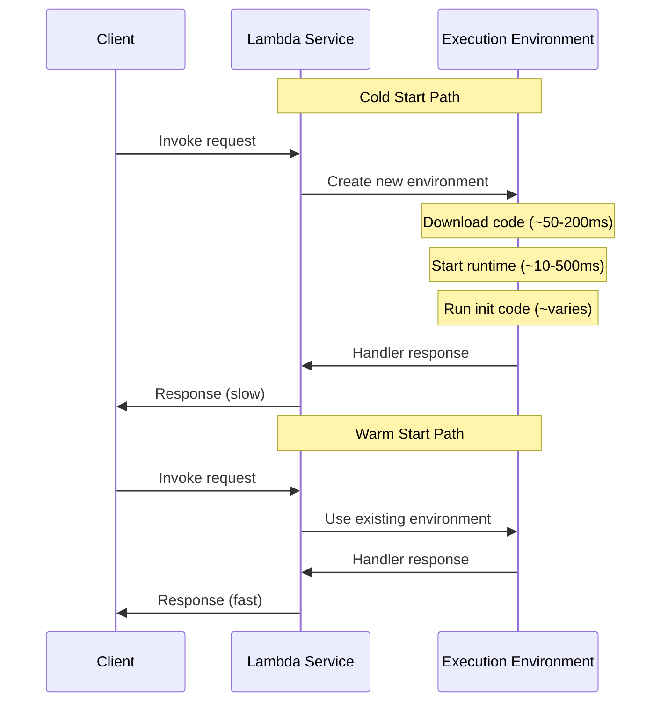
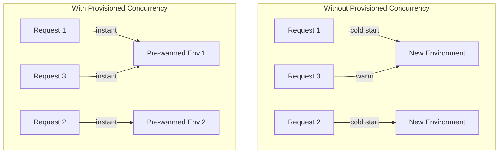
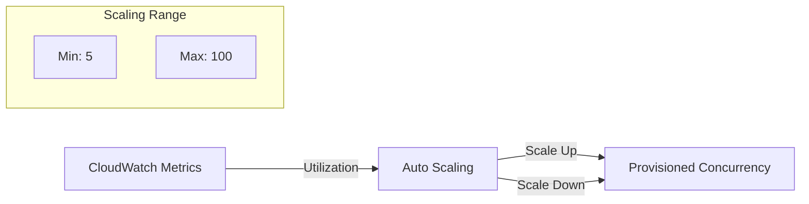
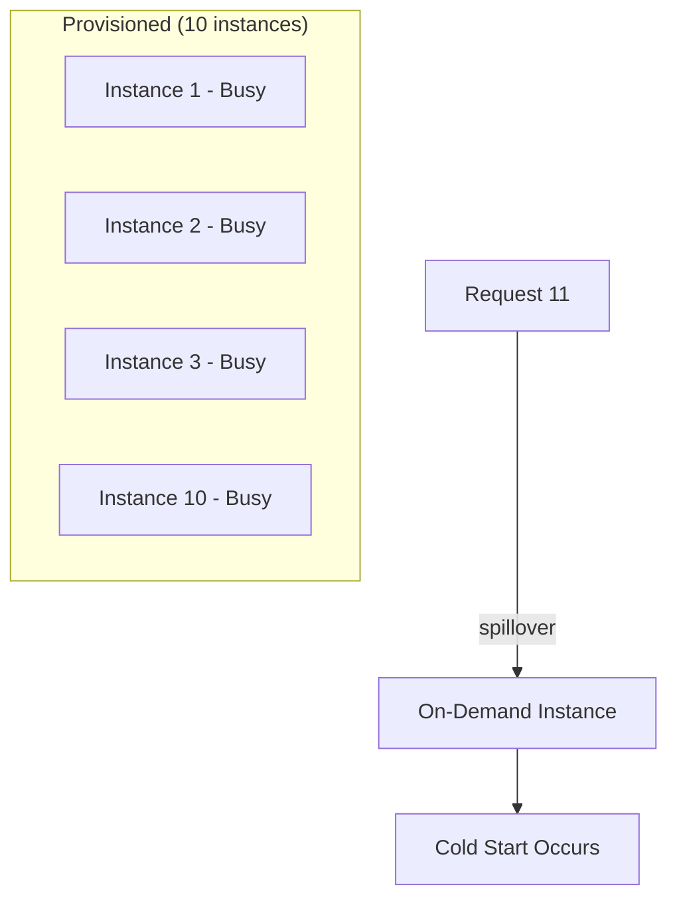

# How to Configure Lambda Provisioned Concurrency

Author: [nawazdhandala](https://www.github.com/nawazdhandala)

Tags: AWS, Lambda, Serverless, Performance, Cold Start, Scaling

Description: Learn how to configure AWS Lambda Provisioned Concurrency to eliminate cold starts and ensure consistent low-latency performance for production workloads.

---

Cold starts are the most common performance complaint with AWS Lambda. When a function has not been invoked recently, Lambda must initialize a new execution environment, download your code, start the runtime, and run initialization code. This adds latency that ranges from hundreds of milliseconds to several seconds depending on your runtime and dependencies. Provisioned Concurrency keeps execution environments warm and ready, eliminating this latency.

## Understanding Cold Starts

A cold start occurs when Lambda creates a new execution environment to handle a request. The initialization includes:

1. Creating the microVM and execution environment
2. Downloading and extracting your deployment package
3. Starting the runtime (Node.js, Python, Java, etc.)
4. Running initialization code outside your handler



### Cold Start Duration by Runtime

| Runtime | Typical Cold Start | With Dependencies |
|---------|-------------------|-------------------|
| Python 3.12 | 100-200ms | 200-500ms |
| Node.js 20 | 100-200ms | 200-400ms |
| Go | 50-100ms | 100-200ms |
| Java 21 | 500ms-3s | 1-5s |
| .NET 8 | 300ms-1s | 500ms-2s |

## What Is Provisioned Concurrency?

Provisioned Concurrency pre-initializes a specified number of execution environments. These environments are always ready to respond immediately, eliminating cold start latency.



## Configuring Provisioned Concurrency

### Using AWS CLI

```bash
# First, publish a version (provisioned concurrency requires a version or alias)
aws lambda publish-version \
  --function-name api-handler \
  --description "Production release v1.0"

# Note the version number from output, e.g., "Version": "1"

# Configure provisioned concurrency for the version
aws lambda put-provisioned-concurrency-config \
  --function-name api-handler \
  --qualifier 1 \
  --provisioned-concurrent-executions 10

# Or create an alias and configure on the alias
aws lambda create-alias \
  --function-name api-handler \
  --name production \
  --function-version 1

aws lambda put-provisioned-concurrency-config \
  --function-name api-handler \
  --qualifier production \
  --provisioned-concurrent-executions 10
```

### Check Provisioned Concurrency Status

```bash
# Check configuration status
aws lambda get-provisioned-concurrency-config \
  --function-name api-handler \
  --qualifier production

# Output shows status and allocated concurrency
# {
#   "RequestedProvisionedConcurrentExecutions": 10,
#   "AvailableProvisionedConcurrentExecutions": 10,
#   "AllocatedProvisionedConcurrentExecutions": 10,
#   "Status": "READY"
# }
```

## Configuring with Terraform

```hcl
# Lambda function
resource "aws_lambda_function" "api" {
  function_name = "api-handler"
  role          = aws_iam_role.lambda.arn
  handler       = "index.handler"
  runtime       = "nodejs20.x"
  filename      = "function.zip"

  # Ensure publish = true to create versions
  publish = true

  memory_size = 1024
  timeout     = 30
}

# Alias pointing to the latest version
resource "aws_lambda_alias" "production" {
  name             = "production"
  function_name    = aws_lambda_function.api.function_name
  function_version = aws_lambda_function.api.version
}

# Provisioned concurrency on the alias
resource "aws_lambda_provisioned_concurrency_config" "api" {
  function_name                     = aws_lambda_function.api.function_name
  qualifier                         = aws_lambda_alias.production.name
  provisioned_concurrent_executions = 10
}

# API Gateway pointing to the alias
resource "aws_apigatewayv2_integration" "api" {
  api_id             = aws_apigatewayv2_api.main.id
  integration_type   = "AWS_PROXY"
  integration_uri    = aws_lambda_alias.production.invoke_arn
  integration_method = "POST"
}
```

## Configuring with AWS SAM

```yaml
AWSTemplateFormatVersion: '2010-09-09'
Transform: AWS::Serverless-2016-10-31
Description: Lambda with Provisioned Concurrency

Resources:
  ApiFunction:
    Type: AWS::Serverless::Function
    Properties:
      FunctionName: api-handler
      Handler: index.handler
      Runtime: nodejs20.x
      CodeUri: ./src
      MemorySize: 1024
      Timeout: 30
      AutoPublishAlias: production
      ProvisionedConcurrencyConfig:
        ProvisionedConcurrentExecutions: 10
      Events:
        Api:
          Type: Api
          Properties:
            Path: /api/{proxy+}
            Method: ANY
```

## Auto Scaling Provisioned Concurrency

For workloads with variable traffic, use Application Auto Scaling to adjust provisioned concurrency automatically.



### Terraform Configuration

```hcl
# Auto Scaling target
resource "aws_appautoscaling_target" "lambda" {
  service_namespace  = "lambda"
  resource_id        = "function:${aws_lambda_function.api.function_name}:${aws_lambda_alias.production.name}"
  scalable_dimension = "lambda:function:ProvisionedConcurrency"
  min_capacity       = 5
  max_capacity       = 100
}

# Scale based on provisioned concurrency utilization
resource "aws_appautoscaling_policy" "lambda" {
  name               = "lambda-provisioned-concurrency-scaling"
  service_namespace  = aws_appautoscaling_target.lambda.service_namespace
  resource_id        = aws_appautoscaling_target.lambda.resource_id
  scalable_dimension = aws_appautoscaling_target.lambda.scalable_dimension
  policy_type        = "TargetTrackingScaling"

  target_tracking_scaling_policy_configuration {
    target_value = 0.7  # Scale when 70% of provisioned concurrency is used

    predefined_metric_specification {
      predefined_metric_type = "LambdaProvisionedConcurrencyUtilization"
    }

    scale_in_cooldown  = 300
    scale_out_cooldown = 60
  }
}

# Scheduled scaling for predictable traffic patterns
resource "aws_appautoscaling_scheduled_action" "morning_scale_up" {
  name               = "morning-scale-up"
  service_namespace  = aws_appautoscaling_target.lambda.service_namespace
  resource_id        = aws_appautoscaling_target.lambda.resource_id
  scalable_dimension = aws_appautoscaling_target.lambda.scalable_dimension

  schedule = "cron(0 8 * * ? *)"  # 8 AM UTC daily

  scalable_target_action {
    min_capacity = 50
    max_capacity = 100
  }
}

resource "aws_appautoscaling_scheduled_action" "evening_scale_down" {
  name               = "evening-scale-down"
  service_namespace  = aws_appautoscaling_target.lambda.service_namespace
  resource_id        = aws_appautoscaling_target.lambda.resource_id
  scalable_dimension = aws_appautoscaling_target.lambda.scalable_dimension

  schedule = "cron(0 22 * * ? *)"  # 10 PM UTC daily

  scalable_target_action {
    min_capacity = 5
    max_capacity = 20
  }
}
```

## Calculating Required Provisioned Concurrency

Determine the right amount of provisioned concurrency based on your traffic patterns.

### Formula

```
Provisioned Concurrency = (Requests per second) x (Average duration in seconds)
```

### Example Calculation

```
Traffic: 100 requests/second
Average duration: 200ms (0.2 seconds)

Provisioned Concurrency = 100 x 0.2 = 20 concurrent executions
```

### Using CloudWatch Metrics

```bash
# Get concurrent execution metrics
aws cloudwatch get-metric-statistics \
  --namespace AWS/Lambda \
  --metric-name ConcurrentExecutions \
  --dimensions Name=FunctionName,Value=api-handler \
  --start-time 2026-01-27T00:00:00Z \
  --end-time 2026-01-28T00:00:00Z \
  --period 3600 \
  --statistics Maximum Average
```

### Terraform for CloudWatch Dashboard

```hcl
resource "aws_cloudwatch_dashboard" "lambda" {
  dashboard_name = "lambda-provisioned-concurrency"

  dashboard_body = jsonencode({
    widgets = [
      {
        type   = "metric"
        x      = 0
        y      = 0
        width  = 12
        height = 6
        properties = {
          title  = "Provisioned Concurrency Utilization"
          region = var.region
          metrics = [
            ["AWS/Lambda", "ProvisionedConcurrencyUtilization",
             "FunctionName", aws_lambda_function.api.function_name,
             "Resource", "${aws_lambda_function.api.function_name}:${aws_lambda_alias.production.name}"]
          ]
          stat   = "Average"
          period = 60
        }
      },
      {
        type   = "metric"
        x      = 12
        y      = 0
        width  = 12
        height = 6
        properties = {
          title  = "Spillover Invocations"
          region = var.region
          metrics = [
            ["AWS/Lambda", "ProvisionedConcurrencySpilloverInvocations",
             "FunctionName", aws_lambda_function.api.function_name,
             "Resource", "${aws_lambda_function.api.function_name}:${aws_lambda_alias.production.name}"]
          ]
          stat   = "Sum"
          period = 60
        }
      }
    ]
  })
}
```

## Cost Optimization Strategies

Provisioned Concurrency costs more than on-demand Lambda. Use these strategies to optimize costs.

### Pricing Comparison

| Metric | On-Demand | Provisioned Concurrency |
|--------|-----------|------------------------|
| Invocations | $0.20 per 1M | $0.20 per 1M |
| Duration | $0.0000166667/GB-s | $0.000004167/GB-s |
| Provisioned | N/A | $0.000004167/GB-s (always) |

### Strategy 1: Use Provisioned Concurrency Only for Critical Paths

```hcl
# Critical API - use provisioned concurrency
resource "aws_lambda_function" "api" {
  function_name = "critical-api"
  # ... config
}

resource "aws_lambda_provisioned_concurrency_config" "api" {
  function_name                     = aws_lambda_function.api.function_name
  qualifier                         = aws_lambda_alias.production.name
  provisioned_concurrent_executions = 20
}

# Background worker - no provisioned concurrency needed
resource "aws_lambda_function" "worker" {
  function_name = "background-worker"
  # ... config
  # No provisioned concurrency - cold starts are acceptable
}
```

### Strategy 2: Time-Based Scheduling

```hcl
# Scale to zero during off-hours
resource "aws_appautoscaling_scheduled_action" "off_hours" {
  name               = "off-hours-scale-down"
  service_namespace  = "lambda"
  resource_id        = "function:${aws_lambda_function.api.function_name}:production"
  scalable_dimension = "lambda:function:ProvisionedConcurrency"

  # Midnight to 6 AM - minimal provisioned concurrency
  schedule = "cron(0 0 * * ? *)"

  scalable_target_action {
    min_capacity = 1
    max_capacity = 5
  }
}
```

### Strategy 3: Use Compute Savings Plans

AWS Compute Savings Plans provide up to 17% discount on Lambda, including provisioned concurrency costs.

## Handling Spillover

When all provisioned instances are busy, additional requests "spill over" to on-demand execution environments, incurring cold starts.



### Monitoring Spillover

```hcl
# Alarm for spillover invocations
resource "aws_cloudwatch_metric_alarm" "spillover" {
  alarm_name          = "lambda-provisioned-spillover"
  comparison_operator = "GreaterThanThreshold"
  evaluation_periods  = 3
  metric_name         = "ProvisionedConcurrencySpilloverInvocations"
  namespace           = "AWS/Lambda"
  period              = 60
  statistic           = "Sum"
  threshold           = 10

  dimensions = {
    FunctionName = aws_lambda_function.api.function_name
    Resource     = "${aws_lambda_function.api.function_name}:production"
  }

  alarm_description = "Requests are spilling over to on-demand execution"
  alarm_actions     = [aws_sns_topic.alerts.arn]
}
```

## Optimizing Function Initialization

Provisioned Concurrency runs your initialization code once per environment. Optimize init time for faster provisioning.

### Move Work to Init Phase

```javascript
// index.js - Initialization runs once per provisioned instance
const AWS = require('aws-sdk');
const pg = require('pg');

// These initialize during provisioning, not during invocation
const secretsManager = new AWS.SecretsManager();
let dbPool = null;
let cachedConfig = null;

// Initialization runs during provisioning
async function initialize() {
  if (cachedConfig) return;

  // Fetch secrets once
  const secret = await secretsManager.getSecretValue({
    SecretId: process.env.DB_SECRET_ARN
  }).promise();

  cachedConfig = JSON.parse(secret.SecretString);

  // Create database connection pool
  dbPool = new pg.Pool({
    host: cachedConfig.host,
    user: cachedConfig.username,
    password: cachedConfig.password,
    database: cachedConfig.database,
    max: 1  // Single connection per Lambda instance
  });

  // Warm the connection
  await dbPool.query('SELECT 1');

  console.log('Initialization complete');
}

// Run initialization immediately
const initPromise = initialize();

exports.handler = async (event, context) => {
  // Wait for init if not complete (usually instant after provisioning)
  await initPromise;

  // Handler code runs with warm resources
  const result = await dbPool.query('SELECT * FROM users WHERE id = $1', [event.userId]);

  return {
    statusCode: 200,
    body: JSON.stringify(result.rows[0])
  };
};
```

### Monitor Initialization Duration

```hcl
# CloudWatch Insights query for init duration
resource "aws_cloudwatch_query_definition" "init_duration" {
  name = "lambda-init-duration"

  query_string = <<EOF
fields @timestamp, @message
| filter @type = "REPORT"
| parse @message "Init Duration: * ms" as initDuration
| filter ispresent(initDuration)
| stats avg(initDuration), max(initDuration), count() by bin(1h)
EOF

  log_group_names = ["/aws/lambda/${aws_lambda_function.api.function_name}"]
}
```

## Deployment Strategies with Provisioned Concurrency

### Blue-Green Deployment

```hcl
# Two aliases for blue-green deployment
resource "aws_lambda_alias" "blue" {
  name             = "blue"
  function_name    = aws_lambda_function.api.function_name
  function_version = var.blue_version
}

resource "aws_lambda_alias" "green" {
  name             = "green"
  function_name    = aws_lambda_function.api.function_name
  function_version = var.green_version
}

# Provisioned concurrency on active alias
resource "aws_lambda_provisioned_concurrency_config" "active" {
  function_name                     = aws_lambda_function.api.function_name
  qualifier                         = var.active_alias  # "blue" or "green"
  provisioned_concurrent_executions = 20
}

# API Gateway weighted routing
resource "aws_apigatewayv2_integration" "api" {
  api_id             = aws_apigatewayv2_api.main.id
  integration_type   = "AWS_PROXY"
  integration_uri    = var.active_alias == "blue" ? aws_lambda_alias.blue.invoke_arn : aws_lambda_alias.green.invoke_arn
}
```

### Canary Deployment with Traffic Shifting

```yaml
# SAM template with gradual traffic shifting
Resources:
  ApiFunction:
    Type: AWS::Serverless::Function
    Properties:
      FunctionName: api-handler
      Handler: index.handler
      Runtime: nodejs20.x
      CodeUri: ./src
      AutoPublishAlias: production
      ProvisionedConcurrencyConfig:
        ProvisionedConcurrentExecutions: 20
      DeploymentPreference:
        Type: Canary10Percent10Minutes
        Alarms:
          - !Ref ErrorAlarm
          - !Ref LatencyAlarm
```

---

Provisioned Concurrency eliminates cold starts by keeping execution environments initialized and ready. While it adds cost compared to on-demand Lambda, the consistent low-latency performance is essential for user-facing APIs and latency-sensitive workloads. Use auto scaling to match provisioned capacity to demand, monitor spillover to ensure adequate capacity, and optimize your initialization code to make the most of the provisioned environments.
