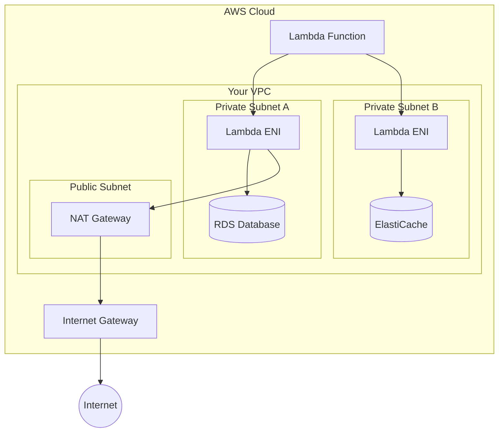
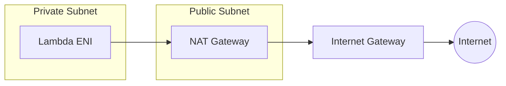

# How to Configure Lambda VPC Access

Author: [nawazdhandala](https://www.github.com/nawazdhandala)

Tags: AWS, Lambda, VPC, Serverless, Networking, Security

Description: Learn how to configure AWS Lambda functions to access resources inside your VPC, including RDS databases, ElastiCache, and private APIs.

---

AWS Lambda functions run in AWS-managed VPCs by default, which means they cannot access resources in your private VPCs. To connect Lambda to your RDS database, ElastiCache cluster, or internal APIs, you need to configure VPC access. This guide walks through the configuration process, common pitfalls, and best practices.

## Why VPC Access Matters

Many applications require Lambda functions to interact with resources that should not be exposed to the public internet:

- **Databases**: RDS instances, Aurora clusters, or self-managed databases on EC2
- **Caching**: ElastiCache Redis or Memcached clusters
- **Internal Services**: Private APIs running on ECS, EKS, or EC2
- **File Systems**: Amazon EFS for persistent storage

Without VPC configuration, Lambda cannot reach these resources regardless of security group rules.

## VPC Access Architecture



When you enable VPC access, Lambda creates Elastic Network Interfaces (ENIs) in your specified subnets. Traffic from your function flows through these ENIs into your VPC.

## Prerequisites

Before configuring VPC access, ensure you have:

1. A VPC with at least two subnets in different Availability Zones
2. A security group for your Lambda function
3. IAM permissions to create network interfaces

### Required IAM Permissions

Your Lambda execution role needs these permissions:

```json
{
  "Version": "2012-10-17",
  "Statement": [
    {
      "Effect": "Allow",
      "Action": [
        "ec2:CreateNetworkInterface",
        "ec2:DescribeNetworkInterfaces",
        "ec2:DeleteNetworkInterface",
        "ec2:AssignPrivateIpAddresses",
        "ec2:UnassignPrivateIpAddresses"
      ],
      "Resource": "*"
    }
  ]
}
```

AWS provides a managed policy for this: `AWSLambdaVPCAccessExecutionRole`.

## Configuration with AWS CLI

### Step 1: Create a Security Group

```bash
# Create a security group for Lambda
aws ec2 create-security-group \
  --group-name lambda-vpc-sg \
  --description "Security group for Lambda VPC access" \
  --vpc-id vpc-0123456789abcdef0

# Note the security group ID from the output
# Example: sg-0123456789abcdef0
```

### Step 2: Configure Security Group Rules

```bash
# Allow outbound traffic to your database (port 5432 for PostgreSQL)
aws ec2 authorize-security-group-egress \
  --group-id sg-0123456789abcdef0 \
  --protocol tcp \
  --port 5432 \
  --source-group sg-database-group-id

# Allow outbound HTTPS for AWS service calls
aws ec2 authorize-security-group-egress \
  --group-id sg-0123456789abcdef0 \
  --protocol tcp \
  --port 443 \
  --cidr 0.0.0.0/0
```

### Step 3: Update Lambda Function

```bash
# Configure VPC access for existing function
aws lambda update-function-configuration \
  --function-name my-function \
  --vpc-config SubnetIds=subnet-0123456789abcdef0,subnet-0987654321fedcba0,SecurityGroupIds=sg-0123456789abcdef0
```

## Configuration with Terraform

```hcl
# VPC configuration for Lambda
resource "aws_security_group" "lambda" {
  name        = "lambda-vpc-sg"
  description = "Security group for Lambda VPC access"
  vpc_id      = var.vpc_id

  # Allow outbound to RDS
  egress {
    from_port       = 5432
    to_port         = 5432
    protocol        = "tcp"
    security_groups = [aws_security_group.rds.id]
  }

  # Allow outbound HTTPS for AWS APIs
  egress {
    from_port   = 443
    to_port     = 443
    protocol    = "tcp"
    cidr_blocks = ["0.0.0.0/0"]
  }

  tags = {
    Name = "lambda-vpc-sg"
  }
}

# Lambda function with VPC configuration
resource "aws_lambda_function" "api" {
  function_name = "api-handler"
  role          = aws_iam_role.lambda.arn
  handler       = "index.handler"
  runtime       = "nodejs20.x"
  filename      = "function.zip"

  # VPC configuration
  vpc_config {
    subnet_ids         = var.private_subnet_ids
    security_group_ids = [aws_security_group.lambda.id]
  }

  environment {
    variables = {
      DB_HOST = aws_db_instance.main.address
      DB_NAME = "myapp"
    }
  }

  # Ensure IAM role has VPC permissions before creating
  depends_on = [aws_iam_role_policy_attachment.lambda_vpc]
}

# Attach VPC access policy to Lambda role
resource "aws_iam_role_policy_attachment" "lambda_vpc" {
  role       = aws_iam_role.lambda.name
  policy_arn = "arn:aws:iam::aws:policy/service-role/AWSLambdaVPCAccessExecutionRole"
}
```

## Configuration with AWS SAM

```yaml
AWSTemplateFormatVersion: '2010-09-09'
Transform: AWS::Serverless-2016-10-31
Description: Lambda function with VPC access

Parameters:
  VpcId:
    Type: AWS::EC2::VPC::Id
  SubnetIds:
    Type: List<AWS::EC2::Subnet::Id>

Resources:
  LambdaSecurityGroup:
    Type: AWS::EC2::SecurityGroup
    Properties:
      GroupDescription: Security group for Lambda VPC access
      VpcId: !Ref VpcId
      SecurityGroupEgress:
        - IpProtocol: tcp
          FromPort: 5432
          ToPort: 5432
          CidrIp: 10.0.0.0/16  # VPC CIDR
        - IpProtocol: tcp
          FromPort: 443
          ToPort: 443
          CidrIp: 0.0.0.0/0

  ApiFunction:
    Type: AWS::Serverless::Function
    Properties:
      FunctionName: api-handler
      Handler: index.handler
      Runtime: nodejs20.x
      CodeUri: ./src
      VpcConfig:
        SubnetIds: !Ref SubnetIds
        SecurityGroupIds:
          - !Ref LambdaSecurityGroup
      Policies:
        - VPCAccessPolicy: {}
      Environment:
        Variables:
          DB_HOST: !Ref DatabaseEndpoint
```

## Enabling Internet Access from VPC Lambda

Lambda functions in a VPC lose default internet access. To call external APIs or AWS services, you need one of these options:

### Option 1: NAT Gateway

Route traffic through a NAT Gateway in a public subnet.



```hcl
# NAT Gateway setup
resource "aws_eip" "nat" {
  domain = "vpc"
}

resource "aws_nat_gateway" "main" {
  allocation_id = aws_eip.nat.id
  subnet_id     = var.public_subnet_id

  tags = {
    Name = "lambda-nat"
  }
}

# Route table for private subnets
resource "aws_route_table" "private" {
  vpc_id = var.vpc_id

  route {
    cidr_block     = "0.0.0.0/0"
    nat_gateway_id = aws_nat_gateway.main.id
  }
}

resource "aws_route_table_association" "private" {
  count          = length(var.private_subnet_ids)
  subnet_id      = var.private_subnet_ids[count.index]
  route_table_id = aws_route_table.private.id
}
```

### Option 2: VPC Endpoints (Recommended)

Use VPC Endpoints to access AWS services without internet access.

```hcl
# S3 Gateway Endpoint (free)
resource "aws_vpc_endpoint" "s3" {
  vpc_id       = var.vpc_id
  service_name = "com.amazonaws.${var.region}.s3"

  route_table_ids = [aws_route_table.private.id]

  tags = {
    Name = "s3-endpoint"
  }
}

# DynamoDB Gateway Endpoint (free)
resource "aws_vpc_endpoint" "dynamodb" {
  vpc_id       = var.vpc_id
  service_name = "com.amazonaws.${var.region}.dynamodb"

  route_table_ids = [aws_route_table.private.id]

  tags = {
    Name = "dynamodb-endpoint"
  }
}

# Secrets Manager Interface Endpoint
resource "aws_vpc_endpoint" "secrets_manager" {
  vpc_id              = var.vpc_id
  service_name        = "com.amazonaws.${var.region}.secretsmanager"
  vpc_endpoint_type   = "Interface"
  subnet_ids          = var.private_subnet_ids
  security_group_ids  = [aws_security_group.vpc_endpoints.id]
  private_dns_enabled = true

  tags = {
    Name = "secrets-manager-endpoint"
  }
}

# Security group for interface endpoints
resource "aws_security_group" "vpc_endpoints" {
  name        = "vpc-endpoints-sg"
  description = "Security group for VPC endpoints"
  vpc_id      = var.vpc_id

  ingress {
    from_port       = 443
    to_port         = 443
    protocol        = "tcp"
    security_groups = [aws_security_group.lambda.id]
  }
}
```

## Example: Lambda Connecting to RDS

```javascript
// index.js - Lambda function connecting to PostgreSQL in VPC
const { Client } = require('pg');

// Connection configuration
const dbConfig = {
  host: process.env.DB_HOST,
  port: parseInt(process.env.DB_PORT || '5432'),
  database: process.env.DB_NAME,
  user: process.env.DB_USER,
  password: process.env.DB_PASSWORD,
  // Connection pool settings for Lambda
  connectionTimeoutMillis: 5000,
  idleTimeoutMillis: 10000,
  max: 1  // Single connection per Lambda instance
};

let client = null;

// Reuse connection across invocations
async function getClient() {
  if (!client) {
    client = new Client(dbConfig);
    await client.connect();
  }
  return client;
}

exports.handler = async (event) => {
  try {
    const db = await getClient();

    const result = await db.query(
      'SELECT id, name, email FROM users WHERE id = $1',
      [event.userId]
    );

    if (result.rows.length === 0) {
      return {
        statusCode: 404,
        body: JSON.stringify({ error: 'User not found' })
      };
    }

    return {
      statusCode: 200,
      body: JSON.stringify(result.rows[0])
    };
  } catch (error) {
    console.error('Database error:', error);

    // Reset connection on error
    if (client) {
      try {
        await client.end();
      } catch (e) {
        // Ignore cleanup errors
      }
      client = null;
    }

    return {
      statusCode: 500,
      body: JSON.stringify({ error: 'Database connection failed' })
    };
  }
};
```

## Troubleshooting Common Issues

### Issue 1: Lambda Timeout During Deployment

**Symptom**: Function takes a long time to deploy or update.

**Cause**: Lambda is creating ENIs in your VPC, which can take 30-90 seconds.

**Solution**: This is expected behavior. Consider using provisioned concurrency to keep ENIs warm.

### Issue 2: Cannot Connect to Database

**Symptom**: Connection timeout errors.

**Checklist**:

```bash
# 1. Verify Lambda is in the correct subnets
aws lambda get-function-configuration --function-name my-function \
  --query 'VpcConfig.SubnetIds'

# 2. Check security group rules
aws ec2 describe-security-groups --group-ids sg-lambda-id \
  --query 'SecurityGroups[0].IpPermissionsEgress'

# 3. Verify database security group allows Lambda
aws ec2 describe-security-groups --group-ids sg-database-id \
  --query 'SecurityGroups[0].IpPermissions'
```

### Issue 3: Cannot Access AWS Services

**Symptom**: Timeout when calling S3, DynamoDB, or other AWS services.

**Cause**: Lambda in VPC has no internet access by default.

**Solution**: Add VPC endpoints or NAT Gateway.

```bash
# Check if endpoints exist
aws ec2 describe-vpc-endpoints --filters "Name=vpc-id,Values=vpc-xxx" \
  --query 'VpcEndpoints[].ServiceName'
```

### Issue 4: ENI Limits Exceeded

**Symptom**: Error creating function or scaling fails.

**Cause**: Reached ENI limit for the account or subnet.

**Solution**: Request limit increase or use fewer subnets.

```bash
# Check current ENI usage
aws ec2 describe-network-interfaces \
  --filters "Name=description,Values=*Lambda*" \
  --query 'length(NetworkInterfaces)'
```

## Best Practices

### 1. Use Multiple Availability Zones

Always configure at least two subnets in different AZs for high availability:

```hcl
vpc_config {
  subnet_ids = [
    aws_subnet.private_a.id,
    aws_subnet.private_b.id
  ]
  security_group_ids = [aws_security_group.lambda.id]
}
```

### 2. Minimize Security Group Rules

Apply the principle of least privilege:

```hcl
# Good: Specific port and target
egress {
  from_port       = 5432
  to_port         = 5432
  protocol        = "tcp"
  security_groups = [aws_security_group.rds.id]
}

# Avoid: Overly permissive
egress {
  from_port   = 0
  to_port     = 0
  protocol    = "-1"
  cidr_blocks = ["0.0.0.0/0"]
}
```

### 3. Use VPC Endpoints Over NAT

VPC endpoints are more secure and cost-effective for AWS services:

| Endpoint Type | Cost | Use Case |
|---------------|------|----------|
| Gateway (S3, DynamoDB) | Free | Always use for these services |
| Interface | ~$7.50/month + data | Secrets Manager, SQS, SNS |
| NAT Gateway | ~$32/month + data | External API calls only |

### 4. Monitor ENI Usage

Set up CloudWatch alarms for ENI usage:

```hcl
resource "aws_cloudwatch_metric_alarm" "eni_usage" {
  alarm_name          = "lambda-eni-usage"
  comparison_operator = "GreaterThanThreshold"
  evaluation_periods  = 1
  metric_name         = "NetworkInterfaceCount"
  namespace           = "AWS/EC2"
  period              = 300
  statistic           = "Maximum"
  threshold           = 200
  alarm_description   = "ENI usage approaching limits"
}
```

---

Configuring Lambda VPC access enables your serverless functions to securely interact with private resources like databases and caches. While the setup adds some complexity, following these patterns ensures reliable connectivity without compromising security. Remember to plan for internet access through NAT Gateways or VPC endpoints, and always apply least-privilege security group rules.
