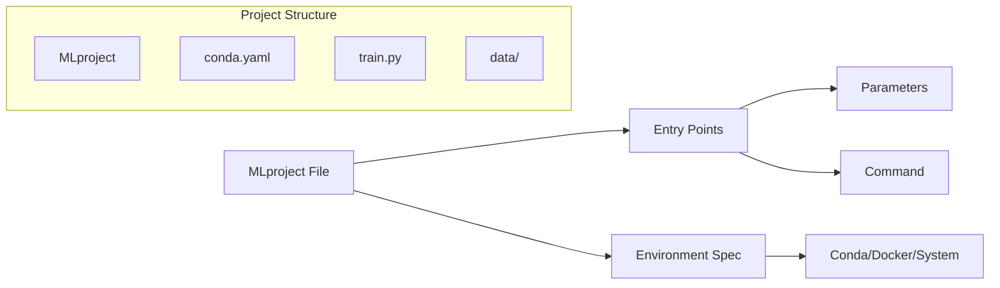
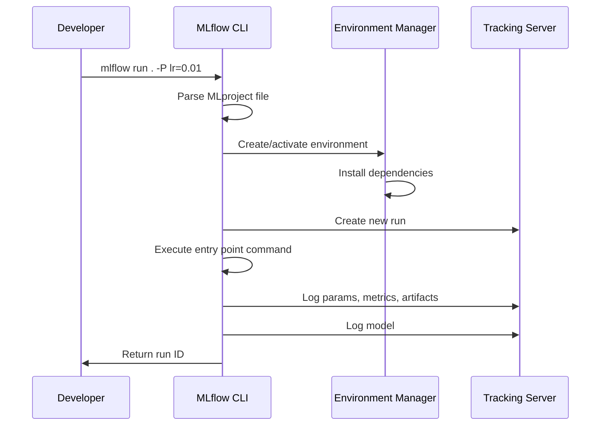

# How to Configure MLflow Projects

Author: [nawazdhandala](https://www.github.com/nawazdhandala)

Tags: MLflow, MLOps, Machine Learning, Python, Data Science

Description: A practical guide to configuring MLflow Projects for reproducible machine learning experiments with packaging, dependencies, and parameterized runs.

---

MLflow Projects provide a standard format for packaging and running machine learning code. Whether you are working solo or collaborating across teams, having a reproducible way to execute experiments is essential. This guide walks through the fundamentals of configuring MLflow Projects - from basic setup to advanced patterns.

## What is an MLflow Project?

An MLflow Project is a directory or Git repository containing your ML code, along with a specification file (MLproject) that defines:

- How to run the code
- What parameters it accepts
- What environment/dependencies are required

The key benefit is reproducibility. Anyone with access to the project can run the same experiment with the same dependencies and parameters.



## Basic Project Structure

A minimal MLflow project looks like this:

```
my_ml_project/
├── MLproject           # Project specification
├── conda.yaml          # Conda environment definition
├── train.py            # Main training script
└── utils/
    └── preprocessing.py
```

## Creating the MLproject File

The MLproject file is a YAML file that defines your project. Here is a complete example:

```yaml
# MLproject
name: customer_churn_model

# Specify the environment
conda_env: conda.yaml

# Define entry points (ways to run the project)
entry_points:
  # Main training entry point
  main:
    parameters:
      learning_rate: {type: float, default: 0.01}
      epochs: {type: int, default: 100}
      batch_size: {type: int, default: 32}
      data_path: {type: string, default: "data/train.csv"}
    command: "python train.py --lr {learning_rate} --epochs {epochs} --batch-size {batch_size} --data {data_path}"

  # Separate entry point for hyperparameter tuning
  hyperopt:
    parameters:
      max_evals: {type: int, default: 50}
    command: "python hyperopt_search.py --max-evals {max_evals}"

  # Entry point for model validation
  validate:
    parameters:
      model_uri: string
      test_data: {type: string, default: "data/test.csv"}
    command: "python validate.py --model {model_uri} --data {test_data}"
```

## Environment Configuration

MLflow supports three environment types: Conda, Docker, and System.

### Conda Environment

The most common approach uses a conda.yaml file:

```yaml
# conda.yaml
name: churn_model_env
channels:
  - conda-forge
  - defaults
dependencies:
  - python=3.10
  - pip
  - numpy=1.24.0
  - pandas=2.0.0
  - scikit-learn=1.3.0
  - pip:
    - mlflow>=2.9.0
    - xgboost>=2.0.0
    - shap>=0.43.0
```

### Docker Environment

For more control over the runtime, use Docker:

```yaml
# MLproject with Docker
name: customer_churn_model

docker_env:
  image: my-registry/ml-base:1.0
  volumes: ["/local/data:/container/data"]
  environment: ["MLFLOW_TRACKING_URI"]

entry_points:
  main:
    parameters:
      learning_rate: {type: float, default: 0.01}
    command: "python train.py --lr {learning_rate}"
```

Create a corresponding Dockerfile:

```dockerfile
# Dockerfile
FROM python:3.10-slim

WORKDIR /app

# Install dependencies
COPY requirements.txt .
RUN pip install --no-cache-dir -r requirements.txt

# Copy project files
COPY . .

# Set environment variables
ENV PYTHONUNBUFFERED=1
```

## Writing the Training Script

Your training script should integrate with MLflow tracking:

```python
# train.py
import argparse
import mlflow
import mlflow.sklearn
import pandas as pd
from sklearn.model_selection import train_test_split
from sklearn.ensemble import RandomForestClassifier
from sklearn.metrics import accuracy_score, precision_score, recall_score, f1_score

def parse_args():
    parser = argparse.ArgumentParser()
    parser.add_argument("--lr", type=float, default=0.01)
    parser.add_argument("--epochs", type=int, default=100)
    parser.add_argument("--batch-size", type=int, default=32)
    parser.add_argument("--data", type=str, default="data/train.csv")
    return parser.parse_args()

def train_model(args):
    # Load and prepare data
    df = pd.read_csv(args.data)
    X = df.drop("target", axis=1)
    y = df["target"]
    X_train, X_val, y_train, y_val = train_test_split(X, y, test_size=0.2)

    # Start MLflow run (automatically created when running as project)
    with mlflow.start_run():
        # Log parameters
        mlflow.log_param("learning_rate", args.lr)
        mlflow.log_param("epochs", args.epochs)
        mlflow.log_param("batch_size", args.batch_size)
        mlflow.log_param("data_path", args.data)

        # Train model
        model = RandomForestClassifier(
            n_estimators=args.epochs,
            max_depth=10,
            random_state=42
        )
        model.fit(X_train, y_train)

        # Evaluate
        predictions = model.predict(X_val)
        accuracy = accuracy_score(y_val, predictions)
        precision = precision_score(y_val, predictions, average="weighted")
        recall = recall_score(y_val, predictions, average="weighted")
        f1 = f1_score(y_val, predictions, average="weighted")

        # Log metrics
        mlflow.log_metric("accuracy", accuracy)
        mlflow.log_metric("precision", precision)
        mlflow.log_metric("recall", recall)
        mlflow.log_metric("f1_score", f1)

        # Log model with signature
        from mlflow.models.signature import infer_signature
        signature = infer_signature(X_train, predictions)
        mlflow.sklearn.log_model(model, "model", signature=signature)

        print(f"Model trained with accuracy: {accuracy:.4f}")

if __name__ == "__main__":
    args = parse_args()
    train_model(args)
```

## Running MLflow Projects

### Local Execution

Run a project from the local directory:

```bash
# Run with default parameters
mlflow run .

# Run with custom parameters
mlflow run . -P learning_rate=0.001 -P epochs=200

# Run a specific entry point
mlflow run . -e validate -P model_uri=runs:/abc123/model

# Specify experiment name
mlflow run . --experiment-name "churn_experiments"
```

### Running from Git

Run directly from a Git repository:

```bash
# Run from GitHub
mlflow run https://github.com/user/ml-project.git

# Run specific branch or commit
mlflow run https://github.com/user/ml-project.git -v feature-branch

# Run with Git credentials
mlflow run git@github.com:user/private-repo.git
```

### Programmatic Execution

Run projects from Python code:

```python
import mlflow

# Run project programmatically
run = mlflow.projects.run(
    uri="https://github.com/user/ml-project.git",
    entry_point="main",
    parameters={
        "learning_rate": 0.001,
        "epochs": 150,
        "batch_size": 64
    },
    experiment_name="automated_experiments",
    env_manager="conda"  # or "docker" or "local"
)

# Get run ID for tracking
print(f"Run ID: {run.run_id}")
```

## Advanced Configuration Patterns

### Multi-step Workflows

Chain multiple entry points for complex pipelines:

```python
# workflow.py
import mlflow

def run_pipeline():
    # Step 1: Data preprocessing
    preprocess_run = mlflow.projects.run(
        uri=".",
        entry_point="preprocess",
        parameters={"input_path": "raw_data/"},
        synchronous=True
    )

    # Get output path from preprocessing
    preprocess_client = mlflow.tracking.MlflowClient()
    preprocess_info = preprocess_client.get_run(preprocess_run.run_id)
    processed_data = preprocess_info.data.params["output_path"]

    # Step 2: Train model
    train_run = mlflow.projects.run(
        uri=".",
        entry_point="main",
        parameters={
            "data_path": processed_data,
            "learning_rate": 0.01
        },
        synchronous=True
    )

    # Step 3: Validate model
    validation_run = mlflow.projects.run(
        uri=".",
        entry_point="validate",
        parameters={
            "model_uri": f"runs:/{train_run.run_id}/model"
        },
        synchronous=True
    )

    return train_run.run_id

if __name__ == "__main__":
    final_run_id = run_pipeline()
    print(f"Pipeline completed. Final run: {final_run_id}")
```

### Environment Variables and Secrets

Handle sensitive configuration safely:

```yaml
# MLproject
name: secure_training

docker_env:
  image: ml-training:latest
  environment:
    - MLFLOW_TRACKING_URI
    - AWS_ACCESS_KEY_ID
    - AWS_SECRET_ACCESS_KEY
    - DATABASE_URL

entry_points:
  main:
    parameters:
      config_file: {type: string, default: "config.yaml"}
    command: "python train.py --config {config_file}"
```

```python
# train.py - accessing environment variables
import os

tracking_uri = os.environ.get("MLFLOW_TRACKING_URI")
db_url = os.environ.get("DATABASE_URL")

mlflow.set_tracking_uri(tracking_uri)
```

### Project Templates with Cookiecutter

Create reusable project templates:

```
mlflow-project-template/
├── {{cookiecutter.project_name}}/
│   ├── MLproject
│   ├── conda.yaml
│   ├── train.py
│   └── README.md
└── cookiecutter.json
```

```json
// cookiecutter.json
{
    "project_name": "my_ml_project",
    "author": "Data Science Team",
    "python_version": "3.10",
    "ml_framework": ["sklearn", "pytorch", "tensorflow"]
}
```

## Workflow Visualization



## Best Practices

1. **Pin dependency versions** - Always specify exact versions in conda.yaml to ensure reproducibility.

2. **Use meaningful entry point names** - Names like `train`, `validate`, `preprocess` are clearer than `main1`, `main2`.

3. **Set sensible defaults** - Every parameter should have a reasonable default value for quick experimentation.

4. **Document parameters** - Add comments in your MLproject file explaining what each parameter does.

5. **Version your projects** - Tag releases in Git so you can reference specific versions.

6. **Test locally first** - Run with `--env-manager=local` during development to speed up iteration.

## Troubleshooting Common Issues

**Environment creation fails:**
```bash
# Clear conda cache and retry
conda clean --all
mlflow run . --env-manager=conda
```

**Docker image not found:**
```bash
# Build and tag image locally first
docker build -t my-ml-image:latest .
mlflow run . --env-manager=docker
```

**Parameter type errors:**
```yaml
# Make sure types match in MLproject
parameters:
  # Wrong - will fail for decimals
  learning_rate: {type: int, default: 1}
  # Correct
  learning_rate: {type: float, default: 0.01}
```

---

MLflow Projects bring structure and reproducibility to machine learning workflows. By defining clear entry points, managing dependencies explicitly, and integrating with MLflow tracking, you create experiments that anyone on your team can run and reproduce. Start with a simple MLproject file, add parameters as needed, and build up to multi-step workflows as your projects grow in complexity.
