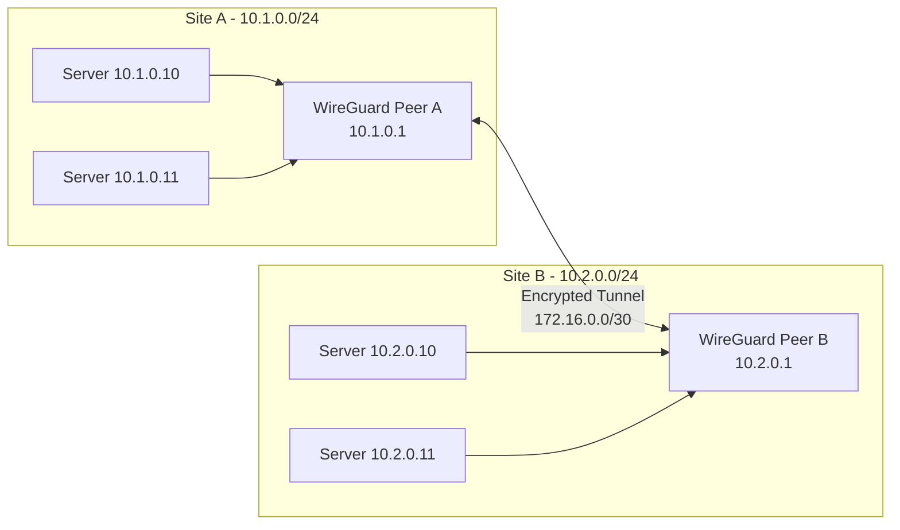
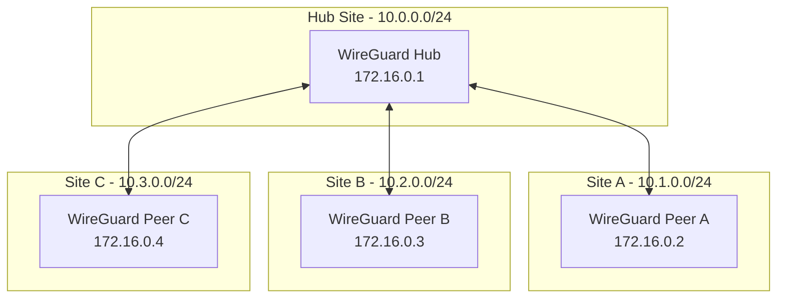

# How to Configure WireGuard for Site-to-Site Connectivity

Author: [nawazdhandala](https://www.github.com/nawazdhandala)

Tags: WireGuard, VPN, Networking, Security, Site-to-Site, Infrastructure

Description: A practical guide to setting up WireGuard VPN for secure site-to-site connectivity between multiple networks.

---

WireGuard has become the go-to VPN solution for connecting distributed networks. Its simple configuration, high performance, and modern cryptography make it ideal for site-to-site tunnels. This guide walks through setting up a secure connection between two networks.

## Understanding Site-to-Site Architecture

In a site-to-site VPN, two or more networks are connected through encrypted tunnels. Each site has a WireGuard peer that routes traffic to the other site's network.



## Prerequisites

Before starting, ensure you have:
- Two Linux servers with public IP addresses (one at each site)
- Root or sudo access on both servers
- WireGuard installed on both machines
- Firewall access to open UDP port 51820

### Installing WireGuard

On Debian/Ubuntu:

```bash
# Update package list and install WireGuard
sudo apt update
sudo apt install wireguard wireguard-tools

# Verify installation
wg --version
```

On RHEL/CentOS:

```bash
# Enable EPEL repository
sudo dnf install epel-release

# Install WireGuard
sudo dnf install wireguard-tools

# Load the kernel module
sudo modprobe wireguard
```

## Generating Key Pairs

Each site needs a public/private key pair. Generate these on both servers.

```bash
# Create directory for WireGuard config
sudo mkdir -p /etc/wireguard
cd /etc/wireguard

# Generate private key with restricted permissions
umask 077
wg genkey | sudo tee privatekey | wg pubkey | sudo tee publickey

# View the keys (you'll need these for configuration)
cat privatekey
cat publickey
```

Keep the private key secret. Share only the public key with the remote site.

## Configuring Site A

Create the WireGuard interface configuration on Site A (public IP: 203.0.113.1).

```bash
sudo nano /etc/wireguard/wg0.conf
```

```ini
# /etc/wireguard/wg0.conf on Site A

[Interface]
# Site A's private key
PrivateKey = SITE_A_PRIVATE_KEY_HERE
# Tunnel IP address for this peer
Address = 172.16.0.1/30
# Port to listen on
ListenPort = 51820
# Enable IP forwarding when interface comes up
PostUp = sysctl -w net.ipv4.ip_forward=1
PostUp = iptables -A FORWARD -i wg0 -j ACCEPT
PostUp = iptables -A FORWARD -o wg0 -j ACCEPT
PostDown = iptables -D FORWARD -i wg0 -j ACCEPT
PostDown = iptables -D FORWARD -o wg0 -j ACCEPT

[Peer]
# Site B's public key
PublicKey = SITE_B_PUBLIC_KEY_HERE
# Site B's public endpoint
Endpoint = 198.51.100.1:51820
# Networks accessible through this peer
AllowedIPs = 172.16.0.2/32, 10.2.0.0/24
# Keep connection alive behind NAT
PersistentKeepalive = 25
```

## Configuring Site B

Create the configuration on Site B (public IP: 198.51.100.1).

```bash
sudo nano /etc/wireguard/wg0.conf
```

```ini
# /etc/wireguard/wg0.conf on Site B

[Interface]
# Site B's private key
PrivateKey = SITE_B_PRIVATE_KEY_HERE
# Tunnel IP address for this peer
Address = 172.16.0.2/30
# Port to listen on
ListenPort = 51820
# Enable IP forwarding when interface comes up
PostUp = sysctl -w net.ipv4.ip_forward=1
PostUp = iptables -A FORWARD -i wg0 -j ACCEPT
PostUp = iptables -A FORWARD -o wg0 -j ACCEPT
PostDown = iptables -D FORWARD -i wg0 -j ACCEPT
PostDown = iptables -D FORWARD -o wg0 -j ACCEPT

[Peer]
# Site A's public key
PublicKey = SITE_A_PUBLIC_KEY_HERE
# Site A's public endpoint
Endpoint = 203.0.113.1:51820
# Networks accessible through this peer
AllowedIPs = 172.16.0.1/32, 10.1.0.0/24
# Keep connection alive behind NAT
PersistentKeepalive = 25
```

## Enabling IP Forwarding Permanently

Make IP forwarding persistent across reboots on both servers.

```bash
# Edit sysctl configuration
sudo nano /etc/sysctl.conf

# Add or uncomment this line
net.ipv4.ip_forward = 1

# Apply the change
sudo sysctl -p
```

## Configuring Firewall Rules

Open the WireGuard port and allow forwarded traffic.

```bash
# Using ufw (Ubuntu/Debian)
sudo ufw allow 51820/udp
sudo ufw allow in on wg0
sudo ufw allow out on wg0

# Using firewalld (RHEL/CentOS)
sudo firewall-cmd --permanent --add-port=51820/udp
sudo firewall-cmd --permanent --add-interface=wg0 --zone=trusted
sudo firewall-cmd --reload
```

## Starting the VPN Tunnel

Bring up the interface on both servers.

```bash
# Start the interface
sudo wg-quick up wg0

# Verify the interface is running
sudo wg show

# Check the interface status
ip addr show wg0
```

Expected output from `wg show`:

```
interface: wg0
  public key: YOUR_PUBLIC_KEY_HERE
  private key: (hidden)
  listening port: 51820

peer: REMOTE_PUBLIC_KEY_HERE
  endpoint: 198.51.100.1:51820
  allowed ips: 172.16.0.2/32, 10.2.0.0/24
  latest handshake: 5 seconds ago
  transfer: 1.25 MiB received, 2.10 MiB sent
  persistent keepalive: every 25 seconds
```

## Testing Connectivity

Test the tunnel and cross-site communication.

```bash
# From Site A, ping Site B's tunnel IP
ping -c 4 172.16.0.2

# From Site A, ping a server on Site B's network
ping -c 4 10.2.0.10

# Test with traceroute to verify path
traceroute 10.2.0.10
```

## Configuring Routing on Internal Networks

For other machines on each network to reach the remote site, add routes on your default gateway or each machine.

```bash
# On machines in Site A's network (10.1.0.0/24)
# Route to Site B's network through the WireGuard peer
sudo ip route add 10.2.0.0/24 via 10.1.0.1

# On machines in Site B's network (10.2.0.0/24)
# Route to Site A's network through the WireGuard peer
sudo ip route add 10.1.0.0/24 via 10.2.0.1
```

For persistent routes, add them to your network configuration.

## Enabling Automatic Startup

Configure WireGuard to start on boot.

```bash
# Enable the systemd service
sudo systemctl enable wg-quick@wg0

# Start the service
sudo systemctl start wg-quick@wg0

# Check status
sudo systemctl status wg-quick@wg0
```

## Multi-Site Hub and Spoke Topology

For connecting multiple sites, use a hub-and-spoke design where all sites connect through a central hub.



Hub configuration with multiple peers:

```ini
# /etc/wireguard/wg0.conf on Hub

[Interface]
PrivateKey = HUB_PRIVATE_KEY
Address = 172.16.0.1/24
ListenPort = 51820
PostUp = sysctl -w net.ipv4.ip_forward=1
PostUp = iptables -A FORWARD -i wg0 -j ACCEPT
PostDown = iptables -D FORWARD -i wg0 -j ACCEPT

[Peer]
# Site A
PublicKey = SITE_A_PUBLIC_KEY
AllowedIPs = 172.16.0.2/32, 10.1.0.0/24
PersistentKeepalive = 25

[Peer]
# Site B
PublicKey = SITE_B_PUBLIC_KEY
AllowedIPs = 172.16.0.3/32, 10.2.0.0/24
PersistentKeepalive = 25

[Peer]
# Site C
PublicKey = SITE_C_PUBLIC_KEY
AllowedIPs = 172.16.0.4/32, 10.3.0.0/24
PersistentKeepalive = 25
```

## Security Best Practices

Follow these practices to keep your site-to-site VPN secure:

```bash
# Restrict config file permissions
sudo chmod 600 /etc/wireguard/wg0.conf
sudo chmod 600 /etc/wireguard/privatekey

# Rotate keys periodically - generate new keys
wg genkey | tee new_privatekey | wg pubkey > new_publickey

# Monitor for unauthorized peers
sudo wg show wg0 peers

# Log connection attempts
sudo tcpdump -i eth0 udp port 51820 -n
```

## Troubleshooting Common Issues

If the tunnel is not working:

```bash
# Check if WireGuard interface exists
ip link show wg0

# Verify the configuration
sudo wg showconf wg0

# Test UDP connectivity to remote endpoint
nc -vzu 198.51.100.1 51820

# Check for firewall blocking
sudo iptables -L -n | grep 51820

# Look at kernel logs for WireGuard messages
sudo dmesg | grep wireguard
```

---

WireGuard site-to-site VPNs provide a fast, secure way to connect distributed networks. The simple configuration format and modern cryptography make it easy to deploy and maintain. Start with two sites, verify connectivity, then expand to a multi-site topology as needed. Remember to document your network addressing scheme and keep your private keys secure.
