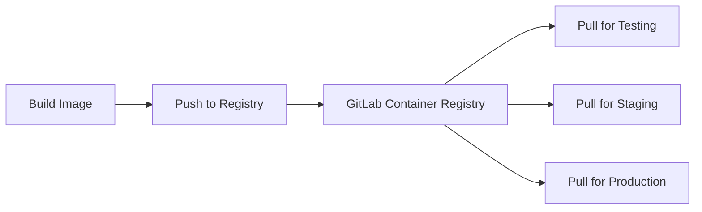

# How to Use Container Registry in GitLab CI

Author: [nawazdhandala](https://www.github.com/nawazdhandala)

Tags: GitLab CI, Container Registry, Docker, CI/CD, Containers

Description: Learn how to use GitLab's built-in Container Registry to store, manage, and deploy Docker images directly from your CI/CD pipelines.

---

GitLab's Container Registry provides a private Docker registry integrated with your projects. No external registry setup required. Build images, push them to the registry, and pull them in deployments, all within GitLab. This guide covers authentication, image management, cleanup policies, and deployment patterns.

## GitLab Container Registry Basics

Every GitLab project includes a Container Registry. Images are stored at `registry.gitlab.com/namespace/project` or your self-hosted equivalent.

Key predefined variables:
- `CI_REGISTRY`: Registry URL (e.g., `registry.gitlab.com`)
- `CI_REGISTRY_IMAGE`: Full image path for your project
- `CI_REGISTRY_USER`: Username for authentication
- `CI_REGISTRY_PASSWORD`: Token for authentication

## Building and Pushing Images

The simplest pipeline to build and push Docker images.

```yaml
build:
  image: docker:24.0
  services:
    - docker:24.0-dind
  variables:
    DOCKER_HOST: tcp://docker:2376
    DOCKER_TLS_CERTDIR: "/certs"
  before_script:
    # Authenticate to GitLab Container Registry
    - docker login -u $CI_REGISTRY_USER -p $CI_REGISTRY_PASSWORD $CI_REGISTRY
  script:
    # Build the image
    - docker build -t $CI_REGISTRY_IMAGE:$CI_COMMIT_SHA .
    # Push to registry
    - docker push $CI_REGISTRY_IMAGE:$CI_COMMIT_SHA
  only:
    - main
```

## Image Tagging Strategies

Use meaningful tags for different purposes.

```yaml
build:
  image: docker:24.0
  services:
    - docker:24.0-dind
  variables:
    DOCKER_HOST: tcp://docker:2376
    DOCKER_TLS_CERTDIR: "/certs"
  before_script:
    - docker login -u $CI_REGISTRY_USER -p $CI_REGISTRY_PASSWORD $CI_REGISTRY
  script:
    # Build image
    - docker build -t $CI_REGISTRY_IMAGE:$CI_COMMIT_SHA .

    # Tag with commit SHA (immutable reference)
    - docker push $CI_REGISTRY_IMAGE:$CI_COMMIT_SHA

    # Tag with branch name (mutable, for development)
    - docker tag $CI_REGISTRY_IMAGE:$CI_COMMIT_SHA $CI_REGISTRY_IMAGE:$CI_COMMIT_REF_SLUG
    - docker push $CI_REGISTRY_IMAGE:$CI_COMMIT_REF_SLUG

    # Tag with 'latest' on main branch
    - |
      if [ "$CI_COMMIT_BRANCH" = "main" ]; then
        docker tag $CI_REGISTRY_IMAGE:$CI_COMMIT_SHA $CI_REGISTRY_IMAGE:latest
        docker push $CI_REGISTRY_IMAGE:latest
      fi

    # Tag with version on tags
    - |
      if [ -n "$CI_COMMIT_TAG" ]; then
        docker tag $CI_REGISTRY_IMAGE:$CI_COMMIT_SHA $CI_REGISTRY_IMAGE:$CI_COMMIT_TAG
        docker push $CI_REGISTRY_IMAGE:$CI_COMMIT_TAG
      fi
```

## Container Registry Flow

Here's how images flow through the registry:



## Multi-Stage Builds with Caching

Leverage the registry for build caching.

```yaml
build:
  image: docker:24.0
  services:
    - docker:24.0-dind
  variables:
    DOCKER_HOST: tcp://docker:2376
    DOCKER_TLS_CERTDIR: "/certs"
    DOCKER_BUILDKIT: "1"
  before_script:
    - docker login -u $CI_REGISTRY_USER -p $CI_REGISTRY_PASSWORD $CI_REGISTRY
  script:
    # Pull previous image for cache
    - docker pull $CI_REGISTRY_IMAGE:latest || true

    # Build with cache
    - docker build
      --cache-from $CI_REGISTRY_IMAGE:latest
      --build-arg BUILDKIT_INLINE_CACHE=1
      -t $CI_REGISTRY_IMAGE:$CI_COMMIT_SHA
      -t $CI_REGISTRY_IMAGE:latest
      .

    - docker push $CI_REGISTRY_IMAGE:$CI_COMMIT_SHA
    - docker push $CI_REGISTRY_IMAGE:latest
```

## Multi-Image Projects

Store multiple images per project using path-based names.

```yaml
build-frontend:
  script:
    - docker login -u $CI_REGISTRY_USER -p $CI_REGISTRY_PASSWORD $CI_REGISTRY
    - docker build -t $CI_REGISTRY_IMAGE/frontend:$CI_COMMIT_SHA ./frontend
    - docker push $CI_REGISTRY_IMAGE/frontend:$CI_COMMIT_SHA

build-backend:
  script:
    - docker login -u $CI_REGISTRY_USER -p $CI_REGISTRY_PASSWORD $CI_REGISTRY
    - docker build -t $CI_REGISTRY_IMAGE/backend:$CI_COMMIT_SHA ./backend
    - docker push $CI_REGISTRY_IMAGE/backend:$CI_COMMIT_SHA

build-worker:
  script:
    - docker login -u $CI_REGISTRY_USER -p $CI_REGISTRY_PASSWORD $CI_REGISTRY
    - docker build -t $CI_REGISTRY_IMAGE/worker:$CI_COMMIT_SHA ./worker
    - docker push $CI_REGISTRY_IMAGE/worker:$CI_COMMIT_SHA
```

This creates images like:
- `registry.gitlab.com/group/project/frontend:abc123`
- `registry.gitlab.com/group/project/backend:abc123`
- `registry.gitlab.com/group/project/worker:abc123`

## Using Kaniko (No Docker-in-Docker)

Build images without privileged mode using Kaniko.

```yaml
build:
  image:
    name: gcr.io/kaniko-project/executor:v1.19.0-debug
    entrypoint: [""]
  script:
    # Create registry credentials
    - mkdir -p /kaniko/.docker
    - |
      cat > /kaniko/.docker/config.json << EOF
      {
        "auths": {
          "${CI_REGISTRY}": {
            "auth": "$(printf "%s:%s" "${CI_REGISTRY_USER}" "${CI_REGISTRY_PASSWORD}" | base64 | tr -d '\n')"
          }
        }
      }
      EOF

    # Build and push
    - /kaniko/executor
      --context "${CI_PROJECT_DIR}"
      --dockerfile "${CI_PROJECT_DIR}/Dockerfile"
      --destination "${CI_REGISTRY_IMAGE}:${CI_COMMIT_SHA}"
      --destination "${CI_REGISTRY_IMAGE}:latest"
```

## Pulling Images in Later Jobs

Use built images in subsequent pipeline stages.

```yaml
stages:
  - build
  - test
  - deploy

build:
  stage: build
  script:
    - docker login -u $CI_REGISTRY_USER -p $CI_REGISTRY_PASSWORD $CI_REGISTRY
    - docker build -t $CI_REGISTRY_IMAGE:$CI_COMMIT_SHA .
    - docker push $CI_REGISTRY_IMAGE:$CI_COMMIT_SHA

test:
  stage: test
  image: $CI_REGISTRY_IMAGE:$CI_COMMIT_SHA
  script:
    - npm test

deploy:
  stage: deploy
  script:
    - kubectl set image deployment/app app=$CI_REGISTRY_IMAGE:$CI_COMMIT_SHA
```

## Security Scanning

Scan images for vulnerabilities before deployment.

```yaml
stages:
  - build
  - scan
  - deploy

build:
  stage: build
  script:
    - docker build -t $CI_REGISTRY_IMAGE:$CI_COMMIT_SHA .
    - docker push $CI_REGISTRY_IMAGE:$CI_COMMIT_SHA

container-scan:
  stage: scan
  image:
    name: aquasec/trivy:latest
    entrypoint: [""]
  script:
    # Authenticate to pull the image
    - export TRIVY_USERNAME=$CI_REGISTRY_USER
    - export TRIVY_PASSWORD=$CI_REGISTRY_PASSWORD

    # Scan the image
    - trivy image
      --exit-code 1
      --severity CRITICAL,HIGH
      $CI_REGISTRY_IMAGE:$CI_COMMIT_SHA
  allow_failure: false

deploy:
  stage: deploy
  needs:
    - build
    - container-scan
  script:
    - ./deploy.sh $CI_REGISTRY_IMAGE:$CI_COMMIT_SHA
```

## Cleanup Policies

Configure automatic cleanup to manage storage.

Navigate to Settings, then Packages and registries, then Container Registry, then Cleanup policies.

Configure via API or `.gitlab-ci.yml`:

```yaml
cleanup-registry:
  image: registry.gitlab.com/gitlab-org/cli:latest
  script:
    # Keep last 10 tags matching pattern
    - |
      glab api -X DELETE "/projects/${CI_PROJECT_ID}/registry/repositories" \
        --field name_regex_delete='.*' \
        --field keep_n=10 \
        --field older_than=30d
  rules:
    - if: $CI_PIPELINE_SOURCE == "schedule"
```

Or use the container-registry-cli tool:

```yaml
cleanup:
  image: registry.gitlab.com/gitlab-org/container-registry/cli:latest
  script:
    # Delete images older than 30 days, keep at least 5
    - container-registry delete
      --host $CI_REGISTRY
      --token $CI_REGISTRY_PASSWORD
      --repository $CI_REGISTRY_IMAGE
      --dry-run=false
      --keep-last 5
      --older-than 30d
  rules:
    - if: $CI_PIPELINE_SOURCE == "schedule"
```

## Private Registry Authentication

For Kubernetes deployments, create image pull secrets.

```yaml
setup-registry-secret:
  stage: prepare
  script:
    - |
      kubectl create secret docker-registry gitlab-registry \
        --docker-server=$CI_REGISTRY \
        --docker-username=$CI_DEPLOY_USER \
        --docker-password=$CI_DEPLOY_PASSWORD \
        --docker-email=deploy@example.com \
        --namespace=$KUBE_NAMESPACE \
        --dry-run=client -o yaml | kubectl apply -f -
```

Reference in your Kubernetes manifests:

```yaml
apiVersion: apps/v1
kind: Deployment
spec:
  template:
    spec:
      imagePullSecrets:
        - name: gitlab-registry
      containers:
        - name: app
          image: registry.gitlab.com/group/project:tag
```

## Cross-Project Image Access

Pull images from other GitLab projects.

```yaml
use-shared-image:
  image: registry.gitlab.com/shared/base-image:latest
  before_script:
    # Authenticate to access another project's registry
    - docker login -u $CI_DEPLOY_USER -p $CI_DEPLOY_PASSWORD $CI_REGISTRY
  script:
    - echo "Using shared base image"
```

Create a deploy token in the source project with `read_registry` scope and store it as CI variables in the consuming project.

## Registry Mirroring

Mirror images to external registries for deployment.

```yaml
mirror-to-ecr:
  stage: publish
  script:
    - docker login -u $CI_REGISTRY_USER -p $CI_REGISTRY_PASSWORD $CI_REGISTRY
    - docker pull $CI_REGISTRY_IMAGE:$CI_COMMIT_SHA

    # Login to ECR
    - aws ecr get-login-password | docker login --username AWS --password-stdin $ECR_REGISTRY

    # Tag and push to ECR
    - docker tag $CI_REGISTRY_IMAGE:$CI_COMMIT_SHA $ECR_REGISTRY/app:$CI_COMMIT_SHA
    - docker push $ECR_REGISTRY/app:$CI_COMMIT_SHA
  only:
    - tags
```

## Debugging Registry Issues

When images don't push or pull correctly:

```yaml
debug-registry:
  script:
    # Check registry connectivity
    - curl -v https://$CI_REGISTRY/v2/

    # Test authentication
    - docker login -u $CI_REGISTRY_USER -p $CI_REGISTRY_PASSWORD $CI_REGISTRY

    # List existing tags
    - |
      curl -s --user "${CI_REGISTRY_USER}:${CI_REGISTRY_PASSWORD}" \
        "https://${CI_REGISTRY}/v2/${CI_PROJECT_PATH}/tags/list"

    # Check image manifest
    - |
      curl -s --user "${CI_REGISTRY_USER}:${CI_REGISTRY_PASSWORD}" \
        -H "Accept: application/vnd.docker.distribution.manifest.v2+json" \
        "https://${CI_REGISTRY}/v2/${CI_PROJECT_PATH}/manifests/latest"
```

Common issues:
- **Authentication failed**: Verify `CI_REGISTRY_USER` and `CI_REGISTRY_PASSWORD` are set
- **Permission denied**: Check project visibility and deploy token scopes
- **Image not found**: Verify the full image path including namespace

---

GitLab's Container Registry eliminates the need for external Docker registries. Every project gets its own private registry with authentication integrated into CI/CD. Start by pushing images from your build jobs, then implement tagging strategies and cleanup policies as your container library grows.
