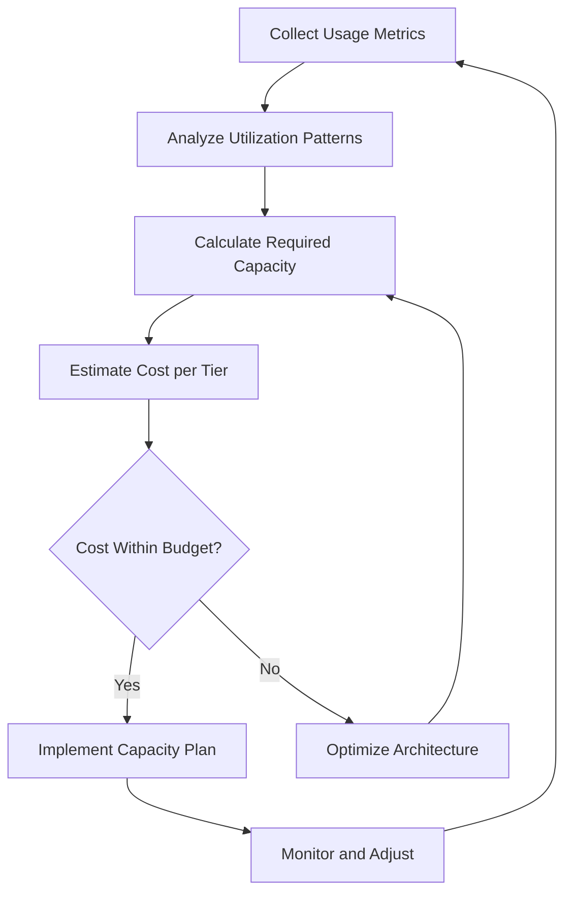
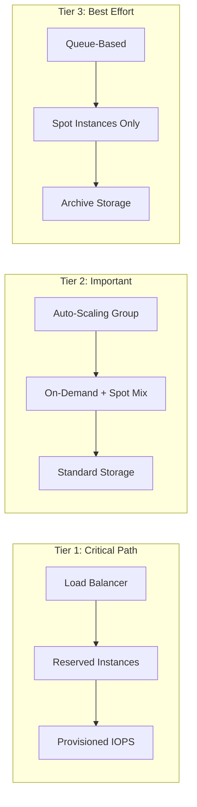
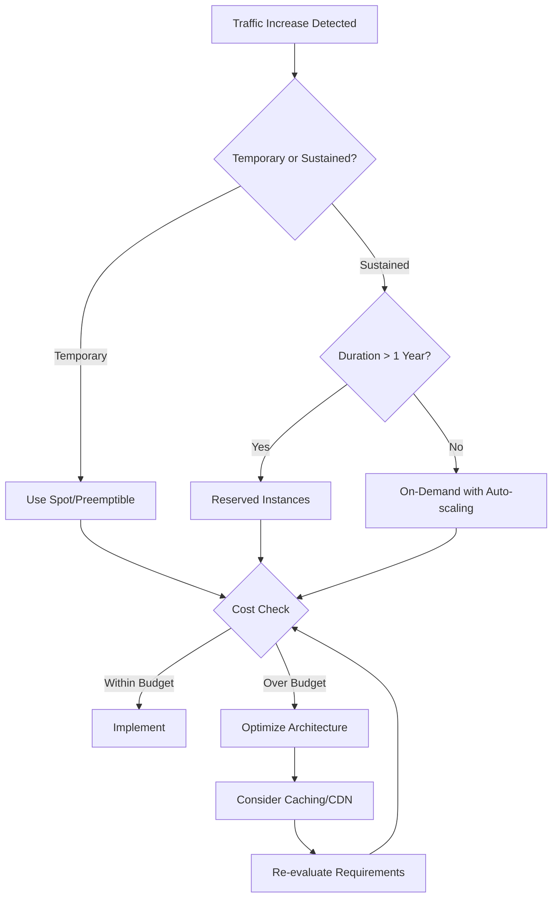

# How to Implement Cost-Aware Capacity Planning

Author: [nawazdhandala](https://www.github.com/nawazdhandala)

Tags: Site Reliability Engineering, Capacity Planning, Cost Optimization, Cloud Infrastructure, FinOps

Description: A practical guide to building capacity planning processes that balance performance requirements with infrastructure costs.

---

## Why Cost Matters in Capacity Planning

Capacity planning without cost awareness is like planning a road trip without checking fuel prices. You might get where you need to go, but you could end up spending far more than necessary. Traditional capacity planning focuses on ensuring systems can handle load, but modern SRE teams must also ensure they are not over-provisioning resources.

The goal is to find the sweet spot where you have enough headroom to handle traffic spikes without paying for idle infrastructure.

## The Cost-Aware Capacity Planning Framework



## Step 1: Establish Cost Visibility

Before you can optimize, you need visibility. Instrument your infrastructure to track both usage and cost.

```python
# cost_tracker.py - Track resource utilization alongside costs
import datetime
from dataclasses import dataclass
from typing import Dict, List

@dataclass
class ResourceMetric:
    resource_id: str
    resource_type: str
    utilization_percent: float
    hourly_cost: float
    timestamp: datetime.datetime

class CostAwareCapacityTracker:
    def __init__(self, cost_per_unit: Dict[str, float]):
        # cost_per_unit maps resource types to hourly costs
        self.cost_per_unit = cost_per_unit
        self.metrics: List[ResourceMetric] = []

    def record_utilization(self, resource_id: str, resource_type: str,
                           utilization: float) -> ResourceMetric:
        """Record utilization and calculate associated cost."""
        hourly_cost = self.cost_per_unit.get(resource_type, 0)
        metric = ResourceMetric(
            resource_id=resource_id,
            resource_type=resource_type,
            utilization_percent=utilization,
            hourly_cost=hourly_cost,
            timestamp=datetime.datetime.utcnow()
        )
        self.metrics.append(metric)
        return metric

    def calculate_efficiency_score(self, resource_type: str) -> float:
        """Calculate cost efficiency as utilization per dollar spent."""
        type_metrics = [m for m in self.metrics if m.resource_type == resource_type]
        if not type_metrics:
            return 0.0

        total_utilization = sum(m.utilization_percent for m in type_metrics)
        total_cost = sum(m.hourly_cost for m in type_metrics)

        if total_cost == 0:
            return 0.0

        # Higher score means better efficiency
        return total_utilization / total_cost

# Example usage
tracker = CostAwareCapacityTracker({
    "m5.large": 0.096,      # AWS EC2 pricing example
    "m5.xlarge": 0.192,
    "m5.2xlarge": 0.384,
})

# Record some utilization data
tracker.record_utilization("i-abc123", "m5.xlarge", 45.0)
tracker.record_utilization("i-def456", "m5.large", 78.0)
```

## Step 2: Define Cost-Per-Request Metrics

Understanding your cost per request helps you make informed decisions about scaling strategies.

```python
# cost_per_request.py - Calculate the true cost of serving requests
from dataclasses import dataclass
from typing import Optional

@dataclass
class ServiceCostMetrics:
    service_name: str
    requests_per_hour: int
    compute_cost_hourly: float
    storage_cost_hourly: float
    network_cost_hourly: float

    @property
    def total_hourly_cost(self) -> float:
        return self.compute_cost_hourly + self.storage_cost_hourly + self.network_cost_hourly

    @property
    def cost_per_request(self) -> Optional[float]:
        if self.requests_per_hour == 0:
            return None
        return self.total_hourly_cost / self.requests_per_hour

    @property
    def cost_per_million_requests(self) -> Optional[float]:
        cpr = self.cost_per_request
        if cpr is None:
            return None
        return cpr * 1_000_000

def analyze_scaling_costs(base_metrics: ServiceCostMetrics,
                         scale_factor: float) -> dict:
    """Project costs at different scale factors."""
    projected_requests = int(base_metrics.requests_per_hour * scale_factor)

    # Compute scales linearly (simplified model)
    projected_compute = base_metrics.compute_cost_hourly * scale_factor

    # Storage often has stepped pricing
    storage_scale = 1.0 if scale_factor < 2 else scale_factor * 0.8
    projected_storage = base_metrics.storage_cost_hourly * storage_scale

    # Network has volume discounts
    network_scale = scale_factor * 0.9 if scale_factor > 1.5 else scale_factor
    projected_network = base_metrics.network_cost_hourly * network_scale

    projected = ServiceCostMetrics(
        service_name=base_metrics.service_name,
        requests_per_hour=projected_requests,
        compute_cost_hourly=projected_compute,
        storage_cost_hourly=projected_storage,
        network_cost_hourly=projected_network,
    )

    return {
        "scale_factor": scale_factor,
        "projected_requests_per_hour": projected_requests,
        "projected_hourly_cost": projected.total_hourly_cost,
        "projected_cost_per_million": projected.cost_per_million_requests,
        "cost_increase_percent": (
            (projected.total_hourly_cost - base_metrics.total_hourly_cost)
            / base_metrics.total_hourly_cost * 100
        ),
    }

# Example: Analyze scaling costs
api_service = ServiceCostMetrics(
    service_name="api-gateway",
    requests_per_hour=500_000,
    compute_cost_hourly=15.00,
    storage_cost_hourly=2.50,
    network_cost_hourly=8.00,
)

print(f"Current cost per million requests: ${api_service.cost_per_million_requests:.2f}")

for scale in [1.5, 2.0, 3.0]:
    result = analyze_scaling_costs(api_service, scale)
    print(f"At {scale}x scale: ${result['projected_cost_per_million']:.2f}/million requests")
```

## Step 3: Implement Tiered Capacity Strategies

Not all workloads need the same level of resources. Create capacity tiers that match your SLOs to your budget.



```yaml
# capacity-tiers.yaml - Define capacity tiers with cost constraints
capacity_tiers:
  tier_1_critical:
    description: "User-facing production services"
    target_utilization: 50%
    max_utilization: 70%
    scaling_buffer: 30%
    instance_strategy: reserved
    cost_priority: reliability_first
    monthly_budget_cap: null  # No cap for critical services

  tier_2_important:
    description: "Internal APIs and batch processing"
    target_utilization: 65%
    max_utilization: 80%
    scaling_buffer: 20%
    instance_strategy: mixed  # 60% reserved, 40% on-demand
    cost_priority: balanced
    monthly_budget_cap: 50000

  tier_3_best_effort:
    description: "Development, testing, non-critical batch jobs"
    target_utilization: 75%
    max_utilization: 90%
    scaling_buffer: 10%
    instance_strategy: spot_with_fallback
    cost_priority: cost_first
    monthly_budget_cap: 10000

cost_optimization_rules:
  - name: "right-size-underutilized"
    condition: "avg_utilization < 30% for 7 days"
    action: "recommend_smaller_instance"

  - name: "convert-steady-state-to-reserved"
    condition: "consistent_usage > 80% of time for 30 days"
    action: "recommend_reserved_instance"

  - name: "use-spot-for-fault-tolerant"
    condition: "workload_type == batch AND fault_tolerant == true"
    action: "migrate_to_spot"
```

## Step 4: Build Cost Projections into Capacity Models

```python
# capacity_cost_model.py - Project capacity costs over time
import math
from dataclasses import dataclass
from typing import List, Tuple

@dataclass
class GrowthProjection:
    month: int
    expected_traffic_multiplier: float
    confidence_interval: Tuple[float, float]  # low, high

@dataclass
class CapacityCostProjection:
    month: int
    base_cost: float
    scaling_cost: float
    buffer_cost: float
    total_cost: float
    traffic_multiplier: float

def project_capacity_costs(
    current_monthly_cost: float,
    growth_projections: List[GrowthProjection],
    buffer_percent: float = 0.20,
    economies_of_scale_factor: float = 0.95,
) -> List[CapacityCostProjection]:
    """
    Project capacity costs based on traffic growth.

    economies_of_scale_factor: Cost reduction per doubling (0.95 = 5% savings)
    """
    projections = []

    for gp in growth_projections:
        # Calculate scaling cost with economies of scale
        if gp.expected_traffic_multiplier <= 1.0:
            scale_factor = gp.expected_traffic_multiplier
        else:
            # Apply economies of scale for growth
            doublings = math.log2(gp.expected_traffic_multiplier)
            scale_factor = gp.expected_traffic_multiplier * (
                economies_of_scale_factor ** doublings
            )

        base_cost = current_monthly_cost
        scaling_cost = current_monthly_cost * (scale_factor - 1)
        buffer_cost = (base_cost + scaling_cost) * buffer_percent

        projections.append(CapacityCostProjection(
            month=gp.month,
            base_cost=base_cost,
            scaling_cost=max(0, scaling_cost),
            buffer_cost=buffer_cost,
            total_cost=base_cost + max(0, scaling_cost) + buffer_cost,
            traffic_multiplier=gp.expected_traffic_multiplier,
        ))

    return projections

# Example: Project costs for the next 12 months
growth = [
    GrowthProjection(month=1, expected_traffic_multiplier=1.0, confidence_interval=(0.95, 1.05)),
    GrowthProjection(month=3, expected_traffic_multiplier=1.15, confidence_interval=(1.05, 1.25)),
    GrowthProjection(month=6, expected_traffic_multiplier=1.35, confidence_interval=(1.15, 1.55)),
    GrowthProjection(month=12, expected_traffic_multiplier=1.8, confidence_interval=(1.4, 2.2)),
]

projections = project_capacity_costs(
    current_monthly_cost=25000,
    growth_projections=growth,
    buffer_percent=0.25,
)

for p in projections:
    print(f"Month {p.month}: ${p.total_cost:,.0f} at {p.traffic_multiplier}x traffic")
```

## Step 5: Set Up Cost Anomaly Detection

Unexpected cost spikes often indicate capacity issues. Integrate cost monitoring with your observability stack.

```python
# cost_anomaly_detector.py - Detect unusual cost patterns
from dataclasses import dataclass
from datetime import datetime, timedelta
from typing import List, Optional
import statistics

@dataclass
class CostDataPoint:
    timestamp: datetime
    cost: float
    service: str

@dataclass
class CostAnomaly:
    service: str
    timestamp: datetime
    expected_cost: float
    actual_cost: float
    deviation_percent: float
    severity: str

class CostAnomalyDetector:
    def __init__(self, threshold_std_devs: float = 2.0):
        self.threshold_std_devs = threshold_std_devs
        self.historical_data: List[CostDataPoint] = []

    def add_data_point(self, point: CostDataPoint):
        self.historical_data.append(point)

    def detect_anomalies(self, service: str,
                        lookback_days: int = 30) -> List[CostAnomaly]:
        """Detect cost anomalies for a service."""
        cutoff = datetime.utcnow() - timedelta(days=lookback_days)

        service_data = [
            p for p in self.historical_data
            if p.service == service and p.timestamp > cutoff
        ]

        if len(service_data) < 7:
            return []  # Not enough data

        costs = [p.cost for p in service_data]
        mean_cost = statistics.mean(costs)
        std_cost = statistics.stdev(costs)

        anomalies = []
        for point in service_data:
            if std_cost == 0:
                continue

            deviation = (point.cost - mean_cost) / std_cost

            if abs(deviation) > self.threshold_std_devs:
                deviation_percent = ((point.cost - mean_cost) / mean_cost) * 100

                if abs(deviation) > 3:
                    severity = "critical"
                elif abs(deviation) > 2.5:
                    severity = "warning"
                else:
                    severity = "info"

                anomalies.append(CostAnomaly(
                    service=service,
                    timestamp=point.timestamp,
                    expected_cost=mean_cost,
                    actual_cost=point.cost,
                    deviation_percent=deviation_percent,
                    severity=severity,
                ))

        return anomalies

# Integration with alerting
def create_cost_alert(anomaly: CostAnomaly) -> dict:
    """Create an alert payload for cost anomalies."""
    return {
        "alert_type": "cost_anomaly",
        "service": anomaly.service,
        "severity": anomaly.severity,
        "message": (
            f"Cost anomaly detected for {anomaly.service}: "
            f"${anomaly.actual_cost:.2f} vs expected ${anomaly.expected_cost:.2f} "
            f"({anomaly.deviation_percent:+.1f}%)"
        ),
        "timestamp": anomaly.timestamp.isoformat(),
        "recommended_action": (
            "Review recent deployments and scaling events"
            if anomaly.actual_cost > anomaly.expected_cost
            else "Verify service health - unexpected cost reduction may indicate outage"
        ),
    }
```

## Cost-Aware Scaling Decisions

When planning capacity, always evaluate multiple options:



## Key Takeaways

Cost-aware capacity planning requires continuous measurement, clear tier definitions, and automated anomaly detection. The goal is not to minimize costs at all costs, but to ensure every dollar spent on infrastructure delivers value. Start by instrumenting your current spend, establish baselines, and build cost projections into your capacity models. When costs and performance metrics live in the same observability platform like OneUptime, teams can make faster, better-informed scaling decisions.

---

Building a cost-aware capacity planning practice takes time, but the payoff is significant. Teams that master this discipline can scale confidently while keeping infrastructure spend predictable and aligned with business growth.
