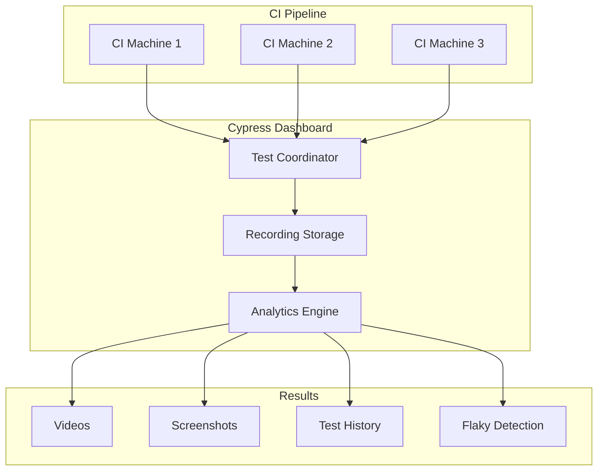
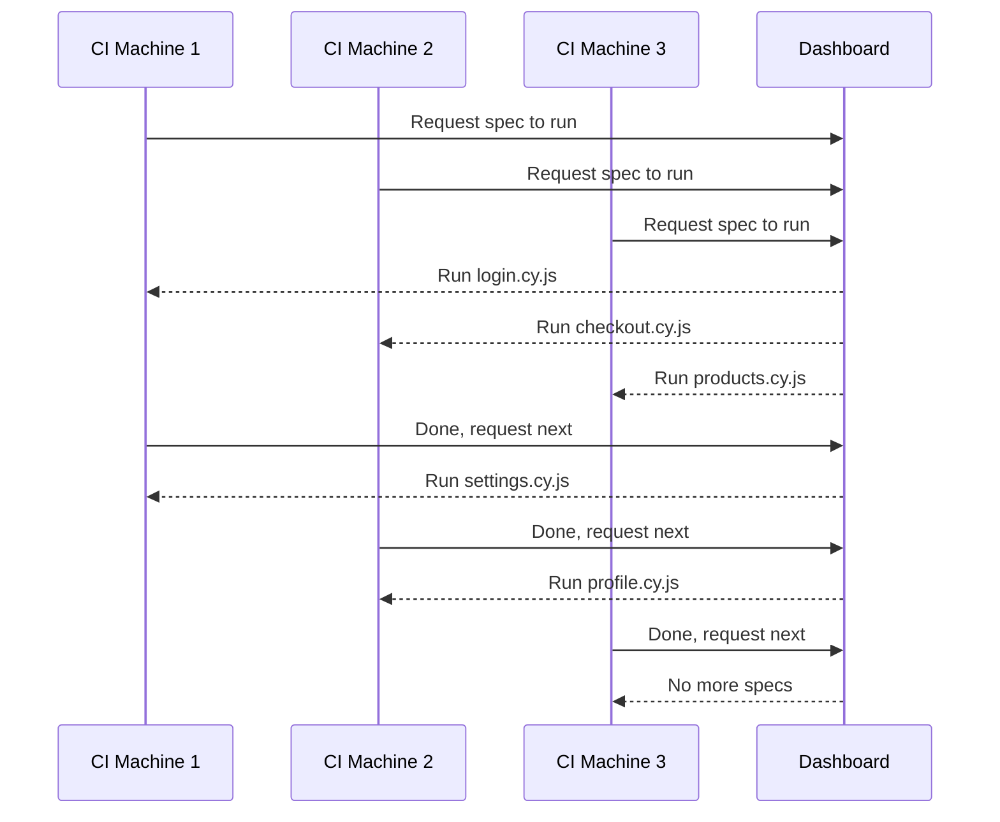

# How to Use Cypress Dashboard

Author: [nawazdhandala](https://www.github.com/nawazdhandala)

Tags: Cypress, Testing, CI/CD, Test Analytics, E2E Testing

Description: Learn how to set up and use Cypress Dashboard for test recording, parallel execution, flaky test detection, and CI/CD integration.

---

Cypress Dashboard is a cloud service that records your test runs, enabling parallel test execution, flaky test detection, and detailed analytics. This guide walks through setup, configuration, and getting the most value from your recorded tests.

## What Cypress Dashboard Provides

The Dashboard service extends your local Cypress setup with capabilities that become essential at scale:

- **Test recordings** - Video and screenshots of every test run
- **Parallel execution** - Split tests across multiple CI machines
- **Flaky test detection** - Automatically identify unstable tests
- **Load balancing** - Smart distribution of specs for fastest runs
- **Historical analytics** - Track test health over time
- **GitHub/GitLab integration** - Status checks on pull requests



## Setting Up Your Project

### Step 1: Create a Dashboard Account

Visit [dashboard.cypress.io](https://dashboard.cypress.io) and create an account. You can sign up with GitHub, GitLab, or email.

### Step 2: Create a Project

After logging in, click "Create Project" and give it a name. Cypress will generate a project ID and record key.

### Step 3: Configure cypress.config.js

Add the project ID to your Cypress configuration. This links your local project to the Dashboard.

```javascript
// cypress.config.js
const { defineConfig } = require('cypress');

module.exports = defineConfig({
  // Project ID from Cypress Dashboard
  projectId: 'abc123',

  e2e: {
    baseUrl: 'http://localhost:3000',
    specPattern: 'cypress/e2e/**/*.cy.{js,ts}',

    // Optional: Configure video recording
    video: true,
    videoCompression: 32,

    // Optional: Configure screenshot behavior
    screenshotOnRunFailure: true,
    screenshotsFolder: 'cypress/screenshots',
  },
});
```

### Step 4: Run Tests with Recording

Use the `--record` flag and provide your record key to upload results to the Dashboard.

```bash
# Record key can be passed as flag or environment variable
npx cypress run --record --key your-record-key-here

# Or set as environment variable (recommended for CI)
export CYPRESS_RECORD_KEY=your-record-key-here
npx cypress run --record
```

Never commit your record key to source control. Use environment variables or CI secrets.

## CI/CD Integration

### GitHub Actions

```yaml
# .github/workflows/e2e.yml
name: E2E Tests

on: [push, pull_request]

jobs:
  cypress-run:
    runs-on: ubuntu-latest
    steps:
      - name: Checkout
        uses: actions/checkout@v4

      - name: Setup Node
        uses: actions/setup-node@v4
        with:
          node-version: 20

      - name: Install dependencies
        run: npm ci

      - name: Start application
        run: npm start &

      - name: Wait for app to start
        run: npx wait-on http://localhost:3000

      - name: Run Cypress tests
        uses: cypress-io/github-action@v6
        with:
          record: true
        env:
          # Record key stored as GitHub secret
          CYPRESS_RECORD_KEY: ${{ secrets.CYPRESS_RECORD_KEY }}
          # GitHub token for PR status checks
          GITHUB_TOKEN: ${{ secrets.GITHUB_TOKEN }}
```

### GitLab CI

```yaml
# .gitlab-ci.yml
e2e-tests:
  image: cypress/browsers:node-20.9.0-chrome-118.0.5993.88-1-ff-118.0.2-edge-118.0.2088.46-1
  stage: test
  script:
    - npm ci
    - npm start &
    - npx wait-on http://localhost:3000
    - npx cypress run --record
  variables:
    CYPRESS_RECORD_KEY: $CYPRESS_RECORD_KEY
```

## Parallel Test Execution

Running tests in parallel dramatically reduces CI time. The Dashboard coordinates which specs run on which machine.



### GitHub Actions with Parallelization

```yaml
# .github/workflows/e2e-parallel.yml
name: E2E Tests (Parallel)

on: [push]

jobs:
  cypress-run:
    runs-on: ubuntu-latest
    strategy:
      fail-fast: false
      matrix:
        # Run 4 parallel containers
        containers: [1, 2, 3, 4]
    steps:
      - uses: actions/checkout@v4

      - uses: actions/setup-node@v4
        with:
          node-version: 20

      - name: Install dependencies
        run: npm ci

      - name: Run Cypress tests
        uses: cypress-io/github-action@v6
        with:
          record: true
          parallel: true
          # Group name identifies this parallel run
          group: 'E2E Tests'
        env:
          CYPRESS_RECORD_KEY: ${{ secrets.CYPRESS_RECORD_KEY }}
          GITHUB_TOKEN: ${{ secrets.GITHUB_TOKEN }}
```

The Dashboard uses intelligent load balancing to assign specs based on historical run times, ensuring all machines finish around the same time.

## Analyzing Test Results

### The Runs View

Each recorded run shows:

- **Pass/fail status** for every spec and test
- **Duration** of the entire run and individual tests
- **Video recordings** of each spec file execution
- **Screenshots** captured on failures
- **Console output** and error messages

### Flaky Test Detection

A test is marked as flaky when it fails on first attempt but passes on retry within the same run. The Dashboard tracks this automatically.

```javascript
// cypress.config.js - Enable retries to catch flaky tests
module.exports = defineConfig({
  projectId: 'abc123',
  retries: {
    runMode: 2,      // Retry failed tests up to 2 times in CI
    openMode: 0      // No retries in interactive mode
  },
  e2e: {
    // ... other config
  }
});
```

The Dashboard shows:

- Which tests are flaky
- How often each test flakes
- Historical flakiness trends
- Whether flakiness is improving or getting worse

### Test Analytics

The Analytics tab provides insights across all runs:

- **Most failing tests** - Identify problem areas
- **Slowest tests** - Find optimization opportunities
- **Flakiest tests** - Prioritize stabilization work
- **Suite trends** - Track overall health over time

## Grouping and Tagging Runs

Use groups to organize related runs and tags to add metadata.

```bash
# Group tests by type
npx cypress run --record --group "smoke-tests" --spec "cypress/e2e/smoke/**"
npx cypress run --record --group "regression-tests" --spec "cypress/e2e/regression/**"

# Add tags for filtering
npx cypress run --record --tag "production,deploy"
```

This helps when reviewing runs in the Dashboard - you can filter by group or tag to find specific runs.

## Integrating with GitHub Pull Requests

Enable the GitHub integration to get status checks on PRs.

1. Go to your project settings in Cypress Dashboard
2. Click "GitHub Integration"
3. Authorize Cypress to access your repository
4. Select which checks to enable

Once configured, every PR will show Cypress test status:

- Pending while tests run
- Green check on success
- Red X on failure with links to failed tests

## Managing Access and Teams

For team projects, configure access controls:

- **Owners** - Full project management
- **Admins** - Manage members and settings
- **Members** - View runs and recordings
- **Viewers** - Read-only access

Invite team members by email from the project settings page.

## Self-Hosted Alternative

For organizations that cannot use cloud services, Cypress offers Sorry Cypress as an open-source alternative that you can self-host. It provides similar functionality including:

- Parallel execution coordination
- Test recording and storage
- Basic analytics

```bash
# Example: Running with Sorry Cypress
npx cypress run --record --key any-key --parallel \
  --ci-build-id $BUILD_ID \
  --config "baseUrl=http://localhost:3000" \
  --config "projectId=abc123"
```

## Best Practices

1. **Always record CI runs** - The historical data becomes invaluable for debugging and optimization.

2. **Set up flaky test alerts** - Configure Slack or email notifications when flakiness exceeds thresholds.

3. **Review slow tests monthly** - Use analytics to identify tests that need optimization.

4. **Use meaningful group names** - Makes it easy to find specific runs later.

5. **Delete old recordings** - Manage storage by configuring retention policies.

6. **Secure your record key** - Treat it like a password. Anyone with the key can upload runs to your project.

```yaml
# Good: Key stored as secret
env:
  CYPRESS_RECORD_KEY: ${{ secrets.CYPRESS_RECORD_KEY }}

# Bad: Key hardcoded in config
# NEVER do this
record_key: "abc123-real-key-here"
```

## Troubleshooting

**Recordings not appearing**

- Verify the project ID matches your Dashboard project
- Check that the record key is correct
- Ensure `--record` flag is present
- Look for error messages in CI output

**Parallel runs not coordinating**

- All machines must use the same `ci-build-id`
- Verify the `--parallel` flag is set
- Check that machines can reach the Dashboard service

**Video not recording**

- Ensure `video: true` in cypress.config.js
- Check available disk space in CI environment
- Video recording requires headed or xvfb mode

---

Cypress Dashboard transforms your test suite from a local development tool into a comprehensive testing platform. The visibility it provides into test health, performance, and reliability helps teams ship with confidence.
