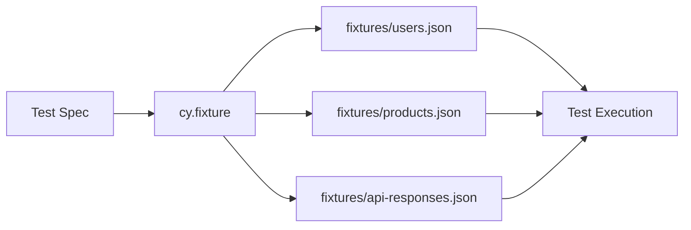
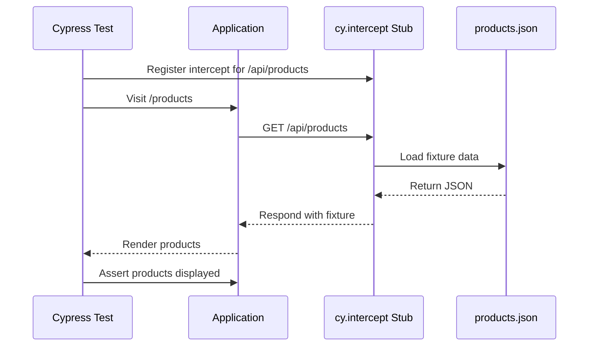

# How to Use Cypress Fixtures

Author: [nawazdhandala](https://www.github.com/nawazdhandala)

Tags: Cypress, Testing, JavaScript, E2E Testing, Test Data

Description: Learn how to use Cypress fixtures to manage test data, mock API responses, and keep your end-to-end tests clean and maintainable.

---

Fixtures in Cypress let you store test data in external files and load them into your tests as needed. This keeps your test files clean, makes data reusable across multiple specs, and simplifies maintenance when test data changes.

## What Are Fixtures?

Fixtures are static data files (usually JSON) stored in the `cypress/fixtures` directory. They serve several purposes:

- Store mock data for API responses
- Hold user credentials and test configurations
- Keep large datasets out of your test files
- Share common data across multiple test specs



## Creating Your First Fixture

Create a JSON file in the `cypress/fixtures` folder. This example stores user data for login tests.

`cypress/fixtures/users.json`

```json
{
  "validUser": {
    "email": "test@example.com",
    "password": "SecurePass123!",
    "name": "Test User"
  },
  "invalidUser": {
    "email": "invalid@example.com",
    "password": "wrongpassword"
  },
  "adminUser": {
    "email": "admin@example.com",
    "password": "AdminPass456!",
    "role": "administrator"
  }
}
```

## Loading Fixtures in Tests

Use `cy.fixture()` to load fixture data. The command returns a promise, so chain it with `.then()` or use Cypress aliases.

### Method 1: Using .then() Callback

```javascript
// cypress/e2e/login.cy.js
describe('Login Page', () => {
  it('should login with valid credentials', () => {
    // Load the users fixture and use the data
    cy.fixture('users').then((users) => {
      cy.visit('/login');

      // Access nested properties from the fixture
      cy.get('[data-cy="email"]').type(users.validUser.email);
      cy.get('[data-cy="password"]').type(users.validUser.password);
      cy.get('[data-cy="submit"]').click();

      // Verify successful login
      cy.url().should('include', '/dashboard');
      cy.contains(`Welcome, ${users.validUser.name}`);
    });
  });
});
```

### Method 2: Using Aliases with beforeEach

Aliases make fixture data available throughout your test suite without nesting callbacks.

```javascript
// cypress/e2e/user-management.cy.js
describe('User Management', () => {
  beforeEach(() => {
    // Create an alias for the users fixture
    cy.fixture('users').as('userData');
  });

  it('should display admin controls for admin users', function () {
    // Access aliased data using this.userData
    // Note: Must use function() syntax, not arrow functions
    cy.visit('/login');
    cy.get('[data-cy="email"]').type(this.userData.adminUser.email);
    cy.get('[data-cy="password"]').type(this.userData.adminUser.password);
    cy.get('[data-cy="submit"]').click();

    // Admin-specific elements should be visible
    cy.get('[data-cy="admin-panel"]').should('be.visible');
  });

  it('should hide admin controls for regular users', function () {
    cy.visit('/login');
    cy.get('[data-cy="email"]').type(this.userData.validUser.email);
    cy.get('[data-cy="password"]').type(this.userData.validUser.password);
    cy.get('[data-cy="submit"]').click();

    // Admin panel should not exist for regular users
    cy.get('[data-cy="admin-panel"]').should('not.exist');
  });
});
```

## Mocking API Responses with Fixtures

One of the most powerful uses of fixtures is stubbing network requests. This lets you test your frontend without depending on backend availability.

`cypress/fixtures/api/products.json`

```json
{
  "products": [
    {
      "id": 1,
      "name": "Laptop Pro",
      "price": 1299.99,
      "category": "Electronics",
      "inStock": true
    },
    {
      "id": 2,
      "name": "Wireless Mouse",
      "price": 49.99,
      "category": "Accessories",
      "inStock": true
    },
    {
      "id": 3,
      "name": "USB-C Hub",
      "price": 79.99,
      "category": "Accessories",
      "inStock": false
    }
  ],
  "total": 3,
  "page": 1
}
```

Use `cy.intercept()` to stub the API and return fixture data.

```javascript
// cypress/e2e/products.cy.js
describe('Product Listing', () => {
  beforeEach(() => {
    // Intercept GET requests to /api/products and respond with fixture
    cy.intercept('GET', '/api/products', { fixture: 'api/products.json' }).as('getProducts');
    cy.visit('/products');

    // Wait for the stubbed request to complete
    cy.wait('@getProducts');
  });

  it('should display all products from the API', () => {
    // Verify products are rendered
    cy.get('[data-cy="product-card"]').should('have.length', 3);
    cy.contains('Laptop Pro');
    cy.contains('Wireless Mouse');
  });

  it('should show out of stock badge for unavailable items', () => {
    // USB-C Hub has inStock: false in our fixture
    cy.contains('[data-cy="product-card"]', 'USB-C Hub')
      .find('[data-cy="out-of-stock-badge"]')
      .should('be.visible');
  });
});
```



## Dynamic Fixtures with Modifications

Sometimes you need to modify fixture data for specific test scenarios. Load the fixture and transform it before using.

```javascript
// cypress/e2e/edge-cases.cy.js
describe('Edge Cases', () => {
  it('should handle empty product list', () => {
    cy.fixture('api/products').then((data) => {
      // Modify the fixture to simulate empty state
      const emptyResponse = {
        ...data,
        products: [],
        total: 0
      };

      cy.intercept('GET', '/api/products', emptyResponse).as('getEmptyProducts');
    });

    cy.visit('/products');
    cy.wait('@getEmptyProducts');

    // Should show empty state message
    cy.get('[data-cy="empty-state"]').should('contain', 'No products found');
  });

  it('should handle products with very long names', () => {
    cy.fixture('api/products').then((data) => {
      // Add a product with an extremely long name
      const longNameProduct = {
        id: 99,
        name: 'This Is An Extremely Long Product Name That Might Break The UI Layout If Not Handled Properly',
        price: 19.99,
        category: 'Test',
        inStock: true
      };

      const modifiedResponse = {
        ...data,
        products: [...data.products, longNameProduct],
        total: data.total + 1
      };

      cy.intercept('GET', '/api/products', modifiedResponse);
    });

    cy.visit('/products');

    // Verify the UI handles long text gracefully
    cy.get('[data-cy="product-card"]').last()
      .should('have.css', 'overflow', 'hidden');
  });
});
```

## Organizing Fixtures for Large Projects

As your test suite grows, organize fixtures into subdirectories by feature or domain.

```
cypress/
  fixtures/
    users/
      valid-users.json
      invalid-users.json
      roles.json
    api/
      products.json
      orders.json
      errors/
        404.json
        500.json
        validation-error.json
    forms/
      registration-data.json
      checkout-data.json
```

Load nested fixtures by specifying the path.

```javascript
// Load from nested directory
cy.fixture('api/errors/validation-error').then((errorResponse) => {
  cy.intercept('POST', '/api/orders', {
    statusCode: 400,
    body: errorResponse
  });
});
```

## Using Non-JSON Fixtures

Cypress supports multiple file formats. For images or other binary files, reference them directly.

```javascript
// Attaching a file to an upload input
cy.fixture('images/profile-photo.jpg', 'base64').then((fileContent) => {
  cy.get('[data-cy="avatar-upload"]').attachFile({
    fileContent,
    fileName: 'profile-photo.jpg',
    mimeType: 'image/jpeg',
    encoding: 'base64'
  });
});

// For CSV or text files
cy.fixture('data/import-file.csv').then((csvContent) => {
  // csvContent is a string for text-based files
  cy.log(csvContent);
});
```

## Best Practices

1. **Keep fixtures small and focused** - Each fixture should serve a specific purpose. Avoid giant catch-all files.

2. **Use meaningful names** - Name fixtures after what they represent, not what test uses them.

3. **Version control fixtures** - Treat fixtures as part of your codebase. Review changes carefully.

4. **Avoid hardcoding values in tests** - If a value appears in multiple places, put it in a fixture.

5. **Document complex fixtures** - Add comments or a companion README for fixtures with non-obvious structures.

```javascript
// Good: Descriptive fixture usage
cy.fixture('checkout/valid-credit-card').as('cardData');

// Avoid: Unclear what data is being loaded
cy.fixture('data1').as('d');
```

## Troubleshooting Common Issues

**Fixture not found error**

Ensure the file path is relative to `cypress/fixtures` and includes the correct extension or omits it for JSON files.

```javascript
// These are equivalent for JSON files
cy.fixture('users');
cy.fixture('users.json');

// For other formats, include the extension
cy.fixture('data.csv');
```

**Alias not available**

Remember that `this.aliasName` only works with `function()` syntax, not arrow functions.

```javascript
// Will NOT work - arrow function does not bind this
beforeEach(() => {
  cy.fixture('users').as('users');
});

it('test', () => {
  console.log(this.users); // undefined
});

// WILL work - function keyword binds this correctly
it('test', function() {
  console.log(this.users); // fixture data
});
```

---

Fixtures keep your Cypress tests clean and your test data manageable. By separating data from test logic, you make both easier to maintain and update as your application evolves.
