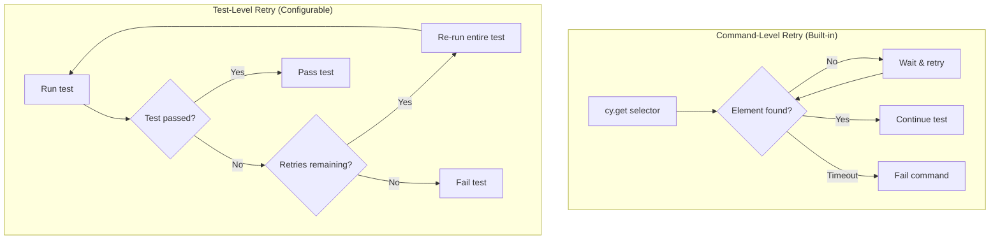
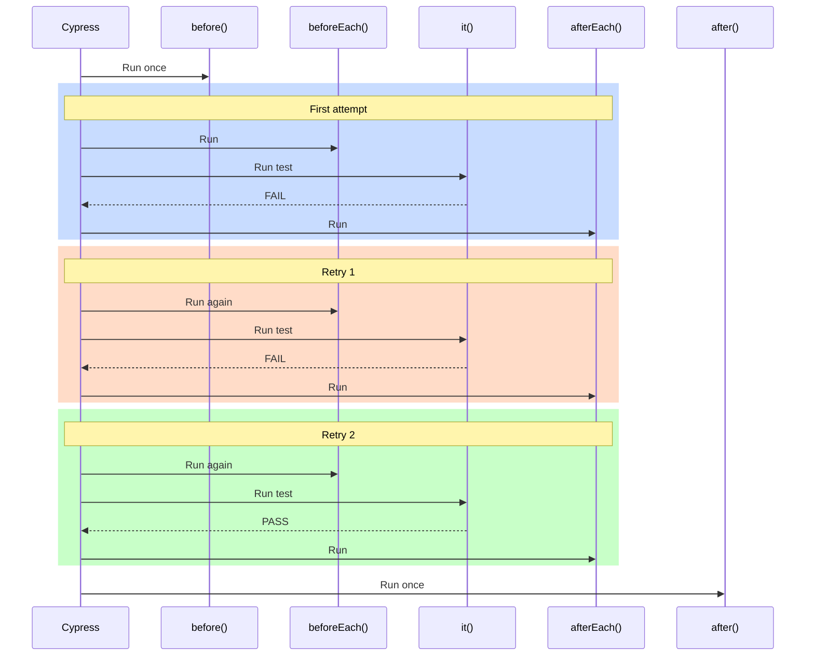

# How to Configure Cypress Retry Logic

Author: [nawazdhandala](https://www.github.com/nawazdhandala)

Tags: Cypress, Testing, Flaky Tests, CI/CD, Test Reliability

Description: Learn how to configure Cypress retry logic to handle flaky tests, reduce CI failures, and improve test suite reliability.

---

Flaky tests undermine confidence in your test suite. When the same test passes and fails randomly, teams start ignoring failures - defeating the purpose of automated testing. Cypress retry logic helps by automatically re-running failed tests, giving intermittent issues a chance to resolve.

## Understanding Cypress Retries

Cypress offers two types of retries:

1. **Command-level retries** - Built into every Cypress command
2. **Test-level retries** - Re-run entire failed tests



## Command-Level Retries

Every Cypress command that queries the DOM automatically retries until the element is found or a timeout is reached. This is not configurable per-command but you can adjust timeouts.

```javascript
// Default timeout is 4 seconds
// Cypress will keep retrying cy.get() until element appears or 4s passes
cy.get('[data-cy="submit-button"]').click();

// Increase timeout for slow-loading elements
cy.get('[data-cy="dashboard"]', { timeout: 10000 }).should('be.visible');

// Set default timeout globally in cypress.config.js
// defaultCommandTimeout: 6000
```

These retries happen automatically. You do not need to configure them.

## Test-Level Retries

Test-level retries re-run an entire test when it fails. This catches intermittent failures caused by timing issues, network hiccups, or other transient problems.

### Global Configuration

Set retries in your Cypress configuration file. You can configure different values for interactive mode (`openMode`) and headless mode (`runMode`).

```javascript
// cypress.config.js
const { defineConfig } = require('cypress');

module.exports = defineConfig({
  retries: {
    // Retry failed tests twice when running in CI (cypress run)
    runMode: 2,
    // No retries when developing interactively (cypress open)
    openMode: 0
  },
  e2e: {
    baseUrl: 'http://localhost:3000',
    specPattern: 'cypress/e2e/**/*.cy.{js,ts}'
  }
});
```

With `runMode: 2`, a failing test gets two additional attempts (three total) before being marked as failed.

### Per-Test Configuration

Override global settings for specific tests using the `retries` configuration option.

```javascript
// This specific test gets more retries due to known flakiness
it('should sync data with external service', { retries: 4 }, () => {
  cy.visit('/integrations');
  cy.get('[data-cy="sync-button"]').click();

  // External service can be slow or intermittent
  cy.get('[data-cy="sync-complete"]', { timeout: 30000 })
    .should('be.visible');
});

// This test is stable, no retries needed
it('should display static content', { retries: 0 }, () => {
  cy.visit('/about');
  cy.contains('About Us').should('be.visible');
});
```

### Per-Suite Configuration

Configure retries for an entire describe block.

```javascript
describe('Payment Processing', { retries: 3 }, () => {
  // All tests in this suite get 3 retries

  it('should process credit card payment', () => {
    // Payment gateway can have intermittent issues
    cy.get('[data-cy="pay-button"]').click();
    cy.get('[data-cy="payment-success"]').should('be.visible');
  });

  it('should handle payment decline', () => {
    cy.get('[data-cy="invalid-card"]').type('1234567890');
    cy.get('[data-cy="pay-button"]').click();
    cy.get('[data-cy="payment-declined"]').should('be.visible');
  });
});
```

## Separate Open and Run Mode Settings

You typically want different behavior during development versus CI.

```javascript
// cypress.config.js
module.exports = defineConfig({
  retries: {
    // CI: Retry to reduce noise from flaky tests
    runMode: 2,
    // Development: Fail immediately to see problems clearly
    openMode: 0
  }
});

// Or configure per-test with both modes
it('flaky integration test', {
  retries: {
    runMode: 3,
    openMode: 1
  }
}, () => {
  // Test code
});
```

## Retry Hooks and Execution Flow

When a test is retried, Cypress re-runs `beforeEach` hooks but NOT `before` hooks.



```javascript
describe('Retry behavior with hooks', () => {
  before(() => {
    // Runs ONCE before all tests, NOT re-run on retry
    cy.task('seedDatabase');
  });

  beforeEach(() => {
    // Runs before EACH test attempt, including retries
    cy.visit('/');
    cy.login('testuser', 'password');
  });

  afterEach(() => {
    // Runs after EACH test attempt, including retries
    cy.log('Test attempt completed');
  });

  after(() => {
    // Runs ONCE after all tests, NOT re-run on retry
    cy.task('cleanupDatabase');
  });

  it('should perform some action', () => {
    // Test code
  });
});
```

## Detecting Retries in Your Tests

Check if the current attempt is a retry using `Cypress.currentRetry`.

```javascript
beforeEach(() => {
  if (Cypress.currentRetry > 0) {
    // This is a retry attempt - maybe add extra cleanup
    cy.log(`Retry attempt ${Cypress.currentRetry}`);
    cy.clearLocalStorage();
    cy.clearCookies();
  }

  cy.visit('/');
});
```

## Flaky Test Detection with Cypress Dashboard

When using Cypress Dashboard, tests that fail on first attempt but pass on retry are automatically flagged as flaky. This helps you identify and fix underlying issues.

```javascript
// cypress.config.js
module.exports = defineConfig({
  projectId: 'your-project-id',
  retries: {
    runMode: 2,
    openMode: 0
  }
});
```

The Dashboard shows:

- Which tests are flaky
- Flakiness rate over time
- When flakiness started
- Stack traces from failed attempts

## Best Practices

### 1. Do Not Use Retries as a Crutch

Retries mask problems. Use them as a safety net while you fix root causes.

```javascript
// Bad: Relying on retries to pass
it('flaky test we never fixed', { retries: 5 }, () => {
  // This test fails randomly and we just added retries
});

// Good: Use retries while investigating
it('investigating flakiness', { retries: 2 }, () => {
  // TODO: Fix timing issue - see ticket #1234
  cy.get('[data-cy="async-data"]').should('be.visible');
});
```

### 2. Different Retries for Different Environments

More retries in CI where you cannot manually re-run, fewer in development where you want fast feedback.

```javascript
module.exports = defineConfig({
  retries: {
    runMode: 2,  // CI needs stability
    openMode: 0  // Development needs speed
  }
});
```

### 3. Set Higher Retries for Known Flaky Areas

External integrations and complex async flows often need more retries.

```javascript
describe('Third-party integrations', { retries: 3 }, () => {
  it('should connect to payment provider', () => {
    // Payment providers have occasional timeouts
  });

  it('should sync with CRM', () => {
    // CRM API can be slow
  });
});

describe('Static pages', { retries: 0 }, () => {
  it('should render home page', () => {
    // No external dependencies, should never flake
  });
});
```

### 4. Track Flaky Tests

Create a process to review and fix flaky tests regularly.

```javascript
// Add comments for tracking
it('user registration flow', {
  retries: 2
  // FLAKY: Intermittent timeout on email verification
  // Tracking: JIRA-5678
  // Added retries: 2024-01-15
}, () => {
  // Test code
});
```

### 5. Combine with Proper Waits

Retries work best alongside proper waiting strategies.

```javascript
// Bad: Relying on retries for timing
it('loads data', { retries: 3 }, () => {
  cy.visit('/dashboard');
  cy.get('[data-cy="data"]').should('exist');
});

// Good: Proper waiting + retries as backup
it('loads data', { retries: 1 }, () => {
  cy.intercept('GET', '/api/data').as('getData');
  cy.visit('/dashboard');
  cy.wait('@getData');
  cy.get('[data-cy="data"]').should('exist');
});
```

## Retry Configuration Summary

| Scope | Configuration | Example |
|-------|---------------|---------|
| Global | `cypress.config.js` | `retries: { runMode: 2, openMode: 0 }` |
| Suite | `describe()` option | `describe('Suite', { retries: 3 }, ...)` |
| Test | `it()` option | `it('Test', { retries: 2 }, ...)` |

Priority: Test > Suite > Global

## Troubleshooting

**Tests always failing even with retries**

The underlying issue is not intermittent. Debug the test to find the real problem.

**Too many retries slowing down CI**

Reduce retry count and fix flaky tests. Each retry adds significant time.

```javascript
// Calculate impact: 100 tests * 3 retries * 10% flake rate = 30 extra test runs
```

**Retries not running**

Verify configuration syntax and that you are using `cypress run` not `cypress open` for `runMode` settings.

---

Test retries are a pragmatic tool for maintaining CI stability while you work on test reliability. Use them intentionally, track which tests need them, and treat each retry-dependent test as technical debt to address.
