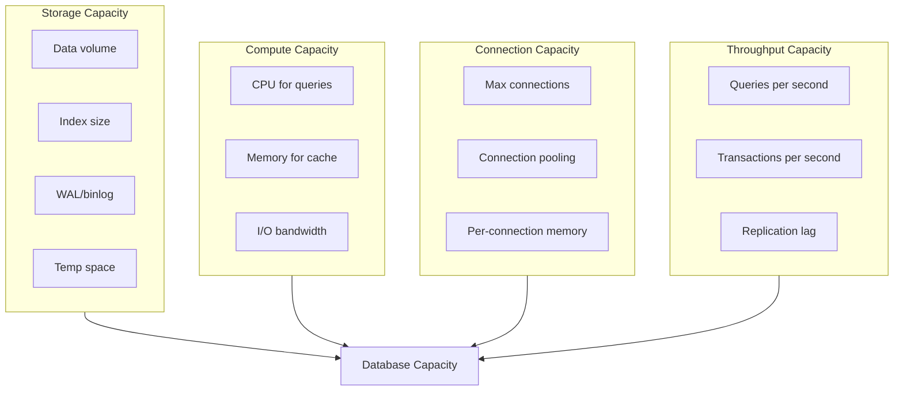
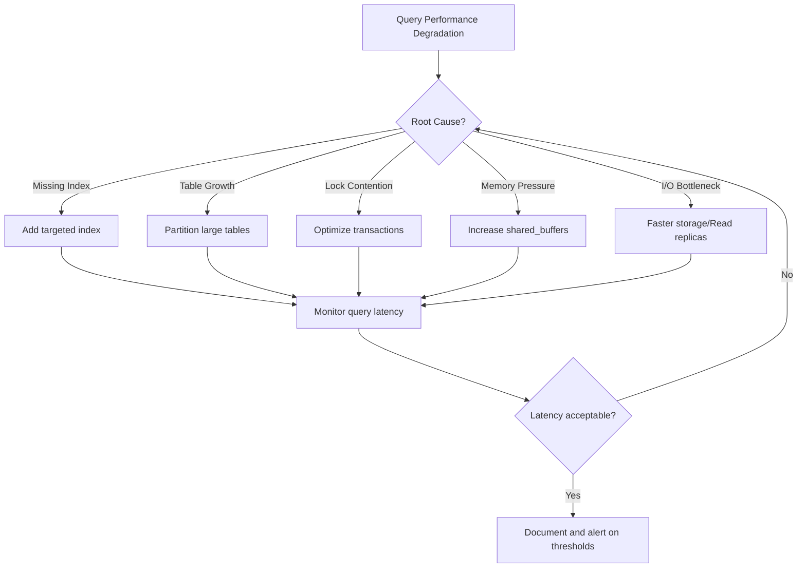
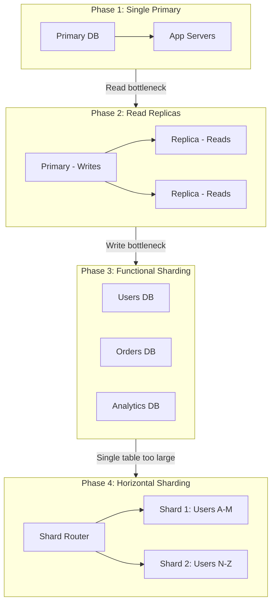

# How to Plan Database Capacity

Author: [nawazdhandala](https://www.github.com/nawazdhandala)

Tags: Site Reliability Engineering, Database, Capacity Planning, PostgreSQL, MySQL, Performance

Description: A practical guide to database capacity planning covering storage growth, connection pooling, query performance, and scaling strategies.

---

## Why Database Capacity Planning is Different

Databases are often the hardest component to scale. Unlike stateless application servers that can be horizontally scaled with a load balancer, databases have state, consistency requirements, and complex resource interactions. Running out of database capacity usually means downtime, data loss risk, or emergency migrations under pressure.

This guide covers the key dimensions of database capacity and how to plan for each.

## The Four Dimensions of Database Capacity



## Step 1: Track Storage Growth

Storage is the most predictable capacity dimension. Track it and project forward.

```python
# storage_capacity.py - Monitor and forecast database storage
from dataclasses import dataclass
from datetime import datetime, timedelta
from typing import List, Tuple, Optional

@dataclass
class StorageMetrics:
    timestamp: datetime
    data_size_gb: float
    index_size_gb: float
    wal_size_gb: float
    total_allocated_gb: float

    @property
    def total_used_gb(self) -> float:
        return self.data_size_gb + self.index_size_gb + self.wal_size_gb

    @property
    def utilization_percent(self) -> float:
        if self.total_allocated_gb == 0:
            return 0
        return (self.total_used_gb / self.total_allocated_gb) * 100

class DatabaseStorageMonitor:
    """Monitor and forecast database storage usage."""

    def __init__(self, database_name: str):
        self.database_name = database_name
        self.history: List[StorageMetrics] = []

    def record_metrics(self, metrics: StorageMetrics):
        self.history.append(metrics)

    def calculate_daily_growth(self, lookback_days: int = 30) -> dict:
        """Calculate average daily growth by component."""
        if len(self.history) < 2:
            return {"data": 0, "index": 0, "wal": 0, "total": 0}

        cutoff = datetime.utcnow() - timedelta(days=lookback_days)
        recent = [m for m in self.history if m.timestamp > cutoff]

        if len(recent) < 2:
            return {"data": 0, "index": 0, "wal": 0, "total": 0}

        oldest = recent[0]
        newest = recent[-1]
        days = (newest.timestamp - oldest.timestamp).days or 1

        return {
            "data": (newest.data_size_gb - oldest.data_size_gb) / days,
            "index": (newest.index_size_gb - oldest.index_size_gb) / days,
            "wal": (newest.wal_size_gb - oldest.wal_size_gb) / days,
            "total": (newest.total_used_gb - oldest.total_used_gb) / days,
        }

    def forecast_storage_exhaustion(self) -> Optional[int]:
        """Forecast days until storage is exhausted."""
        if not self.history:
            return None

        current = self.history[-1]
        growth = self.calculate_daily_growth()

        if growth["total"] <= 0:
            return None  # Not growing

        remaining_gb = current.total_allocated_gb - current.total_used_gb
        days_remaining = remaining_gb / growth["total"]

        return int(days_remaining)

    def generate_storage_report(self) -> dict:
        """Generate a storage capacity report."""
        if not self.history:
            return {"error": "No data available"}

        current = self.history[-1]
        growth = self.calculate_daily_growth()
        exhaustion_days = self.forecast_storage_exhaustion()

        return {
            "database": self.database_name,
            "current_usage": {
                "data_gb": round(current.data_size_gb, 2),
                "index_gb": round(current.index_size_gb, 2),
                "wal_gb": round(current.wal_size_gb, 2),
                "total_gb": round(current.total_used_gb, 2),
                "allocated_gb": round(current.total_allocated_gb, 2),
                "utilization_percent": round(current.utilization_percent, 1),
            },
            "daily_growth": {
                "data_gb": round(growth["data"], 3),
                "index_gb": round(growth["index"], 3),
                "total_gb": round(growth["total"], 3),
            },
            "forecast": {
                "days_to_exhaustion": exhaustion_days,
                "status": _storage_status(current.utilization_percent, exhaustion_days),
            },
            "recommendations": _storage_recommendations(
                current.utilization_percent,
                exhaustion_days,
                growth
            ),
        }

def _storage_status(utilization: float, days_remaining: Optional[int]) -> str:
    if utilization > 85 or (days_remaining and days_remaining < 30):
        return "critical"
    elif utilization > 70 or (days_remaining and days_remaining < 90):
        return "warning"
    return "healthy"

def _storage_recommendations(
    utilization: float,
    days_remaining: Optional[int],
    growth: dict
) -> List[str]:
    recommendations = []

    if utilization > 85:
        recommendations.append("Expand storage immediately - above 85% utilization")

    if days_remaining and days_remaining < 30:
        recommendations.append(f"Storage will exhaust in {days_remaining} days - plan expansion now")

    if growth["index"] > growth["data"] * 0.5:
        recommendations.append("Index growth is high - review indexing strategy")

    if growth["wal"] > growth["data"]:
        recommendations.append("WAL growth exceeds data growth - check replication and archiving")

    return recommendations
```

## Step 2: Monitor Connection Capacity

Database connections are a finite resource. Running out causes application errors.

```python
# connection_capacity.py - Monitor and manage database connections
from dataclasses import dataclass
from datetime import datetime
from typing import List, Dict

@dataclass
class ConnectionMetrics:
    timestamp: datetime
    active_connections: int
    idle_connections: int
    waiting_connections: int
    max_connections: int

    @property
    def total_connections(self) -> int:
        return self.active_connections + self.idle_connections

    @property
    def utilization_percent(self) -> float:
        if self.max_connections == 0:
            return 0
        return (self.total_connections / self.max_connections) * 100

class ConnectionPoolCalculator:
    """Calculate optimal connection pool sizes."""

    @staticmethod
    def calculate_pool_size(
        cpu_cores: int,
        io_wait_ratio: float = 0.5,
        safety_margin: float = 0.8
    ) -> dict:
        """
        Calculate optimal connection pool size based on hardware.

        Formula: connections = (cpu_cores * 2) + effective_spindle_count
        For SSDs, spindle_count is typically 1.

        io_wait_ratio: portion of time queries spend waiting for I/O (0-1)
        """
        # Base formula from PostgreSQL documentation
        base_connections = (cpu_cores * 2) + 1

        # Adjust for I/O wait
        if io_wait_ratio > 0:
            base_connections = int(base_connections * (1 + io_wait_ratio))

        # Apply safety margin
        recommended = int(base_connections * safety_margin)

        return {
            "recommended_pool_size": recommended,
            "minimum_pool_size": max(5, recommended // 2),
            "maximum_pool_size": recommended * 2,
            "notes": [
                f"Based on {cpu_cores} CPU cores",
                "Add connections if I/O-bound workload",
                "Reduce if memory constrained",
            ],
        }

    @staticmethod
    def calculate_total_connections(
        app_instances: int,
        pool_size_per_instance: int,
        admin_reserved: int = 5,
        replication_slots: int = 2,
        monitoring_connections: int = 3
    ) -> dict:
        """Calculate total connections needed for the system."""

        app_total = app_instances * pool_size_per_instance
        total_needed = app_total + admin_reserved + replication_slots + monitoring_connections

        # Add 20% buffer
        recommended_max = int(total_needed * 1.2)

        return {
            "app_connections": app_total,
            "admin_reserved": admin_reserved,
            "replication": replication_slots,
            "monitoring": monitoring_connections,
            "total_needed": total_needed,
            "recommended_max_connections": recommended_max,
            "memory_estimate_mb": recommended_max * 10,  # ~10MB per connection typical
        }

# Example: Calculate connection requirements
def plan_connection_capacity(
    db_cpu_cores: int,
    app_instances: int,
    expected_growth_instances: int
) -> dict:
    """Plan connection capacity for current and future needs."""

    calc = ConnectionPoolCalculator()

    # Calculate per-instance pool size
    pool_config = calc.calculate_pool_size(db_cpu_cores)
    pool_size = pool_config["recommended_pool_size"]

    # Current needs
    current = calc.calculate_total_connections(
        app_instances=app_instances,
        pool_size_per_instance=pool_size,
    )

    # Future needs
    future = calc.calculate_total_connections(
        app_instances=app_instances + expected_growth_instances,
        pool_size_per_instance=pool_size,
    )

    return {
        "pool_size_per_app": pool_size,
        "current_requirements": current,
        "future_requirements": future,
        "recommendations": [
            f"Set max_connections to at least {future['recommended_max_connections']}",
            f"Reserve {future['memory_estimate_mb']}MB for connection overhead",
            "Implement connection pooler (PgBouncer/ProxySQL) if exceeding 300 connections",
        ],
    }
```

## Step 3: Plan for Query Performance Scaling

As data grows, queries slow down. Plan for this before it becomes a problem.



```python
# query_capacity.py - Monitor query performance and plan capacity
from dataclasses import dataclass
from datetime import datetime
from typing import List, Optional
import statistics

@dataclass
class QueryMetrics:
    query_pattern: str  # Normalized query template
    execution_count: int
    avg_duration_ms: float
    p95_duration_ms: float
    p99_duration_ms: float
    rows_examined_avg: int
    rows_returned_avg: int
    timestamp: datetime

@dataclass
class QueryCapacityForecast:
    query_pattern: str
    current_p99_ms: float
    projected_p99_ms: float
    data_growth_factor: float
    time_to_slo_breach_days: Optional[int]
    recommendations: List[str]

class QueryPerformanceAnalyzer:
    """Analyze and forecast query performance."""

    def __init__(self, slo_latency_ms: float = 100):
        self.slo_latency_ms = slo_latency_ms
        self.history: List[QueryMetrics] = []

    def record_metrics(self, metrics: QueryMetrics):
        self.history.append(metrics)

    def analyze_query_scaling(
        self,
        query_pattern: str,
        projected_data_growth: float  # e.g., 2.0 = 2x current data
    ) -> QueryCapacityForecast:
        """Analyze how a query will perform as data grows."""

        pattern_history = [
            m for m in self.history
            if m.query_pattern == query_pattern
        ]

        if not pattern_history:
            return QueryCapacityForecast(
                query_pattern=query_pattern,
                current_p99_ms=0,
                projected_p99_ms=0,
                data_growth_factor=projected_data_growth,
                time_to_slo_breach_days=None,
                recommendations=["Insufficient data for analysis"],
            )

        current_p99 = pattern_history[-1].p99_duration_ms
        rows_examined = pattern_history[-1].rows_examined_avg

        # Estimate query complexity
        # O(n) = linear, O(n log n) = sorted, O(n^2) = nested loops
        complexity_factor = self._estimate_complexity_factor(
            rows_examined,
            current_p99,
        )

        # Project performance at larger data size
        if complexity_factor == "linear":
            projected_p99 = current_p99 * projected_data_growth
        elif complexity_factor == "log_linear":
            import math
            projected_p99 = current_p99 * projected_data_growth * (
                math.log(projected_data_growth * rows_examined) /
                math.log(rows_examined) if rows_examined > 1 else 1
            )
        else:  # quadratic or worse
            projected_p99 = current_p99 * (projected_data_growth ** 1.5)

        # Calculate time to SLO breach
        time_to_breach = self._calculate_time_to_breach(
            current_p99,
            projected_p99,
            projected_data_growth,
        )

        recommendations = self._generate_recommendations(
            current_p99,
            projected_p99,
            complexity_factor,
            rows_examined,
        )

        return QueryCapacityForecast(
            query_pattern=query_pattern,
            current_p99_ms=current_p99,
            projected_p99_ms=projected_p99,
            data_growth_factor=projected_data_growth,
            time_to_slo_breach_days=time_to_breach,
            recommendations=recommendations,
        )

    def _estimate_complexity_factor(
        self,
        rows_examined: int,
        duration_ms: float
    ) -> str:
        """Estimate query complexity based on rows examined vs duration."""
        if rows_examined == 0:
            return "linear"

        ms_per_row = duration_ms / rows_examined

        # Rough heuristics
        if ms_per_row < 0.001:
            return "linear"  # Index scan
        elif ms_per_row < 0.01:
            return "log_linear"  # Sorted operation
        else:
            return "quadratic"  # Full scan or nested loops

    def _calculate_time_to_breach(
        self,
        current_p99: float,
        projected_p99: float,
        growth_factor: float,
    ) -> Optional[int]:
        """Calculate days until SLO is breached."""
        if current_p99 >= self.slo_latency_ms:
            return 0  # Already breached

        if projected_p99 <= self.slo_latency_ms:
            return None  # Won't breach even at projected growth

        # Linear interpolation (simplified)
        breach_point = (self.slo_latency_ms - current_p99) / (projected_p99 - current_p99)
        # Assume growth_factor is annual
        days = int(365 * breach_point)

        return max(0, days)

    def _generate_recommendations(
        self,
        current_p99: float,
        projected_p99: float,
        complexity: str,
        rows_examined: int,
    ) -> List[str]:
        recommendations = []

        if complexity == "quadratic":
            recommendations.append("Query has poor scaling - review execution plan")
            recommendations.append("Consider adding indexes or rewriting query")

        if rows_examined > 100000:
            recommendations.append("High row examination - consider partitioning")

        if projected_p99 > self.slo_latency_ms:
            recommendations.append(f"Projected latency ({projected_p99:.0f}ms) exceeds SLO ({self.slo_latency_ms}ms)")
            recommendations.append("Plan optimization or read replica offloading")

        if projected_p99 > current_p99 * 5:
            recommendations.append("Query latency will increase significantly with data growth")

        return recommendations
```

## Step 4: Design for Scaling Transitions

Plan your scaling transitions before you need them.



```python
# scaling_transitions.py - Plan database scaling transitions
from dataclasses import dataclass
from typing import List, Optional
from enum import Enum

class ScalingPhase(Enum):
    SINGLE_PRIMARY = "single_primary"
    READ_REPLICAS = "read_replicas"
    FUNCTIONAL_SHARDING = "functional_sharding"
    HORIZONTAL_SHARDING = "horizontal_sharding"

@dataclass
class ScalingThreshold:
    metric: str
    current_value: float
    threshold_value: float
    description: str

    @property
    def exceeded(self) -> bool:
        return self.current_value >= self.threshold_value

    @property
    def headroom_percent(self) -> float:
        if self.threshold_value == 0:
            return 0
        return ((self.threshold_value - self.current_value) / self.threshold_value) * 100

@dataclass
class ScalingPlan:
    current_phase: ScalingPhase
    next_phase: Optional[ScalingPhase]
    trigger_thresholds: List[ScalingThreshold]
    estimated_migration_hours: int
    estimated_downtime_minutes: int
    prerequisites: List[str]
    risks: List[str]

def evaluate_scaling_needs(
    write_qps: float,
    read_qps: float,
    storage_gb: float,
    largest_table_gb: float,
    replication_lag_ms: float,
) -> ScalingPlan:
    """Evaluate current metrics and recommend scaling phase."""

    # Define thresholds for each phase transition
    thresholds = {
        ScalingPhase.SINGLE_PRIMARY: [
            ScalingThreshold("read_qps", read_qps, 5000, "Read queries per second"),
            ScalingThreshold("storage_gb", storage_gb, 500, "Total storage"),
        ],
        ScalingPhase.READ_REPLICAS: [
            ScalingThreshold("write_qps", write_qps, 2000, "Write queries per second"),
            ScalingThreshold("replication_lag_ms", replication_lag_ms, 1000, "Replication lag"),
        ],
        ScalingPhase.FUNCTIONAL_SHARDING: [
            ScalingThreshold("largest_table_gb", largest_table_gb, 100, "Largest table size"),
            ScalingThreshold("write_qps", write_qps, 10000, "Write queries per second"),
        ],
    }

    # Determine current recommended phase
    current_phase = ScalingPhase.SINGLE_PRIMARY

    if any(t.exceeded for t in thresholds[ScalingPhase.SINGLE_PRIMARY]):
        current_phase = ScalingPhase.READ_REPLICAS

    if any(t.exceeded for t in thresholds[ScalingPhase.READ_REPLICAS]):
        current_phase = ScalingPhase.FUNCTIONAL_SHARDING

    if any(t.exceeded for t in thresholds[ScalingPhase.FUNCTIONAL_SHARDING]):
        current_phase = ScalingPhase.HORIZONTAL_SHARDING

    # Determine next phase
    phase_order = list(ScalingPhase)
    current_index = phase_order.index(current_phase)
    next_phase = phase_order[current_index + 1] if current_index < len(phase_order) - 1 else None

    # Get relevant thresholds
    relevant_thresholds = thresholds.get(current_phase, [])

    # Generate migration details
    migration_details = _get_migration_details(current_phase, next_phase)

    return ScalingPlan(
        current_phase=current_phase,
        next_phase=next_phase,
        trigger_thresholds=relevant_thresholds,
        estimated_migration_hours=migration_details["hours"],
        estimated_downtime_minutes=migration_details["downtime"],
        prerequisites=migration_details["prerequisites"],
        risks=migration_details["risks"],
    )

def _get_migration_details(current: ScalingPhase, next_phase: Optional[ScalingPhase]) -> dict:
    """Get migration details for phase transition."""

    if next_phase == ScalingPhase.READ_REPLICAS:
        return {
            "hours": 4,
            "downtime": 0,
            "prerequisites": [
                "Configure streaming replication",
                "Update application for read/write splitting",
                "Set up connection routing",
            ],
            "risks": [
                "Replication lag during high write load",
                "Read-after-write consistency issues",
            ],
        }
    elif next_phase == ScalingPhase.FUNCTIONAL_SHARDING:
        return {
            "hours": 24,
            "downtime": 30,
            "prerequisites": [
                "Identify table groupings by domain",
                "Update application for multi-database connections",
                "Plan data migration strategy",
            ],
            "risks": [
                "Cross-database joins no longer possible",
                "Distributed transaction complexity",
            ],
        }
    elif next_phase == ScalingPhase.HORIZONTAL_SHARDING:
        return {
            "hours": 80,
            "downtime": 60,
            "prerequisites": [
                "Choose sharding key carefully",
                "Implement shard routing layer",
                "Plan for shard rebalancing",
            ],
            "risks": [
                "Hot shard potential",
                "Complex cross-shard queries",
                "Operational complexity increase",
            ],
        }

    return {"hours": 0, "downtime": 0, "prerequisites": [], "risks": []}
```

## Database Capacity Checklist

Use this checklist for regular capacity reviews:

```yaml
# database-capacity-checklist.yaml
weekly_checks:
  - name: Storage utilization
    query: "SELECT pg_database_size(current_database()) / 1024 / 1024 / 1024 as gb"
    threshold: "< 70% of allocated"

  - name: Connection pool utilization
    query: "SELECT count(*) FROM pg_stat_activity"
    threshold: "< 80% of max_connections"

  - name: Replication lag
    query: "SELECT EXTRACT(EPOCH FROM replay_lag) FROM pg_stat_replication"
    threshold: "< 1 second"

monthly_checks:
  - name: Table bloat
    action: "Run pg_stat_user_tables analysis"
    threshold: "< 20% bloat"

  - name: Index usage
    action: "Review pg_stat_user_indexes for unused indexes"
    threshold: "All indexes used in past 30 days"

  - name: Slow query trends
    action: "Review pg_stat_statements for p99 changes"
    threshold: "No query > 100ms p99"

quarterly_checks:
  - name: Growth projection
    action: "Calculate storage runway"
    threshold: "> 6 months runway"

  - name: Scaling phase evaluation
    action: "Review metrics against scaling thresholds"
    threshold: "Not exceeding any phase thresholds"

  - name: Backup and recovery test
    action: "Restore from backup to verify RTO"
    threshold: "Recovery within defined RTO"
```

## Key Takeaways

Database capacity planning requires monitoring multiple dimensions: storage, connections, compute, and throughput. Track growth trends, understand your query performance characteristics, and plan scaling transitions before you hit limits. When database metrics flow into your observability platform alongside application data in OneUptime, you can correlate database capacity with user experience and make proactive scaling decisions.

---

The cost of database capacity planning is measured in hours of engineering time. The cost of running out of database capacity is measured in downtime, data risk, and emergency migrations. Invest in the former to avoid the latter.
