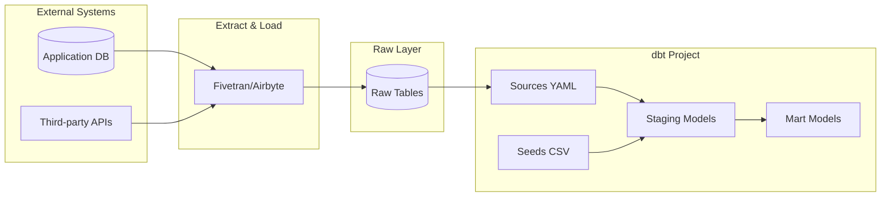

# How to Use dbt Seeds and Sources

Author: [nawazdhandala](https://www.github.com/nawazdhandala)

Tags: dbt, Data Engineering, Analytics Engineering, SQL, Data Warehouse

Description: Learn how to use dbt seeds for static reference data and sources for external table definitions to build maintainable data pipelines.

---

Building data pipelines in dbt requires understanding how to bring data into your transformation layer. Seeds and sources serve distinct but complementary purposes: seeds let you version-control small reference datasets, while sources define contracts with raw data tables. This guide covers practical patterns for both.

## Seeds vs Sources: When to Use Each

| Feature | Seeds | Sources |
|---------|-------|---------|
| **Data location** | CSV files in your dbt project | External tables in your warehouse |
| **Data size** | Small (under 1MB recommended) | Any size |
| **Update frequency** | Rarely changes | Updated by EL pipelines |
| **Version control** | Yes, in git | Only the definition |
| **Use case** | Lookup tables, mappings | Raw data from source systems |

## Working with Seeds

Seeds are CSV files that dbt loads directly into your data warehouse. They work well for reference data that changes infrequently and needs to be version-controlled alongside your transformations.

### Creating a Seed File

Place CSV files in the `seeds/` directory of your dbt project.

```csv
-- seeds/country_codes.csv
country_code,country_name,region
US,United States,North America
CA,Canada,North America
MX,Mexico,North America
GB,United Kingdom,Europe
DE,Germany,Europe
FR,France,Europe
JP,Japan,Asia Pacific
AU,Australia,Asia Pacific
```

### Configuring Seed Properties

Define column types and other properties in a YAML file to ensure consistent data types.

```yaml
# seeds/seeds.yml
version: 2

seeds:
  - name: country_codes
    description: "ISO country codes with regional mappings"
    config:
      # Override inferred column types
      column_types:
        country_code: varchar(2)
        country_name: varchar(100)
        region: varchar(50)
      # Control materialization
      schema: reference_data
    columns:
      - name: country_code
        description: "Two-letter ISO 3166-1 alpha-2 code"
        tests:
          - unique
          - not_null
      - name: country_name
        description: "Full country name"
        tests:
          - not_null
      - name: region
        description: "Geographic region for reporting"
```

### Loading Seeds

Run `dbt seed` to load CSV files into your warehouse.

```bash
# Load all seeds
dbt seed

# Load a specific seed
dbt seed --select country_codes

# Full refresh (drop and recreate)
dbt seed --full-refresh
```

### Practical Seed Examples

Seeds work well for data that engineers control and update manually.

```csv
-- seeds/status_mappings.csv
-- Map raw status codes to human-readable labels
raw_status,display_status,is_terminal,sort_order
pending,Pending Review,false,1
approved,Approved,false,2
in_progress,In Progress,false,3
completed,Completed,true,4
cancelled,Cancelled,true,5
rejected,Rejected,true,6
```

```csv
-- seeds/fiscal_calendar.csv
-- Custom fiscal calendar for financial reporting
fiscal_year,fiscal_quarter,fiscal_month,calendar_month_start,calendar_month_end
2024,Q1,1,2024-02-01,2024-02-29
2024,Q1,2,2024-03-01,2024-03-31
2024,Q1,3,2024-04-01,2024-04-30
2024,Q2,4,2024-05-01,2024-05-31
2024,Q2,5,2024-06-01,2024-06-30
2024,Q2,6,2024-07-01,2024-07-31
```

### Using Seeds in Models

Reference seeds like any other dbt model with the `ref()` function.

```sql
-- models/staging/stg_orders.sql
-- Enrich orders with status labels from seed
with orders as (
    select * from {{ source('ecommerce', 'orders') }}
),

status_mapping as (
    -- Reference the seed file
    select * from {{ ref('status_mappings') }}
)

select
    o.order_id,
    o.customer_id,
    o.order_date,
    o.raw_status,
    -- Join to seed for display values
    sm.display_status,
    sm.is_terminal,
    sm.sort_order
from orders o
left join status_mapping sm
    on o.raw_status = sm.raw_status
```

## Working with Sources

Sources define the raw data tables that exist outside dbt, typically loaded by extraction tools like Fivetran, Airbyte, or custom pipelines.

### Defining Sources

Create source definitions in YAML files, typically in a `models/staging/` directory.

```yaml
# models/staging/ecommerce/_sources.yml
version: 2

sources:
  - name: ecommerce
    description: "Raw data from the e-commerce application database"
    database: raw_data  # Optional: specify database
    schema: ecommerce_prod

    # Source-level freshness check
    freshness:
      warn_after: {count: 12, period: hour}
      error_after: {count: 24, period: hour}

    # Default for all tables
    loaded_at_field: _etl_loaded_at

    tables:
      - name: orders
        description: "Customer orders from the checkout system"
        identifier: tbl_orders  # Actual table name if different
        columns:
          - name: order_id
            description: "Primary key"
            tests:
              - unique
              - not_null
          - name: customer_id
            description: "Foreign key to customers table"
            tests:
              - not_null
          - name: order_date
            description: "Date the order was placed"
          - name: raw_status
            description: "Order status code"

      - name: customers
        description: "Customer profile data"
        # Override freshness for this table
        freshness:
          warn_after: {count: 24, period: hour}
          error_after: {count: 48, period: hour}
        columns:
          - name: customer_id
            tests:
              - unique
              - not_null
          - name: email
            tests:
              - unique

      - name: products
        description: "Product catalog"
        freshness: null  # Disable freshness checks
```

### Referencing Sources in Models

Use the `source()` function to reference external tables.

```sql
-- models/staging/ecommerce/stg_ecommerce_orders.sql
-- Staging model that cleans and renames source columns
with source as (
    -- Reference the source table
    select * from {{ source('ecommerce', 'orders') }}
),

renamed as (
    select
        -- Rename to consistent conventions
        order_id,
        customer_id as customer_key,
        order_date,
        raw_status as order_status_code,
        total_amount_cents / 100.0 as order_total,
        -- Add metadata
        _etl_loaded_at as loaded_at
    from source
)

select * from renamed
```

### Data Flow Architecture

The relationship between sources, seeds, and models follows a clear pattern.



## Checking Source Freshness

Monitor whether your source data is being updated as expected.

```bash
# Check freshness for all sources
dbt source freshness

# Check specific source
dbt source freshness --select source:ecommerce

# Output results to JSON
dbt source freshness --output freshness.json
```

Example freshness output:

```
Running freshness check for source ecommerce.orders
  - Freshness: PASS (age: 2 hours, threshold: 12 hours)

Running freshness check for source ecommerce.customers
  - Freshness: WARN (age: 18 hours, threshold: 12 hours)
```

## Advanced Patterns

### Multi-Source Staging

When the same entity comes from multiple sources, combine them in staging.

```yaml
# models/staging/crm/_sources.yml
version: 2

sources:
  - name: salesforce
    schema: salesforce_raw
    tables:
      - name: contacts

  - name: hubspot
    schema: hubspot_raw
    tables:
      - name: contacts
```

```sql
-- models/staging/stg_all_contacts.sql
-- Union contacts from multiple CRM sources
with salesforce_contacts as (
    select
        'salesforce' as source_system,
        id as contact_id,
        email,
        first_name,
        last_name,
        created_date
    from {{ source('salesforce', 'contacts') }}
),

hubspot_contacts as (
    select
        'hubspot' as source_system,
        vid::varchar as contact_id,
        email,
        firstname as first_name,
        lastname as last_name,
        createdate as created_date
    from {{ source('hubspot', 'contacts') }}
)

select * from salesforce_contacts
union all
select * from hubspot_contacts
```

### Seed-Based Feature Flags

Use seeds to control model behavior without code changes.

```csv
-- seeds/feature_flags.csv
feature_name,is_enabled,enabled_date
new_attribution_model,true,2024-01-15
legacy_status_codes,false,2023-06-01
include_test_accounts,false,
```

```sql
-- models/marts/attribution.sql


-- Check feature flag from seed at compile time

    -- New attribution logic
    select * from {{ ref('attribution_v2') }}

    -- Legacy attribution logic
    select * from {{ ref('attribution_v1') }}

```

### Source Quoting for Reserved Words

Handle table or column names that conflict with SQL reserved words.

```yaml
# models/staging/_sources.yml
version: 2

sources:
  - name: legacy_system
    schema: legacy
    quoting:
      database: false
      schema: false
      identifier: true  # Quote table names
    tables:
      - name: order  # Reserved word in most SQL dialects
        identifier: '"order"'
      - name: user
        identifier: '"user"'
```

## Project Organization

A well-organized dbt project separates sources, seeds, and models clearly.

```
dbt_project/
├── seeds/
│   ├── seeds.yml           # Seed configurations
│   ├── country_codes.csv
│   ├── status_mappings.csv
│   └── fiscal_calendar.csv
├── models/
│   ├── staging/
│   │   ├── ecommerce/
│   │   │   ├── _sources.yml      # Source definitions
│   │   │   ├── stg_orders.sql
│   │   │   └── stg_customers.sql
│   │   └── crm/
│   │       ├── _sources.yml
│   │       └── stg_contacts.sql
│   └── marts/
│       ├── core/
│       │   ├── dim_customers.sql
│       │   └── fct_orders.sql
│       └── marketing/
│           └── attribution.sql
└── dbt_project.yml
```

## Common Pitfalls

**Seed size limits**: Seeds load entirely into memory during compilation. Keep them under 1MB. For larger reference data, use a source table instead.

**Missing freshness fields**: If your source tables lack a timestamp column for freshness checks, you can disable freshness or add a metadata column to your EL pipeline.

**Hardcoded schemas**: Use variables or environment-based configurations instead of hardcoding database and schema names in source definitions.

```yaml
# dbt_project.yml
vars:
  raw_database: "{{ env_var('DBT_RAW_DATABASE', 'raw_data') }}"
  raw_schema: "{{ env_var('DBT_RAW_SCHEMA', 'ecommerce_prod') }}"
```

---

Seeds and sources form the foundation of your dbt data pipeline. Seeds provide version-controlled reference data for lookups and mappings, while sources establish clear contracts with your raw data layer. By defining both properly with tests and documentation, you create maintainable pipelines that clearly separate extraction from transformation.
