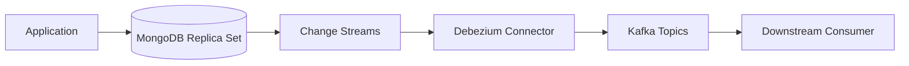
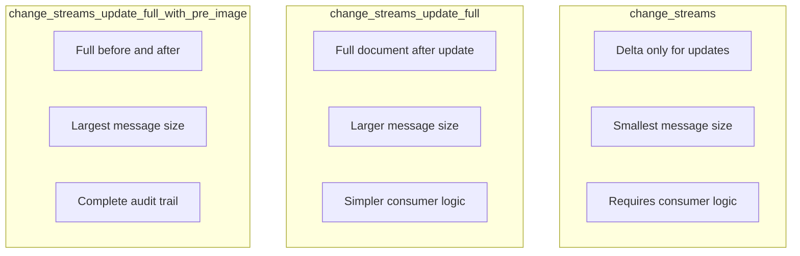
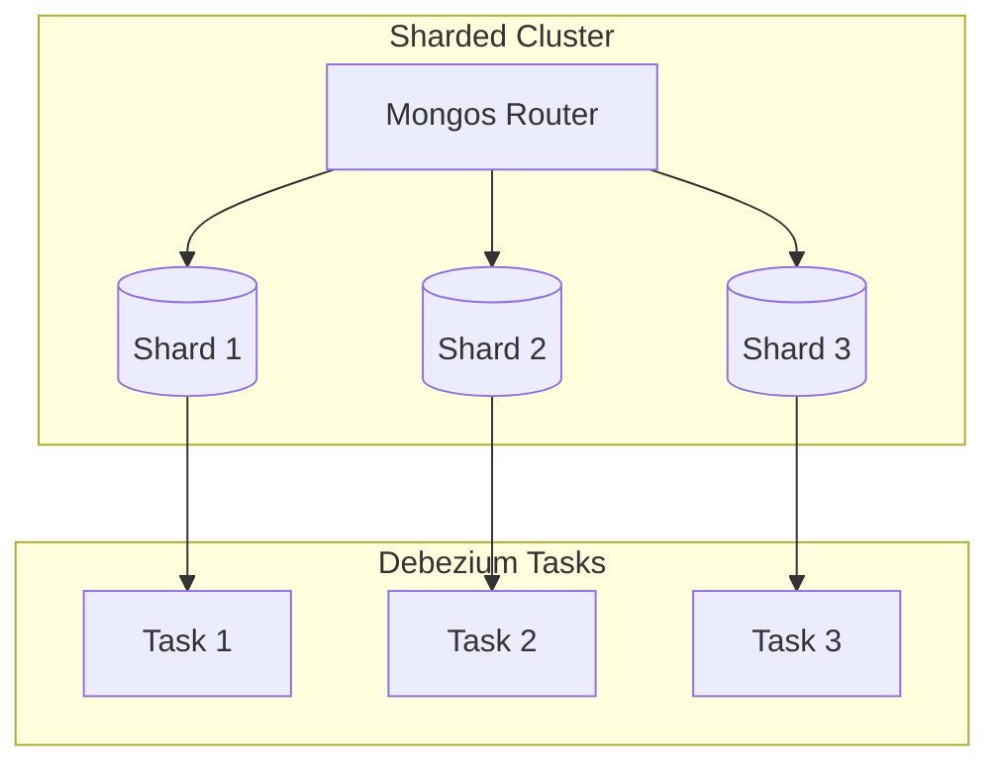

# How to Implement Debezium for MongoDB

Author: [nawazdhandala](https://www.github.com/nawazdhandala)

Tags: Debezium, MongoDB, Change Data Capture, Kafka, Change Streams, NoSQL, Event-Driven

Description: Learn how to set up Debezium for MongoDB change data capture using change streams, including configuration, deployment, and handling document changes.

---

> MongoDB's flexible schema and document model require special handling for change data capture. Debezium uses MongoDB change streams to capture inserts, updates, and deletes in real-time. Learn how to configure and deploy Debezium for MongoDB workloads.

Capturing changes from MongoDB differs from relational databases. Debezium handles the complexity for you.

---

## Overview

Debezium's MongoDB connector uses change streams, a MongoDB feature that provides real-time notifications of data changes. This requires MongoDB replica set or sharded cluster deployment.



---

## Prerequisites

### MongoDB Requirements

MongoDB must meet these requirements for Debezium:

1. **Replica Set or Sharded Cluster** - standalone MongoDB does not support change streams
2. **MongoDB 4.0+** - change streams require this version minimum
3. **WiredTiger storage engine** - the default since MongoDB 3.2

Check your MongoDB configuration:

```javascript
// Check replica set status
rs.status()

// Check MongoDB version
db.version()

// Check storage engine
db.serverStatus().storageEngine
```

### Setting Up a Replica Set

If you do not have a replica set, convert a standalone instance:

```javascript
// mongod.conf
replication:
  replSetName: "rs0"

// After restarting MongoDB, initialize the replica set
rs.initiate({
  _id: "rs0",
  members: [
    { _id: 0, host: "mongodb:27017" }
  ]
})
```

Docker Compose for development:

```yaml
# docker-compose.yml
version: '3.8'
services:
  mongodb:
    image: mongo:6.0
    command: ["--replSet", "rs0", "--bind_ip_all"]
    ports:
      - "27017:27017"
    volumes:
      - mongodb_data:/data/db
    healthcheck:
      test: echo 'db.runCommand("ping").ok' | mongosh --quiet
      interval: 10s
      timeout: 10s
      retries: 5

  mongodb-init:
    image: mongo:6.0
    depends_on:
      mongodb:
        condition: service_healthy
    command: >
      mongosh --host mongodb:27017 --eval '
        rs.initiate({
          _id: "rs0",
          members: [{ _id: 0, host: "mongodb:27017" }]
        })
      '

volumes:
  mongodb_data:
```

---

## Connector Configuration

### Basic Configuration

Create a Debezium MongoDB connector:

```json
{
  "name": "mongodb-connector",
  "config": {
    "connector.class": "io.debezium.connector.mongodb.MongoDbConnector",
    "tasks.max": "1",

    "mongodb.connection.string": "mongodb://mongodb:27017/?replicaSet=rs0",
    "mongodb.user": "debezium",
    "mongodb.password": "secret",

    "topic.prefix": "mongo",

    "collection.include.list": "inventory.products,inventory.orders",

    "capture.mode": "change_streams_update_full",

    "snapshot.mode": "initial"
  }
}
```

### Authentication Configuration

For authenticated MongoDB deployments:

```json
{
  "name": "mongodb-connector",
  "config": {
    "connector.class": "io.debezium.connector.mongodb.MongoDbConnector",

    "mongodb.connection.string": "mongodb://mongodb:27017/?replicaSet=rs0&authSource=admin",
    "mongodb.user": "debezium",
    "mongodb.password": "${secrets:mongodb-password}",
    "mongodb.authsource": "admin",

    "topic.prefix": "mongo"
  }
}
```

Create the MongoDB user:

```javascript
// Create Debezium user with required permissions
use admin
db.createUser({
  user: "debezium",
  pwd: "secret",
  roles: [
    { role: "read", db: "inventory" },
    { role: "read", db: "local" },
    { role: "read", db: "config" },
    { role: "readAnyDatabase", db: "admin" }
  ]
})
```

---

## Capture Modes

### Change Streams with Full Document

The recommended mode for most use cases:

```json
{
  "capture.mode": "change_streams_update_full"
}
```

This mode includes the full document after updates, not just the changed fields.

### Change Streams with Update Lookup

For backward compatibility:

```json
{
  "capture.mode": "change_streams_update_full_with_pre_image"
}
```

Requires MongoDB 6.0+ with pre-image collection enabled:

```javascript
// Enable pre-images for a collection
db.runCommand({
  collMod: "products",
  changeStreamPreAndPostImages: { enabled: true }
})
```

### Capture Mode Comparison



---

## Event Structure

### Insert Event

When a document is inserted:

```json
{
  "schema": {...},
  "payload": {
    "before": null,
    "after": "{\"_id\": {\"$oid\": \"507f1f77bcf86cd799439011\"}, \"name\": \"Product A\", \"price\": 29.99}",
    "source": {
      "version": "2.5.0",
      "connector": "mongodb",
      "name": "mongo",
      "ts_ms": 1706400000000,
      "snapshot": "false",
      "db": "inventory",
      "collection": "products",
      "ord": 1,
      "lsid": null,
      "txnNumber": null
    },
    "op": "c",
    "ts_ms": 1706400000123
  }
}
```

### Update Event

With `change_streams_update_full`:

```json
{
  "payload": {
    "before": null,
    "after": "{\"_id\": {\"$oid\": \"507f1f77bcf86cd799439011\"}, \"name\": \"Product A Updated\", \"price\": 39.99}",
    "updateDescription": {
      "updatedFields": "{\"name\": \"Product A Updated\", \"price\": 39.99}",
      "removedFields": [],
      "truncatedArrays": []
    },
    "source": {...},
    "op": "u",
    "ts_ms": 1706400001234
  }
}
```

### Delete Event

When a document is deleted:

```json
{
  "payload": {
    "before": "{\"_id\": {\"$oid\": \"507f1f77bcf86cd799439011\"}}",
    "after": null,
    "source": {...},
    "op": "d",
    "ts_ms": 1706400002345
  }
}
```

---

## Handling MongoDB Documents

### Parsing Document JSON

MongoDB documents are serialized as JSON strings. Parse them in your consumer:

```python
# consumer.py
import json
from kafka import KafkaConsumer
from bson import ObjectId
import re

def parse_mongodb_document(doc_string: str) -> dict:
    """Parse MongoDB extended JSON document"""
    if not doc_string:
        return None

    # Parse the JSON string
    doc = json.loads(doc_string)

    # Convert MongoDB extended JSON types
    return convert_extended_json(doc)

def convert_extended_json(obj):
    """Convert MongoDB extended JSON to Python types"""
    if isinstance(obj, dict):
        # Handle ObjectId
        if '$oid' in obj:
            return obj['$oid']
        # Handle Date
        if '$date' in obj:
            return obj['$date']
        # Handle NumberLong
        if '$numberLong' in obj:
            return int(obj['$numberLong'])
        # Handle NumberDecimal
        if '$numberDecimal' in obj:
            return float(obj['$numberDecimal'])
        # Recurse for nested objects
        return {k: convert_extended_json(v) for k, v in obj.items()}
    elif isinstance(obj, list):
        return [convert_extended_json(item) for item in obj]
    return obj

# Example usage
consumer = KafkaConsumer(
    'mongo.inventory.products',
    bootstrap_servers=['kafka:9092'],
    value_deserializer=lambda m: json.loads(m.decode('utf-8'))
)

for message in consumer:
    event = message.value
    payload = event.get('payload', {})

    # Parse the document
    after = parse_mongodb_document(payload.get('after'))

    if after:
        print(f"Document: {after}")
        print(f"ID: {after.get('_id')}")
```

### Using Transformations

Flatten MongoDB events for easier consumption:

```json
{
  "name": "mongodb-connector",
  "config": {
    "connector.class": "io.debezium.connector.mongodb.MongoDbConnector",

    "transforms": "unwrap",
    "transforms.unwrap.type": "io.debezium.connector.mongodb.transforms.ExtractNewDocumentState",
    "transforms.unwrap.drop.tombstones": "false",
    "transforms.unwrap.delete.handling.mode": "rewrite",
    "transforms.unwrap.add.fields": "op,source.ts_ms"
  }
}
```

After transformation, documents are flattened:

```json
{
  "_id": "507f1f77bcf86cd799439011",
  "name": "Product A",
  "price": 29.99,
  "__op": "c",
  "__source_ts_ms": 1706400000000
}
```

---

## Snapshot Configuration

### Initial Snapshot

Configure how the initial snapshot is performed:

```json
{
  "snapshot.mode": "initial",
  "snapshot.include.collection.list": "inventory.products,inventory.orders",
  "snapshot.max.threads": "4"
}
```

### Snapshot Modes

| Mode | Description |
|------|-------------|
| `initial` | Full snapshot on first start |
| `initial_only` | Snapshot only, no streaming |
| `never` | Skip snapshot, start from current position |
| `when_needed` | Snapshot if offsets are missing |

### Large Collection Handling

For large collections, configure appropriate settings:

```json
{
  "snapshot.mode": "initial",
  "snapshot.fetch.size": "10000",
  "snapshot.max.threads": "4",
  "mongodb.poll.interval.ms": "1000",

  "cursor.max.await.time.ms": "1000",
  "cursor.pipeline": "[]",
  "cursor.pipeline.order": "first"
}
```

---

## Sharded Cluster Support

### Connecting to Sharded Clusters

For sharded MongoDB deployments:

```json
{
  "name": "mongodb-sharded-connector",
  "config": {
    "connector.class": "io.debezium.connector.mongodb.MongoDbConnector",

    "mongodb.connection.string": "mongodb://mongos1:27017,mongos2:27017/?authSource=admin",
    "mongodb.connection.mode": "sharded",

    "topic.prefix": "mongo",
    "collection.include.list": "inventory.*"
  }
}
```

### Task Distribution

Distribute tasks across shards:

```json
{
  "tasks.max": "4",
  "mongodb.connection.mode": "sharded"
}
```



---

## Topic Naming

### Default Topic Names

By default, topics are named: `{topic.prefix}.{database}.{collection}`

```
mongo.inventory.products
mongo.inventory.orders
mongo.inventory.customers
```

### Custom Topic Routing

Route documents to custom topics:

```json
{
  "transforms": "route",
  "transforms.route.type": "org.apache.kafka.connect.transforms.RegexRouter",
  "transforms.route.regex": "mongo\\.inventory\\.(.*)",
  "transforms.route.replacement": "cdc-inventory-$1"
}
```

### Content-Based Routing

Route based on document content:

```json
{
  "transforms": "route",
  "transforms.route.type": "io.debezium.transforms.ContentBasedRouter",
  "transforms.route.language": "jsr223.groovy",
  "transforms.route.topic.expression": "value.after.category ?: 'default'"
}
```

---

## Production Deployment

### Docker Compose Setup

Complete production-ready setup:

```yaml
# docker-compose.yml
version: '3.8'
services:
  mongodb:
    image: mongo:6.0
    command: ["--replSet", "rs0", "--bind_ip_all", "--keyFile", "/etc/mongodb/keyfile"]
    environment:
      MONGO_INITDB_ROOT_USERNAME: admin
      MONGO_INITDB_ROOT_PASSWORD: adminpassword
    volumes:
      - mongodb_data:/data/db
      - ./mongodb-keyfile:/etc/mongodb/keyfile:ro
    ports:
      - "27017:27017"

  kafka:
    image: confluentinc/cp-kafka:7.5.0
    environment:
      KAFKA_NODE_ID: 1
      KAFKA_LISTENER_SECURITY_PROTOCOL_MAP: CONTROLLER:PLAINTEXT,PLAINTEXT:PLAINTEXT
      KAFKA_ADVERTISED_LISTENERS: PLAINTEXT://kafka:9092
      KAFKA_PROCESS_ROLES: broker,controller
      KAFKA_CONTROLLER_QUORUM_VOTERS: 1@kafka:9093
      KAFKA_LISTENERS: PLAINTEXT://0.0.0.0:9092,CONTROLLER://0.0.0.0:9093
      KAFKA_CONTROLLER_LISTENER_NAMES: CONTROLLER
      CLUSTER_ID: MkU3OEVBNTcwNTJENDM2Qk
    ports:
      - "9092:9092"

  kafka-connect:
    image: debezium/connect:2.5
    environment:
      BOOTSTRAP_SERVERS: kafka:9092
      GROUP_ID: connect-cluster
      CONFIG_STORAGE_TOPIC: connect-configs
      OFFSET_STORAGE_TOPIC: connect-offsets
      STATUS_STORAGE_TOPIC: connect-status
      KEY_CONVERTER: org.apache.kafka.connect.json.JsonConverter
      VALUE_CONVERTER: org.apache.kafka.connect.json.JsonConverter
    ports:
      - "8083:8083"
    depends_on:
      - kafka
      - mongodb

volumes:
  mongodb_data:
```

### Connector Deployment Script

```bash
#!/bin/bash
# deploy-mongodb-connector.sh

CONNECT_URL="${CONNECT_URL:-http://localhost:8083}"

# Wait for Kafka Connect to be ready
until curl -sf "${CONNECT_URL}/connectors" > /dev/null; do
  echo "Waiting for Kafka Connect..."
  sleep 5
done

# Deploy the connector
curl -X POST -H "Content-Type: application/json" \
  --data '{
    "name": "mongodb-connector",
    "config": {
      "connector.class": "io.debezium.connector.mongodb.MongoDbConnector",
      "tasks.max": "1",
      "mongodb.connection.string": "mongodb://mongodb:27017/?replicaSet=rs0",
      "mongodb.user": "debezium",
      "mongodb.password": "secret",
      "topic.prefix": "mongo",
      "collection.include.list": "inventory.*",
      "capture.mode": "change_streams_update_full",
      "snapshot.mode": "initial",
      "transforms": "unwrap",
      "transforms.unwrap.type": "io.debezium.connector.mongodb.transforms.ExtractNewDocumentState",
      "transforms.unwrap.drop.tombstones": "false"
    }
  }' \
  "${CONNECT_URL}/connectors"

echo "Connector deployed"
```

---

## Monitoring

### Key Metrics

Monitor these MongoDB connector metrics:

```yaml
# JMX metrics to watch
debezium.mongodb:
  - NumberOfChangeEventsReceived
  - MilliSecondsBehindSource
  - SourceEventPosition
  - NumberOfEventsFiltered
  - SnapshotRunning
  - SnapshotCompleted
```

### Health Check Script

```bash
#!/bin/bash
# check-mongodb-connector.sh

CONNECT_URL="${CONNECT_URL:-http://localhost:8083}"
CONNECTOR_NAME="mongodb-connector"

# Get connector status
STATUS=$(curl -sf "${CONNECT_URL}/connectors/${CONNECTOR_NAME}/status")

CONNECTOR_STATE=$(echo "$STATUS" | jq -r '.connector.state')
TASK_STATE=$(echo "$STATUS" | jq -r '.tasks[0].state')

if [ "$CONNECTOR_STATE" = "RUNNING" ] && [ "$TASK_STATE" = "RUNNING" ]; then
  echo "OK: MongoDB connector is running"
  exit 0
else
  echo "ERROR: Connector state: ${CONNECTOR_STATE}, Task state: ${TASK_STATE}"
  echo "$STATUS" | jq '.tasks[0].trace'
  exit 1
fi
```

---

## Best Practices

1. **Always use replica sets** - change streams require them
2. **Enable pre-images when needed** - for full before/after comparison
3. **Use appropriate capture mode** - `change_streams_update_full` for most cases
4. **Transform early** - flatten documents in the connector, not consumers
5. **Monitor change stream lag** - watch `MilliSecondsBehindSource`
6. **Handle schema flexibility** - MongoDB documents can vary in structure

---

## Conclusion

Debezium's MongoDB connector provides reliable change data capture using native change streams. Key points:

- **Replica set required** - no standalone support
- **Multiple capture modes** - choose based on your needs
- **Document transformation** - flatten for easier consumption
- **Sharded cluster support** - scales with your MongoDB deployment

---

*Capturing changes from MongoDB? [OneUptime](https://oneuptime.com) provides monitoring for your Debezium MongoDB connectors and downstream consumers.*
