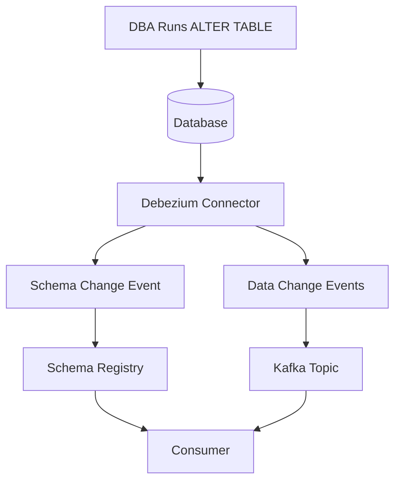
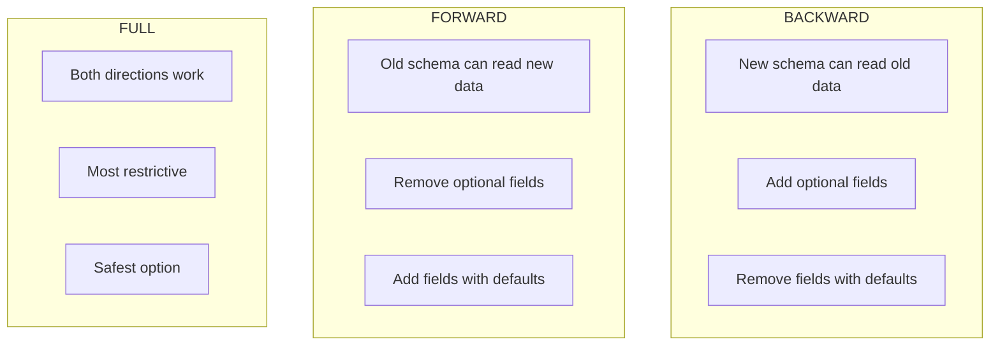
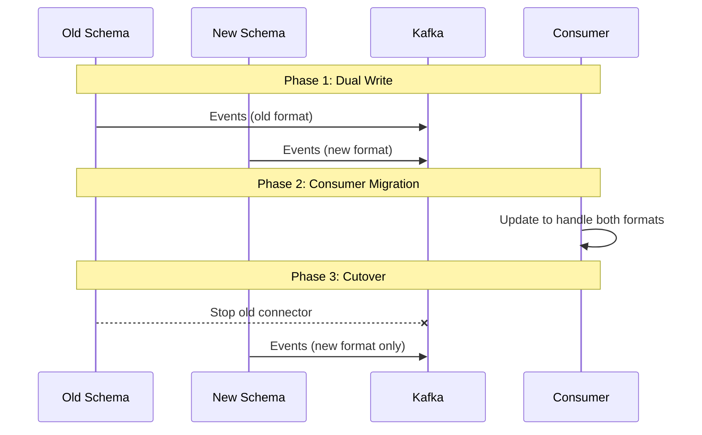

# How to Handle Debezium Schema Changes

Author: [nawazdhandala](https://www.github.com/nawazdhandala)

Tags: Debezium, Schema Evolution, Change Data Capture, Kafka, Schema Registry, Database Migration

Description: Learn how to handle database schema changes in Debezium CDC pipelines without breaking downstream consumers or losing data.

---

> Database schemas evolve. Columns get added, types change, tables get renamed. Without proper handling, schema changes break CDC pipelines and corrupt downstream data. Learn strategies to make your Debezium deployments schema-change resilient.

Schema changes are inevitable. Your CDC pipeline must handle them gracefully.

---

## Overview

Debezium captures schema changes along with data changes. The challenge is propagating these changes to downstream consumers without breaking their data processing.



---

## Schema History Configuration

### Schema History Storage

Debezium stores schema history to track changes over time. Configure storage location:

```properties
# For PostgreSQL connector
schema.history.internal.kafka.bootstrap.servers=kafka:9092
schema.history.internal.kafka.topic=schema-changes.inventory

# Alternative: File-based storage (not recommended for production)
# schema.history.internal=io.debezium.storage.file.history.FileSchemaHistory
# schema.history.internal.file.filename=/data/schema-history.dat
```

For Kafka-based schema history (recommended for production):

```properties
# connector.properties
schema.history.internal.kafka.bootstrap.servers=kafka:9092
schema.history.internal.kafka.topic=dbhistory.inventory
schema.history.internal.kafka.recovery.attempts=100
schema.history.internal.kafka.recovery.poll.interval.ms=100
schema.history.internal.store.only.captured.tables.ddl=true
```

---

## Schema Registry Integration

### Avro with Confluent Schema Registry

Use Schema Registry for schema evolution support:

```properties
# connector.properties
key.converter=io.confluent.connect.avro.AvroConverter
key.converter.schema.registry.url=http://schema-registry:8081

value.converter=io.confluent.connect.avro.AvroConverter
value.converter.schema.registry.url=http://schema-registry:8081

# Allow schemas to evolve
value.converter.schemas.enable=true
```

Configure schema compatibility mode:

```bash
# Set backward compatibility for a subject
curl -X PUT \
  -H "Content-Type: application/vnd.schemaregistry.v1+json" \
  --data '{"compatibility": "BACKWARD"}' \
  http://schema-registry:8081/config/inventory.products-value
```

### Compatibility Modes

Choose the right compatibility mode for your use case:



---

## Handling Common Schema Changes

### Adding Columns

When adding nullable columns, Debezium handles this automatically:

```sql
-- Database migration
ALTER TABLE products ADD COLUMN description TEXT;
```

Debezium will:
1. Detect the schema change
2. Update internal schema representation
3. Include new field in subsequent events with null value for existing rows

Consumer handling:

```python
# consumer.py
def process_product(event):
    # Handle missing field gracefully
    description = event.get('description', '')

    # Or use schema evolution with Avro
    # New field will have default value
```

### Adding Non-Nullable Columns

Non-nullable columns require careful handling:

```sql
-- Add column with default value
ALTER TABLE products ADD COLUMN status VARCHAR(20) NOT NULL DEFAULT 'active';
```

Best practice configuration:

```properties
# Include default values in schema
include.schema.changes=true
column.include.list=inventory.products.*
```

### Removing Columns

Column removal can break consumers. Handle it carefully:

```properties
# Explicitly list columns to include
column.include.list=inventory.products.id,inventory.products.name,inventory.products.price

# Or exclude specific columns
column.exclude.list=inventory.products.deprecated_field
```

Consumer-side handling:

```python
# Ignore unknown fields in consumer
import json

def process_event(event_json):
    # Parse with flexibility for missing fields
    event = json.loads(event_json)

    required_fields = ['id', 'name', 'price']
    for field in required_fields:
        if field not in event:
            raise ValueError(f"Missing required field: {field}")

    # Process only known fields
    return {
        'id': event['id'],
        'name': event['name'],
        'price': event['price']
    }
```

---

## Type Changes

### Safe Type Changes

Some type changes are backward compatible:

```sql
-- Safe: Widening numeric types
ALTER TABLE products ALTER COLUMN price TYPE DECIMAL(12, 2);

-- Safe: Increasing string length
ALTER TABLE products ALTER COLUMN name TYPE VARCHAR(500);
```

### Dangerous Type Changes

Avoid these without consumer coordination:

```sql
-- Dangerous: Narrowing types
ALTER TABLE products ALTER COLUMN price TYPE SMALLINT;

-- Dangerous: Changing type family
ALTER TABLE products ALTER COLUMN status TYPE INTEGER;
```

Handle type changes with transformations:

```properties
# Use SMT to cast types consistently
transforms=castPrice
transforms.castPrice.type=org.apache.kafka.connect.transforms.Cast$Value
transforms.castPrice.spec=price:float64
```

---

## Table Renames and Moves

### Handling Table Renames

Table renames require special handling:

```sql
-- Database
ALTER TABLE products RENAME TO inventory_products;
```

Update connector configuration:

```properties
# Update table include list
table.include.list=inventory.inventory_products

# Use topic routing to maintain same topic
transforms=route
transforms.route.type=io.debezium.transforms.ByLogicalTableRouter
transforms.route.topic.regex=inventory.inventory_products
transforms.route.topic.replacement=inventory.products
```

### Schema Migration Strategy

For major schema changes, consider a blue-green approach:



---

## DDL Event Handling

### Capturing DDL Events

Configure Debezium to capture DDL changes:

```properties
# Include schema change events
include.schema.changes=true

# Store DDL in schema history topic
schema.history.internal.kafka.topic=schema-changes
```

### Processing DDL Events

Handle DDL events in your consumer:

```python
# ddl_handler.py
def process_message(message):
    # Check if this is a schema change event
    if message.get('__debezium_op') == 'r':
        # This is a read during snapshot, skip DDL
        return process_data_event(message)

    schema_change = message.get('schemaChange')
    if schema_change:
        handle_schema_change(schema_change)
        return

    # Regular data event
    process_data_event(message)

def handle_schema_change(schema_change):
    ddl = schema_change.get('ddl', '')

    if 'ALTER TABLE' in ddl:
        print(f"Schema change detected: {ddl}")
        # Update consumer schema cache
        # Notify downstream systems
        # Log for audit
```

---

## Snapshot and Schema Changes

### Schema Changes During Snapshot

If schema changes occur during initial snapshot:

```properties
# Restart snapshot on schema change
snapshot.mode=when_needed

# Or use schema-only snapshot to quickly recover
snapshot.mode=schema_only_recovery
```

Handle snapshot interruptions:

```python
# monitor_snapshot.py
import requests

def check_snapshot_status(connector_name: str, connect_url: str):
    """Check if snapshot is in progress and monitor for issues"""
    status = requests.get(
        f"{connect_url}/connectors/{connector_name}/status"
    ).json()

    # Check for snapshot-related errors
    for task in status.get('tasks', []):
        if task['state'] == 'FAILED':
            trace = task.get('trace', '')
            if 'schema' in trace.lower():
                print("Snapshot failed due to schema change")
                print("Consider restarting with schema_only_recovery")
                return False

    return True
```

---

## Consumer Compatibility Patterns

### Tolerant Reader Pattern

Build consumers that tolerate schema variations:

```python
# tolerant_consumer.py
from dataclasses import dataclass, field
from typing import Optional, Any
import json

@dataclass
class Product:
    id: int
    name: str
    price: float
    # Optional fields with defaults handle schema evolution
    description: Optional[str] = None
    category: Optional[str] = None
    metadata: dict = field(default_factory=dict)

    @classmethod
    def from_event(cls, event: dict) -> 'Product':
        """Create Product from CDC event, tolerating missing fields"""
        return cls(
            id=event['id'],
            name=event['name'],
            price=float(event.get('price', 0)),
            description=event.get('description'),
            category=event.get('category'),
            # Capture unknown fields in metadata
            metadata={k: v for k, v in event.items()
                     if k not in ['id', 'name', 'price', 'description', 'category']}
        )
```

### Schema Versioning

Track schema versions explicitly:

```python
# versioned_consumer.py
from abc import ABC, abstractmethod

class EventProcessor(ABC):
    @abstractmethod
    def process(self, event: dict) -> dict:
        pass

class ProductProcessorV1(EventProcessor):
    """Original schema: id, name, price"""
    def process(self, event: dict) -> dict:
        return {
            'product_id': event['id'],
            'product_name': event['name'],
            'product_price': event['price']
        }

class ProductProcessorV2(EventProcessor):
    """New schema: added description, category"""
    def process(self, event: dict) -> dict:
        base = ProductProcessorV1().process(event)
        base['description'] = event.get('description', '')
        base['category'] = event.get('category', 'uncategorized')
        return base

def get_processor(schema_version: int) -> EventProcessor:
    """Factory to get appropriate processor for schema version"""
    processors = {
        1: ProductProcessorV1(),
        2: ProductProcessorV2()
    }
    return processors.get(schema_version, ProductProcessorV2())
```

---

## Schema Change Notifications

### Alerting on Schema Changes

Monitor schema history topic for changes:

```python
# schema_monitor.py
from kafka import KafkaConsumer
import json
import requests

def monitor_schema_changes(
    bootstrap_servers: str,
    schema_topic: str,
    webhook_url: str
):
    """Monitor schema history topic and send alerts"""
    consumer = KafkaConsumer(
        schema_topic,
        bootstrap_servers=bootstrap_servers,
        auto_offset_reset='latest',
        value_deserializer=lambda m: json.loads(m.decode('utf-8'))
    )

    for message in consumer:
        schema_change = message.value

        # Extract DDL statement
        ddl = schema_change.get('ddl', '')
        table = schema_change.get('source', {}).get('table', 'unknown')

        # Send notification
        alert = {
            'type': 'schema_change',
            'table': table,
            'ddl': ddl,
            'timestamp': message.timestamp
        }

        requests.post(webhook_url, json=alert)
        print(f"Schema change detected: {ddl}")
```

---

## Recovery Procedures

### Recovering from Schema Issues

When schema changes break the connector:

```bash
#!/bin/bash
# recover-schema.sh

CONNECTOR_NAME=$1
CONNECT_URL="http://localhost:8083"

# Step 1: Stop the connector
curl -X PUT "${CONNECT_URL}/connectors/${CONNECTOR_NAME}/pause"

# Step 2: Check current status
curl -s "${CONNECT_URL}/connectors/${CONNECTOR_NAME}/status" | jq .

# Step 3: Update configuration if needed
# curl -X PUT -H "Content-Type: application/json" \
#   --data @new-config.json \
#   "${CONNECT_URL}/connectors/${CONNECTOR_NAME}/config"

# Step 4: Delete and recreate with schema_only snapshot
curl -X DELETE "${CONNECT_URL}/connectors/${CONNECTOR_NAME}"

# Step 5: Recreate with recovery mode
cat << 'EOF' > /tmp/connector-config.json
{
  "name": "inventory-connector",
  "config": {
    "connector.class": "io.debezium.connector.postgresql.PostgresConnector",
    "snapshot.mode": "schema_only_recovery",
    "schema.history.internal.kafka.bootstrap.servers": "kafka:9092",
    "schema.history.internal.kafka.topic": "schema-changes.inventory"
  }
}
EOF

curl -X POST -H "Content-Type: application/json" \
  --data @/tmp/connector-config.json \
  "${CONNECT_URL}/connectors"
```

### Schema History Corruption

If schema history is corrupted:

```properties
# Option 1: Rebuild from current database schema
snapshot.mode=schema_only

# Option 2: Skip schema history check (use with caution)
schema.history.internal.skip.unparseable.ddl=true

# Option 3: Start fresh with new topic
schema.history.internal.kafka.topic=schema-changes.inventory.v2
```

---

## Best Practices

### Database Migration Guidelines

1. **Additive changes only** - prefer adding optional columns
2. **Default values** - always provide defaults for new columns
3. **Coordinate migrations** - communicate schema changes to CDC team
4. **Test in staging** - verify schema changes do not break CDC before production
5. **Monitor lag** - watch replication lag during migrations

### Connector Configuration

```properties
# Recommended schema handling configuration
include.schema.changes=true
schema.history.internal.store.only.captured.tables.ddl=true
decimal.handling.mode=double
time.precision.mode=adaptive_time_microseconds

# Skip problematic DDL rather than failing
schema.history.internal.skip.unparseable.ddl=true
```

### Consumer Guidelines

1. **Use Schema Registry** - centralized schema management
2. **Design for evolution** - optional fields, tolerant readers
3. **Version your schemas** - track compatibility
4. **Test compatibility** - automated schema compatibility tests
5. **Monitor consumer lag** - detect processing failures early

---

## Conclusion

Handling schema changes in Debezium requires planning at multiple levels:

- **Database level** - coordinate migrations with CDC team
- **Connector level** - proper schema history and registry configuration
- **Consumer level** - tolerant reader patterns and versioning

Key takeaways:

- Use Schema Registry for centralized schema management
- Prefer additive, backward-compatible changes
- Monitor schema history topic for change notifications
- Build consumers that tolerate missing or extra fields
- Have recovery procedures ready for schema issues

---

*Managing CDC pipelines with evolving schemas? [OneUptime](https://oneuptime.com) provides monitoring and alerting for your Debezium connectors and schema changes.*
