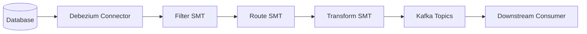
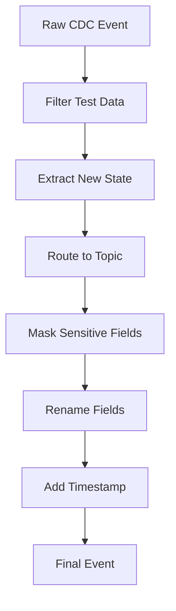

# How to Implement Debezium Transformations

Author: [nawazdhandala](https://www.github.com/nawazdhandala)

Tags: Debezium, Change Data Capture, Kafka, Transformations, SMT, Data Streaming, Event-Driven

Description: Learn how to implement Debezium Single Message Transformations (SMTs) to filter, route, and modify change events before they reach downstream consumers.

---

> Change data capture produces raw database events, but downstream systems often need modified or filtered data. Debezium SMTs let you transform events in-flight without writing custom consumers. Master transformations to build cleaner data pipelines.

Raw CDC events contain more data than most consumers need. Transformations shape events for specific use cases.

---

## Overview

Debezium transformations process change events between the connector and Kafka topics. They run as part of Kafka Connect, applying modifications without additional infrastructure.



---

## Understanding SMT Basics

Single Message Transformations (SMTs) are lightweight processors that modify individual records. Each transformation performs one specific operation, and you chain multiple SMTs for complex processing.

### Transformation Order

Transformations execute in the order defined in your configuration. Each SMT receives the output of the previous one:

```properties
# connector.properties
# Transformations execute in order: filter -> route -> unwrap -> mask
transforms=filter,route,unwrap,mask
```

---

## Built-in Transformations

### Filtering Records

Use the `Filter` SMT to drop records that match specific conditions. This reduces downstream processing load:

```properties
# Filter out DELETE operations - only capture inserts and updates
transforms=filterDeletes
transforms.filterDeletes.type=io.debezium.transforms.Filter
transforms.filterDeletes.language=jsr223.groovy
transforms.filterDeletes.condition=value.op == 'd'
```

Filter by table name to exclude specific tables from capture:

```properties
# Exclude audit_log table from capture
transforms=filterAudit
transforms.filterAudit.type=io.debezium.transforms.Filter
transforms.filterAudit.language=jsr223.groovy
transforms.filterAudit.condition=value.source.table == 'audit_log'
```

### Content-Based Filtering

Filter based on field values to route only relevant changes:

```properties
# Only capture orders with status = 'completed'
transforms=filterCompleted
transforms.filterCompleted.type=io.debezium.transforms.Filter
transforms.filterCompleted.language=jsr223.groovy
transforms.filterCompleted.condition=value.after == null || value.after.status != 'completed'
```

---

## Event Flattening

### ExtractNewRecordState

The most common transformation. Debezium events contain before/after states and metadata. The `ExtractNewRecordState` SMT flattens this to just the current state:

```properties
# Flatten change events to just the 'after' state
transforms=unwrap
transforms.unwrap.type=io.debezium.transforms.ExtractNewRecordState

# Include operation type as a header
transforms.unwrap.add.headers=op

# Add source metadata fields
transforms.unwrap.add.fields=table,ts_ms

# Handle deletes by setting the value to null (tombstone)
transforms.unwrap.delete.handling.mode=rewrite
transforms.unwrap.drop.tombstones=false
```

Before transformation:

```json
{
  "before": null,
  "after": {
    "id": 1001,
    "name": "Product A",
    "price": 29.99
  },
  "source": {
    "table": "products",
    "ts_ms": 1706400000000
  },
  "op": "c"
}
```

After transformation:

```json
{
  "id": 1001,
  "name": "Product A",
  "price": 29.99,
  "__table": "products",
  "__ts_ms": 1706400000000
}
```

---

## Topic Routing

### Route by Table

Route different tables to different topics using `TopicRouter`:

```properties
# Route by table name
transforms=route
transforms.route.type=org.apache.kafka.connect.transforms.RegexRouter
transforms.route.regex=(.*)
transforms.route.replacement=cdc-$1
```

### Content-Based Routing

Route events to different topics based on content:

```properties
# Route by event content using ByLogicalTableRouter
transforms=route
transforms.route.type=io.debezium.transforms.ByLogicalTableRouter

# Route key pattern
transforms.route.topic.regex=(.*)customers(.*)
transforms.route.topic.replacement=$1customers-$2

# Add key field to prevent collisions across tables
transforms.route.key.field.name=__dbz__physicalTableIdentifier
transforms.route.key.field.regex=(.*)
transforms.route.key.field.replacement=$1
```

---

## Field Transformations

### Masking Sensitive Data

Mask sensitive fields before they leave the connector:

```properties
# Mask credit card and SSN fields
transforms=maskFields
transforms.maskFields.type=org.apache.kafka.connect.transforms.MaskField$Value
transforms.maskFields.fields=credit_card,ssn,password
transforms.maskFields.replacement=****MASKED****
```

### Renaming Fields

Rename fields to match downstream schema expectations:

```properties
# Rename fields for downstream compatibility
transforms=renameFields
transforms.renameFields.type=org.apache.kafka.connect.transforms.ReplaceField$Value

# Rename specific fields
transforms.renameFields.renames=created_at:createdAt,updated_at:updatedAt,user_id:userId
```

### Dropping Fields

Remove unnecessary fields to reduce message size:

```properties
# Drop internal fields not needed downstream
transforms=dropFields
transforms.dropFields.type=org.apache.kafka.connect.transforms.ReplaceField$Value
transforms.dropFields.exclude=internal_id,audit_timestamp,row_version
```

---

## Timestamp Transformations

### Converting Timestamps

Convert database timestamps to different formats:

```properties
# Convert timestamp fields to Unix epoch milliseconds
transforms=convertTimestamps
transforms.convertTimestamps.type=org.apache.kafka.connect.transforms.TimestampConverter$Value
transforms.convertTimestamps.target.type=unix
transforms.convertTimestamps.field=created_at
transforms.convertTimestamps.format=yyyy-MM-dd HH:mm:ss
```

### Adding Timestamps

Add processing timestamps to track when events were captured:

```properties
# Insert current timestamp as processing time
transforms=insertTimestamp
transforms.insertTimestamp.type=org.apache.kafka.connect.transforms.InsertField$Value
transforms.insertTimestamp.timestamp.field=processed_at
```

---

## Custom Transformations

When built-in SMTs are not sufficient, create custom transformations. Here is a Java example:

```java
// CustomTransformation.java
package com.example.transforms;

import org.apache.kafka.common.config.ConfigDef;
import org.apache.kafka.connect.connector.ConnectRecord;
import org.apache.kafka.connect.transforms.Transformation;
import org.apache.kafka.connect.data.Schema;
import org.apache.kafka.connect.data.SchemaBuilder;
import org.apache.kafka.connect.data.Struct;

import java.util.Map;

public class CustomTransformation<R extends ConnectRecord<R>>
    implements Transformation<R> {

    private String fieldName;
    private String prefix;

    @Override
    public void configure(Map<String, ?> configs) {
        // Read configuration from connector properties
        this.fieldName = (String) configs.get("field.name");
        this.prefix = (String) configs.getOrDefault("prefix", "");
    }

    @Override
    public R apply(R record) {
        // Skip records without values (tombstones)
        if (record.value() == null) {
            return record;
        }

        Struct value = (Struct) record.value();
        Schema schema = value.schema();

        // Build new schema with additional field
        SchemaBuilder newSchemaBuilder = SchemaBuilder.struct();
        schema.fields().forEach(field ->
            newSchemaBuilder.field(field.name(), field.schema())
        );
        newSchemaBuilder.field("custom_field", Schema.STRING_SCHEMA);
        Schema newSchema = newSchemaBuilder.build();

        // Copy existing fields and add new one
        Struct newValue = new Struct(newSchema);
        schema.fields().forEach(field ->
            newValue.put(field.name(), value.get(field))
        );

        // Add custom computed field
        String originalValue = value.getString(fieldName);
        newValue.put("custom_field", prefix + originalValue);

        return record.newRecord(
            record.topic(),
            record.kafkaPartition(),
            record.keySchema(),
            record.key(),
            newSchema,
            newValue,
            record.timestamp()
        );
    }

    @Override
    public ConfigDef config() {
        return new ConfigDef()
            .define("field.name", ConfigDef.Type.STRING,
                ConfigDef.Importance.HIGH, "Source field name")
            .define("prefix", ConfigDef.Type.STRING, "",
                ConfigDef.Importance.LOW, "Prefix to add");
    }

    @Override
    public void close() {
        // Cleanup resources if needed
    }
}
```

Deploy the custom transformation:

```bash
# Package your transformation as a JAR
mvn clean package

# Copy to Kafka Connect plugins directory
cp target/custom-transforms-1.0.jar /kafka/connect/plugins/
```

Configure the custom transformation:

```properties
# Use custom transformation
transforms=custom
transforms.custom.type=com.example.transforms.CustomTransformation
transforms.custom.field.name=order_id
transforms.custom.prefix=ORD-
```

---

## Chaining Transformations

Combine multiple transformations for complex processing pipelines:

```properties
# Complete transformation chain
transforms=filter,unwrap,route,mask,rename,timestamp

# 1. Filter out test data
transforms.filter.type=io.debezium.transforms.Filter
transforms.filter.language=jsr223.groovy
transforms.filter.condition=value.after != null && value.after.environment == 'test'

# 2. Flatten to new record state
transforms.unwrap.type=io.debezium.transforms.ExtractNewRecordState
transforms.unwrap.add.fields=table,ts_ms,op
transforms.unwrap.delete.handling.mode=rewrite

# 3. Route to environment-specific topics
transforms.route.type=org.apache.kafka.connect.transforms.RegexRouter
transforms.route.regex=(.*)
transforms.route.replacement=prod-cdc-$1

# 4. Mask sensitive fields
transforms.mask.type=org.apache.kafka.connect.transforms.MaskField$Value
transforms.mask.fields=email,phone,ssn
transforms.mask.replacement=***REDACTED***

# 5. Rename for downstream compatibility
transforms.rename.type=org.apache.kafka.connect.transforms.ReplaceField$Value
transforms.rename.renames=created_at:createdAt,updated_at:updatedAt

# 6. Add processing timestamp
transforms.timestamp.type=org.apache.kafka.connect.transforms.InsertField$Value
transforms.timestamp.timestamp.field=processedAt
```



---

## Predicate-Based Transformations

Apply transformations conditionally using predicates:

```properties
# Define predicates
predicates=isInsert,isDelete,isCustomerTable

predicates.isInsert.type=org.apache.kafka.connect.transforms.predicates.RecordIsTombstone
predicates.isInsert.negate=true

predicates.isDelete.type=org.apache.kafka.connect.transforms.predicates.RecordIsTombstone

predicates.isCustomerTable.type=org.apache.kafka.connect.transforms.predicates.TopicNameMatches
predicates.isCustomerTable.pattern=.*customers.*

# Apply transformation only to customer table inserts
transforms=maskCustomerData
transforms.maskCustomerData.type=org.apache.kafka.connect.transforms.MaskField$Value
transforms.maskCustomerData.fields=email,phone
transforms.maskCustomerData.predicate=isCustomerTable
```

---

## Performance Considerations

### Transformation Overhead

Each SMT adds processing overhead. Measure impact and optimize:

```properties
# Monitor transformation metrics
# Check these JMX metrics:
# - kafka.connect:type=connector-task-metrics,connector=*,task=*
# - transform-time-total
# - transform-time-avg
```

### Best Practices

1. **Order matters** - put filtering transforms first to reduce downstream work
2. **Avoid complex Groovy** - simple expressions perform better than complex scripts
3. **Test thoroughly** - transformations can silently drop or corrupt data
4. **Monitor latency** - track end-to-end latency to detect transformation bottlenecks

```properties
# Optimized transformation order
# Filter first, then transform, then route
transforms=filterFirst,transform,routeLast

# Filter drops unwanted records early
transforms.filterFirst.type=io.debezium.transforms.Filter
transforms.filterFirst.language=jsr223.groovy
transforms.filterFirst.condition=value.source.table == 'temp_data'
```

---

## Testing Transformations

Test transformations before deploying to production:

```java
// TransformationTest.java
import org.apache.kafka.connect.source.SourceRecord;
import org.junit.jupiter.api.Test;
import io.debezium.transforms.ExtractNewRecordState;
import java.util.HashMap;
import java.util.Map;

import static org.junit.jupiter.api.Assertions.*;

public class TransformationTest {

    @Test
    public void testExtractNewRecordState() {
        // Configure transformation
        ExtractNewRecordState<SourceRecord> transform =
            new ExtractNewRecordState<>();

        Map<String, Object> config = new HashMap<>();
        config.put("add.fields", "table,ts_ms");
        config.put("delete.handling.mode", "rewrite");
        transform.configure(config);

        // Create test record
        SourceRecord input = createTestRecord();

        // Apply transformation
        SourceRecord output = transform.apply(input);

        // Verify output
        assertNotNull(output);
        assertNotNull(output.value());

        transform.close();
    }

    private SourceRecord createTestRecord() {
        // Build test Debezium change event
        // Implementation details omitted for brevity
        return null;
    }
}
```

---

## Debugging Transformations

Enable detailed logging to troubleshoot transformation issues:

```properties
# log4j.properties
log4j.logger.org.apache.kafka.connect.transforms=DEBUG
log4j.logger.io.debezium.transforms=DEBUG
```

Check connector status for transformation errors:

```bash
# Check connector status
curl -s http://localhost:8083/connectors/my-connector/status | jq .

# View connector logs for transformation errors
docker logs kafka-connect 2>&1 | grep -i "transform"
```

---

## Conclusion

Debezium transformations provide powerful in-flight event processing without additional infrastructure. Key takeaways:

- **Filter early** to reduce downstream processing
- **ExtractNewRecordState** simplifies event structure for most consumers
- **Chain transformations** for complex processing pipelines
- **Monitor performance** as each SMT adds overhead
- **Test thoroughly** before deploying to production

---

*Building CDC pipelines with Debezium? [OneUptime](https://oneuptime.com) provides monitoring for your Kafka Connect clusters and transformation performance metrics.*
