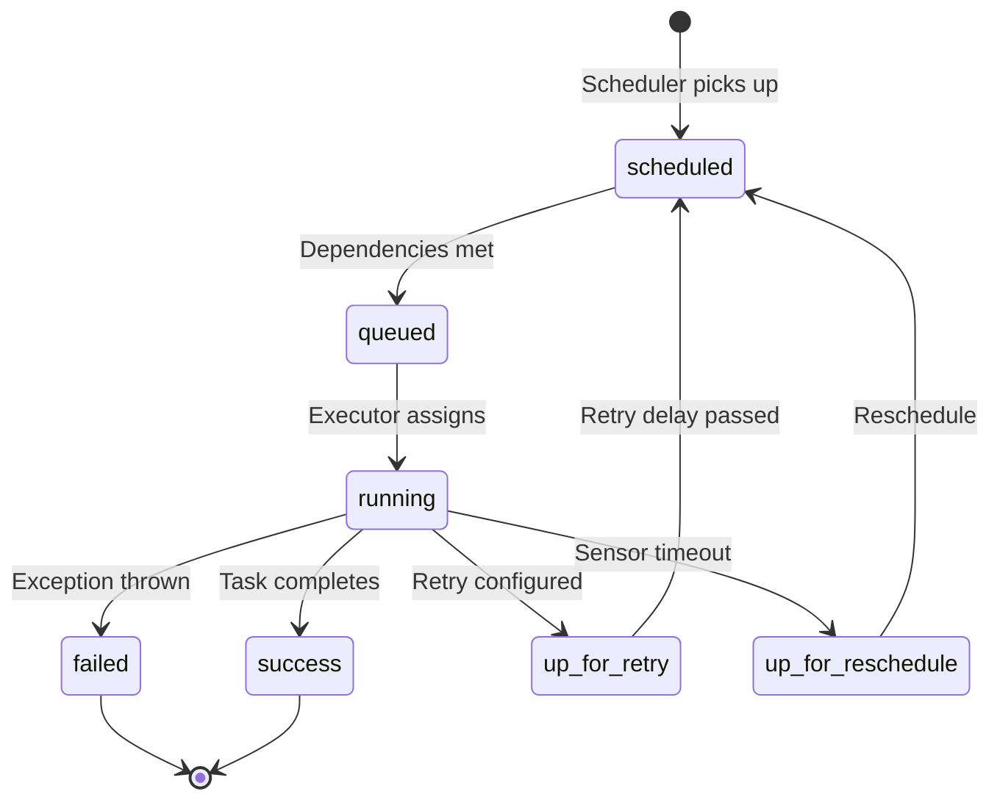
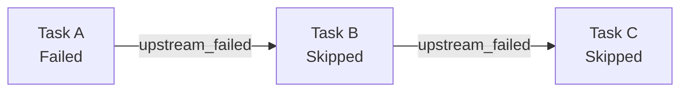
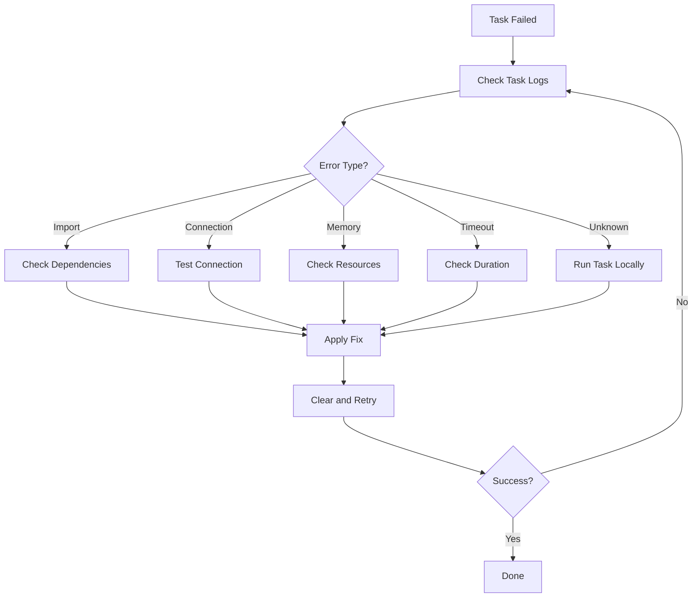

# How to Debug Airflow Task Failures

Author: [nawazdhandala](https://www.github.com/nawazdhandala)

Tags: Apache Airflow, Data Engineering, Debugging, Troubleshooting, Python, Observability

Description: A practical guide to debugging Apache Airflow task failures, covering log analysis, common error patterns, and systematic troubleshooting techniques.

---

Task failures are inevitable in data pipelines. The difference between a junior and senior data engineer is how quickly they can diagnose and fix the problem. This guide covers systematic approaches to debugging Airflow task failures.

## Understanding Task States

Before debugging, understand what each task state means:



| State | Meaning |
|-------|---------|
| scheduled | Waiting for dependencies |
| queued | Ready, waiting for executor slot |
| running | Currently executing |
| success | Completed successfully |
| failed | Exception occurred, no retries left |
| up_for_retry | Failed, will retry |
| skipped | Upstream failed or branching |
| upstream_failed | Dependency failed |

## First Steps: Finding the Logs

### Web UI Logs

The fastest way to see logs:

1. Open Airflow UI
2. Click on the DAG
3. Click on the failed task instance (red square)
4. Click "Log" button

### CLI Log Access

```bash
# View logs for specific task instance
airflow tasks logs my_dag my_task 2024-01-15T00:00:00+00:00

# Follow logs in real-time
airflow tasks logs -f my_dag my_task 2024-01-15T00:00:00+00:00

# Get logs from a specific try number
airflow tasks logs my_dag my_task 2024-01-15T00:00:00+00:00 --try-number 2
```

### Log File Locations

```bash
# Default log structure
$AIRFLOW_HOME/logs/dag_id/task_id/execution_date/try_number.log

# Example
/opt/airflow/logs/etl_pipeline/extract_data/2024-01-15T00:00:00+00:00/1.log

# With remote logging (S3)
s3://airflow-logs/dag_id/task_id/execution_date/try_number.log
```

## Common Failure Patterns

### Pattern 1: Import Errors

Symptom: Task fails immediately with ImportError.

```python
# Error in logs:
# ModuleNotFoundError: No module named 'pandas'
```

Debug steps:

```bash
# Check if package is installed in worker environment
airflow tasks test my_dag my_task 2024-01-15 --env-vars '{"PYTHONPATH": "/custom/path"}'

# Verify package version
pip show pandas

# Check if running in correct virtual environment
which python
pip list | grep pandas
```

Fix:

```python
# Add to requirements.txt or Dockerfile
pandas==2.0.0

# Or use PythonVirtualenvOperator for isolation
from airflow.operators.python import PythonVirtualenvOperator

task = PythonVirtualenvOperator(
    task_id='isolated_task',
    python_callable=my_function,
    requirements=['pandas==2.0.0', 'numpy'],
)
```

### Pattern 2: Connection Failures

Symptom: Task fails with connection timeout or authentication errors.

```python
# Error in logs:
# sqlalchemy.exc.OperationalError: could not connect to server: Connection refused
```

Debug steps:

```bash
# Test connection from Airflow
airflow connections test my_postgres_conn

# Check connection details
airflow connections get my_postgres_conn -o json

# Verify network connectivity from worker
kubectl exec -it airflow-worker-0 -- nc -zv postgres-host 5432
```

Fix:

```python
from airflow.hooks.base import BaseHook

def debug_connection(**context):
    conn = BaseHook.get_connection('my_postgres_conn')
    print(f"Host: {conn.host}")
    print(f"Port: {conn.port}")
    print(f"Schema: {conn.schema}")
    # Don't print password in production!

    # Test actual connection
    from airflow.providers.postgres.hooks.postgres import PostgresHook
    hook = PostgresHook(postgres_conn_id='my_postgres_conn')
    hook.test_connection()
```

### Pattern 3: Memory Errors

Symptom: Task killed with OOMKilled or MemoryError.

```python
# Error in logs:
# MemoryError: Unable to allocate 4.00 GiB for an array
# Or task just disappears (OOMKilled by OS)
```

Debug steps:

```bash
# Check memory usage during task run
kubectl top pods -n airflow

# Check if task was OOMKilled
kubectl describe pod airflow-worker-xxx | grep -A5 "Last State"

# Check Airflow worker logs for killed processes
dmesg | grep -i "killed process"
```

Fix:

```python
# Process data in chunks instead of loading all at once
def memory_efficient_processing(**context):
    import pandas as pd

    # BAD: Loads everything into memory
    # df = pd.read_csv('huge_file.csv')

    # GOOD: Process in chunks
    chunk_size = 10000
    for chunk in pd.read_csv('huge_file.csv', chunksize=chunk_size):
        process_chunk(chunk)

# Or increase resources for KubernetesExecutor
task = PythonOperator(
    task_id='memory_heavy',
    python_callable=heavy_processing,
    executor_config={
        "pod_override": {
            "spec": {
                "containers": [{
                    "name": "base",
                    "resources": {
                        "requests": {"memory": "4Gi"},
                        "limits": {"memory": "8Gi"}
                    }
                }]
            }
        }
    }
)
```

### Pattern 4: Timeout Errors

Symptom: Task fails with AirflowTaskTimeout.

```python
# Error in logs:
# airflow.exceptions.AirflowTaskTimeout: Timeout, waited 3600 seconds
```

Debug steps:

```bash
# Check task duration history
airflow tasks states-for-dag-run my_dag 2024-01-15T00:00:00+00:00

# Look for patterns in slow runs
SELECT task_id, duration, state
FROM task_instance
WHERE dag_id = 'my_dag'
ORDER BY duration DESC
LIMIT 20;
```

Fix:

```python
from datetime import timedelta

# Increase timeout
task = PythonOperator(
    task_id='slow_task',
    python_callable=potentially_slow_function,
    execution_timeout=timedelta(hours=2),  # Increase from default
)

# Or fix the underlying slowness
def optimized_function(**context):
    # Add indexes to queries
    # Use connection pooling
    # Cache intermediate results
    pass
```

### Pattern 5: Dependency Failures

Symptom: Task shows upstream_failed state.



Debug steps:

```bash
# Find the root cause - the first failed task
airflow tasks states-for-dag-run my_dag 2024-01-15T00:00:00+00:00 | grep failed

# Check task instance details
airflow tasks state my_dag failed_task 2024-01-15T00:00:00+00:00
```

### Pattern 6: Sensor Timeouts

Symptom: Sensor task fails with timeout after long wait.

```python
# Error in logs:
# airflow.exceptions.AirflowSensorTimeout: Snap. Time is OUT.
```

Debug:

```python
from airflow.sensors.filesystem import FileSensor

# Check what the sensor is waiting for
sensor = FileSensor(
    task_id='wait_for_file',
    filepath='/data/input/daily_{{ ds }}.csv',
    poke_interval=60,
    timeout=3600,
    mode='reschedule'  # Don't hold worker slot
)

# Debug: Manually check if condition is met
def debug_sensor(**context):
    filepath = f"/data/input/daily_{context['ds']}.csv"
    import os
    if os.path.exists(filepath):
        print(f"File exists: {filepath}")
    else:
        print(f"File missing: {filepath}")
        # List what files DO exist
        directory = os.path.dirname(filepath)
        print(f"Files in {directory}: {os.listdir(directory)}")
```

## Systematic Debugging Workflow



### Step 1: Reproduce Locally

```bash
# Test task execution locally
airflow tasks test my_dag my_task 2024-01-15

# With verbose output
airflow tasks test my_dag my_task 2024-01-15 --verbose

# Render templates to see actual values
airflow tasks render my_dag my_task 2024-01-15
```

### Step 2: Check Task Instance Details

```python
# Query task instance metadata
from airflow.models import TaskInstance
from airflow.utils.session import provide_session

@provide_session
def get_task_details(dag_id, task_id, execution_date, session=None):
    ti = session.query(TaskInstance).filter(
        TaskInstance.dag_id == dag_id,
        TaskInstance.task_id == task_id,
        TaskInstance.execution_date == execution_date
    ).first()

    print(f"State: {ti.state}")
    print(f"Try Number: {ti.try_number}")
    print(f"Start Date: {ti.start_date}")
    print(f"End Date: {ti.end_date}")
    print(f"Duration: {ti.duration}")
    print(f"Hostname: {ti.hostname}")
    print(f"Operator: {ti.operator}")
```

### Step 3: Check Scheduler and Executor Logs

```bash
# Scheduler logs
kubectl logs -n airflow deployment/airflow-scheduler --tail=500

# Worker logs (CeleryExecutor)
kubectl logs -n airflow deployment/airflow-worker --tail=500

# Specific pod logs (KubernetesExecutor)
kubectl logs -n airflow pod/my-dag-my-task-xxxxx
```

### Step 4: Database Investigation

```sql
-- Recent failed tasks
SELECT dag_id, task_id, execution_date, state, try_number, start_date, end_date
FROM task_instance
WHERE state = 'failed'
ORDER BY start_date DESC
LIMIT 20;

-- Task duration trends
SELECT task_id,
       AVG(duration) as avg_duration,
       MAX(duration) as max_duration,
       COUNT(*) as run_count
FROM task_instance
WHERE dag_id = 'my_dag'
  AND state = 'success'
GROUP BY task_id;

-- Find zombie tasks (running but worker dead)
SELECT * FROM task_instance
WHERE state = 'running'
  AND start_date < NOW() - INTERVAL '2 hours';
```

## Adding Debug Logging

### Structured Logging in Tasks

```python
import logging
from airflow.operators.python import PythonOperator

def task_with_logging(**context):
    logger = logging.getLogger('airflow.task')

    # Add context to all log messages
    logger.info("Starting task", extra={
        'dag_id': context['dag'].dag_id,
        'task_id': context['task'].task_id,
        'execution_date': str(context['execution_date'])
    })

    try:
        # Your logic here
        result = process_data()
        logger.info(f"Processed {len(result)} records")

    except Exception as e:
        logger.error(f"Task failed: {e}", exc_info=True)
        raise
```

### Custom Log Handlers

```python
# airflow.cfg
[logging]
remote_logging = True
remote_log_conn_id = my_s3_conn
remote_base_log_folder = s3://my-bucket/airflow-logs
encrypt_s3_logs = False

# Additional JSON logging for better parsing
colored_console_log = False
log_format = {"time": "%(asctime)s", "level": "%(levelname)s", "message": "%(message)s", "task": "%(task_id)s"}
```

## Retry and Recovery

### Configuring Retries

```python
from datetime import timedelta

default_args = {
    'retries': 3,
    'retry_delay': timedelta(minutes=5),
    'retry_exponential_backoff': True,
    'max_retry_delay': timedelta(hours=1),
}

# Per-task override
task = PythonOperator(
    task_id='flaky_api_call',
    python_callable=call_external_api,
    retries=5,  # More retries for flaky external dependency
    retry_delay=timedelta(seconds=30),
)
```

### Clearing Failed Tasks

```bash
# Clear single task instance
airflow tasks clear my_dag -t my_task -s 2024-01-15 -e 2024-01-15

# Clear and downstream
airflow tasks clear my_dag -t my_task -s 2024-01-15 -e 2024-01-15 --downstream

# Clear entire DAG run
airflow dags clear my_dag -s 2024-01-15 -e 2024-01-15

# Dry run first
airflow tasks clear my_dag -t my_task -s 2024-01-15 -e 2024-01-15 --dry-run
```

### Failure Callbacks

```python
def task_failure_callback(context):
    """Called when task fails"""
    dag_id = context['dag'].dag_id
    task_id = context['task'].task_id
    execution_date = context['execution_date']
    exception = context.get('exception')

    # Send alert
    send_slack_alert(
        f"Task {dag_id}.{task_id} failed on {execution_date}\n"
        f"Error: {exception}"
    )

    # Log additional debug info
    print(f"Task Instance: {context['task_instance']}")
    print(f"Try Number: {context['task_instance'].try_number}")

task = PythonOperator(
    task_id='important_task',
    python_callable=important_function,
    on_failure_callback=task_failure_callback,
)
```

## Debugging Tools

### Airflow CLI Commands

```bash
# List DAG runs and their states
airflow dags list-runs -d my_dag

# Show task state
airflow tasks state my_dag my_task 2024-01-15T00:00:00+00:00

# Test task without affecting database
airflow tasks test my_dag my_task 2024-01-15

# See rendered templates
airflow tasks render my_dag my_task 2024-01-15

# Check DAG parse time
airflow dags report
```

### Debugging Script

```python
#!/usr/bin/env python
"""Debug script for Airflow task failures"""

import sys
from datetime import datetime
from airflow.models import DagBag, TaskInstance
from airflow.utils.session import create_session

def debug_task(dag_id, task_id, execution_date_str):
    execution_date = datetime.fromisoformat(execution_date_str)

    # Load DAG
    dagbag = DagBag()
    if dag_id not in dagbag.dags:
        print(f"DAG {dag_id} not found")
        print(f"Import errors: {dagbag.import_errors}")
        return

    dag = dagbag.dags[dag_id]
    task = dag.get_task(task_id)

    print(f"=== Task Details ===")
    print(f"Task ID: {task.task_id}")
    print(f"Operator: {task.__class__.__name__}")
    print(f"Retries: {task.retries}")
    print(f"Pool: {task.pool}")

    # Get task instance from DB
    with create_session() as session:
        ti = session.query(TaskInstance).filter(
            TaskInstance.dag_id == dag_id,
            TaskInstance.task_id == task_id,
            TaskInstance.execution_date == execution_date
        ).first()

        if ti:
            print(f"\n=== Task Instance ===")
            print(f"State: {ti.state}")
            print(f"Try Number: {ti.try_number}")
            print(f"Hostname: {ti.hostname}")
            print(f"Start: {ti.start_date}")
            print(f"End: {ti.end_date}")
            print(f"Duration: {ti.duration}s")

            # Render templates
            print(f"\n=== Rendered Templates ===")
            ti.render_templates()
            for attr in ['bash_command', 'sql', 'python_callable']:
                if hasattr(task, attr):
                    print(f"{attr}: {getattr(task, attr)}")

if __name__ == '__main__':
    debug_task(sys.argv[1], sys.argv[2], sys.argv[3])
```

---

Debugging Airflow task failures is a systematic process. Start with the logs, identify the error pattern, reproduce locally, and apply targeted fixes. Build observability into your DAGs from the start with structured logging and failure callbacks. The faster you can diagnose failures, the more reliable your data pipelines become.
