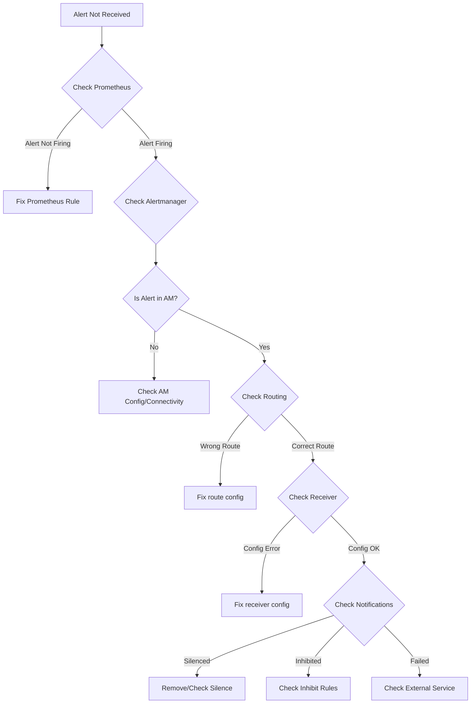
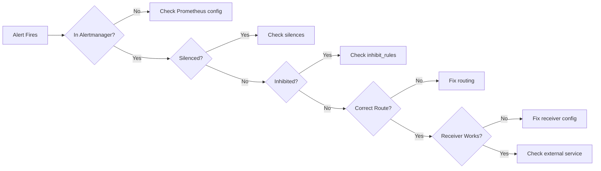

# How to Debug Alertmanager Issues

Author: [nawazdhandala](https://www.github.com/nawazdhandala)

Tags: Alertmanager, Prometheus, Debugging, Troubleshooting, DevOps

Description: Learn how to diagnose and fix common Alertmanager problems including missing alerts, notification failures, and cluster synchronization issues.

---

When alerts stop working, every minute counts. Engineers rely on Alertmanager to notify them about production issues, and when it fails silently, incidents go undetected. This guide covers systematic approaches to debug the most common Alertmanager problems, from configuration errors to cluster communication failures.

## Debugging Workflow Overview



## 1. Verify Prometheus is Sending Alerts

Before debugging Alertmanager, confirm that Prometheus is actually firing alerts:

```bash
# Check the Prometheus alerts API
curl -s http://prometheus:9090/api/v1/alerts | jq '.data.alerts[] | select(.state=="firing")'

# Check if Prometheus can reach Alertmanager
curl -s http://prometheus:9090/api/v1/alertmanagers | jq '.data.activeAlertmanagers'
```

If Prometheus shows no active Alertmanagers, check your Prometheus configuration:

```yaml
# Verify alerting configuration in prometheus.yml
alerting:
  alertmanagers:
    - static_configs:
        - targets:
            - 'alertmanager:9093'
      # Check timeout isn't too short
      timeout: 10s
```

Check Prometheus logs for connection errors:

```bash
# Look for Alertmanager communication errors
kubectl logs deployment/prometheus -n monitoring | grep -i alertmanager

# Or on bare metal
journalctl -u prometheus | grep -i alertmanager
```

## 2. Check if Alerts Reach Alertmanager

Query Alertmanager's API to see what alerts it has received:

```bash
# List all alerts in Alertmanager
curl -s http://alertmanager:9093/api/v2/alerts | jq

# Count alerts by state
curl -s http://alertmanager:9093/api/v2/alerts | jq 'group_by(.status.state) | map({state: .[0].status.state, count: length})'

# Search for a specific alert by name
curl -s http://alertmanager:9093/api/v2/alerts | jq '.[] | select(.labels.alertname=="HighCPU")'
```

If alerts aren't appearing, check Alertmanager is receiving them:

```bash
# Check metrics for received alerts
curl -s http://alertmanager:9093/metrics | grep alertmanager_alerts_received

# Look for invalid alerts that were rejected
curl -s http://alertmanager:9093/metrics | grep alertmanager_alerts_invalid
```

## 3. Debug Configuration Issues

Validate your configuration file before deploying:

```bash
# Check configuration syntax
amtool check-config alertmanager.yml

# Output on success:
# Checking 'alertmanager.yml'  SUCCESS
# Found:
#  - global config
#  - route
#  - 3 inhibit rules
#  - 4 receivers
#  - 0 templates
```

Test routing without sending actual alerts:

```bash
# See which receiver an alert would route to
amtool config routes test --config.file=alertmanager.yml \
  alertname=HighCPU severity=critical cluster=production

# Output shows the matched route:
# Routing tree:
# |- default-receiver
#    |- critical-alerts  <-- Matched
```

Common configuration mistakes:

```yaml
# WRONG: Using single quotes in YAML can break environment variables
receivers:
  - name: slack
    slack_configs:
      - api_url: '${SLACK_WEBHOOK}'  # Won't expand!

# CORRECT: Use double quotes or no quotes
receivers:
  - name: slack
    slack_configs:
      - api_url: "${SLACK_WEBHOOK}"  # Will expand correctly
```

## 4. Debug Notification Failures

Check if notifications are being sent but failing:

```bash
# Look for notification failures in metrics
curl -s http://alertmanager:9093/metrics | grep alertmanager_notifications_failed

# Get failure rate by integration type
curl -s http://alertmanager:9093/metrics | grep alertmanager_notifications_failed_total
```

Enable debug logging to see notification details:

```bash
# Start Alertmanager with debug logging
alertmanager --config.file=/etc/alertmanager/alertmanager.yml \
  --log.level=debug

# Look for notification-related log entries
# On Kubernetes:
kubectl logs deployment/alertmanager -n monitoring | grep -i "notify\|send\|webhook"
```

Test notifications manually using amtool:

```bash
# Send a test alert to verify the entire pipeline
amtool alert add alertname=TestAlert severity=critical \
  --alertmanager.url=http://alertmanager:9093 \
  --annotation=summary="Test alert from amtool"

# Check it arrived
amtool alert --alertmanager.url=http://alertmanager:9093
```

## 5. Debug Silences and Inhibitions

Alerts might be silenced or inhibited, preventing notifications:

```bash
# List all active silences
curl -s http://alertmanager:9093/api/v2/silences | jq '.[] | select(.status.state=="active")'

# Or use amtool
amtool silence query --alertmanager.url=http://alertmanager:9093

# Check if a specific alert is silenced
curl -s http://alertmanager:9093/api/v2/alerts | jq '.[] | select(.status.silencedBy | length > 0)'

# Check if alerts are inhibited
curl -s http://alertmanager:9093/api/v2/alerts | jq '.[] | select(.status.inhibitedBy | length > 0)'
```

To understand why an alert is inhibited, check your inhibit rules:

```yaml
# Example: This might unexpectedly inhibit alerts
inhibit_rules:
  - source_match:
      severity: 'critical'
    target_match:
      severity: 'warning'
    equal: ['alertname']  # Inhibits if alertname matches
```

Debug by temporarily disabling inhibit rules:

```bash
# Remove inhibit_rules from config and reload
curl -X POST http://alertmanager:9093/-/reload
```

## 6. Debug Cluster Issues

For clustered Alertmanager, synchronization problems can cause duplicate or missing notifications:

```bash
# Check cluster status
curl -s http://alertmanager:9093/api/v2/status | jq '.cluster'

# Verify all peers are connected
curl -s http://alertmanager:9093/api/v2/status | jq '.cluster.peers | length'

# Check cluster metrics for failures
curl -s http://alertmanager:9093/metrics | grep alertmanager_cluster
```

Common cluster problems:

```bash
# Check network connectivity between peers
# Run from each Alertmanager pod/host
nc -zv alertmanager-1:9094  # Cluster port

# Check for gossip message failures
curl -s http://alertmanager:9093/metrics | grep alertmanager_cluster_messages_publish_failures

# Verify cluster advertise addresses are reachable
curl -s http://alertmanager:9093/api/v2/status | jq '.cluster.peers[].address'
```

If peers can't communicate, check firewall rules and DNS:

```bash
# On Kubernetes, verify the headless service resolves correctly
kubectl run -it --rm debug --image=busybox --restart=Never -- \
  nslookup alertmanager-cluster.monitoring.svc.cluster.local
```

## 7. Debug Webhook and External Receivers

When webhook notifications fail, test the endpoint directly:

```bash
# Test webhook endpoint with a sample payload
curl -X POST https://your-webhook-endpoint.com/alerts \
  -H "Content-Type: application/json" \
  -d '{
    "receiver": "webhook-test",
    "status": "firing",
    "alerts": [{
      "status": "firing",
      "labels": {"alertname": "TestAlert"},
      "annotations": {"summary": "Test"}
    }]
  }'

# Check for SSL/TLS issues
curl -v https://your-webhook-endpoint.com/health
```

For Slack issues:

```bash
# Test Slack webhook directly
curl -X POST https://hooks.slack.com/services/YOUR/WEBHOOK/URL \
  -H "Content-Type: application/json" \
  -d '{"text": "Test message from Alertmanager debug"}'
```

For PagerDuty issues:

```bash
# Verify service key is valid
curl -X POST https://events.pagerduty.com/v2/enqueue \
  -H "Content-Type: application/json" \
  -d '{
    "routing_key": "YOUR_SERVICE_KEY",
    "event_action": "trigger",
    "payload": {
      "summary": "Test from Alertmanager",
      "severity": "info",
      "source": "alertmanager-debug"
    }
  }'
```

## 8. Analyze Alertmanager Logs

Enable detailed logging and look for specific patterns:

```bash
# On Kubernetes
kubectl logs -f deployment/alertmanager -n monitoring | grep -E "level=error|level=warn"

# Common error patterns to search for:

# Configuration errors
grep "config" alertmanager.log | grep -i error

# Notification failures
grep "Notify" alertmanager.log | grep -i "failed\|error"

# Cluster problems
grep "cluster\|gossip\|memberlist" alertmanager.log

# Template rendering errors
grep "template" alertmanager.log | grep -i error
```

## 9. Common Problems and Solutions

### Alerts Fire but No Notification



### Duplicate Notifications

Usually caused by cluster issues or Prometheus sending to only one Alertmanager:

```bash
# Verify Prometheus is configured to send to ALL Alertmanagers
curl -s http://prometheus:9090/api/v1/alertmanagers | jq

# Check cluster deduplication is working
curl -s http://alertmanager:9093/metrics | grep alertmanager_cluster_peers
```

### Notifications Delayed

Check timing configuration:

```yaml
route:
  # These affect notification timing
  group_wait: 30s      # Wait before first notification
  group_interval: 5m   # Wait before notifying about new alerts in group
  repeat_interval: 4h  # Wait before re-notifying about same alert
```

## 10. Build a Debug Checklist

Use this systematic checklist when debugging:

```bash
#!/bin/bash
# alertmanager-debug.sh - Quick health check script

ALERTMANAGER_URL="${1:-http://alertmanager:9093}"

echo "=== Alertmanager Debug Checklist ==="

echo -e "\n1. Health check:"
curl -s "$ALERTMANAGER_URL/-/healthy" && echo " OK" || echo " FAILED"

echo -e "\n2. Ready check:"
curl -s "$ALERTMANAGER_URL/-/ready" && echo " OK" || echo " FAILED"

echo -e "\n3. Config reload status:"
curl -s "$ALERTMANAGER_URL/metrics" | grep "alertmanager_config_last_reload_successful"

echo -e "\n4. Alert count:"
curl -s "$ALERTMANAGER_URL/api/v2/alerts" | jq 'length'

echo -e "\n5. Active silences:"
curl -s "$ALERTMANAGER_URL/api/v2/silences" | jq '[.[] | select(.status.state=="active")] | length'

echo -e "\n6. Cluster status:"
curl -s "$ALERTMANAGER_URL/api/v2/status" | jq '.cluster.peers | length'

echo -e "\n7. Notification failures (last hour):"
curl -s "$ALERTMANAGER_URL/metrics" | grep "alertmanager_notifications_failed_total"

echo -e "\n8. Invalid alerts received:"
curl -s "$ALERTMANAGER_URL/metrics" | grep "alertmanager_alerts_invalid_total"
```

---

Debugging Alertmanager requires a systematic approach: verify alerts are firing in Prometheus, confirm they reach Alertmanager, check routing configuration, validate silences and inhibitions, and test the notification receivers. Enable debug logging when needed, use amtool for configuration validation, and build automated health checks to catch issues before they cause missed alerts. When your alerting pipeline fails, you want to know immediately - which means monitoring your monitoring is not optional.
