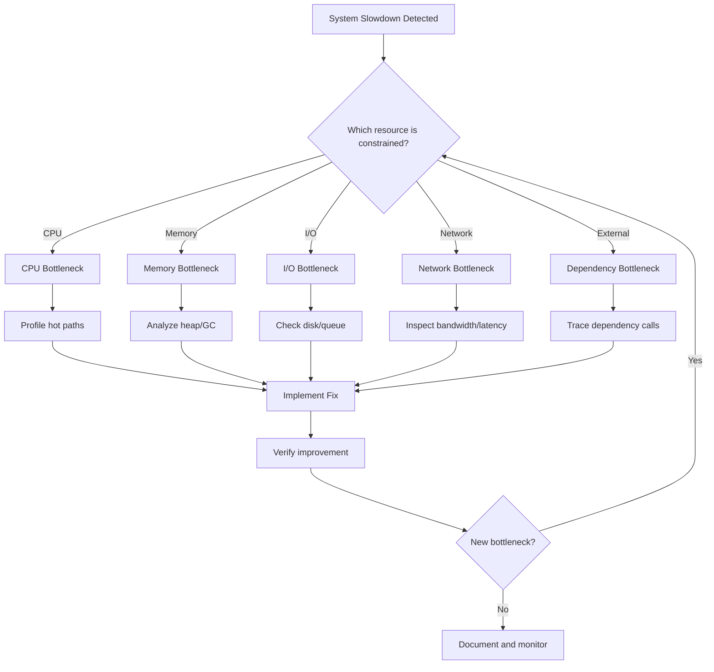
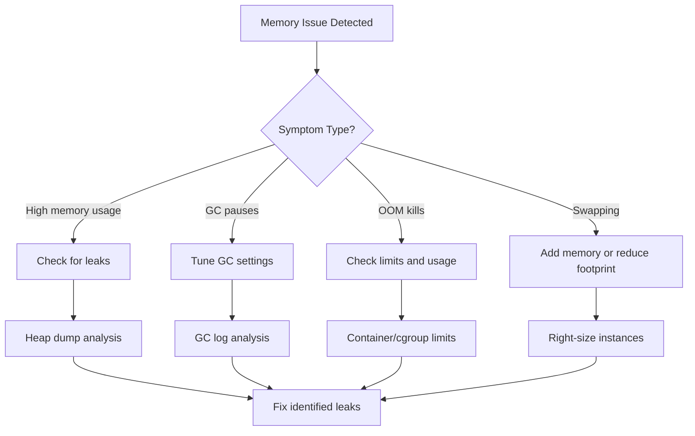
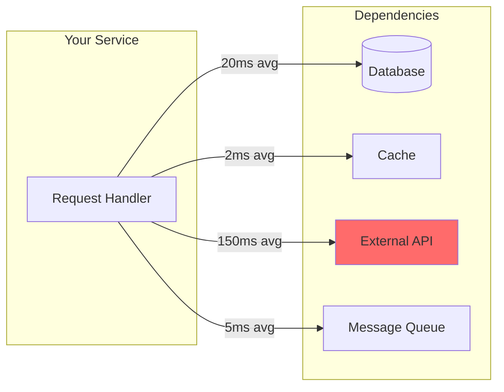

# How to Debug Capacity Bottlenecks

Author: [nawazdhandala](https://www.github.com/nawazdhandala)

Tags: Site Reliability Engineering, Capacity Planning, Performance, Debugging, Troubleshooting

Description: A systematic approach to identifying and resolving capacity bottlenecks in production systems.

---

## The Bottleneck Hunting Mindset

Capacity bottlenecks rarely announce themselves clearly. Instead, they manifest as slow responses, timeouts, or cascading failures. This guide provides a systematic methodology for tracking down the actual constraint in your system - because fixing the wrong bottleneck is worse than fixing nothing.

## The Bottleneck Identification Framework



## Step 1: Collect the Right Metrics

Before debugging, ensure you have visibility into all resource dimensions.

```python
# bottleneck_metrics.py - Collect comprehensive resource metrics
from dataclasses import dataclass
from datetime import datetime
from typing import List, Dict, Optional
from enum import Enum

class ResourceType(Enum):
    CPU = "cpu"
    MEMORY = "memory"
    DISK_IO = "disk_io"
    NETWORK_IO = "network_io"
    DATABASE = "database"
    EXTERNAL_API = "external_api"

@dataclass
class ResourceMetric:
    resource_type: ResourceType
    name: str
    current_value: float
    max_value: float
    unit: str
    timestamp: datetime

    @property
    def utilization_percent(self) -> float:
        if self.max_value == 0:
            return 0
        return (self.current_value / self.max_value) * 100

    @property
    def is_saturated(self) -> bool:
        return self.utilization_percent > 85

@dataclass
class BottleneckIndicator:
    resource_type: ResourceType
    saturation_percent: float
    latency_impact_ms: float
    confidence: float  # 0-1, how confident we are this is the bottleneck
    evidence: List[str]

class BottleneckDetector:
    """Detect and rank potential bottlenecks."""

    def __init__(self):
        self.metrics: List[ResourceMetric] = []

    def record_metric(self, metric: ResourceMetric):
        self.metrics.append(metric)

    def detect_bottlenecks(self) -> List[BottleneckIndicator]:
        """Analyze metrics and identify likely bottlenecks."""

        # Group by resource type
        by_type: Dict[ResourceType, List[ResourceMetric]] = {}
        for m in self.metrics:
            if m.resource_type not in by_type:
                by_type[m.resource_type] = []
            by_type[m.resource_type].append(m)

        indicators = []

        for resource_type, type_metrics in by_type.items():
            saturated = [m for m in type_metrics if m.is_saturated]

            if saturated:
                avg_saturation = sum(m.utilization_percent for m in saturated) / len(saturated)

                evidence = [
                    f"{m.name}: {m.utilization_percent:.1f}% utilized"
                    for m in saturated
                ]

                # Estimate latency impact based on saturation level
                if avg_saturation > 95:
                    latency_impact = 500  # Severe
                    confidence = 0.9
                elif avg_saturation > 90:
                    latency_impact = 200  # High
                    confidence = 0.8
                else:
                    latency_impact = 50  # Moderate
                    confidence = 0.6

                indicators.append(BottleneckIndicator(
                    resource_type=resource_type,
                    saturation_percent=avg_saturation,
                    latency_impact_ms=latency_impact,
                    confidence=confidence,
                    evidence=evidence,
                ))

        # Sort by confidence and saturation
        return sorted(
            indicators,
            key=lambda x: (x.confidence, x.saturation_percent),
            reverse=True
        )

    def generate_diagnostic_queries(
        self,
        bottleneck: BottleneckIndicator
    ) -> List[str]:
        """Generate diagnostic commands for a specific bottleneck type."""

        queries = {
            ResourceType.CPU: [
                "top -b -n 1 | head -20",
                "ps aux --sort=-%cpu | head -10",
                "perf top -g",  # Requires perf installed
            ],
            ResourceType.MEMORY: [
                "free -h",
                "ps aux --sort=-%mem | head -10",
                "cat /proc/meminfo | grep -E 'MemTotal|MemFree|Buffers|Cached'",
            ],
            ResourceType.DISK_IO: [
                "iostat -x 1 5",
                "iotop -b -n 3",
                "lsof +D /path/to/suspect/directory",
            ],
            ResourceType.NETWORK_IO: [
                "netstat -s | grep -E 'retransmit|overflow'",
                "ss -s",
                "iftop -t -s 5",
            ],
            ResourceType.DATABASE: [
                "SELECT * FROM pg_stat_activity WHERE state = 'active'",
                "SELECT * FROM pg_stat_user_tables ORDER BY n_live_tup DESC LIMIT 10",
                "SHOW PROCESSLIST",  # MySQL
            ],
        }

        return queries.get(bottleneck.resource_type, ["No specific queries available"])
```

## Step 2: CPU Bottleneck Debugging

CPU bottlenecks show up as high CPU utilization with increased response times.

```python
# cpu_bottleneck.py - Diagnose CPU bottlenecks
from dataclasses import dataclass
from typing import List, Dict, Optional
import subprocess
import re

@dataclass
class ProcessCPUUsage:
    pid: int
    process_name: str
    cpu_percent: float
    user_time: float
    system_time: float

@dataclass
class CPUBottleneckDiagnosis:
    overall_cpu_percent: float
    user_vs_system_ratio: float  # > 1 means user-space bound
    top_processes: List[ProcessCPUUsage]
    likely_causes: List[str]
    recommendations: List[str]

def diagnose_cpu_bottleneck() -> CPUBottleneckDiagnosis:
    """Diagnose CPU bottleneck and suggest fixes."""

    # Simulate getting CPU stats (in production, use psutil or /proc)
    # This is a simplified example
    top_processes = [
        ProcessCPUUsage(1234, "api-server", 45.0, 40.0, 5.0),
        ProcessCPUUsage(1235, "worker", 25.0, 23.0, 2.0),
        ProcessCPUUsage(1236, "postgres", 15.0, 10.0, 5.0),
    ]

    overall_cpu = sum(p.cpu_percent for p in top_processes)
    total_user = sum(p.user_time for p in top_processes)
    total_system = sum(p.system_time for p in top_processes)
    ratio = total_user / total_system if total_system > 0 else float('inf')

    # Analyze patterns
    likely_causes = []
    recommendations = []

    if ratio > 5:
        likely_causes.append("Application-level CPU usage dominates")
        recommendations.append("Profile application code for optimization opportunities")
        recommendations.append("Consider caching frequently computed results")
    elif ratio < 1:
        likely_causes.append("High system call overhead")
        recommendations.append("Check for excessive I/O operations")
        recommendations.append("Review syscall patterns with strace")

    # Check for single-process dominance
    if top_processes and top_processes[0].cpu_percent > 70:
        likely_causes.append(f"Single process ({top_processes[0].process_name}) consuming most CPU")
        recommendations.append(f"Focus optimization on {top_processes[0].process_name}")

    if overall_cpu > 85:
        recommendations.append("Consider horizontal scaling - add more instances")

    return CPUBottleneckDiagnosis(
        overall_cpu_percent=overall_cpu,
        user_vs_system_ratio=ratio,
        top_processes=top_processes,
        likely_causes=likely_causes,
        recommendations=recommendations,
    )

# Example profiling wrapper for hot path identification
def profile_function_timing(func):
    """Decorator to profile function execution time."""
    import time
    import functools

    @functools.wraps(func)
    def wrapper(*args, **kwargs):
        start = time.perf_counter()
        result = func(*args, **kwargs)
        duration = time.perf_counter() - start

        # Log slow executions
        if duration > 0.1:  # 100ms threshold
            print(f"SLOW: {func.__name__} took {duration*1000:.2f}ms")

        return result
    return wrapper

# Usage
@profile_function_timing
def expensive_computation(data):
    # Your code here
    pass
```

## Step 3: Memory Bottleneck Debugging

Memory bottlenecks cause swapping, OOM kills, and GC pauses.



```python
# memory_bottleneck.py - Diagnose memory bottlenecks
from dataclasses import dataclass
from typing import List, Optional
from enum import Enum

class MemoryIssueType(Enum):
    LEAK = "memory_leak"
    HIGH_USAGE = "high_usage"
    GC_PRESSURE = "gc_pressure"
    OOM_RISK = "oom_risk"
    SWAPPING = "swapping"

@dataclass
class MemoryDiagnosis:
    total_memory_gb: float
    used_memory_gb: float
    cache_memory_gb: float
    swap_used_gb: float
    issue_type: Optional[MemoryIssueType]
    growth_rate_mb_per_hour: float
    recommendations: List[str]

def diagnose_memory_bottleneck(
    used_gb: float,
    total_gb: float,
    cache_gb: float,
    swap_gb: float,
    historical_used: List[float],  # Hourly samples
) -> MemoryDiagnosis:
    """Diagnose memory bottleneck type and recommend fixes."""

    recommendations = []
    issue_type = None

    utilization = (used_gb / total_gb) * 100

    # Calculate growth rate
    if len(historical_used) >= 2:
        growth_rate = (historical_used[-1] - historical_used[0]) / len(historical_used) * 1024
    else:
        growth_rate = 0

    # Detect issue type
    if growth_rate > 100:  # Growing > 100MB/hour
        issue_type = MemoryIssueType.LEAK
        recommendations.append("Memory is growing over time - possible leak")
        recommendations.append("Take heap dumps at intervals to identify leaking objects")
        recommendations.append("Review recent deployments for memory regression")

    elif swap_gb > 1:
        issue_type = MemoryIssueType.SWAPPING
        recommendations.append("System is swapping - this severely impacts performance")
        recommendations.append("Increase memory or reduce workload")
        recommendations.append("Check vm.swappiness setting")

    elif utilization > 90:
        issue_type = MemoryIssueType.OOM_RISK
        recommendations.append("Memory utilization critical - OOM kill risk")
        recommendations.append("Scale up instance size immediately")
        recommendations.append("Implement memory-based autoscaling")

    elif utilization > 75:
        issue_type = MemoryIssueType.HIGH_USAGE
        recommendations.append("Memory usage elevated but stable")
        recommendations.append("Plan for capacity increase before hitting limits")

    return MemoryDiagnosis(
        total_memory_gb=total_gb,
        used_memory_gb=used_gb,
        cache_memory_gb=cache_gb,
        swap_used_gb=swap_gb,
        issue_type=issue_type,
        growth_rate_mb_per_hour=growth_rate,
        recommendations=recommendations,
    )

# JVM-specific GC analysis
@dataclass
class GCAnalysis:
    gc_pause_p99_ms: float
    gc_frequency_per_minute: float
    heap_after_gc_percent: float
    recommendations: List[str]

def analyze_gc_logs(
    pause_times_ms: List[float],
    heap_before: List[float],
    heap_after: List[float],
    interval_seconds: float,
) -> GCAnalysis:
    """Analyze GC behavior for JVM applications."""

    import statistics

    if not pause_times_ms:
        return GCAnalysis(0, 0, 0, ["No GC data available"])

    p99_pause = sorted(pause_times_ms)[int(len(pause_times_ms) * 0.99)] if pause_times_ms else 0
    gc_count = len(pause_times_ms)
    gc_per_minute = gc_count / (interval_seconds / 60) if interval_seconds > 0 else 0

    avg_after = statistics.mean(heap_after) if heap_after else 0
    avg_before = statistics.mean(heap_before) if heap_before else 0
    retention_ratio = avg_after / avg_before if avg_before > 0 else 0

    recommendations = []

    if p99_pause > 200:
        recommendations.append(f"GC pauses too long ({p99_pause:.0f}ms p99)")
        recommendations.append("Consider G1GC or ZGC for lower pause times")

    if gc_per_minute > 10:
        recommendations.append(f"GC frequency too high ({gc_per_minute:.1f}/min)")
        recommendations.append("Increase heap size to reduce GC frequency")

    if retention_ratio > 0.7:
        recommendations.append("High heap retention after GC - possible memory pressure")
        recommendations.append("Check for object retention or increase heap")

    return GCAnalysis(
        gc_pause_p99_ms=p99_pause,
        gc_frequency_per_minute=gc_per_minute,
        heap_after_gc_percent=retention_ratio * 100,
        recommendations=recommendations,
    )
```

## Step 4: I/O Bottleneck Debugging

I/O bottlenecks occur at disk or network level and often have cascading effects.

```python
# io_bottleneck.py - Diagnose I/O bottlenecks
from dataclasses import dataclass
from typing import List, Optional
from enum import Enum

class IOBottleneckType(Enum):
    DISK_THROUGHPUT = "disk_throughput"
    DISK_IOPS = "disk_iops"
    DISK_LATENCY = "disk_latency"
    NETWORK_BANDWIDTH = "network_bandwidth"
    NETWORK_LATENCY = "network_latency"
    NETWORK_CONNECTIONS = "network_connections"

@dataclass
class DiskIOMetrics:
    device: str
    read_iops: float
    write_iops: float
    read_throughput_mbps: float
    write_throughput_mbps: float
    avg_latency_ms: float
    queue_depth: float

@dataclass
class NetworkIOMetrics:
    interface: str
    rx_mbps: float
    tx_mbps: float
    connections_established: int
    connections_time_wait: int
    retransmit_percent: float

@dataclass
class IODiagnosis:
    bottleneck_type: Optional[IOBottleneckType]
    severity: str  # low, medium, high, critical
    metrics_summary: dict
    recommendations: List[str]

def diagnose_disk_io(metrics: DiskIOMetrics, max_iops: int, max_throughput_mbps: float) -> IODiagnosis:
    """Diagnose disk I/O bottlenecks."""

    recommendations = []
    bottleneck_type = None
    severity = "low"

    total_iops = metrics.read_iops + metrics.write_iops
    total_throughput = metrics.read_throughput_mbps + metrics.write_throughput_mbps

    iops_utilization = (total_iops / max_iops) * 100 if max_iops > 0 else 0
    throughput_utilization = (total_throughput / max_throughput_mbps) * 100 if max_throughput_mbps > 0 else 0

    # Check IOPS saturation
    if iops_utilization > 85:
        bottleneck_type = IOBottleneckType.DISK_IOPS
        severity = "high" if iops_utilization > 95 else "medium"
        recommendations.append(f"IOPS at {iops_utilization:.0f}% of capacity")
        recommendations.append("Consider provisioned IOPS storage or SSD upgrade")
        recommendations.append("Review query patterns for excessive random I/O")

    # Check throughput saturation
    elif throughput_utilization > 85:
        bottleneck_type = IOBottleneckType.DISK_THROUGHPUT
        severity = "high" if throughput_utilization > 95 else "medium"
        recommendations.append(f"Throughput at {throughput_utilization:.0f}% of capacity")
        recommendations.append("Consider faster storage tier")

    # Check latency
    if metrics.avg_latency_ms > 20:
        if bottleneck_type is None:
            bottleneck_type = IOBottleneckType.DISK_LATENCY
        severity = "high" if metrics.avg_latency_ms > 50 else "medium"
        recommendations.append(f"Disk latency elevated ({metrics.avg_latency_ms:.1f}ms)")
        recommendations.append("Check for queue buildup and storage health")

    # Check queue depth
    if metrics.queue_depth > 32:
        recommendations.append(f"High queue depth ({metrics.queue_depth}) indicates I/O backlog")

    return IODiagnosis(
        bottleneck_type=bottleneck_type,
        severity=severity,
        metrics_summary={
            "iops_utilization": iops_utilization,
            "throughput_utilization": throughput_utilization,
            "avg_latency_ms": metrics.avg_latency_ms,
        },
        recommendations=recommendations,
    )

def diagnose_network_io(metrics: NetworkIOMetrics, max_bandwidth_mbps: float) -> IODiagnosis:
    """Diagnose network I/O bottlenecks."""

    recommendations = []
    bottleneck_type = None
    severity = "low"

    total_bandwidth = metrics.rx_mbps + metrics.tx_mbps
    bandwidth_utilization = (total_bandwidth / max_bandwidth_mbps) * 100 if max_bandwidth_mbps > 0 else 0

    # Check bandwidth
    if bandwidth_utilization > 80:
        bottleneck_type = IOBottleneckType.NETWORK_BANDWIDTH
        severity = "high" if bandwidth_utilization > 95 else "medium"
        recommendations.append(f"Network bandwidth at {bandwidth_utilization:.0f}%")
        recommendations.append("Consider enhanced networking or bandwidth upgrade")

    # Check connection exhaustion
    if metrics.connections_time_wait > 10000:
        if bottleneck_type is None:
            bottleneck_type = IOBottleneckType.NETWORK_CONNECTIONS
        severity = "medium"
        recommendations.append(f"High TIME_WAIT connections ({metrics.connections_time_wait})")
        recommendations.append("Enable TCP reuse: net.ipv4.tcp_tw_reuse = 1")
        recommendations.append("Consider connection pooling")

    # Check retransmits
    if metrics.retransmit_percent > 1:
        recommendations.append(f"Network retransmit rate elevated ({metrics.retransmit_percent:.1f}%)")
        recommendations.append("Check for packet loss or network congestion")
        if metrics.retransmit_percent > 5:
            severity = "high"

    return IODiagnosis(
        bottleneck_type=bottleneck_type,
        severity=severity,
        metrics_summary={
            "bandwidth_utilization": bandwidth_utilization,
            "connections_time_wait": metrics.connections_time_wait,
            "retransmit_percent": metrics.retransmit_percent,
        },
        recommendations=recommendations,
    )
```

## Step 5: Dependency Bottleneck Debugging

External dependencies are often the real bottleneck.



```python
# dependency_bottleneck.py - Diagnose external dependency bottlenecks
from dataclasses import dataclass
from typing import List, Dict, Optional
from datetime import datetime, timedelta

@dataclass
class DependencyMetrics:
    name: str
    avg_latency_ms: float
    p99_latency_ms: float
    error_rate_percent: float
    calls_per_second: float
    timeout_count: int

@dataclass
class DependencyBottleneck:
    dependency_name: str
    issue_type: str  # latency, errors, timeouts
    impact_score: float  # 0-100, how much this affects overall performance
    recommendations: List[str]

class DependencyAnalyzer:
    """Analyze dependencies to find bottlenecks."""

    def __init__(self, latency_budget_ms: float = 100):
        self.latency_budget_ms = latency_budget_ms
        self.dependencies: Dict[str, List[DependencyMetrics]] = {}

    def record_metrics(self, metrics: DependencyMetrics):
        if metrics.name not in self.dependencies:
            self.dependencies[metrics.name] = []
        self.dependencies[metrics.name].append(metrics)

    def identify_bottlenecks(self) -> List[DependencyBottleneck]:
        """Identify which dependencies are causing performance issues."""

        bottlenecks = []

        for name, metrics_list in self.dependencies.items():
            if not metrics_list:
                continue

            latest = metrics_list[-1]

            # Calculate impact score
            # Latency impact = (latency / budget) * call_frequency_weight
            latency_impact = (latest.avg_latency_ms / self.latency_budget_ms) * 50
            error_impact = latest.error_rate_percent * 10
            impact_score = min(100, latency_impact + error_impact)

            recommendations = []
            issue_type = None

            # Check latency
            if latest.p99_latency_ms > self.latency_budget_ms:
                issue_type = "latency"
                recommendations.append(f"p99 latency ({latest.p99_latency_ms:.0f}ms) exceeds budget")
                recommendations.append("Add caching layer to reduce calls")
                recommendations.append("Consider async processing for non-critical paths")

            # Check errors
            if latest.error_rate_percent > 1:
                issue_type = issue_type or "errors"
                recommendations.append(f"Error rate ({latest.error_rate_percent:.1f}%) is elevated")
                recommendations.append("Implement circuit breaker pattern")
                recommendations.append("Add retry with exponential backoff")

            # Check timeouts
            if latest.timeout_count > 0:
                issue_type = issue_type or "timeouts"
                recommendations.append(f"{latest.timeout_count} timeouts detected")
                recommendations.append("Review timeout configuration")
                recommendations.append("Check dependency health and capacity")

            if issue_type:
                bottlenecks.append(DependencyBottleneck(
                    dependency_name=name,
                    issue_type=issue_type,
                    impact_score=impact_score,
                    recommendations=recommendations,
                ))

        # Sort by impact
        return sorted(bottlenecks, key=lambda x: x.impact_score, reverse=True)

    def generate_latency_breakdown(self) -> Dict[str, float]:
        """Show latency contribution of each dependency."""

        breakdown = {}
        total_latency = 0

        for name, metrics_list in self.dependencies.items():
            if metrics_list:
                avg_latency = metrics_list[-1].avg_latency_ms
                calls = metrics_list[-1].calls_per_second
                # Weight by call frequency
                weighted_latency = avg_latency * min(calls, 10) / 10
                breakdown[name] = weighted_latency
                total_latency += weighted_latency

        # Convert to percentages
        if total_latency > 0:
            return {
                name: (latency / total_latency) * 100
                for name, latency in breakdown.items()
            }
        return breakdown

# Usage example
analyzer = DependencyAnalyzer(latency_budget_ms=100)

analyzer.record_metrics(DependencyMetrics(
    name="user-database",
    avg_latency_ms=15,
    p99_latency_ms=45,
    error_rate_percent=0.1,
    calls_per_second=500,
    timeout_count=0,
))

analyzer.record_metrics(DependencyMetrics(
    name="payment-api",
    avg_latency_ms=180,
    p99_latency_ms=450,
    error_rate_percent=2.5,
    calls_per_second=50,
    timeout_count=3,
))

bottlenecks = analyzer.identify_bottlenecks()
for b in bottlenecks:
    print(f"{b.dependency_name}: {b.issue_type} (impact: {b.impact_score:.0f})")
    for rec in b.recommendations:
        print(f"  - {rec}")
```

## Bottleneck Debugging Checklist

Use this systematic approach when investigating capacity issues:

```yaml
# bottleneck-debugging-checklist.yaml
step_1_triage:
  - question: "Is the issue affecting all users or a subset?"
    helps_identify: "Regional, feature-specific, or global issue"

  - question: "When did the issue start?"
    helps_identify: "Correlation with deployments, traffic changes, or external events"

  - question: "What is the error rate vs slowdown ratio?"
    helps_identify: "Hard failure vs capacity saturation"

step_2_resource_check:
  - metric: "CPU utilization"
    threshold: "> 85%"
    next_step: "Profile application, check for runaway processes"

  - metric: "Memory utilization"
    threshold: "> 90%"
    next_step: "Check for leaks, analyze heap, review GC"

  - metric: "Disk I/O wait"
    threshold: "> 20%"
    next_step: "Check IOPS, throughput, queue depth"

  - metric: "Network errors/retransmits"
    threshold: "> 1%"
    next_step: "Check bandwidth, connection limits"

step_3_dependency_check:
  - metric: "Database query latency p99"
    threshold: "> 100ms"
    next_step: "Analyze slow queries, check indexes, connection pool"

  - metric: "External API latency"
    threshold: "> SLA"
    next_step: "Circuit breaker status, fallback behavior"

  - metric: "Cache hit rate"
    threshold: "< 80%"
    next_step: "Review cache keys, TTL, eviction policy"

step_4_verification:
  - action: "Apply fix to canary/staging first"
  - action: "Measure improvement with same load"
  - action: "Watch for new bottleneck emergence"
  - action: "Document findings and update runbooks"
```

## Key Takeaways

Debugging capacity bottlenecks requires systematic investigation across all resource dimensions. Start with metrics collection, narrow down to the constrained resource, apply targeted fixes, and verify the improvement. Remember that fixing one bottleneck often reveals the next one, so this is an iterative process. With comprehensive observability in OneUptime, you can correlate resource metrics with application behavior and quickly identify where capacity is constrained.

---

The fastest way to debug a bottleneck is to have already instrumented your system before the bottleneck occurred. Invest in observability today so tomorrow's debugging session takes minutes instead of hours.
