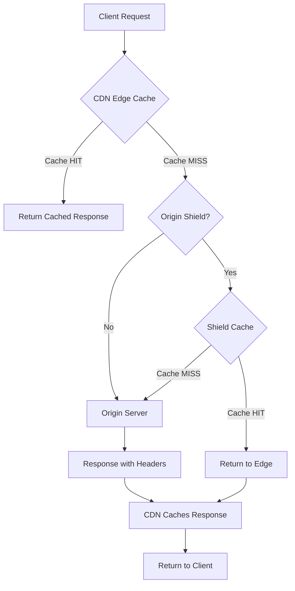
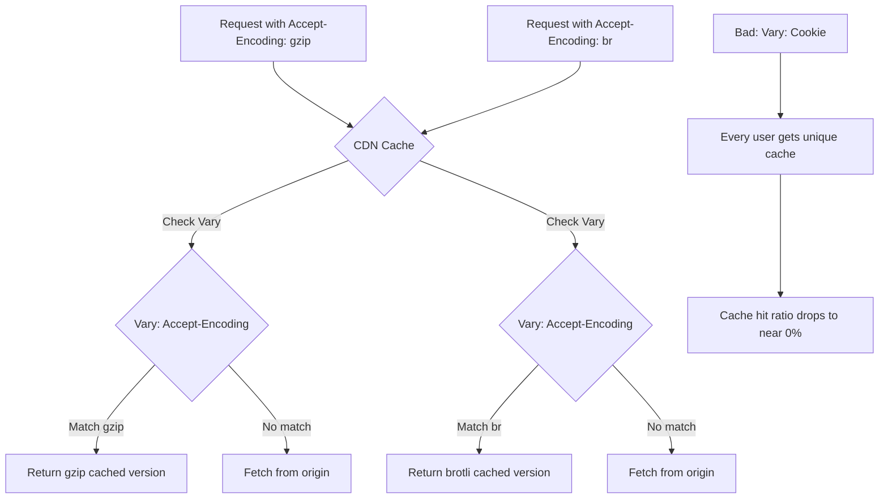
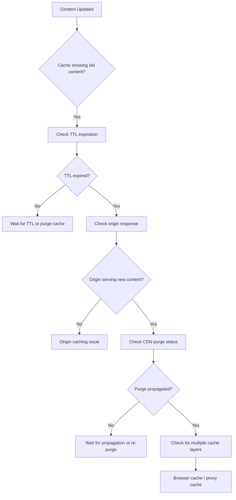

# How to Debug CDN Caching Issues

Author: [nawazdhandala](https://www.github.com/nawazdhandala)

Tags: CDN, Caching, Debugging, Networking, Performance, Troubleshooting

Description: A practical guide to diagnosing and fixing common CDN caching problems using headers, logs, and systematic debugging techniques.

---

CDN caching issues can be frustrating to debug because the problem could exist at multiple layers - your origin server, the CDN configuration, or even the client. This guide provides systematic approaches to identify and fix common CDN caching problems, with practical examples and tools you can use immediately.

## Understanding CDN Cache Flow

Before diving into debugging, you need to understand how requests flow through a CDN:



## Essential Debugging Headers

The first step in debugging is understanding what the CDN is telling you. Most CDNs add headers to responses that indicate cache status:

```bash
# Check cache status headers with curl
# The -I flag fetches only headers, -s suppresses progress output

curl -sI https://cdn.example.com/static/app.js | grep -i -E "^(x-cache|cf-cache|age|cache-control|cdn-cache)"

# Example output:
# x-cache: HIT
# age: 3542
# cache-control: public, max-age=86400
# cdn-cache-status: HIT
```

Here is a script that provides comprehensive cache debugging information:

```bash
#!/bin/bash
# cdn-debug.sh - Comprehensive CDN cache debugging script
# Usage: ./cdn-debug.sh https://cdn.example.com/path/to/resource

URL=$1

if [ -z "$URL" ]; then
    echo "Usage: $0 <url>"
    exit 1
fi

echo "=== CDN Cache Debug Report ==="
echo "URL: $URL"
echo "Time: $(date -u)"
echo ""

# Fetch headers
HEADERS=$(curl -sI -w "\n%{http_code}" "$URL")
HTTP_CODE=$(echo "$HEADERS" | tail -1)
HEADERS=$(echo "$HEADERS" | head -n -1)

echo "=== HTTP Status: $HTTP_CODE ==="
echo ""

echo "=== Cache-Related Headers ==="
echo "$HEADERS" | grep -i -E "^(x-cache|cf-cache|age|cache-control|cdn|vary|etag|last-modified|expires|pragma):" | sort

echo ""
echo "=== Cache Analysis ==="

# Check for cache hit/miss
if echo "$HEADERS" | grep -qi "x-cache.*hit"; then
    echo "[OK] Cache HIT detected"

    # Extract age if available
    AGE=$(echo "$HEADERS" | grep -i "^age:" | awk '{print $2}' | tr -d '\r')
    if [ -n "$AGE" ]; then
        echo "[INFO] Content age: ${AGE}s"
    fi
else
    echo "[WARN] Cache MISS or unknown status"
fi

# Check Cache-Control header
CC=$(echo "$HEADERS" | grep -i "^cache-control:" | cut -d: -f2- | tr -d '\r')
if [ -n "$CC" ]; then
    echo "[INFO] Cache-Control: $CC"

    # Check for no-cache directives
    if echo "$CC" | grep -qi "no-cache\|no-store\|private"; then
        echo "[WARN] Response has caching disabled or restricted"
    fi

    # Check for max-age
    MAX_AGE=$(echo "$CC" | grep -oE "max-age=[0-9]+" | cut -d= -f2)
    if [ -n "$MAX_AGE" ]; then
        echo "[INFO] max-age: ${MAX_AGE}s ($(($MAX_AGE / 3600))h $(($MAX_AGE % 3600 / 60))m)"
    fi
else
    echo "[WARN] No Cache-Control header found"
fi

# Check Vary header
VARY=$(echo "$HEADERS" | grep -i "^vary:" | cut -d: -f2- | tr -d '\r')
if [ -n "$VARY" ]; then
    echo "[INFO] Vary: $VARY"
    if echo "$VARY" | grep -qi "cookie"; then
        echo "[WARN] Vary includes Cookie - this may prevent caching"
    fi
fi

echo ""
echo "=== Multiple Request Test (checking cache consistency) ==="
for i in 1 2 3; do
    CACHE_STATUS=$(curl -sI "$URL" | grep -i "x-cache" | head -1)
    echo "Request $i: $CACHE_STATUS"
    sleep 0.5
done
```

## Common Caching Problems and Solutions

### Problem 1: Cache-Control Headers Preventing Caching

The most common issue is improper Cache-Control headers from your origin:

```python
# Flask example showing proper cache header configuration
from flask import Flask, send_file, make_response
from functools import wraps

app = Flask(__name__)

def cache_control(max_age=3600, public=True):
    """
    Decorator to add proper cache headers to responses.

    Args:
        max_age: Time in seconds the response can be cached
        public: Whether the response can be cached by shared caches (CDN)
    """
    def decorator(f):
        @wraps(f)
        def decorated_function(*args, **kwargs):
            response = make_response(f(*args, **kwargs))

            # Build Cache-Control header
            directives = []
            directives.append("public" if public else "private")
            directives.append(f"max-age={max_age}")

            # Add immutable for content-addressed resources
            if max_age >= 86400 * 30:  # 30+ days
                directives.append("immutable")

            response.headers["Cache-Control"] = ", ".join(directives)

            # Remove headers that prevent caching
            response.headers.pop("Pragma", None)
            response.headers.pop("Expires", None)

            return response
        return decorated_function
    return decorator

# Static assets - cache for 1 year
@app.route("/static/<path:filename>")
@cache_control(max_age=31536000, public=True)
def serve_static(filename):
    return send_file(f"static/{filename}")

# API responses - short cache with revalidation
@app.route("/api/products")
@cache_control(max_age=60, public=True)
def get_products():
    return {"products": [...]}

# User-specific content - never cache on CDN
@app.route("/api/user/profile")
@cache_control(max_age=0, public=False)
def get_user_profile():
    return {"user": {...}}
```

### Problem 2: Vary Header Issues

The Vary header tells the CDN which request headers affect the response. A misconfigured Vary header can destroy cache efficiency:



Here is how to fix common Vary header issues in nginx:

```nginx
# nginx configuration to fix Vary header issues

server {
    listen 80;
    server_name origin.example.com;

    # Good: Vary only on Accept-Encoding for compression
    location /static/ {
        root /var/www;

        # Enable compression
        gzip on;
        gzip_vary on;

        # This results in: Vary: Accept-Encoding
        # CDN will cache gzip and non-gzip versions separately

        # Remove any problematic Vary headers from upstream
        proxy_hide_header Vary;
        add_header Vary "Accept-Encoding";

        add_header Cache-Control "public, max-age=86400";
    }

    # API endpoints that might vary by content type
    location /api/ {
        proxy_pass http://backend;

        # Only vary on Accept header for content negotiation
        proxy_hide_header Vary;
        add_header Vary "Accept";

        # Short cache time for API responses
        add_header Cache-Control "public, max-age=60";
    }

    # User-specific content - do not cache on CDN at all
    location /api/user/ {
        proxy_pass http://backend;

        # Private means CDN will not cache
        add_header Cache-Control "private, no-store";
    }
}
```

### Problem 3: Query String Caching

By default, CDNs treat each unique query string as a different resource. This can cause cache fragmentation:

```python
# Example showing query string normalization for better caching
from urllib.parse import urlparse, parse_qs, urlencode

def normalize_cache_key(url: str, important_params: list = None) -> str:
    """
    Normalize URL for consistent cache keys.

    Many CDNs allow you to configure which query params to include
    in the cache key. This function shows the logic.

    Args:
        url: The full URL
        important_params: List of query params that affect the response

    Returns:
        Normalized URL for cache key
    """
    parsed = urlparse(url)
    params = parse_qs(parsed.query)

    if important_params is None:
        # Default: include all params but sort them
        important_params = list(params.keys())

    # Build normalized query string
    normalized_params = {}
    for key in sorted(important_params):
        if key in params:
            # Sort multiple values for same key
            normalized_params[key] = sorted(params[key])

    normalized_query = urlencode(normalized_params, doseq=True)

    # Reconstruct URL
    return f"{parsed.scheme}://{parsed.netloc}{parsed.path}?{normalized_query}"

# Example usage
urls = [
    "https://cdn.example.com/image.jpg?width=100&height=200",
    "https://cdn.example.com/image.jpg?height=200&width=100",  # Same resource
    "https://cdn.example.com/image.jpg?width=100&height=200&tracking=abc123",  # Tracking param
]

for url in urls:
    # Only width and height affect the actual image
    normalized = normalize_cache_key(url, important_params=["width", "height"])
    print(f"Original: {url}")
    print(f"Cache key: {normalized}")
    print()

# Output shows that all three URLs normalize to the same cache key
```

### Problem 4: Cookie-Based Cache Busting

Cookies in requests can prevent CDN caching entirely. Here is how to diagnose and fix this:

```bash
#!/bin/bash
# Test if cookies are affecting caching

URL="https://cdn.example.com/static/app.js"

echo "=== Testing cache behavior with and without cookies ==="
echo ""

echo "Request WITHOUT cookies:"
curl -sI "$URL" | grep -i "x-cache\|cache-control"
echo ""

echo "Request WITH common tracking cookie:"
curl -sI -H "Cookie: _ga=GA1.2.123456789.1234567890" "$URL" | grep -i "x-cache\|cache-control"
echo ""

echo "Request WITH session cookie:"
curl -sI -H "Cookie: sessionid=abc123" "$URL" | grep -i "x-cache\|cache-control"
echo ""

# If results differ, cookies are affecting caching
```

Fix cookie issues in your CDN configuration:

```yaml
# Example CDN configuration to ignore cookies for static assets

cache_rules:
  - name: "Static Assets - Ignore Cookies"
    match:
      path_patterns:
        - "*.js"
        - "*.css"
        - "*.png"
        - "*.jpg"
        - "*.woff2"
    cache:
      ignore_request_cookies: true      # Do not include cookies in cache key
      strip_response_cookies: true       # Remove Set-Cookie from cached responses
      ttl: 86400

  - name: "HTML Pages - Respect Cookies"
    match:
      path_patterns:
        - "*.html"
        - "/"
    cache:
      ignore_request_cookies: false     # Cookies affect this content
      ttl: 300
```

## Using CDN Logs for Debugging

CDN logs provide detailed information about cache behavior. Here is how to analyze them:

```python
# CDN log analysis script
# Most CDNs provide logs in JSON or CSV format with similar fields

import json
from collections import defaultdict
from datetime import datetime

def analyze_cdn_logs(log_file: str) -> dict:
    """
    Analyze CDN logs to identify caching issues.

    Common log fields:
    - cache_status: HIT, MISS, EXPIRED, STALE, etc.
    - url: Request URL
    - response_time: Time to serve request
    - origin_time: Time spent at origin (if cache miss)
    """
    stats = {
        "total_requests": 0,
        "cache_hits": 0,
        "cache_misses": 0,
        "by_status": defaultdict(int),
        "slow_misses": [],  # Misses that took > 1s
        "frequent_misses": defaultdict(int),  # URLs that miss frequently
    }

    with open(log_file, 'r') as f:
        for line in f:
            try:
                entry = json.loads(line)
            except json.JSONDecodeError:
                continue

            stats["total_requests"] += 1
            cache_status = entry.get("cache_status", "UNKNOWN")
            stats["by_status"][cache_status] += 1

            if cache_status == "HIT":
                stats["cache_hits"] += 1
            elif cache_status in ("MISS", "EXPIRED"):
                stats["cache_misses"] += 1

                # Track slow misses
                origin_time = entry.get("origin_time_ms", 0)
                if origin_time > 1000:
                    stats["slow_misses"].append({
                        "url": entry.get("url"),
                        "origin_time_ms": origin_time,
                        "timestamp": entry.get("timestamp")
                    })

                # Track frequently missed URLs
                url = entry.get("url", "")
                # Normalize URL by removing query string for grouping
                base_url = url.split("?")[0]
                stats["frequent_misses"][base_url] += 1

    # Calculate hit ratio
    if stats["total_requests"] > 0:
        stats["hit_ratio"] = stats["cache_hits"] / stats["total_requests"]
    else:
        stats["hit_ratio"] = 0

    # Sort frequent misses
    stats["top_missed_urls"] = sorted(
        stats["frequent_misses"].items(),
        key=lambda x: x[1],
        reverse=True
    )[:20]

    return stats

def print_report(stats: dict):
    """Print a human-readable cache analysis report."""
    print("=" * 60)
    print("CDN Cache Analysis Report")
    print("=" * 60)
    print(f"Total Requests: {stats['total_requests']:,}")
    print(f"Cache Hit Ratio: {stats['hit_ratio']:.2%}")
    print()

    print("Cache Status Breakdown:")
    for status, count in sorted(stats["by_status"].items()):
        pct = count / stats["total_requests"] * 100
        print(f"  {status}: {count:,} ({pct:.1f}%)")
    print()

    if stats["top_missed_urls"]:
        print("Top 10 Most Frequently Missed URLs:")
        for url, count in stats["top_missed_urls"][:10]:
            print(f"  {count:,} misses: {url}")
    print()

    if stats["slow_misses"]:
        print(f"Slow Cache Misses (>1s): {len(stats['slow_misses'])}")
        for miss in stats["slow_misses"][:5]:
            print(f"  {miss['origin_time_ms']}ms: {miss['url']}")

# Usage
if __name__ == "__main__":
    stats = analyze_cdn_logs("cdn_access.log")
    print_report(stats)
```

## Real-Time Cache Debugging with curl

Here are advanced curl techniques for debugging specific cache scenarios:

```bash
#!/bin/bash
# Advanced CDN debugging commands

URL="https://cdn.example.com/api/data"

# 1. Force cache bypass to see origin response
echo "=== Origin Response (bypassing cache) ==="
curl -sI -H "Cache-Control: no-cache" \
         -H "Pragma: no-cache" \
         "$URL"

# 2. Check response timing breakdown
echo "=== Response Timing ==="
curl -sI -w "
DNS Lookup:    %{time_namelookup}s
TCP Connect:   %{time_connect}s
TLS Handshake: %{time_appconnect}s
First Byte:    %{time_starttransfer}s
Total Time:    %{time_total}s
" -o /dev/null "$URL"

# 3. Check if different Accept-Encoding gets different cache entries
echo "=== Compression Variants ==="
echo "With gzip:"
curl -sI -H "Accept-Encoding: gzip" "$URL" | grep -i "x-cache\|content-encoding"
echo "With br:"
curl -sI -H "Accept-Encoding: br" "$URL" | grep -i "x-cache\|content-encoding"
echo "No compression:"
curl -sI -H "Accept-Encoding: identity" "$URL" | grep -i "x-cache\|content-encoding"

# 4. Test conditional requests (If-None-Match / If-Modified-Since)
echo "=== Conditional Request Test ==="
ETAG=$(curl -sI "$URL" | grep -i "etag:" | cut -d: -f2- | tr -d ' \r')
if [ -n "$ETAG" ]; then
    echo "ETag: $ETAG"
    echo "Conditional request response:"
    curl -sI -H "If-None-Match: $ETAG" "$URL" | head -1
fi

# 5. Test from different CDN edge locations (if your CDN supports this)
echo "=== Multi-Region Test ==="
# Some CDNs allow forcing requests to specific PoPs
# This syntax varies by CDN provider
for region in "us-east" "eu-west" "ap-south"; do
    echo "Region: $region"
    # Example: Fastly uses specific headers for this
    # curl -sI -H "Fastly-Debug: 1" "$URL" | grep -i "x-served-by"
done
```

## Debugging Cache Invalidation

When your cache is not updating after content changes, use this debugging workflow:



```python
# Cache invalidation verification script
import requests
import time
import hashlib

def verify_cache_invalidation(url: str, expected_content_hash: str, max_wait: int = 60) -> dict:
    """
    Verify that cache invalidation has propagated.

    Args:
        url: URL to check
        expected_content_hash: MD5 hash of expected new content
        max_wait: Maximum seconds to wait for propagation

    Returns:
        Dict with verification results
    """
    results = {
        "url": url,
        "expected_hash": expected_content_hash,
        "checks": [],
        "success": False
    }

    start_time = time.time()
    check_interval = 5  # seconds between checks

    while time.time() - start_time < max_wait:
        response = requests.get(url, headers={
            "Cache-Control": "no-cache"  # Bypass browser cache
        })

        actual_hash = hashlib.md5(response.content).hexdigest()
        cache_status = response.headers.get("x-cache", "unknown")
        age = response.headers.get("age", "0")

        check = {
            "timestamp": time.time(),
            "actual_hash": actual_hash,
            "cache_status": cache_status,
            "age": age,
            "match": actual_hash == expected_content_hash
        }
        results["checks"].append(check)

        if check["match"]:
            results["success"] = True
            results["propagation_time"] = time.time() - start_time
            break

        print(f"Check at {time.time() - start_time:.0f}s: "
              f"hash={actual_hash[:8]}... cache={cache_status} age={age}")

        time.sleep(check_interval)

    return results

def purge_and_verify(cdn_api_url: str, api_key: str, url_to_purge: str, expected_hash: str):
    """
    Purge URL from CDN and verify propagation.
    """
    # Send purge request
    print(f"Purging: {url_to_purge}")
    purge_response = requests.post(
        f"{cdn_api_url}/purge",
        headers={"Authorization": f"Bearer {api_key}"},
        json={"urls": [url_to_purge]}
    )

    if purge_response.status_code != 200:
        print(f"Purge failed: {purge_response.text}")
        return

    purge_id = purge_response.json().get("purge_id")
    print(f"Purge initiated: {purge_id}")

    # Wait a moment for purge to start propagating
    time.sleep(2)

    # Verify invalidation
    result = verify_cache_invalidation(url_to_purge, expected_hash)

    if result["success"]:
        print(f"Cache invalidation successful after {result['propagation_time']:.1f}s")
    else:
        print("Cache invalidation failed or timed out")
        print("Last check:", result["checks"][-1] if result["checks"] else "No checks")
```

## CDN Configuration Checklist

Use this checklist when debugging caching issues:

```markdown
## CDN Caching Debug Checklist

### Origin Server
- [ ] Cache-Control header is set correctly
- [ ] No `no-cache`, `no-store`, or `private` on cacheable content
- [ ] max-age is appropriate for content type
- [ ] No `Vary: Cookie` on static assets
- [ ] ETag or Last-Modified headers are present
- [ ] Set-Cookie not sent for static assets

### CDN Configuration
- [ ] Cache TTL rules match content types
- [ ] Query string handling configured correctly
- [ ] Cookie forwarding disabled for static assets
- [ ] Origin shield enabled (if available)
- [ ] Compression configured at edge

### Request/Response
- [ ] Content-Type header is correct
- [ ] Response size is within CDN limits
- [ ] No authentication headers on public content
- [ ] CORS headers configured if needed

### Monitoring
- [ ] Cache hit ratio > 90% for static assets
- [ ] Age header showing expected values
- [ ] No unexpected MISS patterns in logs
```

---

Debugging CDN caching issues requires a systematic approach: start by examining headers, check your origin configuration, review CDN rules, and use logs to identify patterns. The tools and scripts in this guide give you a solid foundation for diagnosing most common caching problems. Remember that cache debugging is often about understanding the full request flow from client to origin and back, so always consider where in that chain the issue might be occurring.
