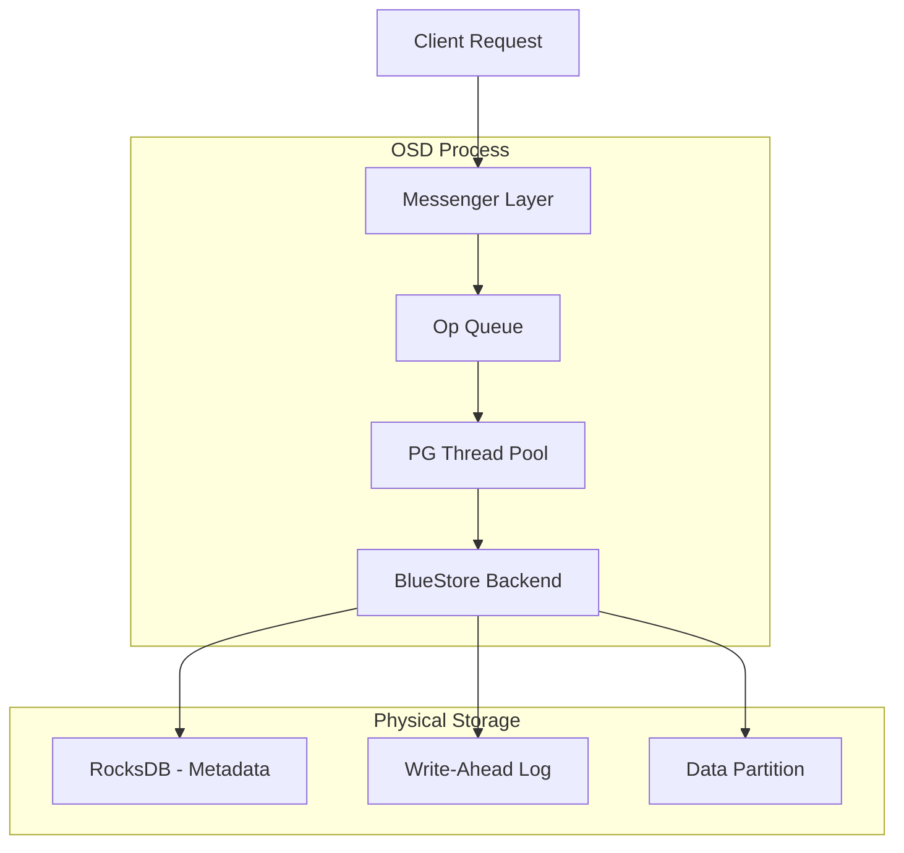
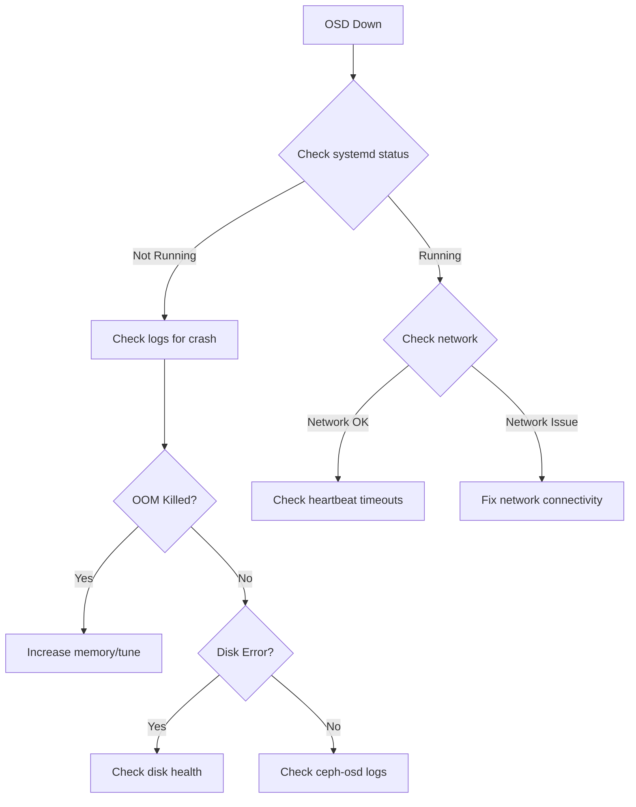
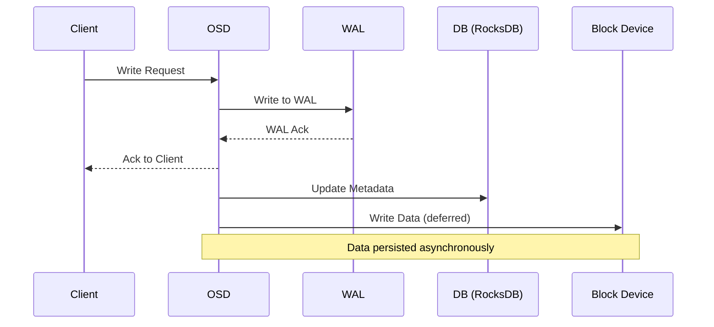
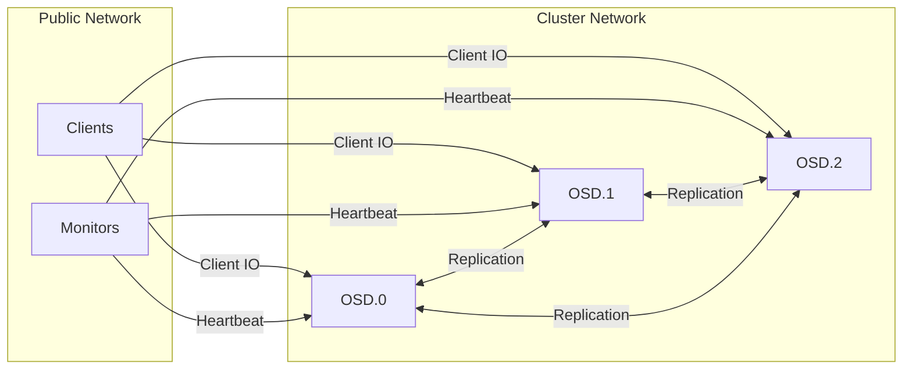

# How to Debug Ceph OSD Issues

Author: [nawazdhandala](https://www.github.com/nawazdhandala)

Tags: Ceph, Storage, Debugging, Infrastructure, DevOps, Troubleshooting

Description: A hands-on guide to diagnosing and resolving common Ceph OSD problems including slow requests, down OSDs, and performance degradation.

---

Object Storage Daemons (OSDs) are the workhorses of a Ceph cluster. They handle data storage, replication, recovery, and rebalancing. When OSDs misbehave, your entire storage infrastructure suffers. This post covers systematic approaches to debugging OSD issues, from identifying problems to implementing fixes.

## Understanding OSD Architecture

Before debugging, let's understand what happens inside an OSD:



Each OSD manages multiple Placement Groups (PGs) and communicates with other OSDs for replication. Problems can occur at any layer.

## Initial Triage

When you suspect OSD issues, start with cluster health:

```bash
# Quick health check
ceph health detail

# Check OSD status
ceph osd stat

# View OSD tree with status
ceph osd tree
```

Common health warnings related to OSDs:
- `osd.X is down` - OSD not responding
- `X slow requests` - Operations taking too long
- `X osds have slow ops` - Multiple OSDs affected
- `backfill_toofull` - OSD too full to receive backfill

## Debugging Down OSDs

When an OSD is marked down, follow this diagnostic flow:



### Step 1: Check OSD Service Status

```bash
# Check if OSD service is running
systemctl status ceph-osd@<osd-id>

# View recent logs
journalctl -u ceph-osd@<osd-id> -n 100 --no-pager

# Check for crash dumps
ls -la /var/lib/ceph/crash/
```

### Step 2: Check for System-Level Issues

```bash
# Check if OSD was killed by OOM
dmesg | grep -i "killed process" | tail -20

# Check disk status
smartctl -H /dev/sdX

# Check filesystem status
dmesg | grep -E "(error|fail|readonly)" | tail -20

# Check mount status
mount | grep ceph
```

### Step 3: Examine OSD Logs

```bash
# Default log location
tail -500 /var/log/ceph/ceph-osd.<osd-id>.log

# Look for specific errors
grep -E "(error|failed|assert)" /var/log/ceph/ceph-osd.<osd-id>.log | tail -50

# Check for slow operations
grep "slow request" /var/log/ceph/ceph-osd.<osd-id>.log | tail -20
```

## Debugging Slow Requests

Slow requests are one of the most common OSD issues. They indicate operations taking longer than expected.

### Identifying Slow Requests

```bash
# Check cluster-wide slow ops
ceph daemon osd.<id> dump_historic_slow_ops

# Check blocked ops
ceph daemon osd.<id> dump_blocked_ops

# Get operation latency stats
ceph daemon osd.<id> perf dump | jq '.osd'
```

### Common Causes and Solutions

**1. Disk Performance Issues**

```bash
# Check disk I/O stats
iostat -xz 1 5

# Look for high await times (>20ms for SSD, >50ms for HDD)
# Look for high %util (>80%)

# Check for disk errors
smartctl -a /dev/sdX | grep -E "(Reallocated|Current_Pending|Offline_Uncorrectable)"
```

**2. Network Latency**

```bash
# Check network latency between OSDs
ping -c 10 <other-osd-ip>

# Check for packet loss
sar -n DEV 1 10

# Verify network configuration
ceph config get osd.* cluster_network
ceph config get osd.* public_network
```

**3. Undersized PG Log**

```bash
# Check PG stats for specific OSD
ceph pg ls-by-osd <osd-id>

# Look for PGs with large logs
ceph pg <pg-id> query | jq '.info.stats.log_size'
```

## Performance Analysis

For systematic performance debugging, collect metrics over time:

```bash
#!/bin/bash
# osd-perf-collect.sh - Collect OSD performance data

OSD_ID=$1
DURATION=${2:-60}
INTERVAL=${3:-5}

echo "Collecting OSD.$OSD_ID performance for ${DURATION}s..."

for i in $(seq 1 $((DURATION/INTERVAL))); do
    echo "=== Sample $i at $(date) ==="

    # OSD perf counters
    ceph daemon osd.$OSD_ID perf dump | jq '{
        op_latency: .osd.op_latency,
        op_w_latency: .osd.op_w_latency,
        op_r_latency: .osd.op_r_latency,
        subop_latency: .osd.subop_latency
    }'

    # Disk stats
    iostat -x 1 1 | grep -E "^sd|^nvme"

    sleep $INTERVAL
done
```

## BlueStore Debugging

Most modern Ceph deployments use BlueStore. Here's how to debug BlueStore-specific issues:

```bash
# Check BlueStore performance
ceph daemon osd.<id> perf dump | jq '.bluestore'

# Key metrics to watch:
# - bluestore_kv_flush_lat: RocksDB flush latency
# - bluestore_commit_lat: Commit latency
# - bluestore_read_lat: Read latency

# Check BlueStore allocation
ceph daemon osd.<id> bluestore allocator dump

# Examine bluefs (BlueStore filesystem) usage
ceph daemon osd.<id> bluefs stats
```

### BlueStore Data Flow



## Memory Issues

OSDs can run into memory problems, especially with many PGs:

```bash
# Check OSD memory usage
ceph daemon osd.<id> dump_mempools

# Key pools to watch:
# - bluestore_cache_data: Block cache
# - bluestore_cache_onode: Object node cache
# - osd_pglog: PG logs

# Check memory configuration
ceph config get osd.<id> osd_memory_target
ceph config get osd.<id> bluestore_cache_size
```

If OSDs are being OOM killed:

```bash
# Reduce cache sizes
ceph config set osd osd_memory_target 4294967296  # 4GB

# Reduce PG log sizes
ceph config set osd osd_min_pg_log_entries 100
ceph config set osd osd_max_pg_log_entries 1000
```

## Network Debugging

OSD heartbeat failures often indicate network issues:

```bash
# Check heartbeat settings
ceph config get osd osd_heartbeat_grace
ceph config get osd osd_heartbeat_interval

# View heartbeat status
ceph daemon osd.<id> dump_osd_network

# Check for network congestion
ceph daemon osd.<id> dump_historic_ops | jq '.ops[] | select(.description | contains("subop"))'
```

### Network Architecture Impact



Use separate networks for client and cluster traffic when possible to prevent client IO from impacting replication.

## Recovery and Backfill Issues

When OSDs come back online, recovery can impact performance:

```bash
# Check recovery status
ceph pg stat

# View active recovery operations
ceph status | grep -E "(recovering|backfill|degraded)"

# Throttle recovery to reduce impact
ceph config set osd osd_recovery_max_active 1
ceph config set osd osd_recovery_sleep 0.5
ceph config set osd osd_max_backfills 1

# Check recovery priority
ceph pg ls degraded
```

## Practical Debugging Session

Here's a real-world debugging workflow for a slow OSD:

```bash
#!/bin/bash
# debug-slow-osd.sh - Comprehensive OSD debugging

OSD_ID=$1

if [ -z "$OSD_ID" ]; then
    echo "Usage: $0 <osd-id>"
    exit 1
fi

echo "=== OSD.$OSD_ID Debug Report ==="
echo "Generated: $(date)"
echo ""

echo "=== 1. Basic Status ==="
ceph osd find $OSD_ID
systemctl status ceph-osd@$OSD_ID --no-pager | head -20

echo ""
echo "=== 2. OSD Configuration ==="
ceph config show osd.$OSD_ID | grep -E "(memory|cache|recovery|heartbeat)"

echo ""
echo "=== 3. Performance Counters ==="
ceph daemon osd.$OSD_ID perf dump | jq '{
    osd_op_latency: .osd.op_latency.avgcount,
    osd_op_latency_avg: .osd.op_latency.sum,
    subop_latency: .osd.subop_latency.avgcount,
    commit_latency: .bluestore.commit_lat.avgcount
}'

echo ""
echo "=== 4. Slow Operations ==="
ceph daemon osd.$OSD_ID dump_historic_slow_ops 2>/dev/null | jq '.num_ops'

echo ""
echo "=== 5. PG Status ==="
ceph pg ls-by-osd $OSD_ID | head -20

echo ""
echo "=== 6. Memory Usage ==="
ceph daemon osd.$OSD_ID dump_mempools | jq 'to_entries | map(select(.value.bytes > 100000000)) | from_entries'

echo ""
echo "=== 7. Recent Log Errors ==="
grep -E "(error|slow|failed)" /var/log/ceph/ceph-osd.$OSD_ID.log 2>/dev/null | tail -10

echo ""
echo "=== 8. Disk Health ==="
# Get the device for this OSD
DEVICE=$(ceph-volume lvm list $OSD_ID 2>/dev/null | grep "devices:" | awk '{print $2}')
if [ -n "$DEVICE" ]; then
    smartctl -H $DEVICE 2>/dev/null | grep -E "(PASSED|FAILED|result)"
fi

echo ""
echo "=== Debug Complete ==="
```

## Restarting and Recovering OSDs

When you need to restart an OSD:

```bash
# Graceful restart
systemctl restart ceph-osd@<osd-id>

# If OSD won't start, try repair
ceph-objectstore-tool --data-path /var/lib/ceph/osd/ceph-<osd-id> --op fsck

# Force OSD to rejoin cluster after fixes
ceph osd in <osd-id>

# Mark OSD as up if it's healthy but marked down
ceph osd up <osd-id>
```

## Proactive Monitoring

Set up alerts for OSD issues before they become critical:

```bash
# Check for OSDs near full
ceph osd df | awk '$7 > 80 {print "WARNING: OSD." $1 " is " $7 "% full"}'

# Monitor for down OSDs
ceph osd stat | grep -v "all up"

# Check for slow ops across cluster
ceph health detail | grep "slow"
```

## Summary Checklist

When debugging OSD issues, work through this checklist:

1. **Check cluster health** - `ceph health detail`
2. **Verify OSD status** - `ceph osd tree`
3. **Check service logs** - `journalctl -u ceph-osd@X`
4. **Examine disk health** - `smartctl -H /dev/sdX`
5. **Review performance counters** - `ceph daemon osd.X perf dump`
6. **Check network connectivity** - ping, sar, tcpdump
7. **Analyze memory usage** - `ceph daemon osd.X dump_mempools`
8. **Review PG states** - `ceph pg ls-by-osd X`

---

OSD debugging requires a systematic approach. Start with the basics - is it running? Can it communicate? Then dig into performance metrics and logs. Most OSD issues come down to disk problems, network issues, or resource exhaustion. Building familiarity with the debugging tools and understanding the OSD architecture will help you resolve issues quickly and keep your Ceph cluster healthy.
