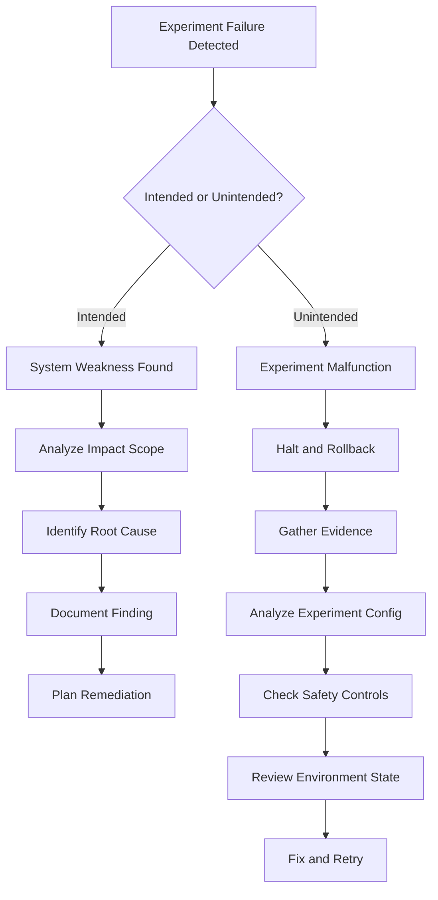
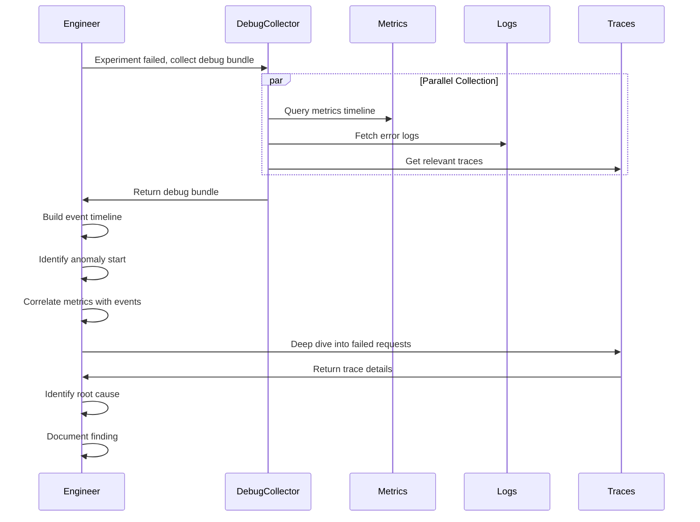

# How to Debug Chaos Experiment Failures

Author: [nawazdhandala](https://www.github.com/nawazdhandala)

Tags: Chaos Engineering, Debugging, Incident Analysis, SRE, Observability, Troubleshooting

Description: A systematic approach to debugging chaos experiments when they reveal unexpected system behavior or cause unintended impacts.

---

## When Chaos Experiments Fail

Chaos experiments can "fail" in two ways. The intended failure is when your system does not handle the injected fault gracefully - that is the whole point of chaos engineering. The unintended failure is when the experiment itself malfunctions, causes unexpected damage, or produces confusing results.

Both types of failure require debugging, but the approach differs. This guide covers how to investigate both scenarios systematically.

## The Debugging Framework



## Gathering Evidence

Before debugging, collect all relevant data while it is still available:

```python
# chaos_debug_collector.py
# Collect debugging information after experiment failure

import json
import asyncio
from datetime import datetime, timedelta
from dataclasses import dataclass
from typing import Dict, List, Optional

@dataclass
class DebugBundle:
    """Collection of debugging artifacts."""
    experiment_id: str
    timestamp: str
    experiment_config: Dict
    timeline: List[Dict]
    metrics_snapshots: List[Dict]
    logs: List[str]
    alerts: List[Dict]
    traces: List[Dict]
    environment_state: Dict

class ChaosDebugCollector:
    """Collect comprehensive debugging information for failed experiments."""

    def __init__(self, experiment_store, metrics_client, log_client,
                 trace_client, alert_client, infra_client):
        self.experiments = experiment_store
        self.metrics = metrics_client
        self.logs = log_client
        self.traces = trace_client
        self.alerts = alert_client
        self.infra = infra_client

    async def collect_debug_bundle(self, experiment_id: str,
                                    time_window_minutes: int = 30) -> DebugBundle:
        """
        Collect all debugging artifacts for a failed experiment.

        Args:
            experiment_id: The experiment to debug
            time_window_minutes: How far back to collect data
        """
        experiment = await self.experiments.get(experiment_id)

        # Calculate time range
        start_time = experiment.start_time - timedelta(minutes=5)
        end_time = experiment.end_time + timedelta(minutes=time_window_minutes)

        # Collect all artifacts in parallel
        timeline, metrics, logs, alerts, traces, env_state = await asyncio.gather(
            self._build_timeline(experiment_id, start_time, end_time),
            self._collect_metrics(experiment, start_time, end_time),
            self._collect_logs(experiment.targets, start_time, end_time),
            self._collect_alerts(start_time, end_time),
            self._collect_traces(experiment.targets, start_time, end_time),
            self._capture_environment_state(experiment.targets)
        )

        return DebugBundle(
            experiment_id=experiment_id,
            timestamp=datetime.utcnow().isoformat(),
            experiment_config=experiment.to_dict(),
            timeline=timeline,
            metrics_snapshots=metrics,
            logs=logs,
            alerts=alerts,
            traces=traces,
            environment_state=env_state
        )

    async def _build_timeline(self, experiment_id: str,
                               start: datetime, end: datetime) -> List[Dict]:
        """Build a timeline of events during the experiment."""
        events = []

        # Experiment lifecycle events
        exp_events = await self.experiments.get_events(experiment_id)
        events.extend([
            {
                "timestamp": e.timestamp.isoformat(),
                "type": "experiment",
                "event": e.event_type,
                "details": e.details
            }
            for e in exp_events
        ])

        # Alert events
        alert_events = await self.alerts.get_alerts(start, end)
        events.extend([
            {
                "timestamp": a.fired_at.isoformat(),
                "type": "alert",
                "event": "fired",
                "details": {"name": a.name, "severity": a.severity}
            }
            for a in alert_events
        ])

        # Sort by timestamp
        events.sort(key=lambda x: x["timestamp"])

        return events

    async def _collect_metrics(self, experiment,
                                start: datetime, end: datetime) -> List[Dict]:
        """Collect metrics snapshots at key moments."""
        queries = {
            "error_rate": 'sum(rate(http_requests_total{status=~"5.."}[1m])) / sum(rate(http_requests_total[1m]))',
            "latency_p99": 'histogram_quantile(0.99, rate(http_request_duration_seconds_bucket[1m]))',
            "throughput": 'sum(rate(http_requests_total[1m]))',
            "cpu_usage": 'avg(rate(container_cpu_usage_seconds_total[1m]))',
            "memory_usage": 'avg(container_memory_working_set_bytes)'
        }

        snapshots = []

        # Baseline (before experiment)
        baseline = {}
        for name, query in queries.items():
            baseline[name] = await self.metrics.query_instant(
                query,
                experiment.start_time - timedelta(minutes=1)
            )
        snapshots.append({
            "moment": "baseline",
            "timestamp": (experiment.start_time - timedelta(minutes=1)).isoformat(),
            "values": baseline
        })

        # During experiment (multiple points)
        duration = (experiment.end_time - experiment.start_time).total_seconds()
        for offset in [0.25, 0.5, 0.75, 1.0]:
            point_time = experiment.start_time + timedelta(seconds=duration * offset)
            point_values = {}
            for name, query in queries.items():
                point_values[name] = await self.metrics.query_instant(query, point_time)
            snapshots.append({
                "moment": f"during_{int(offset*100)}%",
                "timestamp": point_time.isoformat(),
                "values": point_values
            })

        # Post-experiment (recovery)
        for offset_minutes in [1, 5, 10]:
            point_time = experiment.end_time + timedelta(minutes=offset_minutes)
            if point_time <= end:
                point_values = {}
                for name, query in queries.items():
                    point_values[name] = await self.metrics.query_instant(query, point_time)
                snapshots.append({
                    "moment": f"recovery_{offset_minutes}m",
                    "timestamp": point_time.isoformat(),
                    "values": point_values
                })

        return snapshots

    async def _collect_logs(self, targets: List[str],
                            start: datetime, end: datetime) -> List[str]:
        """Collect relevant logs from targeted services."""
        logs = []

        for target in targets:
            # Get error logs
            error_logs = await self.logs.query(
                service=target,
                level="error",
                start=start,
                end=end,
                limit=100
            )
            logs.extend(error_logs)

            # Get warning logs
            warning_logs = await self.logs.query(
                service=target,
                level="warning",
                start=start,
                end=end,
                limit=50
            )
            logs.extend(warning_logs)

        return logs

    async def _capture_environment_state(self, targets: List[str]) -> Dict:
        """Capture current environment state for debugging."""
        state = {
            "kubernetes": {},
            "network": {},
            "dependencies": {}
        }

        for target in targets:
            # Pod status
            pods = await self.infra.get_pods(app=target)
            state["kubernetes"][target] = {
                "pods": [
                    {
                        "name": p.name,
                        "status": p.status,
                        "restarts": p.restart_count,
                        "ready": p.ready
                    }
                    for p in pods
                ]
            }

        # Dependency health
        dependencies = ["postgres", "redis", "rabbitmq"]
        for dep in dependencies:
            health = await self.infra.check_health(dep)
            state["dependencies"][dep] = health

        return state
```

## Debugging Workflow



## Common Failure Patterns

### Pattern 1: Cascading Failure

The experiment triggers failures beyond the intended scope:

```python
# debug_cascade.py
# Analyze cascading failure patterns

def analyze_cascade_failure(debug_bundle: DebugBundle) -> Dict:
    """
    Identify if the experiment caused cascading failures.

    Signs of cascade:
    - Error rate increases in services not directly targeted
    - Latency increases propagate upstream
    - Multiple unrelated alerts fire in sequence
    """
    analysis = {
        "cascade_detected": False,
        "affected_services": [],
        "propagation_path": [],
        "trigger_point": None
    }

    # Check which services showed errors
    targeted_services = set(debug_bundle.experiment_config.get("targets", []))

    for snapshot in debug_bundle.metrics_snapshots:
        if snapshot["moment"].startswith("during"):
            # Look for errors in non-targeted services
            for service, error_rate in snapshot["values"].get("error_rate_by_service", {}).items():
                if service not in targeted_services and error_rate > 0.01:
                    analysis["cascade_detected"] = True
                    analysis["affected_services"].append({
                        "service": service,
                        "error_rate": error_rate,
                        "when": snapshot["timestamp"]
                    })

    # Build propagation path from traces
    if analysis["cascade_detected"]:
        analysis["propagation_path"] = _extract_propagation_path(debug_bundle.traces)

    return analysis

def _extract_propagation_path(traces: List[Dict]) -> List[str]:
    """Extract the path of failure propagation from traces."""
    # Find traces with errors
    error_traces = [t for t in traces if t.get("status") == "error"]

    # Extract service path from span hierarchy
    paths = []
    for trace in error_traces:
        path = []
        for span in trace.get("spans", []):
            if span.get("status") == "error":
                path.append(span.get("service_name"))
        if path:
            paths.append(path)

    # Find most common propagation pattern
    if paths:
        from collections import Counter
        path_tuples = [tuple(p) for p in paths]
        most_common = Counter(path_tuples).most_common(1)
        if most_common:
            return list(most_common[0][0])

    return []
```

### Pattern 2: Incomplete Rollback

The system does not fully recover after the experiment:

```python
# debug_rollback.py
# Analyze incomplete rollback scenarios

def analyze_incomplete_rollback(debug_bundle: DebugBundle) -> Dict:
    """
    Check if the system fully recovered after the experiment.

    Signs of incomplete rollback:
    - Metrics don't return to baseline
    - Pods stuck in non-ready state
    - Connection pools not replenished
    """
    analysis = {
        "fully_recovered": True,
        "lingering_issues": [],
        "recovery_blockers": []
    }

    # Compare baseline to recovery metrics
    baseline = None
    final_recovery = None

    for snapshot in debug_bundle.metrics_snapshots:
        if snapshot["moment"] == "baseline":
            baseline = snapshot["values"]
        elif snapshot["moment"] == "recovery_10m":
            final_recovery = snapshot["values"]

    if baseline and final_recovery:
        # Check each metric for recovery
        tolerance = 0.1  # 10% tolerance

        for metric_name in baseline:
            baseline_val = baseline[metric_name]
            recovery_val = final_recovery.get(metric_name)

            if recovery_val is None:
                continue

            if baseline_val > 0:
                variance = abs(recovery_val - baseline_val) / baseline_val
                if variance > tolerance:
                    analysis["fully_recovered"] = False
                    analysis["lingering_issues"].append({
                        "metric": metric_name,
                        "baseline": baseline_val,
                        "current": recovery_val,
                        "variance_percent": variance * 100
                    })

    # Check pod status
    for service, state in debug_bundle.environment_state.get("kubernetes", {}).items():
        for pod in state.get("pods", []):
            if not pod.get("ready"):
                analysis["fully_recovered"] = False
                analysis["recovery_blockers"].append({
                    "type": "pod_not_ready",
                    "service": service,
                    "pod": pod["name"],
                    "status": pod["status"]
                })
            if pod.get("restarts", 0) > 0:
                analysis["recovery_blockers"].append({
                    "type": "pod_restart_loop",
                    "service": service,
                    "pod": pod["name"],
                    "restarts": pod["restarts"]
                })

    return analysis
```

### Pattern 3: Configuration Drift

The experiment reveals configuration that differs from expectations:

```python
# debug_config_drift.py
# Detect configuration drift during experiments

def analyze_config_drift(debug_bundle: DebugBundle,
                          expected_config: Dict) -> Dict:
    """
    Compare actual behavior to expected configuration.

    Signs of config drift:
    - Timeouts different than expected
    - Retry counts don't match
    - Circuit breaker thresholds misconfigured
    """
    analysis = {
        "drift_detected": False,
        "discrepancies": []
    }

    # Extract actual behavior from logs
    actual_timeouts = _extract_timeout_behavior(debug_bundle.logs)
    actual_retries = _extract_retry_behavior(debug_bundle.logs)
    actual_circuit_breaker = _extract_circuit_breaker_behavior(debug_bundle.logs)

    # Compare to expected
    if expected_config.get("timeout_ms"):
        expected_timeout = expected_config["timeout_ms"]
        for service, actual in actual_timeouts.items():
            if abs(actual - expected_timeout) > 100:  # 100ms tolerance
                analysis["drift_detected"] = True
                analysis["discrepancies"].append({
                    "type": "timeout",
                    "service": service,
                    "expected": expected_timeout,
                    "actual": actual
                })

    if expected_config.get("max_retries"):
        expected_retries = expected_config["max_retries"]
        for service, actual in actual_retries.items():
            if actual != expected_retries:
                analysis["drift_detected"] = True
                analysis["discrepancies"].append({
                    "type": "retry_count",
                    "service": service,
                    "expected": expected_retries,
                    "actual": actual
                })

    return analysis

def _extract_timeout_behavior(logs: List[str]) -> Dict[str, float]:
    """Extract actual timeout values from log messages."""
    import re
    timeouts = {}

    timeout_pattern = r"(?P<service>\w+).*timeout after (?P<ms>\d+)ms"

    for log in logs:
        match = re.search(timeout_pattern, log)
        if match:
            service = match.group("service")
            ms = int(match.group("ms"))
            if service not in timeouts or ms > timeouts[service]:
                timeouts[service] = ms

    return timeouts
```

## Debugging Checklist

Use this checklist when investigating experiment failures:

```markdown
## Chaos Experiment Debug Checklist

### Immediate Actions
- [ ] Halt the experiment if still running
- [ ] Verify production traffic is not impacted
- [ ] Collect debug bundle while data is fresh
- [ ] Notify relevant teams if customer impact detected

### Evidence Collection
- [ ] Export metrics from 5 minutes before to 30 minutes after
- [ ] Gather logs from all targeted services
- [ ] Collect traces for failed requests
- [ ] Screenshot dashboard state
- [ ] Document current infrastructure state

### Timeline Analysis
- [ ] Mark experiment start on timeline
- [ ] Identify first anomaly after injection
- [ ] Note when alerts fired
- [ ] Mark experiment end
- [ ] Identify when (if) recovery completed

### Root Cause Investigation
- [ ] Was the failure in the targeted component?
- [ ] Did failure cascade to other services?
- [ ] Were safety controls triggered appropriately?
- [ ] Did the system match expected configuration?
- [ ] Was the blast radius as expected?

### Documentation
- [ ] Write incident summary
- [ ] Document root cause
- [ ] List action items
- [ ] Update runbooks if needed
- [ ] Share findings with team
```

## Generating Debug Reports

Automate report generation for consistent documentation:

```python
# chaos_debug_report.py
# Generate debugging reports from collected data

from typing import Dict

def generate_debug_report(debug_bundle: DebugBundle,
                           analysis: Dict) -> str:
    """Generate a markdown report from debugging data."""

    report = f"""# Chaos Experiment Debug Report

## Experiment Details
- **ID**: {debug_bundle.experiment_id}
- **Name**: {debug_bundle.experiment_config.get('name', 'Unknown')}
- **Type**: {debug_bundle.experiment_config.get('attack_type', 'Unknown')}
- **Targets**: {', '.join(debug_bundle.experiment_config.get('targets', []))}
- **Duration**: {debug_bundle.experiment_config.get('duration_seconds', 'Unknown')}s

## Timeline
| Time | Event Type | Details |
|------|------------|---------|
"""

    for event in debug_bundle.timeline:
        report += f"| {event['timestamp']} | {event['type']} | {event['event']} |\n"

    report += """
## Metrics Analysis

### Baseline vs Peak Impact
| Metric | Baseline | Peak | Change |
|--------|----------|------|--------|
"""

    baseline = next((s for s in debug_bundle.metrics_snapshots if s["moment"] == "baseline"), {})
    peak = max(debug_bundle.metrics_snapshots,
               key=lambda s: s["values"].get("error_rate", 0) if s["moment"].startswith("during") else 0,
               default={})

    for metric in baseline.get("values", {}):
        base_val = baseline["values"][metric]
        peak_val = peak.get("values", {}).get(metric, base_val)
        change = ((peak_val - base_val) / base_val * 100) if base_val else 0
        report += f"| {metric} | {base_val:.4f} | {peak_val:.4f} | {change:+.1f}% |\n"

    report += """
## Findings

"""

    if analysis.get("cascade_detected"):
        report += f"""### Cascading Failure Detected
Affected services: {', '.join([a['service'] for a in analysis['affected_services']])}

Propagation path: {' -> '.join(analysis.get('propagation_path', []))}

"""

    if not analysis.get("fully_recovered", True):
        report += """### Incomplete Recovery
Lingering issues:
"""
        for issue in analysis.get("lingering_issues", []):
            report += f"- {issue['metric']}: expected {issue['baseline']:.4f}, got {issue['current']:.4f}\n"

    report += """
## Action Items

"""
    # Generate action items based on analysis
    if analysis.get("cascade_detected"):
        report += "- [ ] Review circuit breaker configuration for affected services\n"
        report += "- [ ] Add bulkhead isolation between services\n"

    if not analysis.get("fully_recovered", True):
        report += "- [ ] Investigate why system did not return to baseline\n"
        report += "- [ ] Review auto-healing and self-recovery mechanisms\n"

    return report
```

## Best Practices

**Collect data immediately**: Metrics and logs may be rotated. Grab everything within minutes of the failure.

**Do not assume the experiment is wrong**: Often, the experiment correctly reveals a real system weakness.

**Check the experiment configuration first**: Many failures come from typos in target selectors or wrong parameters.

**Verify safety controls engaged**: If safety controls should have stopped the experiment but did not, that is a critical finding.

**Document even "obvious" causes**: What seems obvious now will not be obvious in six months when similar issues occur.

**Share findings broadly**: Other teams may have similar weaknesses. Your debugging benefits everyone.

---

Debugging chaos experiments is itself a skill that improves system reliability. When experiments fail unexpectedly, treat it as an opportunity to learn about both your systems and your chaos engineering practice. The goal is not to have experiments that always succeed but to have experiments that always teach you something valuable. By following a systematic debugging approach, you extract maximum learning from every failure.
