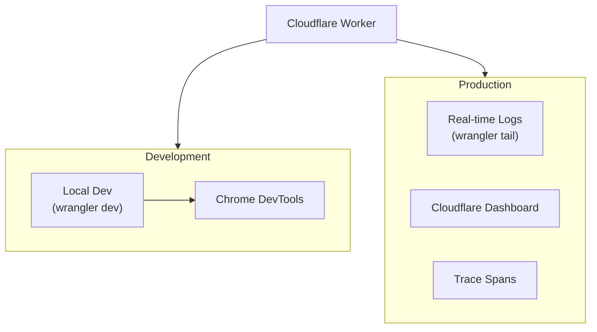

# How to Debug Cloudflare Workers

Author: [nawazdhandala](https://www.github.com/nawazdhandala)

Tags: Cloudflare, Cloudflare Workers, Debugging, Serverless, Wrangler, Logging

Description: Learn practical techniques for debugging Cloudflare Workers in development and production environments.

---

> Debugging serverless functions presents unique challenges since you do not have direct server access. Cloudflare provides several tools to help you identify and fix issues in your Workers, from local development to production troubleshooting.

Finding bugs in distributed systems requires the right tools and techniques. Here is how to debug Workers effectively.

---

## Overview



---

## Local Development Debugging

### Start Local Dev Server

Use Wrangler to run your Worker locally with full debugging support:

```bash
# Start local dev server with remote resources
wrangler dev

# Start with local-only mode (no network calls to Cloudflare)
wrangler dev --local

# Start on a specific port
wrangler dev --port 8787

# Enable inspector for Chrome DevTools
wrangler dev --inspector-port 9229
```

### Connect Chrome DevTools

Debug your Worker with Chrome DevTools:

1. Start wrangler dev with inspector enabled
2. Open `chrome://inspect` in Chrome
3. Click "Configure" and add `localhost:9229`
4. Click "inspect" on your Worker

```typescript
// src/worker.ts
export default {
  async fetch(request: Request): Promise<Response> {
    // Set a breakpoint here in DevTools
    const url = new URL(request.url);

    // Inspect variables in the debugger
    const params = Object.fromEntries(url.searchParams);

    // Step through this function
    const result = processRequest(params);

    return Response.json(result);
  }
};

function processRequest(params: Record<string, string>): object {
  // Add a debugger statement to pause execution
  debugger;

  return {
    received: params,
    processed: true
  };
}
```

---

## Console Logging

### Structured Logging

Use structured logging for better log analysis:

```typescript
// src/logger.ts
type LogLevel = "debug" | "info" | "warn" | "error";

interface LogEntry {
  level: LogLevel;
  message: string;
  timestamp: string;
  requestId?: string;
  [key: string]: unknown;
}

class Logger {
  private requestId: string;

  constructor(requestId?: string) {
    this.requestId = requestId || crypto.randomUUID();
  }

  private log(level: LogLevel, message: string, data?: Record<string, unknown>): void {
    const entry: LogEntry = {
      level,
      message,
      timestamp: new Date().toISOString(),
      requestId: this.requestId,
      ...data
    };

    // Use appropriate console method for log level
    switch (level) {
      case "debug":
        console.debug(JSON.stringify(entry));
        break;
      case "info":
        console.log(JSON.stringify(entry));
        break;
      case "warn":
        console.warn(JSON.stringify(entry));
        break;
      case "error":
        console.error(JSON.stringify(entry));
        break;
    }
  }

  debug(message: string, data?: Record<string, unknown>): void {
    this.log("debug", message, data);
  }

  info(message: string, data?: Record<string, unknown>): void {
    this.log("info", message, data);
  }

  warn(message: string, data?: Record<string, unknown>): void {
    this.log("warn", message, data);
  }

  error(message: string, data?: Record<string, unknown>): void {
    this.log("error", message, data);
  }
}

export { Logger };
```

### Use Logger in Worker

```typescript
// src/worker.ts
import { Logger } from "./logger";

export default {
  async fetch(request: Request): Promise<Response> {
    // Create logger with request ID from header or generate new one
    const requestId = request.headers.get("x-request-id") || undefined;
    const logger = new Logger(requestId);

    logger.info("Request received", {
      method: request.method,
      url: request.url,
      userAgent: request.headers.get("user-agent")
    });

    try {
      const result = await handleRequest(request, logger);

      logger.info("Request completed", {
        status: 200
      });

      return Response.json(result);

    } catch (error) {
      logger.error("Request failed", {
        error: error instanceof Error ? error.message : "Unknown error",
        stack: error instanceof Error ? error.stack : undefined
      });

      return Response.json(
        { error: "Internal server error" },
        { status: 500 }
      );
    }
  }
};

async function handleRequest(
  request: Request,
  logger: Logger
): Promise<object> {
  logger.debug("Processing request");

  // Your business logic here

  return { success: true };
}
```

---

## Production Log Tailing

### Real-time Logs with Wrangler

Stream logs from production Workers:

```bash
# Tail logs from production Worker
wrangler tail

# Filter by status code
wrangler tail --status error

# Filter by specific search term
wrangler tail --search "payment"

# Filter by HTTP method
wrangler tail --method POST

# Filter by IP address
wrangler tail --ip 192.168.1.1

# Output as JSON for parsing
wrangler tail --format json

# Sample logs (useful for high-traffic Workers)
wrangler tail --sampling-rate 0.1
```

### Parse Log Output

Process logs programmatically:

```bash
# Stream logs to file
wrangler tail --format json > worker-logs.json

# Filter and analyze with jq
wrangler tail --format json | jq 'select(.logs[].message | contains("error"))'

# Count errors per minute
wrangler tail --format json | jq -r '.logs[].timestamp' | cut -d: -f1-2 | uniq -c
```

---

## Error Handling and Stack Traces

### Capture Error Context

Wrap handlers to capture detailed error information:

```typescript
// src/error-handler.ts
interface ErrorContext {
  requestId: string;
  url: string;
  method: string;
  timestamp: string;
  error: {
    name: string;
    message: string;
    stack?: string;
  };
}

export function withErrorHandling(
  handler: (request: Request) => Promise<Response>
): (request: Request) => Promise<Response> {
  return async (request: Request): Promise<Response> => {
    const requestId = crypto.randomUUID();

    try {
      // Add request ID to response headers for correlation
      const response = await handler(request);
      const headers = new Headers(response.headers);
      headers.set("x-request-id", requestId);

      return new Response(response.body, {
        status: response.status,
        headers
      });

    } catch (error) {
      const context: ErrorContext = {
        requestId,
        url: request.url,
        method: request.method,
        timestamp: new Date().toISOString(),
        error: {
          name: error instanceof Error ? error.name : "UnknownError",
          message: error instanceof Error ? error.message : String(error),
          stack: error instanceof Error ? error.stack : undefined
        }
      };

      // Log full error context
      console.error("Unhandled error:", JSON.stringify(context, null, 2));

      // Return error response with request ID
      return Response.json(
        {
          error: "Internal server error",
          requestId
        },
        {
          status: 500,
          headers: { "x-request-id": requestId }
        }
      );
    }
  };
}
```

### Use Error Handler

```typescript
// src/worker.ts
import { withErrorHandling } from "./error-handler";

async function handleRequest(request: Request): Promise<Response> {
  const url = new URL(request.url);

  if (url.pathname === "/api/users") {
    // This error will be caught and logged with full context
    throw new Error("Database connection failed");
  }

  return Response.json({ status: "ok" });
}

export default {
  fetch: withErrorHandling(handleRequest)
};
```

---

## Request Tracing

### Implement Trace Context

Track requests across multiple Workers or services:

```typescript
// src/tracing.ts
interface TraceContext {
  traceId: string;
  spanId: string;
  parentSpanId?: string;
}

interface Span {
  name: string;
  traceId: string;
  spanId: string;
  parentSpanId?: string;
  startTime: number;
  endTime?: number;
  attributes: Record<string, unknown>;
  events: Array<{ name: string; timestamp: number; attributes?: Record<string, unknown> }>;
}

class Tracer {
  private spans: Span[] = [];
  private context: TraceContext;

  constructor(parentContext?: TraceContext) {
    this.context = {
      traceId: parentContext?.traceId || this.generateId(),
      spanId: this.generateId(),
      parentSpanId: parentContext?.spanId
    };
  }

  private generateId(): string {
    return crypto.randomUUID().replace(/-/g, "").substring(0, 16);
  }

  startSpan(name: string, attributes?: Record<string, unknown>): Span {
    const span: Span = {
      name,
      traceId: this.context.traceId,
      spanId: this.generateId(),
      parentSpanId: this.context.spanId,
      startTime: Date.now(),
      attributes: attributes || {},
      events: []
    };

    this.spans.push(span);
    return span;
  }

  endSpan(span: Span): void {
    span.endTime = Date.now();
  }

  addEvent(span: Span, name: string, attributes?: Record<string, unknown>): void {
    span.events.push({
      name,
      timestamp: Date.now(),
      attributes
    });
  }

  getTraceId(): string {
    return this.context.traceId;
  }

  exportSpans(): Span[] {
    return this.spans;
  }
}

export { Tracer, TraceContext, Span };
```

### Trace Worker Requests

```typescript
// src/worker.ts
import { Tracer, TraceContext } from "./tracing";

export default {
  async fetch(request: Request): Promise<Response> {
    // Extract trace context from headers if present
    const parentContext = extractTraceContext(request);
    const tracer = new Tracer(parentContext);

    // Start root span for this request
    const rootSpan = tracer.startSpan("handle-request", {
      "http.method": request.method,
      "http.url": request.url
    });

    try {
      // Create child span for database operation
      const dbSpan = tracer.startSpan("database-query", {
        "db.system": "postgresql",
        "db.operation": "SELECT"
      });

      const data = await queryDatabase();
      tracer.endSpan(dbSpan);

      // Create child span for response serialization
      const serializeSpan = tracer.startSpan("serialize-response");
      const body = JSON.stringify(data);
      tracer.endSpan(serializeSpan);

      rootSpan.attributes["http.status_code"] = 200;
      tracer.endSpan(rootSpan);

      // Log all spans for debugging
      console.log("Trace:", JSON.stringify(tracer.exportSpans(), null, 2));

      return new Response(body, {
        headers: {
          "Content-Type": "application/json",
          "x-trace-id": tracer.getTraceId()
        }
      });

    } catch (error) {
      tracer.addEvent(rootSpan, "error", {
        "error.message": error instanceof Error ? error.message : "Unknown"
      });
      rootSpan.attributes["http.status_code"] = 500;
      tracer.endSpan(rootSpan);

      console.log("Trace (error):", JSON.stringify(tracer.exportSpans(), null, 2));

      return Response.json({ error: "Internal error" }, { status: 500 });
    }
  }
};

function extractTraceContext(request: Request): TraceContext | undefined {
  const traceParent = request.headers.get("traceparent");
  if (!traceParent) return undefined;

  // Parse W3C Trace Context format
  const parts = traceParent.split("-");
  if (parts.length !== 4) return undefined;

  return {
    traceId: parts[1],
    spanId: parts[2]
  };
}

async function queryDatabase(): Promise<object> {
  // Simulated database query
  return { users: [] };
}
```

---

## Environment-Specific Debugging

### Configure Debug Mode

Enable additional logging in development:

```toml
# wrangler.toml
[vars]
DEBUG = "false"

[env.development]
vars = { DEBUG = "true" }

[env.staging]
vars = { DEBUG = "true" }

[env.production]
vars = { DEBUG = "false" }
```

### Conditional Debug Logging

```typescript
// src/worker.ts
export interface Env {
  DEBUG: string;
}

class DebugLogger {
  private enabled: boolean;

  constructor(enabled: boolean) {
    this.enabled = enabled;
  }

  log(message: string, data?: unknown): void {
    if (this.enabled) {
      console.log(`[DEBUG] ${message}`, data ? JSON.stringify(data) : "");
    }
  }

  time(label: string): () => void {
    if (!this.enabled) return () => {};

    const start = Date.now();
    return () => {
      console.log(`[DEBUG] ${label}: ${Date.now() - start}ms`);
    };
  }
}

export default {
  async fetch(request: Request, env: Env): Promise<Response> {
    const debug = new DebugLogger(env.DEBUG === "true");

    debug.log("Request received", {
      method: request.method,
      url: request.url
    });

    const endTimer = debug.time("process-request");

    // Process request
    const result = await processRequest(request);

    endTimer();

    debug.log("Response prepared", { status: 200 });

    return Response.json(result);
  }
};

async function processRequest(request: Request): Promise<object> {
  return { success: true };
}
```

---

## Testing Strategies

### Unit Testing with Miniflare

Test Workers locally with Miniflare:

```typescript
// test/worker.test.ts
import { Miniflare } from "miniflare";
import { describe, it, expect, beforeAll, afterAll } from "vitest";

describe("Worker", () => {
  let mf: Miniflare;

  beforeAll(async () => {
    mf = new Miniflare({
      scriptPath: "./dist/worker.js",
      kvNamespaces: ["MY_KV"],
      bindings: {
        DEBUG: "true"
      }
    });
  });

  afterAll(async () => {
    await mf.dispose();
  });

  it("should return 200 for valid requests", async () => {
    const response = await mf.dispatchFetch("http://localhost/api/users");

    expect(response.status).toBe(200);

    const body = await response.json();
    expect(body).toHaveProperty("success", true);
  });

  it("should return 404 for unknown routes", async () => {
    const response = await mf.dispatchFetch("http://localhost/unknown");

    expect(response.status).toBe(404);
  });

  it("should handle errors gracefully", async () => {
    const response = await mf.dispatchFetch("http://localhost/api/error");

    expect(response.status).toBe(500);

    const body = await response.json();
    expect(body).toHaveProperty("error");
    expect(body).toHaveProperty("requestId");
  });
});
```

### Integration Testing

Test with actual Cloudflare services:

```typescript
// test/integration.test.ts
import { unstable_dev } from "wrangler";
import type { UnstableDevWorker } from "wrangler";
import { describe, it, expect, beforeAll, afterAll } from "vitest";

describe("Worker Integration", () => {
  let worker: UnstableDevWorker;

  beforeAll(async () => {
    worker = await unstable_dev("src/worker.ts", {
      experimental: { disableExperimentalWarning: true }
    });
  });

  afterAll(async () => {
    await worker.stop();
  });

  it("should handle POST requests", async () => {
    const response = await worker.fetch("/api/data", {
      method: "POST",
      headers: { "Content-Type": "application/json" },
      body: JSON.stringify({ key: "value" })
    });

    expect(response.status).toBe(200);
  });
});
```

---

## Common Debugging Scenarios

### Memory Issues

```typescript
// Monitor memory usage
export default {
  async fetch(request: Request): Promise<Response> {
    // Check if you are accumulating data
    const largeData: unknown[] = [];

    // Bad: Accumulating in module scope persists across requests
    // largeData.push(await request.json());

    // Good: Process and release within request
    const data = await request.json();
    const result = processData(data);

    return Response.json(result);
  }
};

function processData(data: unknown): object {
  // Process without storing references
  return { processed: true };
}
```

### CPU Time Limits

```typescript
// Debug CPU-intensive operations
export default {
  async fetch(request: Request): Promise<Response> {
    const start = Date.now();

    // Break up CPU-intensive work
    const items = await getItems();
    const results = [];

    for (const item of items) {
      // Log progress for debugging
      if (results.length % 100 === 0) {
        console.log(`Processed ${results.length} items, elapsed: ${Date.now() - start}ms`);
      }

      // Check if approaching limit (50ms for free, more for paid)
      if (Date.now() - start > 40) {
        console.warn("Approaching CPU limit, stopping early");
        break;
      }

      results.push(processItem(item));
    }

    return Response.json({
      processed: results.length,
      total: items.length,
      duration: Date.now() - start
    });
  }
};

async function getItems(): Promise<unknown[]> {
  return [];
}

function processItem(item: unknown): unknown {
  return item;
}
```

---

## Best Practices

1. **Use structured logging** - JSON format enables better log parsing and analysis
2. **Include request IDs** - Correlate logs across distributed services
3. **Set up wrangler tail** - Monitor production issues in real-time
4. **Test locally first** - Use wrangler dev and Miniflare before deploying
5. **Handle errors explicitly** - Catch and log all errors with context
6. **Use environment variables** - Enable verbose logging only in dev/staging

---

## Conclusion

Debugging Cloudflare Workers requires a combination of local development tools and production monitoring. Key takeaways:

- **Local debugging** with wrangler dev and Chrome DevTools provides a familiar experience
- **Structured logging** makes production issues easier to diagnose
- **Wrangler tail** streams real-time logs from production
- **Request tracing** helps track issues across distributed systems

---

*Need better visibility into your Workers? [OneUptime](https://oneuptime.com) provides comprehensive monitoring with distributed tracing, error tracking, and performance metrics for serverless applications.*
